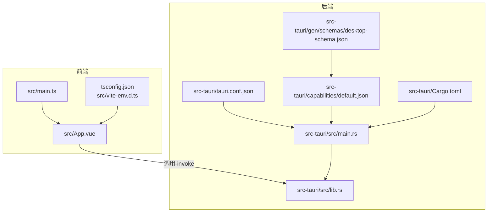
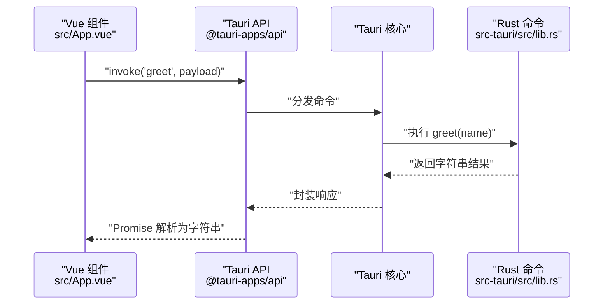
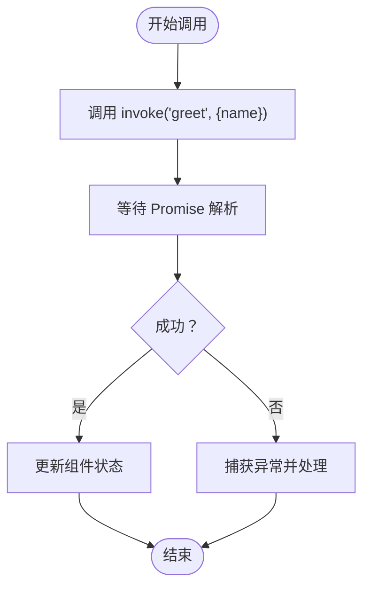
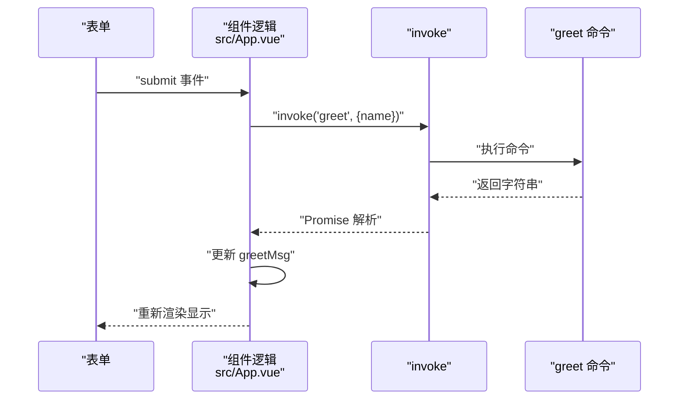
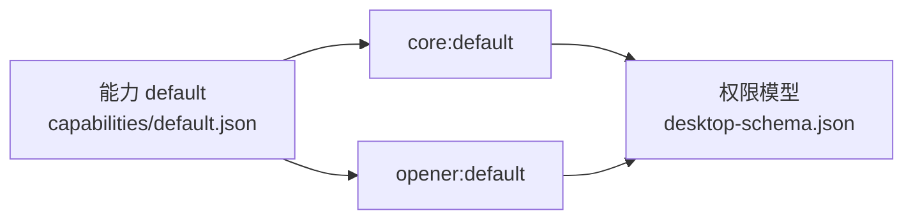
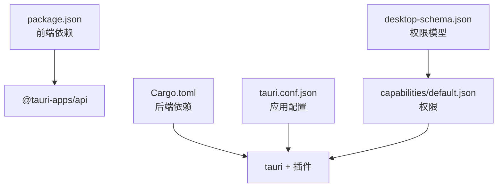

# API 参考

<cite>
**本文引用的文件**
- [src-tauri/src/lib.rs](file://src-tauri/src/lib.rs)
- [src-tauri/src/main.rs](file://src-tauri/src/main.rs)
- [src/App.vue](file://src/App.vue)
- [src/main.ts](file://src/main.ts)
- [src-tauri/tauri.conf.json](file://src-tauri/tauri.conf.json)
- [package.json](file://package.json)
- [src-tauri/Cargo.toml](file://src-tauri/Cargo.toml)
- [src-tauri/capabilities/default.json](file://src-tauri/capabilities/default.json)
- [src/vite-env.d.ts](file://src/vite-env.d.ts)
- [tsconfig.json](file://tsconfig.json)
- [src-tauri/gen/schemas/desktop-schema.json](file://src-tauri/gen/schemas/desktop-schema.json)
</cite>

## 目录
1. [简介](#简介)
2. [项目结构](#项目结构)
3. [核心组件](#核心组件)
4. [架构总览](#架构总览)
5. [详细组件分析](#详细组件分析)
6. [依赖关系分析](#依赖关系分析)
7. [性能考量](#性能考量)
8. [故障排查指南](#故障排查指南)
9. [结论](#结论)
10. [附录](#附录)

## 简介
本文件为 Tauri + Vue 应用的完整 API 参考，聚焦于前端通过 @tauri-apps/api 调用后端 Rust 命令的流程与规范，覆盖以下主题：
- Tauri 命令：当前项目暴露 greet 命令，参数与返回值规范、调用方式与示例
- invoke 调用模式：同步/异步差异、错误处理与超时设置
- Vue 组件中的集成：在组件中调用后端命令、处理响应数据
- 类型安全：参数校验、返回值类型检查与 TypeScript 类型定义
- 系统集成 API：文件系统、进程管理、网络请求等能力的权限与使用边界
- 最佳实践：错误处理策略、性能优化建议、安全注意事项
- 迁移与兼容：版本演进与向后兼容说明

## 项目结构
该仓库采用典型的 Tauri 前后端分离结构：
- 前端（Vue + Vite + TypeScript）位于 src 目录，负责 UI 与调用后端命令
- 后端（Rust）位于 src-tauri 目录，负责命令实现与系统能力集成
- 配置文件（tauri.conf.json、Cargo.toml、capabilities/default.json）控制应用行为与权限

**图表来源**
- [src/App.vue:1-160](file://src/App.vue#L1-L160)
- [src/main.ts:1-5](file://src/main.ts#L1-L5)
- [src-tauri/src/lib.rs:1-15](file://src-tauri/src/lib.rs#L1-L15)
- [src-tauri/src/main.rs:1-7](file://src-tauri/src/main.rs#L1-L7)
- [src-tauri/tauri.conf.json:1-36](file://src-tauri/tauri.conf.json#L1-L36)
- [src-tauri/capabilities/default.json:1-11](file://src-tauri/capabilities/default.json#L1-L11)
- [src-tauri/Cargo.toml:1-26](file://src-tauri/Cargo.toml#L1-L26)
- [src-tauri/gen/schemas/desktop-schema.json:1-800](file://src-tauri/gen/schemas/desktop-schema.json#L1-L800)

**章节来源**
- [src/App.vue:1-160](file://src/App.vue#L1-L160)
- [src/main.ts:1-5](file://src/main.ts#L1-L5)
- [src-tauri/src/lib.rs:1-15](file://src-tauri/src/lib.rs#L1-L15)
- [src-tauri/src/main.rs:1-7](file://src-tauri/src/main.rs#L1-L7)
- [src-tauri/tauri.conf.json:1-36](file://src-tauri/tauri.conf.json#L1-L36)
- [src-tauri/capabilities/default.json:1-11](file://src-tauri/capabilities/default.json#L1-L11)
- [src-tauri/Cargo.toml:1-26](file://src-tauri/Cargo.toml#L1-L26)
- [src-tauri/gen/schemas/desktop-schema.json:1-800](file://src-tauri/gen/schemas/desktop-schema.json#L1-L800)

## 核心组件
- 前端调用入口：@tauri-apps/api 的 invoke 函数，用于向后端发送命令并接收结果
- 后端命令注册：通过 #[tauri::command] 定义命令，由 Builder::invoke_handler 注册
- 权限与能力：capabilities/default.json 控制窗口可使用的权限集合，desktop-schema.json 提供权限模型与校验

**章节来源**
- [src/App.vue:1-160](file://src/App.vue#L1-L160)
- [src-tauri/src/lib.rs:1-15](file://src-tauri/src/lib.rs#L1-L15)
- [src-tauri/capabilities/default.json:1-11](file://src-tauri/capabilities/default.json#L1-L11)
- [src-tauri/gen/schemas/desktop-schema.json:1-800](file://src-tauri/gen/schemas/desktop-schema.json#L1-L800)

## 架构总览
下图展示了从前端到后端的调用链路与权限边界。

**图表来源**
- [src/App.vue:8-11](file://src/App.vue#L8-L11)
- [src-tauri/src/lib.rs:2-5](file://src-tauri/src/lib.rs#L2-L5)

**章节来源**
- [src/App.vue:1-160](file://src/App.vue#L1-L160)
- [src-tauri/src/lib.rs:1-15](file://src-tauri/src/lib.rs#L1-L15)

## 详细组件分析

### greet 命令 API 规范
- 命令名称：greet
- 参数：
  - name: 字符串（必填）
- 返回值：
  - 字符串（UTF-8 文本）
- 调用示例（路径引用）：
  - 前端调用位置：[src/App.vue:8-11](file://src/App.vue#L8-L11)
  - 后端命令定义：[src-tauri/src/lib.rs:2-5](file://src-tauri/src/lib.rs#L2-L5)
- 类型安全要点：
  - 参数与返回值均为简单标量类型，编译期与运行期均具备基础类型约束
  - 前端通过 TypeScript 类型系统进行静态检查（见“类型安全”章节）

**章节来源**
- [src/App.vue:8-11](file://src/App.vue#L8-L11)
- [src-tauri/src/lib.rs:2-5](file://src-tauri/src/lib.rs#L2-L5)

### invoke 调用模式与错误处理
- 调用模式
  - 异步调用：invoke 返回 Promise，需使用 await 或 .then 处理
  - 同步调用：Tauri 不提供同步 invoke；若需要阻塞式行为，请在后端命令中自行实现或通过事件机制解耦
- 错误处理
  - 命令不存在或未注册：抛出异常（例如“unknown command”）
  - 参数类型不匹配：抛出异常（例如“invalid type”）
  - 权限不足：抛出异常（例如“access denied”）
  - 建议：在组件中使用 try/catch 包裹 await invoke，并对错误进行用户友好提示
- 超时设置
  - 当前仓库未配置超时参数；如需超时控制，可在上层封装一层带超时的工具函数（例如基于 AbortSignal 的取消机制）

**图表来源**
- [src/App.vue:8-11](file://src/App.vue#L8-L11)

**章节来源**
- [src/App.vue:1-160](file://src/App.vue#L1-L160)

### Vue 组件中的 Tauri API 集成
- 导入与状态
  - 导入 invoke：[src/App.vue:3](file://src/App.vue#L3)
  - 使用 ref 管理输入与输出：[src/App.vue:5-6](file://src/App.vue#L5-L6)
- 调用流程
  - 表单提交触发异步 greet：[src/App.vue:31-11](file://src/App.vue#L31-L11)
  - 将返回的字符串赋值给响应式变量：[src/App.vue:10](file://src/App.vue#L10)
- 模板渲染
  - 展示问候消息：[src/App.vue:35](file://src/App.vue#L35)

**图表来源**
- [src/App.vue:31-11](file://src/App.vue#L31-L11)
- [src/App.vue:10](file://src/App.vue#L10)

**章节来源**
- [src/App.vue:1-160](file://src/App.vue#L1-L160)

### 类型安全与 TypeScript 类型定义
- 前端类型
  - TypeScript 编译器选项严格：[tsconfig.json:17-21](file://tsconfig.json#L17-L21)
  - 模块声明：Vue 文件模块解析：[src/vite-env.d.ts:3-7](file://src/vite-env.d.ts#L3-L7)
- 命令参数与返回值
  - greet(name: string) -> string：参数与返回值均为简单类型，天然具备类型一致性
  - 在复杂场景中，可通过自定义接口与泛型进行扩展（例如定义 Payload 接口与 Result 泛型），但当前项目未引入
- 类型生成与校验
  - Tauri 2.x 支持基于 schema 的类型生成与校验；当前项目已生成 desktop-schema.json，可用于权限与能力的类型约束

**章节来源**
- [tsconfig.json:1-26](file://tsconfig.json#L1-L26)
- [src/vite-env.d.ts:1-8](file://src/vite-env.d.ts#L1-L8)
- [src-tauri/gen/schemas/desktop-schema.json:1-800](file://src-tauri/gen/schemas/desktop-schema.json#L1-L800)

### 系统集成 API 参考（基于权限与能力）
- 能力与权限
  - 默认能力 default：允许 core 与 opener 插件默认权限：[src-tauri/capabilities/default.json:6-9](file://src-tauri/capabilities/default.json#L6-L9)
  - 权限模型来自 desktop-schema.json：[src-tauri/gen/schemas/desktop-schema.json:344-526](file://src-tauri/gen/schemas/desktop-schema.json#L344-L526)
- 已启用插件
  - opener 插件：用于打开 URL/文件路径与在资源管理器中定位条目：[src-tauri/Cargo.toml:22](file://src-tauri/Cargo.toml#L22)
  - opener 命令在默认能力中被授权：[src-tauri/capabilities/default.json:8](file://src-tauri/capabilities/default.json#L8)
- 其他常用能力
  - 文件系统读写：通过 fs 权限集授予（需在能力文件中显式添加）
  - 进程管理：通过 shell 权限集授予（需在能力文件中显式添加）
  - 网络请求：通过 http 权限集授予（需在能力文件中显式添加）

**图表来源**
- [src-tauri/capabilities/default.json:1-11](file://src-tauri/capabilities/default.json#L1-L11)
- [src-tauri/gen/schemas/desktop-schema.json:1-800](file://src-tauri/gen/schemas/desktop-schema.json#L1-L800)

**章节来源**
- [src-tauri/capabilities/default.json:1-11](file://src-tauri/capabilities/default.json#L1-L11)
- [src-tauri/gen/schemas/desktop-schema.json:1-800](file://src-tauri/gen/schemas/desktop-schema.json#L1-L800)
- [src-tauri/Cargo.toml:20-25](file://src-tauri/Cargo.toml#L20-L25)

## 依赖关系分析
- 前端依赖
  - Vue 3、@tauri-apps/api、@tauri-apps/plugin-opener
- 后端依赖
  - tauri、tauri-plugin-opener、serde/serde_json
- 配置依赖
  - tauri.conf.json 控制窗口、构建、打包与安全策略
  - capabilities/default.json 控制权限范围
  - desktop-schema.json 提供权限与能力的 JSON Schema

**图表来源**
- [package.json:12-23](file://package.json#L12-L23)
- [src-tauri/Cargo.toml:20-25](file://src-tauri/Cargo.toml#L20-L25)
- [src-tauri/tauri.conf.json:1-36](file://src-tauri/tauri.conf.json#L1-L36)
- [src-tauri/capabilities/default.json:1-11](file://src-tauri/capabilities/default.json#L1-L11)
- [src-tauri/gen/schemas/desktop-schema.json:1-800](file://src-tauri/gen/schemas/desktop-schema.json#L1-L800)

**章节来源**
- [package.json:1-25](file://package.json#L1-L25)
- [src-tauri/Cargo.toml:1-26](file://src-tauri/Cargo.toml#L1-L26)
- [src-tauri/tauri.conf.json:1-36](file://src-tauri/tauri.conf.json#L1-L36)
- [src-tauri/capabilities/default.json:1-11](file://src-tauri/capabilities/default.json#L1-L11)
- [src-tauri/gen/schemas/desktop-schema.json:1-800](file://src-tauri/gen/schemas/desktop-schema.json#L1-L800)

## 性能考量
- 命令粒度
  - 将高频操作拆分为细粒度命令，避免一次性传输大量数据
- 数据序列化
  - 使用 serde/serde_json 进行高效序列化；尽量避免大对象的频繁往返
- UI 更新
  - 使用响应式状态更新视图，减少不必要的重渲染
- 并发控制
  - 对于耗时命令，建议在前端使用节流/防抖与并发队列控制

## 故障排查指南
- 常见错误与定位
  - “unknown command”：确认命令已在 invoke_handler 中注册且拼写正确
  - “invalid type”：检查参数类型是否与命令签名一致
  - “access denied”：检查 capabilities/default.json 是否包含所需权限
- 日志与调试
  - 在开发环境使用浏览器开发者工具观察网络与控制台日志
  - 在后端使用标准日志输出辅助定位（需在 Rust 侧增加日志语句）
- 权限问题
  - 若出现权限相关异常，核对 desktop-schema.json 中的权限标识与 capabilities/default.json 的 allow/deny 列表

**章节来源**
- [src-tauri/capabilities/default.json:1-11](file://src-tauri/capabilities/default.json#L1-L11)
- [src-tauri/gen/schemas/desktop-schema.json:1-800](file://src-tauri/gen/schemas/desktop-schema.json#L1-L800)

## 结论
本项目提供了最小可行的 Tauri + Vue 集成示例，展示了 greet 命令的定义与调用、invoke 的异步使用模式以及基于能力与权限的系统集成边界。建议在实际项目中：
- 明确命令职责与参数契约，保持类型安全
- 通过能力与权限模型限制系统访问范围
- 在前端完善错误处理与用户体验反馈
- 随着功能扩展逐步引入更丰富的命令与权限

## 附录

### API 使用最佳实践
- 错误处理策略
  - 在组件中统一 try/catch 包裹 invoke 调用
  - 对不同类型的错误进行分类处理（命令不存在、参数错误、权限不足）
- 性能优化建议
  - 合理拆分命令，避免一次性传输大数据
  - 使用响应式状态驱动 UI，减少重复计算
- 安全考虑
  - 仅授予必要权限，遵循最小权限原则
  - 对外部输入进行严格校验与白名单控制

### 迁移与向后兼容性说明
- 版本升级
  - Tauri 2.x 与 1.x 在命令注册与权限模型上有显著差异，升级时需：
    - 更新命令注册方式（generate_handler 与 invoke_handler）
    - 重构权限模型，从旧版策略迁移到 capabilities + desktop-schema.json
- 兼容性
  - 前端 @tauri-apps/api 2.x 与 1.x 在 API 表面保持稳定，但内部实现有改进
  - 建议在升级时进行端到端回归测试，确保命令调用与权限行为符合预期