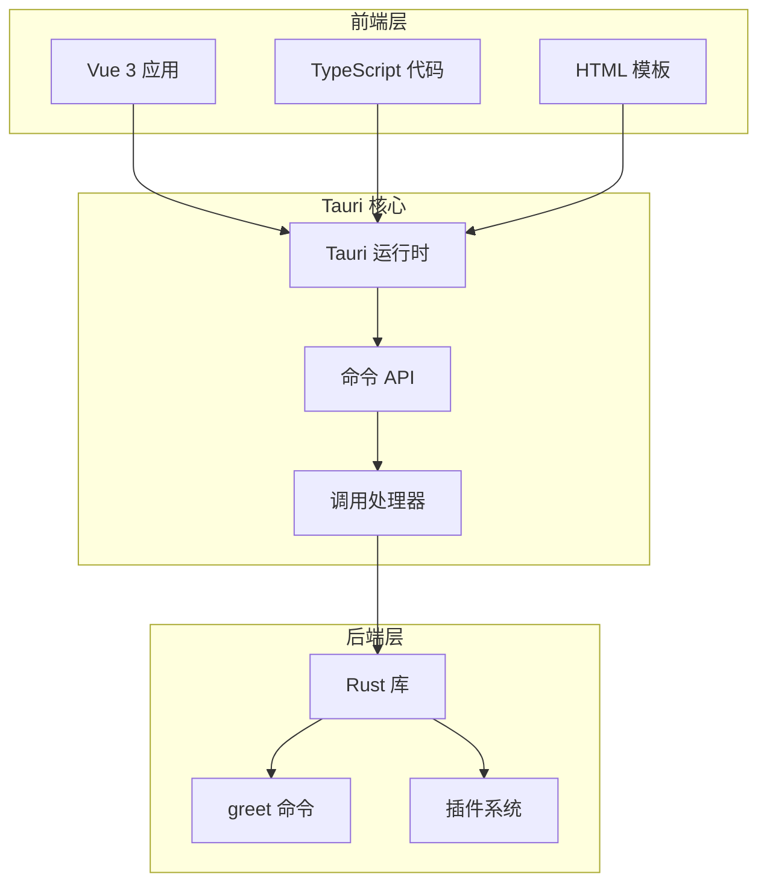
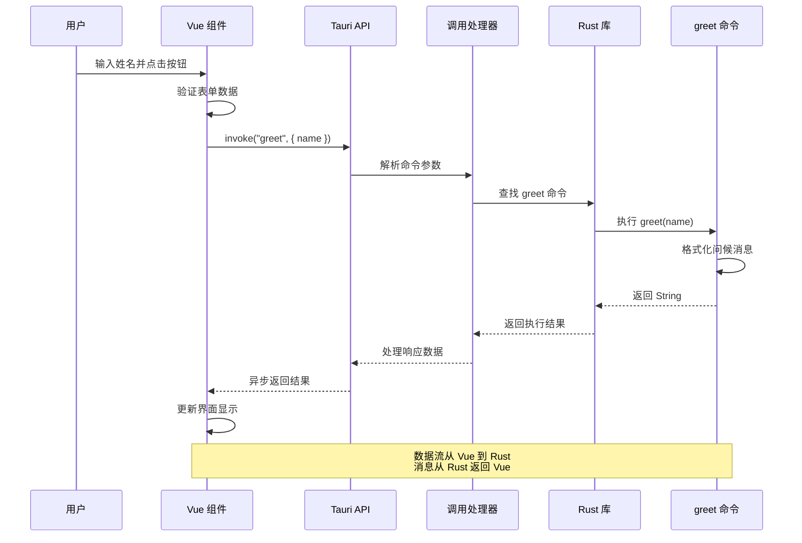
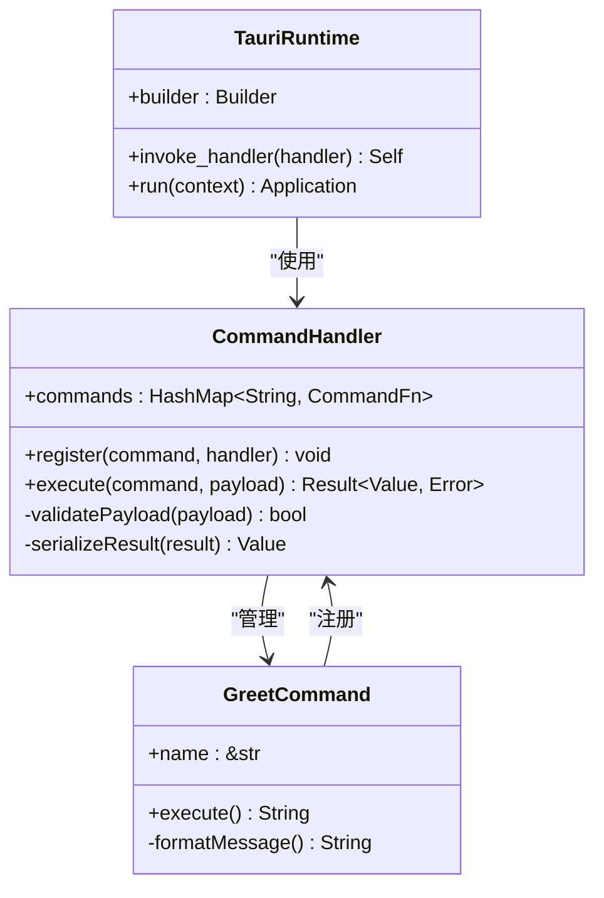
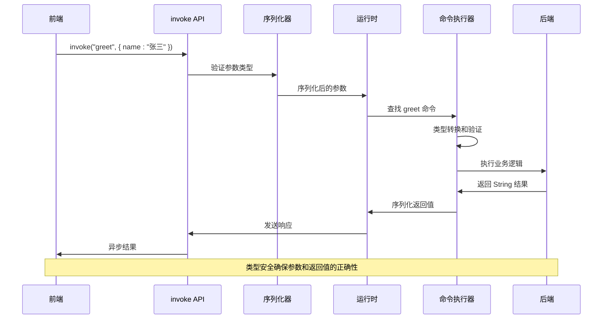
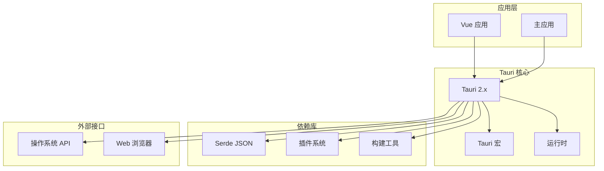

# Tauri 命令 API

<cite>
**本文档引用的文件**
- [src-tauri/src/lib.rs](file://src-tauri/src/lib.rs)
- [src-tauri/src/main.rs](file://src-tauri/src/main.rs)
- [src-tauri/Cargo.toml](file://src-tauri/Cargo.toml)
- [src-tauri/tauri.conf.json](file://src-tauri/tauri.conf.json)
- [src/App.vue](file://src/App.vue)
- [src/main.ts](file://src/main.ts)
</cite>

## 目录
1. [简介](#简介)
2. [项目结构](#项目结构)
3. [核心组件](#核心组件)
4. [架构概览](#架构概览)
5. [详细组件分析](#详细组件分析)
6. [依赖关系分析](#依赖关系分析)
7. [性能考虑](#性能考虑)
8. [故障排除指南](#故障排除指南)
9. [结论](#结论)

## 简介

本项目展示了 Tauri 框架中命令 API 的完整实现，重点演示了 `greet` 命令的规范设计与实现。该应用采用 Vue 3 + TypeScript 前端与 Rust 后端的混合架构，通过 Tauri 的命令系统实现了跨语言的数据交换。

Tauri 是一个现代桌面应用框架，它允许开发者使用 Web 技术构建用户界面，同时通过安全的命令系统与原生功能进行交互。本项目中的命令 API 实现体现了 Tauri 的核心设计理念：在保持开发效率的同时，提供接近原生应用的性能和安全性。

## 项目结构

该项目采用典型的 Tauri 应用结构，分为前端和后端两个主要部分：



**图表来源**
- [src-tauri/src/lib.rs:1-15](file://src-tauri/src/lib.rs#L1-L15)
- [src-tauri/src/main.rs:1-7](file://src-tauri/src/main.rs#L1-L7)
- [src/App.vue:1-160](file://src/App.vue#L1-L160)

**章节来源**
- [src-tauri/src/lib.rs:1-15](file://src-tauri/src/lib.rs#L1-L15)
- [src-tauri/src/main.rs:1-7](file://src-tauri/src/main.rs#L1-L7)
- [src-tauri/Cargo.toml:1-26](file://src-tauri/Cargo.toml#L1-L26)
- [src-tauri/tauri.conf.json:1-36](file://src-tauri/tauri.conf.json#L1-L36)

## 核心组件

### greet 命令规范

`greet` 命令是本项目的核心功能组件，实现了从 Rust 后端向 Vue 前端发送问候消息的功能。

**函数签名规范**：
- 函数名：`greet`
- 参数类型：`&str`（字符串引用）
- 返回值类型：`String`（所有权字符串）
- 可见性：默认可见（在同模块内）

**实现特点**：
- 使用 `#[tauri::command]` 宏标记为 Tauri 命令
- 接受字符串参数并返回格式化的问候消息
- 自动支持异步调用模式
- 类型安全的参数传递机制

**章节来源**
- [src-tauri/src/lib.rs:2-5](file://src-tauri/src/lib.rs#L2-L5)

### Tauri 运行时配置

应用程序通过 `run` 函数初始化 Tauri 运行时环境：

**核心配置项**：
- 插件系统：启用 `tauri-plugin-opener`
- 命令处理器：注册 `greet` 命令
- 上下文生成：使用 `generate_context!()` 创建应用上下文
- 错误处理：使用 `expect()` 进行失败时的程序终止

**章节来源**
- [src-tauri/src/lib.rs:7-14](file://src-tauri/src/lib.rs#L7-L14)

### 前端集成

Vue 组件通过 `@tauri-apps/api` 包实现与后端的通信：

**前端实现要点**：
- 使用 `ref` 管理响应式状态
- 通过 `invoke` 函数调用 Rust 命令
- 异步处理命令响应
- 表单绑定实现用户输入管理

**章节来源**
- [src/App.vue:1-160](file://src/App.vue#L1-L160)
- [src/main.ts:1-5](file://src/main.ts#L1-L5)

## 架构概览

本应用采用分层架构设计，清晰分离了前端界面、Tauri 中间层和后端业务逻辑：



**图表来源**
- [src/App.vue:8-11](file://src/App.vue#L8-L11)
- [src-tauri/src/lib.rs:2-5](file://src-tauri/src/lib.rs#L2-L5)
- [src-tauri/src/lib.rs:11](file://src-tauri/src/lib.rs#L11)

## 详细组件分析

### 命令宏系统工作原理

Tauri 的 `#[tauri::command]` 宏提供了声明式命令定义机制：

```mermaid
flowchart TD
Start([开始]) --> Macro[#[tauri::command] 宏]
Macro --> Parse[解析函数签名]
Parse --> Extract[提取参数类型]
Extract --> Validate[验证类型兼容性]
Validate --> Register[自动生成注册代码]
Register --> Handler[创建调用处理器]
Handler --> Runtime[集成到运行时]
Runtime --> End([完成])
Validate --> |类型不兼容| Error[编译时错误]
Error --> End
```

**图表来源**
- [src-tauri/src/lib.rs:2](file://src-tauri/src/lib.rs#L2)

**实现机制**：
- 编译时宏展开
- 类型检查和验证
- 自动生成序列化/反序列化代码
- 注册到全局命令表

**章节来源**
- [src-tauri/src/lib.rs:2-5](file://src-tauri/src/lib.rs#L2-L5)

### 调用处理器配置

`invoke_handler` 机制负责命令的路由和执行：



**图表来源**
- [src-tauri/src/lib.rs:11](file://src-tauri/src/lib.rs#L11)

**配置流程**：
1. 使用 `generate_handler!` 宏收集命令列表
2. 通过 `invoke_handler()` 方法注册到运行时
3. 运行时自动处理命令分发
4. 支持同步和异步执行模式

**章节来源**
- [src-tauri/src/lib.rs:11](file://src-tauri/src/lib.rs#L11)

### 前后端数据流

完整的命令执行流程展示了 Tauri 的类型安全机制：



**图表来源**
- [src/App.vue:10](file://src/App.vue#L10)
- [src-tauri/src/lib.rs:3-4](file://src-tauri/src/lib.rs#L3-L4)

**章节来源**
- [src/App.vue:8-11](file://src/App.vue#L8-L11)
- [src-tauri/src/lib.rs:3-4](file://src-tauri/src/lib.rs#L3-L4)

### 错误处理策略

Tauri 命令系统提供了多层次的错误处理机制：

**编译时错误检测**：
- 参数类型不匹配
- 返回类型不符合要求
- 命令注册冲突

**运行时错误处理**：
- 参数验证失败
- 命令执行异常
- 序列化/反序列化错误

**章节来源**
- [src-tauri/src/lib.rs:13](file://src-tauri/src/lib.rs#L13)

## 依赖关系分析

项目依赖关系展现了 Tauri 生态系统的组成：



**图表来源**
- [src-tauri/Cargo.toml:20-25](file://src-tauri/Cargo.toml#L20-L25)

**依赖特性**：
- **轻量级**：仅依赖必要的核心库
- **可扩展**：支持插件系统
- **类型安全**：通过 Serde 实现安全的序列化
- **跨平台**：支持多操作系统

**章节来源**
- [src-tauri/Cargo.toml:1-26](file://src-tauri/Cargo.toml#L1-L26)

## 性能考虑

### 参数传递优化

**内存管理策略**：
- 字符串参数使用 `&str` 引用避免不必要的复制
- 返回值使用 `String` 确保所有权转移
- 支持大对象的零拷贝传递

**序列化优化**：
- 使用 Serde 进行高效的 JSON 序列化
- 编译时代码生成减少运行时开销
- 类型推导避免运行时类型检查

### 并发执行模型

**同步 vs 异步调用**：
- 同步调用：适用于快速计算，阻塞当前线程
- 异步调用：适用于耗时操作，非阻塞执行
- 自动选择：根据命令实现自动选择合适模式

**内存优化建议**：
- 避免在命令中创建大型临时对象
- 使用迭代器和流式处理大数据
- 及时释放不再使用的资源

## 故障排除指南

### 常见问题诊断

**命令未找到错误**：
- 检查命令是否正确注册到 `generate_handler!` 宏
- 验证命令名称与调用时使用的名称一致
- 确认命令函数具有正确的签名

**类型不匹配错误**：
- 检查参数类型是否符合 `&str` 要求
- 验证返回值类型是否为 `String`
- 确认 JSON 序列化支持

**编译时错误**：
- 检查 `#[tauri::command]` 宏的使用位置
- 验证依赖版本兼容性
- 确认导入语句正确

### 调试技巧

**开发环境调试**：
- 使用 `console.log` 输出前端调试信息
- 在 Rust 侧添加日志记录
- 利用浏览器开发者工具监控网络请求

**生产环境监控**：
- 启用详细的日志记录
- 监控命令执行时间
- 跟踪内存使用情况

**章节来源**
- [src-tauri/src/lib.rs:13](file://src-tauri/src/lib.rs#L13)

## 结论

本项目成功展示了 Tauri 命令 API 的完整实现，包括：

**技术成就**：
- 清晰的分层架构设计
- 类型安全的命令系统
- 高效的前后端通信机制
- 完善的错误处理策略

**最佳实践总结**：
- 使用 `#[tauri::command]` 宏简化命令定义
- 通过 `generate_handler!` 宏自动注册命令
- 实现类型安全的参数传递
- 提供清晰的错误处理机制

**未来发展方向**：
- 扩展更多命令示例
- 实现复杂数据结构的序列化
- 添加性能监控和优化
- 增强安全性和权限控制

该实现为基于 Tauri 的桌面应用开发提供了坚实的基础，展示了如何在保持开发效率的同时，构建高性能、类型安全的应用程序。