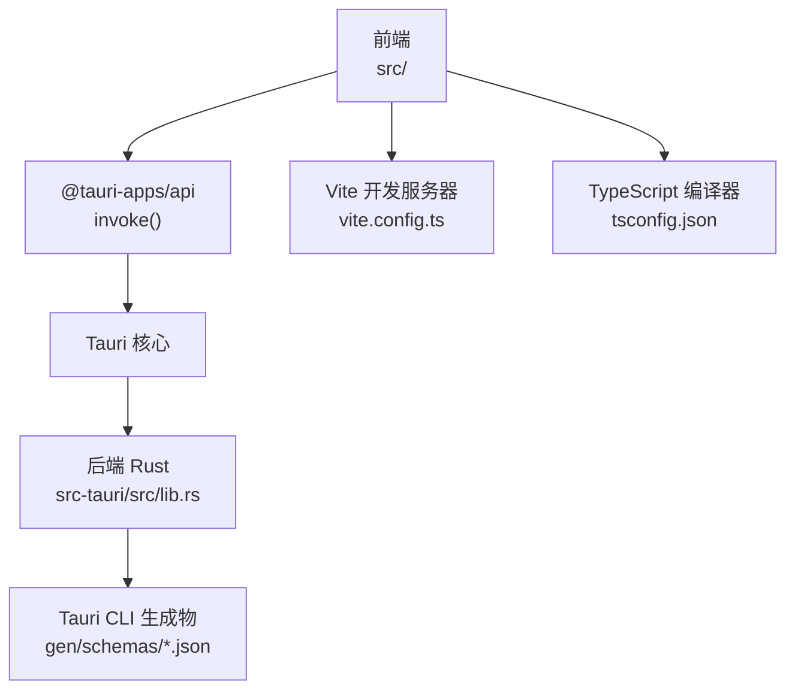
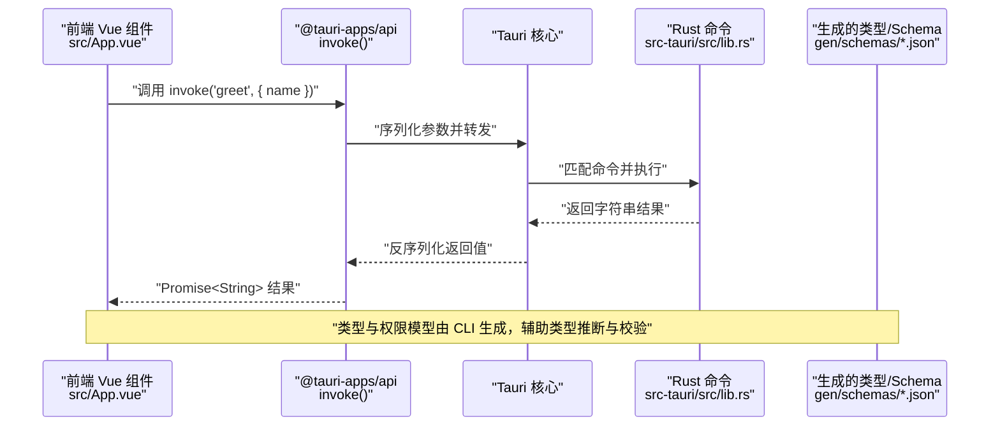
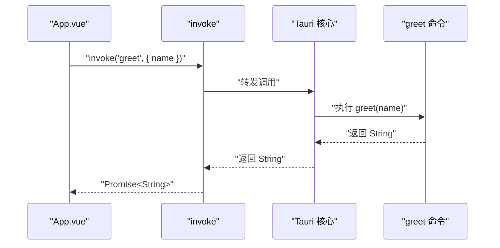
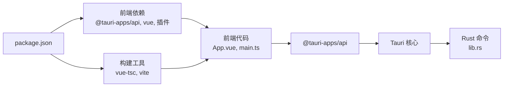

# TypeScript 类型定义

<cite>
**本文引用的文件**
- [vite-env.d.ts](file://src/vite-env.d.ts)
- [main.ts](file://src/main.ts)
- [App.vue](file://src/App.vue)
- [lib.rs](file://src-tauri/src/lib.rs)
- [tauri.conf.json](file://src-tauri/tauri.conf.json)
- [tsconfig.json](file://tsconfig.json)
- [vite.config.ts](file://vite.config.ts)
- [package.json](file://package.json)
- [desktop-schema.json](file://src-tauri/gen/schemas/desktop-schema.json)
- [windows-schema.json](file://src-tauri/gen/schemas/windows-schema.json)
- [README.md](file://README.md)
</cite>

## 目录
1. [简介](#简介)
2. [项目结构](#项目结构)
3. [核心组件](#核心组件)
4. [架构总览](#架构总览)
5. [详细组件分析](#详细组件分析)
6. [依赖关系分析](#依赖关系分析)
7. [性能考量](#性能考量)
8. [故障排除指南](#故障排除指南)
9. [结论](#结论)
10. [附录](#附录)

## 简介
本文件是针对该 Tauri 桌面应用的 TypeScript 类型定义参考文档，重点覆盖以下方面：
- Tauri 相关的类型声明与使用：包括命令调用的参数与返回值类型、命令处理器的类型约束等。
- Vite 环境类型定义的作用与配置方法，说明如何在开发环境中获得完整的类型提示。
- 桌面应用类型定义：窗口类型、菜单项、系统通知等接口的类型来源与建议。
- 泛型使用的最佳实践：如何为自定义命令定义类型安全的参数与返回值。
- 类型推断与类型守卫的使用示例：帮助开发者编写更安全的代码。
- 常见类型错误的诊断与解决方案，以及类型定义的维护与更新指南。

## 项目结构
该项目采用前端（Vue + TypeScript）与后端（Rust + Tauri）分离的结构，并通过 Tauri CLI 在构建时生成桌面端类型与权限模型。关键目录与文件如下：
- 前端：src 目录包含入口文件、Vue 组件与 Vite 类型声明。
- 后端：src-tauri 目录包含 Rust 入口与命令实现，以及由 Tauri CLI 生成的 JSON Schema 文件。
- 构建与类型：package.json、tsconfig.json、vite.config.ts、tauri.conf.json 配置了开发服务器、类型检查与打包流程。

**图表来源**
- [vite.config.ts:1-33](file://vite.config.ts#L1-L33)
- [tsconfig.json:1-26](file://tsconfig.json#L1-L26)
- [lib.rs:1-15](file://src-tauri/src/lib.rs#L1-L15)
- [desktop-schema.json:1-800](file://src-tauri/gen/schemas/desktop-schema.json#L1-L800)
- [windows-schema.json:1-800](file://src-tauri/gen/schemas/windows-schema.json#L1-L800)

**章节来源**
- [vite.config.ts:1-33](file://vite.config.ts#L1-L33)
- [tsconfig.json:1-26](file://tsconfig.json#L1-L26)
- [package.json:1-25](file://package.json#L1-L25)
- [tauri.conf.json:1-36](file://src-tauri/tauri.conf.json#L1-L36)

## 核心组件
本节聚焦于与 TypeScript 类型直接相关的组件与配置，帮助你理解类型从何而来、如何生效以及如何扩展。

- Vite 环境类型声明
  - 作用：为 Vite 提供对 .vue 文件与原生模块的类型支持，避免 TypeScript 对 .vue 导入无法解析类型的问题。
  - 配置位置：src/vite-env.d.ts。
  - 影响范围：所有 .vue 文件与模块声明在此处统一处理，确保编辑器具备基本的类型提示能力。

- TypeScript 编译配置
  - 严格模式：启用严格模式、未使用变量与参数检查、switch 不穷举检查等，提升类型安全性。
  - 模块解析：bundler 模式，允许导入 .ts/.tsx/.vue 扩展名，禁用 emit，配合 vue-tsc 进行类型检查。
  - 包含路径：src 下的所有 .ts/.d.ts/.tsx/.vue 文件均参与类型检查。

- Tauri 命令调用与类型
  - 前端通过 @tauri-apps/api 的 invoke 函数调用后端 Rust 命令。
  - 命令参数与返回值类型由 Rust 函数签名与 serde 序列化规则决定；前端通过类型系统进行约束与推断。
  - 示例：App.vue 中的 greet 调用展示了参数对象与异步返回值的使用方式。

- Tauri CLI 生成的类型与权限模型
  - 生成物：gen/schemas/desktop-schema.json、gen/schemas/windows-schema.json 等，描述权限、窗口与能力模型。
  - 用途：用于生成强类型的命令签名、权限枚举与窗口配置接口，便于在 TypeScript 中进行类型约束与自动补全。

**章节来源**
- [vite-env.d.ts:1-8](file://src/vite-env.d.ts#L1-L8)
- [tsconfig.json:1-26](file://tsconfig.json#L1-L26)
- [App.vue:1-50](file://src/App.vue#L1-L50)
- [lib.rs:1-15](file://src-tauri/src/lib.rs#L1-L15)
- [desktop-schema.json:1-800](file://src-tauri/gen/schemas/desktop-schema.json#L1-L800)
- [windows-schema.json:1-800](file://src-tauri/gen/schemas/windows-schema.json#L1-L800)

## 架构总览
下图展示从前端调用到后端执行再到类型系统的整体流程，强调类型在各层的来源与传递。

**图表来源**
- [App.vue:1-50](file://src/App.vue#L1-L50)
- [lib.rs:1-15](file://src-tauri/src/lib.rs#L1-L15)
- [desktop-schema.json:1-800](file://src-tauri/gen/schemas/desktop-schema.json#L1-L800)

## 详细组件分析

### 组件一：Vite 环境类型声明（vite-env.d.ts）
- 目标：为 .vue 文件与模块提供类型支持，避免 TypeScript 报告未知模块类型。
- 关键点：
  - 引用 Vite 的内置类型，确保开发时具备正确的模块解析能力。
  - 为 .vue 文件导出的组件提供默认的 DefineComponent 类型，便于在 TSX/Vue 文件中使用。
- 使用建议：
  - 保持该文件最小化，仅包含必要的类型声明。
  - 若需要更精确的 .vue 组件属性类型，可结合 Volar 的“接管模式”或使用工具链生成的类型。

**章节来源**
- [vite-env.d.ts:1-8](file://src/vite-env.d.ts#L1-L8)
- [README.md:9-17](file://README.md#L9-L17)

### 组件二：TypeScript 编译配置（tsconfig.json）
- 严格性与安全性：
  - 启用严格模式与多项 lint 规则，减少运行时错误。
  - 禁止 emit，配合 vue-tsc 在构建前进行类型检查。
- 模块解析与打包：
  - 使用 bundler 模式，允许导入 .ts/.tsx/.vue 扩展名。
  - 引用 tsconfig.node.json，形成双配置体系。
- 影响范围：影响所有前端源码的类型检查与编译行为。

**章节来源**
- [tsconfig.json:1-26](file://tsconfig.json#L1-L26)

### 组件三：Vite 开发服务器配置（vite.config.ts）
- 固定端口与 HMR：
  - 开发端口固定为 1420，严格端口模式，确保 Tauri Dev Server 稳定连接。
  - 当设置 TAURI_DEV_HOST 时，启用 WebSocket HMR 并指定主机与端口 1421。
- 监视策略：
  - 忽略 src-tauri 目录，避免前端监听到后端文件变化。
- 与 Tauri 的集成：
  - 通过 tauri.conf.json 的 beforeDevCommand 与 devUrl 配置，实现前后端联调。

**章节来源**
- [vite.config.ts:1-33](file://vite.config.ts#L1-L33)
- [tauri.conf.json:1-36](file://src-tauri/tauri.conf.json#L1-L36)

### 组件四：前端命令调用（App.vue）
- 调用模式：
  - 使用 @tauri-apps/api 的 invoke 函数，传入命令名与参数对象。
  - 返回 Promise，前端以异步方式接收结果。
- 类型来源：
  - 参数与返回值类型由后端 Rust 命令签名与 serde 序列化规则决定。
  - 前端通过 TypeScript 的类型推断与泛型约束，确保调用安全。

**图表来源**
- [App.vue:1-50](file://src/App.vue#L1-L50)
- [lib.rs:1-15](file://src-tauri/src/lib.rs#L1-L15)

**章节来源**
- [App.vue:1-50](file://src/App.vue#L1-L50)
- [lib.rs:1-15](file://src-tauri/src/lib.rs#L1-L15)

### 组件五：后端命令与类型生成（src-tauri/src/lib.rs）
- 命令定义：
  - #[tauri::command] 标注的函数会被 Tauri CLI 收集并生成类型与权限模型。
  - greet 命令演示了简单字符串参数与返回值的类型约束。
- 类型生成：
  - CLI 会基于命令签名生成 JSON Schema 与类型定义，供前端与工具链使用。
  - 权限模型（如 core:menu:default、core:window:default 等）来自生成的 schema。

**章节来源**
- [lib.rs:1-15](file://src-tauri/src/lib.rs#L1-L15)
- [desktop-schema.json:344-784](file://src-tauri/gen/schemas/desktop-schema.json#L344-L784)
- [windows-schema.json:344-784](file://src-tauri/gen/schemas/windows-schema.json#L344-L784)

### 组件六：桌面应用类型定义（窗口、菜单、通知）
- 窗口类型：
  - 通过 tauri.conf.json 的 app.windows 数组定义窗口标题、尺寸等基础属性。
  - 生成的 windows-schema.json 描述窗口能力与权限边界，可用于类型推断与权限控制。
- 菜单项与系统通知：
  - 生成的 desktop-schema.json 定义了 core:menu、core:tray、core:notification 等插件的权限集合与命令标识。
  - 建议在前端通过 @tauri-apps/api 的对应模块调用菜单与通知功能，并结合生成的权限模型进行类型约束。

**章节来源**
- [tauri.conf.json:12-23](file://src-tauri/tauri.conf.json#L12-L23)
- [desktop-schema.json:344-784](file://src-tauri/gen/schemas/desktop-schema.json#L344-L784)
- [windows-schema.json:344-784](file://src-tauri/gen/schemas/windows-schema.json#L344-L784)

## 依赖关系分析
- 前端依赖：
  - @tauri-apps/api：提供 invoke 等核心 API，是前端与后端交互的桥梁。
  - @tauri-apps/plugin-opener：示例插件，演示权限与命令的组合使用。
- 构建工具：
  - vue-tsc：在打包前进行类型检查，确保类型安全。
  - vite：开发服务器与热更新，与 Tauri Dev Server 协同工作。
- 后端依赖：
  - tauri 与 tauri-plugin-opener：命令注册与插件初始化。

**图表来源**
- [package.json:1-25](file://package.json#L1-L25)
- [App.vue:1-50](file://src/App.vue#L1-L50)
- [lib.rs:1-15](file://src-tauri/src/lib.rs#L1-L15)

**章节来源**
- [package.json:1-25](file://package.json#L1-L25)

## 性能考量
- 类型检查成本：
  - 严格模式与多条 lint 规则有助于早期发现错误，但可能增加类型检查时间。
  - 建议在 CI 中使用 vue-tsc 进行集中检查，在本地开发中根据需要调整严格级别。
- 构建与打包：
  - 禁用 emit 并使用 vue-tsc 可避免重复编译，提升构建效率。
  - Vite 的快速热更新与固定端口配置有利于开发体验。

[本节为通用指导，不涉及具体文件分析]

## 故障排除指南
- .vue 文件类型提示缺失
  - 现象：TypeScript 无法识别 .vue 组件的 props 类型。
  - 解决：启用 Volar 的“接管模式”，或确保 vite-env.d.ts 正确声明模块类型。
  - 参考：README 中关于 Take Over 模式的说明。

- invoke 调用参数类型不匹配
  - 现象：调用 invoke 时参数类型与后端命令签名不一致导致运行时错误。
  - 解决：确保参数对象的字段与后端命令签名一致；利用生成的 schema 与权限模型进行对照。

- 开发服务器端口冲突
  - 现象：Vite 期望的固定端口 1420 被占用。
  - 解决：释放端口或调整 Tauri 配置中的 devUrl 与 beforeDevCommand。

- HMR 连接失败（跨主机）
  - 现象：设置 TAURI_DEV_HOST 后 HMR 无法连接。
  - 解决：确认 host、port 与协议配置正确，且防火墙放行相应端口。

**章节来源**
- [README.md:9-17](file://README.md#L9-L17)
- [vite.config.ts:16-31](file://vite.config.ts#L16-L31)
- [tauri.conf.json:6-11](file://src-tauri/tauri.conf.json#L6-L11)

## 结论
本项目通过 Vite、TypeScript 与 Tauri CLI 的协同，实现了从命令签名到类型推断的完整闭环。前端通过 @tauri-apps/api 的 invoke 调用后端 Rust 命令，类型安全由 TypeScript 编译器与生成的 schema 共同保障。遵循本文的最佳实践与故障排除建议，可以显著提升开发效率与代码质量。

[本节为总结性内容，不涉及具体文件分析]

## 附录

### A. 泛型使用最佳实践
- 为自定义命令定义类型安全的参数与返回值
  - 建议在 Rust 命令中使用结构体作为参数与返回值，借助 serde 的 derive 属性生成序列化实现。
  - 在前端通过 TypeScript 接口映射这些结构体，确保 invoke 调用时的类型一致性。
- 类型推断与类型守卫
  - 利用 TypeScript 的类型守卫（例如联合类型的分支细化）在调用后对返回值进行安全处理。
  - 对于可能为空或异常的返回值，使用可选链与空值合并操作符，避免运行时错误。

[本节为通用指导，不涉及具体文件分析]

### B. 类型定义的维护与更新指南
- 生成物管理
  - Tauri CLI 会在每次构建时更新 gen/schemas 下的 JSON Schema 文件，前端与工具链依赖这些文件进行类型推断。
  - 建议将生成物纳入版本控制，以便团队成员共享一致的类型定义。
- 版本兼容性
  - 更新 @tauri-apps/api 或 Rust 依赖时，注意检查生成的 schema 是否有破坏性变更。
  - 在 CI 中加入 vue-tsc 检查，确保类型更新不会引入新的错误。

[本节为通用指导，不涉及具体文件分析]