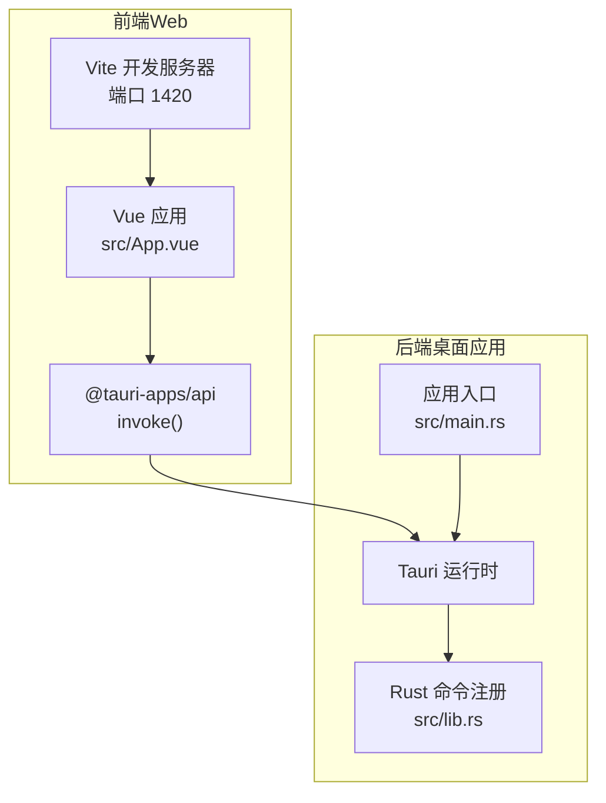
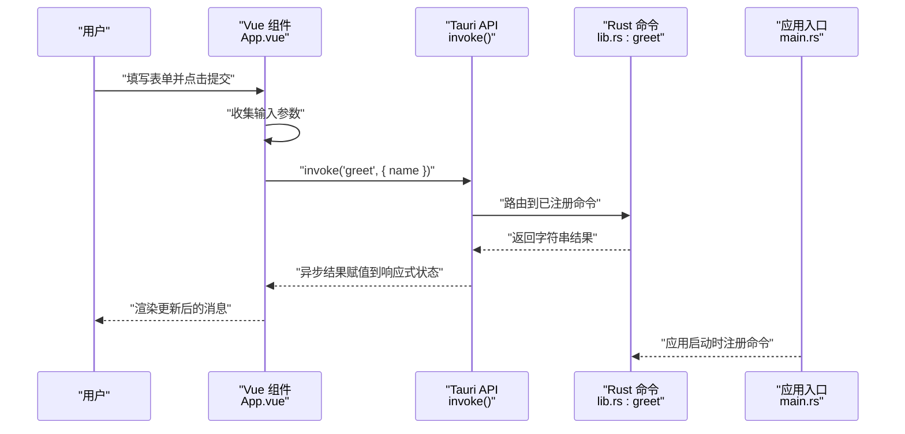
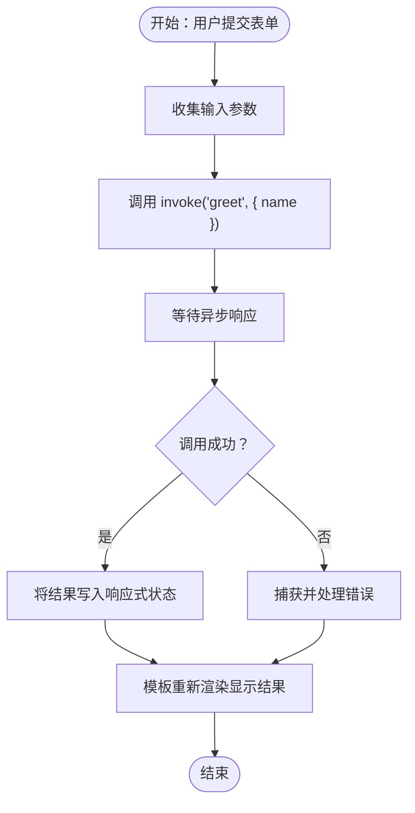
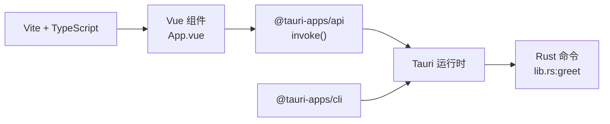

# Vue 组件集成

<cite>
**本文引用的文件**
- [src/main.ts](file://src/main.ts)
- [src/App.vue](file://src/App.vue)
- [src/vite-env.d.ts](file://src/vite-env.d.ts)
- [package.json](file://package.json)
- [vite.config.ts](file://vite.config.ts)
- [tsconfig.json](file://tsconfig.json)
- [README.md](file://README.md)
- [src-tauri/src/lib.rs](file://src-tauri/src/lib.rs)
- [src-tauri/src/main.rs](file://src-tauri/src/main.rs)
- [src-tauri/tauri.conf.json](file://src-tauri/tauri.conf.json)
- [src-tauri/capabilities/default.json](file://src-tauri/capabilities/default.json)
</cite>

## 目录
1. [简介](#简介)
2. [项目结构](#项目结构)
3. [核心组件](#核心组件)
4. [架构总览](#架构总览)
5. [详细组件分析](#详细组件分析)
6. [依赖关系分析](#依赖关系分析)
7. [性能考量](#性能考量)
8. [故障排查指南](#故障排查指南)
9. [结论](#结论)
10. [附录](#附录)

## 简介
本指南面向在 Vue 3 单页应用中集成 Tauri API 的开发者，重点讲解如何在 Composition API 模式下导入与使用 Tauri 的 invoke 能力，涵盖：
- 在组件方法中调用 invoke 并处理异步响应与错误
- 响应式数据绑定在 Tauri 调用中的应用（含 loading 状态管理与用户反馈）
- 表单输入处理、按钮点击事件与生命周期钩子中的 API 调用模式
- TypeScript 类型安全的 API 调用实践
- 常见问题：并发调用、取消请求与超时控制

本项目基于 Vite + Vue 3 + TypeScript + Tauri 2 的模板，前端通过 @tauri-apps/api 调用后端 Rust 命令。

## 项目结构
该仓库采用前后端分离的典型布局：
- 前端（src）：Vue 3 单页应用，使用 `<script setup>` 与 Composition API
- 后端（src-tauri）：Rust 应用，通过 Tauri 注册命令并暴露给前端
- 构建与开发：Vite 提供开发服务器与热更新；Tauri 配置文件定义窗口、安全策略与打包参数

图表来源
- [vite.config.ts:1-33](file://vite.config.ts#L1-L33)
- [src/App.vue:1-160](file://src/App.vue#L1-L160)
- [src-tauri/src/lib.rs:1-15](file://src-tauri/src/lib.rs#L1-L15)
- [src-tauri/src/main.rs:1-7](file://src-tauri/src/main.rs#L1-L7)

章节来源
- [src/main.ts:1-5](file://src/main.ts#L1-L5)
- [vite.config.ts:1-33](file://vite.config.ts#L1-L33)
- [src-tauri/tauri.conf.json:1-36](file://src-tauri/tauri.conf.json#L1-L36)

## 核心组件
- 前端入口与挂载
  - 应用通过入口文件创建并挂载根组件到页面容器
  - 参考路径：[src/main.ts:1-5](file://src/main.ts#L1-L5)

- 根组件与 Tauri API 调用
  - 使用 Composition API 的 ref 定义响应式状态
  - 通过 @tauri-apps/api/core 的 invoke 发起命令调用
  - 表单提交触发 greet 方法，将输入值传入命令并接收返回结果
  - 参考路径：
    - [src/App.vue:1-160](file://src/App.vue#L1-L160)

- 类型声明与模块解析
  - 为 .vue 模块提供类型声明，确保 TS 对 Vue 组件的类型支持
  - 参考路径：[src/vite-env.d.ts:1-7](file://src/vite-env.d.ts#L1-L7)

- 依赖与脚本
  - 前端依赖 @tauri-apps/api、vue、typescript、vite 等
  - 包含 tauri 开发与构建脚本
  - 参考路径：[package.json:1-25](file://package.json#L1-L25)

- TypeScript 编译配置
  - 严格模式、Bundler 模式、模块解析等配置
  - 参考路径：[tsconfig.json:1-26](file://tsconfig.json#L1-L26)

章节来源
- [src/main.ts:1-5](file://src/main.ts#L1-L5)
- [src/App.vue:1-160](file://src/App.vue#L1-L160)
- [src/vite-env.d.ts:1-7](file://src/vite-env.d.ts#L1-L7)
- [package.json:1-25](file://package.json#L1-L25)
- [tsconfig.json:1-26](file://tsconfig.json#L1-L26)

## 架构总览
下面的序列图展示了从 Vue 组件到 Tauri 命令执行的完整流程，包括命令注册、调用与返回：

图表来源
- [src/App.vue:1-160](file://src/App.vue#L1-L160)
- [src-tauri/src/lib.rs:1-15](file://src-tauri/src/lib.rs#L1-L15)
- [src-tauri/src/main.rs:1-7](file://src-tauri/src/main.rs#L1-L7)

## 详细组件分析

### 组件：App.vue（Tauri 调用与响应式绑定）
- 关键点
  - 引入 invoke 并在方法中发起命令调用
  - 使用 ref 管理输入与输出状态
  - 表单提交事件绑定到方法，实现用户交互驱动的 API 调用
  - 模板中直接绑定响应式变量进行用户反馈

- 调用流程（invoke 调用链）

图表来源
- [src/App.vue:1-160](file://src/App.vue#L1-L160)

章节来源
- [src/App.vue:1-160](file://src/App.vue#L1-L160)

### 后端：命令注册与应用入口
- 命令注册
  - 通过 #[tauri::command] 定义 greet 命令
  - 在 run 中通过 generate_handler! 注册命令，使前端可调用
  - 参考路径：[src-tauri/src/lib.rs:1-15](file://src-tauri/src/lib.rs#L1-L15)

- 应用入口
  - main.rs 调用 run 初始化 Tauri 应用
  - 参考路径：[src-tauri/src/main.rs:1-7](file://src-tauri/src/main.rs#L1-L7)

- 权限与能力
  - capabilities/default.json 定义窗口与权限（如 opener）
  - 参考路径：[src-tauri/capabilities/default.json:1-11](file://src-tauri/capabilities/default.json#L1-L11)

章节来源
- [src-tauri/src/lib.rs:1-15](file://src-tauri/src/lib.rs#L1-L15)
- [src-tauri/src/main.rs:1-7](file://src-tauri/src/main.rs#L1-L7)
- [src-tauri/capabilities/default.json:1-11](file://src-tauri/capabilities/default.json#L1-L11)

### 类型安全与模块声明
- Vue 模块类型声明
  - 为 .vue 文件提供 DefineComponent 类型，提升 TS 对组件的类型推断
  - 参考路径：[src/vite-env.d.ts:1-7](file://src/vite-env.d.ts#L1-L7)

- TypeScript 编译选项
  - 严格模式、Bundler 解析、禁用 emit 等配置
  - 参考路径：[tsconfig.json:1-26](file://tsconfig.json#L1-L26)

章节来源
- [src/vite-env.d.ts:1-7](file://src/vite-env.d.ts#L1-L7)
- [tsconfig.json:1-26](file://tsconfig.json#L1-L26)

### 开发与构建配置
- Vite 配置
  - 固定端口 1420、严格端口、HMR 设置、忽略 src-tauri 目录监听
  - 参考路径：[vite.config.ts:1-33](file://vite.config.ts#L1-L33)

- Tauri 配置
  - 前端开发地址、构建产物目录、窗口尺寸与安全策略
  - 参考路径：[src-tauri/tauri.conf.json:1-36](file://src-tauri/tauri.conf.json#L1-L36)

- 依赖与脚本
  - 前端依赖与 tauri 脚本
  - 参考路径：[package.json:1-25](file://package.json#L1-L25)

章节来源
- [vite.config.ts:1-33](file://vite.config.ts#L1-L33)
- [src-tauri/tauri.conf.json:1-36](file://src-tauri/tauri.conf.json#L1-L36)
- [package.json:1-25](file://package.json#L1-L25)

## 依赖关系分析
- 前端对 Tauri API 的依赖
  - 通过 @tauri-apps/api/core 导入 invoke，用于调用后端命令
  - 参考路径：[src/App.vue:1-160](file://src/App.vue#L1-L160)

- 前端对 Vue 的依赖
  - 使用 ref 与 Composition API
  - 参考路径：[src/App.vue:1-160](file://src/App.vue#L1-L160)

- 后端对 Tauri 的依赖
  - 通过 tauri::command 注解与 generate_handler! 注册命令
  - 参考路径：[src-tauri/src/lib.rs:1-15](file://src-tauri/src/lib.rs#L1-L15)

- 开发工具链
  - Vite、TypeScript、@vitejs/plugin-vue、@tauri-apps/cli
  - 参考路径：[package.json:1-25](file://package.json#L1-L25)

图表来源
- [src/App.vue:1-160](file://src/App.vue#L1-L160)
- [src-tauri/src/lib.rs:1-15](file://src-tauri/src/lib.rs#L1-L15)
- [package.json:1-25](file://package.json#L1-L25)

章节来源
- [src/App.vue:1-160](file://src/App.vue#L1-L160)
- [src-tauri/src/lib.rs:1-15](file://src-tauri/src/lib.rs#L1-L15)
- [package.json:1-25](file://package.json#L1-L25)

## 性能考量
- 异步调用与渲染
  - invoke 返回 Promise，应在方法中 await，避免竞态条件
  - 使用响应式状态更新视图，减少不必要的重渲染
- 并发调用
  - 避免同时发起多个高耗时命令；必要时引入队列或节流
- 错误处理
  - 将错误信息写入响应式状态，统一在模板中展示
- 用户反馈
  - 在调用前设置 loading 状态，在 finally 中清除，提升交互体验

## 故障排查指南
- 命令未注册或调用失败
  - 检查后端是否正确注册命令并运行
  - 参考路径：[src-tauri/src/lib.rs:1-15](file://src-tauri/src/lib.rs#L1-L15)
- 开发服务器端口冲突
  - Vite 固定端口 1420，需确保端口可用或关闭占用进程
  - 参考路径：[vite.config.ts:1-33](file://vite.config.ts#L1-L33)
- TypeScript 类型报错
  - 确认已启用模块声明与严格模式配置
  - 参考路径：[src/vite-env.d.ts:1-7](file://src/vite-env.d.ts#L1-L7)、[tsconfig.json:1-26](file://tsconfig.json#L1-L26)
- 权限不足
  - 检查 capabilities/default.json 中的权限列表
  - 参考路径：[src-tauri/capabilities/default.json:1-11](file://src-tauri/capabilities/default.json#L1-L11)

章节来源
- [src-tauri/src/lib.rs:1-15](file://src-tauri/src/lib.rs#L1-L15)
- [vite.config.ts:1-33](file://vite.config.ts#L1-L33)
- [src/vite-env.d.ts:1-7](file://src/vite-env.d.ts#L1-L7)
- [tsconfig.json:1-26](file://tsconfig.json#L1-L26)
- [src-tauri/capabilities/default.json:1-11](file://src-tauri/capabilities/default.json#L1-L11)

## 结论
本指南基于现有代码展示了在 Vue 3 中集成 Tauri API 的标准模式：使用 Composition API 管理状态，通过 @tauri-apps/api 的 invoke 发起命令调用，结合 TypeScript 保证类型安全。建议在实际项目中补充 loading 状态、错误处理与并发控制，以获得更稳健的用户体验。

## 附录
- 快速开始与推荐 IDE
  - 参考路径：[README.md:1-17](file://README.md#L1-L17)
- 项目脚本
  - 参考路径：[package.json:1-25](file://package.json#L1-L25)