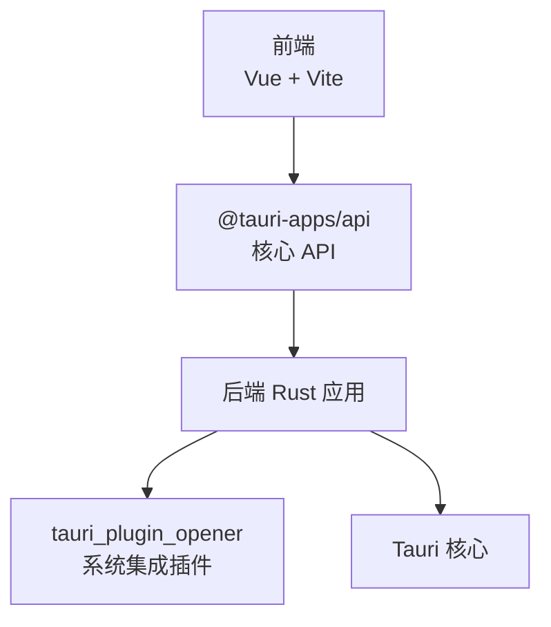
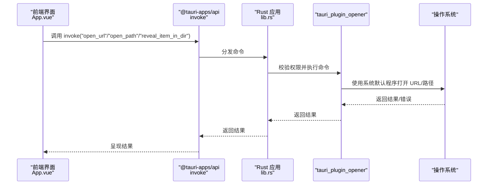
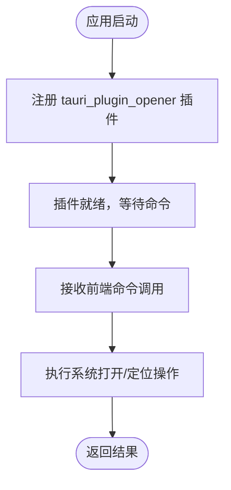
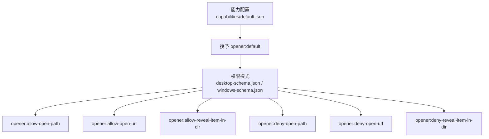
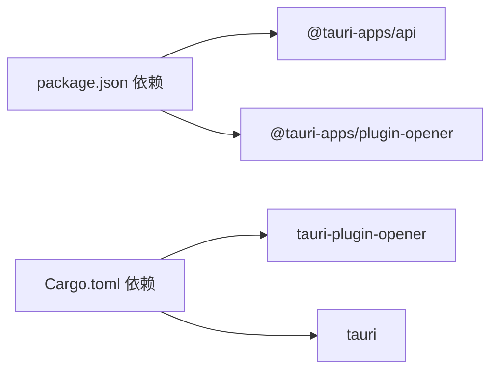

# 系统集成 API

<cite>
**本文引用的文件**
- [Cargo.toml](file://src-tauri/Cargo.toml)
- [main.rs](file://src-tauri/src/main.rs)
- [lib.rs](file://src-tauri/src/lib.rs)
- [tauri.conf.json](file://src-tauri/tauri.conf.json)
- [default.json](file://src-tauri/capabilities/default.json)
- [desktop-schema.json](file://src-tauri/gen/schemas/desktop-schema.json)
- [windows-schema.json](file://src-tauri/gen/schemas/windows-schema.json)
- [package.json](file://package.json)
- [App.vue](file://src/App.vue)
</cite>

## 目录
1. [简介](#简介)
2. [项目结构](#项目结构)
3. [核心组件](#核心组件)
4. [架构总览](#架构总览)
5. [详细组件分析](#详细组件分析)
6. [依赖关系分析](#依赖关系分析)
7. [性能考量](#性能考量)
8. [故障排除指南](#故障排除指南)
9. [结论](#结论)
10. [附录](#附录)

## 简介
本文件为系统集成 API 的综合参考文档，聚焦于 tauri_plugin_opener 插件在 Tauri 应用中的使用与集成。内容涵盖：
- 插件初始化与加载机制
- 权限配置与能力（capabilities）定义
- 命令接口：系统默认程序调用、URL 打开、文件关联（资源定位）
- 跨平台行为差异说明
- 安全与权限管理建议
- 常见问题排查与解决方案

该应用已启用 tauri_plugin_opener，并通过能力配置授予了 opener 相关权限；前端通过 @tauri-apps/api 调用 Rust 命令，实现系统打开器功能。

## 项目结构
应用采用典型的 Tauri 双端结构：
- 前端：Vue + Vite（位于 src/ 与 package.json 中声明的依赖）
- 后端：Rust（位于 src-tauri/），包含应用入口、插件初始化与权限配置

图表来源
- [package.json:12-16](file://package.json#L12-L16)
- [lib.rs:8-13](file://src-tauri/src/lib.rs#L8-L13)
- [Cargo.toml:20-25](file://src-tauri/Cargo.toml#L20-L25)

章节来源
- [package.json:1-25](file://package.json#L1-L25)
- [Cargo.toml:1-26](file://src-tauri/Cargo.toml#L1-L26)
- [tauri.conf.json:1-36](file://src-tauri/tauri.conf.json#L1-L36)

## 核心组件
- tauri_plugin_opener 插件：提供 open_path、open_url、reveal_item_in_dir 等命令，用于系统默认程序打开路径或 URL，以及在文件管理器中定位并选中文件。
- 权限与能力（capabilities）：通过 default.json 将 opener:default 权限授予主窗口，使前端可调用相关命令。
- Rust 初始化：在 lib.rs 中通过 Builder::plugin 注册插件，并运行应用上下文。
- 前端调用：通过 @tauri-apps/api 的 invoke 方法调用 Rust 命令。

章节来源
- [lib.rs:8-13](file://src-tauri/src/lib.rs#L8-L13)
- [default.json:6-9](file://src-tauri/capabilities/default.json#L6-L9)
- [desktop-schema.json:153-171](file://src-tauri/gen/schemas/desktop-schema.json#L153-L171)
- [windows-schema.json:153-171](file://src-tauri/gen/schemas/windows-schema.json#L153-L171)

## 架构总览
下图展示了从前端到 Rust 插件的调用链路，以及权限控制如何影响可用命令。

图表来源
- [App.vue:8-11](file://src/App.vue#L8-L11)
- [lib.rs:8-13](file://src-tauri/src/lib.rs#L8-L13)
- [desktop-schema.json:153-171](file://src-tauri/gen/schemas/desktop-schema.json#L153-L171)
- [windows-schema.json:153-171](file://src-tauri/gen/schemas/windows-schema.json#L153-L171)

## 详细组件分析

### 插件初始化与加载机制
- 在 lib.rs 的 run 函数中，通过 Builder::plugin(tauri_plugin_opener::init()) 将插件注册到应用生命周期。
- 应用启动时，插件随应用上下文一起初始化，随后即可响应来自前端的命令调用。
- main.rs 作为二进制入口，调用 lib.rs::run 进入应用运行流程。

图表来源
- [lib.rs:8-13](file://src-tauri/src/lib.rs#L8-L13)
- [main.rs:4-6](file://src-tauri/src/main.rs#L4-L6)

章节来源
- [lib.rs:8-13](file://src-tauri/src/lib.rs#L8-L13)
- [main.rs:4-6](file://src-tauri/src/main.rs#L4-L6)

### 权限与能力（capabilities）配置
- 能力 default.json 明确授予 opener:default 权限给主窗口，允许调用 opener 相关命令。
- 桌面端与 Windows 端的权限模式文件均包含 opener:allow-* 与 opener:deny-* 权限常量，用于细粒度控制 open_path、open_url、reveal_item_in_dir。
- 可通过 allow/deny 列表对 URL 与路径进行通配匹配，限制可访问范围。

图表来源
- [default.json:6-9](file://src-tauri/capabilities/default.json#L6-L9)
- [desktop-schema.json:153-171](file://src-tauri/gen/schemas/desktop-schema.json#L153-L171)
- [desktop-schema.json:2329-2358](file://src-tauri/gen/schemas/desktop-schema.json#L2329-L2358)
- [windows-schema.json:153-171](file://src-tauri/gen/schemas/windows-schema.json#L153-L171)
- [windows-schema.json:2329-2358](file://src-tauri/gen/schemas/windows-schema.json#L2329-L2358)

章节来源
- [default.json:1-11](file://src-tauri/capabilities/default.json#L1-L11)
- [desktop-schema.json:153-171](file://src-tauri/gen/schemas/desktop-schema.json#L153-L171)
- [desktop-schema.json:2329-2358](file://src-tauri/gen/schemas/desktop-schema.json#L2329-L2358)
- [windows-schema.json:153-171](file://src-tauri/gen/schemas/windows-schema.json#L153-L171)
- [windows-schema.json:2329-2358](file://src-tauri/gen/schemas/windows-schema.json#L2329-L2358)

### 命令接口与使用示例
- 命令类型
  - open_path：打开指定本地路径（文件或目录）
  - open_url：使用系统默认程序打开 URL
  - reveal_item_in_dir：在文件管理器中定位并选中目标项
- 前端调用方式
  - 使用 @tauri-apps/api 的 invoke 方法，传入命令名与参数对象
  - 示例调用路径参考：[App.vue:8-11](file://src/App.vue#L8-L11)
- 参数与作用域
  - URL 与路径支持通配符与系统变量（如 $HOME、$DOCUMENT 等），可在权限模式中精确限定
  - 允许通过 allow/deny 列表细化访问范围

章节来源
- [desktop-schema.json:200-291](file://src-tauri/gen/schemas/desktop-schema.json#L200-L291)
- [windows-schema.json:200-291](file://src-tauri/gen/schemas/windows-schema.json#L200-L291)
- [App.vue:8-11](file://src/App.vue#L8-L11)

### 跨平台兼容性说明
- Windows 与桌面端权限模式均包含 opener:allow-* 与 opener:deny-* 常量，确保命令在多平台一致可用
- 具体系统行为（如默认程序选择、路径解析）由各平台原生能力决定
- 若需针对特定平台定制策略，可在权限模式中利用 allow/deny 对 URL/路径进行差异化控制

章节来源
- [windows-schema.json:153-171](file://src-tauri/gen/schemas/windows-schema.json#L153-L171)
- [desktop-schema.json:153-171](file://src-tauri/gen/schemas/desktop-schema.json#L153-L171)

### 安全考虑与权限管理
- 最小权限原则：仅授予业务所需的 opener:* 权限，避免过度放权
- 作用域限制：通过 allow/deny 列表对 URL 与路径进行白名单/黑名单控制
- 用户授权与隐私：避免打开不受信任的 URL 或路径；对用户敏感数据的定位与打开需遵循最小暴露原则
- 配置审计：定期审查 capabilities 与权限模式，确保符合当前业务需求

章节来源
- [default.json:6-9](file://src-tauri/capabilities/default.json#L6-L9)
- [desktop-schema.json:200-291](file://src-tauri/gen/schemas/desktop-schema.json#L200-L291)
- [windows-schema.json:200-291](file://src-tauri/gen/schemas/windows-schema.json#L200-L291)

## 依赖关系分析
- 前端依赖
  - @tauri-apps/api：提供 invoke 等核心 API，用于调用 Rust 命令
  - @tauri-apps/plugin-opener：前端侧插件（若使用），便于在前端直接调用 opener 功能
- 后端依赖
  - tauri-plugin-opener：系统集成插件，提供 open_path/open_url/reveal_item_in_dir 命令
  - tauri：框架核心，负责应用生命周期与命令分发

图表来源
- [package.json:12-16](file://package.json#L12-L16)
- [Cargo.toml:20-25](file://src-tauri/Cargo.toml#L20-L25)

章节来源
- [package.json:1-25](file://package.json#L1-L25)
- [Cargo.toml:1-26](file://src-tauri/Cargo.toml#L1-L26)

## 性能考量
- 命令调用为轻量同步操作，主要耗时取决于系统默认程序的启动与文件/URL 解析
- 频繁调用可能受系统资源与默认程序响应速度影响，建议在前端做必要的节流与去抖处理
- 对大文件或网络 URL，注意超时与失败重试策略

## 故障排除指南
- 程序未找到
  - 现象：open_url 或 open_path 失败，提示无法找到默认程序
  - 排查：确认系统是否已安装可打开对应协议/类型的程序；检查 URL/路径是否正确
- 权限不足
  - 现象：命令被拒绝或无权限
  - 排查：检查 capabilities/default.json 是否授予 opener:default；核对 desktop-schema.json/windows-schema.json 中的 allow/deny 配置
- 路径解析错误
  - 现象：open_path 无法打开文件或目录
  - 排查：确认路径存在且可访问；检查是否使用了正确的系统变量（如 $HOME、$DOCUMENT 等）；验证 allow/deny 规则是否允许该路径
- 默认程序行为异常
  - 现象：open_url 打开非预期程序
  - 排查：检查系统默认程序设置；必要时在权限模式中指定 app 字段以固定打开程序

章节来源
- [default.json:6-9](file://src-tauri/capabilities/default.json#L6-L9)
- [desktop-schema.json:200-291](file://src-tauri/gen/schemas/desktop-schema.json#L200-L291)
- [windows-schema.json:200-291](file://src-tauri/gen/schemas/windows-schema.json#L200-L291)

## 结论
tauri_plugin_opener 为 Tauri 应用提供了统一的系统集成能力，结合能力配置与权限模式，可在保证安全的前提下灵活地打开 URL、本地路径与文件资源。通过合理的权限设计与跨平台兼容策略，开发者可以构建稳定可靠的系统打开体验。

## 附录
- 快速调用参考
  - 前端调用 invoke 的示例路径参考：[App.vue:8-11](file://src/App.vue#L8-L11)
- 关键配置参考
  - 能力授予：[default.json:6-9](file://src-tauri/capabilities/default.json#L6-L9)
  - 权限模式（桌面端）：[desktop-schema.json:153-171](file://src-tauri/gen/schemas/desktop-schema.json#L153-L171)
  - 权限模式（Windows 端）：[windows-schema.json:153-171](file://src-tauri/gen/schemas/windows-schema.json#L153-L171)