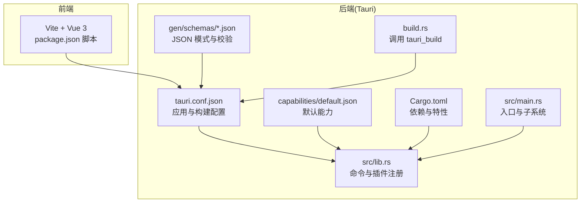
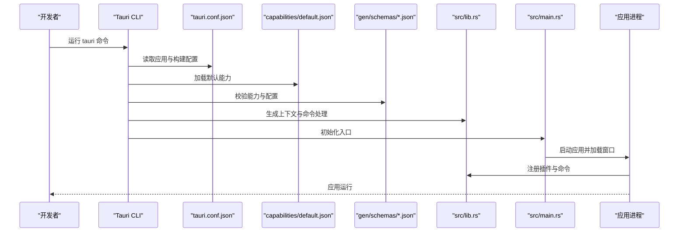
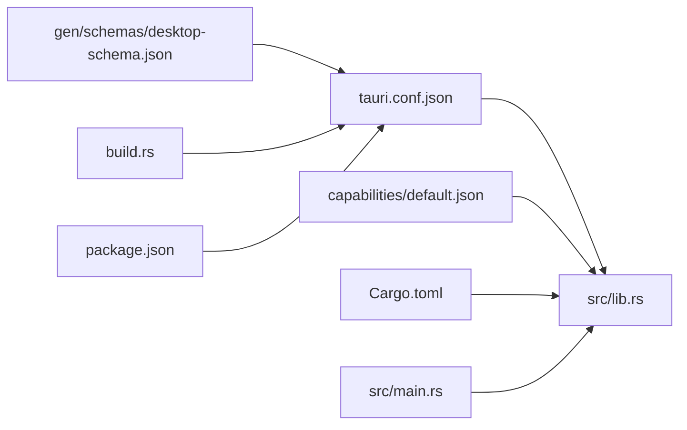

# Tauri 配置

<cite>
**本文引用的文件**
- [tauri.conf.json](file://src-tauri/tauri.conf.json)
- [default.json](file://src-tauri/capabilities/default.json)
- [capabilities.json](file://src-tauri/gen/schemas/capabilities.json)
- [desktop-schema.json](file://src-tauri/gen/schemas/desktop-schema.json)
- [Cargo.toml](file://src-tauri/Cargo.toml)
- [build.rs](file://src-tauri/build.rs)
- [main.rs](file://src-tauri/src/main.rs)
- [lib.rs](file://src-tauri/src/lib.rs)
- [package.json](file://package.json)
- [README.md](file://README.md)
</cite>

## 目录
1. [简介](#简介)
2. [项目结构](#项目结构)
3. [核心组件](#核心组件)
4. [架构总览](#架构总览)
5. [详细组件分析](#详细组件分析)
6. [依赖关系分析](#依赖关系分析)
7. [性能考量](#性能考量)
8. [故障排查指南](#故障排查指南)
9. [结论](#结论)
10. [附录](#附录)

## 简介
本文件面向 Tauri 应用开发者，系统性梳理 tauri.conf.json 的配置项与工作原理，重点覆盖：
- 应用元数据与标识符
- 窗口管理配置（尺寸、标题栏、最小化/最大化行为等）
- 安全策略（内容安全策略、权限系统与沙箱边界）
- 构建与打包配置（图标、安装包目标、签名要求）
- 跨平台差异（Windows、macOS、Linux 平台特定设置）
- 权限系统（capabilities）：默认权限与自定义权限定义
- 生成的 JSON 模式文件与验证机制
- 最佳实践与常见问题排查

## 项目结构
该仓库采用典型的 Tauri 前后端分离结构：
- 前端：Vite + Vue 3 + TypeScript（位于根目录）
- 后端：Rust（位于 src-tauri），包含 Tauri 配置、能力文件、生成的模式文件、构建脚本与入口
- 资源：图标、生成的 dist 输出

图表来源
- [tauri.conf.json:1-36](file://src-tauri/tauri.conf.json#L1-L36)
- [default.json:1-11](file://src-tauri/capabilities/default.json#L1-L11)
- [desktop-schema.json:1-120](file://src-tauri/gen/schemas/desktop-schema.json#L1-L120)
- [lib.rs:1-15](file://src-tauri/src/lib.rs#L1-L15)
- [main.rs:1-7](file://src-tauri/src/main.rs#L1-L7)
- [build.rs:1-4](file://src-tauri/build.rs#L1-L4)
- [Cargo.toml:1-26](file://src-tauri/Cargo.toml#L1-L26)
- [package.json:1-25](file://package.json#L1-L25)

章节来源
- [tauri.conf.json:1-36](file://src-tauri/tauri.conf.json#L1-L36)
- [package.json:1-25](file://package.json#L1-L25)
- [README.md:1-17](file://README.md#L1-L17)

## 核心组件
本节聚焦 tauri.conf.json 的关键配置段落及其作用域。

- 全局元数据与版本标识
  - 字段：productName、version、identifier
  - 用途：应用名称、版本号、包标识符（用于签名、分发与系统识别）
  - 参考路径：[tauri.conf.json:3-5](file://src-tauri/tauri.conf.json#L3-L5)

- 构建配置（build）
  - beforeDevCommand：开发时启动前端命令
  - devUrl：开发时前端服务地址
  - beforeBuildCommand：构建前执行的前端命令
  - frontendDist：构建产物输出目录
  - 参考路径：[tauri.conf.json:6-11](file://src-tauri/tauri.conf.json#L6-L11)

- 应用配置（app）
  - windows：窗口数组，支持多窗口；每项可配置标题、宽高、标题栏样式、最小化/最大化行为等
  - security.csp：内容安全策略，当前为 null（表示未启用）
  - 参考路径：[tauri.conf.json:12-23](file://src-tauri/tauri.conf.json#L12-L23)

- 打包配置（bundle）
  - active：是否启用打包
  - targets：目标平台集合（示例为 all）
  - icon：图标清单（含不同分辨率与平台格式）
  - 参考路径：[tauri.conf.json:24-34](file://src-tauri/tauri.conf.json#L24-L34)

章节来源
- [tauri.conf.json:1-36](file://src-tauri/tauri.conf.json#L1-L36)

## 架构总览
下图展示从配置到运行时的关键交互链路，包括能力系统、插件与命令注册、以及构建与打包流程。

图表来源
- [tauri.conf.json:1-36](file://src-tauri/tauri.conf.json#L1-L36)
- [default.json:1-11](file://src-tauri/capabilities/default.json#L1-L11)
- [desktop-schema.json:1-120](file://src-tauri/gen/schemas/desktop-schema.json#L1-L120)
- [lib.rs:1-15](file://src-tauri/src/lib.rs#L1-L15)
- [main.rs:1-7](file://src-tauri/src/main.rs#L1-L7)

## 详细组件分析

### 应用元数据与标识
- productName：应用显示名称
- version：应用版本
- identifier：应用包标识符（建议使用反向域名风格）
- 用途：影响打包产物、系统菜单、更新与签名等
- 参考路径：[tauri.conf.json:3-5](file://src-tauri/tauri.conf.json#L3-L5)

章节来源
- [tauri.conf.json:3-5](file://src-tauri/tauri.conf.json#L3-L5)

### 窗口管理配置
- windows 数组：支持多窗口；每项可配置
  - title：窗口标题
  - width/height：初始尺寸
  - 其他窗口属性（如标题栏样式、最小化/最大化行为、居中、无边框等）在 Tauri v2 中通常通过窗口 API 或扩展配置实现，具体以官方文档为准
- 当前配置仅设置了标题与尺寸
- 参考路径：[tauri.conf.json:13-19](file://src-tauri/tauri.conf.json#L13-L19)

章节来源
- [tauri.conf.json:13-19](file://src-tauri/tauri.conf.json#L13-L19)

### 安全策略与内容安全策略（CSP）
- security.csp：当前为 null，表示未启用 CSP
- 若需要启用，可在该字段配置 CSP 规则字符串或对象
- 注意：CSP 会影响 WebView 的资源加载与脚本执行，需谨慎配置
- 参考路径：[tauri.conf.json:20-22](file://src-tauri/tauri.conf.json#L20-L22)

章节来源
- [tauri.conf.json:20-22](file://src-tauri/tauri.conf.json#L20-L22)

### 权限系统（Capabilities）
- 默认能力文件 default.json
  - identifier：能力标识
  - description：能力描述
  - windows：关联窗口列表（示例为 main）
  - permissions：权限列表（示例包含 core:default 与 opener:default）
- 生成的能力映射 capabilities.json 展示了默认能力的解析结果
- 能力系统的核心思想是“按窗口/WebView 分组”，限制其对 IPC 层的访问范围，降低前端漏洞的影响面
- 参考路径：
  - [default.json:1-11](file://src-tauri/capabilities/default.json#L1-L11)
  - [capabilities.json:1-1](file://src-tauri/gen/schemas/capabilities.json#L1-L1)

#### 能力与权限的 JSON Schema 定义
- desktop-schema.json 提供了能力文件的完整 JSON Schema，包括：
  - Capability 对象：identifier、description、windows、webviews、permissions、platforms、remote、local 等
  - PermissionEntry：权限标识或带 allow/deny 范围的对象
  - 内置权限集（如 core:default、opener:default 等）的说明
- 该模式文件用于本地与 CI 校验，确保能力配置合法
- 参考路径：[desktop-schema.json:39-105](file://src-tauri/gen/schemas/desktop-schema.json#L39-L105)

章节来源
- [default.json:1-11](file://src-tauri/capabilities/default.json#L1-L11)
- [capabilities.json:1-1](file://src-tauri/gen/schemas/capabilities.json#L1-L1)
- [desktop-schema.json:39-105](file://src-tauri/gen/schemas/desktop-schema.json#L39-L105)

### 构建与打包配置
- build
  - beforeDevCommand：开发前执行的前端命令（如 pnpm dev）
  - devUrl：开发时前端服务地址
  - beforeBuildCommand：构建前执行的前端命令（如 pnpm build）
  - frontendDist：前端构建产物目录
- bundle
  - active：是否启用打包
  - targets：目标平台集合（示例为 all）
  - icon：图标清单（包含多分辨率与平台格式）
- 参考路径：
  - [tauri.conf.json:6-11](file://src-tauri/tauri.conf.json#L6-L11)
  - [tauri.conf.json:24-34](file://src-tauri/tauri.conf.json#L24-L34)

章节来源
- [tauri.conf.json:6-11](file://src-tauri/tauri.conf.json#L6-L11)
- [tauri.conf.json:24-34](file://src-tauri/tauri.conf.json#L24-L34)

### 跨平台配置差异
- 平台特定设置通常通过以下方式体现：
  - 能力文件中的 platforms 字段可限定目标平台
  - 图标清单包含平台专用格式（如 .icns、.ico）
  - 打包目标 targets 支持 all 或指定平台
- 本仓库示例未显式配置平台差异字段，但 schema 支持按平台限制能力
- 参考路径：
  - [desktop-schema.json:94-103](file://src-tauri/gen/schemas/desktop-schema.json#L94-L103)
  - [tauri.conf.json:26](file://src-tauri/tauri.conf.json#L26)
  - [tauri.conf.json:28-33](file://src-tauri/tauri.conf.json#L28-L33)

章节来源
- [desktop-schema.json:94-103](file://src-tauri/gen/schemas/desktop-schema.json#L94-L103)
- [tauri.conf.json:26](file://src-tauri/tauri.conf.json#L26)
- [tauri.conf.json:28-33](file://src-tauri/tauri.conf.json#L28-L33)

### 生成的 JSON 模式文件与验证机制
- gen/schemas/desktop-schema.json：能力文件的 JSON Schema，用于本地与 CI 校验
- gen/schemas/capabilities.json：能力映射的解析结果，便于运行时快速定位
- $schema 引用：配置文件顶部的 $schema 字段指向 schema 版本，用于编辑器提示与自动补全
- 参考路径：
  - [desktop-schema.json:1-120](file://src-tauri/gen/schemas/desktop-schema.json#L1-L120)
  - [capabilities.json:1-1](file://src-tauri/gen/schemas/capabilities.json#L1-L1)
  - [tauri.conf.json:2](file://src-tauri/tauri.conf.json#L2)
  - [default.json:2](file://src-tauri/capabilities/default.json#L2)

章节来源
- [desktop-schema.json:1-120](file://src-tauri/gen/schemas/desktop-schema.json#L1-L120)
- [capabilities.json:1-1](file://src-tauri/gen/schemas/capabilities.json#L1-L1)
- [tauri.conf.json:2](file://src-tauri/tauri.conf.json#L2)
- [default.json:2](file://src-tauri/capabilities/default.json#L2)

### 插件与命令注册（运行时）
- 插件：通过插件 opener 注入打开外部链接/文件的能力
- 命令：示例 greet 命令在 lib.rs 中注册
- 入口：main.rs 设置 Windows 子系统并在 release 下隐藏控制台
- 参考路径：
  - [lib.rs:1-15](file://src-tauri/src/lib.rs#L1-L15)
  - [main.rs:1-7](file://src-tauri/src/main.rs#L1-L7)
  - [Cargo.toml:20-25](file://src-tauri/Cargo.toml#L20-L25)

章节来源
- [lib.rs:1-15](file://src-tauri/src/lib.rs#L1-L15)
- [main.rs:1-7](file://src-tauri/src/main.rs#L1-L7)
- [Cargo.toml:20-25](file://src-tauri/Cargo.toml#L20-L25)

## 依赖关系分析
- 配置到代码的依赖
  - tauri.conf.json 决定窗口、安全与打包策略
  - capabilities/default.json 决定窗口的权限边界
  - desktop-schema.json 为上述配置提供校验依据
  - src/lib.rs 与 src/main.rs 实现命令与插件注册、入口初始化
  - build.rs 调用 tauri_build 完成构建集成
  - Cargo.toml 管理 Rust 依赖与特性
- 前端到后端的依赖
  - package.json 定义前端构建与 Tauri CLI 脚本
  - 前端通过 @tauri-apps/api 与后端通信

图表来源
- [tauri.conf.json:1-36](file://src-tauri/tauri.conf.json#L1-L36)
- [default.json:1-11](file://src-tauri/capabilities/default.json#L1-L11)
- [desktop-schema.json:1-120](file://src-tauri/gen/schemas/desktop-schema.json#L1-L120)
- [lib.rs:1-15](file://src-tauri/src/lib.rs#L1-L15)
- [build.rs:1-4](file://src-tauri/build.rs#L1-L4)
- [Cargo.toml:1-26](file://src-tauri/Cargo.toml#L1-L26)
- [package.json:1-25](file://package.json#L1-L25)
- [main.rs:1-7](file://src-tauri/src/main.rs#L1-L7)

章节来源
- [tauri.conf.json:1-36](file://src-tauri/tauri.conf.json#L1-L36)
- [default.json:1-11](file://src-tauri/capabilities/default.json#L1-L11)
- [desktop-schema.json:1-120](file://src-tauri/gen/schemas/desktop-schema.json#L1-L120)
- [lib.rs:1-15](file://src-tauri/src/lib.rs#L1-L15)
- [build.rs:1-4](file://src-tauri/build.rs#L1-L4)
- [Cargo.toml:1-26](file://src-tauri/Cargo.toml#L1-L26)
- [package.json:1-25](file://package.json#L1-L25)
- [main.rs:1-7](file://src-tauri/src/main.rs#L1-L7)

## 性能考量
- 窗口尺寸与布局：合理设置初始宽高，避免过大导致渲染开销增加
- 权限最小化原则：仅授予窗口所需的权限，减少 IPC 层访问范围
- CSP：启用 CSP 可提升安全性，但需避免过度限制导致资源加载失败
- 打包优化：选择合适的图标尺寸与格式，减少安装包体积
- 构建脚本：确保 beforeDevCommand 与 beforeBuildCommand 正确执行，避免重复编译

## 故障排查指南
- 开发时无法访问 devUrl
  - 检查 devUrl 是否与前端服务一致
  - 确认 beforeDevCommand 已正确启动前端
  - 参考路径：[tauri.conf.json:7-8](file://src-tauri/tauri.conf.json#L7-L8)
- 窗口未显示或尺寸异常
  - 检查 windows 数组中的 title、width、height
  - 参考路径：[tauri.conf.json:13-19](file://src-tauri/tauri.conf.json#L13-L19)
- 权限不足导致命令失败
  - 在 capabilities/default.json 中添加所需权限
  - 使用 desktop-schema.json 校验权限标识与范围
  - 参考路径：
    - [default.json:6-9](file://src-tauri/capabilities/default.json#L6-L9)
    - [desktop-schema.json:86-93](file://src-tauri/gen/schemas/desktop-schema.json#L86-L93)
- 打包失败或图标缺失
  - 检查 bundle.icon 列表中的文件是否存在
  - 参考路径：[tauri.conf.json:27-33](file://src-tauri/tauri.conf.json#L27-L33)
- Windows 控制台闪烁
  - 确认 main.rs 中的 windows_subsystem 配置
  - 参考路径：[main.rs:2](file://src-tauri/src/main.rs#L2)

章节来源
- [tauri.conf.json:7-8](file://src-tauri/tauri.conf.json#L7-L8)
- [tauri.conf.json:13-19](file://src-tauri/tauri.conf.json#L13-L19)
- [default.json:6-9](file://src-tauri/capabilities/default.json#L6-L9)
- [desktop-schema.json:86-93](file://src-tauri/gen/schemas/desktop-schema.json#L86-L93)
- [tauri.conf.json:27-33](file://src-tauri/tauri.conf.json#L27-L33)
- [main.rs:2](file://src-tauri/src/main.rs#L2)

## 结论
本仓库展示了 Tauri v2 的基础配置与运行时集成：通过 tauri.conf.json 统一管理应用元数据、窗口与安全策略，并结合 capabilities/default.json 与 JSON Schema 实现细粒度的权限控制。配合 Cargo.toml、build.rs 与 src/lib.rs/main.rs，完成从构建到运行的完整闭环。建议在生产环境中启用 CSP、最小化权限、规范图标清单与平台目标，以获得更安全、稳定的体验。

## 附录

### 配置最佳实践
- 应用元数据
  - 使用稳定且唯一的 identifier（反向域名）
  - 明确 version 并遵循语义化版本
- 窗口配置
  - 为每个窗口设置明确的 title 与合理的初始尺寸
  - 如需多窗口，使用 windows 数组分别配置
- 权限系统
  - 优先使用内置权限集（如 core:default、opener:default）
  - 仅在必要时扩展 allow/deny 范围
  - 使用 desktop-schema.json 校验能力文件
- 安全策略
  - 在生产环境启用 CSP，并进行充分测试
- 打包与签名
  - 准备多分辨率图标与平台专属格式
  - 指定明确的 targets，避免不必要的平台打包
  - 遵循各平台的签名要求（Windows 代码签名、macOS 签名与公证）

### 常见配置错误与修复
- 错误：CSP 语法不正确导致页面白屏
  - 修复：参考 desktop-schema.json 的 CSP 规则说明，逐步调整
- 错误：opener 权限未生效
  - 修复：确认 permissions 中包含 opener:* 权限集，并在 capabilities/default.json 中关联到对应窗口
- 错误：图标在某些平台显示异常
  - 修复：检查 bundle.icon 列表中的文件路径与格式，确保包含平台专用图标