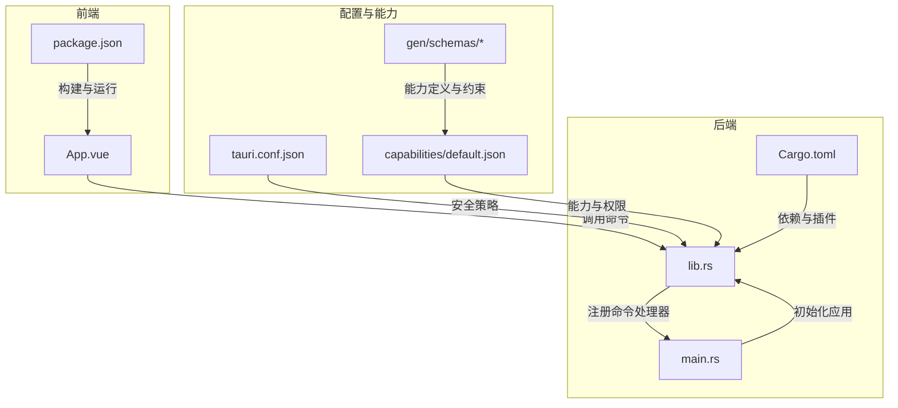
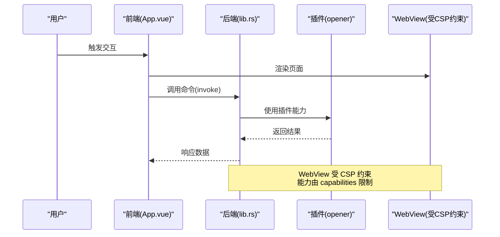
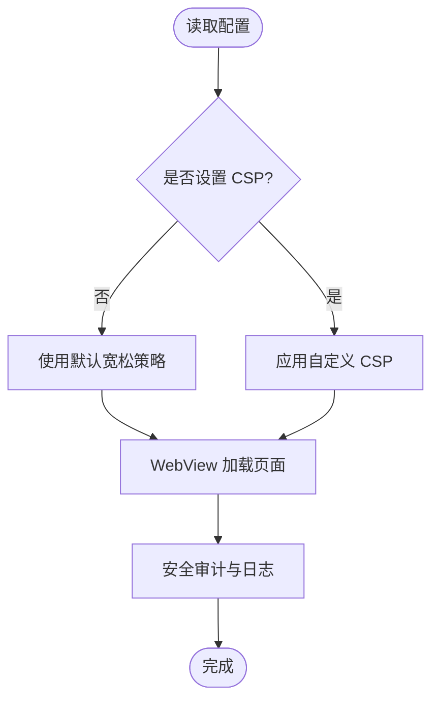
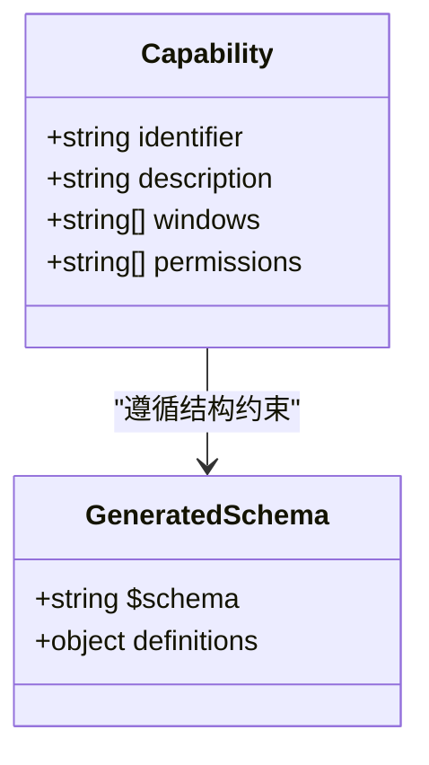
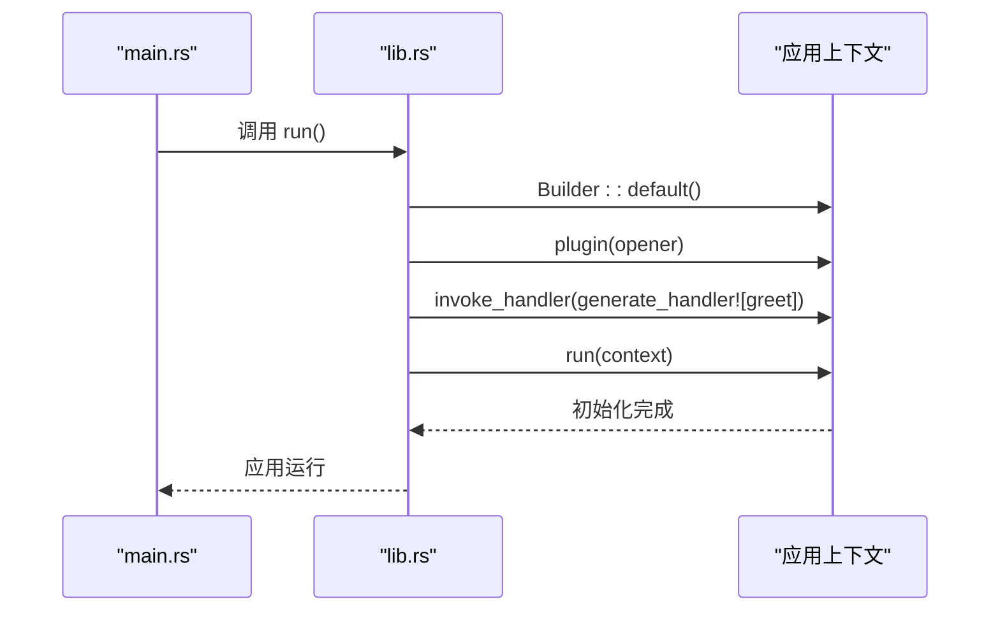
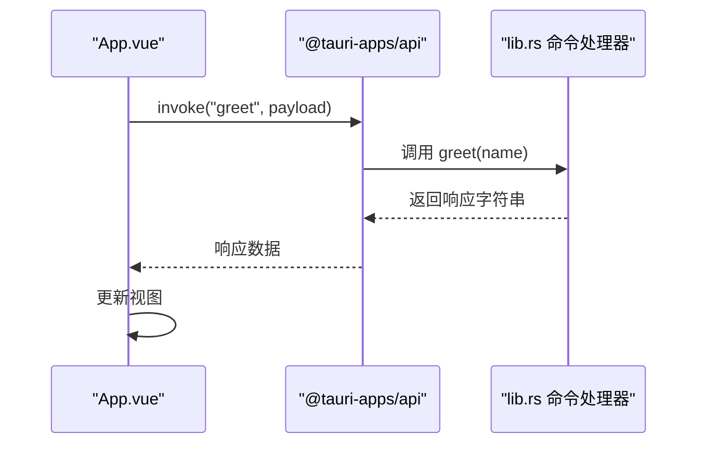
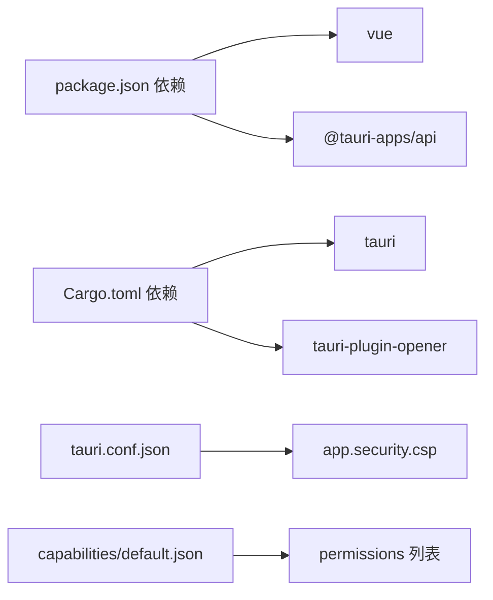

# 安全策略配置

<cite>
**本文档引用的文件**
- [tauri.conf.json](file://src-tauri/tauri.conf.json)
- [default.json](file://src-tauri/capabilities/default.json)
- [capabilities.json](file://src-tauri/gen/schemas/capabilities.json)
- [windows-schema.json](file://src-tauri/gen/schemas/windows-schema.json)
- [desktop-schema.json](file://src-tauri/gen/schemas/desktop-schema.json)
- [lib.rs](file://src-tauri/src/lib.rs)
- [main.rs](file://src-tauri/src/main.rs)
- [App.vue](file://src/App.vue)
- [Cargo.toml](file://src-tauri/Cargo.toml)
- [package.json](file://package.json)
</cite>

## 目录
1. [简介](#简介)
2. [项目结构](#项目结构)
3. [核心组件](#核心组件)
4. [架构总览](#架构总览)
5. [详细组件分析](#详细组件分析)
6. [依赖关系分析](#依赖关系分析)
7. [性能考虑](#性能考虑)
8. [故障排除指南](#故障排除指南)
9. [结论](#结论)
10. [附录](#附录)

## 简介
本文件聚焦于 Tauri 应用的安全策略配置，特别是 `tauri.conf.json` 中 `app.security` 配置块的作用与影响。当前项目中该配置块处于默认状态（CSP 设置为 null），这意味着未强制执行内容安全策略。本文将系统阐述：
- CSP 的概念、作用与在 Tauri WebView 中的应用方式
- 如何通过 CSP 防范 XSS 等常见安全威胁
- 不同使用场景下的 CSP 配置建议
- 安全配置对应用信任边界的影响与权衡
- 权限最小化、安全头设置与输入验证等最佳实践
- 安全审计与漏洞检测方法

## 项目结构
该项目采用典型的 Tauri 前后端分离架构：前端使用 Vue 3 + TypeScript，后端使用 Rust，通过 Tauri 的命令机制进行通信。安全配置主要集中在 `tauri.conf.json` 的 `app.security.csp` 字段；能力与权限控制由 `capabilities` 机制管理。

图表来源
- [tauri.conf.json:12-22](file://src-tauri/tauri.conf.json#L12-L22)
- [default.json:6-9](file://src-tauri/capabilities/default.json#L6-L9)
- [lib.rs:8-14](file://src-tauri/src/lib.rs#L8-L14)
- [main.rs:4-6](file://src-tauri/src/main.rs#L4-L6)

章节来源
- [tauri.conf.json:12-22](file://src-tauri/tauri.conf.json#L12-L22)
- [default.json:1-11](file://src-tauri/capabilities/default.json#L1-L11)
- [lib.rs:1-15](file://src-tauri/src/lib.rs#L1-L15)
- [main.rs:1-7](file://src-tauri/src/main.rs#L1-L7)
- [package.json:1-25](file://package.json#L1-L25)
- [Cargo.toml:1-26](file://src-tauri/Cargo.toml#L1-L26)

## 核心组件
- 安全配置入口：`tauri.conf.json` 的 `app.security.csp` 字段用于声明内容安全策略。当前项目中该字段为 null，表示未启用 CSP。
- 能力与权限：通过 `capabilities/default.json` 定义窗口与权限范围，限制 WebView 对 IPC 层的访问能力，形成信任边界。
- 命令与插件：后端通过 `lib.rs` 注册命令处理器，并加载 `opener` 插件；`main.rs` 负责应用启动。
- 前端交互：`App.vue` 提供用户界面与基础交互，通过 `@tauri-apps/api` 调用 Rust 命令。

章节来源
- [tauri.conf.json:20-22](file://src-tauri/tauri.conf.json#L20-L22)
- [default.json:6-9](file://src-tauri/capabilities/default.json#L6-L9)
- [lib.rs:8-14](file://src-tauri/src/lib.rs#L8-L14)
- [main.rs:4-6](file://src-tauri/src/main.rs#L4-L6)
- [App.vue:1-160](file://src/App.vue#L1-L160)

## 架构总览
下图展示了从用户交互到命令处理与安全策略的整体流程，以及能力边界对 IPC 访问的约束。

图表来源
- [App.vue:8-11](file://src/App.vue#L8-L11)
- [lib.rs:2-5](file://src-tauri/src/lib.rs#L2-L5)
- [lib.rs:10-11](file://src-tauri/src/lib.rs#L10-L11)
- [default.json:6-9](file://src-tauri/capabilities/default.json#L6-L9)
- [tauri.conf.json:20-22](file://src-tauri/tauri.conf.json#L20-L22)

## 详细组件分析

### 安全配置块与 CSP
- 当前配置：`app.security.csp` 为 null，表示未设置内容安全策略。
- 影响：WebView 默认允许更多资源加载与脚本执行，降低 XSS 防护强度。
- 建议：根据应用需求设置合理的 CSP，限制来源、脚本执行与内联脚本等。

图表来源
- [tauri.conf.json:20-22](file://src-tauri/tauri.conf.json#L20-L22)

章节来源
- [tauri.conf.json:20-22](file://src-tauri/tauri.conf.json#L20-L22)

### 能力与权限边界
- 能力定义：`capabilities/default.json` 指定窗口与权限集合，例如 `core:default`、`opener:default`。
- 作用：限制 WebView 对 IPC 命令的访问范围，降低攻击面。
- 生成与约束：`gen/schemas/*` 定义了能力的结构与约束，确保配置合法。

图表来源
- [default.json:1-11](file://src-tauri/capabilities/default.json#L1-L11)
- [capabilities.json:1-1](file://src-tauri/gen/schemas/capabilities.json#L1-L1)
- [windows-schema.json:39-46](file://src-tauri/gen/schemas/windows-schema.json#L39-L46)
- [desktop-schema.json:39-46](file://src-tauri/gen/schemas/desktop-schema.json#L39-L46)

章节来源
- [default.json:6-9](file://src-tauri/capabilities/default.json#L6-L9)
- [capabilities.json:1-1](file://src-tauri/gen/schemas/capabilities.json#L1-L1)
- [windows-schema.json:39-46](file://src-tauri/gen/schemas/windows-schema.json#L39-L46)
- [desktop-schema.json:39-46](file://src-tauri/gen/schemas/desktop-schema.json#L39-L46)

### 命令与插件集成
- 命令注册：`lib.rs` 中通过 `generate_handler!` 注册命令处理器，如 `greet`。
- 插件加载：初始化 `opener` 插件以支持外部打开等能力。
- 启动流程：`main.rs` 调用 `run()` 启动应用上下文。

图表来源
- [main.rs:4-6](file://src-tauri/src/main.rs#L4-L6)
- [lib.rs:8-14](file://src-tauri/src/lib.rs#L8-L14)

章节来源
- [lib.rs:2-5](file://src-tauri/src/lib.rs#L2-L5)
- [lib.rs:8-14](file://src-tauri/src/lib.rs#L8-L14)
- [main.rs:4-6](file://src-tauri/src/main.rs#L4-L6)

### 前端交互与命令调用
- 前端通过 `@tauri-apps/api` 发起命令调用，例如 `invoke("greet", { name })`。
- 后端命令处理返回字符串响应，前端渲染到页面。

图表来源
- [App.vue:8-11](file://src/App.vue#L8-L11)
- [lib.rs:2-5](file://src-tauri/src/lib.rs#L2-L5)

章节来源
- [App.vue:8-11](file://src/App.vue#L8-L11)
- [lib.rs:2-5](file://src-tauri/src/lib.rs#L2-L5)

## 依赖关系分析
- 前端依赖：Vue 3、@tauri-apps/api、开发工具链。
- 后端依赖：Tauri 核心、opener 插件、序列化库。
- 配置与能力：通过 JSON Schema 与生成文件约束能力定义。

图表来源
- [package.json:12-22](file://package.json#L12-L22)
- [Cargo.toml:20-25](file://src-tauri/Cargo.toml#L20-L25)
- [tauri.conf.json:20-22](file://src-tauri/tauri.conf.json#L20-L22)
- [default.json:6-9](file://src-tauri/capabilities/default.json#L6-L9)

章节来源
- [package.json:12-22](file://package.json#L12-L22)
- [Cargo.toml:20-25](file://src-tauri/Cargo.toml#L20-L25)
- [tauri.conf.json:20-22](file://src-tauri/tauri.conf.json#L20-L22)
- [default.json:6-9](file://src-tauri/capabilities/default.json#L6-L9)

## 性能考虑
- CSP 过度严格可能增加页面加载失败或功能异常的风险，需在安全与可用性间平衡。
- 能力分组可减少 IPC 调用的权限检查开销，提升运行时效率。
- 插件与命令的最小化使用有助于降低运行时负担。

## 故障排除指南
- CSP 导致资源加载失败
  - 现象：图片、脚本或样式无法加载。
  - 排查：检查 CSP 中的 `default-src`、`img-src`、`script-src` 等指令是否覆盖必要来源。
  - 处理：逐步放宽至开发环境，生产环境再收紧。
- 权限不足导致命令调用失败
  - 现象：调用命令时报错或无响应。
  - 排查：确认 `capabilities/default.json` 中是否包含对应权限标识。
  - 处理：按需添加权限，遵循最小化原则。
- 开发与生产环境差异
  - 现象：开发环境正常但打包后异常。
  - 排查：对比 `tauri.conf.json` 在不同环境下的配置差异。
  - 处理：确保生产构建包含正确的安全策略与能力配置。

章节来源
- [tauri.conf.json:20-22](file://src-tauri/tauri.conf.json#L20-L22)
- [default.json:6-9](file://src-tauri/capabilities/default.json#L6-L9)

## 结论
- 当前项目未启用 CSP，存在一定的 XSS 风险。建议在开发阶段明确安全目标，逐步引入并收紧 CSP。
- 能力与权限机制是构建信任边界的基石，应结合业务场景实施最小权限原则。
- 将安全策略纳入 CI/CD 流程，配合自动化扫描与人工审计，持续提升应用安全性。

## 附录

### 不同场景下的 CSP 配置建议
- 开发环境
  - 允许本地开发服务器与必要的调试资源。
  - 示例路径参考：[tauri.conf.json:20-22](file://src-tauri/tauri.conf.json#L20-L22)
- 生产环境（仅加载可信资源）
  - 严格限定 `script-src`、`style-src`、`img-src` 等。
  - 禁止内联脚本与 eval。
  - 示例路径参考：[tauri.conf.json:20-22](file://src-tauri/tauri.conf.json#L20-L22)
- 内嵌 WebView（低权限窗口）
  - 通过能力分组限制 IPC 访问，避免敏感命令暴露。
  - 示例路径参考：[default.json:6-9](file://src-tauri/capabilities/default.json#L6-L9)

### 安全最佳实践
- 权限最小化：仅授予完成任务所需的最小权限。
- 输入验证：对所有用户输入进行校验与转义。
- 安全头设置：结合 CSP 与其他安全头共同防护。
- 依赖更新：定期更新依赖与插件，修复已知漏洞。
- 审计与监控：记录安全事件，定期进行渗透测试与代码审计。

### 安全审计与漏洞检测方法
- 自动化扫描
  - 使用静态分析工具检查命令与权限配置。
  - 使用依赖扫描工具识别过期或有漏洞的依赖。
- 手动审计
  - 检查 `tauri.conf.json` 的 CSP 与 `capabilities/default.json` 的权限列表。
  - 验证 WebView 是否加载了不受控的远程资源。
- 动态测试
  - 在隔离环境中模拟 XSS 攻击向量，验证 CSP 效果。
  - 对命令调用路径进行模糊测试，确保输入处理健壮。