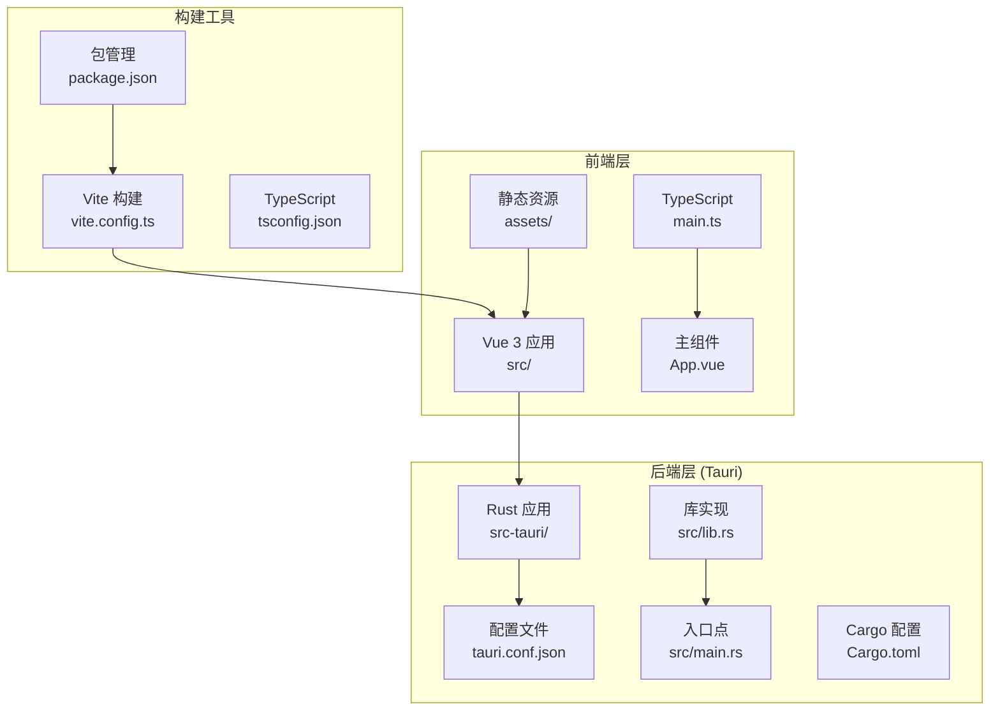
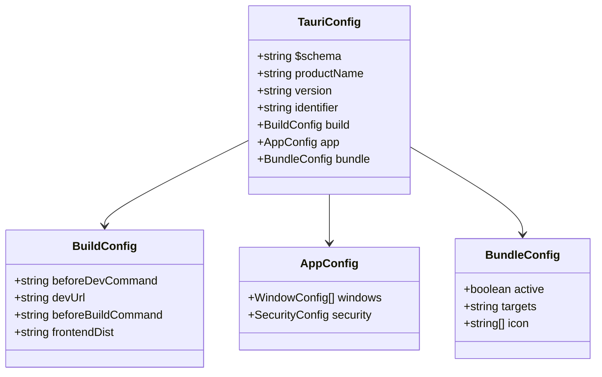
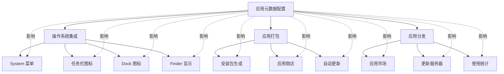
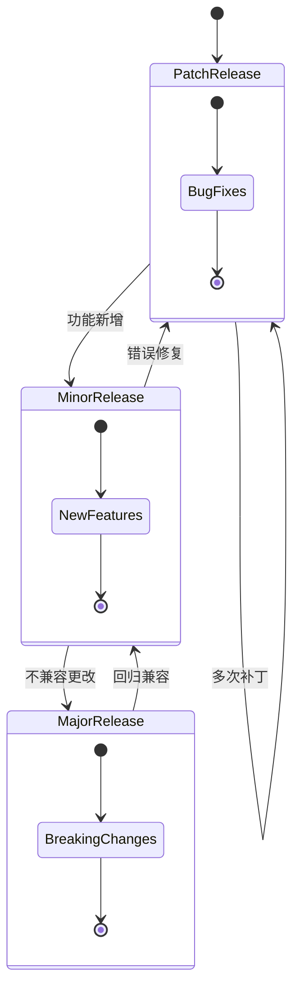
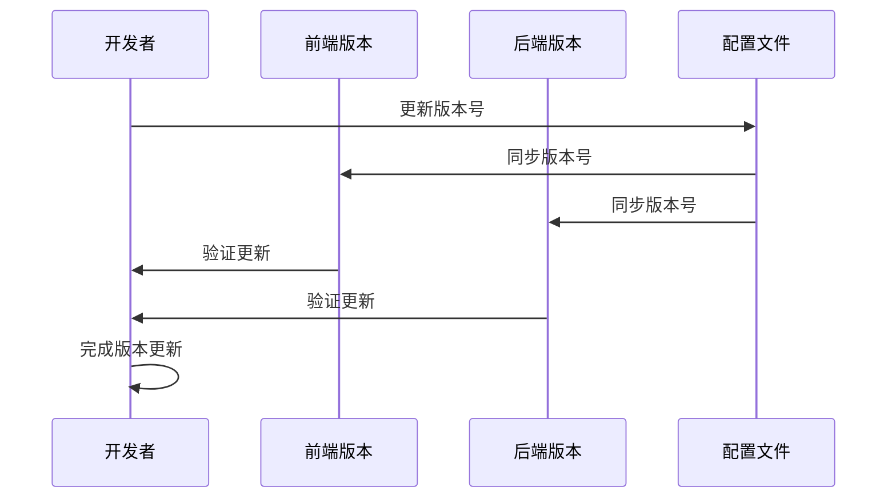
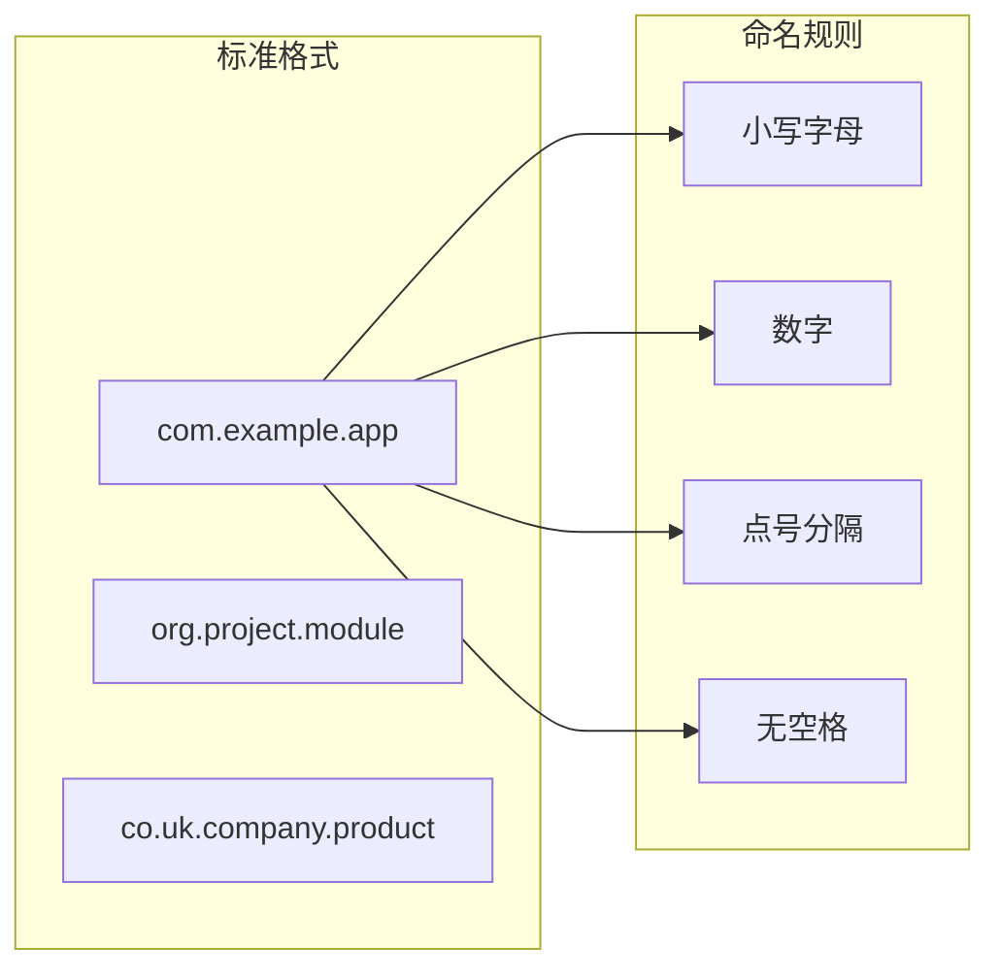
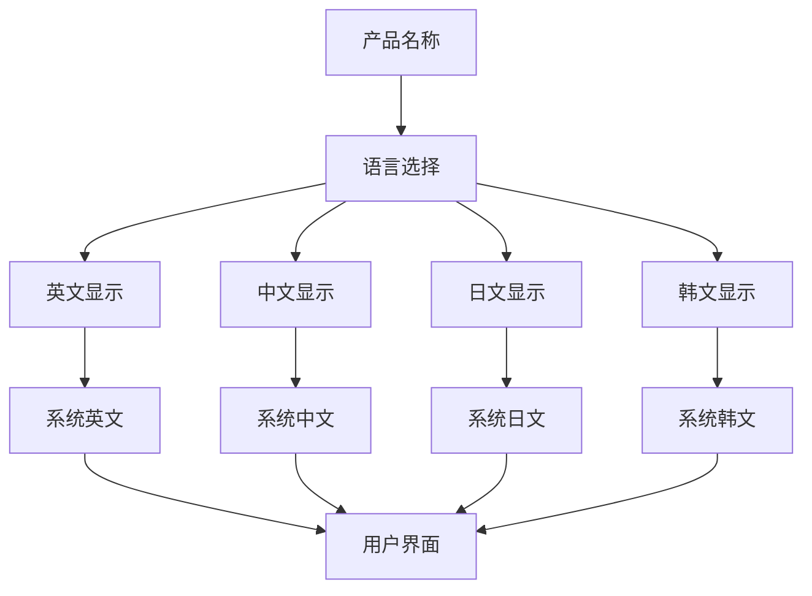
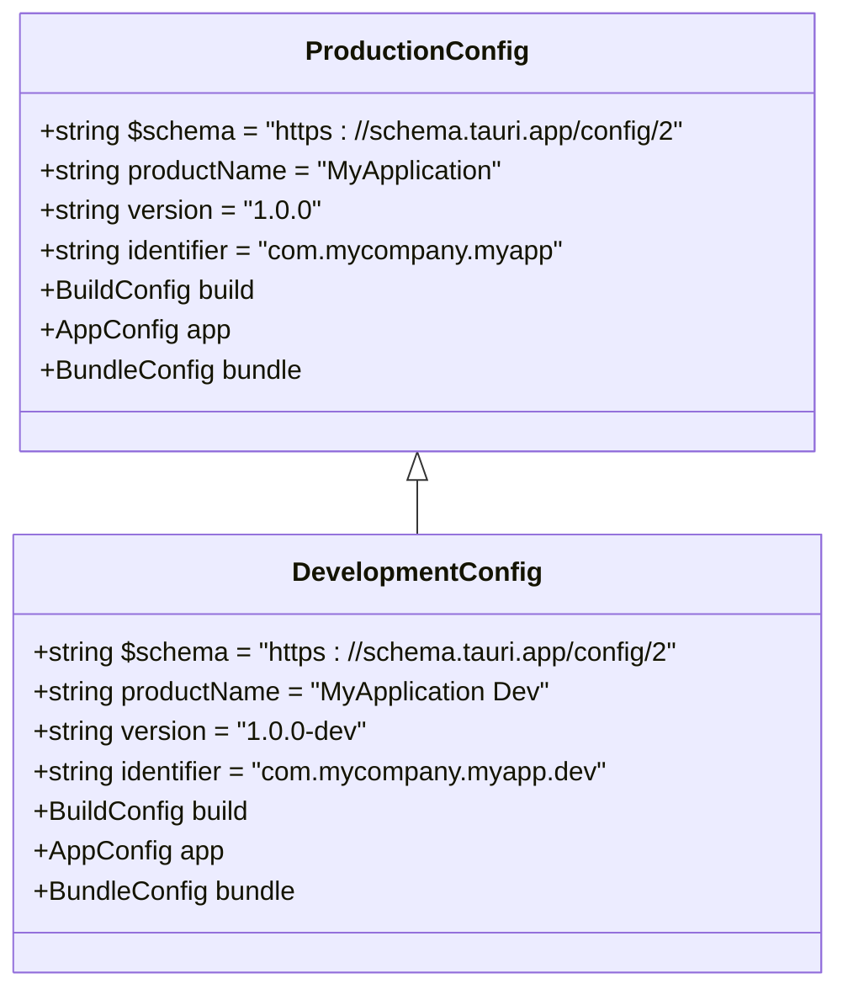
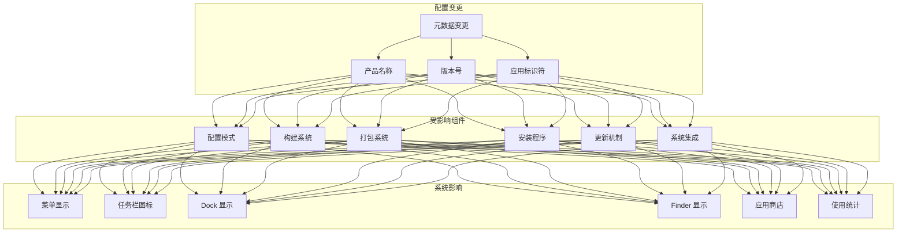

# 应用元数据配置

<cite>
**本文档引用的文件**
- [tauri.conf.json](file://src-tauri/tauri.conf.json)
- [package.json](file://package.json)
- [Cargo.toml](file://src-tauri/Cargo.toml)
- [main.rs](file://src-tauri/src/main.rs)
- [lib.rs](file://src-tauri/src/lib.rs)
- [AGENTS.md](file://AGENTS.md)
</cite>

## 目录
1. [简介](#简介)
2. [项目结构概览](#项目结构概览)
3. [核心元数据配置详解](#核心元数据配置详解)
4. [配置项作用与影响分析](#配置项作用与影响分析)
5. [版本号管理策略](#版本号管理策略)
6. [应用标识符命名规范](#应用标识符命名规范)
7. [产品名称国际化考虑](#产品名称国际化考虑)
8. [配置示例与最佳实践](#配置示例与最佳实践)
9. [配置变更影响分析](#配置变更影响分析)
10. [故障排除指南](#故障排除指南)
11. [总结](#总结)

## 简介

本文件专注于 Tauri 应用中 `tauri.conf.json` 的应用元数据配置。应用元数据是应用程序的核心标识信息，包括产品名称、版本号和应用标识符等关键字段。这些配置不仅决定了应用在用户系统中的显示方式，还直接影响应用的打包、分发和系统集成行为。

在本项目中，我们分析了一个基于 Vue 3 + TypeScript + Tauri 2 的桌面应用，其核心配置位于 `src-tauri/tauri.conf.json` 文件中。该配置文件定义了应用的基本元数据，为后续的应用开发、构建和发布奠定了基础。

## 项目结构概览

该项目采用典型的 Tauri 双层架构设计，前端使用 Vue 3 + TypeScript，后端使用 Rust 语言。整体项目结构清晰分离了前端和后端代码：

**图表来源**
- [tauri.conf.json:1-36](file://src-tauri/tauri.conf.json#L1-L36)
- [package.json:1-25](file://package.json#L1-L25)
- [Cargo.toml:1-26](file://src-tauri/Cargo.toml#L1-L26)

**章节来源**
- [AGENTS.md:73-90](file://AGENTS.md#L73-L90)
- [tauri.conf.json:1-36](file://src-tauri/tauri.conf.json#L1-L36)

## 核心元数据配置详解

### 基础配置结构

在 `tauri.conf.json` 文件中，应用元数据配置位于文件的前几行，构成了应用的基础标识信息：

**图表来源**
- [tauri.conf.json:1-36](file://src-tauri/tauri.conf.json#L1-L36)

### 核心元数据字段分析

#### 产品名称 (productName)

产品名称是应用在用户界面中显示的主要标识符，直接影响用户体验和品牌认知。

**当前配置**: `"productName": "YiMao"`

产品名称的特点：
- **显示用途**: 在窗口标题、系统任务栏、应用启动器中显示
- **国际化支持**: 支持多语言字符集
- **长度限制**: 通常建议保持在合理范围内，避免界面截断
- **字符要求**: 支持字母、数字、空格和常见标点符号

#### 版本号 (version)

版本号是应用的版本标识，用于区分不同版本的应用程序。

**当前配置**: `"version": "0.1.0"`

版本号遵循语义化版本控制 (SemVer) 规范：
- **格式**: 主版本号.次版本号.修订号
- **更新策略**: 
  - 主版本号：重大更新或不兼容更改
  - 次版本号：功能新增但向后兼容
  - 修订号：错误修复和小改进
- **发布时机**: 每次正式发布时更新

#### 应用标识符 (identifier)

应用标识符是应用的唯一系统级标识符，确保应用在操作系统中的唯一性。

**当前配置**: `"identifier": "com.tauri-app.app"`

应用标识符的规范要求：
- **域名反向顺序**: 使用反向域名表示法 (com.example.app)
- **唯一性**: 在同一平台内必须唯一
- **稳定性**: 发布后不应频繁更改
- **可移植性**: 跨平台兼容性考虑

**章节来源**
- [tauri.conf.json:1-36](file://src-tauri/tauri.conf.json#L1-L36)

## 配置项作用与影响分析

### 元数据在系统集成中的作用

应用元数据在系统集成层面发挥着关键作用，影响多个系统组件的行为：

**图表来源**
- [tauri.conf.json:3-5](file://src-tauri/tauri.conf.json#L3-L5)

### 各配置项的具体影响

#### 产品名称的影响范围

产品名称主要影响以下系统组件：
- **窗口标题**: 应用主窗口的标题栏显示
- **系统菜单**: 应用在系统菜单中的显示名称
- **任务管理器**: 进程列表中的应用名称
- **Dock/开始菜单**: 应用启动器中的显示名称

#### 版本号的影响范围

版本号影响多个方面：
- **更新检测**: 自动更新机制识别新版本
- **兼容性判断**: 系统根据版本号进行兼容性检查
- **用户提示**: 更新通知中的版本信息显示
- **统计分析**: 用户使用情况的版本统计

#### 应用标识符的影响范围

应用标识符是最关键的配置项：
- **系统唯一性**: 确保应用在系统中的唯一标识
- **权限管理**: 影响应用的系统权限分配
- **数据隔离**: 决定应用数据的存储位置和隔离级别
- **卸载处理**: 卸载时清理相关文件和注册表项

**章节来源**
- [tauri.conf.json:12-34](file://src-tauri/tauri.conf.json#L12-L34)

## 版本号管理策略

### 语义化版本控制 (SemVer)

推荐采用语义化版本控制策略，确保版本号的规范性和可预测性：

**图表来源**
- [tauri.conf.json:4](file://src-tauri/tauri.conf.json#L4)

### 版本号更新流程

建立标准化的版本号更新流程：

1. **开发阶段**: 使用预发布版本号 (0.1.0-alpha.1)
2. **测试阶段**: 使用候选版本号 (0.1.0-beta.1)
3. **稳定发布**: 使用正式版本号 (0.1.0)
4. **热修复**: 仅更新修订号 (0.1.1)

### 版本号同步策略

确保前后端版本号的一致性：

**图表来源**
- [package.json:4](file://package.json#L4)
- [Cargo.toml:3](file://src-tauri/Cargo.toml#L3)
- [tauri.conf.json:4](file://src-tauri/tauri.conf.json#L4)

**章节来源**
- [package.json:1-25](file://package.json#L1-L25)
- [Cargo.toml:1-26](file://src-tauri/Cargo.toml#L1-L26)

## 应用标识符命名规范

### 域名反向表示法

应用标识符应遵循域名反向表示法，确保全球唯一性：

**图表来源**
- [tauri.conf.json:5](file://src-tauri/tauri.conf.json#L5)

### 平台特定考虑

不同操作系统对应用标识符有不同的要求：

| 平台 | 要求 | 示例 |
|------|------|------|
| Windows | 唯一且可解析的标识符 | com.example.app |
| macOS | 反向域名格式 | com.example.app |
| Linux | 符合 FreeDesktop 规范 | org.example.app |
| Android | Java 包名格式 | com.example.app |
| iOS | 反向域名格式 | com.example.app |

### 标识符变更风险评估

应用标识符一旦确定，应尽量避免更改，因为：

1. **数据迁移**: 用户数据可能无法正确迁移
2. **权限丢失**: 系统权限可能被重置
3. **注册表冲突**: 系统注册表项可能冲突
4. **缓存问题**: 应用缓存可能无法访问

**章节来源**
- [tauri.conf.json:5](file://src-tauri/tauri.conf.json#L5)

## 产品名称国际化考虑

### 多语言支持策略

产品名称需要考虑国际化需求：

### 字符集兼容性

确保产品名称支持多种字符集：

- **ASCII 字符**: 英文字母、数字、基本标点
- **Unicode 字符**: 中文、日文、韩文、阿拉伯文等
- **特殊字符**: 空格、连字符、撇号等
- **长度限制**: 避免过长导致界面截断

### 文化适应性考虑

不同文化背景下的产品名称选择：

| 文化区域 | 考虑因素 | 推荐做法 |
|----------|----------|----------|
| 东亚地区 | 字符长度、字体支持 | 简洁明了 |
| 西方地区 | 发音习惯、商标可用性 | 易于记忆 |
| 中东地区 | 从右到左文字支持 | 测试 RTL 显示 |
| 非拉丁文字 | 字体渲染问题 | 提供备用方案 |

**章节来源**
- [tauri.conf.json:3](file://src-tauri/tauri.conf.json#L3)

## 配置示例与最佳实践

### 基础配置模板

以下是一个完整的应用元数据配置示例：

**图表来源**
- [tauri.conf.json:1-36](file://src-tauri/tauri.conf.json#L1-L36)

### 最佳实践清单

#### 配置质量保证

1. **一致性验证**
   - 前后端版本号保持一致
   - 应用标识符符合平台规范
   - 产品名称简洁易懂

2. **安全性考虑**
   - 避免敏感信息泄露
   - 使用稳定的依赖版本
   - 定期更新安全配置

3. **可维护性设计**
   - 清晰的配置注释
   - 标准化的命名约定
   - 版本化的配置管理

#### 版本管理最佳实践

1. **版本号策略**
   - 采用语义化版本控制
   - 建立版本发布流程
   - 维护版本历史记录

2. **配置变更管理**
   - 变更记录和审批
   - 回滚机制准备
   - 测试环境验证

### 配置模板参考

#### 生产环境配置模板

适用于正式发布的应用配置，强调稳定性和兼容性。

#### 开发环境配置模板

适用于开发和测试环境的配置，便于调试和快速迭代。

#### 测试环境配置模板

适用于自动化测试和质量保证的配置，确保测试环境的一致性。

**章节来源**
- [tauri.conf.json:1-36](file://src-tauri/tauri.conf.json#L1-L36)

## 配置变更影响分析

### 变更传播路径

应用元数据的任何变更都会影响多个系统组件：

**图表来源**
- [tauri.conf.json:1-36](file://src-tauri/tauri.conf.json#L1-L36)

### 兼容性影响评估

#### 向后兼容性

- **应用标识符变更**: 可能导致数据丢失和权限问题
- **版本号变更**: 影响更新检测和用户升级
- **产品名称变更**: 影响用户认知和品牌一致性

#### 向前兼容性

- **配置格式变更**: 需要版本迁移工具
- **功能移除**: 需要降级策略
- **依赖更新**: 需要测试验证

### 影响缓解策略

1. **渐进式变更**: 分阶段实施重大变更
2. **回退机制**: 准备配置回滚方案
3. **测试覆盖**: 全面的功能和回归测试
4. **用户沟通**: 变更前的通知和说明

**章节来源**
- [tauri.conf.json:1-36](file://src-tauri/tauri.conf.json#L1-L36)

## 故障排除指南

### 常见配置问题

#### 版本号格式错误

**问题症状**:
- 构建失败
- 更新检测异常
- 版本比较错误

**解决方案**:
1. 验证版本号格式符合 SemVer 规范
2. 检查版本号递增逻辑
3. 确认前后端版本号同步

#### 应用标识符冲突

**问题症状**:
- 安装失败
- 权限分配错误
- 数据访问异常

**解决方案**:
1. 验证应用标识符的唯一性
2. 检查平台特定的命名规则
3. 确认域名所有权

#### 产品名称编码问题

**问题症状**:
- 界面显示乱码
- 字符截断
- 字体渲染异常

**解决方案**:
1. 确认 UTF-8 编码支持
2. 测试多语言字符显示
3. 验证字体文件完整性

### 调试工具和方法

#### 配置验证

使用 Tauri CLI 进行配置验证：
- `tauri info`: 检查环境配置
- `tauri build --debug`: 调试模式构建
- `tauri dev --verbose`: 详细日志输出

#### 日志分析

监控关键日志信息：
- 配置加载日志
- 构建过程日志
- 运行时错误日志

#### 性能监控

跟踪配置相关的性能指标：
- 启动时间
- 内存使用
- 磁盘占用

**章节来源**
- [AGENTS.md:11-24](file://AGENTS.md#L11-L24)

## 总结

应用元数据配置是 Tauri 应用开发的基础环节，直接影响应用的用户体验、系统集成和分发效果。通过深入分析 `tauri.conf.json` 中的产品名称、版本号和应用标识符配置，我们可以得出以下关键结论：

### 核心要点

1. **配置的重要性**: 应用元数据不仅是显示信息，更是系统级的唯一标识
2. **一致性原则**: 前后端配置必须保持同步，避免运行时错误
3. **平台适配**: 不同操作系统对配置有不同的要求和限制
4. **变更谨慎**: 配置变更可能产生广泛影响，需要严格的测试流程

### 实践建议

- 建立标准化的配置管理流程
- 制定详细的变更审批制度
- 准备完善的回退和恢复机制
- 定期进行配置健康检查

### 未来展望

随着 Tauri 生态系统的不断发展，应用元数据配置将继续演进。开发者应该关注官方文档更新，及时采用新的配置模式和最佳实践，确保应用的长期可维护性和兼容性。

通过遵循本文档提供的指导原则和最佳实践，开发者可以有效地管理应用元数据配置，为用户提供优质的桌面应用体验。