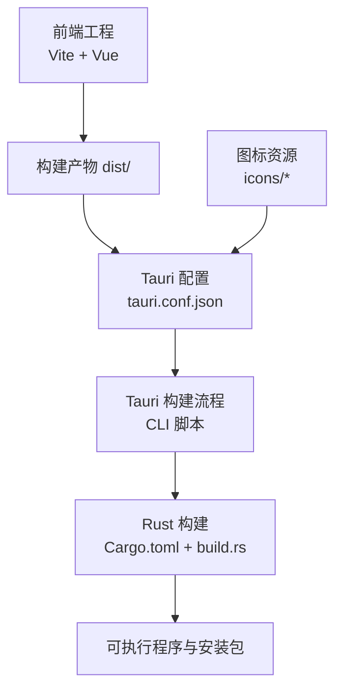
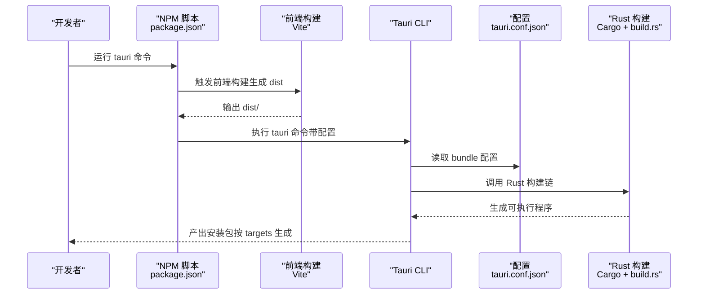
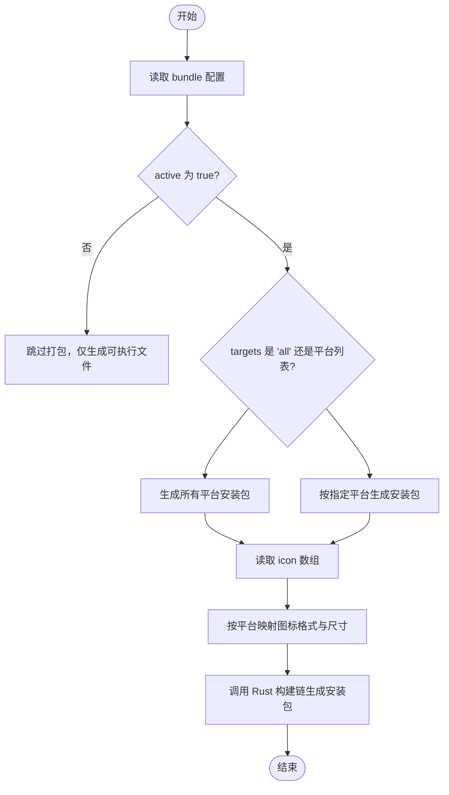
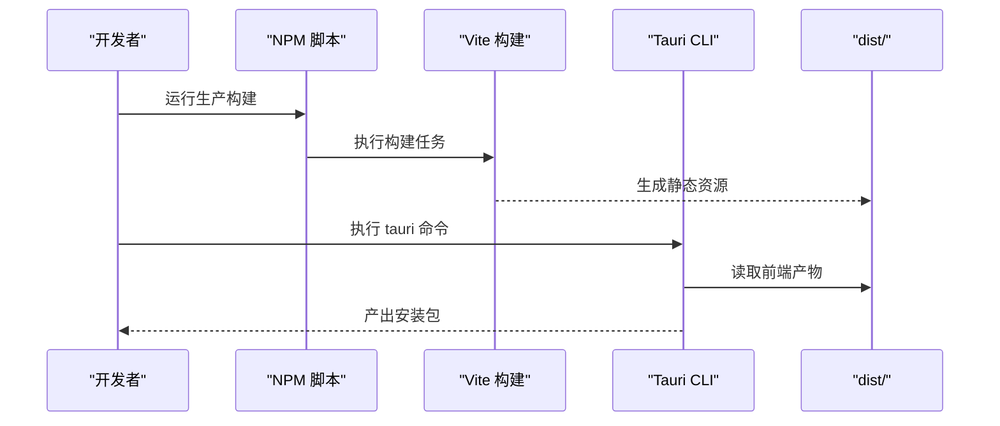
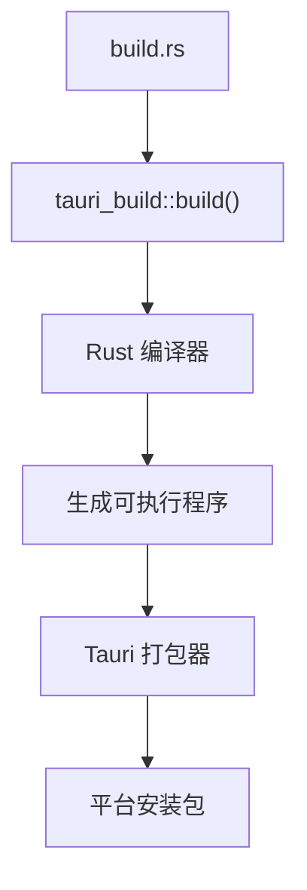
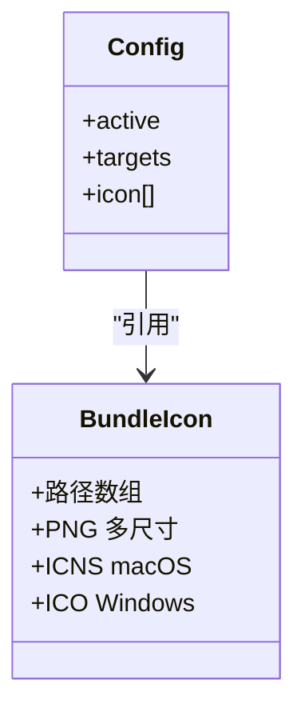
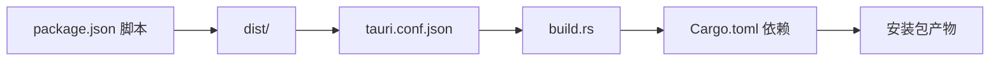

# 打包配置

<cite>
**本文引用的文件**
- [tauri.conf.json](file://src-tauri/tauri.conf.json)
- [Cargo.toml](file://src-tauri/Cargo.toml)
- [build.rs](file://src-tauri/build.rs)
- [package.json](file://package.json)
- [vite.config.ts](file://vite.config.ts)
- [icon.ico](file://src-tauri/icons/icon.ico)
- [icon.icns](file://src-tauri/icons/icon.icns)
- [32x32.png](file://src-tauri/icons/32x32.png)
- [128x128.png](file://src-tauri/icons/128x128.png)
- [128x128@2x.png](file://src-tauri/icons/128x128@2x.png)
</cite>

## 目录
1. [简介](#简介)
2. [项目结构](#项目结构)
3. [核心组件](#核心组件)
4. [架构总览](#架构总览)
5. [详细组件分析](#详细组件分析)
6. [依赖关系分析](#依赖关系分析)
7. [性能考虑](#性能考虑)
8. [故障排查指南](#故障排查指南)
9. [结论](#结论)
10. [附录](#附录)

## 简介
本文件聚焦于 Tauri 应用的打包配置，围绕 tauri.conf.json 中的 bundle 配置块进行系统化说明，涵盖以下主题：
- bundle.active、bundle.targets、bundle.icon 的含义与配置方式
- 多平台打包的目标选择与平台差异
- 图标资源的准备、尺寸与格式要求
- 打包流程、签名与分发建议
- 打包优化策略：减小体积、优化加载与启动性能

## 项目结构
该仓库采用前端（Vite/Vue）+ 后端（Tauri/Rust）的混合架构，打包配置集中在 src-tauri/tauri.conf.json 中，并通过 CLI 脚本触发构建。

图示来源
- [tauri.conf.json:24-34](file://src-tauri/tauri.conf.json#L24-L34)
- [package.json:6-11](file://package.json#L6-L11)
- [Cargo.toml:1-26](file://src-tauri/Cargo.toml#L1-L26)
- [build.rs:1-4](file://src-tauri/build.rs#L1-L4)

章节来源
- [tauri.conf.json:1-36](file://src-tauri/tauri.conf.json#L1-L36)
- [package.json:1-25](file://package.json#L1-L25)
- [Cargo.toml:1-26](file://src-tauri/Cargo.toml#L1-L26)
- [build.rs:1-4](file://src-tauri/build.rs#L1-L4)

## 核心组件
本节聚焦 tauri.conf.json 中的 bundle 配置块，解释其关键字段及作用。

- bundle.active
  - 控制是否启用打包流程。当为 true 时，执行 tauri build 将生成各平台安装包；当为 false 时，跳过打包步骤，仅生成可执行文件。
  - 参考路径：[tauri.conf.json:24-26](file://src-tauri/tauri.conf.json#L24-L26)

- bundle.targets
  - 指定打包目标平台集合。支持字符串值 "all" 表示为所有可用平台生成安装包；也可传入具体平台列表（例如 ["app", "msi"]），以按需生成。
  - 参考路径：[tauri.conf.json:26](file://src-tauri/tauri.conf.json#L26)

- bundle.icon
  - 定义应用图标资源路径数组。Tauri 会根据目标平台自动选择合适的图标格式与尺寸：
    - macOS：使用 .icns 格式
    - Windows：使用 .ico 格式
    - 其他平台：使用 PNG 格式，通常包含多个尺寸以适配不同 DPI 和显示密度
  - 参考路径：[tauri.conf.json:27-33](file://src-tauri/tauri.conf.json#L27-L33)

章节来源
- [tauri.conf.json:24-34](file://src-tauri/tauri.conf.json#L24-L34)

## 架构总览
下图展示从前端构建到最终安装包产出的整体流程，以及与打包配置的关系。

图示来源
- [package.json:6-11](file://package.json#L6-L11)
- [tauri.conf.json:6-11](file://src-tauri/tauri.conf.json#L6-L11)
- [tauri.conf.json:24-34](file://src-tauri/tauri.conf.json#L24-L34)
- [Cargo.toml:17-25](file://src-tauri/Cargo.toml#L17-L25)
- [build.rs:1-4](file://src-tauri/build.rs#L1-L4)

## 详细组件分析

### 组件一：打包配置块（bundle）
- 字段解析
  - active：控制打包开关
  - targets："all" 或平台列表
  - icon：图标资源数组（PNG、ICNS、ICO）
- 平台映射与要求
  - macOS：需要 .icns 文件；建议同时提供标准尺寸以适配 Dock、Finder 等场景
  - Windows：需要 .ico 文件；建议包含多种尺寸（如 16x16、32x32、48x48、256x256）以覆盖不同 DPI
  - Linux：通常使用 PNG；建议提供多尺寸 PNG 以适配桌面环境
- 配置示例定位
  - 参考路径：[tauri.conf.json:24-34](file://src-tauri/tauri.conf.json#L24-L34)

图示来源
- [tauri.conf.json:24-34](file://src-tauri/tauri.conf.json#L24-L34)
- [Cargo.toml:17-25](file://src-tauri/Cargo.toml#L17-L25)
- [build.rs:1-4](file://src-tauri/build.rs#L1-L4)

章节来源
- [tauri.conf.json:24-34](file://src-tauri/tauri.conf.json#L24-L34)

### 组件二：前端构建与打包入口
- 前端构建脚本
  - package.json 中定义了开发与生产构建脚本，生产构建会输出 dist/ 目录供 Tauri 使用
- 开发服务器与热重载
  - Vite 配置固定端口并开启 HMR，便于 tauri dev 时联调
- 关键配置定位
  - 参考路径：[package.json:6-11](file://package.json#L6-L11)，[vite.config.ts:8-32](file://vite.config.ts#L8-L32)

图示来源
- [package.json:6-11](file://package.json#L6-L11)
- [vite.config.ts:8-32](file://vite.config.ts#L8-L32)
- [tauri.conf.json:9-10](file://src-tauri/tauri.conf.json#L9-L10)

章节来源
- [package.json:1-25](file://package.json#L1-L25)
- [vite.config.ts:1-33](file://vite.config.ts#L1-L33)
- [tauri.conf.json:6-11](file://src-tauri/tauri.conf.json#L6-L11)

### 组件三：Rust 构建与打包链
- 构建入口
  - build.rs 调用 tauri_build::build()，作为 Rust 侧构建入口
- 依赖与特性
  - Cargo.toml 中声明 tauri 与 tauri-build 等依赖，确保打包链路可用
- 关键配置定位
  - 参考路径：[build.rs:1-4](file://src-tauri/build.rs#L1-L4)，[Cargo.toml:17-25](file://src-tauri/Cargo.toml#L17-L25)

图示来源
- [build.rs:1-4](file://src-tauri/build.rs#L1-L4)
- [Cargo.toml:17-25](file://src-tauri/Cargo.toml#L17-L25)

章节来源
- [build.rs:1-4](file://src-tauri/build.rs#L1-L4)
- [Cargo.toml:1-26](file://src-tauri/Cargo.toml#L1-L26)

### 组件四：图标资源与平台适配
- 资源清单
  - 当前配置引用了 PNG 与 ICNS/ICO 文件，分别用于非 macOS 与 macOS/Windows 平台
  - 参考路径：[tauri.conf.json:27-33](file://src-tauri/tauri.conf.json#L27-L33)
- 实际文件
  - 已存在图标文件：icon.ico、icon.icns、32x32.png、128x128.png、128x128@2x.png
  - 参考路径：[icon.ico](file://src-tauri/icons/icon.ico)，[icon.icns](file://src-tauri/icons/icon.icns)，[32x32.png](file://src-tauri/icons/32x32.png)，[128x128.png](file://src-tauri/icons/128x128.png)，[128x128@2x.png](file://src-tauri/icons/128x128@2x.png)

图示来源
- [tauri.conf.json:24-34](file://src-tauri/tauri.conf.json#L24-L34)

章节来源
- [tauri.conf.json:27-33](file://src-tauri/tauri.conf.json#L27-L33)
- [icon.ico](file://src-tauri/icons/icon.ico)
- [icon.icns](file://src-tauri/icons/icon.icns)
- [32x32.png](file://src-tauri/icons/32x32.png)
- [128x128.png](file://src-tauri/icons/128x128.png)
- [128x128@2x.png](file://src-tauri/icons/128x128@2x.png)

## 依赖关系分析
- 前端到后端
  - package.json 的构建脚本生成 dist/，供 tauri.conf.json 的 frontendDist 指向
- 后端到打包
  - tauri.conf.json 的 bundle 配置驱动打包流程
  - build.rs 调用 tauri_build，Cargo.toml 提供依赖支撑

图示来源
- [package.json:6-11](file://package.json#L6-L11)
- [tauri.conf.json:9-10](file://src-tauri/tauri.conf.json#L9-L10)
- [tauri.conf.json:24-34](file://src-tauri/tauri.conf.json#L24-L34)
- [build.rs:1-4](file://src-tauri/build.rs#L1-L4)
- [Cargo.toml:17-25](file://src-tauri/Cargo.toml#L17-L25)

章节来源
- [package.json:1-25](file://package.json#L1-L25)
- [tauri.conf.json:6-11](file://src-tauri/tauri.conf.json#L6-L11)
- [tauri.conf.json:24-34](file://src-tauri/tauri.conf.json#L24-L34)
- [build.rs:1-4](file://src-tauri/build.rs#L1-L4)
- [Cargo.toml:1-26](file://src-tauri/Cargo.toml#L1-L26)

## 性能考虑
- 减小应用体积
  - 清理未使用的依赖与资源，避免在 dist/ 中打包冗余文件
  - 在生产构建中启用压缩与 Tree-shaking（由 Vite 默认行为保障）
- 优化加载时间
  - 将大资源外链或延迟加载，减少首屏资源体积
  - 合理拆分前端模块，利用路由懒加载
- 提升启动性能
  - 保持前端产物最小化，避免在 tauri dev 时引入不必要的监听
  - 固定开发端口与严格端口模式，减少网络层开销

## 故障排查指南
- 打包未生成安装包
  - 检查 bundle.active 是否为 true
  - 确认 targets 配置正确
  - 参考路径：[tauri.conf.json:24-26](file://src-tauri/tauri.conf.json#L24-L26)，[tauri.conf.json:26](file://src-tauri/tauri.conf.json#L26)
- 图标不生效或缺失
  - 确认图标路径与实际文件一致，且包含平台所需格式（macOS 的 .icns、Windows 的 .ico）
  - 参考路径：[tauri.conf.json:27-33](file://src-tauri/tauri.conf.json#L27-L33)，[icon.ico](file://src-tauri/icons/icon.ico)，[icon.icns](file://src-tauri/icons/icon.icns)
- 前端构建产物未更新
  - 确保 package.json 的构建脚本已执行，生成 dist/ 并被 tauri.conf.json 正确指向
  - 参考路径：[package.json:6-11](file://package.json#L6-L11)，[tauri.conf.json:9-10](file://src-tauri/tauri.conf.json#L9-L10)
- Rust 构建失败
  - 检查 build.rs 是否调用 tauri_build，以及 Cargo.toml 依赖是否齐全
  - 参考路径：[build.rs:1-4](file://src-tauri/build.rs#L1-L4)，[Cargo.toml:17-25](file://src-tauri/Cargo.toml#L17-L25)

章节来源
- [tauri.conf.json:24-34](file://src-tauri/tauri.conf.json#L24-L34)
- [package.json:6-11](file://package.json#L6-L11)
- [build.rs:1-4](file://src-tauri/build.rs#L1-L4)
- [Cargo.toml:17-25](file://src-tauri/Cargo.toml#L17-L25)

## 结论
本文件基于现有配置与文件结构，系统梳理了 Tauri 打包配置的关键点，明确了 bundle.active、bundle.targets、bundle.icon 的作用与配置方式，并结合前端构建与 Rust 构建链路说明了从开发到打包的完整流程。建议在后续迭代中：
- 明确各平台的图标规格与命名规范，确保跨平台一致性
- 按需调整 targets，减少不必要的平台产物
- 持续优化前端产物体积与加载策略，提升用户体验

## 附录
- 平台与图标建议
  - macOS：提供 .icns 文件，建议包含 16x16、32x32、128x128、256x256、512x512 等尺寸
  - Windows：提供 .ico 文件，建议包含 16x16、24x24、32x32、48x48、256x256 等尺寸
  - Linux：提供多尺寸 PNG，建议覆盖常见 DPI 场景
- 签名与分发
  - Windows：建议为 .msi/.exe 配置代码签名证书，确保用户信任与安全扫描通过
  - macOS：建议为 .app/.dmg 配置开发者证书，启用公证（notarization）以满足 Gatekeeper 要求
  - Linux：可提供 AppImage 或 Snap 等分发形式，必要时提供 GPG 签名