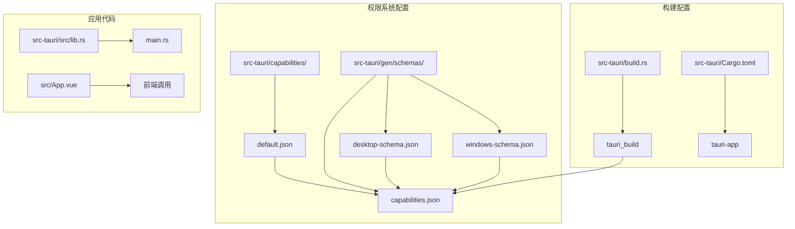
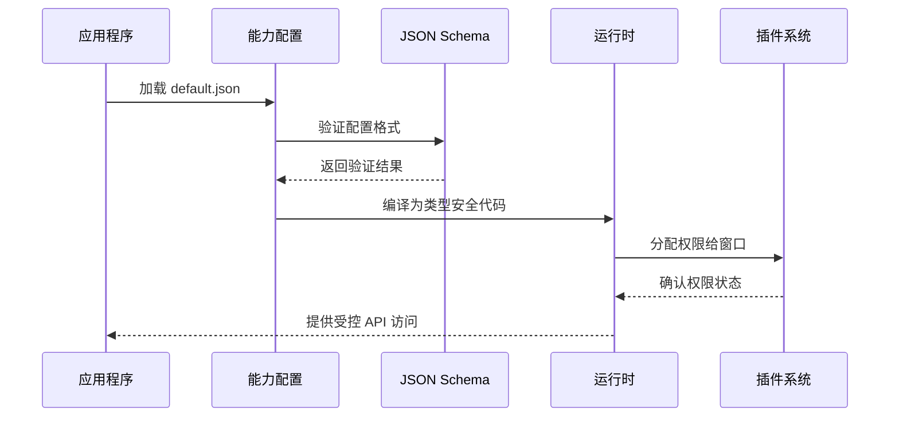
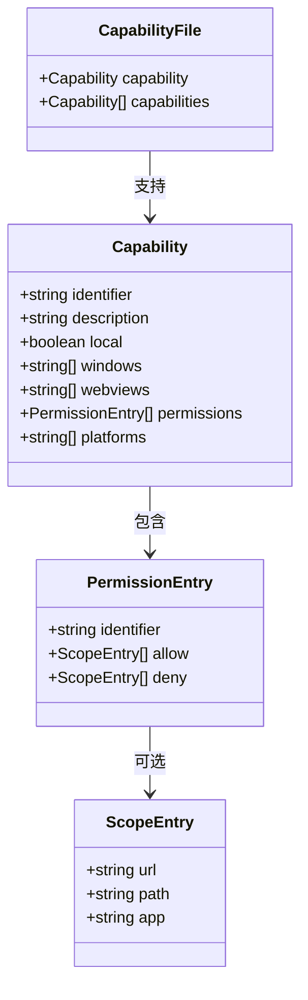
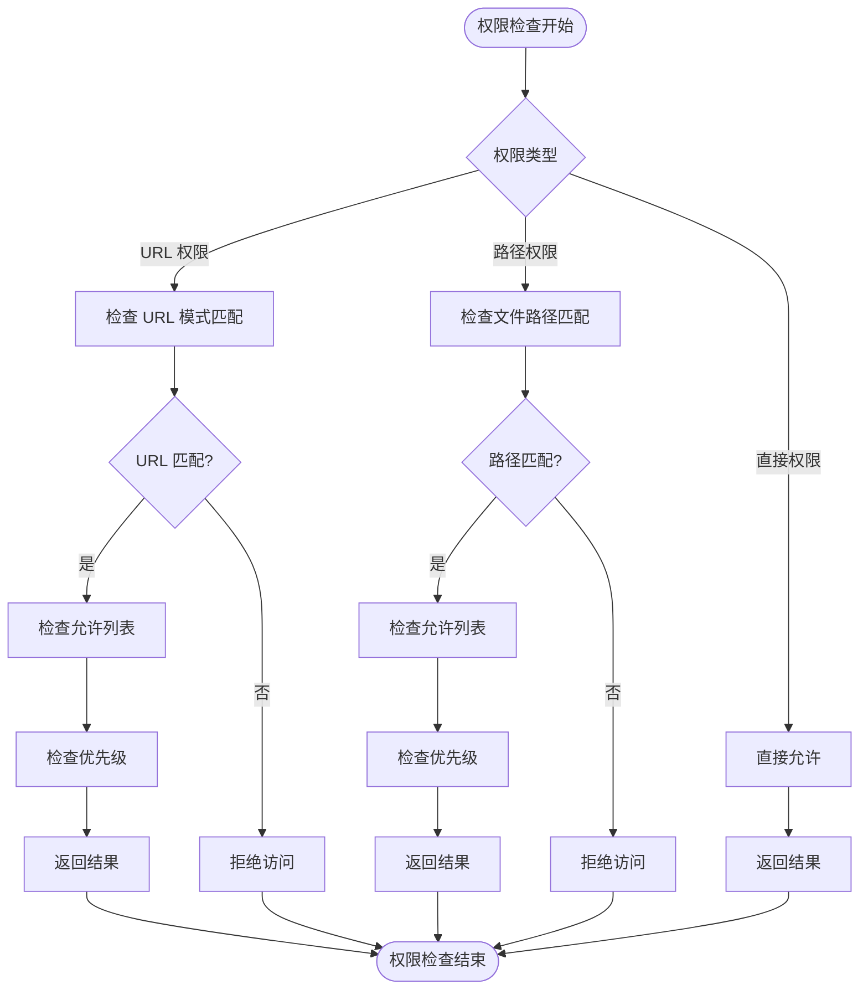
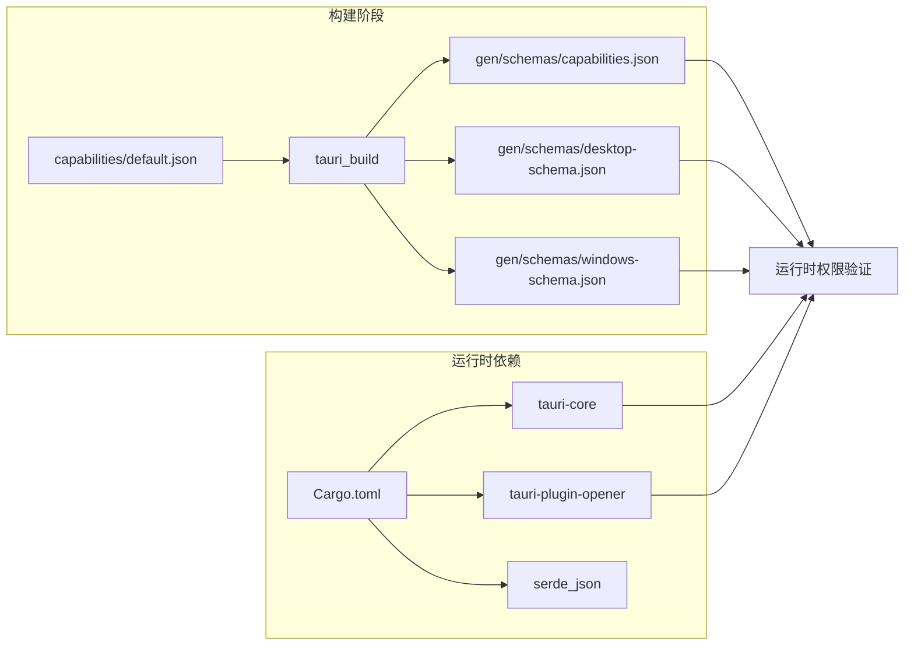

# 权限系统配置

<cite>
**本文档引用的文件**
- [default.json](file://src-tauri/capabilities/default.json)
- [capabilities.json](file://src-tauri/gen/schemas/capabilities.json)
- [desktop-schema.json](file://src-tauri/gen/schemas/desktop-schema.json)
- [windows-schema.json](file://src-tauri/gen/schemas/windows-schema.json)
- [tauri.conf.json](file://src-tauri/tauri.conf.json)
- [Cargo.toml](file://src-tauri/Cargo.toml)
- [lib.rs](file://src-tauri/src/lib.rs)
- [main.rs](file://src-tauri/src/main.rs)
- [build.rs](file://src-tauri/build.rs)
- [App.vue](file://src/App.vue)
</cite>

## 目录
1. [简介](#简介)
2. [项目结构](#项目结构)
3. [核心组件](#核心组件)
4. [架构概览](#架构概览)
5. [详细组件分析](#详细组件分析)
6. [依赖关系分析](#依赖关系分析)
7. [性能考虑](#性能考虑)
8. [故障排除指南](#故障排除指南)
9. [结论](#结论)

## 简介

Tauri 权限系统是一个基于能力（Capability）的安全模型，它通过 JSON 配置文件来定义应用程序窗口和 Webview 对 Tauri 核心、应用程序或插件命令的细粒度访问权限。该系统的核心目标是实现最小权限原则，通过将不同功能需求的窗口分配到不同的能力组中，减少前端漏洞的影响范围。

在本项目中，权限系统通过 `capabilities` 目录下的 JSON 文件进行配置，这些配置在构建时被编译成类型安全的代码，并生成相应的模式文件用于验证。

## 项目结构

项目的权限系统配置主要分布在以下目录和文件中：

**图表来源**
- [default.json:1-11](file://src-tauri/capabilities/default.json#L1-L11)
- [capabilities.json:1-1](file://src-tauri/gen/schemas/capabilities.json#L1-L1)
- [desktop-schema.json:1-800](file://src-tauri/gen/schemas/desktop-schema.json#L1-L800)
- [windows-schema.json:1-800](file://src-tauri/gen/schemas/windows-schema.json#L1-L800)

**章节来源**
- [default.json:1-11](file://src-tauri/capabilities/default.json#L1-L11)
- [capabilities.json:1-1](file://src-tauri/gen/schemas/capabilities.json#L1-L1)
- [desktop-schema.json:1-800](file://src-tauri/gen/schemas/desktop-schema.json#L1-L800)
- [windows-schema.json:1-800](file://src-tauri/gen/schemas/windows-schema.json#L1-L800)

## 核心组件

### 能力配置文件（default.json）

默认的能力配置文件定义了主窗口的权限设置：

- **标识符（identifier）**: "default" - 能力的唯一标识
- **描述（description）**: "Capability for the main window" - 能力的功能描述
- **窗口（windows）**: ["main"] - 应用于主窗口
- **权限列表（permissions）**: 
  - "core:default" - 核心插件的默认权限集合
  - "opener:default" - 打开器插件的默认权限集合

### 生成的模式文件

生成的 `capabilities.json` 文件提供了运行时的权限信息，包含：
- identifier: "default"
- description: "Capability for the main window"
- local: true
- windows: ["main"]
- permissions: ["core:default", "opener:default"]

### JSON Schema 验证

系统使用两个主要的 JSON Schema 进行验证：
- `desktop-schema.json`: 面向桌面平台的能力配置模式
- `windows-schema.json`: 面向 Windows 平台的特定配置模式

**章节来源**
- [default.json:1-11](file://src-tauri/capabilities/default.json#L1-L11)
- [capabilities.json:1-1](file://src-tauri/gen/schemas/capabilities.json#L1-L1)

## 架构概览

Tauri 权限系统采用分层架构设计，通过多层验证确保安全性：

**图表来源**
- [default.json:1-11](file://src-tauri/capabilities/default.json#L1-L11)
- [desktop-schema.json:1-800](file://src-tauri/gen/schemas/desktop-schema.json#L1-L800)
- [lib.rs:1-15](file://src-tauri/src/lib.rs#L1-L15)

## 详细组件分析

### 能力配置结构分析

每个能力配置文件都遵循统一的结构模式：

**图表来源**
- [desktop-schema.json:39-104](file://src-tauri/gen/schemas/desktop-schema.json#L39-L104)
- [desktop-schema.json:122-342](file://src-tauri/gen/schemas/desktop-schema.json#L122-L342)

### 权限分类体系

系统支持多种权限分类：

#### 核心权限（core:）
- **core:default**: 默认核心插件权限集合
- **core:app:**: 应用程序相关权限
- **core:event:**: 事件通信权限
- **core:image:**: 图像处理权限
- **core:menu:**: 菜单操作权限
- **core:tray:**: 托盘功能权限

#### 插件权限（opener:）
- **opener:default**: 默认打开器权限
- **opener:allow-***: 允许特定操作
- **opener:deny-***: 拒绝特定操作

**章节来源**
- [desktop-schema.json:344-800](file://src-tauri/gen/schemas/desktop-schema.json#L344-L800)

### 权限作用域控制

权限可以精确控制到 URL 模式和文件路径级别：

**图表来源**
- [desktop-schema.json:196-334](file://src-tauri/gen/schemas/desktop-schema.json#L196-L334)

## 依赖关系分析

### 构建时依赖

**图表来源**
- [build.rs:1-4](file://src-tauri/build.rs#L1-L4)
- [Cargo.toml:1-26](file://src-tauri/Cargo.toml#L1-L26)

### 运行时集成

应用程序通过以下方式集成权限系统：

1. **插件注册**: 在 `lib.rs` 中注册需要的插件
2. **能力分配**: 通过配置文件将权限分配给特定窗口
3. **运行时验证**: 在执行敏感操作前进行权限检查

**章节来源**
- [lib.rs:1-15](file://src-tauri/src/lib.rs#L1-L15)
- [Cargo.toml:20-25](file://src-tauri/Cargo.toml#L20-L25)

## 性能考虑

### 权限检查优化

1. **缓存机制**: 运行时会缓存权限检查结果，避免重复验证
2. **早期拒绝**: 在权限检查的早期阶段拒绝明显不匹配的请求
3. **批量验证**: 对于多个权限检查，系统会进行批处理优化

### 内存使用

- 能力配置文件在构建时转换为紧凑的二进制格式
- 运行时只加载必要的权限信息
- 使用引用计数避免重复内存分配

## 故障排除指南

### 常见配置错误

#### JSON Schema 验证失败
**症状**: 构建时出现 JSON 验证错误
**解决方法**:
1. 检查 `"$schema"` 字段是否指向正确的模式文件
2. 确保所有必需字段都已正确配置
3. 验证权限标识符的格式是否正确

#### 权限不生效
**症状**: 应用程序无法执行需要权限的操作
**解决方法**:
1. 确认窗口标签与配置中的 `windows` 数组匹配
2. 检查权限标识符是否正确拼写
3. 验证权限作用域是否过于严格

#### 构建错误
**症状**: 编译时出现权限相关的错误
**解决方法**:
1. 检查 `Cargo.toml` 中的依赖版本
2. 确保 `tauri-build` 版本与 Tauri 主版本兼容
3. 清理构建缓存后重新构建

### 调试技巧

1. **启用详细日志**: 在开发环境中启用 Tauri 的详细日志输出
2. **使用权限检查工具**: 利用 Tauri 提供的权限检查工具验证配置
3. **单元测试**: 为关键权限场景编写单元测试

**章节来源**
- [default.json:1-11](file://src-tauri/capabilities/default.json#L1-L11)
- [desktop-schema.json:1-800](file://src-tauri/gen/schemas/desktop-schema.json#L1-L800)

## 结论

Tauri 权限系统通过其灵活且强大的能力配置机制，为现代桌面应用程序提供了细粒度的安全控制。该系统的主要优势包括：

1. **最小权限原则**: 通过能力分组实现最小权限分配
2. **灵活的作用域控制**: 支持从全局到具体的权限控制
3. **类型安全**: 构建时的类型检查确保配置的正确性
4. **可扩展性**: 支持自定义权限和插件权限的扩展

最佳实践建议：
- 为不同功能模块创建独立的能力配置
- 使用通配符进行灵活的权限匹配
- 定期审查和更新权限配置以适应安全需求
- 在开发过程中充分利用权限系统的调试功能

通过合理配置和管理权限系统，开发者可以构建既功能完整又安全可靠的应用程序。