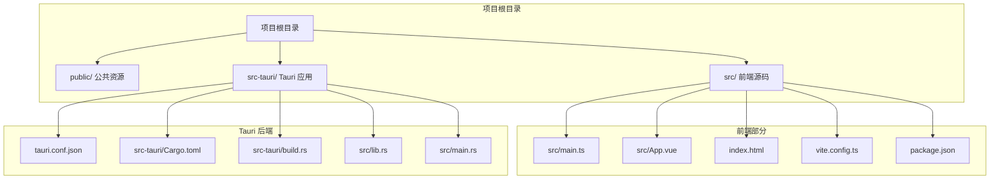
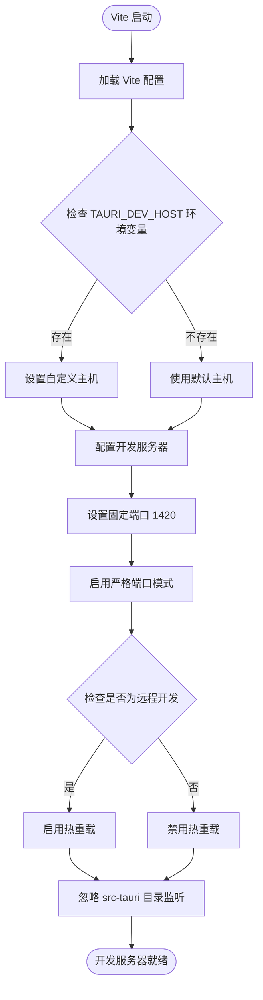
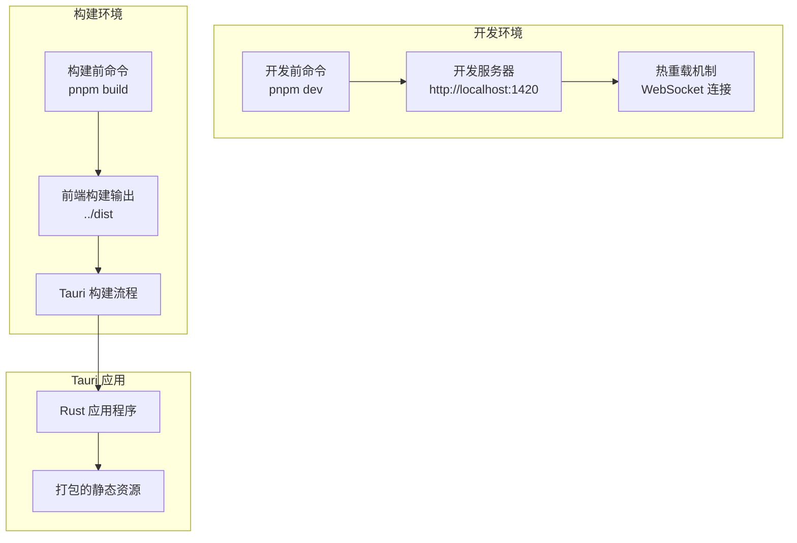
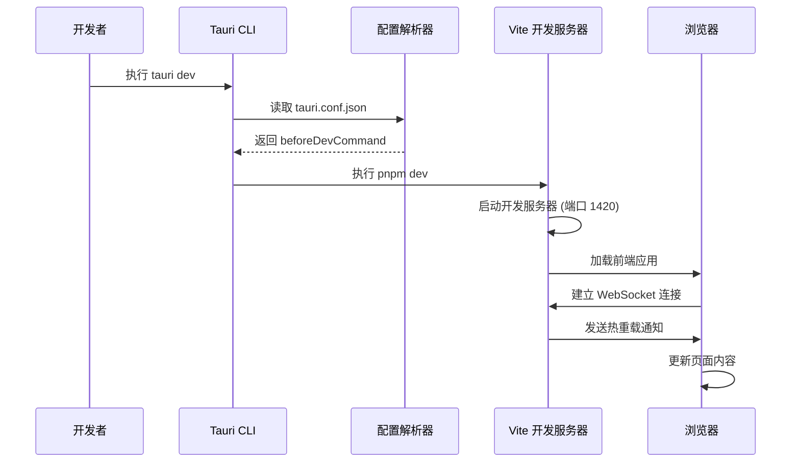
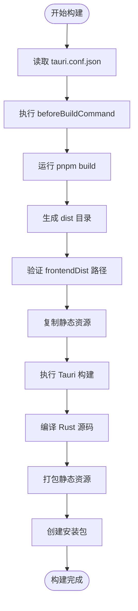
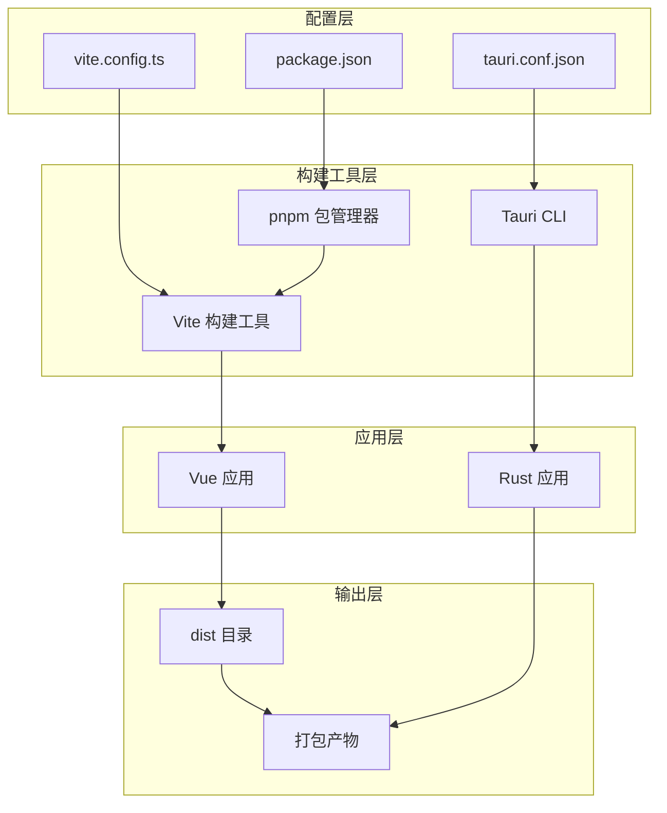

# 构建配置

<cite>
**本文档引用的文件**
- [tauri.conf.json](file://src-tauri/tauri.conf.json)
- [package.json](file://package.json)
- [vite.config.ts](file://vite.config.ts)
- [Cargo.toml](file://src-tauri/Cargo.toml)
- [build.rs](file://src-tauri/build.rs)
- [main.ts](file://src/main.ts)
- [index.html](file://index.html)
</cite>

## 目录
1. [简介](#简介)
2. [项目结构](#项目结构)
3. [核心组件](#核心组件)
4. [架构概览](#架构概览)
5. [详细组件分析](#详细组件分析)
6. [依赖关系分析](#依赖关系分析)
7. [性能考虑](#性能考虑)
8. [故障排除指南](#故障排除指南)
9. [结论](#结论)

## 简介

本文档深入解析 Tauri 应用的构建配置，重点分析 `tauri.conf.json` 中的 build 配置块。该配置定义了开发环境和生产环境的构建流程，包括开发前命令、开发服务器地址、构建前命令和前端构建输出目录等关键设置。文档将详细说明热重载机制的工作原理，提供构建脚本的最佳实践，并解释构建配置对开发效率和应用性能的影响。

## 项目结构

该项目采用典型的 Tauri + Vue + TypeScript 结构，包含前端和后端两个主要部分：

**图表来源**
- [tauri.conf.json:1-36](file://src-tauri/tauri.conf.json#L1-L36)
- [package.json:1-25](file://package.json#L1-L25)
- [vite.config.ts:1-33](file://vite.config.ts#L1-L33)

**章节来源**
- [tauri.conf.json:1-36](file://src-tauri/tauri.conf.json#L1-L36)
- [package.json:1-25](file://package.json#L1-L25)
- [vite.config.ts:1-33](file://vite.config.ts#L1-L33)

## 核心组件

### Tauri 构建配置核心设置

在 `tauri.conf.json` 文件中，build 配置块定义了应用的核心构建行为：

| 配置项 | 类型 | 默认值 | 描述 |
|--------|------|--------|------|
| beforeDevCommand | 字符串 | 无 | 开发模式启动前执行的命令 |
| devUrl | 字符串 | 无 | 开发服务器的 URL 地址 |
| beforeBuildCommand | 字符串 | 无 | 生产构建前执行的命令 |
| frontendDist | 字符串 | 无 | 前端构建输出目录的相对路径 |

这些配置项共同定义了从开发到生产的完整构建流程。

**章节来源**
- [tauri.conf.json:6-11](file://src-tauri/tauri.conf.json#L6-L11)

### Vite 开发服务器配置

Vite 配置文件提供了开发环境的详细设置，包括端口固定、热重载配置和文件监听：

**图表来源**
- [vite.config.ts:5-32](file://vite.config.ts#L5-L32)

**章节来源**
- [vite.config.ts:5-32](file://vite.config.ts#L5-L32)

## 架构概览

整个构建系统采用分层架构设计，从前端构建到后端打包形成完整的开发工作流：

**图表来源**
- [tauri.conf.json:6-11](file://src-tauri/tauri.conf.json#L6-L11)
- [vite.config.ts:16-31](file://vite.config.ts#L16-L31)

## 详细组件分析

### 开发环境构建流程

开发环境的构建流程通过 Tauri 的 `tauri dev` 命令启动，该流程包含以下关键步骤：

**图表来源**
- [tauri.conf.json:7](file://src-tauri/tauri.conf.json#L7)
- [vite.config.ts:16-26](file://vite.config.ts#L16-L26)

#### 热重载机制详解

热重载机制通过 WebSocket 实现实时更新，其工作原理如下：

1. **连接建立**: Vite 在开发服务器启动时根据 `TAURI_DEV_HOST` 环境变量决定是否启用热重载
2. **文件监控**: Vite 监控前端文件变化，但忽略 `src-tauri` 目录以避免不必要的重启
3. **增量更新**: 当检测到文件变化时，Vite 通过 WebSocket 发送更新指令
4. **客户端处理**: 浏览器接收更新指令并局部刷新页面内容

**章节来源**
- [vite.config.ts:16-31](file://vite.config.ts#L16-L31)

### 生产环境构建流程

生产环境的构建流程通过 `tauri build` 命令执行，包含以下步骤：

**图表来源**
- [tauri.conf.json:9-10](file://src-tauri/tauri.conf.json#L9-L10)
- [package.json:8](file://package.json#L8)

**章节来源**
- [tauri.conf.json:9-10](file://src-tauri/tauri.conf.json#L9-L10)
- [package.json:8](file://package.json#L8)

### 构建配置最佳实践

#### 命令配置优化

1. **开发前命令**: 使用 `pnpm dev` 确保开发服务器正确启动
2. **构建前命令**: 使用 `pnpm build` 执行完整的前端构建流程
3. **命令链式执行**: 确保命令按顺序执行，避免依赖缺失

#### 路径设置规范

1. **相对路径**: 使用相对路径确保跨平台兼容性
2. **目录结构**: `frontendDist` 应指向构建输出目录的父级
3. **路径验证**: 在 CI/CD 环境中验证路径有效性

#### 环境变量管理

1. **TAURI_DEV_HOST**: 控制热重载的主机设置
2. **端口配置**: 固定开发端口避免冲突
3. **严格端口模式**: 确保端口可用性

**章节来源**
- [vite.config.ts:5-26](file://vite.config.ts#L5-L26)
- [tauri.conf.json:6-11](file://src-tauri/tauri.conf.json#L6-L11)

## 依赖关系分析

构建系统的依赖关系体现了清晰的分层架构：

**图表来源**
- [tauri.conf.json:1-36](file://src-tauri/tauri.conf.json#L1-L36)
- [vite.config.ts:1-33](file://vite.config.ts#L1-L33)
- [package.json:1-25](file://package.json#L1-L25)

**章节来源**
- [tauri.conf.json:1-36](file://src-tauri/tauri.conf.json#L1-L36)
- [vite.config.ts:1-33](file://vite.config.ts#L1-L33)
- [package.json:1-25](file://package.json#L1-L25)

## 性能考虑

### 开发性能优化

1. **热重载性能**: 通过 WebSocket 实现增量更新，减少全量刷新
2. **文件监听优化**: 忽略 `src-tauri` 目录避免不必要的重建
3. **端口固定**: 避免端口冲突导致的额外开销

### 生产性能优化

1. **构建缓存**: 利用 Vite 的构建缓存机制
2. **资源压缩**: 生产构建自动进行代码压缩和优化
3. **依赖分析**: Tauri 构建时进行依赖分析和优化

### 内存和磁盘使用

1. **开发内存**: 固定端口和热重载服务占用相对较少内存
2. **构建磁盘**: dist 目录大小取决于前端应用复杂度
3. **打包体积**: Tauri 应用相比传统桌面应用具有较小体积

## 故障排除指南

### 常见问题及解决方案

#### 端口冲突问题

**问题**: 开发服务器无法启动，提示端口被占用

**解决方案**:
1. 检查是否有其他进程占用端口 1420
2. 修改 `vite.config.ts` 中的端口配置
3. 确保 `strictPort: true` 设置防止端口回退

#### 热重载不工作

**问题**: 修改代码后页面不自动刷新

**解决方案**:
1. 检查 `TAURI_DEV_HOST` 环境变量设置
2. 验证 WebSocket 连接状态
3. 确认文件监听配置正确

#### 构建失败问题

**问题**: `tauri build` 命令执行失败

**解决方案**:
1. 检查 `beforeBuildCommand` 配置是否正确
2. 验证 `frontendDist` 路径是否存在
3. 确认所有依赖已正确安装

**章节来源**
- [vite.config.ts:16-26](file://vite.config.ts#L16-L26)
- [tauri.conf.json:9-10](file://src-tauri/tauri.conf.json#L9-L10)

## 结论

本项目的构建配置展现了现代桌面应用开发的最佳实践。通过精心设计的开发和生产构建流程，实现了高效的开发体验和优化的应用性能。

关键优势包括：
- **开发效率**: 固定端口和热重载机制显著提升开发体验
- **构建可靠性**: 清晰的命令链和路径配置确保构建过程稳定
- **跨平台兼容**: 相对路径和环境变量配置支持多平台部署
- **性能优化**: 自动化的资源压缩和依赖分析提升应用性能

建议在实际项目中：
1. 根据团队规模调整热重载配置
2. 定期清理构建缓存以保持最佳性能
3. 在 CI/CD 环境中添加构建验证步骤
4. 监控构建时间并持续优化构建流程