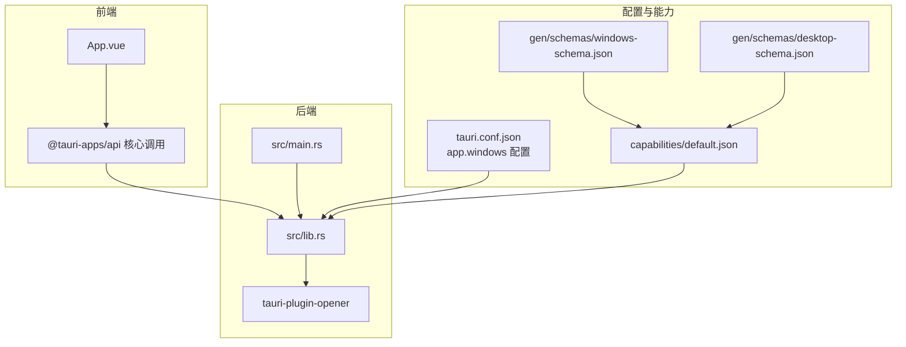
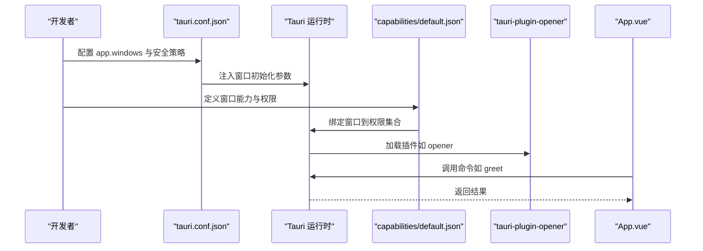
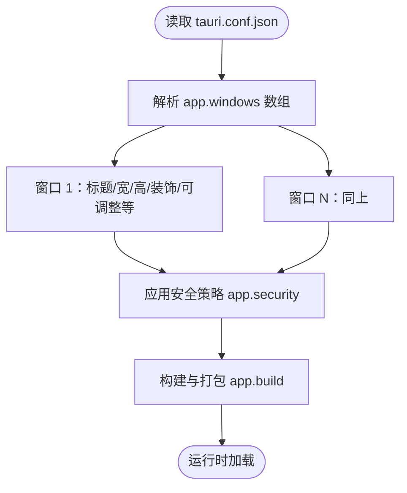
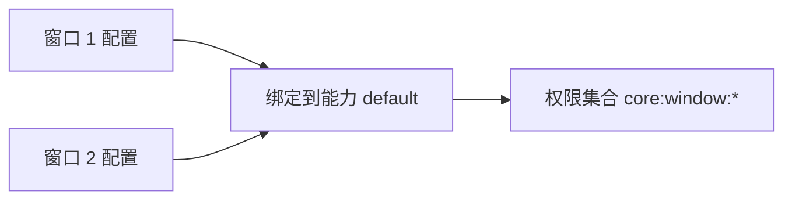
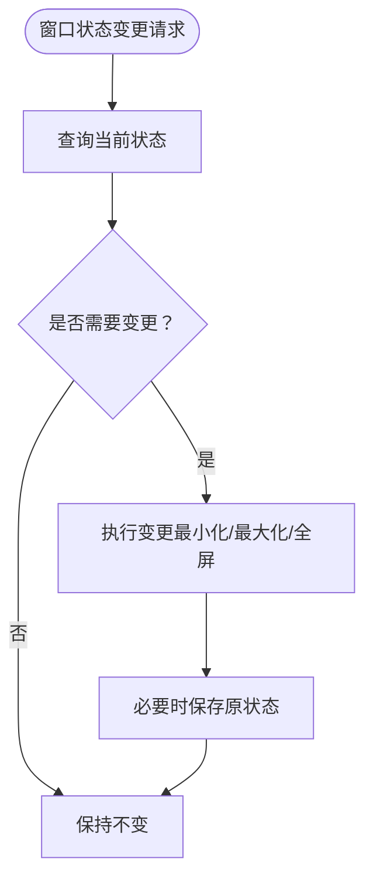
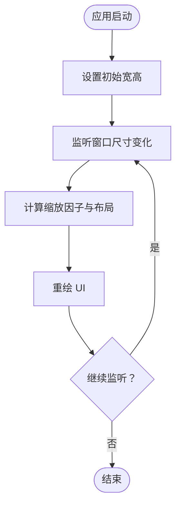
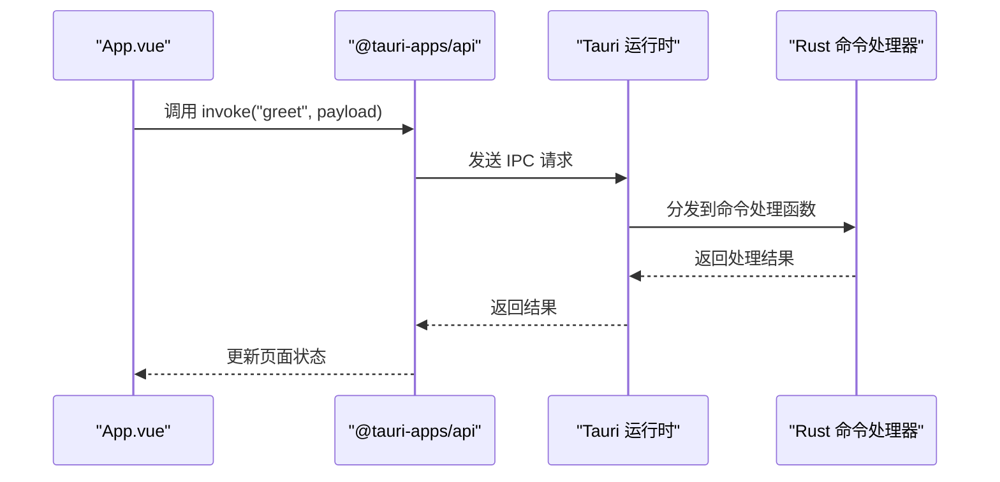
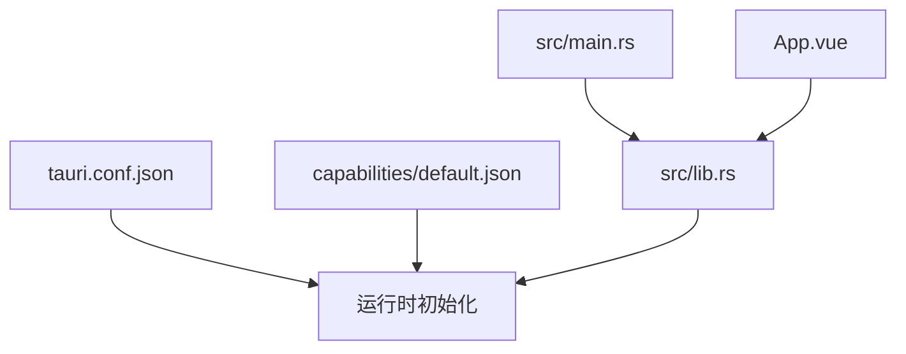

# 窗口管理配置

<cite>
**本文引用的文件**
- [tauri.conf.json](file://src-tauri/tauri.conf.json)
- [lib.rs](file://src-tauri/src/lib.rs)
- [main.rs](file://src-tauri/src/main.rs)
- [Cargo.toml](file://src-tauri/Cargo.toml)
- [default.json](file://src-tauri/capabilities/default.json)
- [windows-schema.json](file://src-tauri/gen/schemas/windows-schema.json)
- [desktop-schema.json](file://src-tauri/gen/schemas/desktop-schema.json)
- [App.vue](file://src/App.vue)
</cite>

## 目录
1. [简介](#简介)
2. [项目结构](#项目结构)
3. [核心组件](#核心组件)
4. [架构总览](#架构总览)
5. [详细组件分析](#详细组件分析)
6. [依赖关系分析](#依赖关系分析)
7. [性能考量](#性能考量)
8. [故障排查指南](#故障排查指南)
9. [结论](#结论)
10. [附录](#附录)

## 简介
本文件聚焦于 Tauri 应用中窗口管理配置的系统性说明，围绕 tauri.conf.json 的 app.windows 数组展开，涵盖窗口标题、宽高、多窗口配置、窗口状态（最小化、最大化、全屏）以及生命周期与内存优化的最佳实践。同时结合项目中的能力（capability）与权限模型，帮助开发者在保证安全的前提下实现灵活的窗口行为。

## 项目结构
本项目采用典型的 Tauri 前后端分离结构：前端为 Vue + TypeScript，通过 Vite 构建；后端 Rust 负责应用运行时与插件集成；配置集中在 tauri.conf.json 中，能力与权限由 capabilities 与生成的 JSON Schema 描述。

**图表来源**
- [tauri.conf.json:12-23](file://src-tauri/tauri.conf.json#L12-L23)
- [lib.rs:8-14](file://src-tauri/src/lib.rs#L8-L14)
- [main.rs:4-6](file://src-tauri/src/main.rs#L4-L6)
- [default.json:1-11](file://src-tauri/capabilities/default.json#L1-L11)
- [windows-schema.json:1-20](file://src-tauri/gen/schemas/windows-schema.json#L1-L20)
- [desktop-schema.json:39-104](file://src-tauri/gen/schemas/desktop-schema.json#L39-L104)

**章节来源**
- [tauri.conf.json:12-23](file://src-tauri/tauri.conf.json#L12-L23)
- [lib.rs:8-14](file://src-tauri/src/lib.rs#L8-L14)
- [main.rs:4-6](file://src-tauri/src/main.rs#L4-L6)
- [default.json:1-11](file://src-tauri/capabilities/default.json#L1-L11)
- [windows-schema.json:1-20](file://src-tauri/gen/schemas/windows-schema.json#L1-L20)
- [desktop-schema.json:39-104](file://src-tauri/gen/schemas/desktop-schema.json#L39-L104)

## 核心组件
- 窗口配置入口：tauri.conf.json 的 app.windows 数组定义了应用启动时的窗口集合与初始属性。
- 运行时集成：src/lib.rs 中通过 Builder 初始化插件与命令处理器，并将配置传递给运行时。
- 能力与权限：capabilities/default.json 将窗口与权限关联，desktop-schema.json 定义了窗口相关权限集（如 core:window:*）。
- 前端交互：App.vue 展示前端界面，通过 @tauri-apps/api 调用后端命令，间接影响窗口行为。

**章节来源**
- [tauri.conf.json:12-23](file://src-tauri/tauri.conf.json#L12-L23)
- [lib.rs:8-14](file://src-tauri/src/lib.rs#L8-L14)
- [default.json:1-11](file://src-tauri/capabilities/default.json#L1-L11)
- [desktop-schema.json:1397-1400](file://src-tauri/gen/schemas/desktop-schema.json#L1397-L1400)

## 架构总览
下图展示了从配置到运行时再到前端调用的整体流程，以及能力与权限对窗口访问的约束。

**图表来源**
- [tauri.conf.json:12-23](file://src-tauri/tauri.conf.json#L12-L23)
- [lib.rs:8-14](file://src-tauri/src/lib.rs#L8-L14)
- [default.json:1-11](file://src-tauri/capabilities/default.json#L1-L11)

## 详细组件分析

### 窗口配置项详解（基于 tauri.conf.json）
- 窗口数组 app.windows：支持多窗口配置，每个元素可设置窗口标题、初始宽高、是否可调整大小、是否装饰等基础属性。
- 安全策略 app.security：可通过 CSP 等字段控制内容安全策略。
- 构建与打包 app.build：定义开发/生产环境的前后端联调地址与资源目录。

**图表来源**
- [tauri.conf.json:12-23](file://src-tauri/tauri.conf.json#L12-L23)

**章节来源**
- [tauri.conf.json:12-23](file://src-tauri/tauri.conf.json#L12-L23)

### 多窗口应用配置
- 在 app.windows 中添加多个对象即可实现多窗口。每个对象可独立设置标题、宽高、位置、状态等。
- 结合 capabilities/default.json 的 windows 字段，可将特定窗口与能力绑定，从而精细化控制其权限范围。

**图表来源**
- [tauri.conf.json:12-23](file://src-tauri/tauri.conf.json#L12-L23)
- [default.json:4-5](file://src-tauri/capabilities/default.json#L4-L5)
- [desktop-schema.json:1397-1400](file://src-tauri/gen/schemas/desktop-schema.json#L1397-L1400)

**章节来源**
- [tauri.conf.json:12-23](file://src-tauri/tauri.conf.json#L12-L23)
- [default.json:1-11](file://src-tauri/capabilities/default.json#L1-L11)

### 窗口状态管理（最小化、最大化、全屏）
- 状态查询与切换：通过 core:window:* 权限集中的 allow-* 命令可查询或修改窗口状态（如 is_minimized、is_maximized、is_fullscreen）。
- 最佳实践：在需要时才进行状态切换，避免频繁切换导致用户感知不适；在全屏/最大化前保存当前状态以便恢复。

**图表来源**
- [desktop-schema.json:1499-1532](file://src-tauri/gen/schemas/desktop-schema.json#L1499-L1532)

**章节来源**
- [desktop-schema.json:1397-1400](file://src-tauri/gen/schemas/desktop-schema.json#L1397-L1400)
- [desktop-schema.json:1499-1532](file://src-tauri/gen/schemas/desktop-schema.json#L1499-L1532)

### 窗口尺寸优化与响应式设计
- 初始尺寸：在 tauri.conf.json 中为窗口设置合理的初始宽高，确保首屏渲染体验。
- 自适应策略：结合前端 CSS 媒体查询与容器尺寸变化，动态调整布局；在窗口尺寸变化时通过命令查询 inner_size/outer_size 并更新 UI。
- 不同分辨率适配：针对高 DPI 场景，使用 scale_factor 获取缩放因子，按比例调整 UI 元素与字体大小。

**图表来源**
- [desktop-schema.json:1397-1400](file://src-tauri/gen/schemas/desktop-schema.json#L1397-L1400)

**章节来源**
- [desktop-schema.json:1397-1400](file://src-tauri/gen/schemas/desktop-schema.json#L1397-L1400)

### 窗口生命周期管理与内存优化
- 生命周期钩子：在运行时中注册窗口事件监听（如 focus、blur、close），在关闭前释放资源、保存状态。
- 内存优化：避免在窗口中长期持有大型对象引用；及时清理定时器、事件监听器与缓存；在后台或最小化状态下降低刷新频率。
- 多窗口协同：对非活动窗口延迟渲染任务，减少不必要的计算与 GPU 占用。

**章节来源**
- [lib.rs:8-14](file://src-tauri/src/lib.rs#L8-L14)

### 前端与后端协作示例（命令调用）
- 前端通过 @tauri-apps/api 调用后端命令，后端在 lib.rs 中注册命令处理器，实现跨语言通信。

**图表来源**
- [App.vue:8-11](file://src/App.vue#L8-L11)
- [lib.rs:2-5](file://src-tauri/src/lib.rs#L2-L5)

**章节来源**
- [App.vue:8-11](file://src/App.vue#L8-L11)
- [lib.rs:2-5](file://src-tauri/src/lib.rs#L2-L5)

## 依赖关系分析
- 配置依赖：tauri.conf.json 是窗口行为的权威来源，直接影响运行时初始化。
- 能力依赖：capabilities/default.json 将窗口与权限解耦，便于细粒度授权与安全隔离。
- 运行时依赖：src/lib.rs 作为运行时入口，负责加载插件、注册命令与上下文生成。
- 前端依赖：App.vue 通过 @tauri-apps/api 与运行时交互，形成完整的调用链路。

**图表来源**
- [tauri.conf.json:12-23](file://src-tauri/tauri.conf.json#L12-L23)
- [default.json:1-11](file://src-tauri/capabilities/default.json#L1-L11)
- [lib.rs:8-14](file://src-tauri/src/lib.rs#L8-L14)
- [main.rs:4-6](file://src-tauri/src/main.rs#L4-L6)
- [App.vue:3](file://src/App.vue#L3)

**章节来源**
- [tauri.conf.json:12-23](file://src-tauri/tauri.conf.json#L12-L23)
- [default.json:1-11](file://src-tauri/capabilities/default.json#L1-L11)
- [lib.rs:8-14](file://src-tauri/src/lib.rs#L8-L14)
- [main.rs:4-6](file://src-tauri/src/main.rs#L4-L6)
- [App.vue:3](file://src/App.vue#L3)

## 性能考量
- 启动阶段：合理设置初始宽高，避免首次渲染后频繁调整尺寸引发重排。
- 渲染节流：在窗口尺寸变化或滚动时使用防抖/节流，减少高频重绘。
- 资源释放：在窗口关闭或后台时释放大对象、停止动画与网络请求。
- 插件开销：仅启用必要的插件，避免无谓的系统调用与内存占用。

## 故障排查指南
- 窗口无法显示或尺寸异常：检查 tauri.conf.json 中 app.windows 的宽高与装饰设置是否合理。
- 权限不足导致功能不可用：核对 capabilities/default.json 的 windows 与 permissions 字段，确认已授予 core:window:* 权限。
- 前端命令调用失败：确认 @tauri-apps/api 的调用路径与命令名一致，且后端已在 lib.rs 中注册对应命令。

**章节来源**
- [tauri.conf.json:12-23](file://src-tauri/tauri.conf.json#L12-L23)
- [default.json:1-11](file://src-tauri/capabilities/default.json#L1-L11)
- [lib.rs:2-5](file://src-tauri/src/lib.rs#L2-L5)

## 结论
通过 tauri.conf.json 的 app.windows 数组，可以精确控制窗口的初始外观与行为；结合 capabilities 与权限模型，既能满足多窗口场景下的差异化需求，又能保障应用的安全边界。配合运行时的生命周期管理与前端的响应式设计，可在不同分辨率与设备环境下提供稳定、流畅的用户体验。

## 附录
- 关键配置参考路径
  - [窗口配置入口:12-23](file://src-tauri/tauri.conf.json#L12-L23)
  - [默认能力绑定:1-11](file://src-tauri/capabilities/default.json#L1-L11)
  - [窗口权限集合:1397-1400](file://src-tauri/gen/schemas/desktop-schema.json#L1397-L1400)
  - [运行时入口与插件加载:8-14](file://src-tauri/src/lib.rs#L8-L14)
  - [主程序入口:4-6](file://src-tauri/src/main.rs#L4-L6)
  - [前端命令调用示例:8-11](file://src/App.vue#L8-L11)