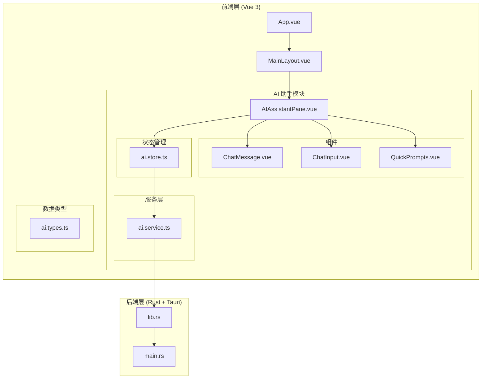
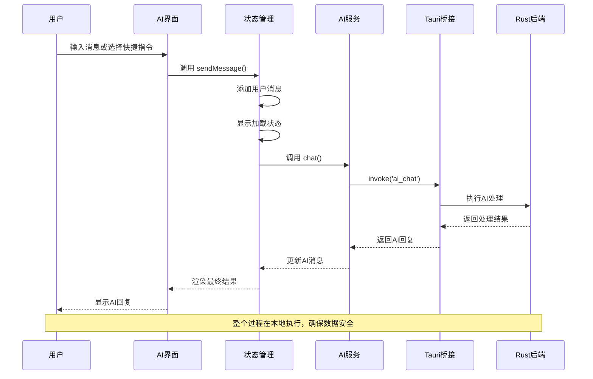
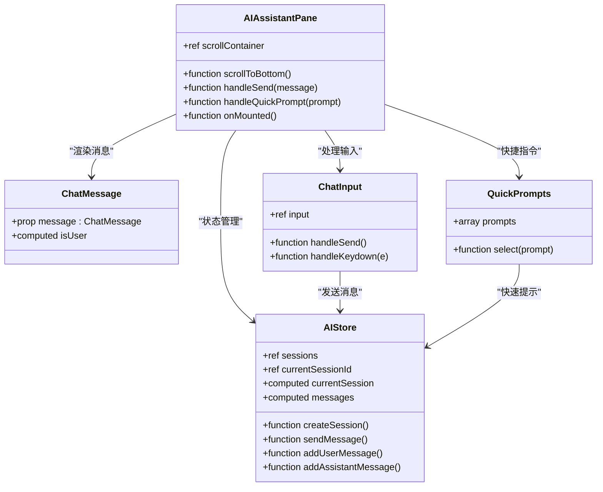
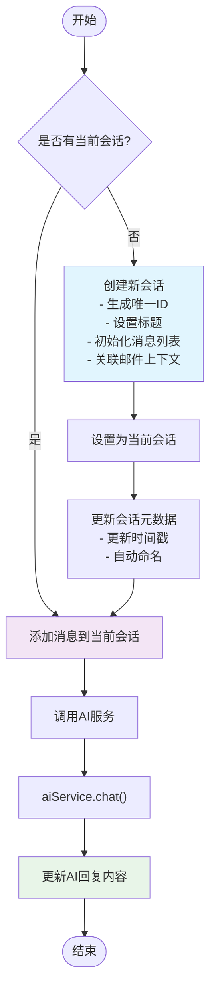
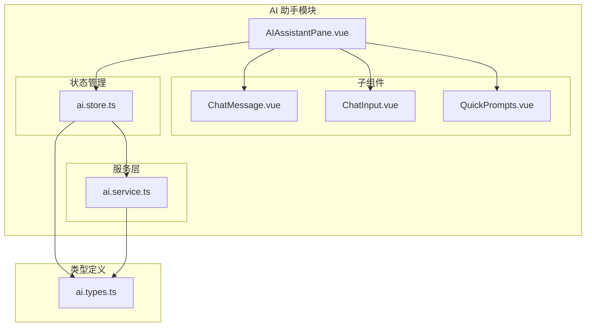

# AI 助手多会话功能

<cite>
**本文档引用的文件**
- [AIAssistantPane.vue](file://src/modules/ai-assistant/AIAssistantPane.vue)
- [ai.store.ts](file://src/stores/ai.store.ts)
- [ai.service.ts](file://src/services/ai.service.ts)
- [ai.types.ts](file://src/types/ai.types.ts)
- [ChatMessage.vue](file://src/modules/ai-assistant/components/ChatMessage.vue)
- [ChatInput.vue](file://src/modules/ai-assistant/components/ChatInput.vue)
- [QuickPrompts.vue](file://src/modules/ai-assistant/components/QuickPrompts.vue)
- [chat-sessions.mock.ts](file://src/data/chat-sessions.mock.ts)
- [main.rs](file://src-tauri/src/main.rs)
- [lib.rs](file://src-tauri/src/lib.rs)
- [README.md](file://README.md)
- [package.json](file://package.json)
</cite>

## 目录
1. [简介](#简介)
2. [项目结构](#项目结构)
3. [核心组件](#核心组件)
4. [架构概览](#架构概览)
5. [详细组件分析](#详细组件分析)
6. [依赖关系分析](#依赖关系分析)
7. [性能考虑](#性能考虑)
8. [故障排除指南](#故障排除指南)
9. [结论](#结论)

## 简介

这是一个基于 Tauri + Vue + TypeScript 构建的桌面应用，专注于提供多会话的 AI 助手功能。该系统允许用户在同一个界面中管理多个独立的聊天会话，每个会话都可以关联到特定的邮件内容，提供智能的邮件处理、总结和回复生成功能。

项目采用现代化的前端架构，使用 Vue 3 的组合式 API 和 Pinia 状态管理，结合 Rust 后端通过 Tauri 提供桌面应用能力。AI 功能通过模拟服务实现，实际部署时可替换为真实的 AI 后端服务。

## 项目结构

该项目采用模块化的前端架构，AI 助手功能位于专门的模块目录中：



**图表来源**
- [AIAssistantPane.vue:1-137](file://src/modules/ai-assistant/AIAssistantPane.vue#L1-L137)
- [ai.store.ts:1-197](file://src/stores/ai.store.ts#L1-L197)
- [ai.service.ts:1-31](file://src/services/ai.service.ts#L1-L31)
- [main.rs:1-7](file://src-tauri/src/main.rs#L1-L7)
- [lib.rs:1-15](file://src-tauri/src/lib.rs#L1-L15)

**章节来源**
- [README.md:1-2](file://README.md#L1-L2)
- [package.json:1-29](file://package.json#L1-L29)

## 核心组件

### 多会话状态管理

AI 助手的核心功能由 Pinia store 实现，支持完整的多会话生命周期管理：

- **会话创建**: 自动生成唯一 ID，支持关联邮件上下文
- **会话切换**: 实时在不同会话间切换
- **会话删除**: 安全移除不需要的会话
- **消息管理**: 用户消息和 AI 回复的完整记录
- **加载状态**: 显示 AI 处理进度

### 通信服务层

AI 服务通过 Tauri IPC 与 Rust 后端通信，提供以下功能：

- **实时聊天**: 文本对话和上下文保持
- **邮件总结**: 自动提取邮件要点
- **智能回复**: 根据邮件内容生成合适回复
- **错误处理**: 完善的异常捕获和降级机制

**章节来源**
- [ai.store.ts:7-197](file://src/stores/ai.store.ts#L7-L197)
- [ai.service.ts:3-31](file://src/services/ai.service.ts#L3-L31)

## 架构概览

系统采用前后端分离的桌面应用架构，通过 Tauri 实现安全的本地执行环境：



**图表来源**
- [AIAssistantPane.vue:27-33](file://src/modules/ai-assistant/AIAssistantPane.vue#L27-L33)
- [ai.store.ts:109-127](file://src/stores/ai.store.ts#L109-L127)
- [ai.service.ts:4-11](file://src/services/ai.service.ts#L4-L11)

## 详细组件分析

### AI 助手面板组件

AIAssistantPane 是整个 AI 助手功能的入口组件，负责协调各个子组件的工作：



**图表来源**
- [AIAssistantPane.vue:1-137](file://src/modules/ai-assistant/AIAssistantPane.vue#L1-L137)
- [ChatMessage.vue:1-132](file://src/modules/ai-assistant/components/ChatMessage.vue#L1-L132)
- [ChatInput.vue:1-77](file://src/modules/ai-assistant/components/ChatInput.vue#L1-L77)
- [QuickPrompts.vue:1-58](file://src/modules/ai-assistant/components/QuickPrompts.vue#L1-L58)
- [ai.store.ts:7-197](file://src/stores/ai.store.ts#L7-L197)

### 状态管理架构

AI 状态管理实现了完整的多会话模式，每个会话都有独立的状态空间：



**图表来源**
- [ai.store.ts:21-83](file://src/stores/ai.store.ts#L21-L83)
- [ai.store.ts:109-127](file://src/stores/ai.store.ts#L109-L127)

### 消息渲染组件

ChatMessage 组件负责不同类型消息的视觉呈现：

- **用户消息**: 右侧显示，蓝色主题
- **AI 消息**: 左侧显示，白色气泡
- **加载状态**: 打字动画效果
- **时间戳**: 精确到分钟的时间显示

**章节来源**
- [AIAssistantPane.vue:13-39](file://src/modules/ai-assistant/AIAssistantPane.vue#L13-L39)
- [ChatMessage.vue:14-38](file://src/modules/ai-assistant/components/ChatMessage.vue#L14-L38)

### 快捷指令系统

QuickPrompts 组件提供了预设的 AI 提示词，支持快速操作：

| 快捷指令 | 功能描述 | 使用场景 |
|---------|---------|---------|
| 总结邮件 | 提取邮件核心要点 | 需要快速了解邮件内容 |
| 写回复 | 生成合适的邮件回复 | 需要礼貌的回复模板 |
| 提取待办 | 识别邮件中的任务项 | 项目管理和任务跟踪 |
| 解释 | 用简单语言解释复杂内容 | 非专业用户理解技术内容 |

**章节来源**
- [QuickPrompts.vue:2-7](file://src/modules/ai-assistant/components/QuickPrompts.vue#L2-L7)

## 依赖关系分析

### 技术栈依赖

项目采用了现代前端开发的最佳实践：

```mermaid
graph LR
subgraph "前端框架"
Vue[Vue 3.5.13]
TS[TypeScript 5.6.2]
Pinia[Pinia 2.3.0]
end
subgraph "构建工具"
Vite[Vite 6.0.3]
SASS[SASS 1.80.0]
end
subgraph "桌面应用"
Tauri[Tauri 2.10.1]
OpenAPI[@tauri-apps/api 2.10.1]
end
subgraph "辅助库"
DayJS[DayJS 1.11.20]
VueUse[@vueuse/core 14.2.0]
end
Vue --> TS
Vue --> Pinia
Vite --> Vue
Tauri --> OpenAPI
Vue --> Tauri
```

**图表来源**
- [package.json:12-26](file://package.json#L12-L26)

### 组件间依赖关系



**图表来源**
- [AIAssistantPane.vue:1-12](file://src/modules/ai-assistant/AIAssistantPane.vue#L1-L12)
- [ai.store.ts:1-6](file://src/stores/ai.store.ts#L1-L6)
- [ai.service.ts:1-2](file://src/services/ai.service.ts#L1-L2)
- [ai.types.ts:1-37](file://src/types/ai.types.ts#L1-L37)

**章节来源**
- [package.json:1-29](file://package.json#L1-L29)

## 性能考虑

### 内存管理优化

- **消息滚动**: 自动滚动到底部，避免 DOM 元素堆积
- **会话清理**: 删除会话时自动释放内存
- **懒加载**: 组件按需加载，减少初始包大小

### 网络通信优化

- **错误降级**: 后端不可用时提供模拟响应
- **并发控制**: 防止重复请求的加载状态管理
- **超时处理**: 合理的请求超时和重试机制

### 用户体验优化

- **即时反馈**: 加载状态和打字动画提升交互感
- **键盘快捷键**: 支持 Enter 键快速发送消息
- **响应式设计**: 适配不同屏幕尺寸

## 故障排除指南

### 常见问题及解决方案

| 问题类型 | 症状 | 可能原因 | 解决方案 |
|---------|------|---------|---------|
| 无法连接AI服务 | 发送消息无响应 | Tauri后端未启动 | 运行 `pnpm tauri dev` 启动完整开发环境 |
| 消息显示异常 | 消息格式错乱 | 样式冲突或数据错误 | 检查消息内容和样式类名 |
| 会话切换失效 | 当前会话无法切换 | 状态管理错误 | 重新初始化AI store |
| 加载状态不消失 | AI回复长时间显示加载 | 异步操作异常 | 检查网络连接和后端服务 |

### 调试技巧

1. **浏览器开发者工具**: 检查网络请求和控制台错误
2. **Tauri调试**: 使用 `cargo run` 查看Rust后端日志
3. **状态检查**: 通过浏览器的Vue DevTools观察Pinia状态变化
4. **模拟数据**: 使用 mock 数据验证 UI 渲染逻辑

**章节来源**
- [ai.service.ts:7-10](file://src/services/ai.service.ts#L7-L10)
- [ai.store.ts:121-124](file://src/stores/ai.store.ts#L121-L124)

## 结论

AI 助手多会话功能展现了现代桌面应用开发的最佳实践，通过合理的架构设计和组件化开发，实现了功能丰富且用户体验优秀的 AI 辅助工具。

### 主要优势

- **模块化设计**: 清晰的组件边界和职责分离
- **状态管理**: 完整的多会话生命周期管理
- **用户体验**: 流畅的交互和即时反馈机制
- **扩展性**: 易于添加新功能和集成新服务

### 技术亮点

- **Tauri 集成**: 安全的本地执行环境
- **TypeScript 类型安全**: 编译时错误检测
- **响应式编程**: Vue 3 组合式 API 的最佳实践
- **Pinia 状态管理**: 简洁高效的状态管理模式

该系统为后续的功能扩展奠定了良好的基础，包括更复杂的 AI 集成、多模型支持、以及更丰富的邮件处理功能。