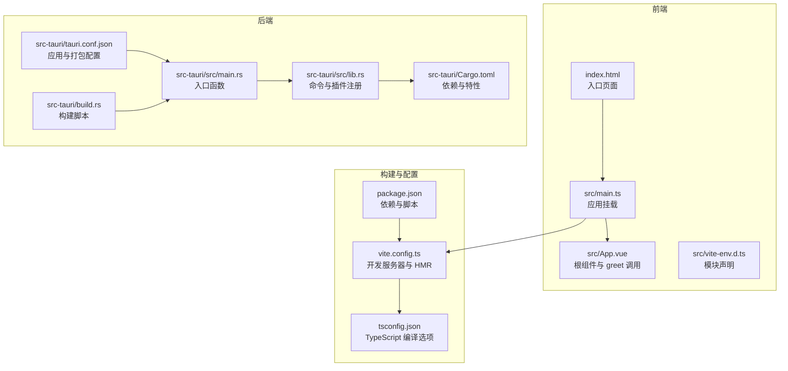
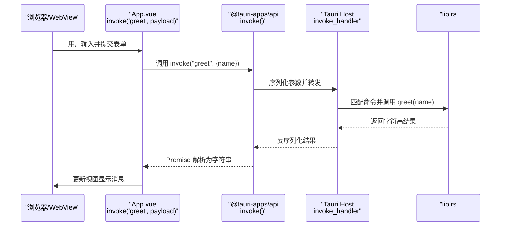
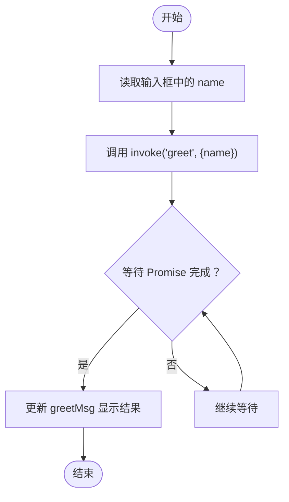
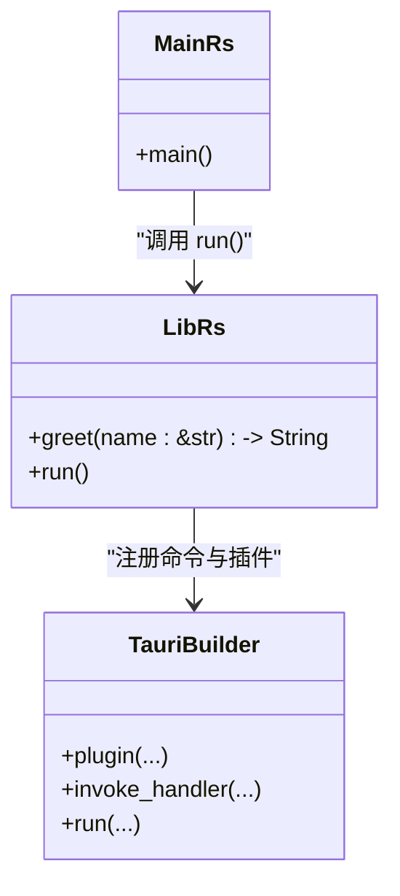
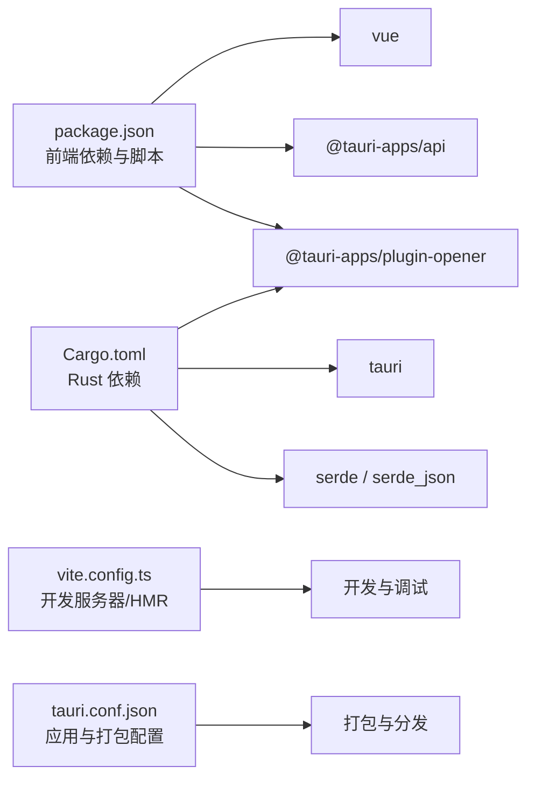

# Tauri API 集成

<cite>
**本文引用的文件**
- [src/App.vue](file://src/App.vue)
- [src/main.ts](file://src/main.ts)
- [src/vite-env.d.ts](file://src/vite-env.d.ts)
- [src-tauri/src/lib.rs](file://src-tauri/src/lib.rs)
- [src-tauri/src/main.rs](file://src-tauri/src/main.rs)
- [src-tauri/Cargo.toml](file://src-tauri/Cargo.toml)
- [src-tauri/tauri.conf.json](file://src-tauri/tauri.conf.json)
- [src-tauri/build.rs](file://src-tauri/build.rs)
- [package.json](file://package.json)
- [vite.config.ts](file://vite.config.ts)
- [tsconfig.json](file://tsconfig.json)
- [index.html](file://index.html)
</cite>

## 目录
1. [简介](#简介)
2. [项目结构](#项目结构)
3. [核心组件](#核心组件)
4. [架构总览](#架构总览)
5. [详细组件分析](#详细组件分析)
6. [依赖分析](#依赖分析)
7. [性能考虑](#性能考虑)
8. [故障排查指南](#故障排查指南)
9. [结论](#结论)
10. [附录](#附录)

## 简介
本指南围绕 Tauri 2 与 Vue 3 的集成，系统讲解前端通过 @tauri-apps/api 调用 Rust 后端命令的完整流程，重点覆盖：
- invoke 函数的使用与调用模式
- App.vue 中 greet 函数的实现细节（参数传递、异步处理、错误处理）
- Tauri 命令系统：前端命令到后端实现的映射关系
- 类型安全的命令调用方式与参数/返回值类型定义
- 错误处理最佳实践与用户友好提示
- 性能优化建议（批量操作、缓存策略）

## 项目结构
该仓库采用典型的 Tauri 前后端分离结构：
- 前端：Vue 3 + TypeScript + Vite
- 后端：Rust（Tauri 2）+ Tauri 插件生态
- 构建链路：Vite 打包前端，Tauri CLI 负责打包与运行

**图表来源**
- [index.html:1-15](file://index.html#L1-L15)
- [src/main.ts:1-5](file://src/main.ts#L1-L5)
- [src/App.vue:1-160](file://src/App.vue#L1-L160)
- [src/vite-env.d.ts:1-8](file://src/vite-env.d.ts#L1-L8)
- [vite.config.ts:1-33](file://vite.config.ts#L1-L33)
- [tsconfig.json:1-26](file://tsconfig.json#L1-L26)
- [package.json:1-25](file://package.json#L1-L25)
- [src-tauri/src/main.rs:1-7](file://src-tauri/src/main.rs#L1-L7)
- [src-tauri/src/lib.rs:1-15](file://src-tauri/src/lib.rs#L1-L15)
- [src-tauri/Cargo.toml:1-26](file://src-tauri/Cargo.toml#L1-L26)
- [src-tauri/tauri.conf.json:1-36](file://src-tauri/tauri.conf.json#L1-L36)
- [src-tauri/build.rs:1-4](file://src-tauri/build.rs#L1-L4)

**章节来源**
- [index.html:1-15](file://index.html#L1-L15)
- [src/main.ts:1-5](file://src/main.ts#L1-L5)
- [src/App.vue:1-160](file://src/App.vue#L1-L160)
- [src/vite-env.d.ts:1-8](file://src/vite-env.d.ts#L1-L8)
- [vite.config.ts:1-33](file://vite.config.ts#L1-L33)
- [tsconfig.json:1-26](file://tsconfig.json#L1-L26)
- [package.json:1-25](file://package.json#L1-L25)
- [src-tauri/src/main.rs:1-7](file://src-tauri/src/main.rs#L1-L7)
- [src-tauri/src/lib.rs:1-15](file://src-tauri/src/lib.rs#L1-L15)
- [src-tauri/Cargo.toml:1-26](file://src-tauri/Cargo.toml#L1-L26)
- [src-tauri/tauri.conf.json:1-36](file://src-tauri/tauri.conf.json#L1-L36)
- [src-tauri/build.rs:1-4](file://src-tauri/build.rs#L1-L4)

## 核心组件
- 前端命令调用：在 App.vue 中通过 invoke 发起命令，传入命令名与参数对象，等待 Promise 返回结果。
- 后端命令注册：在 lib.rs 中使用 #[tauri::command] 定义命令函数，并在 run() 中通过 generate_handler! 注册到 invoke_handler。
- 应用启动：main.rs 调用 lib.rs 的 run()，完成插件初始化与应用运行。

**章节来源**
- [src/App.vue:8-11](file://src/App.vue#L8-L11)
- [src-tauri/src/lib.rs:2-5](file://src-tauri/src/lib.rs#L2-L5)
- [src-tauri/src/lib.rs:7-14](file://src-tauri/src/lib.rs#L7-L14)
- [src-tauri/src/main.rs:4-6](file://src-tauri/src/main.rs#L4-L6)

## 架构总览
从前端到后端的调用路径如下：

**图表来源**
- [src/App.vue:8-11](file://src/App.vue#L8-L11)
- [src-tauri/src/lib.rs:2-5](file://src-tauri/src/lib.rs#L2-L5)
- [src-tauri/src/lib.rs:10-12](file://src-tauri/src/lib.rs#L10-L12)

## 详细组件分析

### 前端组件：App.vue 与 greet 调用
- 组件职责：收集用户输入，触发 greet 命令，展示后端返回的消息。
- 参数传递：将 name 的响应式值作为对象属性传给 invoke。
- 异步处理：await invoke(...)，确保 UI 在收到结果后再更新。
- 错误处理：当前示例未显式捕获异常；建议在实际项目中包裹 try-catch 并向用户反馈。

**图表来源**
- [src/App.vue:8-11](file://src/App.vue#L8-L11)

**章节来源**
- [src/App.vue:1-160](file://src/App.vue#L1-L160)

### 后端命令：greet 的实现与注册
- 命令定义：#[tauri::command] 标注的 greet 接收 &str 参数并返回 String。
- 命令注册：在 run() 中通过 generate_handler![greet] 将命令注入 invoke_handler。
- 应用运行：调用 Builder::default().plugin(...).invoke_handler(...).run(...) 启动应用。

**图表来源**
- [src-tauri/src/lib.rs:2-5](file://src-tauri/src/lib.rs#L2-L5)
- [src-tauri/src/lib.rs:7-14](file://src-tauri/src/lib.rs#L7-L14)
- [src-tauri/src/main.rs:4-6](file://src-tauri/src/main.rs#L4-L6)

**章节来源**
- [src-tauri/src/lib.rs:1-15](file://src-tauri/src/lib.rs#L1-L15)
- [src-tauri/src/main.rs:1-7](file://src-tauri/src/main.rs#L1-L7)

### 类型安全的命令调用
- 前端类型推断：invoke 的参数与返回值类型由 Tauri 2 的类型系统与生成的绑定共同保证。
- 建议实践：
  - 为 invoke 的第二个参数定义明确的接口类型，避免任意对象。
  - 为返回值定义统一的结果类型（例如包含成功/失败状态的数据结构），便于前端统一处理。
  - 对于复杂数据，可结合 JSON Schema 或自定义序列化协议，确保前后端一致。

[本节为概念性指导，不直接分析具体文件]

### API 使用示例（基于现有命令）
- greet 示例：已在 App.vue 中演示了基本的 invoke 调用与结果展示。
- 文件系统与系统信息：当前示例未包含相关命令；若需扩展，可在后端新增命令并通过 invoke_handler 注册，前端以相同方式调用。

**章节来源**
- [src/App.vue:8-11](file://src/App.vue#L8-L11)
- [src-tauri/src/lib.rs:2-5](file://src-tauri/src/lib.rs#L2-L5)
- [src-tauri/src/lib.rs:10-12](file://src-tauri/src/lib.rs#L10-L12)

### 错误处理最佳实践
- try-catch：在调用 invoke 的位置包裹 try-catch，捕获异常并转换为用户可理解的提示。
- 分类错误：区分网络/序列化错误、命令不存在、参数校验失败等，分别给出不同提示。
- 用户反馈：使用 Toast、对话框或状态栏提示，避免抛出原始错误信息。
- 日志记录：在开发环境输出详细日志，在生产环境仅记录必要信息。

[本节为通用实践指导，不直接分析具体文件]

## 依赖分析
- 前端依赖：Vue 3、@tauri-apps/api、@tauri-apps/plugin-opener、Vite、TypeScript。
- 后端依赖：tauri（含命令系统）、serde/serde_json（序列化）、tauri-plugin-opener（示例插件）。
- 构建工具：Vite（开发服务器、热更新）、Tauri CLI（打包与运行）、Cargo（Rust 构建）。

**图表来源**
- [package.json:12-23](file://package.json#L12-L23)
- [src-tauri/Cargo.toml:20-25](file://src-tauri/Cargo.toml#L20-L25)
- [vite.config.ts:8-32](file://vite.config.ts#L8-L32)
- [src-tauri/tauri.conf.json:6-34](file://src-tauri/tauri.conf.json#L6-L34)

**章节来源**
- [package.json:1-25](file://package.json#L1-L25)
- [src-tauri/Cargo.toml:1-26](file://src-tauri/Cargo.toml#L1-L26)
- [vite.config.ts:1-33](file://vite.config.ts#L1-L33)
- [src-tauri/tauri.conf.json:1-36](file://src-tauri/tauri.conf.json#L1-L36)

## 性能考虑
- 批量操作：将多个小命令合并为一次调用，减少 IPC 次数与上下文切换开销。
- 缓存策略：对频繁读取且不常变化的数据（如系统信息、配置）进行本地缓存，设置过期时间并支持手动刷新。
- 避免阻塞：后端命令应尽快返回，耗时任务放入后台线程或异步执行，前端使用加载指示器提升体验。
- 数据压缩：对于大对象传输，考虑在后端序列化前进行压缩，前端解压还原。
- 内存管理：注意大数组/对象的生命周期，及时释放不再使用的资源。

[本节为通用性能指导，不直接分析具体文件]

## 故障排查指南
- 开发服务器端口冲突：确认 1420 端口可用，或根据需要调整 vite.config.ts 中的 server.port。
- HMR 连接问题：若指定 TAURI_DEV_HOST，确保主机与端口正确，避免跨网段导致连接失败。
- 命令未找到：检查后端是否通过 generate_handler! 正确注册命令，前端命令名是否拼写一致。
- 参数类型不匹配：确保 invoke 第二个参数的键名与后端命令签名一致，类型兼容。
- 插件初始化失败：确认插件已添加到 Cargo.toml，并在 lib.rs 的 run() 中正确 plugin(...) 初始化。

**章节来源**
- [vite.config.ts:16-30](file://vite.config.ts#L16-L30)
- [src-tauri/src/lib.rs:10-12](file://src-tauri/src/lib.rs#L10-L12)
- [src-tauri/Cargo.toml:20-25](file://src-tauri/Cargo.toml#L20-L25)

## 结论
本项目展示了 Tauri 2 与 Vue 3 的标准集成方式：前端通过 @tauri-apps/api 的 invoke 发起命令，后端以 #[tauri::command] 定义命令并通过 invoke_handler 注册。通过类型安全的参数与返回值设计、完善的错误处理与性能优化策略，可以构建稳定高效的跨平台桌面应用。

## 附录
- 快速启动
  - 开发：执行前端脚本启动 Vite，再执行 Tauri CLI 启动应用。
  - 构建：先构建前端，再由 Tauri CLI 打包为多平台安装包。
- 命令扩展
  - 新增命令：在 lib.rs 中定义 #[tauri::command] 函数，并在 run() 中注册。
  - 前端调用：保持命令名一致，按类型安全方式传参与接收结果。

**章节来源**
- [package.json:6-11](file://package.json#L6-L11)
- [src-tauri/src/lib.rs:2-5](file://src-tauri/src/lib.rs#L2-L5)
- [src-tauri/src/lib.rs:10-12](file://src-tauri/src/lib.rs#L10-L12)
- [src-tauri/tauri.conf.json:6-11](file://src-tauri/tauri.conf.json#L6-L11)