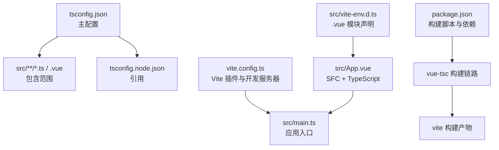
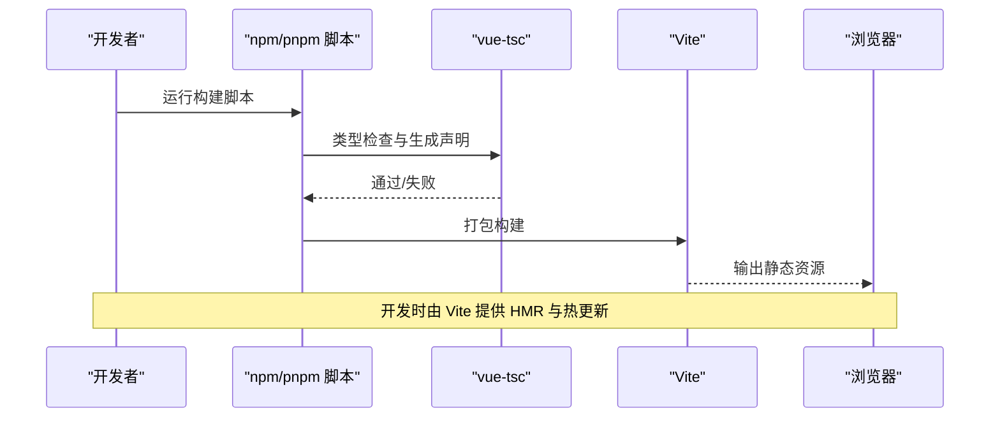
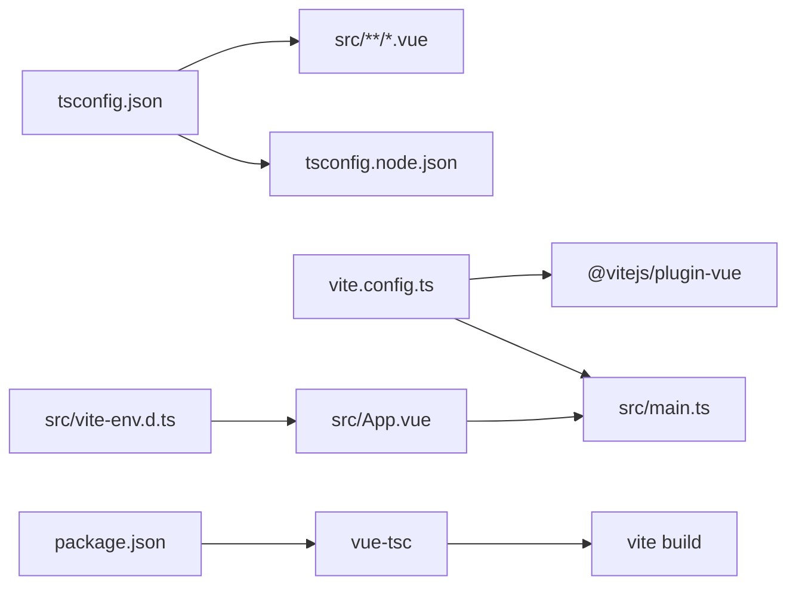

# TypeScript 集成

<cite>
**本文引用的文件**
- [tsconfig.json](file://tsconfig.json)
- [tsconfig.node.json](file://tsconfig.node.json)
- [vite.config.ts](file://vite.config.ts)
- [src/vite-env.d.ts](file://src/vite-env.d.ts)
- [src/App.vue](file://src/App.vue)
- [src/main.ts](file://src/main.ts)
- [package.json](file://package.json)
- [README.md](file://README.md)
</cite>

## 目录
1. [简介](#简介)
2. [项目结构](#项目结构)
3. [核心组件](#核心组件)
4. [架构总览](#架构总览)
5. [详细组件分析](#详细组件分析)
6. [依赖关系分析](#依赖关系分析)
7. [性能考量](#性能考量)
8. [故障排查指南](#故障排查指南)
9. [结论](#结论)
10. [附录](#附录)

## 简介
本指南面向在 Vue 3 + Vite + Tauri 项目中集成 TypeScript 的开发者，系统讲解 tsconfig.json 编译选项与严格模式、Vue SFC 中的 TypeScript 使用方式（类型注解、接口定义、泛型）、以及 vite-env.d.ts 对环境变量与模块声明的类型支持。同时提供可直接落地的实践建议与常见问题排查思路，帮助你在开发过程中获得更强的类型安全保障与更佳的开发体验。

## 项目结构
该仓库采用“前端应用 + Rust 后端”的混合架构，TypeScript 配置与 Vite 插件共同支撑 Vue 3 单文件组件（SFC）的类型检查与构建流程。关键文件如下：
- tsconfig.json：主 TypeScript 配置，启用严格模式与打包器模式解析
- tsconfig.node.json：Node 端配置，用于 Vite 配置文件的类型检查
- vite.config.ts：Vite 开发服务器与插件配置，包含 Tauri 特定的开发参数
- src/vite-env.d.ts：为 .vue 模块与 Vite 环境提供类型声明
- src/App.vue：使用 <script setup lang="ts"> 的示例组件
- src/main.ts：应用入口，挂载根组件
- package.json：脚本与依赖，包含 vue-tsc 与 Vite 构建链路
- README.md：VS Code 推荐扩展与 .vue 导入的类型支持说明

图表来源
- [tsconfig.json:1-26](file://tsconfig.json#L1-L26)
- [tsconfig.node.json:1-11](file://tsconfig.node.json#L1-L11)
- [vite.config.ts:1-33](file://vite.config.ts#L1-L33)
- [src/vite-env.d.ts:1-8](file://src/vite-env.d.ts#L1-L8)
- [src/App.vue:1-160](file://src/App.vue#L1-L160)
- [src/main.ts:1-5](file://src/main.ts#L1-L5)
- [package.json:1-25](file://package.json#L1-L25)

章节来源
- [tsconfig.json:1-26](file://tsconfig.json#L1-L26)
- [tsconfig.node.json:1-11](file://tsconfig.node.json#L1-L11)
- [vite.config.ts:1-33](file://vite.config.ts#L1-L33)
- [src/vite-env.d.ts:1-8](file://src/vite-env.d.ts#L1-L8)
- [src/App.vue:1-160](file://src/App.vue#L1-L160)
- [src/main.ts:1-5](file://src/main.ts#L1-L5)
- [package.json:1-25](file://package.json#L1-L25)
- [README.md:1-17](file://README.md#L1-L17)

## 核心组件
- tsconfig.json：定义编译目标、模块系统、库版本、打包器模式解析、严格模式与未使用项检查等。通过 include 与 references 确保对 src 下所有 TS/TSX/D.ts/Vue 文件进行类型检查，并引用 tsconfig.node.json。
- tsconfig.node.json：为 Vite 配置文件提供复合编译与模块解析能力，确保 Vite 配置在 TS 环境下具备类型支持。
- vite.config.ts：配置 Vite 插件（如 @vitejs/plugin-vue）、开发服务器端口与热更新策略，并忽略对 src-tauri 的监听，以避免不必要的文件监控开销。
- src/vite-env.d.ts：为 .vue 模块提供默认导出类型声明，使 TypeScript 能识别 .vue 文件的组件签名；同时引入 Vite 客户端类型。
- src/App.vue：使用 <script setup lang="ts"> 的示例，演示在模板外使用 ref、异步函数与 Tauri invoke 的类型安全调用。
- src/main.ts：应用入口，创建并挂载根组件。
- package.json：定义构建脚本（先执行 vue-tsc 再执行 vite build），并声明 TypeScript、Vite、Vue 与相关插件版本。

章节来源
- [tsconfig.json:1-26](file://tsconfig.json#L1-L26)
- [tsconfig.node.json:1-11](file://tsconfig.node.json#L1-L11)
- [vite.config.ts:1-33](file://vite.config.ts#L1-L33)
- [src/vite-env.d.ts:1-8](file://src/vite-env.d.ts#L1-L8)
- [src/App.vue:1-160](file://src/App.vue#L1-L160)
- [src/main.ts:1-5](file://src/main.ts#L1-L5)
- [package.json:1-25](file://package.json#L1-L25)

## 架构总览
TypeScript 在本项目中的工作流由 vue-tsc 与 Vite 共同完成：先通过 vue-tsc 进行类型检查与生成声明文件，再由 Vite 执行打包与运行时构建。Vite 配置针对 Tauri 开发场景做了定制化处理，例如固定端口、主机绑定与 HMR 参数。

图表来源
- [package.json:6-11](file://package.json#L6-L11)
- [vite.config.ts:8-32](file://vite.config.ts#L8-L32)

章节来源
- [package.json:6-11](file://package.json#L6-L11)
- [vite.config.ts:8-32](file://vite.config.ts#L8-L32)

## 详细组件分析

### TypeScript 配置详解（tsconfig.json）
- 目标与模块系统
  - 目标与模块：目标 ES2020，模块为 ESNext，配合打包器模式解析，适配现代浏览器与打包工具链。
  - 库：包含 DOM 与 DOM.Iterable，满足浏览器环境类型需求。
- 打包器模式与模块解析
  - moduleResolution 设为 bundler，允许导入 .ts/.tsx/.d.ts 扩展名，开启 JSON 模块解析，隔离模块以提升类型安全性。
  - noEmit 与 jsx preserve：在构建阶段不输出 JS，保留 JSX 以便后续处理。
- 严格模式与 Linting
  - strict 为 true，启用严格模式；noUnusedLocals、noUnusedParameters、noFallthroughCasesInSwitch 等增强代码质量与可维护性。
- 包含范围与引用
  - include 覆盖 src 下所有 TS/TSX/D.ts/Vue 文件；references 引用 tsconfig.node.json，确保 Vite 配置文件也参与类型检查。

章节来源
- [tsconfig.json:2-25](file://tsconfig.json#L2-L25)

### Node 端配置（tsconfig.node.json）
- 复合编译与模块解析：composite 与 bundler 解析，保证 Vite 配置文件具备类型支持。
- 默认导入：允许合成默认导入，简化配置文件的导入语法。

章节来源
- [tsconfig.node.json:2-9](file://tsconfig.node.json#L2-L9)

### Vite 配置与 Tauri 集成（vite.config.ts）
- 插件：加载 @vitejs/plugin-vue，支持 Vue SFC 的热更新与类型检查。
- 开发服务器：固定端口与严格端口策略，避免端口冲突；根据环境变量动态设置主机与 HMR 协议；忽略 src-tauri 的监听，减少不必要的文件监控。
- 清屏与错误可见性：关闭清屏以保留 Rust 错误输出，便于定位问题。

章节来源
- [vite.config.ts:8-32](file://vite.config.ts#L8-L32)

### Vite 环境声明（src/vite-env.d.ts）
- Vite 客户端类型：通过 /// <reference types="vite/client" /> 引入 Vite 的客户端类型，提供环境变量与模块声明的类型支持。
- .vue 模块声明：为 *.vue 模块提供默认导出类型，使用 DefineComponent 泛型签名，使 TypeScript 能识别组件的 props、slots、emit 等类型信息。

章节来源
- [src/vite-env.d.ts:1-7](file://src/vite-env.d.ts#L1-L7)

### Vue SFC 中的 TypeScript 使用（src/App.vue）
- 语言注入：lang="ts" 启用 TypeScript 编译与类型检查。
- 响应式与异步：使用 ref 定义响应式数据，异步函数通过 await 调用 Tauri 的 invoke，实现类型安全的命令调用。
- 模板交互：表单输入与按钮事件通过 v-model 与 @submit.prevent 进行双向绑定与事件处理，结合 TypeScript 的类型推断提升开发体验。

章节来源
- [src/App.vue:1-160](file://src/App.vue#L1-L160)

### 应用入口（src/main.ts）
- 创建应用：通过 createApp 加载根组件 App 并挂载到 #app。
- 类型安全：由于入口文件为 TS，类型检查贯穿整个应用生命周期。

章节来源
- [src/main.ts:1-5](file://src/main.ts#L1-L5)

### 构建脚本与依赖（package.json）
- 脚本：dev、build、preview、tauri；build 阶段先执行 vue-tsc 再执行 vite build，确保类型安全后再产出构建产物。
- 依赖：Vue 3、@vitejs/plugin-vue、typescript、vite、vue-tsc、@tauri-apps/cli 等，形成完整的 TypeScript + Vue + Vite + Tauri 生态链。

章节来源
- [package.json:6-23](file://package.json#L6-L23)

### VS Code 类型支持提示（README.md）
- .vue 导入类型：若希望在 TS 中获得 .vue 组件的精确类型（如手动 h(...) 调用时的 props 校验），可通过启用 Volar Take Over 模式实现。
- 推荐扩展：VS Code + Volar + Tauri + rust-analyzer，提升开发效率与类型准确性。

章节来源
- [README.md:9-16](file://README.md#L9-L16)

## 依赖关系分析
TypeScript 配置与 Vite 插件之间存在紧密耦合：tsconfig.json 的 bundler 模式解析与 noEmit 配置，要求在构建前由 vue-tsc 完成类型检查与声明生成，随后由 Vite 执行打包。vite-env.d.ts 为 .vue 模块提供类型声明，使 TypeScript 能正确识别组件签名。

图表来源
- [tsconfig.json:1-26](file://tsconfig.json#L1-L26)
- [tsconfig.node.json:1-11](file://tsconfig.node.json#L1-L11)
- [vite.config.ts:1-33](file://vite.config.ts#L1-L33)
- [src/vite-env.d.ts:1-8](file://src/vite-env.d.ts#L1-L8)
- [src/App.vue:1-160](file://src/App.vue#L1-L160)
- [src/main.ts:1-5](file://src/main.ts#L1-L5)
- [package.json:6-11](file://package.json#L6-L11)

章节来源
- [tsconfig.json:1-26](file://tsconfig.json#L1-L26)
- [tsconfig.node.json:1-11](file://tsconfig.node.json#L1-L11)
- [vite.config.ts:1-33](file://vite.config.ts#L1-L33)
- [src/vite-env.d.ts:1-8](file://src/vite-env.d.ts#L1-L8)
- [src/App.vue:1-160](file://src/App.vue#L1-L160)
- [src/main.ts:1-5](file://src/main.ts#L1-L5)
- [package.json:6-11](file://package.json#L6-L11)

## 性能考量
- 模块解析与打包器模式：bundler 解析与 isolatedModules/noEmit 配置有助于在大型项目中保持类型检查与构建的高效性。
- 忽略无关目录：vite.config.ts 中忽略 src-tauri 的监听，减少文件系统监控开销，提升开发时的热更新速度。
- 严格模式与未使用项检查：strict、noUnusedLocals、noUnusedParameters 等选项在早期发现潜在问题，降低后期调试成本。

章节来源
- [tsconfig.json:10-21](file://tsconfig.json#L10-L21)
- [vite.config.ts:27-30](file://vite.config.ts#L27-L30)

## 故障排查指南
- .vue 导入类型缺失或不准确
  - 症状：在 TS 中导入 .vue 文件后无法获得 props 类型或 emit 类型。
  - 解决：参考 README.md 中的 Volar Take Over 模式说明，禁用默认 TypeScript 扩展并重载窗口，以启用更精确的类型推断。
- 构建失败但错误不明显
  - 症状：构建阶段报错但控制台被 Vite 清屏覆盖。
  - 解决：保持 vite.config.ts 中的 clearScreen: false，确保 Rust 错误与 TS 错误均可查看。
- 端口占用或 HMR 不生效
  - 症状：开发服务器启动失败或热更新异常。
  - 解决：确认 vite.config.ts 中的 port、strictPort、host 与 HMR 配置是否符合预期；必要时调整环境变量或网络配置。
- 类型检查与构建顺序问题
  - 症状：构建产物缺少类型声明或类型错误未被提前发现。
  - 解决：遵循 package.json 中的构建脚本顺序（先 vue-tsc，再 vite build），确保类型检查前置。

章节来源
- [README.md:9-16](file://README.md#L9-L16)
- [vite.config.ts:14-26](file://vite.config.ts#L14-L26)
- [package.json:8](file://package.json#L8)

## 结论
本项目通过合理的 TypeScript 配置与 Vite 集成，实现了 Vue 3 + TypeScript 的类型安全开发体验。tsconfig.json 的严格模式与 bundler 解析、vite-env.d.ts 的模块声明、以及 vite.config.ts 的 Tauri 适配，共同构成了稳定可靠的开发与构建链路。建议在团队内统一遵循这些配置与最佳实践，持续提升代码质量与协作效率。

## 附录
- 实践建议
  - 在组件中优先使用 <script setup lang="ts"> 与 ref/defineProps/defineEmits 等组合式 API，获得更好的类型推断。
  - 对于复杂逻辑，使用接口与工具类型（如 Partial、Pick、Omit 等）明确数据结构，提升可读性与可维护性。
  - 对异步函数，明确返回值类型（如 Promise<T>），并在调用处进行错误处理与空值判断。
- 参考文件
  - [tsconfig.json](file://tsconfig.json)
  - [tsconfig.node.json](file://tsconfig.node.json)
  - [vite.config.ts](file://vite.config.ts)
  - [src/vite-env.d.ts](file://src/vite-env.d.ts)
  - [src/App.vue](file://src/App.vue)
  - [src/main.ts](file://src/main.ts)
  - [package.json](file://package.json)
  - [README.md](file://README.md)