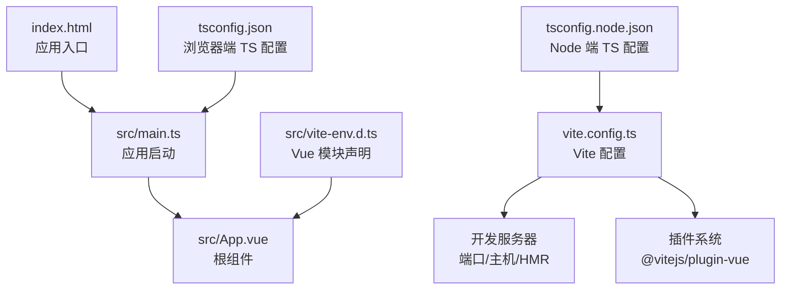
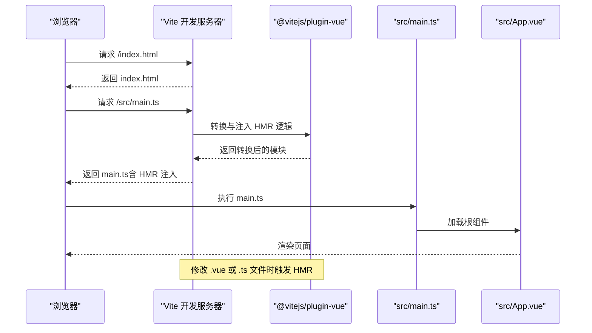
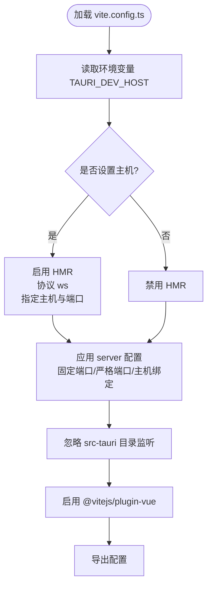
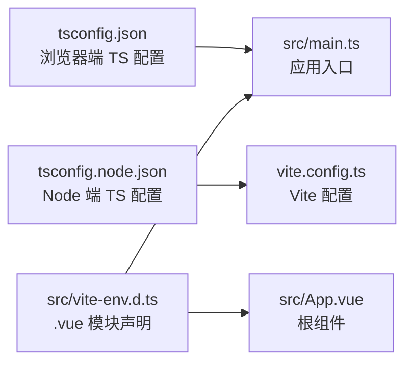
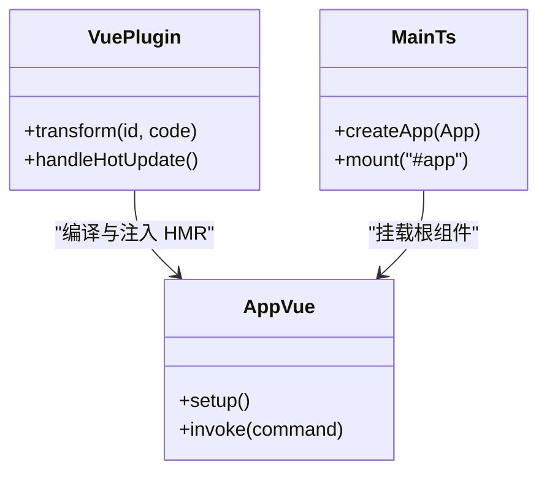
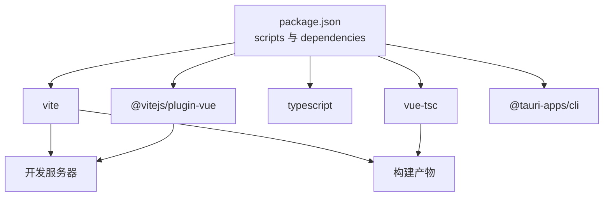

# Vite 配置

<cite>
**本文引用的文件**
- [vite.config.ts](file://vite.config.ts)
- [package.json](file://package.json)
- [tsconfig.json](file://tsconfig.json)
- [tsconfig.node.json](file://tsconfig.node.json)
- [src/main.ts](file://src/main.ts)
- [src/App.vue](file://src/App.vue)
- [index.html](file://index.html)
- [src/vite-env.d.ts](file://src/vite-env.d.ts)
- [README.md](file://README.md)
</cite>

## 目录
1. [简介](#简介)
2. [项目结构](#项目结构)
3. [核心组件](#核心组件)
4. [架构总览](#架构总览)
5. [详细组件分析](#详细组件分析)
6. [依赖关系分析](#依赖关系分析)
7. [性能考量](#性能考量)
8. [故障排除指南](#故障排除指南)
9. [结论](#结论)
10. [附录](#附录)

## 简介
本指南围绕 Vite 在该仓库中的配置与使用展开，重点覆盖以下方面：
- 开发服务器配置：端口固定、严格端口、主机绑定、热重载（HMR）与忽略目录监听
- 构建选项：基于当前配置的产物特性与可扩展点
- 插件系统：Vue 插件的启用与作用范围
- 环境变量处理：通过进程环境变量控制开发主机与 HMR 协议
- 与 Tauri 的集成：固定端口与 HMR 协议适配
- TypeScript 与 Vue SFC 的类型支持与编译配置
- 实践建议：如何在现有基础上进一步优化开发体验与构建性能
- 故障排除：常见问题定位与解决思路

## 项目结构
该项目采用 Vite + Vue 3 + TypeScript 的前端工程，结合 Tauri 进行桌面应用打包。关键入口与配置如下：
- 入口 HTML：index.html
- 应用入口脚本：src/main.ts
- 根组件：src/App.vue
- Vite 配置：vite.config.ts
- TypeScript 配置：tsconfig.json、tsconfig.node.json
- 类型声明：src/vite-env.d.ts
- 包管理与脚本：package.json

图表来源
- [index.html:1-15](file://index.html#L1-L15)
- [src/main.ts:1-5](file://src/main.ts#L1-L5)
- [src/App.vue:1-160](file://src/App.vue#L1-L160)
- [vite.config.ts:1-33](file://vite.config.ts#L1-L33)
- [tsconfig.json:1-26](file://tsconfig.json#L1-L26)
- [tsconfig.node.json:1-11](file://tsconfig.node.json#L1-L11)
- [src/vite-env.d.ts:1-8](file://src/vite-env.d.ts#L1-L8)

章节来源
- [index.html:1-15](file://index.html#L1-L15)
- [src/main.ts:1-5](file://src/main.ts#L1-L5)
- [src/App.vue:1-160](file://src/App.vue#L1-L160)
- [vite.config.ts:1-33](file://vite.config.ts#L1-L33)
- [tsconfig.json:1-26](file://tsconfig.json#L1-L26)
- [tsconfig.node.json:1-11](file://tsconfig.node.json#L1-L11)
- [src/vite-env.d.ts:1-8](file://src/vite-env.d.ts#L1-L8)

## 核心组件
- Vite 配置文件（vite.config.ts）
  - 启用 Vue 插件
  - 固定开发端口与严格端口
  - 主机绑定与 HMR 条件化配置
  - 忽略对 Tauri 目录的监听
- TypeScript 配置
  - 浏览器端：bundler 模式、ESNext 模块解析、禁用 emit、严格模式等
  - Node 端：仅用于解析 Vite 配置文件
- Vue SFC 与类型声明
  - 通过 src/vite-env.d.ts 声明 .vue 模块，配合 tsconfig.json 的 bundler 模式
- 包脚本与依赖
  - 脚本：dev/build/preview/tauri
  - 依赖：Vite、@vitejs/plugin-vue、Vue、TypeScript、vue-tsc、@tauri-apps/cli

章节来源
- [vite.config.ts:1-33](file://vite.config.ts#L1-L33)
- [tsconfig.json:1-26](file://tsconfig.json#L1-L26)
- [tsconfig.node.json:1-11](file://tsconfig.node.json#L1-L11)
- [src/vite-env.d.ts:1-8](file://src/vite-env.d.ts#L1-L8)
- [package.json:1-25](file://package.json#L1-L25)

## 架构总览
下图展示了从浏览器请求到应用渲染的关键路径，以及 Vite 开发服务器与 HMR 的交互方式。

图表来源
- [vite.config.ts:1-33](file://vite.config.ts#L1-L33)
- [src/main.ts:1-5](file://src/main.ts#L1-L5)
- [src/App.vue:1-160](file://src/App.vue#L1-L160)
- [index.html:1-15](file://index.html#L1-L15)

## 详细组件分析

### Vite 配置文件（vite.config.ts）
- 插件系统
  - 启用 @vitejs/plugin-vue，用于处理 Vue SFC、模板与样式等
- 开发服务器
  - 固定端口与严格端口：确保 Tauri 集成时端口稳定
  - 主机绑定：支持通过环境变量指定开发主机地址
  - HMR 条件化：当存在开发主机时，启用 WebSocket HMR 并指定协议与端口
  - 监听忽略：排除 src-tauri 目录，避免不必要的文件变更事件
- 异步配置导出
  - 使用 async 函数返回配置对象，便于在运行时根据环境变量动态调整

图表来源
- [vite.config.ts:1-33](file://vite.config.ts#L1-L33)

章节来源
- [vite.config.ts:1-33](file://vite.config.ts#L1-L33)

### TypeScript 与 Vue 类型支持
- 浏览器端 TS 配置（tsconfig.json）
  - 模块解析：bundler 模式，适配 Vite 的原生模块解析
  - 禁用 emit：仅用于类型检查，构建由 Vite 与 vue-tsc 组合完成
  - 严格模式与无用项检查：提升代码质量
- Node 端 TS 配置（tsconfig.node.json）
  - 仅用于解析 Vite 配置文件，采用 ESNext 模块解析
- Vue 模块声明（src/vite-env.d.ts）
  - 为 .vue 文件提供默认类型定义，使 TS 能识别组件类型

图表来源
- [tsconfig.json:1-26](file://tsconfig.json#L1-L26)
- [tsconfig.node.json:1-11](file://tsconfig.node.json#L1-L11)
- [src/vite-env.d.ts:1-8](file://src/vite-env.d.ts#L1-L8)
- [src/main.ts:1-5](file://src/main.ts#L1-L5)
- [src/App.vue:1-160](file://src/App.vue#L1-L160)

章节来源
- [tsconfig.json:1-26](file://tsconfig.json#L1-L26)
- [tsconfig.node.json:1-11](file://tsconfig.node.json#L1-L11)
- [src/vite-env.d.ts:1-8](file://src/vite-env.d.ts#L1-L8)
- [src/main.ts:1-5](file://src/main.ts#L1-L5)
- [src/App.vue:1-160](file://src/App.vue#L1-L160)

### Vue 插件与 SFC 处理
- 插件启用：@vitejs/plugin-vue
  - 处理 Vue 单文件组件（SFC），包括模板、脚本与样式的编译与注入
  - 与 HMR 协同工作，实现热更新
- SFC 示例：src/App.vue
  - 使用 `<script setup lang="ts">` 语法
  - 引入 Tauri API 并进行交互
  - 样式作用域与全局样式并存

图表来源
- [vite.config.ts:1-33](file://vite.config.ts#L1-L33)
- [src/App.vue:1-160](file://src/App.vue#L1-L160)
- [src/main.ts:1-5](file://src/main.ts#L1-L5)

章节来源
- [vite.config.ts:1-33](file://vite.config.ts#L1-L33)
- [src/App.vue:1-160](file://src/App.vue#L1-L160)
- [src/main.ts:1-5](file://src/main.ts#L1-L5)

### 构建流程与优化方向
- 当前构建脚本
  - 先执行 vue-tsc 进行类型检查，再执行 vite build 产出产物
- 可选优化方向（基于现有配置的扩展建议）
  - 代码分割：通过路由懒加载与动态导入实现按需加载
  - Tree Shaking：保持 ES 模块导入导出风格，确保未使用代码被移除
  - 压缩策略：在生产构建中启用压缩（如 terser 或 esbuild），并考虑资源内联策略
  - 预构建依赖：利用 Vite 的预构建缓存减少冷启动时间
  - 资源哈希与缓存：为静态资源添加内容哈希，提升缓存命中率
  - SSR/预渲染：如需 SEO，可考虑服务端渲染或静态预渲染

章节来源
- [package.json:1-25](file://package.json#L1-L25)

### 环境变量与 Tauri 集成
- 环境变量
  - 通过 TAURI_DEV_HOST 控制开发主机，从而影响 HMR 协议与端口
- Tauri 集成要点
  - 固定端口与严格端口：保证 Tauri 开发时的通信稳定性
  - HMR 协议：在跨主机场景下使用 ws 协议，并指定主机与端口
  - 忽略监听：避免监听 Tauri 目录，减少不必要的文件系统事件

章节来源
- [vite.config.ts:1-33](file://vite.config.ts#L1-L33)

### 实际配置示例与最佳实践
- 开发体验优化
  - 固定端口与严格端口：避免端口冲突导致的反复重启
  - HMR 条件化：在多主机开发时启用 HMR，本地开发时禁用以减少网络开销
  - 忽略监听：排除大型或无关目录，提升监听效率
- 构建性能优化
  - 保持 ES 模块风格，确保 Tree Shaking 生效
  - 合理拆分代码，减少首屏体积
  - 在生产构建中启用压缩与资源内联策略
- 类型安全
  - 使用 bundler 模式与禁用 emit，构建阶段交由 Vite 与 vue-tsc 完成
  - 通过 src/vite-env.d.ts 为 .vue 提供类型支持

章节来源
- [vite.config.ts:1-33](file://vite.config.ts#L1-L33)
- [tsconfig.json:1-26](file://tsconfig.json#L1-L26)
- [src/vite-env.d.ts:1-8](file://src/vite-env.d.ts#L1-L8)
- [package.json:1-25](file://package.json#L1-L25)

## 依赖关系分析
- 包脚本与命令
  - dev：启动 Vite 开发服务器
  - build：先类型检查，后构建
  - preview：预览构建产物
  - tauri：调用 Tauri CLI
- 关键依赖
  - Vite：开发服务器与构建工具
  - @vitejs/plugin-vue：Vue SFC 编译与 HMR
  - Vue：视图层框架
  - TypeScript 与 vue-tsc：类型检查与编译
  - @tauri-apps/cli：Tauri CLI 工具

图表来源
- [package.json:1-25](file://package.json#L1-L25)

章节来源
- [package.json:1-25](file://package.json#L1-L25)

## 性能考量
- 监听与热重载
  - 忽略 src-tauri 目录可显著降低文件系统事件压力
  - HMR 在跨主机场景下启用 ws 协议，确保连接稳定
- 构建阶段
  - 类型检查与构建分离，有助于快速迭代
  - 保持 ES 模块风格，有利于 Tree Shaking 与按需加载
- 资源与缓存
  - 为静态资源添加内容哈希，提升缓存命中率
  - 合理的代码分割策略，减少首屏加载时间

## 故障排除指南
- 端口占用
  - 症状：开发服务器无法启动
  - 排查：确认固定端口是否被占用；若需要，修改端口或释放占用
  - 参考：固定端口与严格端口配置
- HMR 不生效
  - 症状：修改代码后页面不刷新
  - 排查：确认是否设置了开发主机；若设置了，检查 ws 协议与端口；若未设置，确认禁用 HMR 是否符合预期
  - 参考：HMR 条件化配置
- 监听异常
  - 症状：频繁卡顿或 CPU 占用高
  - 排查：确认是否监听了大型或无关目录；确保已忽略 src-tauri 目录
  - 参考：watch.ignored 配置
- 类型错误阻塞构建
  - 症状：构建失败但提示类型错误
  - 排查：先修复类型错误；确保 tsconfig.json 的 bundler 模式与禁用 emit 设置正确
  - 参考：tsconfig.json 与 vue-tsc 脚本
- Vue 模块类型缺失
  - 症状：TS 报告 .vue 模块类型错误
  - 排查：确认 src/vite-env.d.ts 中的模块声明是否存在且正确
  - 参考：src/vite-env.d.ts

章节来源
- [vite.config.ts:1-33](file://vite.config.ts#L1-L33)
- [tsconfig.json:1-26](file://tsconfig.json#L1-L26)
- [src/vite-env.d.ts:1-8](file://src/vite-env.d.ts#L1-L8)
- [package.json:1-25](file://package.json#L1-L25)

## 结论
本项目在 Vite 基础上，结合 Vue 3 与 TypeScript，实现了与 Tauri 的良好集成。通过固定端口、严格端口、条件化 HMR 与忽略监听等配置，既保证了开发体验，又兼顾了构建性能。建议在此基础上继续完善代码分割、Tree Shaking 与压缩策略，并持续优化类型检查与模块声明，以获得更稳定的开发与构建流程。

## 附录
- 相关文档与参考
  - Vite 官方文档与配置指南
  - Vue SFC 与 TypeScript 集成最佳实践
  - Tauri 开发与构建流程

章节来源
- [README.md:1-17](file://README.md#L1-L17)