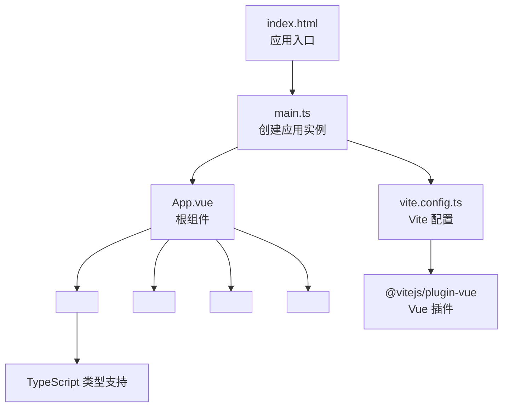
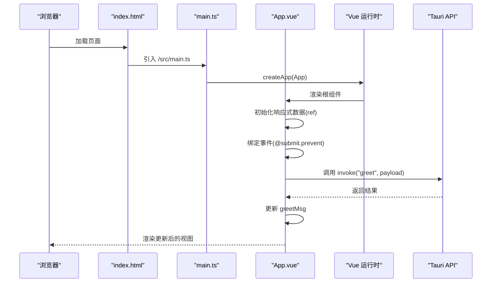
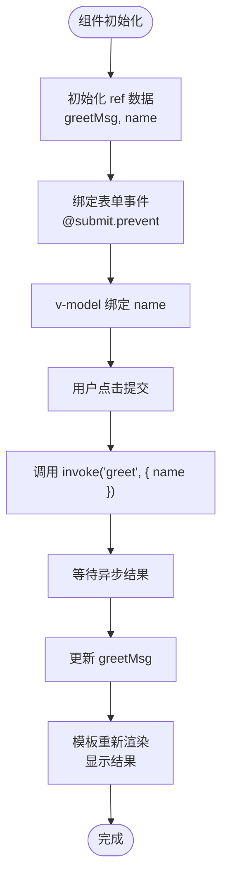
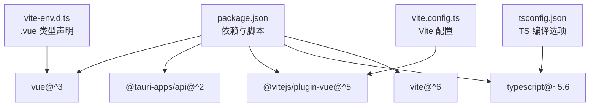

# Vue 组件开发

<cite>
**本文档引用的文件**
- [App.vue](file://src/App.vue)
- [main.ts](file://src/main.ts)
- [index.html](file://index.html)
- [vite.config.ts](file://vite.config.ts)
- [package.json](file://package.json)
- [tsconfig.json](file://tsconfig.json)
- [tsconfig.node.json](file://tsconfig.node.json)
- [vite-env.d.ts](file://src/vite-env.d.ts)
- [README.md](file://README.md)
</cite>

## 目录
1. [简介](#简介)
2. [项目结构](#项目结构)
3. [核心组件](#核心组件)
4. [架构总览](#架构总览)
5. [详细组件分析](#详细组件分析)
6. [依赖关系分析](#依赖关系分析)
7. [性能考虑](#性能考虑)
8. [故障排除指南](#故障排除指南)
9. [结论](#结论)
10. [附录](#附录)

## 简介
本指南围绕 Vue 3 单文件组件（SFC）与 Composition API 的实践展开，结合项目中的 App.vue 示例，系统讲解 template、script、style 三部分的组织方式，Composition API 的优势与最佳实践，响应式数据（ref）、事件处理、模板绑定与样式作用域，生命周期钩子、计算属性与侦听器的应用场景，以及组件间通信模式（props、事件、provide/inject）。同时提供可复用组件的构建思路与用户交互、状态管理的处理建议。

## 项目结构
该项目采用 Vite + Vue 3 + TypeScript 的现代前端工程化方案，入口为 index.html 中的挂载点，通过 main.ts 创建应用实例并挂载到 DOM；App.vue 作为根组件，使用 `<script setup>` 语法与 TypeScript 集成，配合 Vite 的 Vue 插件进行编译与热更新。

图表来源
- [index.html:1-15](file://index.html#L1-L15)
- [main.ts:1-5](file://src/main.ts#L1-L5)
- [App.vue:1-160](file://src/App.vue#L1-L160)
- [vite.config.ts:1-33](file://vite.config.ts#L1-L33)

章节来源
- [index.html:1-15](file://index.html#L1-L15)
- [main.ts:1-5](file://src/main.ts#L1-L5)
- [vite.config.ts:1-33](file://vite.config.ts#L1-L33)
- [tsconfig.json:1-26](file://tsconfig.json#L1-L26)
- [vite-env.d.ts:1-8](file://src/vite-env.d.ts#L1-L8)

## 核心组件
本节聚焦 App.vue 的完整实现，涵盖：
- 响应式数据：使用 ref 定义 greetMsg 与 name
- 事件处理：表单提交触发异步 greet 函数，调用 Tauri 命令
- 模板绑定：v-model 双向绑定输入框，插值显示结果
- 样式作用域：scoped 作用域样式与全局基础样式分离
- 类型支持：lang="ts" 与类型声明 shim

章节来源
- [App.vue:1-160](file://src/App.vue#L1-L160)
- [README.md:1-17](file://README.md#L1-L17)

## 架构总览
下图展示了从浏览器加载到组件渲染的关键流程，包括 Vite 开发服务器、Vue 编译、组件挂载与交互。

图表来源
- [index.html:1-15](file://index.html#L1-L15)
- [main.ts:1-5](file://src/main.ts#L1-L5)
- [App.vue:1-160](file://src/App.vue#L1-L160)

## 详细组件分析

### App.vue 组件深度解析
- 结构组成
  - script setup：导入 ref 与 Tauri invoke，定义响应式数据与异步处理函数
  - template：包含品牌徽标链接、表单输入与提交按钮、结果展示段落
  - style：scoped 用于徽标悬停效果，全局样式定义字体、布局与暗色主题适配
- 数据流
  - 用户在输入框中输入名称，通过 v-model 双向绑定到 name
  - 表单提交触发 greet，内部调用 invoke 发送命令并等待返回
  - 将返回结果赋值给 greetMsg，模板中通过插值显示
- 最佳实践
  - 使用 ref 管理简单标量状态，避免不必要的复杂响应式对象
  - 在模板中使用 @submit.prevent 阻止默认行为，确保逻辑集中在组件内
  - 将样式拆分为作用域样式与全局基础样式，提升可维护性

图表来源
- [App.vue:1-160](file://src/App.vue#L1-L160)

章节来源
- [App.vue:1-160](file://src/App.vue#L1-L160)

### Composition API 与 script setup 语法
- 优势
  - 声明即导出：无需额外的 exports，简化模块接口
  - 更自然的 TypeScript 支持：无需 defineComponent 包裹即可获得类型推断
  - 逻辑复用：组合函数（composables）更易抽取与复用
- 最佳实践
  - 将响应式数据、方法、计算属性与侦听器集中在一个文件中，便于维护
  - 对外暴露的只读数据使用 readonly 或返回值约束
  - 复杂逻辑拆分为多个组合函数，保持单一职责

章节来源
- [App.vue:1-160](file://src/App.vue#L1-L160)
- [README.md:1-17](file://README.md#L1-L17)

### 生命周期钩子、计算属性与侦听器
- 生命周期钩子
  - 场景：在组件挂载后执行初始化逻辑，或在卸载前清理资源
  - 实践：在 script setup 中直接导入并使用对应钩子，避免 defineComponent 包裹
- 计算属性
  - 场景：基于响应式数据派生的值，具备缓存与依赖追踪
  - 实践：将稳定且可复用的派生逻辑封装为 computed，减少模板中的重复计算
- 侦听器
  - 场景：监听响应式数据变化并执行副作用（如网络请求、本地存储）
  - 实践：使用 watch/watchEffect 精准控制依赖与触发时机，避免过度重绘

章节来源
- [App.vue:1-160](file://src/App.vue#L1-L160)

### 组件间通信模式
- Props 传递
  - 场景：父组件向子组件传递只读配置或数据
  - 实践：在子组件中使用 withDefaults 与类型声明，保证类型安全
- 事件发射
  - 场景：子组件向父组件回传用户操作或业务结果
  - 实践：使用 emits 选项声明事件名与参数类型，统一事件命名规范
- Provide/Inject
  - 场景：跨层级共享服务或上下文（如主题、语言、权限）
  - 实践：在祖先组件 provide 提供值，在后代组件 inject 注入，避免多级 props 下钻

章节来源
- [App.vue:1-160](file://src/App.vue#L1-L160)

### 可复用组件构建与状态管理
- 可复用组件
  - 设计：以 props 与事件为核心接口，内部封装 UI 与交互细节
  - 样式：优先使用作用域样式，必要时提供主题变量或类名扩展
  - 文档：为每个公开的 props 与事件编写清晰的注释与示例
- 用户交互
  - 输入校验：在提交前进行必填与格式校验，及时反馈错误
  - 加载态：异步请求期间显示加载指示，避免重复提交
- 状态管理
  - 小型应用：使用组件内响应式数据与局部状态
  - 大型应用：引入 Pinia 或 Vuex，集中管理跨组件共享状态

章节来源
- [App.vue:1-160](file://src/App.vue#L1-L160)

## 依赖关系分析
- 应用依赖
  - Vue 3：核心运行时与响应式系统
  - @tauri-apps/api：与 Rust 后端通信的桥接层
  - @vitejs/plugin-vue：在 Vite 中编译 Vue SFC
  - TypeScript：类型检查与更好的开发体验
- 工程配置
  - Vite：开发服务器、热更新与打包工具
  - tsconfig：严格类型检查与模块解析策略
  - vite-env.d.ts：为 .vue 文件提供类型声明

图表来源
- [package.json:1-25](file://package.json#L1-L25)
- [vite.config.ts:1-33](file://vite.config.ts#L1-L33)
- [tsconfig.json:1-26](file://tsconfig.json#L1-L26)
- [vite-env.d.ts:1-8](file://src/vite-env.d.ts#L1-L8)

章节来源
- [package.json:1-25](file://package.json#L1-L25)
- [vite.config.ts:1-33](file://vite.config.ts#L1-L33)
- [tsconfig.json:1-26](file://tsconfig.json#L1-L26)
- [vite-env.d.ts:1-8](file://src/vite-env.d.ts#L1-L8)

## 性能考虑
- 模板优化
  - 避免在模板中进行复杂计算，使用计算属性缓存结果
  - 合理使用 v-show 与 v-if，减少不必要的 DOM 重建
- 响应式数据
  - 仅在需要时使用深层响应式对象，避免过度追踪导致的性能损耗
  - 对于大数组或对象，优先使用分页、懒加载或虚拟滚动
- 异步处理
  - 合并多次请求，使用防抖/节流降低频繁调用
  - 在组件卸载前取消未完成的请求，防止内存泄漏
- 打包与构建
  - 利用 Vite 的按需编译与 Tree Shaking，移除未使用的代码
  - 合理拆分路由与组件，启用动态导入以减小首屏体积

## 故障排除指南
- 类型错误
  - 症状：.vue 文件在 TypeScript 中无类型提示
  - 解决：确保已安装 Volar 并启用 Take Over 模式，或使用 vite-env.d.ts 为 .vue 提供类型声明
- 开发服务器问题
  - 症状：端口被占用或 HMR 不生效
  - 解决：检查 vite.config.ts 中的 server.port 与 strictPort 设置，确认环境变量 TAURI_DEV_HOST
- Tauri 命令调用失败
  - 症状：invoke 返回错误或无响应
  - 解决：确认 Rust 侧已注册同名命令，检查参数类型与命名空间是否一致

章节来源
- [README.md:1-17](file://README.md#L1-L17)
- [vite.config.ts:1-33](file://vite.config.ts#L1-L33)
- [App.vue:1-160](file://src/App.vue#L1-L160)

## 结论
本指南基于实际项目中的 App.vue 与工程配置，系统阐述了 Vue 3 SFC 的结构与 Composition API 的使用方法，强调了响应式数据、事件处理、模板绑定与样式作用域的最佳实践。通过合理运用生命周期钩子、计算属性与侦听器，以及 props、事件与 provide/inject 等通信模式，可以构建出可复用、可维护且高性能的 Vue 组件。对于大型应用，建议引入状态管理库以统一管理跨组件共享的状态。

## 附录
- 快速开始
  - 安装依赖：使用包管理器安装项目依赖
  - 启动开发：运行开发脚本启动 Vite 与热更新
  - 构建产物：生成生产环境静态资源
- 推荐工具链
  - VS Code + Volar + Tauri 插件，获得最佳的类型与调试体验

章节来源
- [package.json:1-25](file://package.json#L1-L25)
- [README.md:1-17](file://README.md#L1-L17)