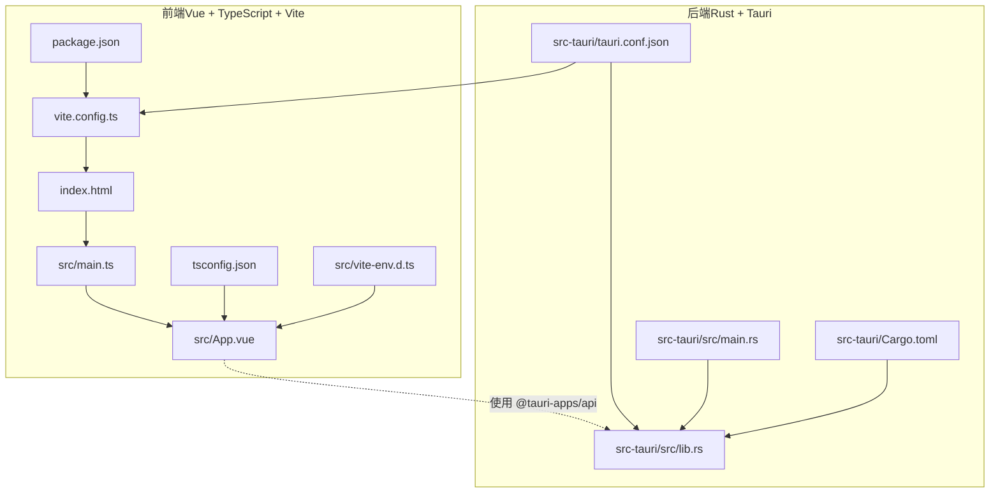
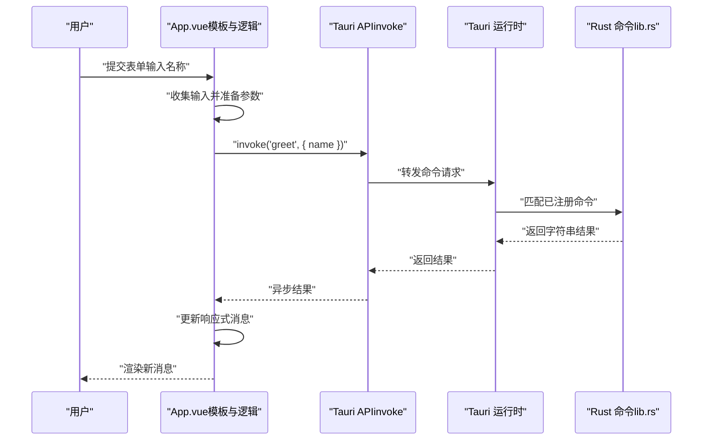
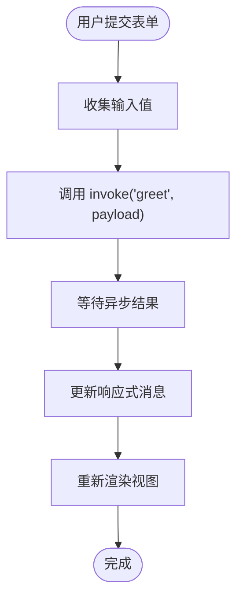
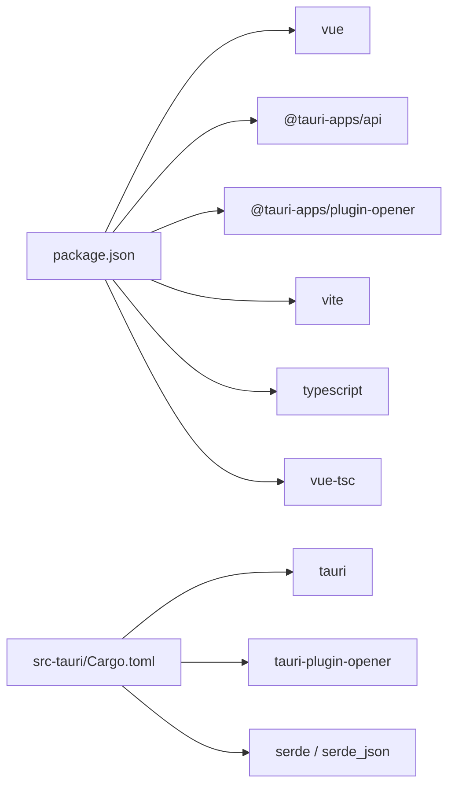

# 前端开发

<cite>
**本文引用的文件**
- [src/App.vue](file://src/App.vue)
- [src/main.ts](file://src/main.ts)
- [vite.config.ts](file://vite.config.ts)
- [package.json](file://package.json)
- [tsconfig.json](file://tsconfig.json)
- [src/vite-env.d.ts](file://src/vite-env.d.ts)
- [index.html](file://index.html)
- [src-tauri/tauri.conf.json](file://src-tauri/tauri.conf.json)
- [src-tauri/src/lib.rs](file://src-tauri/src/lib.rs)
- [src-tauri/src/main.rs](file://src-tauri/src/main.rs)
- [src-tauri/Cargo.toml](file://src-tauri/Cargo.toml)
- [README.md](file://README.md)
- [AGENTS.md](file://AGENTS.md)
</cite>

## 目录
1. [简介](#简介)
2. [项目结构](#项目结构)
3. [核心组件](#核心组件)
4. [架构总览](#架构总览)
5. [详细组件分析](#详细组件分析)
6. [依赖分析](#依赖分析)
7. [性能考虑](#性能考虑)
8. [故障排查指南](#故障排查指南)
9. [结论](#结论)
10. [附录](#附录)

## 简介
本指南面向 Vue 3 + TypeScript + Vite + Tauri 的前端开发，聚焦以下主题：
- Vue 3 单文件组件（SFC）与 script setup 语法
- TypeScript 在组件中的类型声明、接口与泛型实践
- Tauri API 集成：invoke 调用、命令注册与错误处理
- App.vue 组件的交互、状态与前后端通信
- Vite 开发服务器、热重载与构建优化
- 响应式数据绑定、计算属性、侦听器与组件通信、路由与状态管理建议

## 项目结构
该仓库采用“前端 Vue + 后端 Rust（Tauri）”分层结构，前端通过 Vite 构建并在 Tauri 开发模式下运行于固定端口；后端在 Rust 中注册命令并通过 Tauri 暴露给前端。

图表来源
- [index.html:1-15](file://index.html#L1-L15)
- [src/main.ts:1-5](file://src/main.ts#L1-L5)
- [src/App.vue:1-160](file://src/App.vue#L1-L160)
- [vite.config.ts:1-33](file://vite.config.ts#L1-L33)
- [package.json:1-25](file://package.json#L1-L25)
- [tsconfig.json:1-26](file://tsconfig.json#L1-L26)
- [src/vite-env.d.ts:1-8](file://src/vite-env.d.ts#L1-L8)
- [src-tauri/tauri.conf.json:1-36](file://src-tauri/tauri.conf.json#L1-L36)
- [src-tauri/src/lib.rs:1-14](file://src-tauri/src/lib.rs#L1-L14)
- [src-tauri/src/main.rs:1-7](file://src-tauri/src/main.rs#L1-L7)
- [src-tauri/Cargo.toml:1-26](file://src-tauri/Cargo.toml#L1-L26)

章节来源
- [README.md:1-17](file://README.md#L1-L17)
- [AGENTS.md:73-105](file://AGENTS.md#L73-L105)

## 核心组件
- 应用入口与挂载：应用通过入口脚本创建并挂载到 DOM 容器。
- 主界面组件：App.vue 展示交互表单、接收用户输入并通过 invoke 调用后端命令，显示返回消息。
- 类型与模块声明：通过 tsconfig 与 vite-env.d.ts 提供 Vue 模块类型支持与严格类型检查。
- 构建与开发：Vite 配置启用 Vue 插件、固定端口与 HMR，配合 Tauri 开发流程。

章节来源
- [src/main.ts:1-5](file://src/main.ts#L1-L5)
- [src/App.vue:1-160](file://src/App.vue#L1-L160)
- [tsconfig.json:1-26](file://tsconfig.json#L1-L26)
- [src/vite-env.d.ts:1-8](file://src/vite-env.d.ts#L1-L8)
- [vite.config.ts:1-33](file://vite.config.ts#L1-L33)

## 架构总览
前端通过 Tauri 的 invoke 通道调用后端命令，后端在 Rust 中注册命令并通过 Tauri 运行时执行。开发阶段由 Vite 提供快速迭代与热更新，Tauri 将前端资源作为应用窗口加载。

图表来源
- [src/App.vue:8-11](file://src/App.vue#L8-L11)
- [src-tauri/src/lib.rs:1-14](file://src-tauri/src/lib.rs#L1-L14)
- [src-tauri/tauri.conf.json:6-11](file://src-tauri/tauri.conf.json#L6-L11)

## 详细组件分析

### App.vue 组件分析
- 组件结构：采用 script setup 语法，导入响应式引用与 Tauri invoke。
- 用户交互：表单绑定输入框，提交事件触发异步 greet 方法。
- 状态管理：使用 ref 管理输入与输出消息，实现双向绑定与视图更新。
- 与后端通信：通过 invoke 发起命令调用，等待返回并更新本地状态。
- 样式组织：scoped 与全局样式分离，适配明暗主题切换。

图表来源
- [src/App.vue:31-35](file://src/App.vue#L31-L35)
- [src/App.vue:8-11](file://src/App.vue#L8-L11)

章节来源
- [src/App.vue:1-160](file://src/App.vue#L1-L160)

### TypeScript 集成与类型声明
- 编译选项：启用严格模式、模块解析为打包器、禁止输出 JS、保留 JSX。
- 类型支持：通过 vite-env.d.ts 为 .vue 文件提供默认组件类型声明。
- 项目引用：tsconfig 引用 tsconfig.node.json，确保多 tsconfig 场景一致。

章节来源
- [tsconfig.json:1-26](file://tsconfig.json#L1-L26)
- [src/vite-env.d.ts:1-8](file://src/vite-env.d.ts#L1-L8)

### Vite 配置与开发体验
- 插件：启用 @vitejs/plugin-vue 支持 Vue SFC。
- 固定端口：开发服务器固定端口与严格端口策略，避免冲突。
- 主机与 HMR：根据环境变量决定是否启用跨主机 HMR，提升协作效率。
- 忽略监听：排除 src-tauri 目录，减少无关文件监控开销。
- 构建脚本：先进行类型检查再执行构建，保证产物质量。

章节来源
- [vite.config.ts:1-33](file://vite.config.ts#L1-L33)
- [package.json:6-11](file://package.json#L6-L11)

### Tauri 集成与命令调用
- 前端调用：通过 @tauri-apps/api 的 invoke 发送命令名与参数。
- 后端注册：在 Rust 中以 #[tauri::command] 声明命令，并在 run 流程中注册。
- 配置联动：Tauri 配置指定开发前命令、前端构建目录与运行时窗口尺寸等。

章节来源
- [src/App.vue:3-11](file://src/App.vue#L3-L11)
- [src-tauri/src/lib.rs:1-14](file://src-tauri/src/lib.rs#L1-L14)
- [src-tauri/tauri.conf.json:6-11](file://src-tauri/tauri.conf.json#L6-L11)

### 应用入口与挂载
- 入口脚本：创建 Vue 应用实例并挂载到 index.html 的 #app 容器。
- HTML 结构：仅包含挂载点与入口脚本引入，简洁清晰。

章节来源
- [src/main.ts:1-5](file://src/main.ts#L1-L5)
- [index.html:10-12](file://index.html#L10-L12)

### 响应式、计算属性与侦听器（实践建议）
- 响应式数据绑定：使用 ref/ reactive 管理本地状态，结合 v-model 实现双向绑定。
- 计算属性：用于派生数据与复杂表达式缓存，减少模板重复计算。
- 侦听器：用于副作用（如网络请求、日志记录），注意控制触发频率与清理资源。
- 与 Tauri 集成：在侦听器中发起 invoke，注意错误捕获与 loading 状态管理。

（本节为通用实践指导，不直接分析具体文件）

### 组件间通信与状态管理（实践建议）
- 父子通信：通过 props 下传与 emits 上抛，保持单向数据流。
- 兄弟/跨级通信：使用事件总线或集中式状态（如 Pinia），避免深层传递。
- 全局状态：对于共享配置、用户会话等，推荐集中化管理，避免分散维护。
- 与 Tauri 集成：将命令调用封装为可复用的 Composables，统一错误处理与加载态。

（本节为通用实践指导，不直接分析具体文件）

### 路由管理（实践建议）
- SPA 场景：可选 Vue Router，按需懒加载与权限守卫。
- Tauri 窗口：多窗口场景下，通过 Tauri 的窗口 API 控制窗口生命周期与通信。
- 路由与命令：路由变化与命令调用解耦，避免在路由钩子中做阻塞操作。

（本节为通用实践指导，不直接分析具体文件）

## 依赖分析
- 前端依赖：Vue 3、@tauri-apps/api、@tauri-apps/plugin-opener、Vite、TypeScript 及相关插件。
- 后端依赖：Tauri 核心、opener 插件、序列化工具等。
- 开发脚本：dev/build/preview/tauri 分别对应不同构建与运行阶段。

图表来源
- [package.json:12-23](file://package.json#L12-L23)
- [src-tauri/Cargo.toml:20-25](file://src-tauri/Cargo.toml#L20-L25)

章节来源
- [package.json:1-25](file://package.json#L1-L25)
- [src-tauri/Cargo.toml:1-26](file://src-tauri/Cargo.toml#L1-L26)

## 性能考虑
- 构建优化：利用 Vite 的原生 ESM 与按需编译特性；生产构建开启压缩与 Tree-shaking。
- 类型检查：在构建前执行类型检查，避免运行时类型错误导致的性能回退。
- 网络与命令：批量请求合并、防抖与节流、缓存策略；对高频命令增加本地缓存。
- 样式与资源：拆分样式、延迟加载非关键资源、使用合适的图片格式与尺寸。
- 开发体验：固定端口与 HMR 提升迭代速度；忽略无关目录降低监听成本。

（本节提供通用指导，不直接分析具体文件）

## 故障排查指南
- 开发端口占用：确认固定端口未被占用，必要时调整或释放端口。
- HMR 不生效：若跨主机开发，确保设置正确的主机地址与 HMR 端口。
- 类型错误：遵循严格模式，修复类型问题后再进行构建。
- Tauri 命令未找到：确认命令已在后端注册且名称一致；检查运行时上下文。
- 资源路径：静态资源使用绝对路径或相对路径保持一致性，避免构建后路径错误。
- 错误处理：前端使用 try/catch 包裹异步调用，后端使用 Result 类型传播错误。

章节来源
- [vite.config.ts:16-31](file://vite.config.ts#L16-L31)
- [AGENTS.md:68-71](file://AGENTS.md#L68-L71)

## 结论
本项目以 Vue 3 + TypeScript + Vite 为基础，结合 Tauri 实现桌面应用的前后端一体化开发。通过 script setup 语法与响应式系统简化状态管理，借助 Tauri 的 invoke 通道实现安全高效的命令调用。Vite 的开发体验与严格的 TypeScript 配置共同保障了开发效率与代码质量。建议在后续扩展中引入路由、状态管理与更完善的错误处理与缓存策略，持续提升用户体验与可维护性。

## 附录
- 推荐 IDE 插件与设置：VS Code + Volar + Tauri + rust-analyzer；按需启用 Take Over 模式以获得更好的 .vue 类型支持。
- 关键文件清单：入口脚本、主组件、Vite 配置、TypeScript 配置、Tauri 配置与命令实现、包管理配置。

章节来源
- [README.md:5-17](file://README.md#L5-L17)
- [AGENTS.md:100-105](file://AGENTS.md#L100-L105)