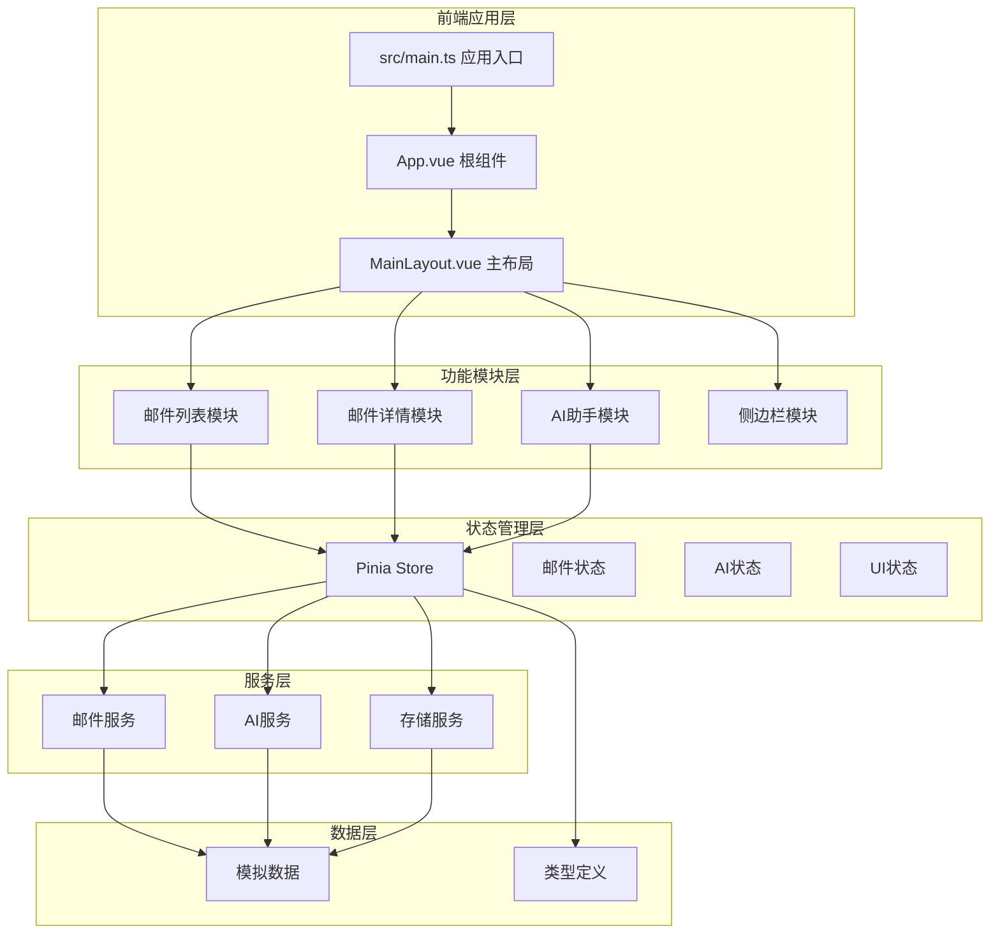
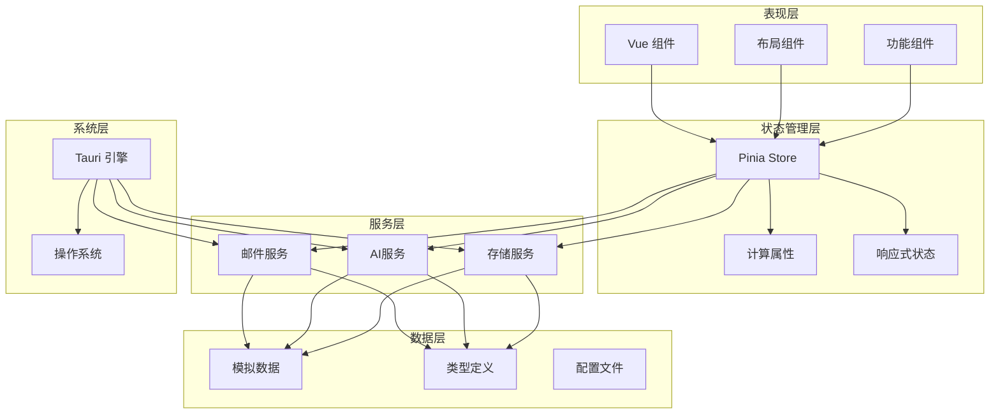
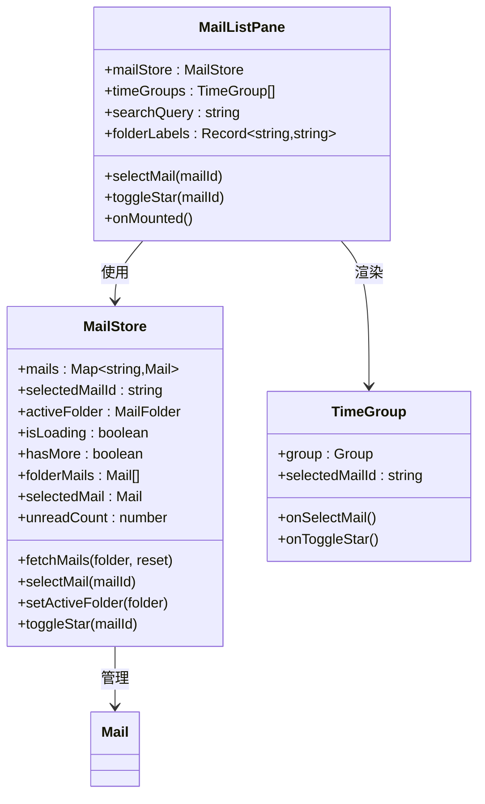
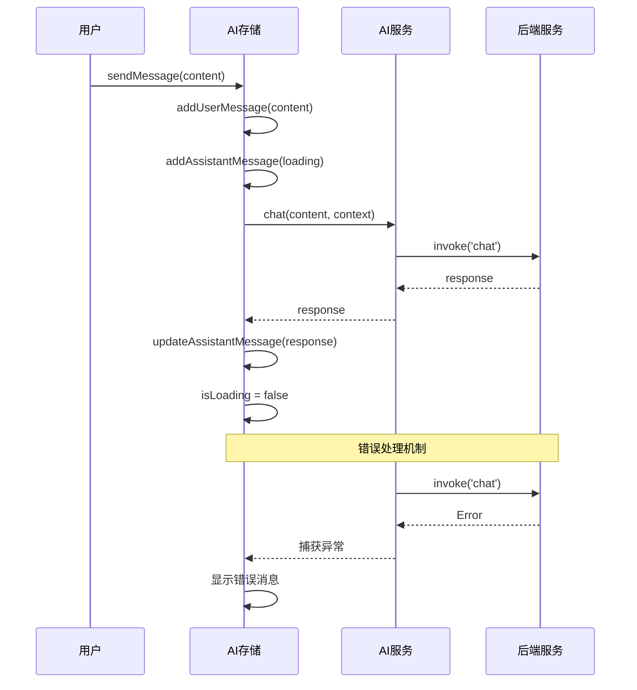
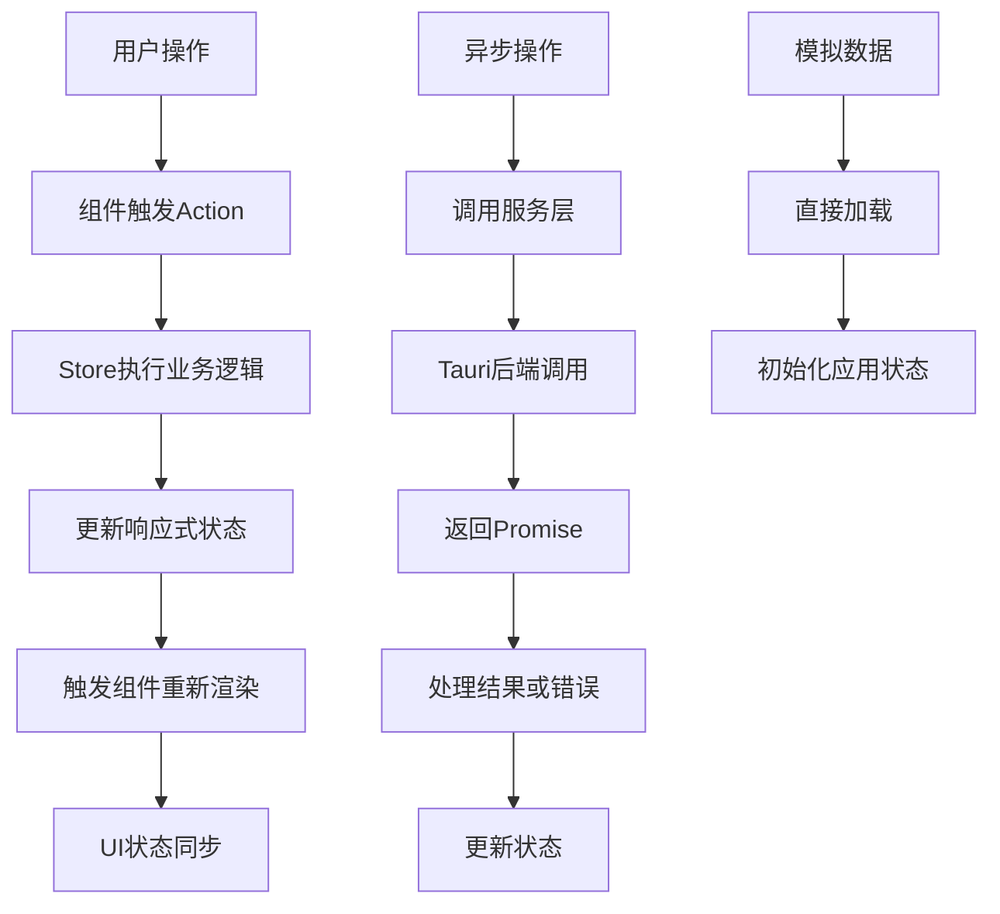
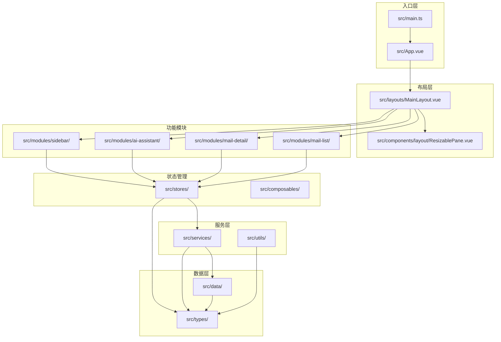

# 打桩数据系统

<cite>
**本文档引用的文件**
- [README.md](file://README.md)
- [package.json](file://package.json)
- [src/main.ts](file://src/main.ts)
- [src/App.vue](file://src/App.vue)
- [src/layouts/MainLayout.vue](file://src/layouts/MainLayout.vue)
- [src/modules/mail-list/MailListPane.vue](file://src/modules/mail-list/MailListPane.vue)
- [src/stores/index.ts](file://src/stores/index.ts)
- [src/stores/mail.store.ts](file://src/stores/mail.store.ts)
- [src/stores/ai.store.ts](file://src/stores/ai.store.ts)
- [src/services/mail.service.ts](file://src/services/mail.service.ts)
- [src/services/index.ts](file://src/services/index.ts)
- [src/data/index.ts](file://src/data/index.ts)
- [src/types/index.ts](file://src/types/index.ts)
- [src-tauri/src/main.rs](file://src-tauri/src/main.rs)
- [src-tauri/tauri.conf.json](file://src-tauri/tauri.conf.json)
</cite>

## 目录
1. [简介](#简介)
2. [项目结构](#项目结构)
3. [核心组件](#核心组件)
4. [架构概览](#架构概览)
5. [详细组件分析](#详细组件分析)
6. [依赖关系分析](#依赖关系分析)
7. [性能考虑](#性能考虑)
8. [故障排除指南](#故障排除指南)
9. [结论](#结论)

## 简介

这是一个基于 Tauri + Vue + TypeScript 构建的桌面应用程序，专门用于演示和测试打桩数据系统。该系统通过模拟真实的数据源来提供完整的邮件管理和AI助手功能，无需实际的后端服务即可运行。

应用程序采用现代化的前端架构，使用 Pinia 进行状态管理，Vue 3 的 Composition API 进行组件开发，并通过 Tauri 提供原生桌面应用体验。系统的核心特色是完全基于模拟数据的实现，使得开发者可以在没有真实后端的情况下进行功能测试和界面验证。

## 项目结构

该项目采用模块化的前端架构设计，结合了现代 Web 开发的最佳实践：



**图表来源**
- [src/main.ts:1-10](file://src/main.ts#L1-L10)
- [src/App.vue:1-35](file://src/App.vue#L1-L35)
- [src/layouts/MainLayout.vue:1-131](file://src/layouts/MainLayout.vue#L1-L131)

**章节来源**
- [README.md:1-2](file://README.md#L1-L2)
- [package.json:1-29](file://package.json#L1-L29)

## 核心组件

### 应用入口与初始化

应用通过 `src/main.ts` 进行初始化，创建 Vue 应用实例并集成 Pinia 状态管理。这是整个应用程序的启动点，负责设置全局配置和依赖注入。

### 根组件与布局系统

`src/App.vue` 作为根组件，在挂载时直接加载模拟数据到各个存储中，包括邮箱账户、模板、知识库和聊天会话。主布局 `MainLayout.vue` 实现了三栏式布局，包含侧边栏、邮件列表和邮件详情区域，以及可折叠的AI助手面板。

### 状态管理系统

系统使用 Pinia 进行状态管理，主要包含三个核心存储：
- **邮件存储** (`mail.store.ts`): 管理邮件数据、选中状态和文件夹切换
- **AI存储** (`ai.store.ts`): 处理聊天会话、消息历史和AI交互
- **UI存储** (`ui.store.ts`): 控制界面布局和用户交互状态

**章节来源**
- [src/main.ts:1-10](file://src/main.ts#L1-L10)
- [src/App.vue:12-23](file://src/App.vue#L12-L23)
- [src/layouts/MainLayout.vue:10-11](file://src/layouts/MainLayout.vue#L10-L11)

## 架构概览

该系统采用了分层架构设计，确保了良好的关注点分离和可维护性：



**图表来源**
- [src/stores/index.ts:1-6](file://src/stores/index.ts#L1-L6)
- [src/services/index.ts:1-4](file://src/services/index.ts#L1-L4)
- [src-tauri/src/main.rs:4-6](file://src-tauri/src/main.rs#L4-L6)

## 详细组件分析

### 邮件列表组件分析

邮件列表组件实现了完整的邮件浏览功能，包括时间分组、搜索和交互操作：



**图表来源**
- [src/modules/mail-list/MailListPane.vue:1-122](file://src/modules/mail-list/MailListPane.vue#L1-L122)
- [src/stores/mail.store.ts:8-89](file://src/stores/mail.store.ts#L8-L89)

该组件的主要特性包括：
- **时间分组显示**: 将邮件按接收时间自动分组
- **文件夹导航**: 支持收件箱、发件箱、草稿箱等文件夹切换
- **交互功能**: 邮件选择、星标标记、加载状态显示
- **响应式设计**: 适配不同屏幕尺寸的布局

**章节来源**
- [src/modules/mail-list/MailListPane.vue:19-38](file://src/modules/mail-list/MailListPane.vue#L19-L38)
- [src/stores/mail.store.ts:42-67](file://src/stores/mail.store.ts#L42-L67)

### AI助手组件分析

AI助手组件提供了智能聊天和邮件处理功能，支持多会话管理和上下文感知：



**图表来源**
- [src/stores/ai.store.ts:109-127](file://src/stores/ai.store.ts#L109-L127)
- [src/services/mail.service.ts:15-18](file://src/services/mail.service.ts#L15-L18)

AI助手的核心功能包括：
- **多会话管理**: 支持同时管理多个聊天会话
- **智能摘要**: 自动生成邮件内容摘要
- **智能回复**: 基于邮件内容生成合适的回复
- **上下文保持**: 在会话中保持对话上下文

**章节来源**
- [src/stores/ai.store.ts:21-165](file://src/stores/ai.store.ts#L21-L165)

### 状态管理流程分析

系统采用集中式状态管理模式，通过 Pinia 实现组件间的状态共享：



**图表来源**
- [src/stores/mail.store.ts:33-47](file://src/stores/mail.store.ts#L33-L47)
- [src/App.vue:12-23](file://src/App.vue#L12-L23)

**章节来源**
- [src/stores/mail.store.ts:73-88](file://src/stores/mail.store.ts#L73-L88)
- [src/stores/ai.store.ts:175-195](file://src/stores/ai.store.ts#L175-L195)

## 依赖关系分析

### 外部依赖关系

系统使用了现代化的前端技术栈，各依赖项之间存在清晰的层次关系：

```mermaid
graph LR
subgraph "运行时依赖"
A[Vue 3.5.13]
B[Pinia 2.3.0]
C[@tauri-apps/api 2.10.1]
D[@vueuse/core 14.2.0]
E[dayjs 1.11.20]
end
subgraph "开发时依赖"
F[@vitejs/plugin-vue 5.2.1]
G[TypeScript 5.6.2]
H[Vite 6.0.3]
I[Vue TSC 2.1.10]
J[@tauri-apps/cli 2.10.1]
K[Sass 1.80.0]
end
subgraph "应用层"
L[main.ts]
M[App.vue]
N[组件系统]
O[服务层]
end
A --> L
B --> N
C --> O
D --> N
E --> N
F --> H
G --> H
H --> L
I --> H
J --> H
K --> L
L --> M
M --> N
N --> O
```

**图表来源**
- [package.json:12-27](file://package.json#L12-L27)

### 内部模块依赖

系统内部模块之间的依赖关系体现了清晰的关注点分离：



**图表来源**
- [src/stores/index.ts:1-6](file://src/stores/index.ts#L1-L6)
- [src/services/index.ts:1-4](file://src/services/index.ts#L1-L4)
- [src/data/index.ts:1-22](file://src/data/index.ts#L1-L22)

**章节来源**
- [package.json:6-27](file://package.json#L6-L27)

## 性能考虑

### 响应式数据优化

系统在状态管理方面采用了多项性能优化策略：

- **计算属性缓存**: 使用 `computed` 属性避免重复计算
- **响应式状态粒度**: 精确控制响应式状态的范围和更新频率
- **虚拟滚动**: 对大量邮件列表使用虚拟滚动技术

### 组件渲染优化

- **条件渲染**: 使用 `v-if` 和 `v-show` 优化条件内容的渲染
- **事件防抖**: 对高频事件使用防抖处理
- **懒加载**: 图片和大组件采用懒加载策略

### 内存管理

- **状态清理**: 及时清理不再使用的状态和事件监听器
- **组件卸载**: 在组件卸载时清理定时器和订阅

## 故障排除指南

### 常见问题诊断

**应用无法启动**
1. 检查 Node.js 版本是否满足要求
2. 确认依赖包正确安装
3. 验证 Vite 配置文件

**Tauri 功能异常**
1. 检查 Tauri 配置文件中的权限设置
2. 验证后端服务是否正确编译
3. 查看控制台错误信息

**状态管理问题**
1. 确认 Pinia 存储的初始化顺序
2. 检查状态更新的异步处理
3. 验证组件与存储的绑定关系

### 调试技巧

- 使用浏览器开发者工具监控 Vue DevTools
- 利用 Tauri 的调试模式查看系统日志
- 通过网络面板检查 API 调用状态

**章节来源**
- [src/services/mail.service.ts:15-18](file://src/services/mail.service.ts#L15-L18)
- [src-tauri/tauri.conf.json:20-22](file://src-tauri/tauri.conf.json#L20-L22)

## 结论

这个打桩数据系统展示了现代桌面应用开发的最佳实践，通过模拟真实数据实现了完整的功能演示。系统具有以下优势：

- **架构清晰**: 分层设计确保了良好的可维护性和扩展性
- **开发友好**: 完全基于模拟数据，便于快速开发和测试
- **性能优化**: 采用多种性能优化策略提升用户体验
- **技术先进**: 使用最新的前端技术和开发工具链

该系统为类似的应用程序提供了一个优秀的参考实现，特别是在需要快速原型开发和功能演示的场景下。通过合理的架构设计和性能优化，系统能够在保持功能完整性的同时提供流畅的用户体验。