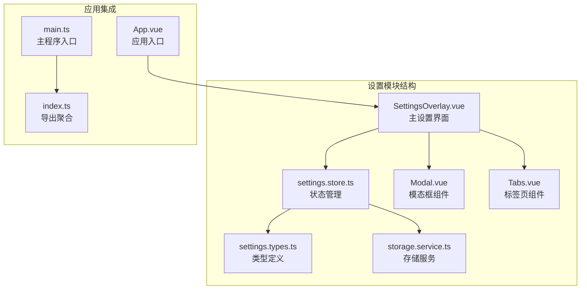
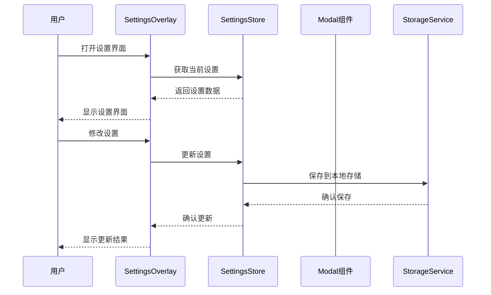
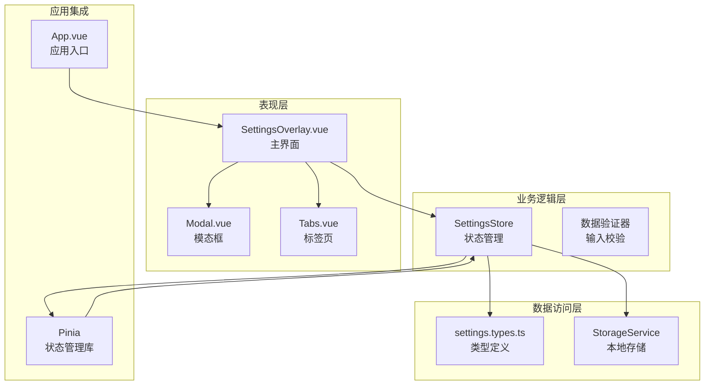
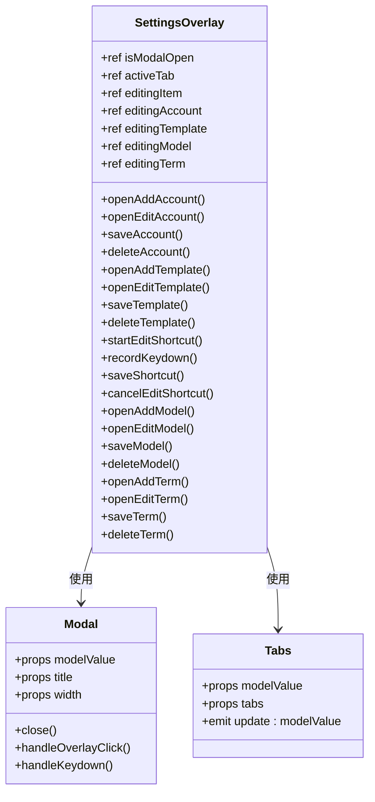
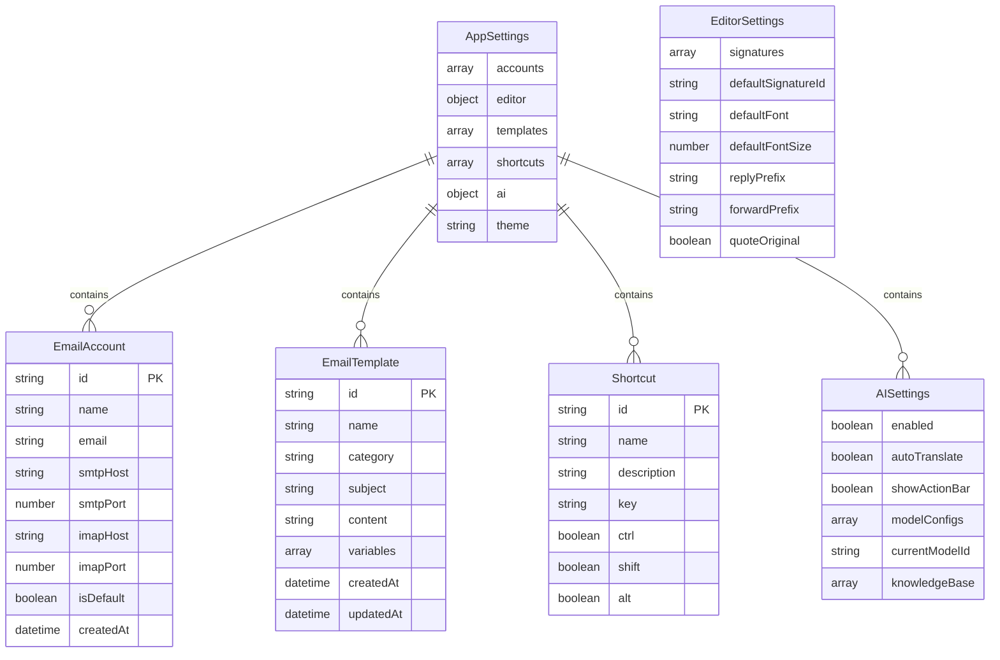
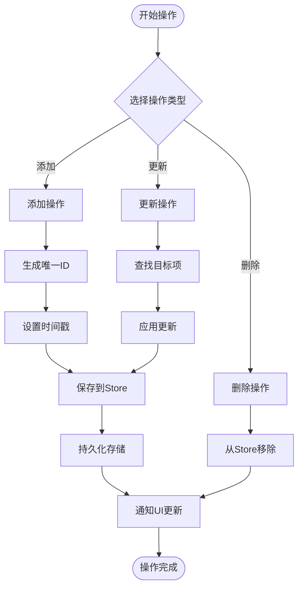
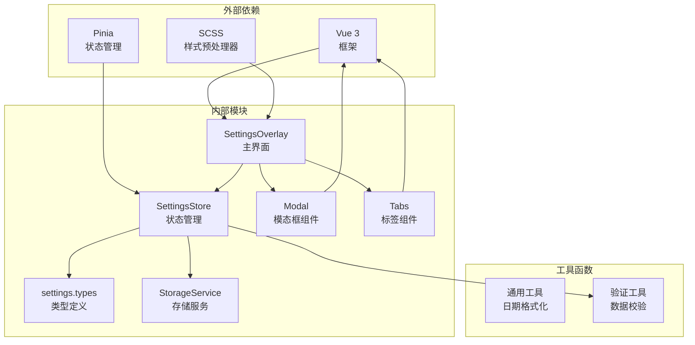

# 设置模块

<cite>
**本文档中引用的文件**
- [SettingsOverlay.vue](file://src/modules/settings/SettingsOverlay.vue)
- [settings.store.ts](file://src/stores/settings.store.ts)
- [settings.types.ts](file://src/types/settings.types.ts)
- [storage.service.ts](file://src/services/storage.service.ts)
- [Modal.vue](file://src/components/common/Modal.vue)
- [Tabs.vue](file://src/components/common/Tabs.vue)
- [App.vue](file://src/App.vue)
- [main.ts](file://src/main.ts)
- [index.ts](file://src/stores/index.ts)
</cite>

## 目录
1. [简介](#简介)
2. [项目结构](#项目结构)
3. [核心组件](#核心组件)
4. [架构概览](#架构概览)
5. [详细组件分析](#详细组件分析)
6. [依赖关系分析](#依赖关系分析)
7. [性能考虑](#性能考虑)
8. [故障排除指南](#故障排除指南)
9. [结论](#结论)

## 简介

设置模块是 Tauri 应用中的核心配置系统，提供了一个完整的用户界面来管理应用的各种设置选项。该模块采用现代化的 Vue 3 Composition API 构建，集成了 Pinia 状态管理，支持多种设置类别包括邮箱账号、编辑器配置、邮件模板、快捷键管理和 AI 设置等。

设置模块的主要特点：
- 基于 Vue 3 + TypeScript 的现代前端架构
- 使用 Pinia 进行全局状态管理
- 支持响应式数据绑定和实时更新
- 提供直观的用户界面和良好的用户体验
- 具备完整的 CRUD 操作功能

## 项目结构

设置模块位于 `src/modules/settings/` 目录下，主要包含以下文件：

**图表来源**
- [SettingsOverlay.vue:1-50](file://src/modules/settings/SettingsOverlay.vue#L1-L50)
- [settings.store.ts:1-20](file://src/stores/settings.store.ts#L1-L20)
- [settings.types.ts:1-20](file://src/types/settings.types.ts#L1-L20)

**章节来源**
- [SettingsOverlay.vue:1-100](file://src/modules/settings/SettingsOverlay.vue#L1-L100)
- [settings.store.ts:1-50](file://src/stores/settings.store.ts#L1-L50)

## 核心组件

设置模块由多个核心组件协同工作，形成完整的设置管理系统：

### 主要组件职责

1. **SettingsOverlay.vue**: 设置界面的主容器，负责布局和交互逻辑
2. **Settings Store**: 全局状态管理，处理所有设置数据的增删改查操作
3. **Modal 组件**: 提供模态框功能，用于编辑各种设置项
4. **Tabs 组件**: 实现多标签页导航，组织不同类型的设置
5. **Storage Service**: 封装本地存储功能，确保设置持久化

### 数据流架构

**图表来源**
- [SettingsOverlay.vue:12-28](file://src/modules/settings/SettingsOverlay.vue#L12-L28)
- [settings.store.ts:47-54](file://src/stores/settings.store.ts#L47-L54)
- [storage.service.ts:12-18](file://src/services/storage.service.ts#L12-L18)

**章节来源**
- [SettingsOverlay.vue:12-60](file://src/modules/settings/SettingsOverlay.vue#L12-L60)
- [settings.store.ts:12-54](file://src/stores/settings.store.ts#L12-L54)

## 架构概览

设置模块采用分层架构设计，确保代码的可维护性和扩展性：

**图表来源**
- [SettingsOverlay.vue:1-12](file://src/modules/settings/SettingsOverlay.vue#L1-L12)
- [settings.store.ts:1-12](file://src/stores/settings.store.ts#L1-L12)
- [storage.service.ts:1-28](file://src/services/storage.service.ts#L1-L28)

### 设计模式应用

设置模块采用了多种设计模式：

1. **单例模式**: SettingsStore 作为全局状态管理器
2. **观察者模式**: Vue 响应式系统实现数据绑定
3. **策略模式**: 不同设置类型的独立处理逻辑
4. **工厂模式**: 自动生成唯一 ID 和时间戳

**章节来源**
- [settings.store.ts:12-179](file://src/stores/settings.store.ts#L12-L179)

## 详细组件分析

### SettingsOverlay 组件分析

SettingsOverlay 是设置模块的核心界面组件，采用响应式设计和模块化架构：

#### 组件结构

**图表来源**
- [SettingsOverlay.vue:12-217](file://src/modules/settings/SettingsOverlay.vue#L12-L217)
- [Modal.vue:5-48](file://src/components/common/Modal.vue#L5-L48)
- [Tabs.vue:4-28](file://src/components/common/Tabs.vue#L4-L28)

#### 设置类别功能

设置模块支持以下主要设置类别：

1. **邮箱账号设置**
   - 支持 SMTP/IMAP 配置
   - 默认账号管理
   - 安全认证支持

2. **编辑器设置**
   - 字体和字号配置
   - 回复/转发前缀定制
   - 引用原文功能

3. **模板管理**
   - 分类化的邮件模板
   - 变量替换支持
   - HTML 内容编辑

4. **快捷键设置**
   - 自定义键盘快捷键
   - 多键组合支持
   - 实时编辑功能

5. **AI 设置**
   - 模型配置管理
   - 知识库术语维护
   - 功能开关控制

**章节来源**
- [SettingsOverlay.vue:41-217](file://src/modules/settings/SettingsOverlay.vue#L41-L217)

### SettingsStore 状态管理分析

SettingsStore 采用 Vue 3 的 Composition API 和 Pinia 进行状态管理：

#### 状态结构

**图表来源**
- [settings.types.ts:91-99](file://src/types/settings.types.ts#L91-L99)
- [settings.types.ts:4-15](file://src/types/settings.types.ts#L4-L15)
- [settings.types.ts:79-88](file://src/types/settings.types.ts#L79-L88)

#### CRUD 操作流程

**图表来源**
- [settings.store.ts:57-79](file://src/stores/settings.store.ts#L57-L79)
- [settings.store.ts:82-101](file://src/stores/settings.store.ts#L82-L101)
- [settings.store.ts:104-127](file://src/stores/settings.store.ts#L104-L127)

**章节来源**
- [settings.store.ts:12-179](file://src/stores/settings.store.ts#L12-L179)

### 类型系统分析

设置模块的类型系统提供了完整的数据结构定义：

#### 核心类型定义

| 类型 | 描述 | 关键字段 |
|------|------|----------|
| EmailAccount | 邮箱账号配置 | id, name, email, smtpHost, imapHost, isDefault |
| EmailTemplate | 邮件模板 | id, name, category, subject, content, variables |
| AIModelConfig | AI模型配置 | id, name, baseUrl, apiKey, modelName, isDefault |
| KnowledgeTerm | 知识库术语 | id, termCN, termEN, category, tags |
| Shortcut | 快捷键配置 | id, name, key, ctrl, shift, alt |
| AppSettings | 应用设置总览 | accounts, editor, templates, shortcuts, ai, theme |

**章节来源**
- [settings.types.ts:1-99](file://src/types/settings.types.ts#L1-L99)

## 依赖关系分析

设置模块的依赖关系清晰明确，遵循单一职责原则：

**图表来源**
- [main.ts:1-10](file://src/main.ts#L1-L10)
- [index.ts:1-6](file://src/stores/index.ts#L1-L6)

### 组件间通信机制

设置模块采用多种通信机制确保组件间的协调工作：

1. **Props 传递**: 父组件向子组件传递配置数据
2. **事件发射**: 子组件向父组件发送用户操作事件
3. **状态共享**: Pinia Store 提供全局状态共享
4. **插槽机制**: 支持灵活的内容定制

**章节来源**
- [SettingsOverlay.vue:1-12](file://src/modules/settings/SettingsOverlay.vue#L1-L12)
- [Modal.vue:18-23](file://src/components/common/Modal.vue#L18-L23)

## 性能考虑

设置模块在设计时充分考虑了性能优化：

### 响应式更新策略

- **细粒度更新**: 使用 Vue 3 的响应式系统，只更新受影响的组件
- **懒加载**: 模态框组件按需加载，减少初始渲染负担
- **虚拟滚动**: 对大量列表数据使用虚拟滚动优化

### 内存管理

- **垃圾回收**: 合理的组件生命周期管理
- **事件清理**: 及时移除事件监听器
- **缓存策略**: 对频繁访问的数据进行缓存

### 存储优化

- **增量更新**: 只保存变更的数据
- **压缩存储**: 对大型数据进行压缩存储
- **异步写入**: 避免阻塞主线程

## 故障排除指南

### 常见问题及解决方案

#### 设置无法保存

**问题症状**: 修改设置后刷新页面发现设置恢复默认值

**可能原因**:
1. 浏览器禁用了本地存储
2. 存储空间不足
3. 数据序列化失败

**解决步骤**:
1. 检查浏览器开发者工具的 Application 标签
2. 确认 Local Storage 中有对应键值
3. 查看控制台是否有错误信息

#### 模态框无法关闭

**问题症状**: 打开设置后无法通过点击遮罩层或按 ESC 键关闭

**解决步骤**:
1. 检查 Modal 组件的事件监听是否正常
2. 确认键盘事件处理函数是否被正确调用
3. 验证 Teleport 组件是否正确挂载到 body

#### 数据同步问题

**问题症状**: 设置更新后界面没有反映最新状态

**解决步骤**:
1. 检查 Pinia Store 的响应式更新
2. 确认组件的 computed 属性是否正确
3. 验证数据绑定的双向同步

**章节来源**
- [storage.service.ts:3-18](file://src/services/storage.service.ts#L3-L18)
- [Modal.vue:31-47](file://src/components/common/Modal.vue#L31-L47)

## 结论

设置模块展现了现代前端应用的最佳实践，通过合理的架构设计和丰富的功能特性，为用户提供了完善的配置管理体验。模块具有以下优势：

1. **架构清晰**: 采用分层设计，职责分离明确
2. **扩展性强**: 支持新增设置类别和功能模块
3. **用户体验优秀**: 响应式设计和直观的操作界面
4. **性能优化**: 合理的状态管理和内存使用策略
5. **易于维护**: 清晰的代码结构和完善的类型系统

未来可以考虑的功能增强包括：
- 设置导入导出功能
- 设置模板和预设方案
- 更精细的权限控制
- 设置版本管理和历史记录