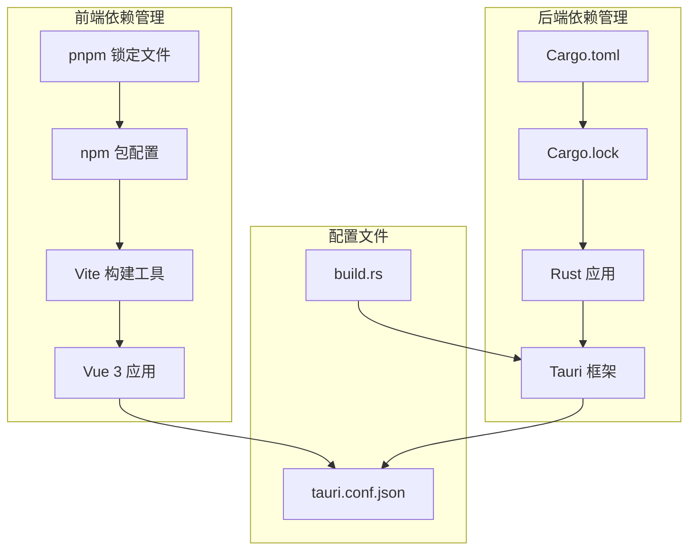
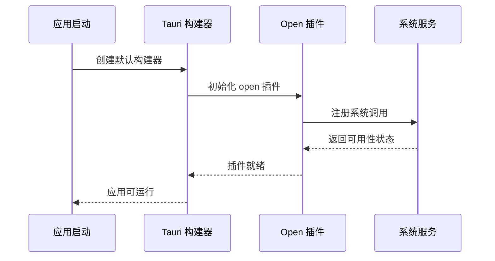
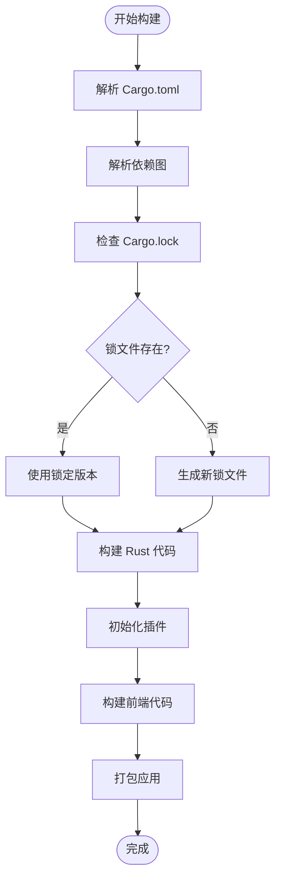

# Cargo 依赖管理

<cite>
**本文档引用的文件**
- [Cargo.toml](file://src-tauri/Cargo.toml)
- [Cargo.lock](file://src-tauri/Cargo.lock)
- [package.json](file://package.json)
- [tauri.conf.json](file://src-tauri/tauri.conf.json)
- [build.rs](file://src-tauri/build.rs)
- [lib.rs](file://src-tauri/src/lib.rs)
- [main.rs](file://src-tauri/src/main.rs)
- [pnpm-lock.yaml](file://pnpm-lock.yaml)
</cite>

## 目录
1. [简介](#简介)
2. [项目结构](#项目结构)
3. [核心组件](#核心组件)
4. [架构概览](#架构概览)
5. [详细组件分析](#详细组件分析)
6. [依赖关系分析](#依赖关系分析)
7. [性能考虑](#性能考虑)
8. [故障排除指南](#故障排除指南)
9. [结论](#结论)
10. [附录](#附录)

## 简介

本文件为 Cargo 依赖管理系统创建详细的配置和管理文档。深入解释 Cargo.toml 文件的结构和各个字段的作用，包括 [package]、[dependencies]、[build-dependencies] 等部分的配置方法。详细说明 Tauri 核心依赖的版本选择和兼容性要求，包括 tauri、tauri-build、serde、serde_json 等关键库的作用。解释依赖版本约束的语法规则，包括 caret、tilde、精确版本等不同形式。提供依赖更新和锁定文件管理的最佳实践，包括 Cargo.lock 文件的作用和维护方法。包含第三方插件的集成指南，如 @tauri-apps/plugin-opener 的配置和使用。解释开发依赖和生产依赖的区别，以及如何优化包大小和构建时间。

## 项目结构

该项目采用典型的 Tauri + Vue + TypeScript 架构，包含前端和后端两个独立的依赖管理系统：



**图表来源**
- [Cargo.toml:1-26](file://src-tauri/Cargo.toml#L1-L26)
- [package.json:1-25](file://package.json#L1-L25)
- [tauri.conf.json:1-36](file://src-tauri/tauri.conf.json#L1-L36)

**章节来源**
- [Cargo.toml:1-26](file://src-tauri/Cargo.toml#L1-L26)
- [package.json:1-25](file://package.json#L1-L25)
- [tauri.conf.json:1-36](file://src-tauri/tauri.conf.json#L1-L36)

## 核心组件

### Cargo.toml 配置详解

Cargo.toml 是 Rust 项目的配置文件，定义了包元数据、依赖关系和构建配置。

#### 基本包配置
- **[package]** 段落定义包的基本信息
  - `name`: 包名称，用于标识和发布
  - `version`: 版本号，遵循语义化版本控制
  - `description`: 包描述
  - `authors`: 作者信息列表
  - `edition`: Rust 编译器版本（2021）

#### 库配置
- **[lib]** 段落定义库的构建属性
  - `name`: 库名称，避免与二进制目标冲突
  - `crate-type`: 支持的 crate 类型数组
    - `staticlib`: 静态库
    - `cdylib`: 动态库（C 接口）
    - `rlib`: Rust 库

#### 构建时依赖
- **[build-dependencies]** 段落定义编译时需要但不参与运行时的依赖
  - `tauri-build`: Tauri 应用的构建工具
  - 特性：空特性列表

#### 运行时依赖
- **[dependencies]** 段落定义应用运行时需要的依赖
  - `tauri`: Tauri 框架核心库
  - `tauri-plugin-opener`: 开放插件，用于系统默认应用程序
  - `serde`: 序列化框架，支持 derive 特性
  - `serde_json`: JSON 序列化支持

**章节来源**
- [Cargo.toml:1-26](file://src-tauri/Cargo.toml#L1-L26)

### 版本约束语法

Cargo 支持多种版本约束语法：

#### Caret 约束 (^)
- 语法规则：`^1.2.3` 表示 `>=1.2.3` 且 `<2.0.0`
- 特点：允许次版本和补丁版本的自动更新
- 适用场景：大多数情况下推荐使用

#### Tilde 约束 (~)
- 语法规则：`~1.2.3` 表示 `>=1.2.3` 且 `<1.3.0`
- 特点：仅允许补丁版本的自动更新
- 适用场景：需要更严格控制的场景

#### 精确版本约束
- 语法规则：`"1.2.3"` 或 `version = "1.2.3"`
- 特点：固定到特定版本
- 适用场景：关键依赖或需要完全确定性的场景

#### 特性指定
- 语法：`features = ["derive"]`
- 特性：启用特定功能模块
- 适用场景：按需加载功能以减小体积

**章节来源**
- [Cargo.toml:17-24](file://src-tauri/Cargo.toml#L17-L24)

## 架构概览

```mermaid
graph TB
subgraph "应用层"
Frontend[前端应用]
Backend[后端 Rust 代码]
end
subgraph "依赖层"
subgraph "前端依赖"
VueD[Vue 生产依赖]
TauriApi[@tauri-apps/api]
OpenerPlugin[@tauri-apps/plugin-opener]
end
subgraph "后端依赖"
TauriCore[Tauri 核心]
Serde[Serde 框架]
OpenerPluginRust[Open 插件 Rust 实现]
end
end
subgraph "构建工具"
Cargo[Cargo 构建系统]
TauriCLI[Tauri CLI]
Vite[Vite 构建工具]
end
Frontend --> VueD
Frontend --> TauriApi
Frontend --> OpenerPlugin
Backend --> TauriCore
Backend --> Serde
Backend --> OpenerPluginRust
Cargo --> Backend
TauriCLI --> Frontend
Vite --> Frontend
OpenerPlugin -.-> OpenerPluginRust
```

**图表来源**
- [Cargo.toml:20-24](file://src-tauri/Cargo.toml#L20-L24)
- [package.json:12-23](file://package.json#L12-L23)
- [lib.rs:10-11](file://src-tauri/src/lib.rs#L10-L11)

## 详细组件分析

### Tauri 核心依赖分析

#### Tauri 框架核心
- **作用**：提供跨平台桌面应用框架
- **版本约束**：使用 caret 约束 `version = "2"`
- **特性**：无自定义特性启用
- **依赖关系**：作为所有 Tauri 插件的基础

#### Tauri 构建工具
- **作用**：处理 Tauri 应用的构建过程
- **版本约束**：使用 caret 约束 `version = "2"`
- **特性**：无自定义特性启用
- **集成方式**：通过 build.rs 调用 `tauri_build::build()`

#### Serde 序列化框架
- **作用**：提供高效的序列化和反序列化功能
- **版本约束**：使用 caret 约束 `version = "1"`
- **特性**：启用 `derive` 特性以自动生成实现
- **应用场景**：JSON 数据处理和状态管理

#### Serde JSON 支持
- **作用**：专门处理 JSON 格式的数据
- **版本约束**：使用 caret 约束 `"1"`
- **应用场景**：API 通信和配置文件处理

**章节来源**
- [Cargo.toml:17-24](file://src-tauri/Cargo.toml#L17-L24)
- [build.rs:1-4](file://src-tauri/build.rs#L1-L4)

### 第三方插件集成

#### Open 插件配置
- **前端集成**：在 package.json 中声明依赖
  - `@tauri-apps/plugin-opener`: "^2"
- **后端集成**：在 Rust 代码中初始化
  - 在 lib.rs 中通过 `tauri::Builder::default().plugin(tauri_plugin_opener::init())`
- **功能**：调用系统默认应用程序打开文件或链接

#### 插件初始化流程



**图表来源**
- [lib.rs:10-11](file://src-tauri/src/lib.rs#L10-L11)
- [package.json:15-15](file://package.json#L15-L15)

**章节来源**
- [lib.rs:10-11](file://src-tauri/src/lib.rs#L10-L11)
- [package.json:15-15](file://package.json#L15-L15)

### 版本兼容性矩阵

| 组件 | 版本约束 | 兼容性要求 | 用途 |
|------|----------|------------|------|
| tauri | "2" | 2.x 系列 | 核心框架 |
| tauri-build | "2" | 2.x 系列 | 构建工具 |
| serde | "1" | 1.x 系列 | 序列化框架 |
| serde_json | "1" | 1.x 系列 | JSON 处理 |
| @tauri-apps/plugin-opener | "^2" | 2.x 系列 | 打开功能 |

**章节来源**
- [Cargo.toml:20-24](file://src-tauri/Cargo.toml#L20-L24)
- [package.json:14-15](file://package.json#L14-L15)

## 依赖关系分析

### 前后端依赖映射

```mermaid
graph LR
subgraph "前端依赖"
FE1[Vue 3.5.30]
FE2[@tauri-apps/api 2.10.1]
FE3[@tauri-apps/plugin-opener 2.5.3]
end
subgraph "后端依赖"
BE1[tauri 2.x]
BE2[tauri-build 2.x]
BE3[serde 1.x]
BE4[serde_json 1.x]
BE5[tauri-plugin-opener 2.x]
end
FE1 --> BE1
FE2 --> BE2
FE3 --> BE5
BE3 --> BE1
BE4 --> BE1
```

**图表来源**
- [pnpm-lock.yaml:11-16](file://pnpm-lock.yaml#L11-L16)
- [Cargo.lock:1-50](file://src-tauri/Cargo.lock#L1-L50)

### 依赖层次结构



**图表来源**
- [Cargo.toml:1-26](file://src-tauri/Cargo.toml#L1-L26)
- [Cargo.lock:1-10](file://src-tauri/Cargo.lock#L1-L10)

**章节来源**
- [Cargo.toml:1-26](file://src-tauri/Cargo.toml#L1-L26)
- [Cargo.lock:1-50](file://src-tauri/Cargo.lock#L1-L50)

## 性能考虑

### 依赖优化策略

#### 特性驱动的依赖
- 使用特性系统按需加载功能
- 避免不必要的依赖项
- 减少最终二进制文件大小

#### 版本锁定策略
- 在生产环境中使用精确版本
- 定期审查依赖更新
- 平衡安全性与稳定性

#### 构建优化
- 利用增量编译
- 合理设置编译特性
- 优化链接阶段

### 包大小优化

#### 前端优化
- 使用 Tree Shaking 移除未使用的代码
- 按需加载大型库
- 压缩和优化静态资源

#### 后端优化
- 启用 Release 构建模式
- 使用 LTO (Link Time Optimization)
- 移除调试符号

## 故障排除指南

### 常见依赖问题

#### 版本冲突
**症状**：构建失败，显示版本不兼容错误
**解决方案**：
1. 检查 Cargo.lock 中的版本冲突
2. 更新相关依赖到兼容版本
3. 清理缓存并重新安装

#### 插件初始化失败
**症状**：应用启动时报错，插件无法初始化
**解决方案**：
1. 验证插件版本与 Tauri 版本兼容
2. 检查插件初始化代码
3. 查看日志输出定位具体错误

#### 依赖下载失败
**症状**：网络问题导致依赖下载中断
**解决方案**：
1. 检查网络连接
2. 配置代理设置
3. 清理 Cargo 缓存

### 诊断工具

#### Cargo 命令
- `cargo tree`: 查看依赖树
- `cargo outdated`: 检查过期依赖
- `cargo audit`: 安全审计

#### 版本检查
- `cargo --version`: 检查 Cargo 版本
- `rustc --version`: 检查 Rust 编译器版本

**章节来源**
- [Cargo.toml:8-8](file://src-tauri/Cargo.toml#L8-L8)

## 结论

本项目展示了现代桌面应用开发中的最佳实践，通过 Cargo 和 npm 的双重依赖管理系统实现了前后端的解耦。关键要点包括：

1. **清晰的依赖分层**：前端和后端依赖分离，便于维护和优化
2. **版本约束策略**：合理使用 caret 约束平衡更新频率和稳定性
3. **插件化架构**：通过 Tauri 插件系统扩展功能
4. **锁定文件管理**：确保构建的一致性和可重复性

建议在实际项目中：
- 定期审查和更新依赖
- 使用语义化版本控制
- 建立自动化测试和部署流程
- 文档化依赖变更历史

## 附录

### 最佳实践清单

#### 依赖管理
- 使用语义化版本控制
- 定期更新安全相关的依赖
- 避免过度依赖单一库
- 考虑替代方案以减少供应商锁定

#### 版本控制
- 在主要版本升级前进行充分测试
- 使用分支策略管理破坏性变更
- 维护变更日志
- 回滚策略准备

#### 性能优化
- 监控应用大小和启动时间
- 分析依赖使用情况
- 实施懒加载策略
- 优化构建配置