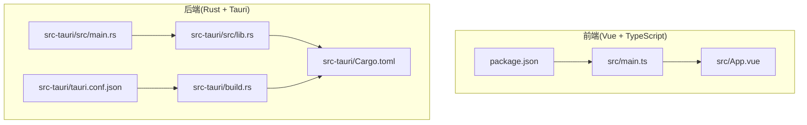
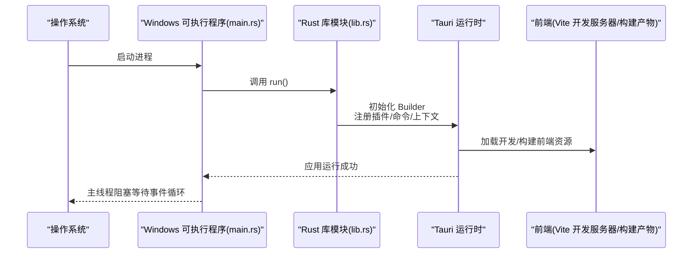
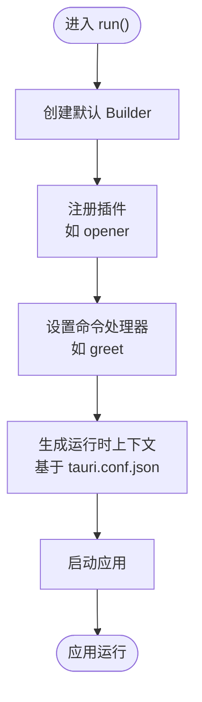
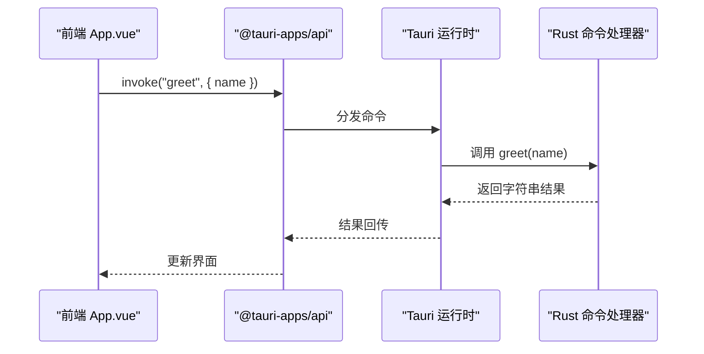
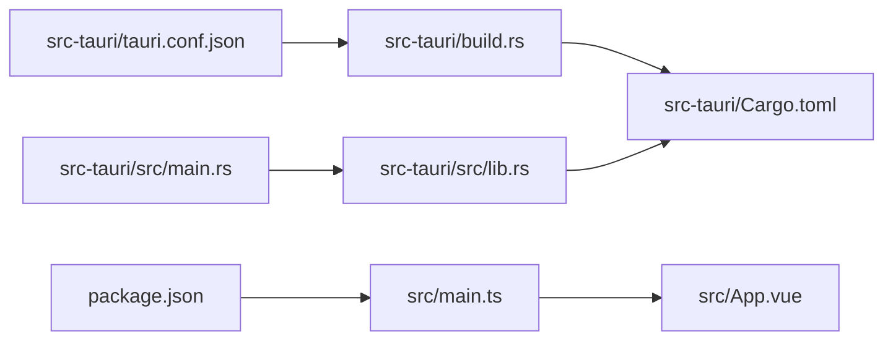

# Rust 应用入口点

<cite>
**本文档引用的文件**
- [src-tauri/src/main.rs](file://src-tauri/src/main.rs)
- [src-tauri/src/lib.rs](file://src-tauri/src/lib.rs)
- [src-tauri/Cargo.toml](file://src-tauri/Cargo.toml)
- [src-tauri/tauri.conf.json](file://src-tauri/tauri.conf.json)
- [src-tauri/build.rs](file://src-tauri/build.rs)
- [package.json](file://package.json)
- [src/App.vue](file://src/App.vue)
- [src/main.ts](file://src/main.ts)
</cite>

## 目录
1. [简介](#简介)
2. [项目结构](#项目结构)
3. [核心组件](#核心组件)
4. [架构总览](#架构总览)
5. [详细组件分析](#详细组件分析)
6. [依赖关系分析](#依赖关系分析)
7. [性能考量](#性能考量)
8. [故障排除指南](#故障排除指南)
9. [结论](#结论)
10. [附录](#附录)

## 简介
本文件聚焦于 Rust 应用入口点的开发与最佳实践，围绕 Tauri 2 应用的主程序入口进行系统化说明。重点涵盖：
- 入口文件 main.rs 的启动流程与 windows_subsystem 配置的作用及平台兼容性
- tauri_app_lib::run() 函数的调用机制与库模块组织结构
- 调试与发布模式差异、应用程序生命周期管理（初始化顺序、资源分配与清理）
- 与 Tauri 运行时的集成方式、启动参数处理方法
- 实际可操作的扩展示例路径，帮助开发者在不破坏现有结构的前提下添加自定义初始化逻辑

## 项目结构
该工程采用前端（Vue + TypeScript）与后端（Rust + Tauri）分离的混合架构。入口点位于 Tauri 工程目录 src-tauri 中，通过 Cargo 构建系统管理 Rust 侧依赖与产物类型，前端通过 Vite 打包并在开发/构建阶段由 Tauri 配置桥接。

图表来源
- [src-tauri/src/main.rs:1-7](file://src-tauri/src/main.rs#L1-L7)
- [src-tauri/src/lib.rs:1-15](file://src-tauri/src/lib.rs#L1-L15)
- [src-tauri/Cargo.toml:1-26](file://src-tauri/Cargo.toml#L1-L26)
- [src-tauri/tauri.conf.json:1-36](file://src-tauri/tauri.conf.json#L1-L36)
- [src-tauri/build.rs:1-4](file://src-tauri/build.rs#L1-L4)
- [package.json:1-25](file://package.json#L1-L25)
- [src/main.ts:1-5](file://src/main.ts#L1-L5)
- [src/App.vue:1-160](file://src/App.vue#L1-L160)

章节来源
- [src-tauri/src/main.rs:1-7](file://src-tauri/src/main.rs#L1-L7)
- [src-tauri/src/lib.rs:1-15](file://src-tauri/src/lib.rs#L1-L15)
- [src-tauri/Cargo.toml:1-26](file://src-tauri/Cargo.toml#L1-L26)
- [src-tauri/tauri.conf.json:1-36](file://src-tauri/tauri.conf.json#L1-L36)
- [src-tauri/build.rs:1-4](file://src-tauri/build.rs#L1-L4)
- [package.json:1-25](file://package.json#L1-L25)
- [src/main.ts:1-5](file://src/main.ts#L1-L5)
- [src/App.vue:1-160](file://src/App.vue#L1-L160)

## 核心组件
- 入口函数 main：负责调用库模块中的 run 函数，启动 Tauri 应用。
- 库模块 lib：封装 Tauri Builder、插件注册、命令处理器与上下文生成，统一对外暴露 run 函数。
- 构建配置 Cargo.toml：定义库产物类型（静态库、动态库、rlib），声明依赖与构建依赖。
- Tauri 配置 tauri.conf.json：定义产品信息、窗口属性、安全策略、打包图标等。
- 构建脚本 build.rs：委托 tauri_build 完成运行时代码生成与资源嵌入。
- 前端入口 main.ts 与 App.vue：在开发/预览阶段由 Vite 提供前端服务，Tauri 在运行时加载前端资源。

章节来源
- [src-tauri/src/main.rs:4-6](file://src-tauri/src/main.rs#L4-L6)
- [src-tauri/src/lib.rs:7-14](file://src-tauri/src/lib.rs#L7-L14)
- [src-tauri/Cargo.toml:10-25](file://src-tauri/Cargo.toml#L10-L25)
- [src-tauri/tauri.conf.json:1-36](file://src-tauri/tauri.conf.json#L1-L36)
- [src-tauri/build.rs:1-4](file://src-tauri/build.rs#L1-L4)
- [src/main.ts:1-5](file://src/main.ts#L1-L5)
- [src/App.vue:1-160](file://src/App.vue#L1-L160)

## 架构总览
下图展示了从入口到运行时的整体调用链路，以及与前端的集成方式。

图表来源
- [src-tauri/src/main.rs:4-6](file://src-tauri/src/main.rs#L4-L6)
- [src-tauri/src/lib.rs:7-14](file://src-tauri/src/lib.rs#L7-L14)
- [src-tauri/tauri.conf.json:6-11](file://src-tauri/tauri.conf.json#L6-L11)
- [package.json:6-11](file://package.json#L6-L11)

## 详细组件分析

### 入口点 main.rs 分析
- windows_subsystem 配置
  - 作用：在非调试构建（release）下，将 Windows 控制台隐藏，避免出现额外控制台窗口，提升用户体验。
  - 平台兼容性：仅在 Windows 上生效；其他平台无影响。
  - 条件编译：通过 cfg_attr 与 not(debug_assertions) 组合实现按构建模式切换。
- main 函数职责
  - 作为程序入口，直接调用库模块导出的 run 函数，完成应用初始化与启动。

章节来源
- [src-tauri/src/main.rs:1-2](file://src-tauri/src/main.rs#L1-L2)
- [src-tauri/src/main.rs:4-6](file://src-tauri/src/main.rs#L4-L6)

### 库模块 lib.rs 分析
- 函数签名与导出
  - 使用 #[cfg_attr(mobile, tauri::mobile_entry_point)] 标注，支持移动端入口点条件编译。
  - 对外暴露 pub fn run()，作为统一的启动接口。
- 运行时初始化流程
  - 创建默认 Builder。
  - 注册插件：如 tauri-plugin-opener。
  - 设置命令处理器：通过 generate_handler! 注册 greet 命令。
  - 生成上下文：通过 generate_context! 读取 tauri.conf.json 并注入运行时。
  - 启动应用：调用 run() 并在失败时抛出错误。
- 命令定义
  - greet 命令用于演示前后端通信，返回拼接后的字符串消息。

图表来源
- [src-tauri/src/lib.rs:7-14](file://src-tauri/src/lib.rs#L7-L14)

章节来源
- [src-tauri/src/lib.rs:1-15](file://src-tauri/src/lib.rs#L1-L15)

### 构建与产物类型
- 库名称与类型
  - 库名使用 tauri_app_lib，避免与二进制目标冲突。
  - crate-type 支持 staticlib、cdylib、rlib，便于跨平台与多场景集成。
- 构建依赖
  - tauri-build：在构建时生成运行时代码与资源嵌入。
- 依赖项
  - tauri、tauri-plugin-opener、serde、serde_json 等。

章节来源
- [src-tauri/Cargo.toml:10-25](file://src-tauri/Cargo.toml#L10-L25)
- [src-tauri/build.rs:1-4](file://src-tauri/build.rs#L1-L4)

### Tauri 配置与前端集成
- 产品与版本信息
  - productName、version、identifier 等字段用于打包与标识。
- 开发与构建流程
  - beforeDevCommand 指向前端开发服务器，devUrl 指定前端地址。
  - beforeBuildCommand 指向前端构建脚本，frontendDist 指向构建输出目录。
- 窗口与安全
  - app.windows 定义窗口标题、尺寸等。
  - security.csp 设为 null，表示未启用 CSP。
- 打包与图标
  - bundle.targets 为 all，表示打包所有可用目标。
  - icon 列表包含多分辨率图标，适配不同平台。

章节来源
- [src-tauri/tauri.conf.json:1-36](file://src-tauri/tauri.conf.json#L1-L36)
- [package.json:6-11](file://package.json#L6-L11)

### 前端入口与调用链
- 前端入口 main.ts
  - 创建 Vue 应用并挂载到 #app。
- 前端组件 App.vue
  - 通过 @tauri-apps/api 的 invoke 调用 Rust 命令 greet。
- 调用链
  - 前端发起 invoke(greet, payload)。
  - Tauri 运行时根据命令名分发至 Rust 命令处理器。
  - Rust 处理器执行 greet 并返回结果，前端更新视图。

图表来源
- [src/App.vue:1-160](file://src/App.vue#L1-L160)
- [src-tauri/src/lib.rs:2-5](file://src-tauri/src/lib.rs#L2-L5)

章节来源
- [src/main.ts:1-5](file://src/main.ts#L1-L5)
- [src/App.vue:1-160](file://src/App.vue#L1-L160)

## 依赖关系分析
- 入口与库模块
  - main.rs 仅负责调用 lib.rs::run，保持入口极简，职责清晰。
- 构建与运行时
  - build.rs 委托 tauri_build 完成运行时生成。
  - Cargo.toml 决定产物类型与依赖，影响运行时链接与打包。
- 前后端耦合
  - 前端通过 @tauri-apps/api 与 Rust 命令交互，配置由 tauri.conf.json 统一管理。

图表来源
- [src-tauri/src/main.rs:4-6](file://src-tauri/src/main.rs#L4-L6)
- [src-tauri/src/lib.rs:7-14](file://src-tauri/src/lib.rs#L7-L14)
- [src-tauri/build.rs:1-4](file://src-tauri/build.rs#L1-L4)
- [src-tauri/Cargo.toml:10-25](file://src-tauri/Cargo.toml#L10-L25)
- [src-tauri/tauri.conf.json:1-36](file://src-tauri/tauri.conf.json#L1-L36)
- [package.json:1-25](file://package.json#L1-L25)
- [src/main.ts:1-5](file://src/main.ts#L1-L5)
- [src/App.vue:1-160](file://src/App.vue#L1-L160)

章节来源
- [src-tauri/src/main.rs:4-6](file://src-tauri/src/main.rs#L4-L6)
- [src-tauri/src/lib.rs:7-14](file://src-tauri/src/lib.rs#L7-L14)
- [src-tauri/build.rs:1-4](file://src-tauri/build.rs#L1-L4)
- [src-tauri/Cargo.toml:10-25](file://src-tauri/Cargo.toml#L10-L25)
- [src-tauri/tauri.conf.json:1-36](file://src-tauri/tauri.conf.json#L1-L36)
- [package.json:1-25](file://package.json#L1-L25)
- [src/main.ts:1-5](file://src/main.ts#L1-L5)
- [src/App.vue:1-160](file://src/App.vue#L1-L160)

## 性能考量
- 启动时间优化
  - 将重型初始化逻辑移至后台任务或延迟初始化，避免阻塞主线程。
  - 插件注册应按需加载，减少不必要的开销。
- 资源管理
  - 在 run() 中集中初始化资源，确保异常时能正确释放。
  - 前端与后端之间的数据传输尽量轻量化，避免频繁大对象传递。
- 平台差异
  - Windows 发布模式隐藏控制台窗口，减少用户感知的“黑屏”时间。
  - 移动端入口点条件编译确保在不同平台下的正确行为。

## 故障排除指南
- 应用无法启动
  - 检查 tauri.conf.json 的 build 字段是否指向正确的前端开发/构建命令与目录。
  - 确认前端开发服务器已启动且可访问 devUrl。
- 命令调用失败
  - 确认命令名称一致（invoke 参数与 #[tauri::command] 名称匹配）。
  - 检查命令处理器是否在 run() 中正确注册。
- 插件问题
  - 确认插件版本与 Tauri 版本兼容，并在 Cargo.toml 中声明。
- 构建失败
  - 检查 tauri-build 是否正常生成运行时代码。
  - 确保库产物类型与目标平台匹配。

章节来源
- [src-tauri/tauri.conf.json:6-11](file://src-tauri/tauri.conf.json#L6-L11)
- [src-tauri/src/lib.rs:7-14](file://src-tauri/src/lib.rs#L7-L14)
- [src-tauri/Cargo.toml:20-25](file://src-tauri/Cargo.toml#L20-L25)
- [src-tauri/build.rs:1-4](file://src-tauri/build.rs#L1-L4)

## 结论
本入口点设计遵循“极简入口 + 统一启动”的原则：入口仅负责调用库模块 run()，而 lib.rs 负责完整的运行时初始化与上下文生成。通过 windows_subsystem 配置与构建产物类型选择，兼顾了平台兼容性与性能。结合 Tauri 配置与前端集成，形成清晰的前后端协作链路。建议在扩展时遵循现有模式，在 run() 中集中初始化与注册，避免分散在多处导致维护困难。

## 附录

### 调试与发布模式最佳实践
- 调试模式
  - 保留控制台窗口，便于日志输出与问题定位。
  - 前端开发服务器通过 devUrl 提供热更新能力。
- 发布模式
  - 隐藏控制台窗口，避免用户看到多余控制台。
  - 前端构建产物由 tauri.conf.json 的 frontendDist 指定，确保运行时正确加载。

章节来源
- [src-tauri/src/main.rs:1-2](file://src-tauri/src/main.rs#L1-L2)
- [src-tauri/tauri.conf.json:6-11](file://src-tauri/tauri.conf.json#L6-L11)

### 应用程序生命周期管理
- 初始化顺序
  - 入口 -> Builder -> 插件 -> 命令 -> 上下文 -> 启动。
- 资源分配
  - 在 run() 中一次性完成，避免重复初始化。
- 清理机制
  - 通过 Tauri 运行时的生命周期钩子（如窗口关闭事件）进行资源回收，避免内存泄漏。

章节来源
- [src-tauri/src/lib.rs:7-14](file://src-tauri/src/lib.rs#L7-L14)

### 扩展入口点的示例路径
以下为可参考的扩展步骤（请在对应文件中实现具体逻辑）：
- 添加自定义初始化逻辑
  - 在 lib.rs 的 run() 中添加初始化步骤，例如数据库连接、全局配置加载。
  - 示例路径：[src-tauri/src/lib.rs:7-14](file://src-tauri/src/lib.rs#L7-L14)
- 注册更多命令
  - 在 lib.rs 中通过 generate_handler! 注册新命令。
  - 示例路径：[src-tauri/src/lib.rs:2-5](file://src-tauri/src/lib.rs#L2-L5)
- 集成更多插件
  - 在 lib.rs 的 Builder 中添加插件初始化。
  - 示例路径：[src-tauri/src/lib.rs:10](file://src-tauri/src/lib.rs#L10)
- 自定义启动参数处理
  - 通过 generate_context! 获取运行时上下文，解析自定义参数。
  - 示例路径：[src-tauri/src/lib.rs:12](file://src-tauri/src/lib.rs#L12)
- 前端调用扩展命令
  - 在 App.vue 中通过 invoke 调用新增命令。
  - 示例路径：[src/App.vue:8-11](file://src/App.vue#L8-L11)