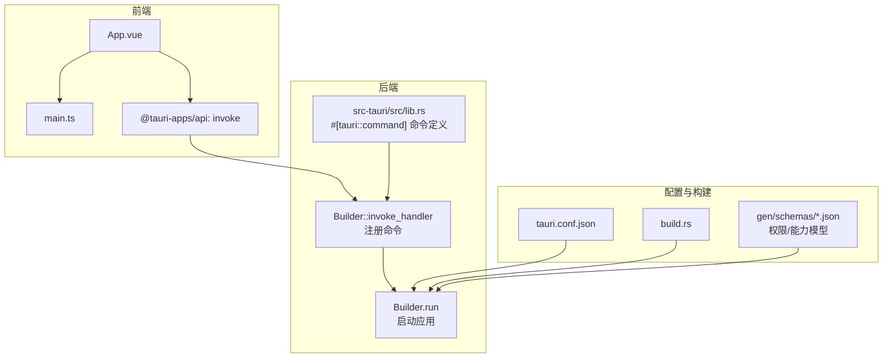
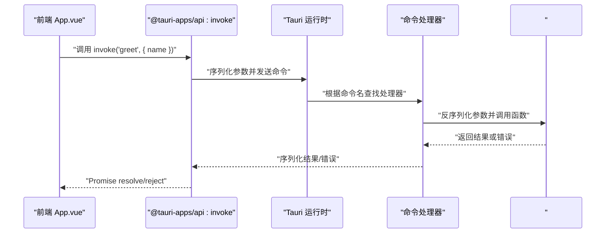
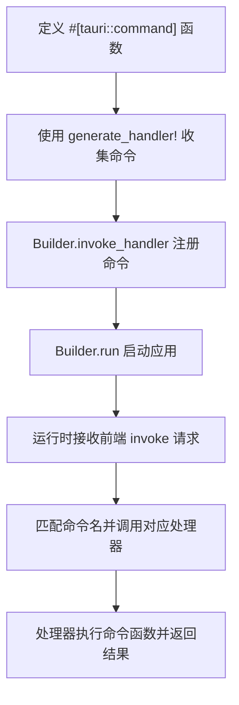
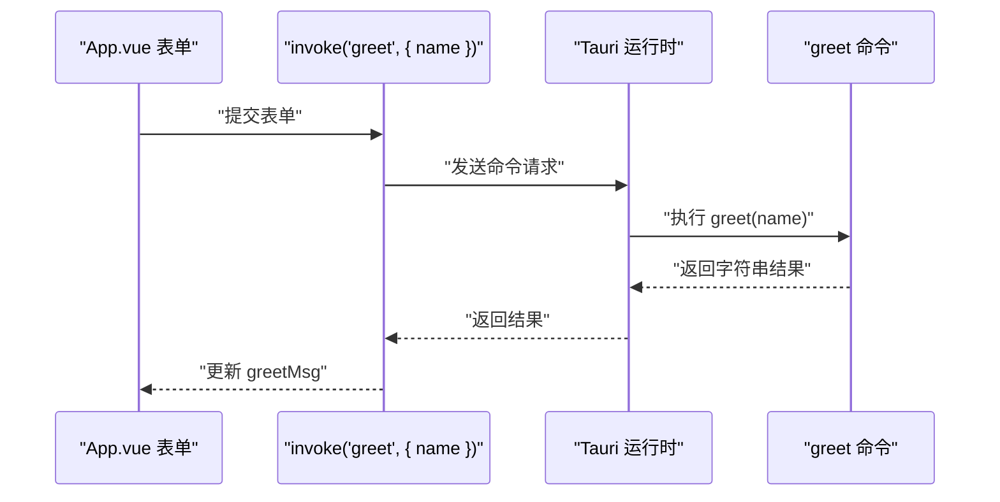
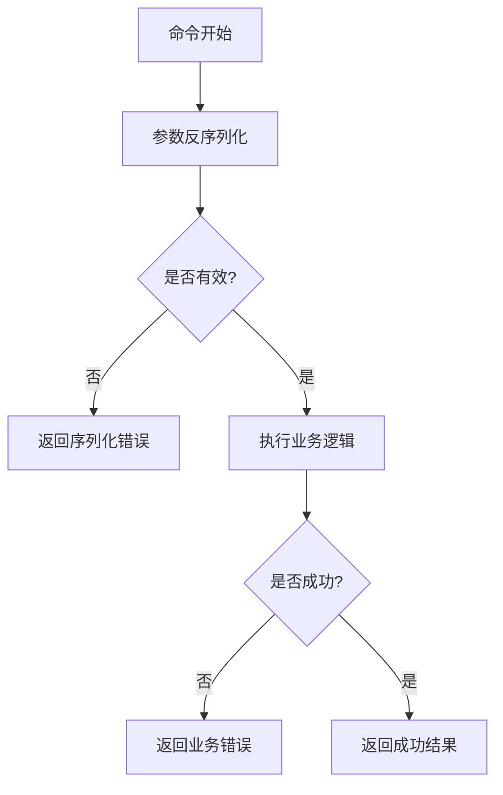
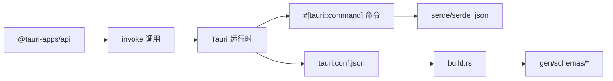

# Tauri 命令系统

<cite>
**本文引用的文件**
- [Cargo.toml](file://src-tauri/Cargo.toml)
- [lib.rs](file://src-tauri/src/lib.rs)
- [main.rs](file://src-tauri/src/main.rs)
- [App.vue](file://src/App.vue)
- [main.ts](file://src/main.ts)
- [tauri.conf.json](file://src-tauri/tauri.conf.json)
- [build.rs](file://src-tauri/build.rs)
- [windows-schema.json](file://src-tauri/gen/schemas/desktop-schema.json)
- [desktop-schema.json](file://src-tauri/gen/schemas/windows-schema.json)
</cite>

## 目录
1. [简介](#简介)
2. [项目结构](#项目结构)
3. [核心组件](#核心组件)
4. [架构总览](#架构总览)
5. [详细组件分析](#详细组件分析)
6. [依赖关系分析](#依赖关系分析)
7. [性能考虑](#性能考虑)
8. [故障排查指南](#故障排查指南)
9. [结论](#结论)
10. [附录](#附录)

## 简介
本文件面向希望深入理解并正确使用 Tauri 命令系统的开发者，围绕 #[tauri::command] 宏展开，系统讲解命令注册机制、函数签名与参数类型约束、同步与异步实现模式、Serde 在序列化/反序列化中的作用、前端 invoke 调用与 Promise 处理、错误传播策略、性能优化与最佳实践。本文以仓库中最小可运行示例为基础，结合生成的权限与能力模型，帮助读者建立从“定义命令”到“前端调用”的完整知识闭环。

## 项目结构
该示例采用典型的 Tauri 2 前后端分离结构：
- 前端：Vite + Vue（TypeScript），通过 @tauri-apps/api 的 invoke 发起命令调用。
- 后端：Rust 库 crate，暴露 #[tauri::command] 宏定义的命令，并在应用启动时注册到 Tauri 运行时。
- 配置：tauri.conf.json 提供应用元信息、构建脚本、窗口与安全策略等；build.rs 用于触发 tauri-build；生成的 schemas 文件用于权限与能力模型。

**图表来源**
- [lib.rs:1-15](file://src-tauri/src/lib.rs#L1-L15)
- [main.rs:1-7](file://src-tauri/src/main.rs#L1-L7)
- [App.vue:1-160](file://src/App.vue#L1-L160)
- [tauri.conf.json:1-36](file://src-tauri/tauri.conf.json#L1-L36)
- [build.rs:1-4](file://src-tauri/build.rs#L1-L4)
- [desktop-schema.json:481-509](file://src-tauri/gen/schemas/desktop-schema.json#L481-L509)
- [windows-schema.json:481-509](file://src-tauri/gen/schemas/windows-schema.json#L481-L509)

**章节来源**
- [lib.rs:1-15](file://src-tauri/src/lib.rs#L1-L15)
- [main.rs:1-7](file://src-tauri/src/main.rs#L1-L7)
- [App.vue:1-160](file://src/App.vue#L1-L160)
- [tauri.conf.json:1-36](file://src-tauri/tauri.conf.json#L1-L36)
- [build.rs:1-4](file://src-tauri/build.rs#L1-L4)
- [desktop-schema.json:481-509](file://src-tauri/gen/schemas/desktop-schema.json#L481-L509)
- [windows-schema.json:481-509](file://src-tauri/gen/schemas/windows-schema.json#L481-L509)

## 核心组件
- #[tauri::command] 宏：用于标记 Rust 函数为可被前端调用的命令，自动注入序列化/反序列化与运行时分发逻辑。
- Builder.invoke_handler：将已标注的命令注册到 Tauri 运行时，形成命令表。
- @tauri-apps/api 的 invoke：前端发起命令调用，返回 Promise，支持成功与失败回调。
- 生成的权限/能力模型：基于命令生成的权限条目，控制命令访问范围（如 core:app:deny-register-listener）。

**章节来源**
- [lib.rs:1-15](file://src-tauri/src/lib.rs#L1-L15)
- [App.vue:1-160](file://src/App.vue#L1-L160)
- [desktop-schema.json:481-509](file://src-tauri/gen/schemas/desktop-schema.json#L481-L509)
- [windows-schema.json:481-509](file://src-tauri/gen/schemas/windows-schema.json#L481-L509)

## 架构总览
下图展示了从前端发起命令调用到后端执行再到返回结果的整体流程，以及命令注册与权限模型的关系。

**图表来源**
- [App.vue:8-11](file://src/App.vue#L8-L11)
- [lib.rs:1-15](file://src-tauri/src/lib.rs#L1-L15)

## 详细组件分析

### #[tauri::command] 宏与命令注册
- 宏的作用：将函数标记为命令，自动生成参数/返回值的序列化/反序列化桥接代码，并将其注册到运行时。
- 注册方式：通过 Builder.invoke_handler 将命令集合注入运行时，随后由 Builder.run 启动应用。
- 入口函数：run 中完成插件初始化、命令注册与应用启动。

**图表来源**
- [lib.rs:7-14](file://src-tauri/src/lib.rs#L7-L14)

**章节来源**
- [lib.rs:1-15](file://src-tauri/src/lib.rs#L1-L15)

### 命令函数签名与参数类型限制
- 函数签名要求：命令函数必须是纯函数或可安全在线程间传递的函数；参数与返回值需可由 serde_json 序列化/反序列化。
- 参数类型：推荐使用实现了 serde 反序列化的类型；避免传递不可序列化的引用或生命周期敏感对象。
- 返回值：返回值需可序列化为 JSON；错误类型通常包装为统一的错误类型以便跨边界传播。

**章节来源**
- [Cargo.toml:20-25](file://src-tauri/Cargo.toml#L20-L25)

### 同步与异步命令实现
- 同步命令：适合快速、无阻塞的计算；直接返回结果。
- 异步命令：适合 I/O 或耗时任务；返回 Future/JoinHandle 等异步句柄，运行时会等待其完成再序列化返回。
- 实现模式：在 #[tauri::command] 函数体内使用 async/await 或线程池执行长任务，确保不阻塞主线程。

**章节来源**
- [lib.rs:1-15](file://src-tauri/src/lib.rs#L1-L15)

### Serde 在命令参数序列化/反序列化中的作用
- 参数反序列化：前端传入的 JSON 对象经 serde_json 解码为 Rust 结构体/枚举。
- 返回值序列化：命令函数返回值经 serde_json 编码后回传给前端。
- 复杂数据结构：通过 derive 特性自动生成序列化/反序列化实现，便于嵌套结构、可选字段与枚举的处理。

**章节来源**
- [Cargo.toml:20-25](file://src-tauri/Cargo.toml#L20-L25)

### 前端 invoke 使用与 Promise 处理
- 调用方式：前端通过 @tauri-apps/api 的 invoke 发起命令，传入命令名与参数对象。
- Promise 处理：invoke 返回 Promise，成功解析为命令返回值，失败抛出错误对象。
- 示例流程：用户输入名称，点击按钮触发 greet，前端调用 invoke 并更新界面状态。

**图表来源**
- [App.vue:8-11](file://src/App.vue#L8-L11)
- [lib.rs:2-5](file://src-tauri/src/lib.rs#L2-L5)

**章节来源**
- [App.vue:1-160](file://src/App.vue#L1-L160)

### 错误处理策略与异常传播
- 统一错误类型：建议命令函数返回 Result<T, E>，其中 E 实现 serde 可序列化，便于跨边界传播。
- 权限控制：生成的权限模型包含 deny-* 命令项，可通过能力配置启用/拒绝特定命令，避免未授权访问。
- 模式参考：desktop-schema.json 与 windows-schema.json 展示了自动生成的权限常量，例如 core:app:deny-register-listener。

**图表来源**
- [lib.rs:1-15](file://src-tauri/src/lib.rs#L1-L15)
- [desktop-schema.json:481-509](file://src-tauri/gen/schemas/desktop-schema.json#L481-L509)
- [windows-schema.json:481-509](file://src-tauri/gen/schemas/windows-schema.json#L481-L509)

**章节来源**
- [desktop-schema.json:481-509](file://src-tauri/gen/schemas/desktop-schema.json#L481-L509)
- [windows-schema.json:481-509](file://src-tauri/gen/schemas/windows-schema.json#L481-L509)

### 完整命令定义示例（路径指引）
以下为从定义到调用的完整流程路径指引（不直接展示代码内容）：
- 定义命令：在 [lib.rs:2-5](file://src-tauri/src/lib.rs#L2-L5) 中使用 #[tauri::command] 标记 greet 函数。
- 注册命令：在 [lib.rs](file://src-tauri/src/lib.rs#L11) 中通过 generate_handler! 收集命令并交由 invoke_handler 注册。
- 启动应用：在 [lib.rs:8-14](file://src-tauri/src/lib.rs#L8-L14) 中调用 Builder.run。
- 前端调用：在 [App.vue:8-11](file://src/App.vue#L8-L11) 中通过 invoke('greet', { name }) 发起调用。
- 构建与配置：在 [build.rs:1-4](file://src-tauri/build.rs#L1-L4) 中触发 tauri_build；在 [tauri.conf.json:1-36](file://src-tauri/tauri.conf.json#L1-L36) 中配置开发/打包流程。

**章节来源**
- [lib.rs:1-15](file://src-tauri/src/lib.rs#L1-L15)
- [App.vue:1-160](file://src/App.vue#L1-L160)
- [build.rs:1-4](file://src-tauri/build.rs#L1-L4)
- [tauri.conf.json:1-36](file://src-tauri/tauri.conf.json#L1-L36)

## 依赖关系分析
- Rust 依赖：tauri、serde、serde_json 由 Cargo.toml 声明；tauri-build 作为构建依赖参与生成过程。
- 前端依赖：通过 @tauri-apps/api 提供 invoke 能力。
- 生成物：build.rs 触发 tauri_build，生成权限与能力模型（gen/schemas）。

**图表来源**
- [Cargo.toml:20-25](file://src-tauri/Cargo.toml#L20-L25)
- [App.vue:1-160](file://src/App.vue#L1-L160)
- [lib.rs:1-15](file://src-tauri/src/lib.rs#L1-L15)
- [tauri.conf.json:1-36](file://src-tauri/tauri.conf.json#L1-L36)
- [build.rs:1-4](file://src-tauri/build.rs#L1-L4)
- [desktop-schema.json:481-509](file://src-tauri/gen/schemas/desktop-schema.json#L481-L509)

**章节来源**
- [Cargo.toml:1-26](file://src-tauri/Cargo.toml#L1-L26)
- [App.vue:1-160](file://src/App.vue#L1-L160)
- [lib.rs:1-15](file://src-tauri/src/lib.rs#L1-L15)
- [tauri.conf.json:1-36](file://src-tauri/tauri.conf.json#L1-L36)
- [build.rs:1-4](file://src-tauri/build.rs#L1-L4)
- [desktop-schema.json:481-509](file://src-tauri/gen/schemas/desktop-schema.json#L481-L509)

## 性能考虑
- 避免阻塞：命令函数应尽量非阻塞；若涉及 I/O 或 CPU 密集任务，使用异步或线程池，防止阻塞事件循环。
- 参数大小：尽量控制参数与返回值体积，减少序列化/反序列化开销。
- 批处理：对频繁调用的小任务，考虑合并为单次调用，降低 IPC 次数。
- 缓存：对重复计算的结果进行缓存，减少不必要的重复工作。
- 类型选择：优先使用轻量、可序列化的数据类型，避免复杂嵌套导致的编解码成本。

## 故障排查指南
- 命令未注册：确认命令已在 run 中通过 invoke_handler 注册。
- 参数类型不匹配：检查参数是否实现了 serde 反序列化；必要时添加 serde 注解或自定义反序列化逻辑。
- 前端调用失败：确认命令名一致且参数对象结构正确；查看 Promise reject 的错误信息。
- 权限问题：若出现 core:app:deny-* 相关错误，检查能力配置与权限策略，确保命令被允许。
- 构建问题：确认 build.rs 已正确触发 tauri_build，生成的 schemas 文件存在且最新。

**章节来源**
- [lib.rs:1-15](file://src-tauri/src/lib.rs#L1-L15)
- [App.vue:1-160](file://src/App.vue#L1-L160)
- [desktop-schema.json:481-509](file://src-tauri/gen/schemas/desktop-schema.json#L481-L509)
- [windows-schema.json:481-509](file://src-tauri/gen/schemas/windows-schema.json#L481-L509)
- [build.rs:1-4](file://src-tauri/build.rs#L1-L4)

## 结论
Tauri 的命令系统通过 #[tauri::command] 宏与 Builder.invoke_handler 将 Rust 命令无缝集成到前端调用链路中，配合 serde 的序列化/反序列化与生成的权限/能力模型，提供了简洁、安全且高性能的跨语言通信方案。遵循本文的签名规范、异步实现模式、错误处理策略与性能建议，可帮助你在实际项目中稳定地构建命令驱动的功能模块。

## 附录
- 命令定义与注册路径：见 [lib.rs:1-15](file://src-tauri/src/lib.rs#L1-L15)
- 前端调用路径：见 [App.vue:1-160](file://src/App.vue#L1-L160)
- 构建与配置路径：见 [build.rs:1-4](file://src-tauri/build.rs#L1-L4)、[tauri.conf.json:1-36](file://src-tauri/tauri.conf.json#L1-L36)
- 权限与能力模型：见 [desktop-schema.json:481-509](file://src-tauri/gen/schemas/desktop-schema.json#L481-L509)、[windows-schema.json:481-509](file://src-tauri/gen/schemas/windows-schema.json#L481-L509)