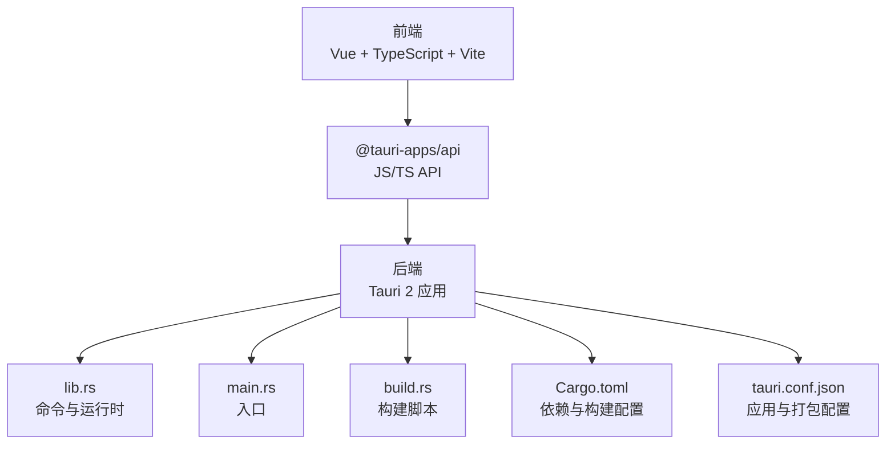
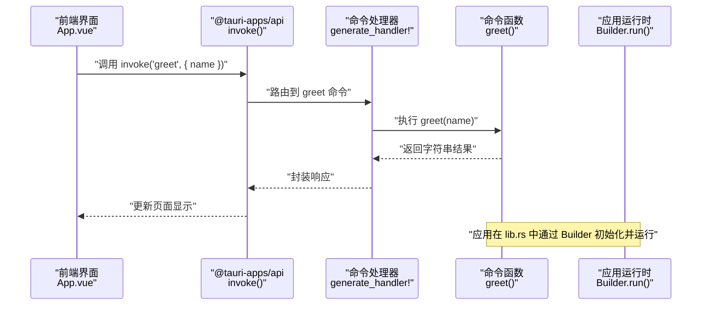
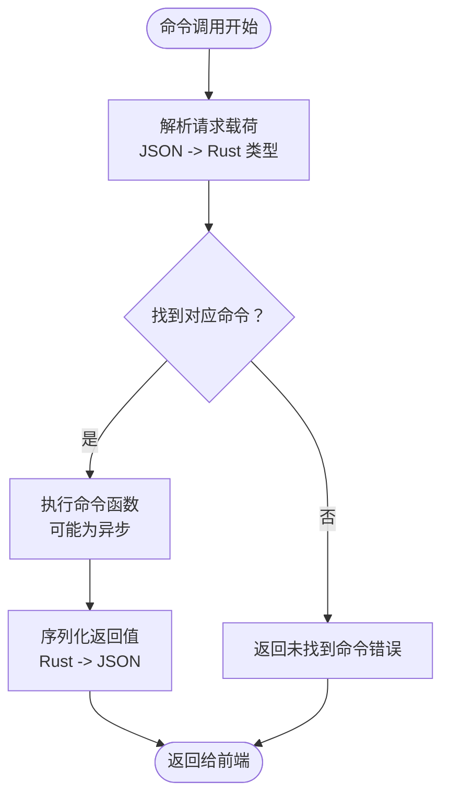
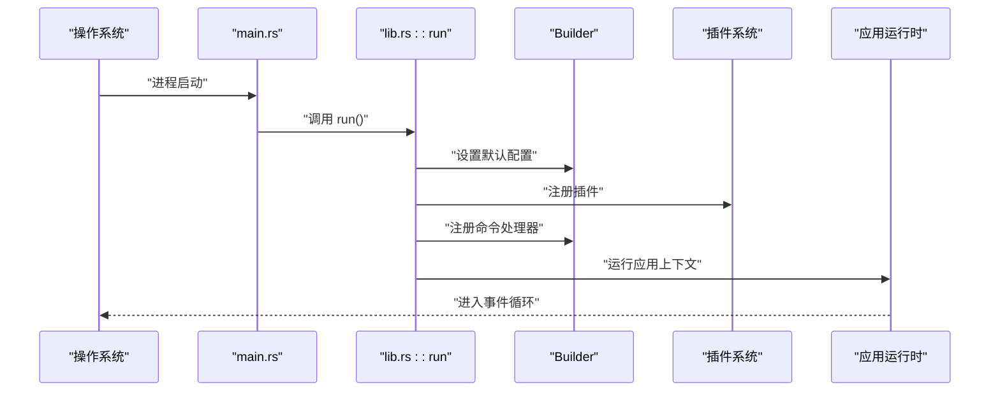
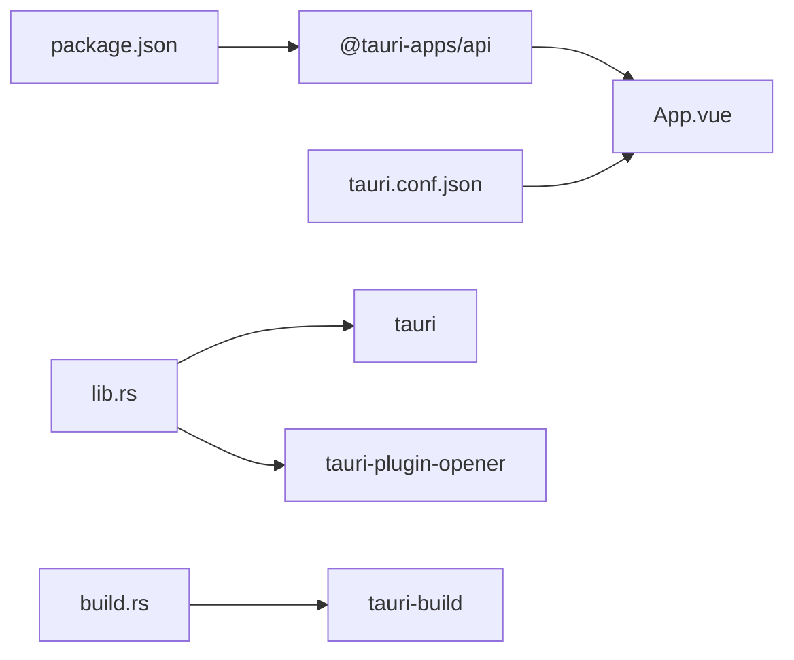

# 后端开发

<cite>
**本文引用的文件**
- [Cargo.toml](file://src-tauri/Cargo.toml)
- [Cargo.lock](file://src-tauri/Cargo.lock)
- [build.rs](file://src-tauri/build.rs)
- [main.rs](file://src-tauri/src/main.rs)
- [lib.rs](file://src-tauri/src/lib.rs)
- [tauri.conf.json](file://src-tauri/tauri.conf.json)
- [package.json](file://package.json)
- [App.vue](file://src/App.vue)
- [README.md](file://README.md)
</cite>

## 目录
1. [简介](#简介)
2. [项目结构](#项目结构)
3. [核心组件](#核心组件)
4. [架构总览](#架构总览)
5. [详细组件分析](#详细组件分析)
6. [依赖关系分析](#依赖关系分析)
7. [性能考虑](#性能考虑)
8. [故障排查指南](#故障排查指南)
9. [结论](#结论)
10. [附录](#附录)

## 简介
本文件面向 Rust 后端开发者，系统性讲解基于 Tauri 2 的应用后端实现与集成要点，重点覆盖以下主题：
- Tauri 命令系统：#[tauri::command] 宏的使用、命令注册机制与调用流程
- 应用入口与初始化：main.rs 的最小入口、lib.rs 的运行时构建与插件注册
- 序列化与反序列化：Serde 在参数与返回值上的作用与最佳实践
- 依赖管理：Cargo.toml 的核心库、插件与构建依赖配置
- 构建脚本：build.rs 的职责与自定义构建逻辑
- 错误处理、日志与调试：常见策略与实用技巧
- 实战示例：异步操作、文件系统访问与系统集成功能的实现思路
- 类型系统优势：在 Tauri 应用中的类型安全与编译期保障

## 项目结构
该仓库采用“前端 + Tauri 后端”的分层组织方式：
- 前端位于 src 与 public，使用 Vue 3 + TypeScript + Vite
- 后端位于 src-tauri，使用 Rust + Tauri 2
- 通过 @tauri-apps/api 与 @tauri-apps/cli 进行前后端通信与打包

图表来源
- [main.rs:1-7](file://src-tauri/src/main.rs#L1-L7)
- [lib.rs:1-15](file://src-tauri/src/lib.rs#L1-L15)
- [build.rs:1-4](file://src-tauri/build.rs#L1-L4)
- [Cargo.toml:1-26](file://src-tauri/Cargo.toml#L1-L26)
- [tauri.conf.json:1-36](file://src-tauri/tauri.conf.json#L1-L36)

章节来源
- [main.rs:1-7](file://src-tauri/src/main.rs#L1-L7)
- [lib.rs:1-15](file://src-tauri/src/lib.rs#L1-L15)
- [build.rs:1-4](file://src-tauri/build.rs#L1-L4)
- [Cargo.toml:1-26](file://src-tauri/Cargo.toml#L1-L26)
- [tauri.conf.json:1-36](file://src-tauri/tauri.conf.json#L1-L36)
- [package.json:1-25](file://package.json#L1-L25)

## 核心组件
- 入口与运行时
  - main.rs：最小入口，调用 lib.rs 中的 run 函数启动应用
  - lib.rs：定义命令函数 greet，使用 #[tauri::command] 宏；通过 Builder 配置插件与命令处理器，最终运行应用上下文
- 命令系统
  - greet 命令：接收字符串参数，返回字符串结果，由前端通过 invoke 调用
- 构建与配置
  - build.rs：委托 tauri_build::build 执行构建期生成
  - Cargo.toml：声明核心库、插件与构建依赖
  - tauri.conf.json：应用名称、窗口、安全策略、打包图标等配置
  - package.json：前端脚本与依赖，包含 @tauri-apps/api 与 @tauri-apps/plugin-opener

章节来源
- [main.rs:1-7](file://src-tauri/src/main.rs#L1-L7)
- [lib.rs:1-15](file://src-tauri/src/lib.rs#L1-L15)
- [build.rs:1-4](file://src-tauri/build.rs#L1-L4)
- [Cargo.toml:1-26](file://src-tauri/Cargo.toml#L1-L26)
- [tauri.conf.json:1-36](file://src-tauri/tauri.conf.json#L1-L36)
- [package.json:1-25](file://package.json#L1-L25)

## 架构总览
下图展示了从前端到后端的调用链路与数据流：

图表来源
- [App.vue:1-160](file://src/App.vue#L1-L160)
- [lib.rs:1-15](file://src-tauri/src/lib.rs#L1-L15)
- [main.rs:1-7](file://src-tauri/src/main.rs#L1-L7)

## 详细组件分析

### 命令系统与 #[tauri::command] 宏
- 宏的作用
  - 将函数标记为可从前端调用的命令，自动完成参数解析与返回值序列化
  - 通过 generate_handler! 注册命令，使运行时能够路由到具体函数
- 参数与返回值
  - 支持实现了 serde 反序列化的参数类型
  - 返回值需可序列化为 JSON，以便跨语言传递
- 异步命令
  - 可直接声明为 async 函数，Tauri 会正确等待 Future 完成后再返回
- 复杂类型
  - 使用结构体或枚举作为参数/返回值时，确保它们标注了 serde derive 或手动实现序列化特性

图表来源
- [lib.rs:1-15](file://src-tauri/src/lib.rs#L1-L15)

章节来源
- [lib.rs:1-15](file://src-tauri/src/lib.rs#L1-L15)

### 应用入口与初始化（main.rs 与 lib.rs）
- main.rs
  - 仅一行调用 lib.rs::run，保持入口极简
- lib.rs::run
  - 使用 Builder 默认配置
  - 注册插件（如 tauri-plugin-opener）
  - 通过 generate_handler! 注册 greet 命令
  - 调用 generate_context! 生成上下文并运行应用

图表来源
- [main.rs:1-7](file://src-tauri/src/main.rs#L1-L7)
- [lib.rs:7-15](file://src-tauri/src/lib.rs#L7-L15)

章节来源
- [main.rs:1-7](file://src-tauri/src/main.rs#L1-L7)
- [lib.rs:7-15](file://src-tauri/src/lib.rs#L7-L15)

### 依赖管理（Cargo.toml）
- 核心库
  - tauri：框架核心
  - serde 与 serde_json：序列化/反序列化支持
- 插件
  - tauri-plugin-opener：系统打开器能力
- 构建依赖
  - tauri-build：构建期生成与校验
- crate 类型
  - lib.rs 暴露静态库、CDYLIB 与 rlib，便于前端绑定与打包

章节来源
- [Cargo.toml:1-26](file://src-tauri/Cargo.toml#L1-L26)
- [Cargo.lock:1-200](file://src-tauri/Cargo.lock#L1-L200)

### 构建脚本（build.rs）
- 作用
  - 在构建时调用 tauri_build::build，生成必要的运行时资源与能力清单
- 自定义逻辑
  - 可扩展以注入额外的构建步骤（如拷贝资源、生成 schema、条件编译）

章节来源
- [build.rs:1-4](file://src-tauri/build.rs#L1-L4)

### 前后端交互（前端调用后端命令）
- 前端通过 @tauri-apps/api 的 invoke 方法调用后端命令
- 命令名与参数需与后端注册一致
- 返回值自动反序列化为 JS 对象

章节来源
- [App.vue:1-160](file://src/App.vue#L1-L160)
- [package.json:1-25](file://package.json#L1-L25)

## 依赖关系分析
- 前端到后端
  - 前端脚本与依赖定义于 package.json
  - @tauri-apps/api 提供 invoke 等 API
- 后端到前端
  - tauri.conf.json 定义 devUrl、前端构建产物路径等
- 后端内部
  - lib.rs 依赖 tauri 与插件
  - build.rs 依赖 tauri-build

图表来源
- [package.json:1-25](file://package.json#L1-L25)
- [App.vue:1-160](file://src/App.vue#L1-L160)
- [tauri.conf.json:1-36](file://src-tauri/tauri.conf.json#L1-L36)
- [lib.rs:1-15](file://src-tauri/src/lib.rs#L1-L15)
- [build.rs:1-4](file://src-tauri/build.rs#L1-L4)

章节来源
- [package.json:1-25](file://package.json#L1-L25)
- [tauri.conf.json:1-36](file://src-tauri/tauri.conf.json#L1-L36)
- [lib.rs:1-15](file://src-tauri/src/lib.rs#L1-L15)
- [build.rs:1-4](file://src-tauri/build.rs#L1-L4)

## 性能考虑
- 命令函数尽量轻量，避免阻塞主线程
- 大对象序列化与反序列化成本较高，建议拆分命令或压缩数据
- 合理使用插件，按需启用能力，减少运行时开销
- 构建阶段利用 Cargo.lock 固定版本，保证可重复构建与缓存命中

## 故障排查指南
- 命令未找到
  - 检查命令是否通过 generate_handler! 正确注册
  - 确认命令名与前端调用一致
- 参数/返回值序列化失败
  - 确保类型实现 serde 的相应特性
  - 复杂类型需显式标注 derive 或手动实现
- 插件不生效
  - 确认插件已注册且具备所需权限
  - 检查 tauri.conf.json 的能力配置
- 构建失败
  - 清理构建缓存并重新安装依赖
  - 检查 tauri-build 版本与 Tauri 主版本兼容性
- 日志与调试
  - 使用终端输出与日志库进行定位
  - 在开发模式下结合浏览器开发者工具与 Tauri 开发者菜单

章节来源
- [lib.rs:1-15](file://src-tauri/src/lib.rs#L1-L15)
- [tauri.conf.json:1-36](file://src-tauri/tauri.conf.json#L1-L36)
- [README.md:1-17](file://README.md#L1-L17)

## 结论
本项目以极简入口与清晰职责划分展示了 Tauri 2 的后端实现范式：命令通过 #[tauri::command] 宏暴露，借助 Serde 完成类型安全的序列化/反序列化，配合插件系统与构建脚本实现完整的桌面应用能力。遵循本文的依赖管理、错误处理与调试策略，可快速扩展出稳定高效的后端服务。

## 附录
- 实战建议
  - 异步命令：将耗时任务放入 async 函数，避免阻塞 UI
  - 文件系统：通过插件或系统 API 访问，注意权限与路径规范化
  - 系统集成：利用 opener 插件打开外部程序或文件
- 类型系统优势
  - 编译期检查参数与返回值类型，降低运行时错误
  - 通过 serde derive 自动生成序列化代码，减少样板
- 最佳实践
  - 将复杂业务逻辑下沉至独立模块，保持命令函数薄而清晰
  - 使用能力与权限控制限制插件范围，提升安全性