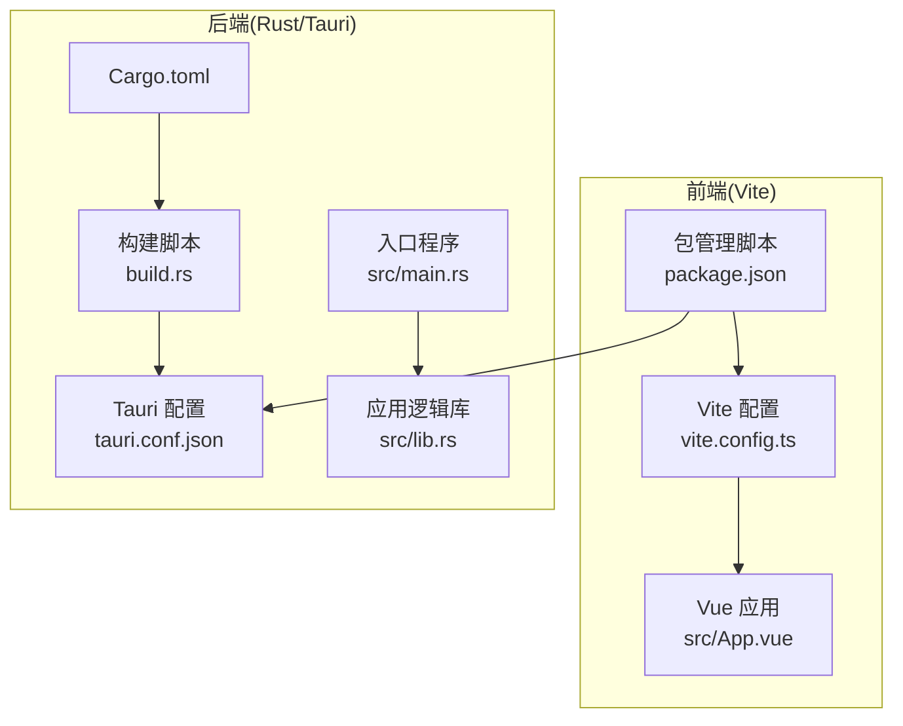
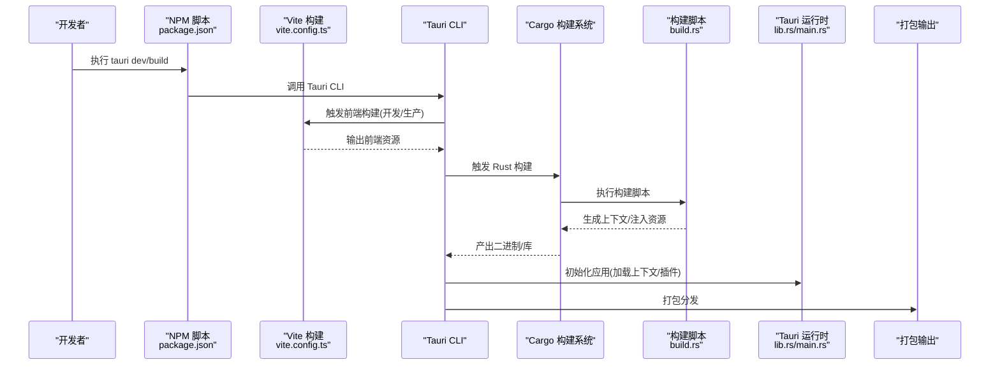
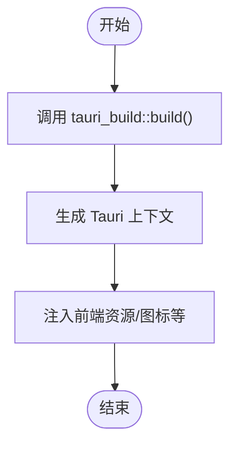
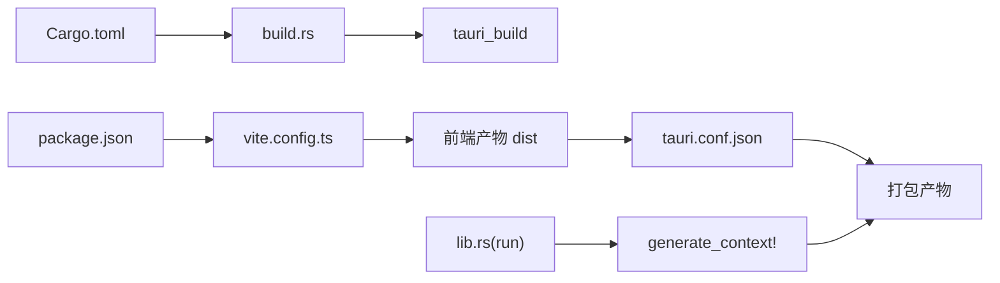

# 构建脚本配置

<cite>
**本文引用的文件**
- [build.rs](file://src-tauri/build.rs)
- [Cargo.toml](file://src-tauri/Cargo.toml)
- [tauri.conf.json](file://src-tauri/tauri.conf.json)
- [package.json](file://package.json)
- [vite.config.ts](file://vite.config.ts)
- [main.rs](file://src-tauri/src/main.rs)
- [lib.rs](file://src-tauri/src/lib.rs)
- [App.vue](file://src/App.vue)
</cite>

## 目录
1. [简介](#简介)
2. [项目结构](#项目结构)
3. [核心组件](#核心组件)
4. [架构总览](#架构总览)
5. [详细组件分析](#详细组件分析)
6. [依赖关系分析](#依赖关系分析)
7. [性能考量](#性能考量)
8. [故障排查指南](#故障排查指南)
9. [结论](#结论)
10. [附录](#附录)

## 简介
本文件面向 Rust 构建脚本配置的专业化技术文档，聚焦于 Tauri 应用中的构建脚本与 Cargo 构建系统的集成方式。重点解释 build.rs 的作用与执行时机、构建时代码生成与配置定制、平台特定配置与资源处理、环境变量传递与构建选项设置、条件编译与资源嵌入、版本信息注入、增量构建与并行编译、缓存机制、常见问题排查与 CI/CD 集成建议。本文所有技术细节均基于仓库中现有文件进行分析与总结，避免臆造信息。

## 项目结构
该工程采用前端（Vite/Vue）与后端（Rust/Tauri）分离的混合架构：
- 前端位于根目录，使用 Vite 作为构建工具，Vue 3 作为框架，通过 @tauri-apps/cli 提供开发与打包命令。
- 后端位于 src-tauri 目录，包含 Rust 二进制与库、构建脚本、Tauri 配置等。
- 构建流程由 Cargo 调度，结合 Tauri CLI 与 Vite 完成前端资源构建与应用打包。

图表来源
- [vite.config.ts:1-33](file://vite.config.ts#L1-L33)
- [package.json:1-25](file://package.json#L1-L25)
- [Cargo.toml:1-26](file://src-tauri/Cargo.toml#L1-L26)
- [build.rs:1-4](file://src-tauri/build.rs#L1-L4)
- [tauri.conf.json:1-36](file://src-tauri/tauri.conf.json#L1-L36)
- [main.rs:1-7](file://src-tauri/src/main.rs#L1-L7)
- [lib.rs:1-15](file://src-tauri/src/lib.rs#L1-L15)

章节来源
- [vite.config.ts:1-33](file://vite.config.ts#L1-L33)
- [package.json:1-25](file://package.json#L1-L25)
- [Cargo.toml:1-26](file://src-tauri/Cargo.toml#L1-L26)
- [build.rs:1-4](file://src-tauri/build.rs#L1-L4)
- [tauri.conf.json:1-36](file://src-tauri/tauri.conf.json#L1-L36)
- [main.rs:1-7](file://src-tauri/src/main.rs#L1-L7)
- [lib.rs:1-15](file://src-tauri/src/lib.rs#L1-L15)

## 核心组件
- 构建脚本 build.rs：最小化实现，委托给 tauri_build::build() 执行 Tauri 构建期任务（如生成上下文、注入资源、生成绑定等）。
- Cargo.toml：定义包元数据、库类型、构建依赖与运行时依赖；其中 crate-type 指定静态库、动态库与 rlib 三种类型，便于跨平台共享与链接。
- Tauri 配置 tauri.conf.json：定义产品名称、版本、窗口属性、安全策略、打包目标与图标等；同时声明前端开发与构建命令及产物路径。
- Vite 配置 vite.config.ts：固定开发端口、严格端口模式、热更新配置、忽略监听 src-tauri 目录，确保与 Tauri 开发体验一致。
- 包管理 package.json：提供 dev/build/preview/tauri 等脚本，驱动 Vite 与 Tauri CLI。
- 应用入口与库：src/main.rs 与 src/lib.rs 组成应用主程序与可复用逻辑，配合 Tauri 上下文生成器完成运行时初始化。

章节来源
- [build.rs:1-4](file://src-tauri/build.rs#L1-L4)
- [Cargo.toml:1-26](file://src-tauri/Cargo.toml#L1-L26)
- [tauri.conf.json:1-36](file://src-tauri/tauri.conf.json#L1-L36)
- [vite.config.ts:1-33](file://vite.config.ts#L1-L33)
- [package.json:1-25](file://package.json#L1-L25)
- [main.rs:1-7](file://src-tauri/src/main.rs#L1-L7)
- [lib.rs:1-15](file://src-tauri/src/lib.rs#L1-L15)

## 架构总览
下图展示了从用户触发到最终产物产出的关键流程：前端构建、Tauri CLI 调度、Cargo 构建、构建脚本执行与资源注入、最终打包。

图表来源
- [package.json:6-11](file://package.json#L6-L11)
- [vite.config.ts:8-32](file://vite.config.ts#L8-L32)
- [tauri.conf.json:6-11](file://src-tauri/tauri.conf.json#L6-L11)
- [build.rs:1-4](file://src-tauri/build.rs#L1-L4)
- [lib.rs:7-14](file://src-tauri/src/lib.rs#L7-L14)
- [main.rs:4-6](file://src-tauri/src/main.rs#L4-L6)

## 详细组件分析

### 构建脚本 build.rs 分析
- 作用与执行时机
  - 构建脚本在 Cargo 构建阶段执行，用于在编译前生成必要的上下文、注入资源、生成绑定或执行其他构建期任务。
  - 在本项目中，构建脚本委托给 tauri_build::build()，由 Tauri 构建工具链负责具体工作流。
- 与 Cargo 的集成
  - 构建脚本属于 Cargo 的“构建依赖”范畴，由 Cargo 在编译前自动调用，无需手动干预。
  - 构建脚本不直接依赖外部工具，而是通过 tauri_build 的能力完成任务。
- 可扩展性
  - 若需自定义构建期行为，可在构建脚本中添加额外逻辑（例如读取环境变量、生成配置文件、拷贝资源等），但当前项目保持极简实现。

图表来源
- [build.rs:1-4](file://src-tauri/build.rs#L1-L4)

章节来源
- [build.rs:1-4](file://src-tauri/build.rs#L1-L4)

### Cargo.toml 配置要点
- 包元数据与版本
  - name/version/description/authors/edition 等字段定义包的基本信息。
- 库类型与链接策略
  - crate-type = ["staticlib", "cdylib", "rlib"] 支持静态库、动态库与 rlib，便于跨平台共享与链接。
- 构建依赖与运行时依赖
  - build-dependencies 引入 tauri-build，用于在构建期生成上下文与绑定。
  - dependencies 引入 tauri、tauri-plugin-opener、serde 等，满足运行时功能需求。
- 与构建脚本的关系
  - 构建脚本通过 tauri_build 功能间接使用这些依赖，完成构建期任务。

章节来源
- [Cargo.toml:1-26](file://src-tauri/Cargo.toml#L1-L26)

### Tauri 配置 tauri.conf.json
- 开发与构建命令
  - beforeDevCommand/beforeBuildCommand 指向前端脚本，确保开发与构建前先生成前端资源。
  - devUrl 指定前端开发服务器地址，与 Vite 固定端口配合。
- 前端产物路径
  - frontendDist 指向 ../dist，与 Vite 输出目录一致。
- 应用与安全
  - app.windows 定义窗口尺寸与标题；security.csp 设置为 null，表示禁用 CSP。
- 打包配置
  - bundle.active=true，targets=all 表示启用打包并针对所有平台；icon 列表包含多分辨率图标与平台特定格式。

章节来源
- [tauri.conf.json:1-36](file://src-tauri/tauri.conf.json#L1-L36)

### Vite 配置 vite.config.ts
- 固定端口与严格模式
  - server.port=1420，strictPort=true，保证 Tauri dev 与构建期望的一致端口。
- 主机与热更新
  - 通过环境变量 TAURI_DEV_HOST 控制热更新协议与主机，支持跨主机开发。
- 监听忽略
  - 忽略 src-tauri 目录，避免 Vite 监听 Rust 源码导致不必要的重载。

章节来源
- [vite.config.ts:1-33](file://vite.config.ts#L1-L33)

### 包管理 package.json
- 脚本职责
  - dev/build/preview/tauri 分别对应开发、构建、预览与 Tauri 命令。
- 与 Tauri 的协作
  - beforeDevCommand/beforeBuildCommand 通过 npm scripts 调用 Vite，确保前端资源就绪后再进入 Rust 构建阶段。

章节来源
- [package.json:1-25](file://package.json#L1-L25)

### 应用入口与库
- 入口程序 main.rs
  - 使用 cfg_attr 控制 Windows 子系统，在发布版隐藏控制台窗口。
  - 调用 tauri_app_lib::run() 启动应用。
- 应用逻辑库 lib.rs
  - 定义 greet 命令与 run 函数，注册插件（如 tauri-plugin-opener），生成上下文并启动应用。
  - 通过 generate_handler! 与 generate_context! 与 Tauri 构建期生成物对接。

章节来源
- [main.rs:1-7](file://src-tauri/src/main.rs#L1-L7)
- [lib.rs:1-15](file://src-tauri/src/lib.rs#L1-L15)

### Vue 应用与前端交互
- App.vue 展示了基础 UI 与事件绑定，通过 @tauri-apps/api 的 invoke 调用 Rust 命令 greet，体现前后端交互。
- 该文件与构建脚本无直接耦合，但其产物会被 Tauri 在打包时注入到应用中。

章节来源
- [App.vue:1-160](file://src/App.vue#L1-L160)

## 依赖关系分析
- 构建脚本依赖
  - build.rs 依赖 tauri_build，由 Cargo 在构建期自动调用。
- 包管理与前端
  - package.json 的 scripts 与 vite.config.ts 的 server 配置共同决定前端开发体验与端口策略。
- 应用运行时
  - lib.rs 中的 run 函数通过 generate_context! 与构建期生成的上下文对接，实现运行时初始化。
- 打包与资源
  - tauri.conf.json 的 icon 与 bundle.targets 决定打包目标与图标资源，构建脚本会将前端产物与图标注入最终包。

图表来源
- [build.rs:1-4](file://src-tauri/build.rs#L1-L4)
- [Cargo.toml:17-18](file://src-tauri/Cargo.toml#L17-L18)
- [package.json:6-11](file://package.json#L6-L11)
- [vite.config.ts:8-32](file://vite.config.ts#L8-L32)
- [tauri.conf.json:6-11](file://src-tauri/tauri.conf.json#L6-L11)
- [lib.rs:7-14](file://src-tauri/src/lib.rs#L7-L14)

章节来源
- [build.rs:1-4](file://src-tauri/build.rs#L1-L4)
- [Cargo.toml:17-18](file://src-tauri/Cargo.toml#L17-L18)
- [package.json:6-11](file://package.json#L6-L11)
- [vite.config.ts:8-32](file://vite.config.ts#L8-L32)
- [tauri.conf.json:6-11](file://src-tauri/tauri.conf.json#L6-L11)
- [lib.rs:7-14](file://src-tauri/src/lib.rs#L7-L14)

## 性能考量
- 增量构建
  - Cargo 默认启用增量编译，仅重新编译变更模块。保持模块拆分与稳定的公共接口有助于提升增量构建效率。
- 并行编译
  - Cargo 支持并行编译，可通过 RUSTFLAGS 或环境变量调整线程数与并行策略，但需注意内存占用与磁盘 IO。
- 缓存机制
  - Cargo 的 target 目录是主要缓存位置；合理组织 src-tauri/target 结构，避免不必要的清理。
  - Vite 在开发模式下具备快速热更新与模块缓存，结合严格端口与固定主机可减少重连成本。
- 资源注入与打包
  - 将前端产物与图标等资源在构建期注入，避免运行时动态加载带来的延迟。
  - 打包 targets=all 会增加构建时间，建议在 CI 中按平台分治或使用缓存加速。

[本节为通用性能建议，不直接分析具体文件]

## 故障排查指南
- 依赖冲突
  - 检查 Cargo.lock 与 Cargo.toml 版本约束是否一致；若出现版本冲突，优先统一版本或放宽范围。
  - 关注构建依赖与运行时依赖的版本匹配，避免 tauri_build 与 tauri 版本不兼容。
- 平台兼容性
  - Windows 子系统与控制台窗口：通过 cfg_attr 控制发布版隐藏控制台，避免用户误操作。
  - 图标与平台特定资源：确保 tauri.conf.json 中 icon 列表包含目标平台所需格式（如 .ico/.icns）。
- 权限问题
  - 开发端口被占用：确认 server.port=1420 且 strictPort=true，避免端口漂移导致热更新失败。
  - 跨主机开发：通过 TAURI_DEV_HOST 设置热更新主机，确保 HMR 协议可用。
- 构建期错误
  - 构建脚本异常：检查 build.rs 是否正确调用 tauri_build::build()，以及构建依赖是否安装。
  - 前端资源缺失：确认 beforeDevCommand/beforeBuildCommand 已成功生成 dist，且 frontendDist 指向正确路径。

章节来源
- [main.rs:1-2](file://src-tauri/src/main.rs#L1-L2)
- [tauri.conf.json:24-34](file://src-tauri/tauri.conf.json#L24-L34)
- [vite.config.ts:16-26](file://vite.config.ts#L16-L26)
- [package.json:6-11](file://package.json#L6-L11)

## 结论
本项目的构建脚本配置以最小化实现为核心，通过 build.rs 委托 tauri_build 完成构建期任务，结合 Cargo、Tauri CLI 与 Vite 形成高效的开发与打包流水线。Cargo.toml 的库类型配置与 tauri.conf.json 的打包策略共同决定了跨平台产物的生成。遵循本文的性能优化与故障排查建议，可进一步提升构建稳定性与效率。

[本节为总结性内容，不直接分析具体文件]

## 附录
- 实践建议
  - 在构建脚本中加入环境变量读取与条件编译，以支持不同构建场景（开发/测试/发布）。
  - 对于大型项目，考虑将前端资源与 Rust 代码分离，利用增量构建与并行编译提升效率。
  - 在 CI/CD 中缓存 Cargo 与 Vite 产物，减少重复下载与编译时间。
- 参考路径
  - 构建脚本：[build.rs:1-4](file://src-tauri/build.rs#L1-L4)
  - 包管理与前端：[package.json:1-25](file://package.json#L1-L25)，[vite.config.ts:1-33](file://vite.config.ts#L1-L33)
  - 应用配置：[tauri.conf.json:1-36](file://src-tauri/tauri.conf.json#L1-L36)
  - 应用入口与库：[main.rs:1-7](file://src-tauri/src/main.rs#L1-L7)，[lib.rs:1-15](file://src-tauri/src/lib.rs#L1-L15)

[本节为补充信息，不直接分析具体文件]