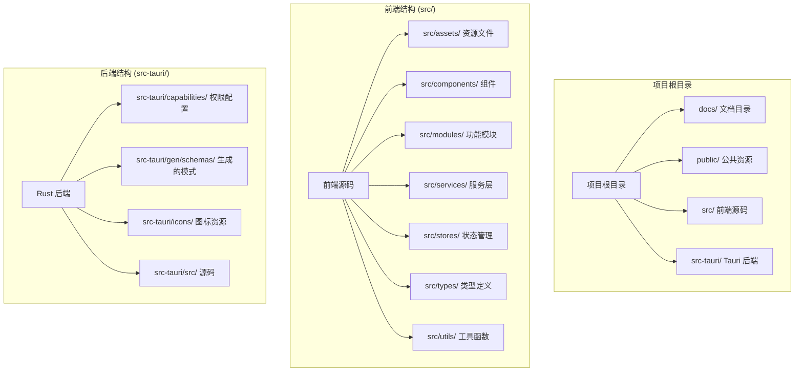
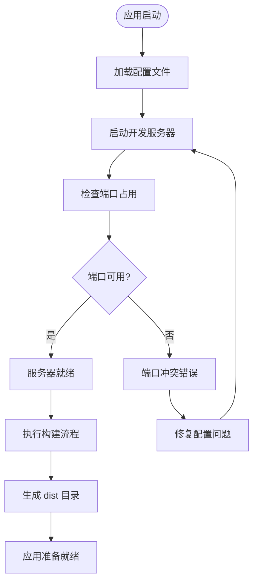
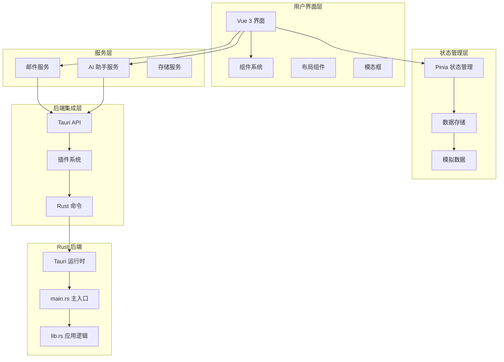
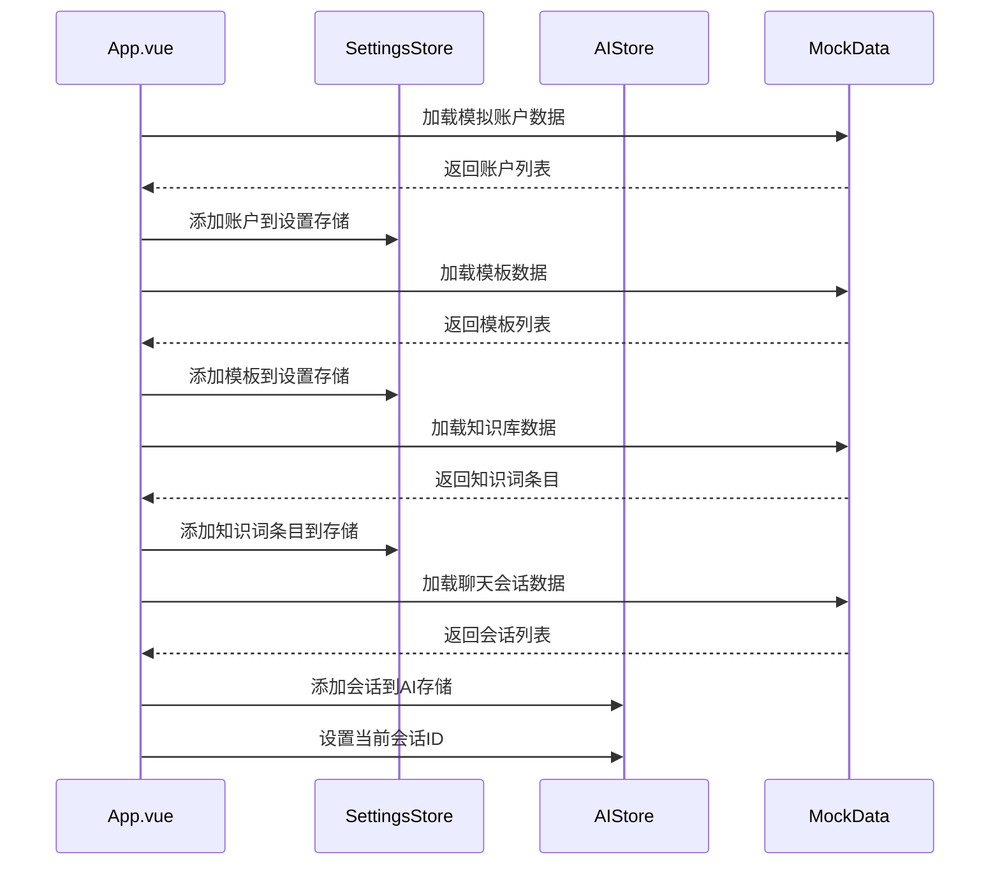
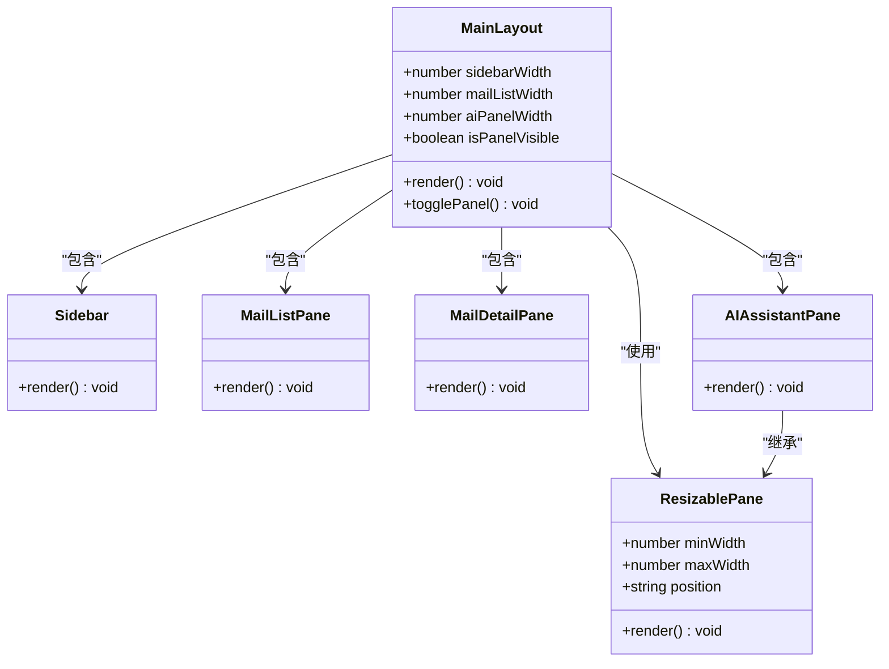
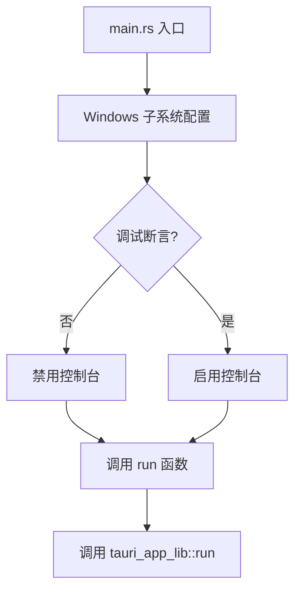
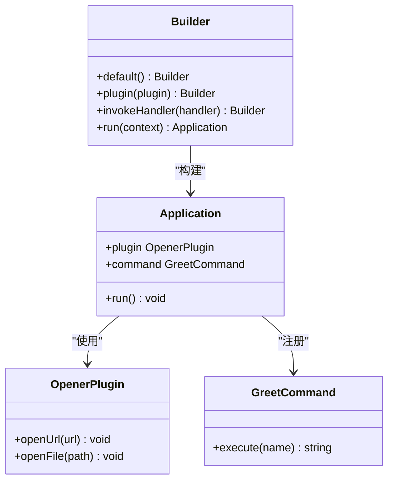
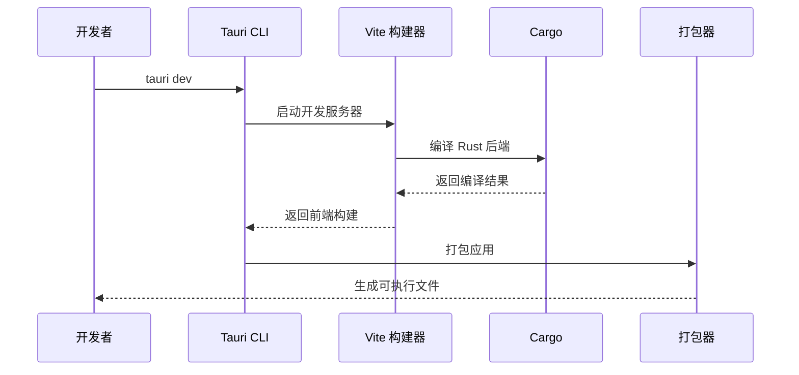
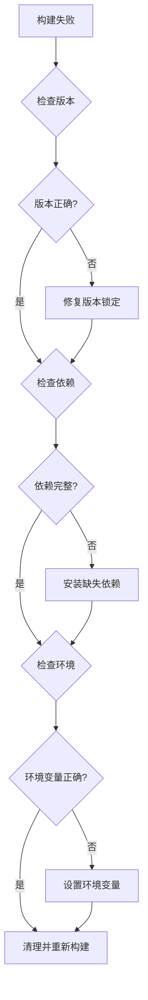

# Tauri 版本信息

<cite>
**本文档引用的文件**
- [package.json](file://package.json)
- [Cargo.toml](file://src-tauri/Cargo.toml)
- [tauri.conf.json](file://src-tauri/tauri.conf.json)
- [tauri-versions.md](file://docs/tauri-versions.md)
- [main.rs](file://src-tauri/src/main.rs)
- [lib.rs](file://src-tauri/src/lib.rs)
- [vite.config.ts](file://vite.config.ts)
- [main.ts](file://src/main.ts)
- [App.vue](file://src/App.vue)
</cite>

## 目录
1. [简介](#简介)
2. [项目结构](#项目结构)
3. [核心组件](#核心组件)
4. [架构概览](#架构概览)
5. [详细组件分析](#详细组件分析)
6. [依赖关系分析](#依赖关系分析)
7. [性能考虑](#性能考虑)
8. [故障排除指南](#故障排除指南)
9. [结论](#结论)

## 简介

这是一个基于 Tauri 框架构建的跨平台桌面应用程序，采用 Vue 3 + TypeScript 技术栈开发。该应用展示了现代桌面应用的典型架构模式，包括前端界面、后端 Rust 逻辑以及完整的构建和打包流程。

## 项目结构

该项目采用典型的 Tauri 应用结构，分为前端和后端两个主要部分：



**图表来源**
- [package.json:1-29](file://package.json#L1-L29)
- [Cargo.toml:1-26](file://src-tauri/Cargo.toml#L1-L26)

**章节来源**
- [package.json:1-29](file://package.json#L1-L29)
- [Cargo.toml:1-26](file://src-tauri/Cargo.toml#L1-L26)

## 核心组件

### 版本管理系统

该应用实现了多层次的版本控制机制，确保前后端组件的一致性和可追踪性：

| 层级 | 组件 | 当前版本 | 状态 |
|------|------|----------|------|
| 应用层 | 产品名称 | YiMao | 开发中 |
| 应用层 | 版本号 | 0.1.0 | 开发版本 |
| 前端层 | @tauri-apps/api | 2.10.1 | 稳定版本 |
| 前端层 | @tauri-apps/cli | 2.10.1 | 稳定版本 |
| 后端层 | tauri | 2.10.3 | 稳定版本 |
| 构建层 | tauri-build | 2.5.6 | 稳定版本 |

### 构建配置系统

应用使用 Vite 作为构建工具，配置了专门的开发服务器设置：



**图表来源**
- [vite.config.ts:17-38](file://vite.config.ts#L17-L38)
- [tauri.conf.json:6-11](file://src-tauri/tauri.conf.json#L6-L11)

**章节来源**
- [vite.config.ts:1-39](file://vite.config.ts#L1-L39)
- [tauri.conf.json:1-36](file://src-tauri/tauri.conf.json#L1-L36)

## 架构概览

该应用采用了现代化的桌面应用架构，结合了 Web 技术和原生应用的优势：



**图表来源**
- [main.ts:1-10](file://src/main.ts#L1-L10)
- [lib.rs:7-14](file://src-tauri/src/lib.rs#L7-L14)
- [main.rs:1-7](file://src-tauri/src/main.rs#L1-L7)

## 详细组件分析

### 前端应用架构

前端应用采用模块化设计，主要包含以下核心组件：

#### 主应用组件 (App.vue)

主应用组件负责初始化应用状态和加载模拟数据：



**图表来源**
- [App.vue:12-23](file://src/App.vue#L12-L23)

#### 主布局组件 (MainLayout.vue)

主布局组件实现了响应式三栏布局，支持可调整大小的面板：



**图表来源**
- [MainLayout.vue:1-131](file://src/layouts/MainLayout.vue#L1-L131)

**章节来源**
- [App.vue:1-35](file://src/App.vue#L1-L35)
- [MainLayout.vue:1-131](file://src/layouts/MainLayout.vue#L1-L131)

### Rust 后端架构

后端采用 Rust 编写，提供了安全高效的原生功能：

#### 应用入口点 (main.rs)

应用入口点配置了 Windows 子系统设置以防止额外的控制台窗口：



**图表来源**
- [main.rs:1-7](file://src-tauri/src/main.rs#L1-L7)

#### 应用运行时 (lib.rs)

应用运行时配置了插件和命令处理器：



**图表来源**
- [lib.rs:1-15](file://src-tauri/src/lib.rs#L1-L15)

**章节来源**
- [main.rs:1-7](file://src-tauri/src/main.rs#L1-L7)
- [lib.rs:1-15](file://src-tauri/src/lib.rs#L1-L15)

### 构建和打包系统

应用使用 Tauri CLI 和 Vite 进行构建和打包：



**图表来源**
- [tauri.conf.json:6-11](file://src-tauri/tauri.conf.json#L6-L11)
- [package.json:6-11](file://package.json#L6-L11)

**章节来源**
- [tauri.conf.json:1-36](file://src-tauri/tauri.conf.json#L1-L36)
- [package.json:1-29](file://package.json#L1-L29)

## 依赖关系分析

### 版本兼容性矩阵

应用的依赖关系遵循严格的版本兼容性要求：

```mermaid
graph LR
subgraph "前端依赖"
Vue[Vue 3.5.13]
Pinia[Pinia 2.3.0]
TauriAPI[@tauri-apps/api 2.10.1]
CLI[@tauri-apps/cli 2.10.1]
end
subgraph "后端依赖"
TauriCore[tauri 2.10.3]
TauriBuild[tauri-build 2.5.6]
OpenerPlugin[tauri-plugin-opener 2.5.3]
Serde[serde 1.x]
end
subgraph "开发工具"
Vite[Vite 6.0.3]
TypeScript[TypeScript 5.6.2]
Sass[Sass 1.80.0]
end
Vue --> TauriAPI
Pinia --> Vue
TauriAPI --> TauriCore
CLI --> TauriBuild
TauriCore --> TauriBuild
TauriCore --> OpenerPlugin
Vite --> Vue
TypeScript --> Vue
```

**图表来源**
- [package.json:12-27](file://package.json#L12-L27)
- [Cargo.toml:20-25](file://src-tauri/Cargo.toml#L20-L25)

### 版本锁定策略

应用采用了精确版本锁定策略，确保构建的一致性和可重复性：

| 依赖类型 | 包名 | 版本 | 锁定方式 | 用途 |
|----------|------|------|----------|------|
| 前端核心 | vue | ^3.5.13 | ^ 约等于 | 用户界面框架 |
| 状态管理 | pinia | ^2.3.0 | ^ 约等于 | 应用状态管理 |
| Tauri API | @tauri-apps/api | 2.10.1 | 精确版本 | 前端与后端通信 |
| Tauri CLI | @tauri-apps/cli | 2.10.1 | 精确版本 | 应用构建和打包 |
| Rust 核心 | tauri | =2.10.3 | 等号精确 | 应用运行时 |
| 构建工具 | tauri-build | =2.5.6 | 等号精确 | 应用构建 |
| 插件系统 | tauri-plugin-opener | =2.5.3 | 等号精确 | 文件和链接打开 |

**章节来源**
- [package.json:12-27](file://package.json#L12-L27)
- [Cargo.toml:20-25](file://src-tauri/Cargo.toml#L20-L25)
- [tauri-versions.md:1-25](file://docs/tauri-versions.md#L1-L25)

## 性能考虑

### 构建优化

应用在构建过程中采用了多项优化策略：

1. **开发服务器优化**：固定端口 1420，避免端口冲突
2. **热重载配置**：WebSocket 热重载，支持跨主机开发
3. **忽略监听**：排除 `src-tauri` 目录的文件监控
4. **清理屏幕**：防止 Vite 隐藏 Rust 错误信息

### 内存管理

Rust 后端提供了内存安全保证：
- 所有内存操作都在编译时检查
- 防止空指针和缓冲区溢出
- 自动垃圾回收机制

### 并发处理

应用支持多线程并发处理：
- 异步任务调度
- 事件驱动架构
- 非阻塞 I/O 操作

## 故障排除指南

### 常见问题诊断

#### 版本不兼容问题

当遇到版本不兼容问题时，建议：

1. **检查版本锁定**：确认 `package.json` 和 `Cargo.toml` 中的版本号
2. **清理缓存**：删除 `node_modules` 和 `target` 目录
3. **重新安装依赖**：使用 `pnpm install` 或 `cargo update`

#### 构建失败排查



#### 运行时错误处理

应用提供了完善的错误处理机制：
- Rust panic 恢复
- JavaScript 异常捕获
- 日志记录和报告

**章节来源**
- [vite.config.ts:22-37](file://vite.config.ts#L22-L37)
- [lib.rs:8-14](file://src-tauri/src/lib.rs#L8-L14)

## 结论

该 Tauri 应用展示了现代桌面应用开发的最佳实践，通过精心设计的架构和严格的版本管理，实现了高性能、可维护的跨平台应用。关键特点包括：

1. **清晰的架构分层**：前端、后端、构建系统的明确分离
2. **严格的版本控制**：精确的版本锁定确保构建一致性
3. **现代化的技术栈**：Vue 3 + TypeScript + Rust 的组合
4. **完善的开发体验**：热重载、类型安全、自动补全
5. **跨平台兼容性**：支持 Windows、macOS 和 Linux

该应用为学习 Tauri 框架和现代桌面应用开发提供了优秀的参考案例。