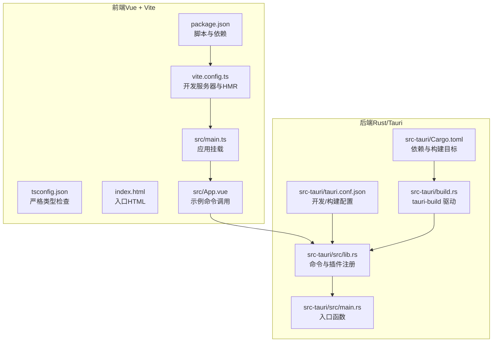
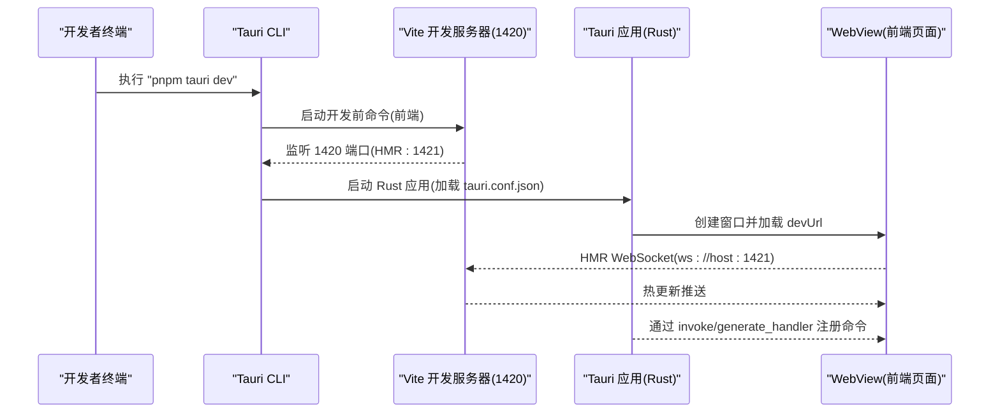
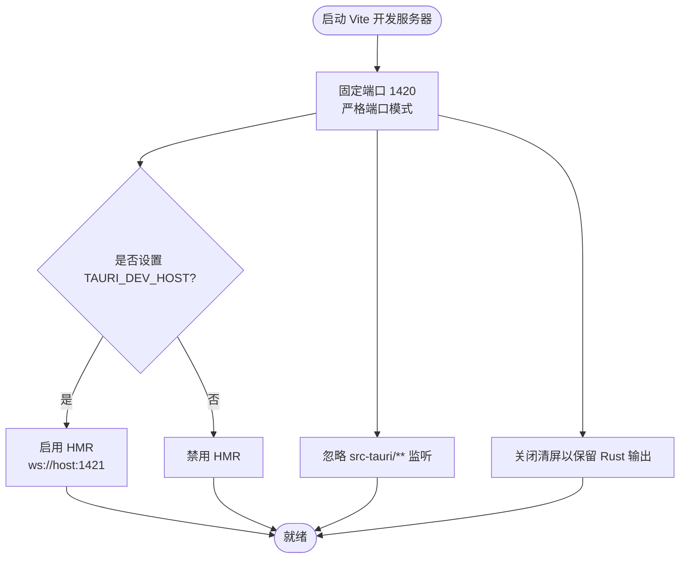
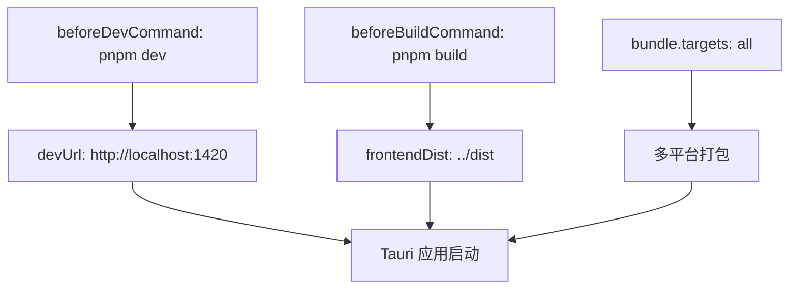
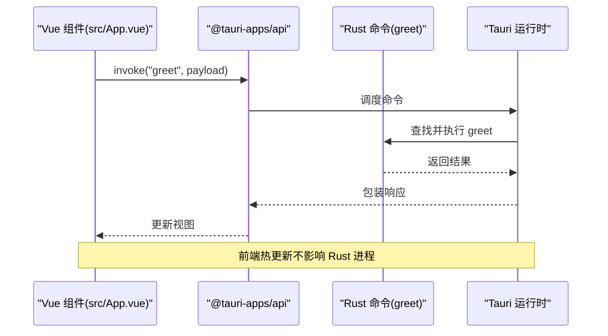
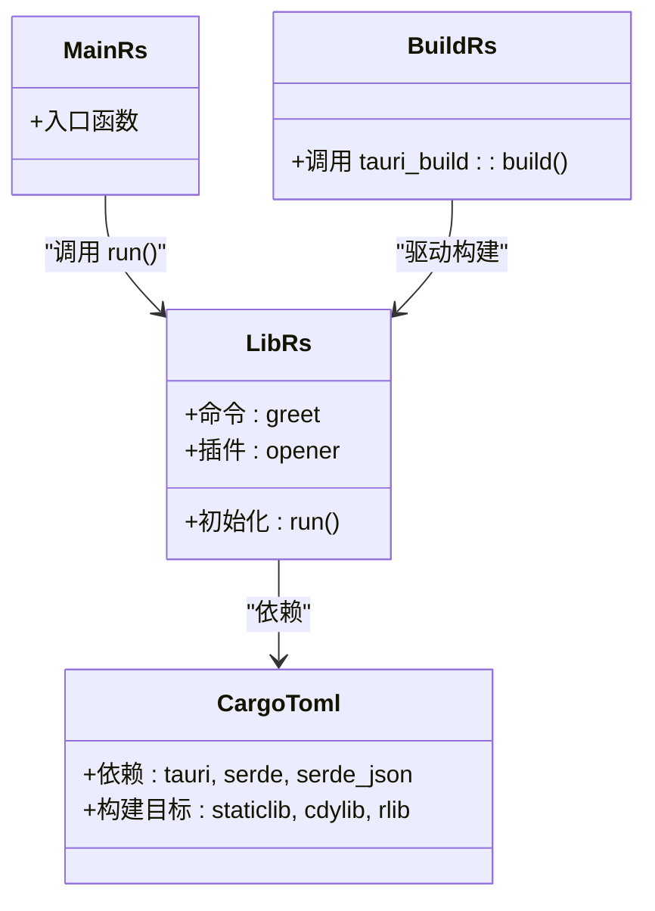
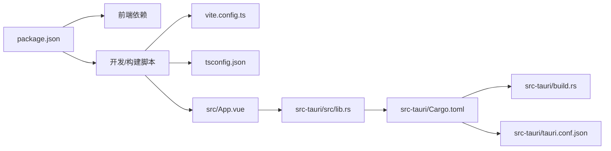

# 开发工作流

<cite>
**本文引用的文件**
- [package.json](file://package.json)
- [vite.config.ts](file://vite.config.ts)
- [tsconfig.json](file://tsconfig.json)
- [index.html](file://index.html)
- [src/main.ts](file://src/main.ts)
- [src/App.vue](file://src/App.vue)
- [src-tauri/Cargo.toml](file://src-tauri/Cargo.toml)
- [src-tauri/build.rs](file://src-tauri/build.rs)
- [src-tauri/tauri.conf.json](file://src-tauri/tauri.conf.json)
- [src-tauri/src/lib.rs](file://src-tauri/src/lib.rs)
- [src-tauri/src/main.rs](file://src-tauri/src/main.rs)
- [AGENTS.md](file://AGENTS.md)
- [README.md](file://README.md)
</cite>

## 目录
1. [简介](#简介)
2. [项目结构](#项目结构)
3. [核心组件](#核心组件)
4. [架构总览](#架构总览)
5. [详细组件分析](#详细组件分析)
6. [依赖关系分析](#依赖关系分析)
7. [性能考虑](#性能考虑)
8. [故障排除指南](#故障排除指南)
9. [结论](#结论)
10. [附录](#附录)

## 简介
本指南面向使用 Tauri + Vue + TypeScript 的桌面应用开发团队，覆盖从开发到部署的完整生命周期。内容包括：
- 开发服务器启动与配置（含 pnpm tauri dev 的工作机制与启动顺序）
- 前后端热重载协调（Vue 前端与 Rust 后端）
- 调试技巧（浏览器开发者工具、Rust 错误诊断、Tauri 日志）
- 热重载触发条件与限制、编译与运行时异常处理
- 性能监控与优化（内存使用、启动时间）
- 版本控制与团队协作最佳实践
- 生产构建与发布（多平台打包、分发策略）
- 常见问题排查与解决方案

## 项目结构
该仓库采用“前端（Vue）+ 后端（Rust/Tauri）”双工程结构，通过 Tauri 配置桥接前后端开发与构建流程。

图表来源
- [package.json:1-25](file://package.json#L1-L25)
- [vite.config.ts:1-33](file://vite.config.ts#L1-L33)
- [tsconfig.json:1-26](file://tsconfig.json#L1-L26)
- [index.html:1-15](file://index.html#L1-L15)
- [src/main.ts:1-5](file://src/main.ts#L1-L5)
- [src/App.vue:1-160](file://src/App.vue#L1-L160)
- [src-tauri/Cargo.toml:1-26](file://src-tauri/Cargo.toml#L1-L26)
- [src-tauri/build.rs:1-4](file://src-tauri/build.rs#L1-L4)
- [src-tauri/tauri.conf.json:1-36](file://src-tauri/tauri.conf.json#L1-L36)
- [src-tauri/src/lib.rs:1-15](file://src-tauri/src/lib.rs#L1-L15)
- [src-tauri/src/main.rs:1-7](file://src-tauri/src/main.rs#L1-L7)

章节来源
- [package.json:1-25](file://package.json#L1-L25)
- [vite.config.ts:1-33](file://vite.config.ts#L1-L33)
- [tsconfig.json:1-26](file://tsconfig.json#L1-L26)
- [index.html:1-15](file://index.html#L1-L15)
- [src/main.ts:1-5](file://src/main.ts#L1-L5)
- [src/App.vue:1-160](file://src/App.vue#L1-L160)
- [src-tauri/Cargo.toml:1-26](file://src-tauri/Cargo.toml#L1-L26)
- [src-tauri/build.rs:1-4](file://src-tauri/build.rs#L1-L4)
- [src-tauri/tauri.conf.json:1-36](file://src-tauri/tauri.conf.json#L1-L36)
- [src-tauri/src/lib.rs:1-15](file://src-tauri/src/lib.rs#L1-L15)
- [src-tauri/src/main.rs:1-7](file://src-tauri/src/main.rs#L1-L7)

## 核心组件
- 前端开发脚本与依赖：通过 package.json 提供 dev/build/preview/tauri 脚本，集成 Vite、Vue 与 Tauri CLI。
- Vite 开发服务器：固定端口 1420，严格端口模式；支持可选 HMR（当设置 TAURI_DEV_HOST 时启用 ws://host:1421）。
- 类型系统：tsconfig.json 启用严格模式，确保类型安全。
- Tauri 配置：tauri.conf.json 指定开发前命令、开发 URL、构建前命令与前端产物目录。
- Rust 后端：src-tauri/src/lib.rs 定义命令与插件；src-tauri/src/main.rs 作为入口；Cargo.toml 配置依赖与构建目标；build.rs 触发 tauri-build。

章节来源
- [package.json:6-11](file://package.json#L6-L11)
- [vite.config.ts:16-31](file://vite.config.ts#L16-L31)
- [tsconfig.json:17-22](file://tsconfig.json#L17-L22)
- [src-tauri/tauri.conf.json:6-11](file://src-tauri/tauri.conf.json#L6-L11)
- [src-tauri/src/lib.rs:1-15](file://src-tauri/src/lib.rs#L1-L15)
- [src-tauri/src/main.rs:4-6](file://src-tauri/src/main.rs#L4-L6)
- [src-tauri/Cargo.toml:10-25](file://src-tauri/Cargo.toml#L10-L25)
- [src-tauri/build.rs:1-3](file://src-tauri/build.rs#L1-L3)

## 架构总览
下图展示 pnpm tauri dev 的整体启动顺序与组件交互：

图表来源
- [AGENTS.md:13-24](file://AGENTS.md#L13-L24)
- [src-tauri/tauri.conf.json:6-11](file://src-tauri/tauri.conf.json#L6-L11)
- [vite.config.ts:16-31](file://vite.config.ts#L16-L31)
- [src-tauri/src/lib.rs:8-14](file://src-tauri/src/lib.rs#L8-L14)

章节来源
- [AGENTS.md:13-24](file://AGENTS.md#L13-L24)
- [src-tauri/tauri.conf.json:6-11](file://src-tauri/tauri.conf.json#L6-L11)
- [vite.config.ts:16-31](file://vite.config.ts#L16-L31)
- [src-tauri/src/lib.rs:8-14](file://src-tauri/src/lib.rs#L8-L14)

## 详细组件分析

### 开发服务器与热重载（Vite + Tauri）
- 固定端口与严格端口模式：Vite 在开发模式下固定监听 1420 端口，若被占用则直接失败，避免端口漂移导致的配置不一致。
- HMR 协议与主机绑定：当设置 TAURI_DEV_HOST 环境变量时，启用 HMR 并通过 ws 协议连接到 host:1421；未设置时禁用 HMR。
- 忽略监听路径：Vite 显式忽略 src-tauri/**，防止后端改动触发前端热更新。
- 清屏策略：关闭清屏以保留 Rust 编译输出，便于同时观察前后端日志。

图表来源
- [vite.config.ts:14-31](file://vite.config.ts#L14-L31)

章节来源
- [vite.config.ts:14-31](file://vite.config.ts#L14-L31)

### Tauri 配置与构建流程
- 开发前命令与 URL：beforeDevCommand 指向前端开发脚本，devUrl 指向 http://localhost:1420。
- 构建前命令与产物目录：beforeBuildCommand 指向前端构建脚本，frontendDist 指向 ../dist。
- 打包配置：bundle.targets 设置为 all，自动为所有平台生成安装包。

图表来源
- [src-tauri/tauri.conf.json:6-11](file://src-tauri/tauri.conf.json#L6-L11)
- [src-tauri/tauri.conf.json:24-34](file://src-tauri/tauri.conf.json#L24-L34)

章节来源
- [src-tauri/tauri.conf.json:6-11](file://src-tauri/tauri.conf.json#L6-L11)
- [src-tauri/tauri.conf.json:24-34](file://src-tauri/tauri.conf.json#L24-L34)

### 前后端命令调用与热重载协调
- 前端调用：src/App.vue 使用 @tauri-apps/api 的 invoke 调用 Rust 命令 greet。
- 后端命令：src-tauri/src/lib.rs 定义 #[tauri::command] greet，并在 run 中通过 generate_handler 注册。
- 热重载联动：前端修改仅影响 Vite，Rust 侧需重新构建（由 Tauri CLI 触发），HMR 不会改变 Rust 进程。

图表来源
- [src/App.vue:8-11](file://src/App.vue#L8-L11)
- [src-tauri/src/lib.rs:2-5](file://src-tauri/src/lib.rs#L2-L5)
- [src-tauri/src/lib.rs:10-12](file://src-tauri/src/lib.rs#L10-L12)

章节来源
- [src/App.vue:8-11](file://src/App.vue#L8-L11)
- [src-tauri/src/lib.rs:2-5](file://src-tauri/src/lib.rs#L2-L5)
- [src-tauri/src/lib.rs:10-12](file://src-tauri/src/lib.rs#L10-L12)

### Rust 应用入口与插件
- 入口函数：src-tauri/src/main.rs 调用 tauri_app_lib::run。
- 应用初始化：src-tauri/src/lib.rs::run 中注册插件与命令，使用 generate_context! 初始化上下文。

图表来源
- [src-tauri/src/main.rs:4-6](file://src-tauri/src/main.rs#L4-L6)
- [src-tauri/src/lib.rs:8-14](file://src-tauri/src/lib.rs#L8-L14)
- [src-tauri/Cargo.toml:10-25](file://src-tauri/Cargo.toml#L10-L25)
- [src-tauri/build.rs:1-3](file://src-tauri/build.rs#L1-L3)

章节来源
- [src-tauri/src/main.rs:4-6](file://src-tauri/src/main.rs#L4-L6)
- [src-tauri/src/lib.rs:8-14](file://src-tauri/src/lib.rs#L8-L14)
- [src-tauri/Cargo.toml:10-25](file://src-tauri/Cargo.toml#L10-L25)
- [src-tauri/build.rs:1-3](file://src-tauri/build.rs#L1-L3)

## 依赖关系分析
- 前端依赖：Vue、@tauri-apps/api、@tauri-apps/cli、vite、@vitejs/plugin-vue、typescript、vue-tsc。
- 后端依赖：tauri、tauri-plugin-opener、serde、serde_json；构建期依赖 tauri-build。
- 构建链路：Vite 生成 dist → Tauri 打包 → 多平台安装包。

图表来源
- [package.json:12-23](file://package.json#L12-L23)
- [vite.config.ts:1-33](file://vite.config.ts#L1-L33)
- [tsconfig.json:1-26](file://tsconfig.json#L1-L26)
- [src/App.vue:1-160](file://src/App.vue#L1-L160)
- [src-tauri/src/lib.rs:1-15](file://src-tauri/src/lib.rs#L1-L15)
- [src-tauri/Cargo.toml:17-25](file://src-tauri/Cargo.toml#L17-L25)
- [src-tauri/build.rs:1-3](file://src-tauri/build.rs#L1-L3)
- [src-tauri/tauri.conf.json:1-36](file://src-tauri/tauri.conf.json#L1-L36)

章节来源
- [package.json:12-23](file://package.json#L12-L23)
- [src-tauri/Cargo.toml:17-25](file://src-tauri/Cargo.toml#L17-L25)
- [src-tauri/tauri.conf.json:6-11](file://src-tauri/tauri.conf.json#L6-L11)

## 性能考虑
- 启动时间优化
  - 固定端口与严格端口：避免端口冲突导致的重试与等待。
  - 关闭清屏：减少 Vite 清屏带来的闪烁与短暂阻塞。
  - 忽略 src-tauri 监听：降低前端 watcher 压力。
- 内存使用分析
  - 使用浏览器开发者工具的 Memory 面板进行快照对比，定位泄漏点。
  - 对高频事件（如滚动、输入）使用节流/防抖。
- 编译与运行时
  - 前端：开启 vue-tsc 类型检查，避免运行时错误。
  - 后端：使用 Result 类型处理错误，避免 panic；必要时在 CLI 中启用日志级别。

章节来源
- [vite.config.ts:14-31](file://vite.config.ts#L14-L31)
- [tsconfig.json:17-22](file://tsconfig.json#L17-L22)
- [src-tauri/src/lib.rs:2-5](file://src-tauri/src/lib.rs#L2-L5)

## 故障排除指南
- 端口占用
  - 现象：启动失败或端口冲突。
  - 处理：释放 1420/1421 端口，或调整 Tauri/HMR 配置。
- HMR 不生效
  - 现象：前端修改无刷新。
  - 处理：确认已设置 TAURI_DEV_HOST；检查 ws://host:1421 是否可达；确保未被防火墙拦截。
- Rust 编译错误
  - 现象：Rust 构建失败。
  - 处理：查看终端输出；优先修复编译错误再重启 Tauri；必要时清理构建缓存。
- 运行时异常
  - 现象：应用崩溃或命令调用报错。
  - 处理：在 Rust 中使用 Result 正确返回错误；在前端使用 try/catch 包裹 invoke；查看 WebView 控制台与系统日志。
- 类型检查失败
  - 现象：pnpm build 报错。
  - 处理：根据 vue-tsc 输出修正类型问题；保持 tsconfig.json 严格模式。

章节来源
- [vite.config.ts:16-31](file://vite.config.ts#L16-L31)
- [AGENTS.md:13-24](file://AGENTS.md#L13-L24)
- [src-tauri/src/lib.rs:8-14](file://src-tauri/src/lib.rs#L8-L14)
- [tsconfig.json:17-22](file://tsconfig.json#L17-L22)

## 结论
本指南提供了从开发到部署的全链路实践方法。通过固定端口与严格端口模式、合理的 HMR 配置、严格的类型检查与 Rust 错误处理，可以显著提升开发效率与应用稳定性。生产构建阶段利用多平台打包与统一的产物目录，确保交付质量与一致性。

## 附录

### 开发调试技巧
- 浏览器开发者工具
  - 使用 Elements/Console/Network 面板检查 DOM、日志与网络请求。
  - 在 Console 中直接调用 invoke 验证命令可用性。
- Rust 错误诊断
  - 在 CLI 中启用更详细的日志（如设置日志级别）。
  - 使用 Result 类型明确错误传播路径。
- Tauri 日志查看
  - 在终端查看 Tauri CLI 输出；在 WebView 中打开开发者工具查看前端日志。

章节来源
- [src/App.vue:8-11](file://src/App.vue#L8-L11)
- [src-tauri/src/lib.rs:8-14](file://src-tauri/src/lib.rs#L8-L14)

### 版本控制与团队协作最佳实践
- 分支策略：主分支保护、功能分支开发、Pull Request 审查。
- 提交规范：语义化提交信息，关联 Issue。
- 依赖管理：锁定版本，定期同步依赖；使用 pnpm 锁定文件。
- 文档同步：变更配置或命令时同步更新 AGENTS.md 与 README。

章节来源
- [AGENTS.md:35-72](file://AGENTS.md#L35-L72)
- [README.md:5-17](file://README.md#L5-L17)

### 生产构建与发布流程
- 前端构建：pnpm build（类型检查 + Vite 构建）→ 生成 dist。
- 应用打包：pnpm tauri build → 自动多平台打包（targets=all）。
- 分发策略：根据平台上传至应用商店或自建分发渠道；校验签名与完整性。

章节来源
- [AGENTS.md:19-24](file://AGENTS.md#L19-L24)
- [src-tauri/tauri.conf.json:24-34](file://src-tauri/tauri.conf.json#L24-L34)