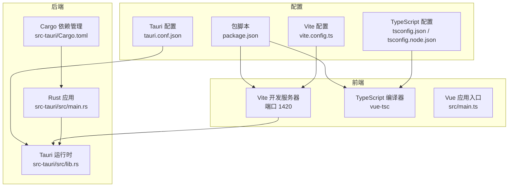
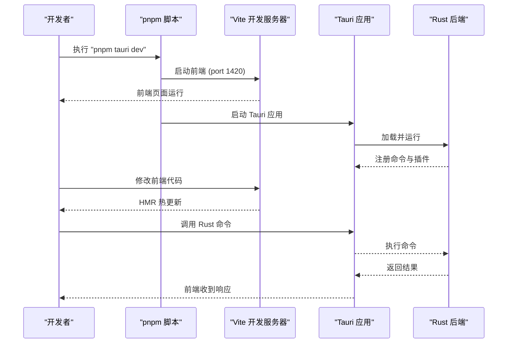
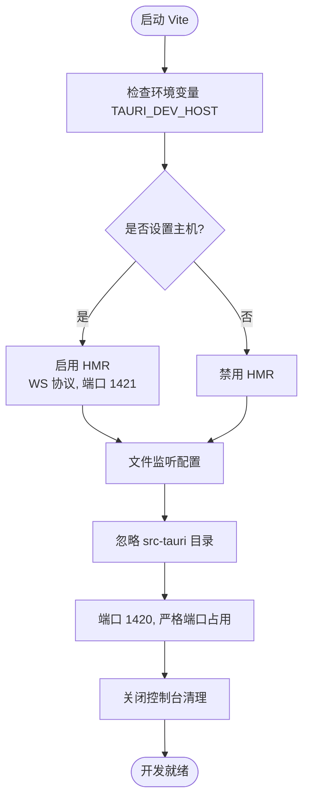
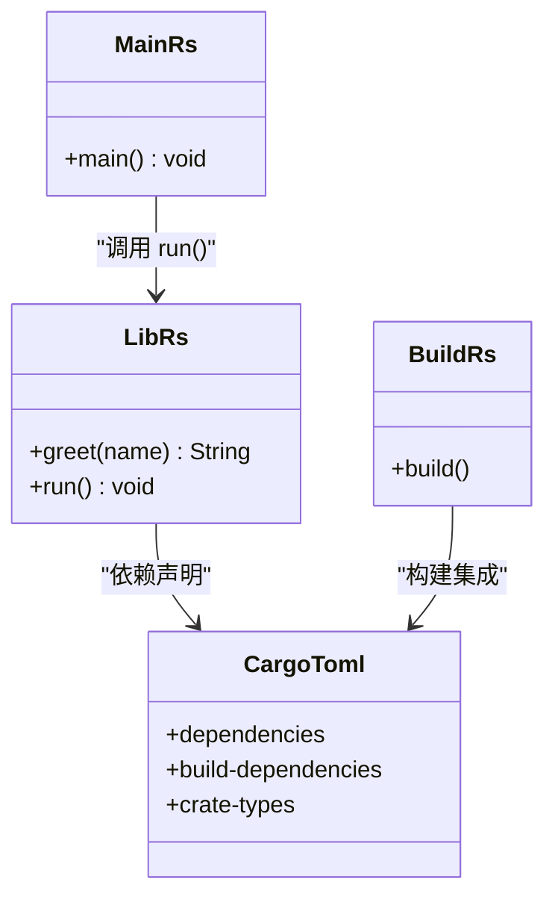
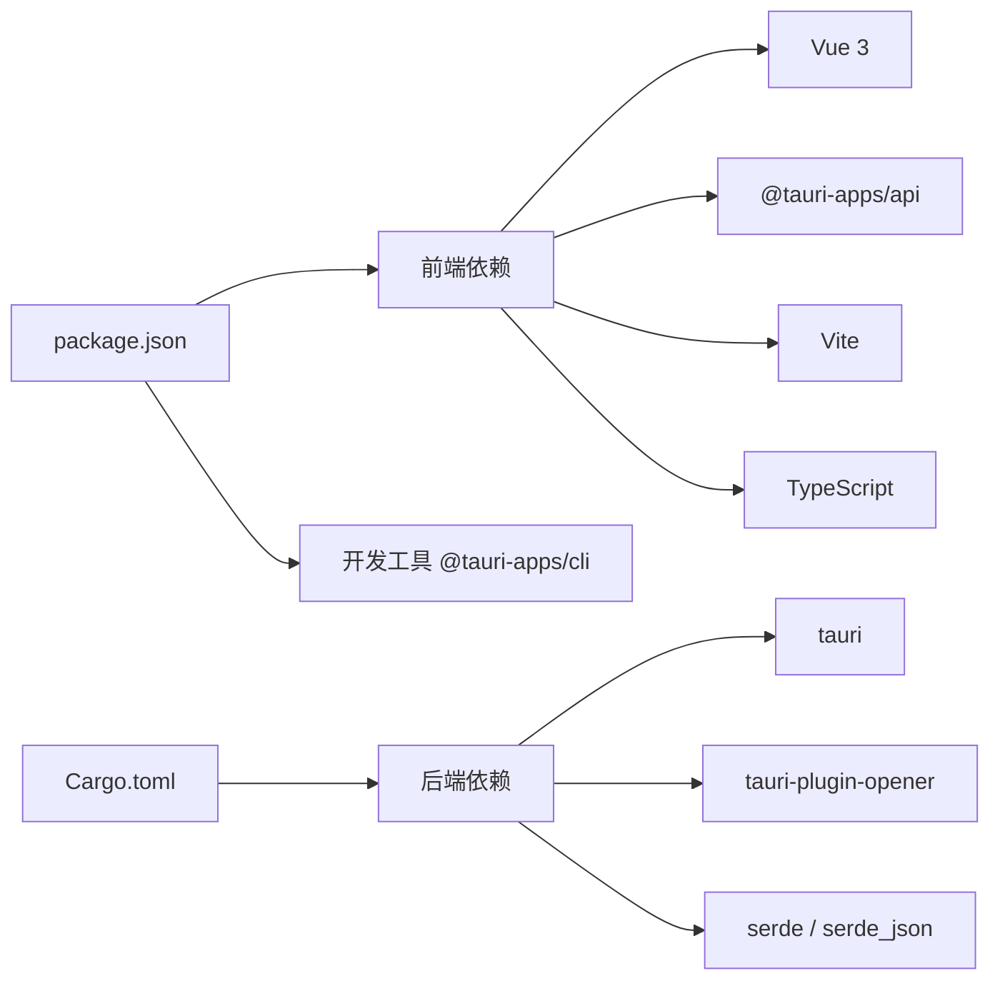

# 开发环境配置

<cite>
**本文档引用的文件**
- [package.json](file://package.json)
- [vite.config.ts](file://vite.config.ts)
- [src-tauri/Cargo.toml](file://src-tauri/Cargo.toml)
- [src-tauri/tauri.conf.json](file://src-tauri/tauri.conf.json)
- [tsconfig.json](file://tsconfig.json)
- [tsconfig.node.json](file://tsconfig.node.json)
- [src/main.ts](file://src/main.ts)
- [src/App.vue](file://src/App.vue)
- [src-tauri/src/lib.rs](file://src-tauri/src/lib.rs)
- [src-tauri/src/main.rs](file://src-tauri/src/main.rs)
- [src-tauri/build.rs](file://src-tauri/build.rs)
- [README.md](file://README.md)
</cite>

## 目录
1. [简介](#简介)
2. [项目结构](#项目结构)
3. [核心组件](#核心组件)
4. [架构概览](#架构概览)
5. [详细组件分析](#详细组件分析)
6. [依赖分析](#依赖分析)
7. [性能考虑](#性能考虑)
8. [故障排除指南](#故障排除指南)
9. [结论](#结论)
10. [附录](#附录)

## 简介
本指南面向 Tauri + Vue + TypeScript 项目的开发者，提供从工具链安装到开发调试的完整配置说明。重点涵盖以下内容：
- pnpm tauri dev 与 pnpm dev 的区别与使用场景
- Vite 开发服务器在 Tauri 上的定制化配置（端口、热重载、文件监听）
- Rust 后端开发环境搭建（Cargo 依赖管理、Tauri CLI 工具链）
- IDE 推荐配置（VS Code 插件：Volar、Tauri、rust-analyzer）
- 环境变量、路径别名与 TypeScript 类型定义配置
- 开发模式下的文件监听机制与自动重启规则

## 项目结构
该项目采用前后端分离的典型 Tauri 结构：
- 前端：Vue 3 + TypeScript + Vite
- 后端：Rust + Tauri
- 配置：package.json 脚本、vite.config.ts、tauri.conf.json、Cargo.toml

**图表来源**
- [package.json:1-25](file://package.json#L1-L25)
- [vite.config.ts:1-33](file://vite.config.ts#L1-L33)
- [src-tauri/tauri.conf.json:1-36](file://src-tauri/tauri.conf.json#L1-L36)
- [tsconfig.json:1-26](file://tsconfig.json#L1-L26)
- [src-tauri/Cargo.toml:1-26](file://src-tauri/Cargo.toml#L1-L26)
- [src/main.ts:1-5](file://src/main.ts#L1-L5)
- [src-tauri/src/main.rs:1-7](file://src-tauri/src/main.rs#L1-L7)
- [src-tauri/src/lib.rs:1-15](file://src-tauri/src/lib.rs#L1-L15)

**章节来源**
- [package.json:1-25](file://package.json#L1-L25)
- [vite.config.ts:1-33](file://vite.config.ts#L1-L33)
- [src-tauri/tauri.conf.json:1-36](file://src-tauri/tauri.conf.json#L1-L36)
- [tsconfig.json:1-26](file://tsconfig.json#L1-L26)
- [tsconfig.node.json:1-11](file://tsconfig.node.json#L1-L11)

## 核心组件
- 包管理与脚本：通过 package.json 定义开发、构建、预览与 Tauri 命令，统一使用 pnpm 管理依赖。
- Vite 开发服务器：在 Tauri 开发模式下固定端口 1420，严格端口占用，支持 HMR 并忽略 src-tauri 目录监听。
- Tauri 配置：devUrl 指向本地 1420 端口，beforeDevCommand 调用 pnpm dev，确保前端先启动。
- TypeScript 配置：Bundler 模式解析、严格类型检查、无 emit 构建，配合 vue-tsc 在构建阶段进行类型检查。
- Rust 后端：通过 Cargo 管理依赖，lib.rs 注册命令与插件，main.rs 启动应用。

**章节来源**
- [package.json:6-11](file://package.json#L6-L11)
- [vite.config.ts:16-31](file://vite.config.ts#L16-L31)
- [src-tauri/tauri.conf.json:6-11](file://src-tauri/tauri.conf.json#L6-L11)
- [tsconfig.json:9-22](file://tsconfig.json#L9-L22)
- [src-tauri/Cargo.toml:20-25](file://src-tauri/Cargo.toml#L20-L25)

## 架构概览
Tauri 开发模式下，前端 Vite 与后端 Rust/Tauri 通过固定端口协同工作。前端负责 UI 与交互，后端提供系统能力与命令调用。

**图表来源**
- [package.json:6-11](file://package.json#L6-L11)
- [vite.config.ts:16-31](file://vite.config.ts#L16-L31)
- [src-tauri/tauri.conf.json:7-8](file://src-tauri/tauri.conf.json#L7-L8)
- [src-tauri/src/lib.rs:2-14](file://src-tauri/src/lib.rs#L2-L14)

## 详细组件分析

### pnpm tauri dev 与 pnpm dev 的区别与使用场景
- pnpm dev：仅启动前端 Vite 开发服务器，适用于纯前端开发或需要独立验证 UI/逻辑的场景。
- pnpm turi dev：启动 Tauri 开发流程，内部会先执行 beforeDevCommand（即 pnpm dev），再启动 Tauri 应用，使前端与后端联调更便捷。
- 使用建议：
  - 快速修改前端样式与逻辑：使用 pnpm dev
  - 需要调用 Rust 命令或测试桌面功能：使用 pnpm tauri dev

**章节来源**
- [package.json:6-11](file://package.json#L6-L11)
- [src-tauri/tauri.conf.json:6-11](file://src-tauri/tauri.conf.json#L6-L11)

### Vite 开发服务器配置详解
- 固定端口与严格端口占用：devUrl 与 server.port 保持一致，避免端口冲突导致的联调失败。
- HMR 配置：当检测到 TAURI_DEV_HOST 环境变量时，启用 WebSocket HMR，协议与端口可按需调整；未设置时禁用 HMR。
- 文件监听：通过 ignored 配置忽略 src-tauri 目录，防止不必要的后端文件变更触发前端热更新。
- 屏蔽控制台清理：clearScreen: false，便于 Rust 错误信息可见。

**图表来源**
- [vite.config.ts:4-31](file://vite.config.ts#L4-L31)

**章节来源**
- [vite.config.ts:4-31](file://vite.config.ts#L4-L31)
- [src-tauri/tauri.conf.json:7-8](file://src-tauri/tauri.conf.json#L7-L8)

### Rust 后端开发环境搭建
- Cargo 依赖管理：在 src-tauri/Cargo.toml 中声明 tauri、tauri-plugin-opener、serde 等依赖，支持静态库、动态库与 rlib 多种 crate 类型。
- Tauri CLI 工具链：通过 @tauri-apps/cli 提供 tauri 命令，结合 tauri.conf.json 的 beforeDevCommand 实现一键启动。
- 命令注册：在 src-tauri/src/lib.rs 中使用 #[tauri::command] 注解定义 Rust 命令，并在 run 函数中注册到 Tauri 运行时。
- 入口程序：src-tauri/src/main.rs 调用 lib.rs 的 run，完成应用初始化与运行。

**图表来源**
- [src-tauri/src/lib.rs:1-15](file://src-tauri/src/lib.rs#L1-L15)
- [src-tauri/src/main.rs:1-7](file://src-tauri/src/main.rs#L1-L7)
- [src-tauri/Cargo.toml:1-26](file://src-tauri/Cargo.toml#L1-L26)
- [src-tauri/build.rs:1-4](file://src-tauri/build.rs#L1-L4)

**章节来源**
- [src-tauri/Cargo.toml:20-25](file://src-tauri/Cargo.toml#L20-L25)
- [src-tauri/src/lib.rs:2-14](file://src-tauri/src/lib.rs#L2-L14)
- [src-tauri/src/main.rs:4-6](file://src-tauri/src/main.rs#L4-L6)
- [src-tauri/build.rs:1-4](file://src-tauri/build.rs#L1-L4)

### IDE 推荐配置（VS Code）
- 插件组合：Volar（Vue 3 类型支持）、Tauri（Tauri 配置与命令）、rust-analyzer（Rust 语言特性）。
- TypeScript Take Over 模式：若需在 .vue 文件中获得更精确的类型推断，可按 README 步骤禁用默认 TS 扩展并重载窗口。
- 建议在工作区设置中启用 Volar 的 Take Over 模式以提升类型体验。

**章节来源**
- [README.md:5-17](file://README.md#L5-L17)

### 环境变量、路径别名与 TypeScript 类型定义
- 环境变量：TAURI_DEV_HOST 用于控制 HMR 的 WebSocket 主机与端口，未设置时禁用 HMR。
- 路径别名：当前仓库未显式配置路径别名，如需可在 Vite 或 TS 配置中扩展。
- TypeScript 类型定义：
  - tsconfig.json：启用 bundler 模式解析、严格模式、无 emit、JSX 保留等。
  - tsconfig.node.json：允许导入 TS 扩展、ESNext 模块解析，包含 vite.config.ts。
  - src/vite-env.d.ts：为 .vue 文件提供类型声明。

**章节来源**
- [vite.config.ts:4-5](file://vite.config.ts#L4-L5)
- [tsconfig.json:9-22](file://tsconfig.json#L9-L22)
- [tsconfig.node.json:1-11](file://tsconfig.node.json#L1-L11)
- [src/vite-env.d.ts:1-8](file://src/vite-env.d.ts#L1-L8)

### 开发模式下的文件监听机制与自动重启规则
- 前端监听：Vite 默认监听 src 目录变化，触发 HMR；通过 ignored 配置忽略 src-tauri，避免后端变更影响前端。
- 后端监听：Tauri 开发模式由 Cargo 与 Tauri CLI 管理，前端修改不会触发后端重新编译。
- 自动重启：当 Rust 源码变更时，Tauri 应用会自动重启；前端修改仅触发 HMR 更新，不重启后端。

**章节来源**
- [vite.config.ts:27-30](file://vite.config.ts#L27-L30)
- [src-tauri/tauri.conf.json:7-8](file://src-tauri/tauri.conf.json#L7-L8)

## 依赖分析
- 前端依赖：Vue 3、@tauri-apps/api、@tauri-apps/plugin-opener、@vitejs/plugin-vue、typescript、vite、vue-tsc。
- 后端依赖：tauri、tauri-plugin-opener、serde、serde_json。
- 开发工具：@tauri-apps/cli 提供 Tauri 命令行工具。

**图表来源**
- [package.json:12-23](file://package.json#L12-L23)
- [src-tauri/Cargo.toml:20-25](file://src-tauri/Cargo.toml#L20-L25)

**章节来源**
- [package.json:12-23](file://package.json#L12-L23)
- [src-tauri/Cargo.toml:20-25](file://src-tauri/Cargo.toml#L20-L25)

## 性能考虑
- 端口固定与严格占用：避免端口冲突带来的额外排查成本。
- HMR 条件启用：仅在指定主机环境下启用 WebSocket HMR，减少不必要的网络开销。
- 忽略目录监听：排除 src-tauri，降低 Vite 监听负担，提高热更新效率。
- 无 emit 构建：TypeScript 在开发阶段仅做类型检查，不生成输出，缩短构建时间。

## 故障排除指南
- 端口被占用
  - 现象：启动失败或端口冲突
  - 处理：确保 1420/1421 端口可用，或调整 Tauri 配置中的端口设置
  - 参考：[vite.config.ts:16-26](file://vite.config.ts#L16-L26)、[src-tauri/tauri.conf.json:7-8](file://src-tauri/tauri.conf.json#L7-L8)
- HMR 不生效
  - 现象：前端修改不触发热更新
  - 处理：确认是否设置了 TAURI_DEV_HOST；未设置则 HMR 被禁用
  - 参考：[vite.config.ts:4-26](file://vite.config.ts#L4-L26)
- Rust 错误被覆盖
  - 现象：终端输出被清空，看不到 Rust 错误
  - 处理：保持 clearScreen: false
  - 参考：[vite.config.ts:14](file://vite.config.ts#L14)
- .vue 类型问题
  - 现象：TypeScript 无法识别 .vue 组件类型
  - 处理：启用 Volar Take Over 模式或按 README 步骤操作
  - 参考：[README.md:11-16](file://README.md#L11-L16)

**章节来源**
- [vite.config.ts:14-26](file://vite.config.ts#L14-L26)
- [src-tauri/tauri.conf.json:7-8](file://src-tauri/tauri.conf.json#L7-L8)
- [README.md:11-16](file://README.md#L11-L16)

## 结论
本指南提供了 Tauri + Vue + TypeScript 项目的完整开发环境配置方案。通过合理设置 Vite 端口与 HMR、明确 pnpm dev 与 pnpm tauri dev 的职责边界、规范 Rust 依赖与 Tauri CLI 工具链，以及优化 TypeScript 与 IDE 配置，可以显著提升开发效率与调试体验。建议在团队内统一遵循这些约定，确保跨平台协作的一致性。

## 附录
- 常用命令
  - pnpm dev：启动前端 Vite 开发服务器
  - pnpm tauri dev：启动 Tauri 开发流程（先启动前端，再启动后端）
  - pnpm build：类型检查 + 前端构建
  - pnpm preview：本地预览构建产物
- 关键配置文件位置
  - 前端：vite.config.ts、tsconfig.json、tsconfig.node.json、src/vite-env.d.ts
  - 后端：src-tauri/tauri.conf.json、src-tauri/Cargo.toml、src-tauri/src/lib.rs、src-tauri/src/main.rs
- IDE 设置要点
  - VS Code：安装 Volar、Tauri、rust-analyzer 插件
  - TypeScript：启用 Take Over 模式以获得更好的 .vue 类型支持