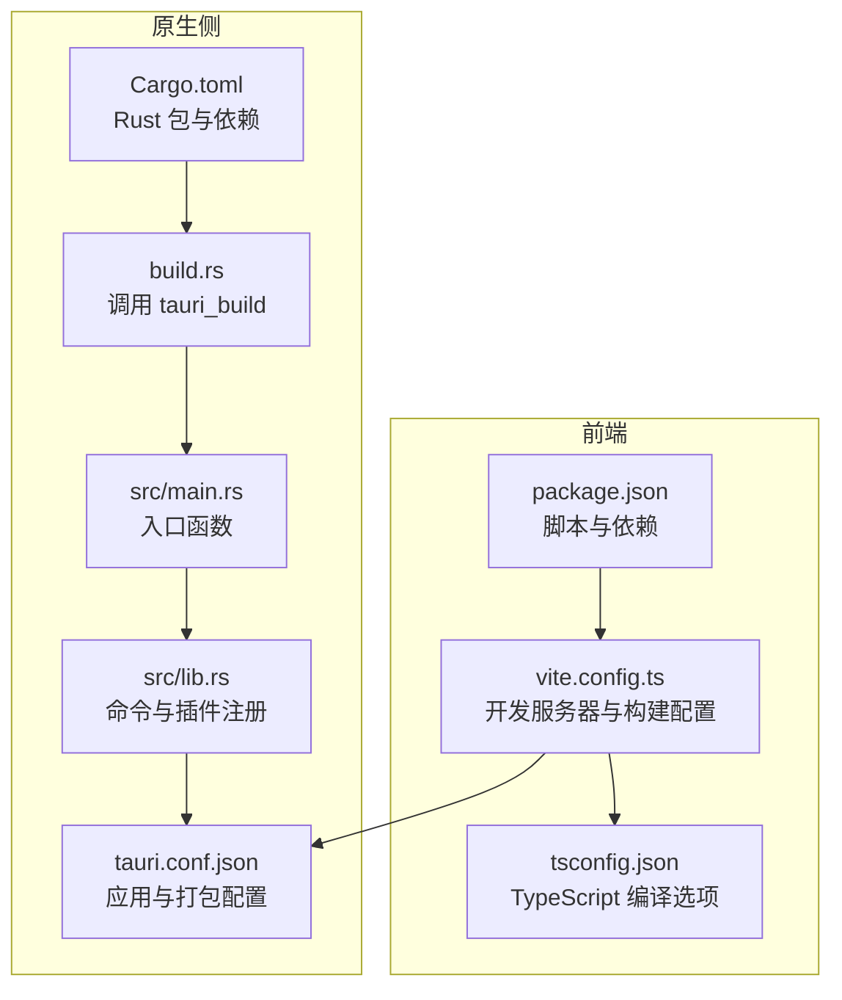
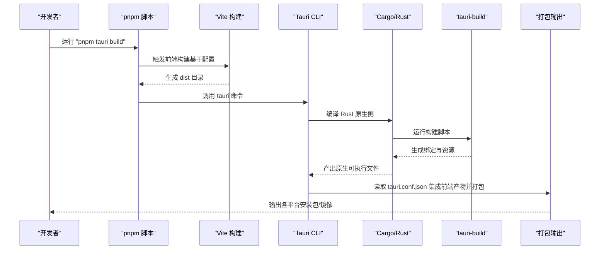
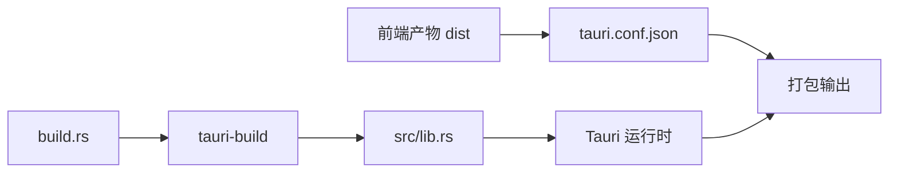

# 构建与部署

<cite>
**本文引用的文件**
- [package.json](file://package.json)
- [vite.config.ts](file://vite.config.ts)
- [tsconfig.json](file://tsconfig.json)
- [src-tauri/Cargo.toml](file://src-tauri/Cargo.toml)
- [src-tauri/build.rs](file://src-tauri/build.rs)
- [src-tauri/src/main.rs](file://src-tauri/src/main.rs)
- [src-tauri/src/lib.rs](file://src-tauri/src/lib.rs)
- [src-tauri/tauri.conf.json](file://src-tauri/tauri.conf.json)
- [README.md](file://README.md)
</cite>

## 目录
1. [简介](#简介)
2. [项目结构](#项目结构)
3. [核心组件](#核心组件)
4. [架构总览](#架构总览)
5. [详细组件分析](#详细组件分析)
6. [依赖关系分析](#依赖关系分析)
7. [性能考虑](#性能考虑)
8. [故障排查指南](#故障排查指南)
9. [结论](#结论)
10. [附录](#附录)

## 简介
本指南面向使用 Tauri + Vue + TypeScript 技术栈的开发者，系统性讲解从本地开发到生产构建与多平台打包的完整流程。重点覆盖以下方面：
- pnpm tauri build 命令工作流：前端构建、Rust 编译与最终打包
- 多平台构建配置：Windows、macOS、Linux 的差异与依赖
- 生产环境优化：代码压缩、资源优化、依赖精简
- 应用签名与公证（macOS）：证书、权限与公证流程
- CI/CD 集成：自动化构建与发布
- 版本管理与发布策略：语义化版本与变更日志维护

## 项目结构
该仓库采用前后端分离的组织方式：
- 前端位于根目录，使用 Vite + Vue + TypeScript 进行开发与构建
- 原生侧位于 src-tauri，使用 Rust + Tauri 进行应用封装与打包
- 通过 tauri.conf.json 将前端产物与原生侧进行集成

图表来源
- [package.json:1-25](file://package.json#L1-L25)
- [vite.config.ts:1-33](file://vite.config.ts#L1-L33)
- [tsconfig.json:1-26](file://tsconfig.json#L1-L26)
- [src-tauri/Cargo.toml:1-26](file://src-tauri/Cargo.toml#L1-L26)
- [src-tauri/build.rs:1-4](file://src-tauri/build.rs#L1-L4)
- [src-tauri/src/main.rs:1-7](file://src-tauri/src/main.rs#L1-L7)
- [src-tauri/src/lib.rs:1-15](file://src-tauri/src/lib.rs#L1-L15)
- [src-tauri/tauri.conf.json:1-36](file://src-tauri/tauri.conf.json#L1-L36)

章节来源
- [package.json:1-25](file://package.json#L1-L25)
- [vite.config.ts:1-33](file://vite.config.ts#L1-L33)
- [tsconfig.json:1-26](file://tsconfig.json#L1-L26)
- [src-tauri/Cargo.toml:1-26](file://src-tauri/Cargo.toml#L1-L26)
- [src-tauri/build.rs:1-4](file://src-tauri/build.rs#L1-L4)
- [src-tauri/src/main.rs:1-7](file://src-tauri/src/main.rs#L1-L7)
- [src-tauri/src/lib.rs:1-15](file://src-tauri/src/lib.rs#L1-L15)
- [src-tauri/tauri.conf.json:1-36](file://src-tauri/tauri.conf.json#L1-L36)

## 核心组件
- 前端构建链路：Vite 负责开发服务器与生产构建；TypeScript 提供类型检查；pnpm 作为包管理器与脚本执行器
- 原生侧编译链路：Cargo 管理 Rust 依赖与构建；tauri-build 在构建时生成绑定；Rust 程序在运行时由 Tauri 启动
- 打包与集成：tauri.conf.json 指定前端产物目录、窗口与安全策略、图标与打包目标；最终由 Tauri CLI 统一打包

章节来源
- [package.json:6-11](file://package.json#L6-L11)
- [vite.config.ts:8-32](file://vite.config.ts#L8-L32)
- [tsconfig.json:2-22](file://tsconfig.json#L2-L22)
- [src-tauri/Cargo.toml:10-25](file://src-tauri/Cargo.toml#L10-L25)
- [src-tauri/build.rs:1-4](file://src-tauri/build.rs#L1-L4)
- [src-tauri/tauri.conf.json:6-34](file://src-tauri/tauri.conf.json#L6-L34)

## 架构总览
下图展示 pnpm tauri build 的端到端流程：从前端构建到 Rust 编译，再到最终打包。

图表来源
- [package.json:6-11](file://package.json#L6-L11)
- [vite.config.ts:8-32](file://vite.config.ts#L8-L32)
- [src-tauri/tauri.conf.json:6-11](file://src-tauri/tauri.conf.json#L6-L11)
- [src-tauri/build.rs:1-4](file://src-tauri/build.rs#L1-L4)
- [src-tauri/Cargo.toml:17-25](file://src-tauri/Cargo.toml#L17-L25)

## 详细组件分析

### 前端构建与开发服务器
- 开发服务器：固定端口与严格端口模式，支持热重载与跨主机开发
- 构建产物：dist 目录，供原生侧在打包阶段集成
- 类型检查：在构建前执行类型检查，避免运行期错误

章节来源
- [vite.config.ts:11-31](file://vite.config.ts#L11-L31)
- [package.json:8](file://package.json#L8)
- [tsconfig.json:17-22](file://tsconfig.json#L17-L22)

### 原生侧编译与命令注册
- 入口函数：根据调试或发布配置设置子系统（Windows），随后启动应用
- 命令与插件：注册命令与插件（如 opener），统一由 Tauri 上下文运行
- 构建脚本：通过 tauri_build::build 完成绑定生成与资源处理

章节来源
- [src-tauri/src/main.rs:1-7](file://src-tauri/src/main.rs#L1-L7)
- [src-tauri/src/lib.rs:2-14](file://src-tauri/src/lib.rs#L2-L14)
- [src-tauri/build.rs:1-4](file://src-tauri/build.rs#L1-L4)

### 打包与多平台配置
- 打包目标：全平台打包
- 图标与资源：提供多尺寸图标与平台特定格式
- 窗口与安全：定义窗口初始尺寸与 CSP 策略
- 前端集成：指定前端构建产物目录与开发地址

章节来源
- [src-tauri/tauri.conf.json:24-34](file://src-tauri/tauri.conf.json#L24-L34)
- [src-tauri/tauri.conf.json:12-23](file://src-tauri/tauri.conf.json#L12-L23)
- [src-tauri/tauri.conf.json:6-11](file://src-tauri/tauri.conf.json#L6-L11)

### 依赖与工具链
- 前端依赖：Vue、@tauri-apps/api、@tauri-apps/plugin-opener
- 原生依赖：tauri、tauri-plugin-opener、serde 系列
- 开发依赖：@vitejs/plugin-vue、typescript、vite、@tauri-apps/cli

章节来源
- [package.json:12-23](file://package.json#L12-L23)
- [src-tauri/Cargo.toml:20-25](file://src-tauri/Cargo.toml#L20-L25)

## 依赖关系分析
- 前端与原生侧通过 tauri.conf.json 关联：前端构建产物目录与原生侧打包流程耦合
- 原生侧通过 tauri-build 与 Rust 工具链协作，生成绑定与资源
- 插件体系：opener 插件在原生侧注册，供前端通过 @tauri-apps/api 使用

图表来源
- [src-tauri/tauri.conf.json:6-11](file://src-tauri/tauri.conf.json#L6-L11)
- [src-tauri/src/lib.rs:8-14](file://src-tauri/src/lib.rs#L8-L14)
- [src-tauri/build.rs:1-4](file://src-tauri/build.rs#L1-L4)

章节来源
- [src-tauri/tauri.conf.json:6-11](file://src-tauri/tauri.conf.json#L6-L11)
- [src-tauri/src/lib.rs:8-14](file://src-tauri/src/lib.rs#L8-L14)
- [src-tauri/build.rs:1-4](file://src-tauri/build.rs#L1-L4)

## 性能考虑
- 生产构建优化
  - 前端：启用最小化与 Tree Shaking（由 Vite 默认行为实现），确保仅引入所需模块
  - 原生侧：使用 Release 构建配置，禁用调试符号以减小体积
- 资源优化
  - 图标与静态资源：按需裁剪至目标分辨率，避免冗余格式
  - 内联与外链：合理区分内联资源与外部资源，平衡加载速度与缓存效率
- 依赖精简
  - 移除未使用依赖，定期审计依赖树
  - 对第三方插件进行必要性评估，减少不必要的功能

## 故障排查指南
- 端口冲突
  - 现象：开发服务器无法启动
  - 排查：确认固定端口是否被占用，或调整严格端口模式
- 构建失败
  - 现象：前端类型检查或构建报错
  - 排查：先执行类型检查，再进行构建；检查 tsconfig 与 Vite 配置
- 打包异常
  - 现象：打包后无前端内容或图标缺失
  - 排查：核对 tauri.conf.json 中前端产物目录与图标路径
- 原生侧编译问题
  - 现象：Rust 编译错误或 tauri-build 失败
  - 排查：清理 Cargo 缓存与目标目录，重新安装依赖；检查 build.rs 与 tauri-build 版本匹配

章节来源
- [vite.config.ts:14-18](file://vite.config.ts#L14-L18)
- [package.json:8](file://package.json#L8)
- [src-tauri/tauri.conf.json:6-11](file://src-tauri/tauri.conf.json#L6-L11)
- [src-tauri/build.rs:1-4](file://src-tauri/build.rs#L1-L4)

## 结论
本指南提供了从开发到生产的完整构建与部署路径，结合项目现有配置，建议在生产环境中进一步完善：
- 明确各平台的签名与公证流程（尤其是 macOS）
- 引入 CI/CD 自动化流水线，确保一致性与可追溯性
- 建立版本管理与变更日志规范，保障发布质量

## 附录

### 多平台构建配置要点
- Windows
  - 依赖：Windows SDK、MSVC 或 MinGW 工具链
  - 注意：入口函数中针对非调试模式设置子系统
- macOS
  - 依赖：Xcode 命令行工具
  - 签名与公证：为应用签名并提交公证，确保沙盒与权限合规
- Linux
  - 依赖：GTK、libwebkit2gtk 等运行时库
  - 打包：常见格式为 AppImage、deb、rpm

章节来源
- [src-tauri/src/main.rs:1-2](file://src-tauri/src/main.rs#L1-L2)

### 应用签名与公证（macOS）
- 证书与权限
  - 获取开发者证书与团队信息
  - 配置应用权限（如访问文件、网络等）
- 公证流程
  - 使用 Apple 公证服务提交二进制进行公证
  - 通过 Gatekeeper 校验后方可分发

### CI/CD 集成示例思路
- 触发条件：推送标签或合并到主分支
- 步骤概览：
  - 安装依赖（pnpm、Rust 工具链、平台 SDK）
  - 前端构建与类型检查
  - 原生侧编译与打包
  - 生成安装包并上传制品
  - 发布到分发渠道（如 GitHub Releases）

### 版本管理与发布策略
- 语义化版本：遵循主.次.补丁规则，结合变更类型决定版本号
- 变更日志：记录重大修复、新增功能与破坏性变更
- 标签与发布：以 Git 标签作为发布依据，自动化产出对应版本的安装包