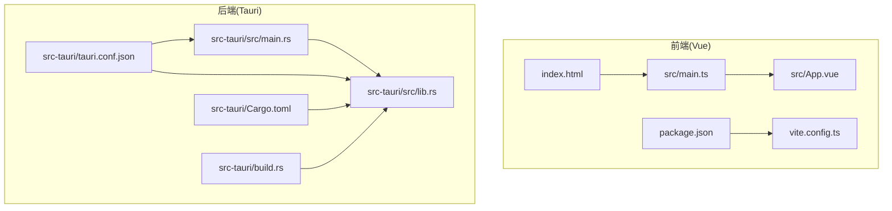
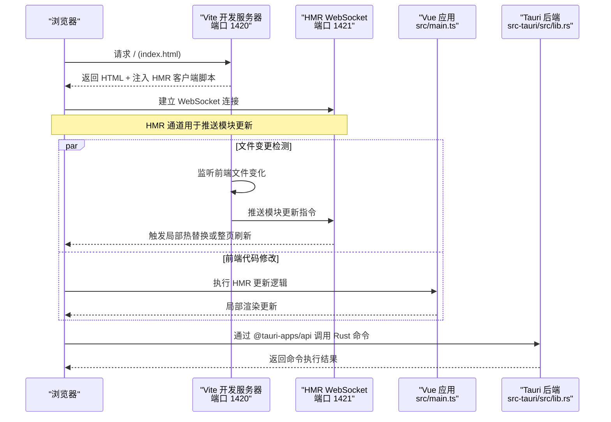
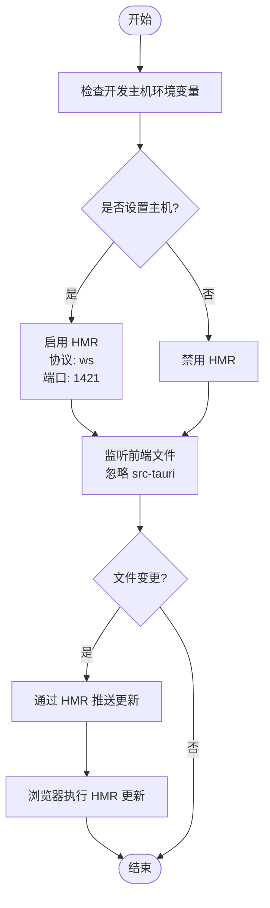
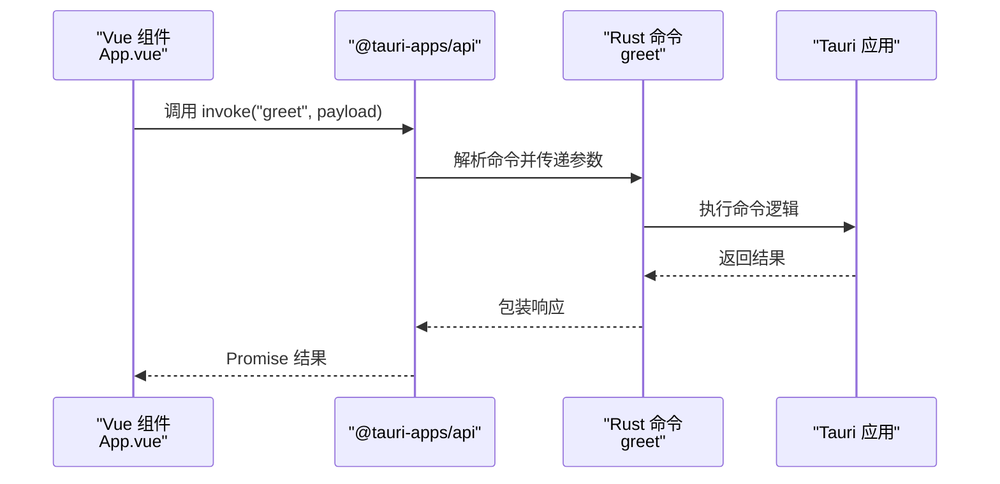
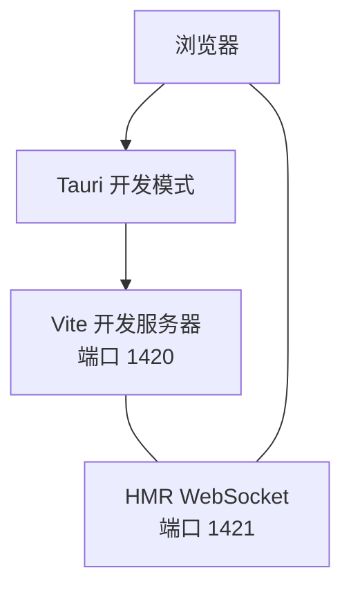
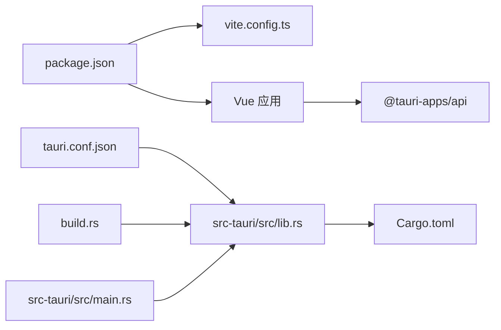

# 热重载机制

<cite>
**本文引用的文件**
- [vite.config.ts](file://vite.config.ts)
- [package.json](file://package.json)
- [tauri.conf.json](file://src-tauri/tauri.conf.json)
- [main.ts](file://src/main.ts)
- [App.vue](file://src/App.vue)
- [index.html](file://index.html)
- [lib.rs](file://src-tauri/src/lib.rs)
- [main.rs](file://src-tauri/src/main.rs)
- [Cargo.toml](file://src-tauri/Cargo.toml)
- [build.rs](file://src-tauri/build.rs)
</cite>

## 目录
1. [简介](#简介)
2. [项目结构](#项目结构)
3. [核心组件](#核心组件)
4. [架构总览](#架构总览)
5. [详细组件分析](#详细组件分析)
6. [依赖关系分析](#依赖关系分析)
7. [性能考量](#性能考量)
8. [故障排查指南](#故障排查指南)
9. [结论](#结论)
10. [附录](#附录)

## 简介
本文件深入解析 Tauri + Vue 应用在开发模式下的热重载（Hot Module Replacement, HMR）机制，涵盖前端 Vite 的文件监听与 HMR 协议、浏览器端更新策略；以及后端 Tauri 在开发流程中的配合方式与命令调用。同时给出触发条件与限制、常见问题排查方法、以及开发服务器间通信与同步策略。

## 项目结构
该仓库采用典型的 Tauri + Vue 三层结构：前端使用 Vite + Vue 3（SFC），后端使用 Rust（Tauri v2）。开发时通过 Tauri 配置将前端开发服务器地址绑定到固定端口，确保 HMR WebSocket 连接稳定。

图表来源
- [index.html:1-15](file://index.html#L1-L15)
- [main.ts:1-5](file://src/main.ts#L1-L5)
- [App.vue:1-160](file://src/App.vue#L1-L160)
- [vite.config.ts:1-33](file://vite.config.ts#L1-L33)
- [package.json:1-25](file://package.json#L1-L25)
- [tauri.conf.json:1-36](file://src-tauri/tauri.conf.json#L1-L36)
- [lib.rs:1-15](file://src-tauri/src/lib.rs#L1-L15)
- [main.rs:1-7](file://src-tauri/src/main.rs#L1-L7)
- [Cargo.toml:1-26](file://src-tauri/Cargo.toml#L1-L26)
- [build.rs:1-4](file://src-tauri/build.rs#L1-L4)

章节来源
- [vite.config.ts:1-33](file://vite.config.ts#L1-L33)
- [package.json:1-25](file://package.json#L1-L25)
- [tauri.conf.json:1-36](file://src-tauri/tauri.conf.json#L1-L36)
- [index.html:1-15](file://index.html#L1-L15)
- [main.ts:1-5](file://src/main.ts#L1-L5)
- [App.vue:1-160](file://src/App.vue#L1-L160)
- [lib.rs:1-15](file://src-tauri/src/lib.rs#L1-L15)
- [main.rs:1-7](file://src-tauri/src/main.rs#L1-L7)
- [Cargo.toml:1-26](file://src-tauri/Cargo.toml#L1-L26)
- [build.rs:1-4](file://src-tauri/build.rs#L1-L4)

## 核心组件
- 前端开发服务器与 HMR
  - Vite 作为开发服务器，固定端口 1420，严格端口占用，避免冲突。
  - HMR 使用 WebSocket，当环境变量指定主机时启用，协议为 ws，端口 1421。
  - 忽略对 src-tauri 的监听，防止误触发前端热更新。
- Tauri 开发流程
  - Tauri 配置在开发阶段指向本地前端地址 http://localhost:1420。
  - 前端通过 @tauri-apps/api 调用 Rust 命令，实现前后端交互。
- Vue 应用入口
  - 入口文件创建应用并挂载到页面根节点，模板中包含与 Tauri/Vite/Vue 的示例交互。

章节来源
- [vite.config.ts:15-31](file://vite.config.ts#L15-L31)
- [tauri.conf.json:6-11](file://src-tauri/tauri.conf.json#L6-L11)
- [main.ts:1-5](file://src/main.ts#L1-L5)
- [App.vue:1-12](file://src/App.vue#L1-L12)

## 架构总览
下图展示开发模式下浏览器、Vite/HMR、Tauri 后端三者之间的交互路径与职责边界。

图表来源
- [vite.config.ts:16-26](file://vite.config.ts#L16-L26)
- [index.html:10-13](file://index.html#L10-L13)
- [main.ts:1-5](file://src/main.ts#L1-L5)
- [lib.rs:2-12](file://src-tauri/src/lib.rs#L2-L12)
- [tauri.conf.json:7-8](file://src-tauri/tauri.conf.json#L7-L8)

## 详细组件分析

### 前端热重载实现（Vite + Vue）
- 文件监听与忽略规则
  - Vite 监听前端源码目录，但显式忽略 src-tauri，避免将后端代码纳入前端热更新范围。
- HMR 协议与连接
  - 当存在开发主机环境变量时，启用 HMR，并通过 ws 协议连接到指定主机与端口（1421）。
  - HMR 通道负责向浏览器推送模块更新指令，浏览器端根据模块类型决定局部替换或整页刷新。
- 浏览器端更新策略
  - Vue SFC 组件支持按模块粒度热替换，样式与逻辑可增量更新。
  - 若模块无法被 HMR 处理，则回退到整页刷新以保证一致性。
- 入口与模板
  - index.html 中引入前端入口脚本，Vue 应用在 main.ts 中创建并挂载，App.vue 提供交互示例。

图表来源
- [vite.config.ts:5-31](file://vite.config.ts#L5-L31)
- [index.html:10-13](file://index.html#L10-L13)
- [main.ts:1-5](file://src/main.ts#L1-L5)
- [App.vue:1-12](file://src/App.vue#L1-L12)

章节来源
- [vite.config.ts:16-31](file://vite.config.ts#L16-L31)
- [index.html:10-13](file://index.html#L10-L13)
- [main.ts:1-5](file://src/main.ts#L1-L5)
- [App.vue:1-12](file://src/App.vue#L1-L12)

### Tauri 后端的热重载与命令交互
- 开发服务器绑定
  - Tauri 配置在开发阶段将 devUrl 指向本地前端地址，确保窗口加载的是 Vite 提供的页面。
- 命令定义与调用
  - 后端通过 #[tauri::command] 定义命令，前端通过 @tauri-apps/api 的 invoke 调用。
  - 示例命令 greet 将参数传给后端处理并返回字符串结果。
- 状态保持与生命周期
  - Tauri 应用运行在独立进程中，前端热更新不会影响后端进程状态。
  - 若后端需要响应前端变更（例如重新初始化某些资源），可在前端 HMR 回调中触发相应逻辑或通过命令通知后端。

图表来源
- [App.vue:8-11](file://src/App.vue#L8-L11)
- [lib.rs:2-5](file://src-tauri/src/lib.rs#L2-L5)
- [tauri.conf.json:7-8](file://src-tauri/tauri.conf.json#L7-L8)

章节来源
- [tauri.conf.json:6-11](file://src-tauri/tauri.conf.json#L6-L11)
- [lib.rs:2-12](file://src-tauri/src/lib.rs#L2-L12)
- [App.vue:8-11](file://src/App.vue#L8-L11)

### 开发服务器间的通信与同步策略
- 前端开发服务器
  - 固定端口 1420，严格端口占用，避免与其他服务冲突。
  - HMR 通道独立于主 HTTP 服务，端口 1421，协议 ws。
- Tauri 与前端的同步
  - Tauri 在开发阶段直接加载本地前端地址，确保浏览器与 Vite 保持一致的开发体验。
  - HMR 更新通过 WebSocket 推送，浏览器端按模块粒度进行替换，减少刷新成本。

图表来源
- [vite.config.ts:16-26](file://vite.config.ts#L16-L26)
- [tauri.conf.json:7-8](file://src-tauri/tauri.conf.json#L7-L8)

章节来源
- [vite.config.ts:16-26](file://vite.config.ts#L16-L26)
- [tauri.conf.json:7-8](file://src-tauri/tauri.conf.json#L7-L8)

## 依赖关系分析
- 前端依赖
  - Vue 3、@vitejs/plugin-vue、Vite、@tauri-apps/api 等。
- 后端依赖
  - Tauri v2、tauri-plugin-opener、serde 系列等。
- 构建与运行
  - build.rs 调用 tauri_build，Cargo.toml 定义库与二进制目标，main.rs 负责启动应用。

图表来源
- [package.json:1-25](file://package.json#L1-L25)
- [vite.config.ts:1-33](file://vite.config.ts#L1-L33)
- [tauri.conf.json:1-36](file://src-tauri/tauri.conf.json#L1-L36)
- [lib.rs:1-15](file://src-tauri/src/lib.rs#L1-L15)
- [main.rs:1-7](file://src-tauri/src/main.rs#L1-L7)
- [Cargo.toml:1-26](file://src-tauri/Cargo.toml#L1-L26)
- [build.rs:1-4](file://src-tauri/build.rs#L1-L4)

章节来源
- [package.json:1-25](file://package.json#L1-L25)
- [vite.config.ts:1-33](file://vite.config.ts#L1-L33)
- [tauri.conf.json:1-36](file://src-tauri/tauri.conf.json#L1-L36)
- [lib.rs:1-15](file://src-tauri/src/lib.rs#L1-L15)
- [main.rs:1-7](file://src-tauri/src/main.rs#L1-L7)
- [Cargo.toml:1-26](file://src-tauri/Cargo.toml#L1-L26)
- [build.rs:1-4](file://src-tauri/build.rs#L1-L4)

## 性能考量
- HMR 粒度优化
  - Vue SFC 支持按模块热替换，优先局部更新，减少整页刷新带来的状态丢失。
- 监听范围控制
  - 显式忽略 src-tauri，避免无关文件变更触发前端热更新，降低不必要的计算与网络开销。
- 端口与协议选择
  - 固定端口与严格端口占用，有助于快速定位冲突；ws 协议轻量且适合频繁消息推送。
- 前端构建与预览
  - 开发阶段由 Vite 提供热更新，生产构建通过 vite build 输出静态资源，与 Tauri 的 devUrl 和 dist 配置协同工作。

## 故障排查指南
- HMR 不生效
  - 检查是否设置了开发主机环境变量，若未设置则 HMR 会被禁用。
  - 确认 HMR WebSocket 端口 1421 可用且未被防火墙阻断。
  - 查看浏览器开发者工具的网络面板，确认 HMR WebSocket 已建立。
- 端口冲突
  - Vite 使用严格端口，若 1420 或 1421 被占用，启动会失败。请释放端口或调整配置。
- 前端文件未触发更新
  - 确认修改的文件位于前端源码目录，而非 src-tauri。
  - 检查 Vite 插件与配置是否正确加载。
- 后端命令调用异常
  - 确认命令已在后端注册并在运行上下文中可用。
  - 检查前端 invoke 调用的命令名与参数是否匹配。
- 状态丢失
  - 若模块不支持 HMR，浏览器可能回退整页刷新。可在组件中实现状态保存与恢复逻辑，或在 HMR 回调中手动处理。

章节来源
- [vite.config.ts:14-31](file://vite.config.ts#L14-L31)
- [tauri.conf.json:7-8](file://src-tauri/tauri.conf.json#L7-L8)
- [lib.rs:2-12](file://src-tauri/src/lib.rs#L2-L12)
- [App.vue:8-11](file://src/App.vue#L8-L11)

## 结论
本项目通过 Vite 的固定端口与严格端口策略、HMR WebSocket 通道以及对 src-tauri 的监听排除，实现了高效的前端热重载体验。Tauri 在开发阶段直接加载本地前端地址，使浏览器与 Vite 保持一致的开发环境。后端通过命令系统与前端交互，前端热更新不影响后端进程状态。遵循本文的触发条件、限制与排障建议，可获得稳定流畅的开发体验。

## 附录
- 关键配置要点
  - Vite 开发服务器端口与 HMR 端口、协议与主机设置。
  - Tauri 开发 URL 与构建前命令。
  - Vue 入口与模板结构。
- 建议实践
  - 在组件中合理组织可热替换的模块边界，减少不可 HMR 的模块数量。
  - 对需要持久化的状态，在 HMR 回调中进行保存与恢复。
  - 使用浏览器开发者工具的网络面板与控制台，辅助定位 HMR 与命令调用问题。