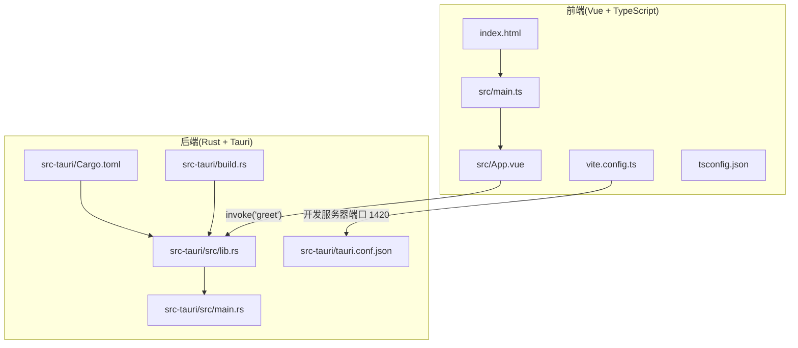
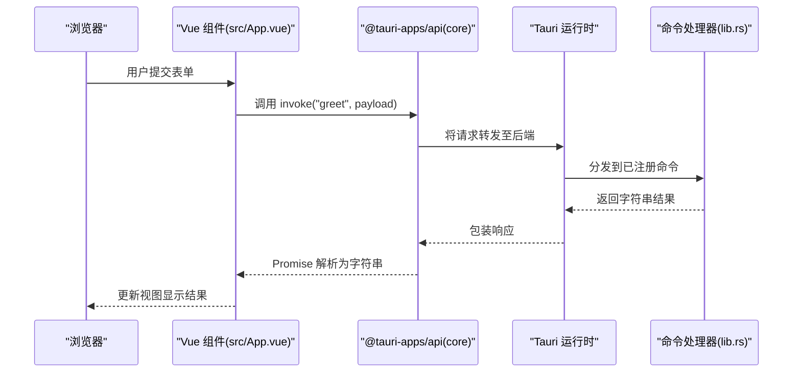
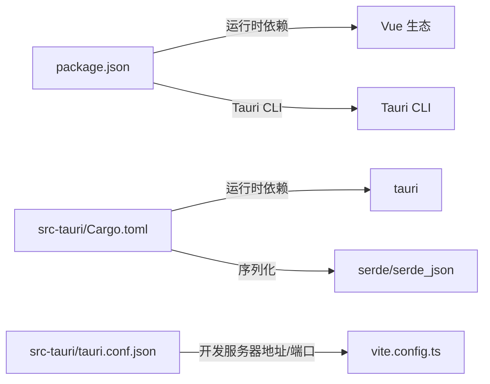

# 调试与故障排除

<cite>
**本文引用的文件**
- [README.md](file://README.md)
- [AGENTS.md](file://AGENTS.md)
- [package.json](file://package.json)
- [vite.config.ts](file://vite.config.ts)
- [tsconfig.json](file://tsconfig.json)
- [src-tauri/Cargo.toml](file://src-tauri/Cargo.toml)
- [src-tauri/tauri.conf.json](file://src-tauri/tauri.conf.json)
- [src-tauri/build.rs](file://src-tauri/build.rs)
- [src-tauri/src/main.rs](file://src-tauri/src/main.rs)
- [src-tauri/src/lib.rs](file://src-tauri/src/lib.rs)
- [src/main.ts](file://src/main.ts)
- [src/App.vue](file://src/App.vue)
- [index.html](file://index.html)
- [src/vite-env.d.ts](file://src/vite-env.d.ts)
</cite>

## 目录
1. [简介](#简介)
2. [项目结构](#项目结构)
3. [核心组件](#核心组件)
4. [架构总览](#架构总览)
5. [详细组件分析](#详细组件分析)
6. [依赖关系分析](#依赖关系分析)
7. [性能考虑](#性能考虑)
8. [故障排除指南](#故障排除指南)
9. [结论](#结论)
10. [附录](#附录)

## 简介
本指南面向使用 Tauri + Vue + TypeScript 的桌面应用开发者，提供从浏览器端到 Rust 后端的全链路调试与故障排除方法。内容涵盖：
- 浏览器开发者工具：Vue DevTools、网络面板、控制台调试
- Rust 错误诊断：编译错误定位、运行时堆栈跟踪、日志输出
- Tauri 命令调试：invoke 调用断点设置、参数校验
- 常见问题与解决方案：命令调用失败、类型不匹配、构建错误
- 性能分析：内存使用监控、启动时间分析
- 日志系统配置与最佳实践

## 项目结构
该仓库采用前后端分离的典型结构：
- 前端（Vue 3 + TypeScript + Vite）位于 src/，通过 Vite 在开发模式下监听固定端口
- 后端（Rust + Tauri 2）位于 src-tauri/，通过 tauri.conf.json 配置开发服务器地址与打包路径
- 构建脚本在 package.json 中定义，开发与构建流程由 Tauri CLI 驱动

图表来源
- [src/main.ts:1-5](file://src/main.ts#L1-L5)
- [src/App.vue:1-160](file://src/App.vue#L1-L160)
- [index.html:1-14](file://index.html#L1-L14)
- [vite.config.ts:1-33](file://vite.config.ts#L1-L33)
- [tsconfig.json:1-26](file://tsconfig.json#L1-L26)
- [src-tauri/src/lib.rs:1-15](file://src-tauri/src/lib.rs#L1-L15)
- [src-tauri/src/main.rs:1-7](file://src-tauri/src/main.rs#L1-L7)
- [src-tauri/tauri.conf.json:1-36](file://src-tauri/tauri.conf.json#L1-L36)
- [src-tauri/Cargo.toml:1-26](file://src-tauri/Cargo.toml#L1-L26)
- [src-tauri/build.rs:1-4](file://src-tauri/build.rs#L1-L4)

章节来源
- [AGENTS.md:73-106](file://AGENTS.md#L73-L106)
- [vite.config.ts:11-32](file://vite.config.ts#L11-L32)
- [src-tauri/tauri.conf.json:6-11](file://src-tauri/tauri.conf.json#L6-L11)

## 核心组件
- 前端入口与应用组件
  - 入口文件负责创建并挂载 Vue 应用
  - 主应用组件包含一个基于表单的交互示例，通过 invoke 调用后端命令
- 后端命令与应用初始化
  - 定义了 greet 命令，返回字符串结果
  - 初始化阶段注册插件并生成命令处理函数列表
- 开发服务器与构建配置
  - Vite 固定端口 1420，严格端口占用，避免冲突
  - Tauri 配置指定开发前命令、前端产物目录与窗口尺寸

章节来源
- [src/main.ts:1-5](file://src/main.ts#L1-L5)
- [src/App.vue:1-160](file://src/App.vue#L1-L160)
- [src-tauri/src/lib.rs:1-15](file://src-tauri/src/lib.rs#L1-L15)
- [src-tauri/src/main.rs:1-7](file://src-tauri/src/main.rs#L1-L7)
- [vite.config.ts:16-31](file://vite.config.ts#L16-L31)
- [src-tauri/tauri.conf.json:6-11](file://src-tauri/tauri.conf.json#L6-L11)

## 架构总览
下图展示了从前端发起 invoke 到后端命令执行的端到端流程。

图表来源
- [src/App.vue:8-11](file://src/App.vue#L8-L11)
- [src-tauri/src/lib.rs:2-14](file://src-tauri/src/lib.rs#L2-L14)
- [src-tauri/tauri.conf.json:6-11](file://src-tauri/tauri.conf.json#L6-L11)

## 详细组件分析

### 前端调试要点（浏览器）
- Vue DevTools 使用
  - 打开浏览器开发者工具，切换到 Vue 面板，观察组件树、响应式数据与事件流
  - 在示例中可检查输入框与消息展示的双向绑定状态
- 网络面板调试
  - 观察 invoke 请求是否成功发送到开发服务器（默认 http://localhost:1420）
  - 检查响应体是否包含预期字符串；若失败，查看状态码与错误信息
- 控制台调试
  - 在调用处设置断点，逐步检查 payload 参数类型与值
  - 捕获并打印异常，结合后端错误信息定位问题

章节来源
- [src/App.vue:1-160](file://src/App.vue#L1-L160)
- [vite.config.ts:16-31](file://vite.config.ts#L16-L31)
- [src-tauri/tauri.conf.json:7-10](file://src-tauri/tauri.conf.json#L7-L10)

### Rust 命令调试要点
- 编译错误定位
  - Vite 在开发模式下禁用清屏，确保 Rust 编译错误直接显示在终端
  - 若端口被占用，严格端口模式会阻止启动，需释放 1420 端口
- 运行时错误与堆栈跟踪
  - 使用标准错误输出或第三方日志库记录上下文
  - 对于复杂逻辑，拆分函数并在关键节点添加日志
- 日志输出
  - 可在命令实现中输出关键参数与中间结果，便于前端验证

章节来源
- [vite.config.ts:13-14](file://vite.config.ts#L13-L14)
- [vite.config.ts:16-18](file://vite.config.ts#L16-L18)
- [src-tauri/src/lib.rs:2-5](file://src-tauri/src/lib.rs#L2-L5)

### Tauri 命令调试技巧（invoke）
- 断点设置
  - 在前端调用点设置断点，确认命令名与 payload 结构一致
  - 在后端命令实现处设置断点，验证入参类型与边界条件
- 参数验证
  - 前端：在提交前进行基本校验（非空、长度、格式）
  - 后端：对入参进行类型转换与范围校验，必要时返回明确错误信息

章节来源
- [src/App.vue:8-11](file://src/App.vue#L8-L11)
- [src-tauri/src/lib.rs:2-5](file://src-tauri/src/lib.rs#L2-L5)

### 类型系统与严格模式
- TypeScript 严格模式开启，有助于提前发现潜在问题
- Vue 单文件组件使用 <script setup>，建议保持类型安全与命名规范

章节来源
- [tsconfig.json:18-21](file://tsconfig.json#L18-L21)
- [AGENTS.md:42-47](file://AGENTS.md#L42-L47)
- [AGENTS.md:57-61](file://AGENTS.md#L57-L61)

## 依赖关系分析
- 前端依赖
  - Vue 3、@tauri-apps/api、@tauri-apps/plugin-opener 等
- 后端依赖
  - tauri、serde、serde_json、tauri-plugin-opener 等
- 构建与开发
  - Tauri CLI、Vite、TypeScript 编译器

图表来源
- [package.json:12-23](file://package.json#L12-L23)
- [src-tauri/Cargo.toml:20-25](file://src-tauri/Cargo.toml#L20-L25)
- [src-tauri/tauri.conf.json:6-11](file://src-tauri/tauri.conf.json#L6-L11)
- [vite.config.ts:1-33](file://vite.config.ts#L1-L33)

章节来源
- [package.json:12-23](file://package.json#L12-L23)
- [src-tauri/Cargo.toml:20-25](file://src-tauri/Cargo.toml#L20-L25)

## 性能考虑
- 内存使用监控
  - 浏览器开发者工具的性能面板可用于捕获内存快照，对比操作前后的对象保留情况
- 启动时间分析
  - 使用性能面板记录首次绘制与脚本执行时间，关注 Vite HMR 与 Tauri 初始化耗时
- 网络与渲染优化
  - 减少不必要的 invoke 调用频率，合并请求或引入节流/防抖策略

## 故障排除指南

### 1. 命令调用失败
- 症状
  - 前端报错或无响应
- 排查步骤
  - 检查命令名是否正确（区分大小写）
  - 确认 payload 结构与后端签名一致
  - 查看网络面板中的请求与响应
  - 在后端命令实现处设置断点，验证入参类型与边界
- 相关文件
  - [src/App.vue:8-11](file://src/App.vue#L8-L11)
  - [src-tauri/src/lib.rs:2-5](file://src-tauri/src/lib.rs#L2-L5)

章节来源
- [src/App.vue:8-11](file://src/App.vue#L8-L11)
- [src-tauri/src/lib.rs:2-5](file://src-tauri/src/lib.rs#L2-L5)

### 2. 类型不匹配
- 症状
  - TypeScript 编译报错或运行时报错
- 排查步骤
  - 启用严格模式，逐项修复未使用变量、未使用参数等问题
  - 在 Vue SFC 中保持 props 与 emits 的类型标注
- 相关文件
  - [tsconfig.json:18-21](file://tsconfig.json#L18-L21)
  - [AGENTS.md:42-47](file://AGENTS.md#L42-L47)
  - [AGENTS.md:57-61](file://AGENTS.md#L57-L61)

章节来源
- [tsconfig.json:18-21](file://tsconfig.json#L18-L21)
- [AGENTS.md:42-47](file://AGENTS.md#L42-L47)
- [AGENTS.md:57-61](file://AGENTS.md#L57-L61)

### 3. 构建错误
- 症状
  - 前端类型检查失败或 Vite 构建中断
- 排查步骤
  - 使用脚本进行类型检查与构建
  - 关注 Vite 清屏关闭导致的 Rust 错误可见性
  - 确保开发服务器端口 1420 可用
- 相关文件
  - [package.json:6-11](file://package.json#L6-L11)
  - [vite.config.ts:13-14](file://vite.config.ts#L13-L14)
  - [vite.config.ts:16-18](file://vite.config.ts#L16-L18)

章节来源
- [package.json:6-11](file://package.json#L6-L11)
- [vite.config.ts:13-14](file://vite.config.ts#L13-L14)
- [vite.config.ts:16-18](file://vite.config.ts#L16-L18)

### 4. 开发服务器端口占用
- 症状
  - 启动失败或端口冲突
- 排查步骤
  - 释放 1420 端口或调整配置
  - 若通过 TAURI_DEV_HOST 设置 HMR，确认主机与端口配置
- 相关文件
  - [vite.config.ts:16-26](file://vite.config.ts#L16-L26)
  - [src-tauri/tauri.conf.json:7-10](file://src-tauri/tauri.conf.json#L7-L10)

章节来源
- [vite.config.ts:16-26](file://vite.config.ts#L16-L26)
- [src-tauri/tauri.conf.json:7-10](file://src-tauri/tauri.conf.json#L7-L10)

### 5. 日志系统配置与最佳实践
- 最佳实践
  - 前端：在关键流程打印上下文信息，避免过量日志
  - 后端：使用结构化日志记录命令名、参数与结果
  - 统一日志级别与格式，便于检索与聚合
- 相关文件
  - [src-tauri/src/lib.rs:2-5](file://src-tauri/src/lib.rs#L2-L5)

章节来源
- [src-tauri/src/lib.rs:2-5](file://src-tauri/src/lib.rs#L2-L5)

## 结论
通过结合浏览器开发者工具、Rust 编译与运行时日志、以及 Tauri 命令的端到端调试，可以高效定位并解决跨语言链路的问题。建议在开发早期启用严格类型检查与统一的日志规范，以降低后期维护成本。

## 附录

### A. 常用命令速查
- 启动开发环境（前端 + Tauri）
  - [AGENTS.md:14-17](file://AGENTS.md#L14-L17)
- 仅启动前端开发服务器
  - [AGENTS.md](file://AGENTS.md#L16)
- 构建与预览
  - [AGENTS.md:21-24](file://AGENTS.md#L21-L24)

### B. 关键配置一览
- 前端入口与 HTML
  - [src/main.ts:1-5](file://src/main.ts#L1-L5)
  - [index.html:1-14](file://index.html#L1-L14)
- Vite 开发服务器
  - [vite.config.ts:16-31](file://vite.config.ts#L16-L31)
- Tauri 配置
  - [src-tauri/tauri.conf.json:6-11](file://src-tauri/tauri.conf.json#L6-L11)
- Rust 依赖与命令
  - [src-tauri/Cargo.toml:20-25](file://src-tauri/Cargo.toml#L20-L25)
  - [src-tauri/src/lib.rs:1-15](file://src-tauri/src/lib.rs#L1-L15)
  - [src-tauri/src/main.rs:1-7](file://src-tauri/src/main.rs#L1-L7)
  - [src-tauri/build.rs:1-4](file://src-tauri/build.rs#L1-L4)