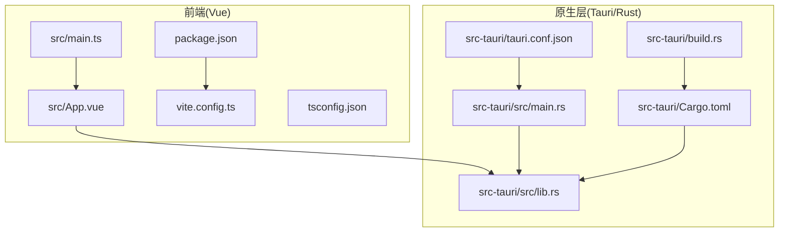
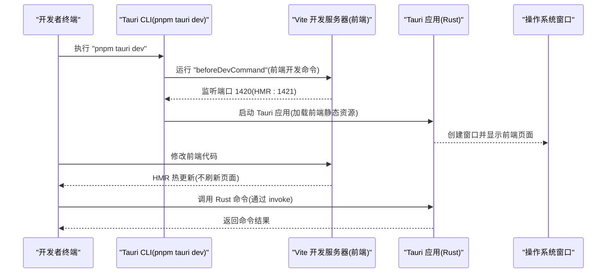
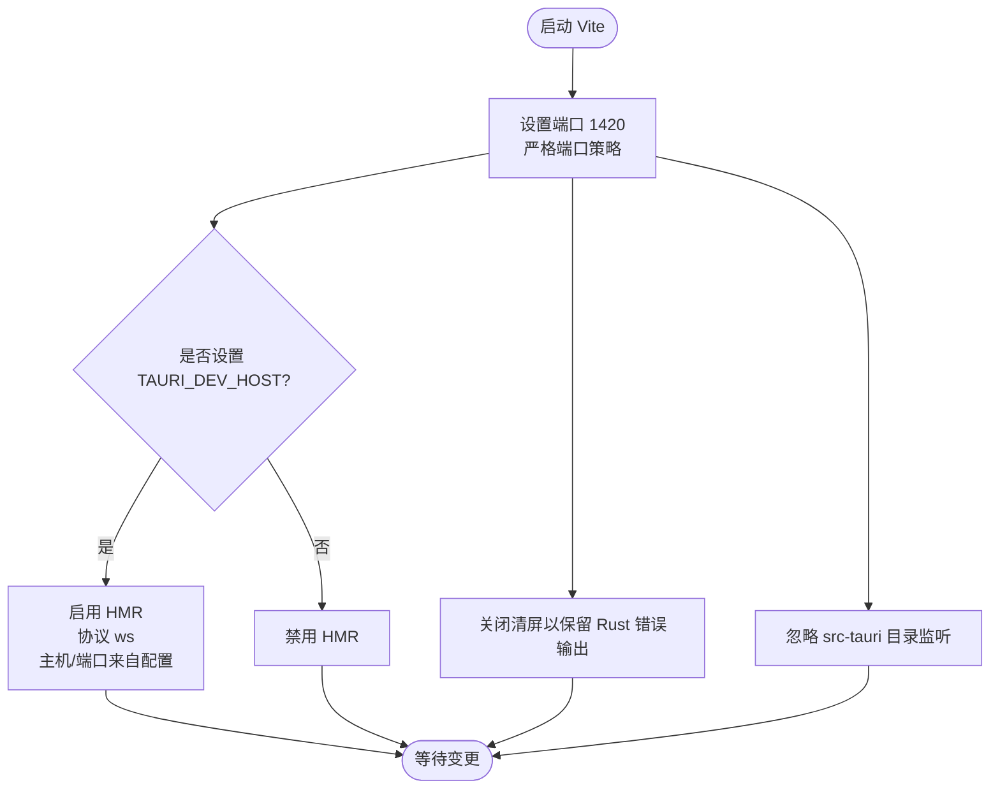
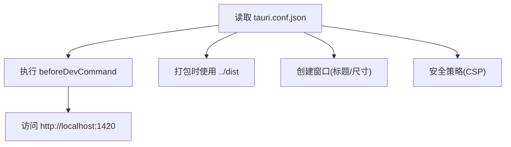
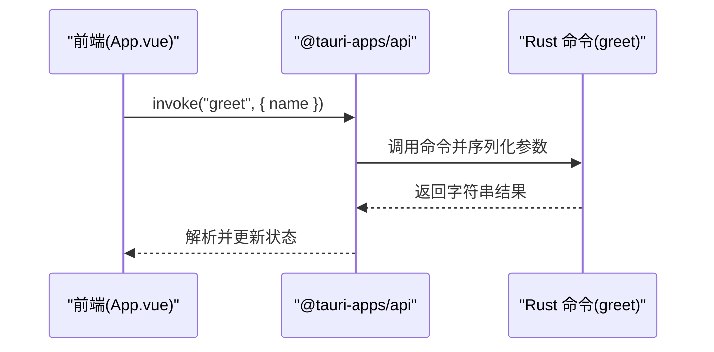
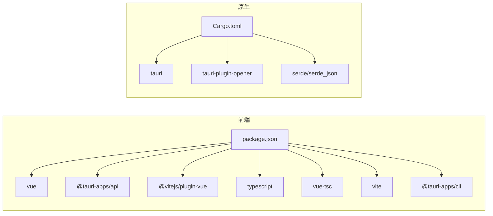

# 快速开始

<cite>
**本文引用的文件**
- [README.md](file://README.md)
- [AGENTS.md](file://AGENTS.md)
- [package.json](file://package.json)
- [vite.config.ts](file://vite.config.ts)
- [src-tauri/tauri.conf.json](file://src-tauri/tauri.conf.json)
- [src-tauri/Cargo.toml](file://src-tauri/Cargo.toml)
- [src-tauri/src/lib.rs](file://src-tauri/src/lib.rs)
- [src-tauri/src/main.rs](file://src-tauri/src/main.rs)
- [src-tauri/build.rs](file://src-tauri/build.rs)
- [src/main.ts](file://src/main.ts)
- [src/App.vue](file://src/App.vue)
- [tsconfig.json](file://tsconfig.json)
- [tsconfig.node.json](file://tsconfig.node.json)
</cite>

## 目录
1. [简介](#简介)
2. [项目结构](#项目结构)
3. [核心组件](#核心组件)
4. [架构总览](#架构总览)
5. [详细组件分析](#详细组件分析)
6. [依赖关系分析](#依赖关系分析)
7. [性能与开发体验](#性能与开发体验)
8. [故障排除指南](#故障排除指南)
9. [结论](#结论)
10. [附录：IDE 推荐与类型支持](#附录ide-推荐与类型支持)

## 简介
本指南面向希望快速搭建并运行 Tauri + Vue 桌面应用的开发者。你将获得：
- 完整的环境要求与安装步骤
- 从克隆到首次运行的分步指引
- 开发服务器启动命令的工作原理与组件启动顺序
- Vite 热重载与 Tauri 原生开发环境的协同机制
- 常见问题的排查与解决思路
- IDE 推荐配置与 Vue 组件 TypeScript 类型支持启用方法

## 项目结构
该仓库采用“前端 Vue + 后端 Rust（通过 Tauri）”的双工程结构，使用 pnpm 作为包管理器。关键目录与文件如下：
- 前端：src（入口 main.ts、主组件 App.vue）、vite.config.ts、tsconfig.json、package.json
- 原生层：src-tauri（Rust 库与可执行入口、Cargo.toml、tauri.conf.json、build.rs）
- 其他：public、index.html、.gitignore、AGENTS.md、README.md

图表来源
- [src/main.ts:1-5](file://src/main.ts#L1-L5)
- [src/App.vue:1-160](file://src/App.vue#L1-L160)
- [vite.config.ts:1-33](file://vite.config.ts#L1-L33)
- [tsconfig.json:1-26](file://tsconfig.json#L1-L26)
- [package.json:1-25](file://package.json#L1-L25)
- [src-tauri/src/lib.rs:1-15](file://src-tauri/src/lib.rs#L1-L15)
- [src-tauri/src/main.rs:1-7](file://src-tauri/src/main.rs#L1-L7)
- [src-tauri/Cargo.toml:1-26](file://src-tauri/Cargo.toml#L1-L26)
- [src-tauri/tauri.conf.json:1-36](file://src-tauri/tauri.conf.json#L1-L36)
- [src-tauri/build.rs:1-4](file://src-tauri/build.rs#L1-L4)

章节来源
- [AGENTS.md:73-90](file://AGENTS.md#L73-L90)
- [package.json:1-25](file://package.json#L1-L25)
- [vite.config.ts:1-33](file://vite.config.ts#L1-L33)
- [src-tauri/tauri.conf.json:1-36](file://src-tauri/tauri.conf.json#L1-L36)

## 核心组件
- 前端应用入口与组件
  - 应用入口：在前端入口中创建并挂载 Vue 应用，渲染根组件。
  - 主组件：示例包含一个调用 Tauri 命令的交互逻辑，展示前后端通信。
- 原生层（Rust/Tauri）
  - 命令实现：定义可被前端调用的 Rust 命令，并在应用启动时注册。
  - 应用入口：设置插件、命令处理器与上下文，启动 Tauri 应用。
  - 配置：Tauri 构建前命令、开发服务器地址、打包图标等。
- 构建与开发工具
  - Vite：开发服务器、热重载、打包。
  - TypeScript：严格模式、模块解析、类型检查。
  - Tauri CLI：统一的开发与构建命令。

章节来源
- [src/main.ts:1-5](file://src/main.ts#L1-L5)
- [src/App.vue:1-160](file://src/App.vue#L1-L160)
- [src-tauri/src/lib.rs:1-15](file://src-tauri/src/lib.rs#L1-L15)
- [src-tauri/src/main.rs:1-7](file://src-tauri/src/main.rs#L1-L7)
- [src-tauri/tauri.conf.json:1-36](file://src-tauri/tauri.conf.json#L1-L36)
- [vite.config.ts:1-33](file://vite.config.ts#L1-L33)
- [tsconfig.json:1-26](file://tsconfig.json#L1-L26)
- [package.json:1-25](file://package.json#L1-L25)

## 架构总览
下图展示了“pnpm tauri dev”启动时，各组件之间的协作流程与启动顺序。

图表来源
- [AGENTS.md:13-17](file://AGENTS.md#L13-L17)
- [src-tauri/tauri.conf.json:6-11](file://src-tauri/tauri.conf.json#L6-L11)
- [vite.config.ts:16-31](file://vite.config.ts#L16-L31)
- [src/App.vue:8-11](file://src/App.vue#L8-L11)
- [src-tauri/src/lib.rs:2-5](file://src-tauri/src/lib.rs#L2-L5)

## 详细组件分析

### Vite 开发服务器与热重载
- 固定端口与严格端口策略：开发服务器固定监听 1420，若端口被占用则直接失败，避免端口漂移导致的调试问题。
- HMR 配置：当设置 TAURI_DEV_HOST 时，启用 WebSocket HMR，协议为 ws，主机与端口由配置决定；未设置时禁用 HMR。
- 屏蔽屏幕清理：防止 Vite 在编译错误时清屏，便于查看 Rust 错误信息。
- 忽略监听：忽略对 src-tauri 的文件变更监听，避免不必要的重新编译。

图表来源
- [vite.config.ts:14-31](file://vite.config.ts#L14-L31)

章节来源
- [vite.config.ts:1-33](file://vite.config.ts#L1-L33)

### Tauri 配置与启动顺序
- 开发前命令：在启动 Tauri 前先运行前端开发命令，确保前端静态资源可用。
- 开发 URL：前端开发服务器地址固定为 http://localhost:1420。
- 打包配置：构建后前端产物输出到 ../dist，供 Tauri 加载。
- 应用窗口：默认窗口尺寸与标题在配置中定义。
- 安全策略：CSP 默认为空，允许开发阶段灵活调试。

图表来源
- [src-tauri/tauri.conf.json:6-23](file://src-tauri/tauri.conf.json#L6-L23)

章节来源
- [src-tauri/tauri.conf.json:1-36](file://src-tauri/tauri.conf.json#L1-L36)

### Rust 命令与前端调用
- 命令定义：在 Rust 中通过特性宏声明命令，返回值与参数类型由 serde 支持。
- 应用启动：在应用初始化时注册命令处理器，生成上下文并运行。
- 前端调用：前端通过 invoke 调用命令，传入参数并接收返回值。

图表来源
- [src/App.vue:8-11](file://src/App.vue#L8-L11)
- [src-tauri/src/lib.rs:2-5](file://src-tauri/src/lib.rs#L2-L5)

章节来源
- [src/App.vue:1-160](file://src/App.vue#L1-L160)
- [src-tauri/src/lib.rs:1-15](file://src-tauri/src/lib.rs#L1-L15)

### TypeScript 与模块解析
- 严格模式：开启严格模式与多项未使用/无隐式返回等规则，提升代码质量。
- 模块解析：使用 bundler 模式，支持 TS 扩展名与 JSON 模块。
- 参考配置：tsconfig.json 引用 tsconfig.node.json，确保 Vite 配置类型正确。

章节来源
- [tsconfig.json:1-26](file://tsconfig.json#L1-L26)
- [tsconfig.node.json:1-11](file://tsconfig.node.json#L1-L11)

## 依赖关系分析
- 前端依赖
  - Vue 3 与 Vite：提供响应式框架与开发服务器。
  - @tauri-apps/api：提供与原生层通信的能力。
  - @vitejs/plugin-vue：Vite 的 Vue 插件。
  - TypeScript 与 vue-tsc：类型检查与构建。
- 原生依赖
  - tauri：Tauri 框架核心。
  - tauri-plugin-opener：系统打开器插件。
  - serde/serde_json：数据序列化与反序列化。
- 构建与开发
  - @tauri-apps/cli：Tauri CLI。
  - pnpm：包管理器与脚本执行。

图表来源
- [package.json:12-23](file://package.json#L12-L23)
- [src-tauri/Cargo.toml:17-25](file://src-tauri/Cargo.toml#L17-L25)

章节来源
- [package.json:1-25](file://package.json#L1-L25)
- [src-tauri/Cargo.toml:1-26](file://src-tauri/Cargo.toml#L1-L26)

## 性能与开发体验
- 端口固定与严格端口策略：避免端口冲突带来的反复调试成本。
- HMR 与忽略监听：减少不必要的编译与刷新，提升热更新效率。
- 清屏关闭：保留 Rust 编译错误输出，便于快速定位问题。
- 类型检查前置：在构建前进行类型检查，尽早发现类型问题。

章节来源
- [vite.config.ts:14-31](file://vite.config.ts#L14-L31)
- [AGENTS.md:26-29](file://AGENTS.md#L26-L29)

## 故障排除指南
- 端口被占用
  - 现象：启动失败或端口冲突。
  - 处理：释放 1420/1421 端口，或调整 Vite/HMR 配置。
  - 参考：固定端口与严格端口策略。
- HMR 不生效
  - 现象：修改前端代码后页面未热更新。
  - 处理：确认是否设置了 TAURI_DEV_HOST；检查 HMR 配置。
  - 参考：HMR 条件启用与端口配置。
- Rust 错误被清屏覆盖
  - 现象：编译错误被 Vite 清屏隐藏。
  - 处理：保持清屏关闭，或在终端中查看完整日志。
  - 参考：清屏关闭配置。
- 前端无法访问开发服务器
  - 现象：Tauri 无法加载前端页面。
  - 处理：确认 beforeDevCommand 已启动前端开发服务器；检查 devUrl 与 dist 输出路径。
  - 参考：开发前命令与前端产物路径。
- TypeScript 类型报错
  - 现象：构建时报类型错误。
  - 处理：先执行类型检查命令，修复类型问题后再构建。
  - 参考：类型检查前置与严格模式。

章节来源
- [vite.config.ts:14-31](file://vite.config.ts#L14-L31)
- [src-tauri/tauri.conf.json:6-11](file://src-tauri/tauri.conf.json#L6-L11)
- [AGENTS.md:26-29](file://AGENTS.md#L26-L29)

## 结论
通过本指南，你可以完成从环境准备到首次运行的全流程。建议在本地先单独验证前端开发服务器与 Tauri 原生层的独立运行，再使用统一命令启动完整开发环境。遇到问题时，优先检查端口占用、HMR 配置与类型检查结果。

## 附录：IDE 推荐与类型支持

### IDE 推荐配置
- VS Code + Volar + Tauri 插件 + rust-analyzer
- 为获得最佳体验，建议启用 Volar 的 Take Over 模式，从而在 .vue 文件中获得更准确的类型推断。

章节来源
- [README.md:5-16](file://README.md#L5-L16)

### 启用 Vue 组件的 TypeScript 类型支持
- 在 VS Code 中禁用默认的 TypeScript/JavaScript 扩展，启用 Volar 的 Take Over 模式，然后重载窗口。
- 该过程可确保 .vue 文件中的 props、事件与插槽具备完整的类型支持。

章节来源
- [README.md:9-16](file://README.md#L9-L16)

### 开发与构建命令速查
- 开发：启动完整开发环境（Vite + Tauri）
  - pnpm tauri dev
- 仅前端开发：启动 Vite 开发服务器（端口 1420）
  - pnpm dev
- 构建：构建桌面应用
  - pnpm tauri build
- 仅前端构建与类型检查
  - pnpm build
- 预览已构建的前端
  - pnpm preview

章节来源
- [AGENTS.md:13-24](file://AGENTS.md#L13-L24)
- [package.json:6-11](file://package.json#L6-L11)