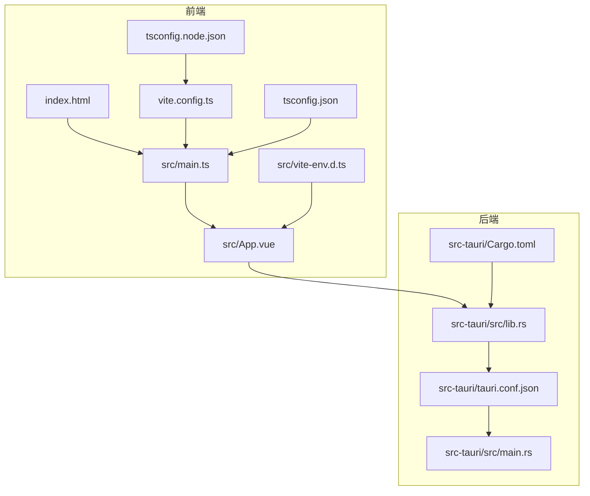
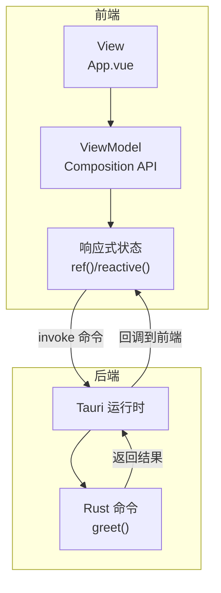
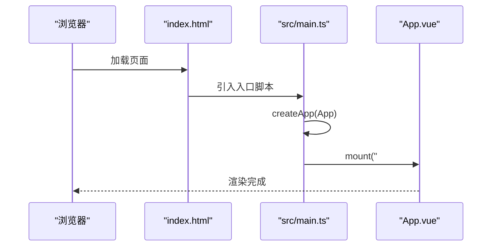
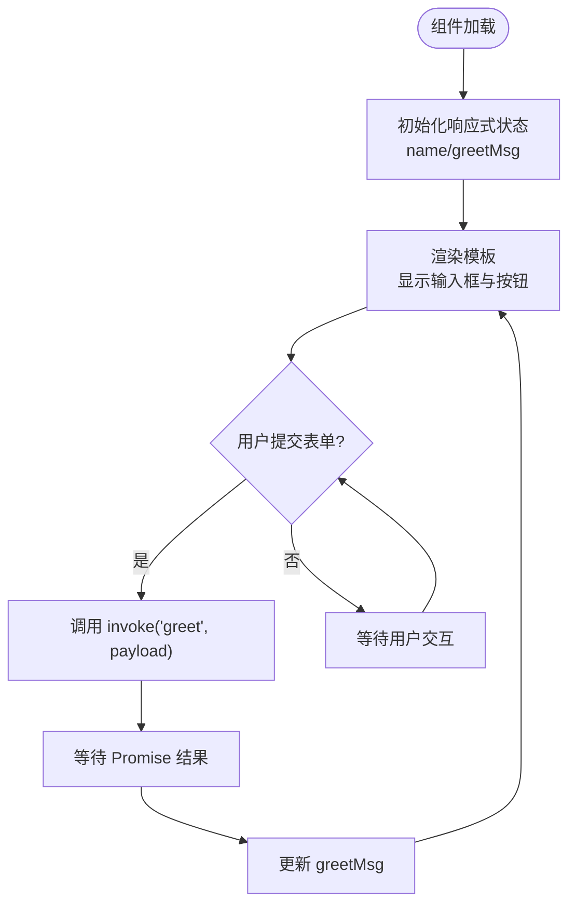
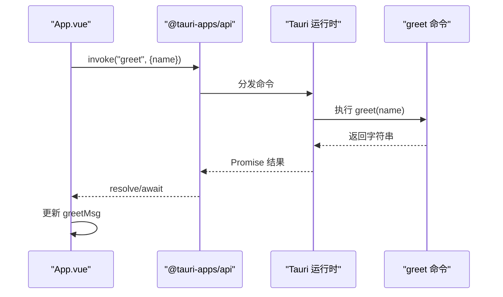
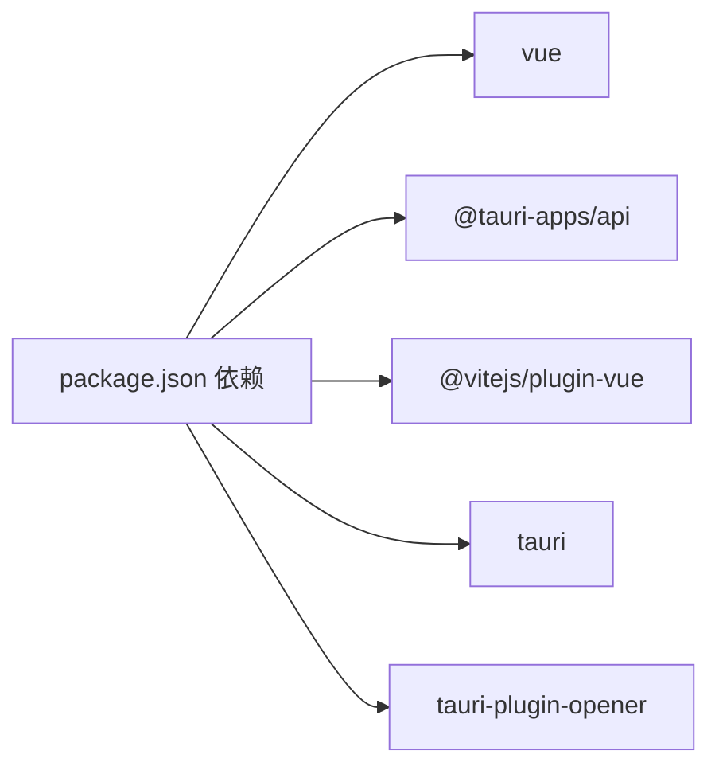

# 前端架构

<cite>
**本文引用的文件**
- [src/main.ts](file://src/main.ts)
- [src/App.vue](file://src/App.vue)
- [index.html](file://index.html)
- [vite.config.ts](file://vite.config.ts)
- [tsconfig.json](file://tsconfig.json)
- [tsconfig.node.json](file://tsconfig.node.json)
- [src/vite-env.d.ts](file://src/vite-env.d.ts)
- [package.json](file://package.json)
- [src-tauri/tauri.conf.json](file://src-tauri/tauri.conf.json)
- [src-tauri/src/lib.rs](file://src-tauri/src/lib.rs)
- [src-tauri/src/main.rs](file://src-tauri/src/main.rs)
- [src-tauri/Cargo.toml](file://src-tauri/Cargo.toml)
- [README.md](file://README.md)
</cite>

## 目录
1. [简介](#简介)
2. [项目结构](#项目结构)
3. [核心组件](#核心组件)
4. [架构总览](#架构总览)
5. [详细组件分析](#详细组件分析)
6. [依赖关系分析](#依赖关系分析)
7. [性能考量](#性能考量)
8. [故障排查指南](#故障排查指南)
9. [结论](#结论)
10. [附录](#附录)

## 简介
本项目是一个基于 Vue 3 + TypeScript + Vite 的前端应用，通过 Tauri 将 Web 技术与原生系统能力结合。应用采用 MVVM 架构模式：View（视图）由 Vue 单文件组件构成；Model（模型）通过响应式数据与后端 Rust 命令交互；ViewModel（视图模型）由 Composition API 提供逻辑与状态管理。本文档从架构视角解析应用初始化流程、组件设计原则、响应式绑定机制、TypeScript 类型保障、Vite 开发体验与热重载、Tauri 命令调用、异步与错误处理、以及性能优化与最佳实践。

## 项目结构
项目采用前后端分离但紧密集成的布局：
- 前端层：src 目录包含入口脚本、主组件、类型声明与构建配置
- 后端层：src-tauri 目录包含 Rust 应用与 Tauri 配置
- 根目录包含 HTML 入口、包管理与构建配置

图表来源
- [index.html:1-15](file://index.html#L1-L15)
- [src/main.ts:1-5](file://src/main.ts#L1-L5)
- [src/App.vue:1-160](file://src/App.vue#L1-L160)
- [vite.config.ts:1-33](file://vite.config.ts#L1-L33)
- [tsconfig.json:1-26](file://tsconfig.json#L1-L26)
- [tsconfig.node.json:1-11](file://tsconfig.node.json#L1-L11)
- [src/vite-env.d.ts:1-8](file://src/vite-env.d.ts#L1-L8)
- [src-tauri/tauri.conf.json:1-36](file://src-tauri/tauri.conf.json#L1-L36)
- [src-tauri/src/lib.rs:1-15](file://src-tauri/src/lib.rs#L1-L15)
- [src-tauri/src/main.rs:1-7](file://src-tauri/src/main.rs#L1-L7)
- [src-tauri/Cargo.toml:1-26](file://src-tauri/Cargo.toml#L1-L26)

章节来源
- [index.html:1-15](file://index.html#L1-L15)
- [src/main.ts:1-5](file://src/main.ts#L1-L5)
- [src/App.vue:1-160](file://src/App.vue#L1-L160)
- [vite.config.ts:1-33](file://vite.config.ts#L1-L33)
- [tsconfig.json:1-26](file://tsconfig.json#L1-L26)
- [tsconfig.node.json:1-11](file://tsconfig.node.json#L1-L11)
- [src/vite-env.d.ts:1-8](file://src/vite-env.d.ts#L1-L8)
- [src-tauri/tauri.conf.json:1-36](file://src-tauri/tauri.conf.json#L1-L36)
- [src-tauri/src/lib.rs:1-15](file://src-tauri/src/lib.rs#L1-L15)
- [src-tauri/src/main.rs:1-7](file://src-tauri/src/main.rs#L1-L7)
- [src-tauri/Cargo.toml:1-26](file://src-tauri/Cargo.toml#L1-L26)

## 核心组件
- 应用入口与挂载
  - 入口脚本负责创建 Vue 应用实例并将根组件挂载到 DOM 容器
  - 参考路径：[src/main.ts:1-5](file://src/main.ts#L1-L5)
- 主组件与模板
  - 使用 `<script setup>` 语法，定义响应式状态与异步方法
  - 通过 Tauri 的 invoke 调用后端命令，实现前后端交互
  - 参考路径：[src/App.vue:1-160](file://src/App.vue#L1-L160)
- 类型声明与模块声明
  - 为 Vite 环境与 .vue 模块提供类型支持，确保 TS 对 SFC 的类型推断
  - 参考路径：[src/vite-env.d.ts:1-8](file://src/vite-env.d.ts#L1-L8)
- 构建与开发配置
  - Vite 配置启用 Vue 插件、固定端口与 HMR，忽略后端目录
  - 参考路径：[vite.config.ts:1-33](file://vite.config.ts#L1-L33)
- TypeScript 编译选项
  - 严格模式、Bundler 模式、无 emit 的编译策略，保证类型安全
  - 参考路径：[tsconfig.json:1-26](file://tsconfig.json#L1-L26)，[tsconfig.node.json:1-11](file://tsconfig.node.json#L1-L11)
- 包管理与脚本
  - 定义开发、构建、预览与 Tauri 命令脚本
  - 参考路径：[package.json:1-25](file://package.json#L1-L25)

章节来源
- [src/main.ts:1-5](file://src/main.ts#L1-L5)
- [src/App.vue:1-160](file://src/App.vue#L1-L160)
- [src/vite-env.d.ts:1-8](file://src/vite-env.d.ts#L1-L8)
- [vite.config.ts:1-33](file://vite.config.ts#L1-L33)
- [tsconfig.json:1-26](file://tsconfig.json#L1-L26)
- [tsconfig.node.json:1-11](file://tsconfig.node.json#L1-L11)
- [package.json:1-25](file://package.json#L1-L25)

## 架构总览
该应用采用 MVVM 架构：
- Model 层：由 Tauri Rust 命令提供业务数据与服务，例如 greet 命令返回问候消息
- View 层：Vue 单文件组件负责渲染与用户交互
- ViewModel 层：Composition API 在组件内组织状态、事件与副作用，实现响应式更新

图表来源
- [src/App.vue:1-160](file://src/App.vue#L1-L160)
- [src-tauri/src/lib.rs:1-15](file://src-tauri/src/lib.rs#L1-L15)
- [src-tauri/src/main.rs:1-7](file://src-tauri/src/main.rs#L1-L7)

## 详细组件分析

### 应用入口与初始化流程
- 初始化步骤
  - HTML 中引入入口脚本并挂载到 #app 容器
  - 入口脚本创建 Vue 应用实例并挂载根组件
- 关键点
  - 固定挂载容器 ID 与入口脚本路径
  - 保持最小化初始化以降低启动开销
- 参考路径
  - [index.html:10-12](file://index.html#L10-L12)
  - [src/main.ts:1-5](file://src/main.ts#L1-L5)

图表来源
- [index.html:10-12](file://index.html#L10-L12)
- [src/main.ts:1-5](file://src/main.ts#L1-L5)
- [src/App.vue:1-160](file://src/App.vue#L1-L160)

章节来源
- [index.html:1-15](file://index.html#L1-L15)
- [src/main.ts:1-5](file://src/main.ts#L1-L5)

### 主组件设计与 MVVM 实现
- 设计原则
  - 使用 `<script setup>` 简化组合式 API 写法
  - 响应式状态通过 ref 管理，模板中直接绑定
  - 事件处理函数通过 v-on/@ 与 v-model 绑定
- MVVM 映射
  - Model：后端 greet 命令返回的数据
  - View：模板渲染与用户输入
  - ViewModel：组件内的状态与方法
- 参考路径
  - [src/App.vue:1-160](file://src/App.vue#L1-L160)

图表来源
- [src/App.vue:1-160](file://src/App.vue#L1-L160)

章节来源
- [src/App.vue:1-160](file://src/App.vue#L1-L160)

### 响应式数据绑定机制
- 数据流
  - 用户在模板中输入 name，v-model 双向绑定到响应式 ref
  - 触发 submit 事件后，组件方法读取 name 并调用 invoke
  - 后端命令返回字符串，赋值给 greetMsg，模板自动更新
- 复杂度与性能
  - 单次输入绑定为 O(1) 更新，模板渲染受组件规模影响
  - 建议避免在模板中进行复杂计算，将计算逻辑放入 computed 或在方法中缓存
- 参考路径
  - [src/App.vue:1-160](file://src/App.vue#L1-L160)

章节来源
- [src/App.vue:1-160](file://src/App.vue#L1-L160)

### TypeScript 配置与类型安全
- 编译策略
  - 严格模式开启，禁止未使用变量与参数，提升代码质量
  - 使用 Bundler 模式与无 emit，构建阶段由 Vite/Volar 处理
- 模块声明
  - 为 .vue 文件提供默认类型，配合 Volar Take Over 模式获得更精确的类型推断
- 参考路径
  - [tsconfig.json:1-26](file://tsconfig.json#L1-L26)
  - [tsconfig.node.json:1-11](file://tsconfig.node.json#L1-L11)
  - [src/vite-env.d.ts:1-8](file://src/vite-env.d.ts#L1-L8)
  - [README.md:9-16](file://README.md#L9-L16)

章节来源
- [tsconfig.json:1-26](file://tsconfig.json#L1-L26)
- [tsconfig.node.json:1-11](file://tsconfig.node.json#L1-L11)
- [src/vite-env.d.ts:1-8](file://src/vite-env.d.ts#L1-L8)
- [README.md:9-16](file://README.md#L9-L16)

### Vite 构建系统与开发服务器
- 插件与配置
  - 启用 @vitejs/plugin-vue，支持 Vue SFC 热重载
  - 固定开发端口与严格端口策略，确保 Tauri dev 一致性
  - HMR 支持可按环境变量动态配置，忽略 src-tauri 目录以减少监听开销
- 参考路径
  - [vite.config.ts:1-33](file://vite.config.ts#L1-L33)
  - [package.json:6-11](file://package.json#L6-L11)

章节来源
- [vite.config.ts:1-33](file://vite.config.ts#L1-L33)
- [package.json:6-11](file://package.json#L6-L11)

### Tauri 命令调用与异步处理
- 前端调用
  - 通过 @tauri-apps/api 的 invoke 方法发起命令，传入参数对象
  - 返回 Promise，需在组件方法中 await 获取结果
- 后端实现
  - Rust 侧定义 #[tauri::command] 函数，注册到运行时
  - greet 命令接收字符串参数并返回问候语
- 错误处理建议
  - 在组件方法中使用 try/catch 包裹 invoke
  - 设置 loading 状态与错误提示，避免界面卡顿
- 参考路径
  - [src/App.vue:8-11](file://src/App.vue#L8-L11)
  - [src-tauri/src/lib.rs:2-5](file://src-tauri/src/lib.rs#L2-L5)

图表来源
- [src/App.vue:8-11](file://src/App.vue#L8-L11)
- [src-tauri/src/lib.rs:2-5](file://src-tauri/src/lib.rs#L2-L5)

章节来源
- [src/App.vue:8-11](file://src/App.vue#L8-L11)
- [src-tauri/src/lib.rs:1-15](file://src-tauri/src/lib.rs#L1-L15)

### 组件间通信模式
- 当前项目为单页应用，组件间通信主要通过：
  - Props/Emits：父子组件传递数据与事件
  - 全局状态：在大型应用中可引入 Pinia 或 Vuex，当前项目未涉及
- 建议
  - 将公共状态抽取到全局 Store，减少跨层级传递
  - 使用 provide/inject 处理跨层级注入场景

[本节为概念性内容，不直接分析具体文件]

### 路由设计
- 本项目为单页应用，未包含路由配置
- 若扩展多页面：
  - 推荐使用 Vue Router，结合懒加载与命名路由
  - 在 Tauri 中通过 devUrl 指向 Vite 开发服务器

[本节为概念性内容，不直接分析具体文件]

### 状态管理模式
- 当前项目使用 Composition API 的局部状态
- 大型应用建议：
  - 引入 Pinia，集中管理全局状态
  - 使用 actions、getters 与持久化插件
- 生命周期钩子：
  - onMounted/onUnmounted 管理资源与订阅
  - onActivated/onDeactivated 处理 keep-alive 场景

[本节为概念性内容，不直接分析具体文件]

## 依赖关系分析
- 前端依赖
  - Vue 3：核心框架与 Composition API
  - @tauri-apps/api：与后端命令通信
  - @vitejs/plugin-vue：Vite 插件
- 后端依赖
  - tauri：应用运行时与命令系统
  - tauri-plugin-opener：系统打开器插件
- 构建链路
  - Vite 编译 TS/TSX/Vue 到 dist
  - Tauri 将 dist 作为前端资源打包

图表来源
- [package.json:12-23](file://package.json#L12-L23)
- [src-tauri/Cargo.toml:20-25](file://src-tauri/Cargo.toml#L20-L25)

章节来源
- [package.json:12-23](file://package.json#L12-L23)
- [src-tauri/Cargo.toml:20-25](file://src-tauri/Cargo.toml#L20-L25)

## 性能考量
- 构建与打包
  - 使用 Vite 的快速冷启动与按需编译
  - 严格端口与 HMR 避免不必要的刷新
- 运行时优化
  - 避免在模板中执行昂贵计算，使用 computed 缓存
  - 合理拆分组件，减少不必要的重渲染
- 网络与命令调用
  - 对频繁调用的命令进行节流或去抖
  - 在 UI 上提供 loading 状态与错误兜底
- 资源与样式
  - 使用 scoped 样式减少冲突
  - 按需引入插件与图标，避免冗余资源

[本节提供通用指导，不直接分析具体文件]

## 故障排查指南
- 开发服务器无法启动
  - 检查固定端口是否被占用，确认 strictPort 与 host 配置
  - 参考路径：[vite.config.ts:16-26](file://vite.config.ts#L16-L26)
- Tauri 无法连接前端
  - 确认 devUrl 与 Vite 端口一致
  - 参考路径：[src-tauri/tauri.conf.json:6-10](file://src-tauri/tauri.conf.json#L6-L10)
- 命令调用失败
  - 检查命令名称与参数类型是否匹配
  - 在组件方法中添加 try/catch 并记录错误
  - 参考路径：[src/App.vue:8-11](file://src/App.vue#L8-L11)，[src-tauri/src/lib.rs:2-5](file://src-tauri/src/lib.rs#L2-L5)
- 类型错误
  - 确保 .vue 模块类型声明存在
  - 参考路径：[src/vite-env.d.ts:3-7](file://src/vite-env.d.ts#L3-L7)

章节来源
- [vite.config.ts:16-26](file://vite.config.ts#L16-L26)
- [src-tauri/tauri.conf.json:6-10](file://src-tauri/tauri.conf.json#L6-L10)
- [src/App.vue:8-11](file://src/App.vue#L8-L11)
- [src-tauri/src/lib.rs:2-5](file://src-tauri/src/lib.rs#L2-L5)
- [src/vite-env.d.ts:3-7](file://src/vite-env.d.ts#L3-L7)

## 结论
本项目以简洁清晰的方式实现了 Vue 3 + Tauri 的前端架构：通过 Composition API 组织响应式状态与异步逻辑，借助 Vite 提供高效的开发体验与热重载，通过 Tauri 命令桥接前端与 Rust 后端。在保持类型安全的前提下，项目具备良好的可扩展性。建议在后续迭代中引入状态管理与路由体系，进一步完善大型应用的工程化实践。

[本节为总结性内容，不直接分析具体文件]

## 附录
- 最佳实践清单
  - 使用 Composition API 管理组件逻辑，保持单一职责
  - 在模板中避免复杂表达式，将计算逻辑前置
  - 对外部命令调用统一错误处理与加载态
  - 严格遵循 TypeScript 严格模式，减少潜在问题
  - 使用 Vite 的 HMR 与固定端口策略，提升开发效率

[本节为概念性内容，不直接分析具体文件]