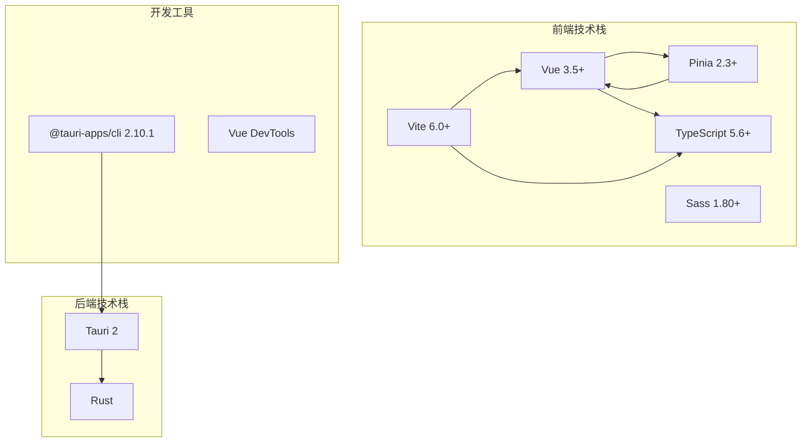
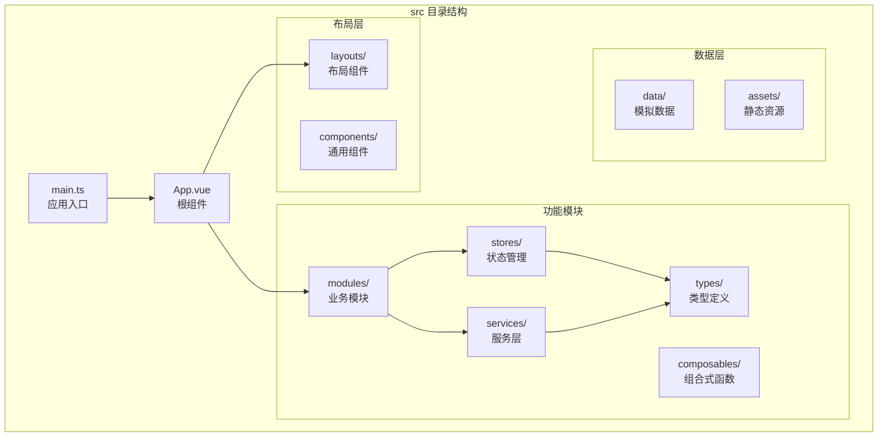
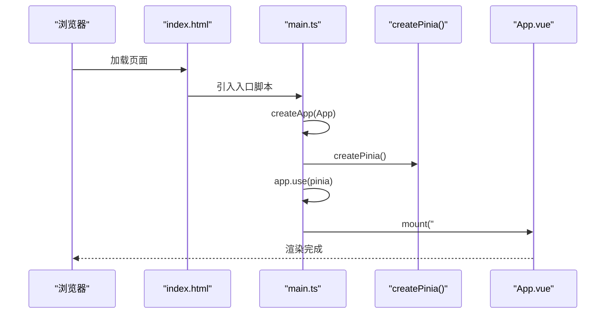
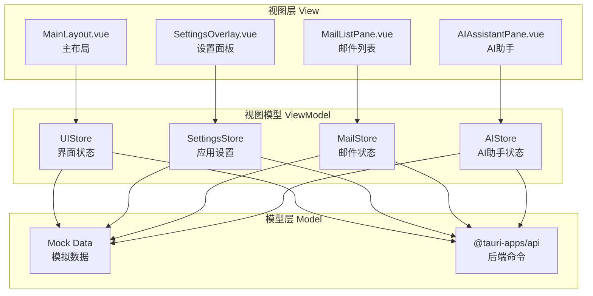
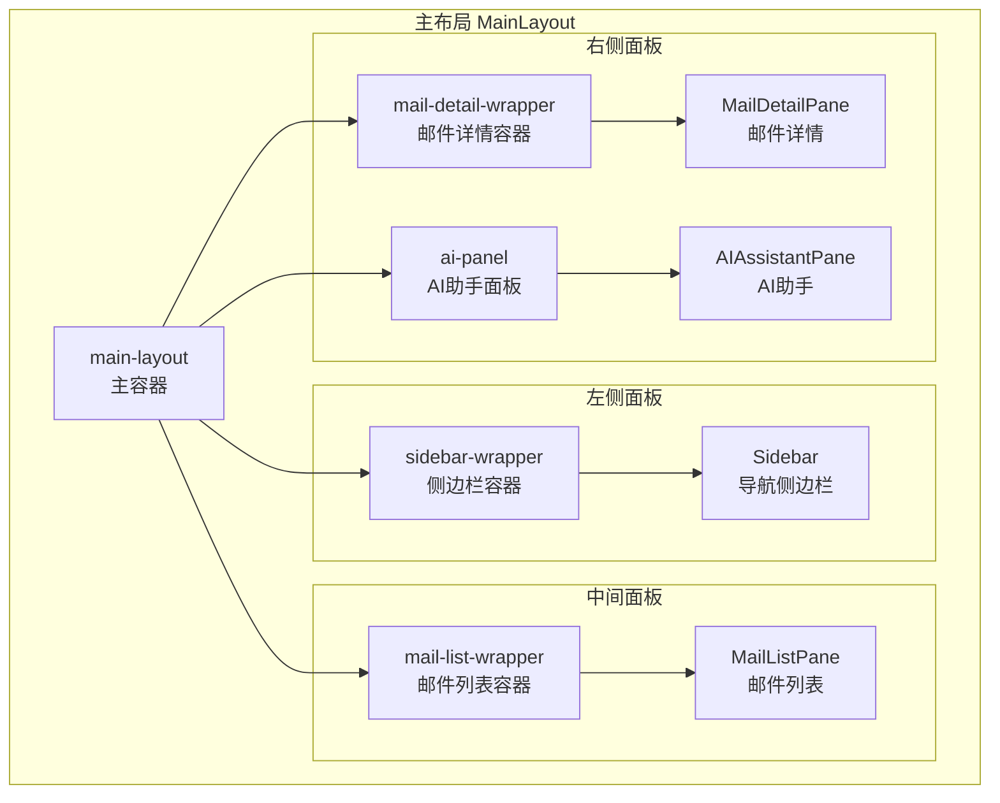
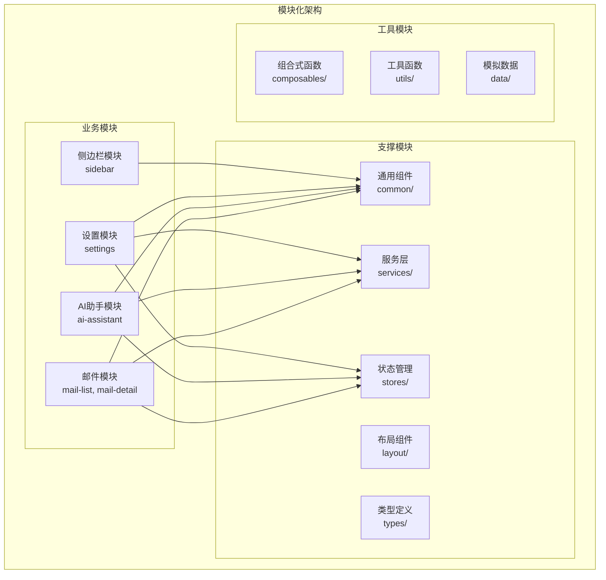
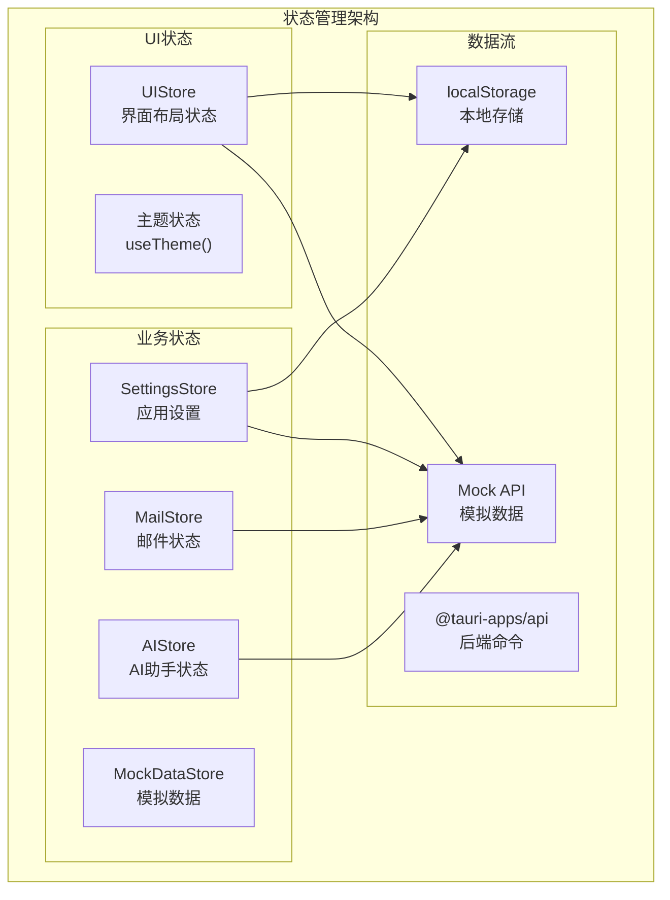
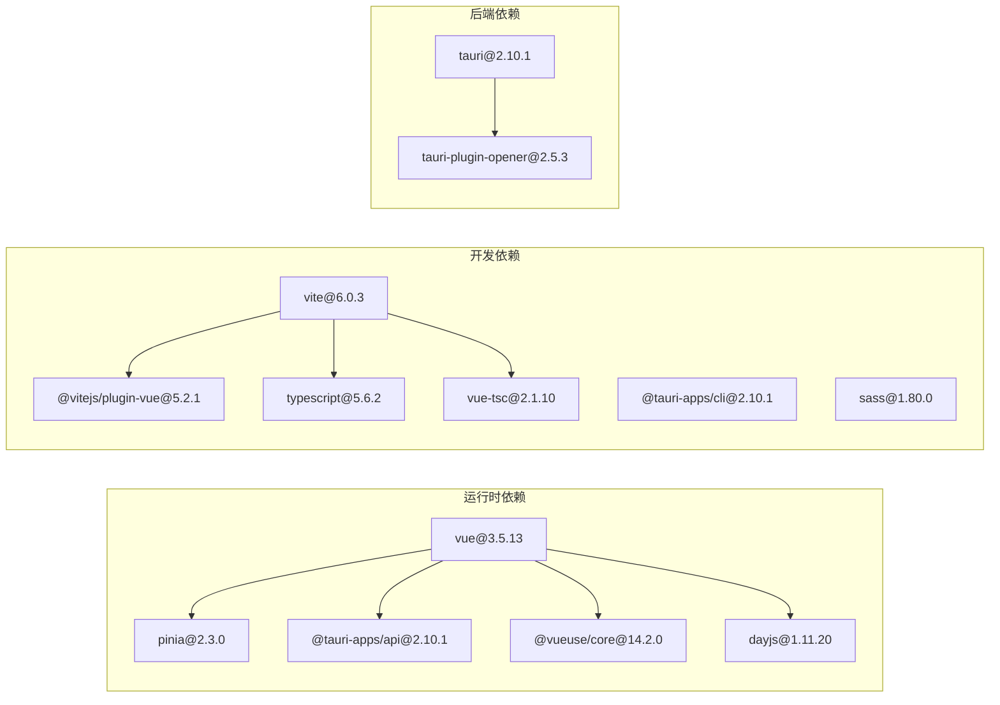

# 前端架构

<cite>
**本文引用的文件**
- [src/main.ts](file://src/main.ts)
- [src/App.vue](file://src/App.vue)
- [src/layouts/MainLayout.vue](file://src/layouts/MainLayout.vue)
- [src/modules/settings/SettingsOverlay.vue](file://src/modules/settings/SettingsOverlay.vue)
- [src/stores/ui.store.ts](file://src/stores/ui.store.ts)
- [src/stores/settings.store.ts](file://src/stores/settings.store.ts)
- [src/modules/mail-list/MailListPane.vue](file://src/modules/mail-list/MailListPane.vue)
- [src/modules/ai-assistant/AIAssistantPane.vue](file://src/modules/ai-assistant/AIAssistantPane.vue)
- [src/composables/useTheme.ts](file://src/composables/useTheme.ts)
- [index.html](file://index.html)
- [vite.config.ts](file://vite.config.ts)
- [tsconfig.json](file://tsconfig.json)
- [tsconfig.node.json](file://tsconfig.node.json)
- [src/vite-env.d.ts](file://src/vite-env.d.ts)
- [package.json](file://package.json)
- [src-tauri/tauri.conf.json](file://src-tauri/tauri.conf.json)
- [src-tauri/src/lib.rs](file://src-tauri/src/lib.rs)
- [src-tauri/src/main.rs](file://src-tauri/src/main.rs)
- [src-tauri/Cargo.toml](file://src-tauri/Cargo.toml)
- [README.md](file://README.md)
</cite>

## 更新摘要
**所做更改**
- 更新了技术栈版本信息：Vue 3.5+、TypeScript 5.6+、Vite 6.0+、Tauri 2
- 新增了四列布局系统的详细架构分析
- 补充了模块化架构的设计原则和组件组织方式
- 完善了状态管理模式，包括 Pinia store 的具体实现
- 增加了 SettingsOverlay 设置面板的完整功能分析
- 更新了响应式数据绑定机制和组件通信模式
- 补充了主题管理和自适应设计的实现细节

## 目录
1. [简介](#简介)
2. [技术栈概览](#技术栈概览)
3. [项目结构](#项目结构)
4. [核心组件](#核心组件)
5. [架构总览](#架构总览)
6. [详细组件分析](#详细组件分析)
7. [四列布局系统](#四列布局系统)
8. [模块化架构设计](#模块化架构设计)
9. [状态管理模式](#状态管理模式)
10. [依赖关系分析](#依赖关系分析)
11. [性能考量](#性能考量)
12. [故障排查指南](#故障排查指南)
13. [结论](#结论)
14. [附录](#附录)

## 简介
本项目是一个基于 Vue 3.5+ + TypeScript 5.6+ + Vite 6.0+ + Tauri 2 的现代化邮件客户端应用。应用采用完整的 MVVM 架构模式，通过 Pinia 状态管理实现复杂的四列布局系统，包括侧边栏、邮件列表、邮件详情和 AI 助手面板。项目展现了现代前端技术栈的最佳实践，包括模块化架构、响应式数据绑定、类型安全保障和高性能渲染。

## 技术栈概览
项目采用最新的技术栈组合，确保开发体验和运行性能：

**前端技术栈**
- Vue 3.5.13：最新版本的响应式框架，支持 Composition API 和更好的性能优化
- TypeScript 5.6.2：严格的类型检查，提供完整的 IDE 支持
- Vite 6.0.3：极速的开发服务器和构建工具
- Pinia 2.3.0：Vue 官方推荐的状态管理库
- Sass 1.80.0：CSS 预处理器，支持模块化样式

**后端技术栈**
- Tauri 2.10.1：跨平台桌面应用框架
- Rust 生态系统：高性能后端服务

**图表来源**
- [package.json:12-27](file://package.json#L12-L27)
- [vite.config.ts:1-39](file://vite.config.ts#L1-L39)

**章节来源**
- [package.json:12-27](file://package.json#L12-L27)
- [vite.config.ts:1-39](file://vite.config.ts#L1-L39)

## 项目结构
项目采用高度模块化的目录结构，每个功能模块都有独立的组织方式：

**图表来源**
- [src/main.ts:1-10](file://src/main.ts#L1-L10)
- [src/App.vue:1-35](file://src/App.vue#L1-L35)

**章节来源**
- [src/main.ts:1-10](file://src/main.ts#L1-L10)
- [src/App.vue:1-35](file://src/App.vue#L1-L35)

## 核心组件
应用的核心组件展现了现代 Vue 3 的最佳实践：

### 应用入口与初始化
应用入口通过 createApp 创建 Vue 实例，并集成 Pinia 状态管理：

**图表来源**
- [src/main.ts:1-10](file://src/main.ts#L1-L10)
- [index.html:1-15](file://index.html#L1-L15)

### 主组件设计
主组件 App.vue 作为应用的根组件，负责初始化全局状态和渲染主布局：

**章节来源**
- [src/main.ts:1-10](file://src/main.ts#L1-L10)
- [src/App.vue:1-35](file://src/App.vue#L1-L35)

## 架构总览
应用采用完整的 MVVM 架构模式，通过 Pinia 实现响应式状态管理：

**图表来源**
- [src/layouts/MainLayout.vue:1-131](file://src/layouts/MainLayout.vue#L1-L131)
- [src/modules/settings/SettingsOverlay.vue:1-800](file://src/modules/settings/SettingsOverlay.vue#L1-L800)
- [src/stores/ui.store.ts:1-49](file://src/stores/ui.store.ts#L1-L49)
- [src/stores/settings.store.ts:1-180](file://src/stores/settings.store.ts#L1-L180)

## 详细组件分析

### 响应式数据绑定机制
应用使用 Vue 3.5 的响应式系统，通过 ref 和 reactive 实现高效的数据绑定：

**数据流特点**：
- 单向数据流：状态变更通过 Pinia store 驱动
- 响应式更新：自动追踪依赖，只更新受影响的组件
- 类型安全：TypeScript 提供完整的类型推断

**章节来源**
- [src/stores/ui.store.ts:1-49](file://src/stores/ui.store.ts#L1-L49)
- [src/stores/settings.store.ts:1-180](file://src/stores/settings.store.ts#L1-L180)

### TypeScript 配置与类型安全
项目采用严格的 TypeScript 配置，确保开发时的类型安全：

**编译选项特点**：
- ES2020 目标，支持现代 JavaScript 特性
- Bundler 模式，与 Vite 协同工作
- 严格模式，启用 noUnusedLocals 和 noUnusedParameters
- 路径别名支持，提高代码可读性

**章节来源**
- [tsconfig.json:1-32](file://tsconfig.json#L1-L32)
- [tsconfig.node.json:1-11](file://tsconfig.node.json#L1-L11)

### Vite 构建系统与开发体验
Vite 6.0 提供了极速的开发体验和构建性能：

**开发服务器特性**：
- 固定端口 1420，确保 Tauri 集成稳定性
- HMR 支持，热重载提升开发效率
- 智能模块解析，支持路径别名
- 忽略 src-tauri 目录，减少监听开销

**章节来源**
- [vite.config.ts:1-39](file://vite.config.ts#L1-L39)
- [package.json:6-11](file://package.json#L6-L11)

## 四列布局系统
应用实现了复杂的四列布局系统，提供灵活的工作区配置：

### 布局架构设计

**图表来源**
- [src/layouts/MainLayout.vue:14-51](file://src/layouts/MainLayout.vue#L14-L51)

### 响应式调整机制
布局系统支持动态调整各列宽度，提供最佳用户体验：

**宽度控制特点**：
- 侧边栏：最小 60px，最大 200px，默认 64px
- 邮件列表：最小 240px，最大 500px，默认 300px
- AI面板：最小 280px，最大 500px，默认 340px
- 自动保存用户偏好设置

**章节来源**
- [src/layouts/MainLayout.vue:16-43](file://src/layouts/MainLayout.vue#L16-L43)
- [src/stores/ui.store.ts:6-35](file://src/stores/ui.store.ts#L6-L35)

## 模块化架构设计
应用采用高度模块化的架构，每个功能模块都有明确的职责划分：

### 模块组织原则

**图表来源**
- [src/modules/mail-list/MailListPane.vue:1-122](file://src/modules/mail-list/MailListPane.vue#L1-L122)
- [src/modules/ai-assistant/AIAssistantPane.vue:1-137](file://src/modules/ai-assistant/AIAssistantPane.vue#L1-L137)

### 组件通信模式
模块间通过以下方式进行通信：

**Props/Emits**：父子组件间的数据传递
**Pinia Store**：全局状态共享
**事件总线**：跨层级组件通信
**Provide/Inject**：依赖注入和跨层级访问

**章节来源**
- [src/modules/settings/SettingsOverlay.vue:1-800](file://src/modules/settings/SettingsOverlay.vue#L1-L800)

## 状态管理模式
应用使用 Pinia 2.3 实现集中式状态管理，提供类型安全和开发工具支持：

### Store 架构设计

**图表来源**
- [src/stores/ui.store.ts:1-49](file://src/stores/ui.store.ts#L1-L49)
- [src/stores/settings.store.ts:1-180](file://src/stores/settings.store.ts#L1-L180)
- [src/composables/useTheme.ts:1-28](file://src/composables/useTheme.ts#L1-L28)

### 状态持久化机制
应用实现了智能的状态持久化：

**本地存储策略**：
- 主题偏好：localStorage 存储用户选择的主题
- 布局配置：记住用户调整的面板宽度
- 设置偏好：保存应用的各种配置选项
- 自动恢复：应用重启时恢复上次的布局状态

**章节来源**
- [src/stores/ui.store.ts:1-49](file://src/stores/ui.store.ts#L1-L49)
- [src/stores/settings.store.ts:1-180](file://src/stores/settings.store.ts#L1-L180)
- [src/composables/useTheme.ts:1-28](file://src/composables/useTheme.ts#L1-L28)

## 依赖关系分析
项目依赖关系展现了清晰的技术栈层次：

**图表来源**
- [package.json:12-27](file://package.json#L12-L27)
- [src-tauri/Cargo.toml:1-26](file://src-tauri/Cargo.toml#L1-L26)

**章节来源**
- [package.json:12-27](file://package.json#L12-L27)
- [src-tauri/Cargo.toml:1-26](file://src-tauri/Cargo.toml#L1-L26)

## 性能考量
应用在多个层面进行了性能优化：

### 构建性能优化
- **Vite 6.0**：基于 esbuild 的极速构建
- **Tree Shaking**：自动移除未使用的代码
- **代码分割**：按需加载模块和组件
- **缓存策略**：智能缓存提升二次构建速度

### 运行时性能优化
- **虚拟滚动**：大量邮件列表的高效渲染
- **组件懒加载**：非关键路径组件延迟加载
- **响应式优化**：精确的依赖追踪和更新
- **内存管理**：及时清理事件监听和定时器

### 网络性能优化
- **Mock 数据**：开发阶段的快速响应
- **请求缓存**：重复请求的结果缓存
- **并发控制**：避免过度的异步操作

## 故障排查指南
常见问题及解决方案：

### 开发环境问题
**Vite 服务器启动失败**
- 检查端口 1420 是否被占用
- 确认 strictPort 配置生效
- 验证 host 设置是否正确

**TypeScript 类型错误**
- 运行 `npm run build` 检查类型问题
- 确认 tsconfig.json 配置正确
- 检查 .vue 文件的类型声明

### 应用运行问题
**Pinia 状态异常**
- 检查 store 的初始化顺序
- 确认响应式数据的正确使用
- 验证 action 的异步处理

**组件渲染问题**
- 检查 props 类型定义
- 确认模板中的响应式绑定
- 验证事件处理器的正确性

**章节来源**
- [vite.config.ts:22-37](file://vite.config.ts#L22-L37)
- [tsconfig.json:24-27](file://tsconfig.json#L24-L27)

## 结论
本项目成功展示了现代前端技术栈的最佳实践，通过 Vue 3.5+、TypeScript 5.6+、Vite 6.0+ 和 Tauri 2 的组合，实现了高性能、类型安全和良好开发体验的邮件客户端应用。四列布局系统提供了灵活的工作区配置，模块化架构确保了代码的可维护性和可扩展性。Pinia 状态管理为复杂的业务逻辑提供了清晰的解决方案，而严格的 TypeScript 配置则保障了代码质量。

项目的架构设计体现了现代前端开发的趋势：模块化、组件化、状态集中化和类型安全化。这些设计原则不仅提升了开发效率，也为未来的功能扩展奠定了坚实的基础。

## 附录
### 最佳实践清单
- **模块化开发**：每个功能模块保持独立，通过明确的接口进行通信
- **类型安全**：充分利用 TypeScript 的类型系统，提供完整的类型定义
- **状态管理**：使用 Pinia 进行集中式状态管理，避免状态分散
- **响应式优化**：合理使用响应式数据，避免不必要的重渲染
- **性能监控**：定期检查应用性能，及时发现和解决性能瓶颈
- **代码组织**：遵循一致的文件命名和目录结构规范
- **测试覆盖**：为关键功能编写单元测试和集成测试
- **文档维护**：保持代码注释和文档的及时更新

### 技术升级建议
- **Vue 3.5+ 特性**：充分利用新的 Composition API 特性和性能优化
- **TypeScript 5.6+**：采用最新的语言特性和类型系统增强
- **Vite 6.0+**：利用新的构建特性和开发工具提升效率
- **Pinia 2.3+**：享受改进的状态管理特性和更好的开发体验
- **Tauri 2**：利用新的安全特性和性能改进