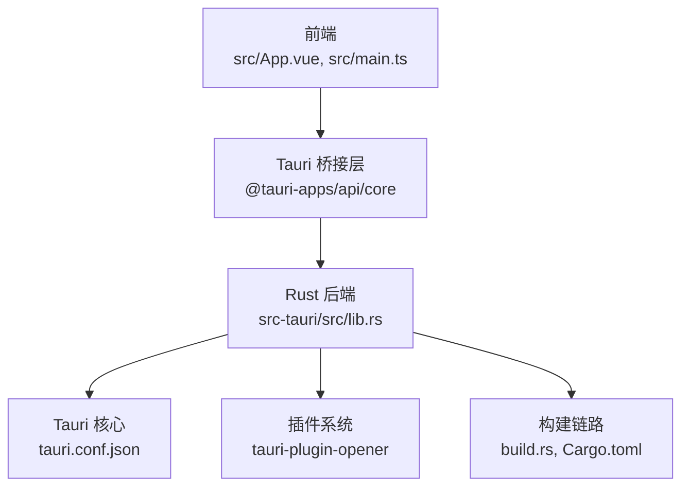
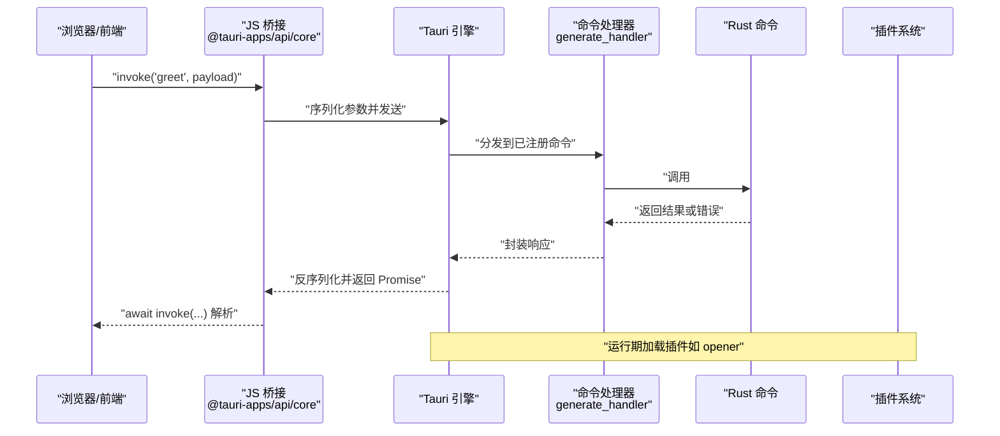
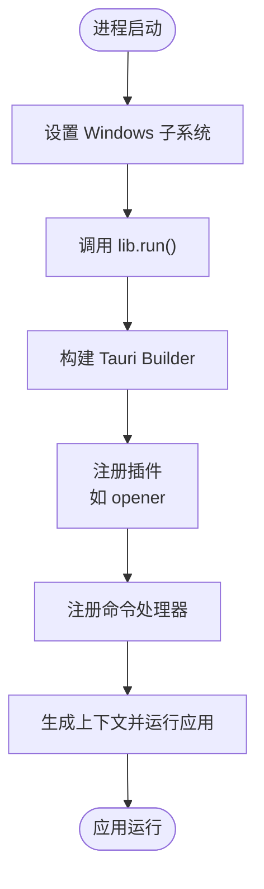
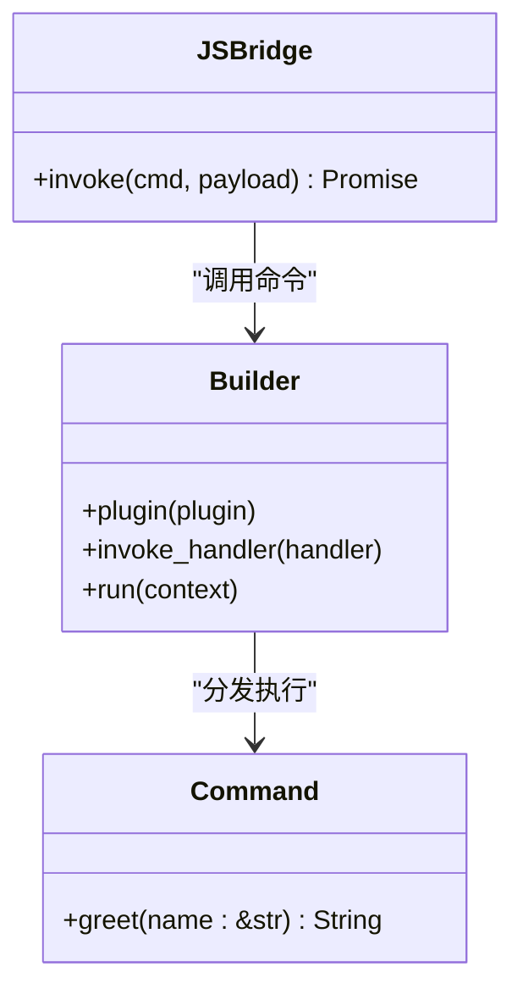
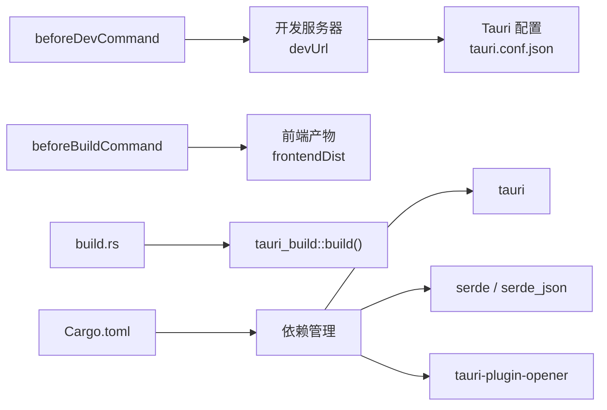
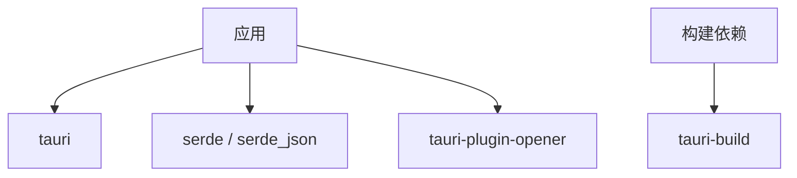

# 后端架构

<cite>
**本文引用的文件**
- [src-tauri/src/main.rs](file://src-tauri/src/main.rs)
- [src-tauri/src/lib.rs](file://src-tauri/src/lib.rs)
- [src-tauri/Cargo.toml](file://src-tauri/Cargo.toml)
- [src-tauri/tauri.conf.json](file://src-tauri/tauri.conf.json)
- [src-tauri/build.rs](file://src-tauri/build.rs)
- [src-tauri/capabilities/default.json](file://src-tauri/capabilities/default.json)
- [src/App.vue](file://src/App.vue)
- [src/main.ts](file://src/main.ts)
- [README.md](file://README.md)
</cite>

## 目录
1. [简介](#简介)
2. [项目结构](#项目结构)
3. [核心组件](#核心组件)
4. [架构总览](#架构总览)
5. [详细组件分析](#详细组件分析)
6. [依赖关系分析](#依赖关系分析)
7. [性能考虑](#性能考虑)
8. [故障排查指南](#故障排查指南)
9. [结论](#结论)
10. [附录](#附录)

## 简介
本文件面向 Rust 后端应用的架构文档，聚焦于 Tauri v2 应用的入口初始化流程、命令系统设计、Rust 与 JavaScript 的桥接通信、依赖管理策略、线程模型与内存安全、性能优化与最佳实践。本文以仓库中的实际文件为依据，结合 Tauri 开发规范，帮助读者快速理解并扩展该应用。

## 项目结构
该项目采用前端（Vue + TypeScript）与后端（Rust + Tauri）分离的组织方式，其中：
- 前端位于 src 目录，负责用户界面与交互；
- 后端位于 src-tauri 目录，包含 Rust 应用入口、命令实现、构建配置与 Tauri 配置；
- 构建链路通过 tauri.conf.json 指定开发与打包流程，Cargo.toml 管理 Rust 依赖，build.rs 调用 tauri-build 进行构建期生成。

图表来源
- [src/App.vue:1-160](file://src/App.vue#L1-L160)
- [src/main.ts:1-5](file://src/main.ts#L1-L5)
- [src-tauri/src/lib.rs:1-15](file://src-tauri/src/lib.rs#L1-L15)
- [src-tauri/tauri.conf.json:1-36](file://src-tauri/tauri.conf.json#L1-L36)
- [src-tauri/build.rs:1-4](file://src-tauri/build.rs#L1-L4)
- [src-tauri/Cargo.toml:1-26](file://src-tauri/Cargo.toml#L1-L26)

章节来源
- [src-tauri/tauri.conf.json:1-36](file://src-tauri/tauri.conf.json#L1-L36)
- [src-tauri/Cargo.toml:1-26](file://src-tauri/Cargo.toml#L1-L26)
- [src-tauri/build.rs:1-4](file://src-tauri/build.rs#L1-L4)
- [README.md:1-17](file://README.md#L1-L17)

## 核心组件
- 应用入口与生命周期
  - 入口文件通过 Windows 子系统控制台行为，调用 lib.rs 中的 run 函数完成应用初始化与运行。
- 命令系统
  - 使用 #[tauri::command] 宏声明命令，配合 generate_handler 注册到 Tauri Builder，实现 JS 到 Rust 的同步/异步调用。
- 插件集成
  - 通过 Builder::plugin 注入插件，如 tauri-plugin-opener，扩展系统级能力。
- 能力与权限
  - capabilities/default.json 定义窗口与权限集合，确保最小权限原则与桌面端能力暴露。

章节来源
- [src-tauri/src/main.rs:1-7](file://src-tauri/src/main.rs#L1-L7)
- [src-tauri/src/lib.rs:1-15](file://src-tauri/src/lib.rs#L1-L15)
- [src-tauri/capabilities/default.json:1-11](file://src-tauri/capabilities/default.json#L1-L11)

## 架构总览
下图展示了从浏览器端发起命令调用到 Rust 命令执行的完整链路，以及构建期与运行期的关键组件。

图表来源
- [src-tauri/src/lib.rs:7-14](file://src-tauri/src/lib.rs#L7-L14)
- [src/App.vue:8-11](file://src/App.vue#L8-L11)

## 详细组件分析

### 应用入口与生命周期（main.rs）
- 初始化流程
  - Windows 发布版隐藏额外控制台窗口；
  - main 函数委托给 lib.rs::run，由其完成插件加载、命令注册与应用启动。
- 生命周期管理
  - run 内部通过 Builder 默认配置、插件注入、命令处理器注册与上下文生成，最终运行应用并处理异常。

图表来源
- [src-tauri/src/main.rs:1-7](file://src-tauri/src/main.rs#L1-L7)
- [src-tauri/src/lib.rs:7-14](file://src-tauri/src/lib.rs#L7-L14)

章节来源
- [src-tauri/src/main.rs:1-7](file://src-tauri/src/main.rs#L1-L7)
- [src-tauri/src/lib.rs:7-14](file://src-tauri/src/lib.rs#L7-L14)

### 命令系统设计（lib.rs）
- 命令宏与签名
  - #[tauri::command] 宏将函数暴露为可被 JS 调用的命令；
  - 函数签名需满足序列化/反序列化约束：参数与返回值必须是可序列化的类型（如字符串、数字、对象等）。
- 参数传递机制
  - JS 端通过 invoke("cmd", payload) 将参数传入；Rust 端接收对应类型的引用或值；
  - 返回值通过 Promise 异步返回，错误会转换为 JS 可捕获的异常。
- 命令注册
  - 使用 generate_handler 将命令函数列表注入 Builder，形成统一的命令分发器。

图表来源
- [src-tauri/src/lib.rs:2-5](file://src-tauri/src/lib.rs#L2-L5)
- [src-tauri/src/lib.rs:9-12](file://src-tauri/src/lib.rs#L9-L12)
- [src/App.vue:8-11](file://src/App.vue#L8-L11)

章节来源
- [src-tauri/src/lib.rs:1-15](file://src-tauri/src/lib.rs#L1-L15)
- [src/App.vue:8-11](file://src/App.vue#L8-L11)

### Rust 与 JavaScript 桥接通信原理
- 数据序列化
  - JS 端将参数对象序列化为 JSON；
  - Tauri 在运行时进行反序列化，传递给 #[tauri::command] 函数；
  - 返回值再次序列化为 JSON 并返回 JS。
- 错误处理
  - Rust 命令内部抛出的错误会被转换为 JS 可感知的异常；
  - JS 端通过 try/catch 或 Promise.catch 捕获并处理。
- 异步调用模式
  - invoke 返回 Promise，适合处理耗时操作；
  - 建议在 Rust 中避免阻塞主线程，必要时使用异步任务或后台线程池。

章节来源
- [src-tauri/src/lib.rs:2-5](file://src-tauri/src/lib.rs#L2-L5)
- [src/App.vue:8-11](file://src/App.vue#L8-L11)

### 能力与权限（capabilities/default.json）
- 能力定义
  - default.json 为主窗口分配默认能力，包含核心权限与 opener 权限；
  - 通过 $schema 指向生成的桌面端 schema，确保权限与平台能力一致。
- 集成方式
  - 在 tauri.conf.json 中声明能力文件，运行时由 Tauri 加载并生效。

章节来源
- [src-tauri/capabilities/default.json:1-11](file://src-tauri/capabilities/default.json#L1-L11)
- [src-tauri/tauri.conf.json:1-36](file://src-tauri/tauri.conf.json#L1-L36)

### 构建与运行配置（tauri.conf.json、build.rs、Cargo.toml）
- 开发与打包
  - tauri.conf.json 指定开发服务器地址、构建前脚本、前端产物目录与窗口属性；
  - build.rs 调用 tauri_build::build，生成运行所需的资源与绑定。
- 依赖管理
  - Cargo.toml 定义了库目标类型、构建依赖与运行时依赖（tauri、serde、serde_json、tauri-plugin-opener）；
  - crate-type 包含 staticlib、cdylib、rlib，便于跨平台与多用途链接。

图表来源
- [src-tauri/tauri.conf.json:6-11](file://src-tauri/tauri.conf.json#L6-L11)
- [src-tauri/build.rs:1-4](file://src-tauri/build.rs#L1-L4)
- [src-tauri/Cargo.toml:10-25](file://src-tauri/Cargo.toml#L10-L25)

章节来源
- [src-tauri/tauri.conf.json:1-36](file://src-tauri/tauri.conf.json#L1-L36)
- [src-tauri/build.rs:1-4](file://src-tauri/build.rs#L1-L4)
- [src-tauri/Cargo.toml:1-26](file://src-tauri/Cargo.toml#L1-L26)

## 依赖关系分析
- 核心依赖
  - tauri：应用框架与命令系统核心；
  - serde / serde_json：序列化与反序列化支持；
  - tauri-plugin-opener：系统打开器插件。
- 构建依赖
  - tauri-build：构建期生成与校验。
- 目标类型
  - crate-type 多种类型组合，适配不同平台与链接需求。

图表来源
- [src-tauri/Cargo.toml:20-25](file://src-tauri/Cargo.toml#L20-L25)
- [src-tauri/Cargo.toml:17-18](file://src-tauri/Cargo.toml#L17-L18)

章节来源
- [src-tauri/Cargo.toml:1-26](file://src-tauri/Cargo.toml#L1-L26)

## 性能考虑
- 避免阻塞主线程
  - 将 CPU 密集型或长时间 IO 操作放入后台任务或线程池，保持 UI 流畅。
- 参数与返回值优化
  - 控制序列化负载，尽量使用扁平结构与必要字段，减少不必要的数据拷贝。
- 插件按需启用
  - 仅启用所需插件，降低启动开销与运行时内存占用。
- 构建优化
  - 使用发布配置进行打包，合理利用增量编译与缓存。

## 故障排查指南
- 命令未注册或无法调用
  - 检查 generate_handler 是否包含目标命令，确认命令名称与 JS 端 invoke 调用一致。
- 参数类型不匹配
  - 确保 JS 传入的 payload 与 Rust 函数签名一致，避免序列化失败。
- 插件未生效
  - 检查 capabilities/default.json 中权限是否包含插件默认权限，确认 tauri.conf.json 已正确引用。
- 构建失败
  - 确认 tauri-build 版本与 tauri 版本兼容，检查 build.rs 是否正确调用 tauri_build::build。

章节来源
- [src-tauri/src/lib.rs:9-12](file://src-tauri/src/lib.rs#L9-L12)
- [src-tauri/capabilities/default.json:6-9](file://src-tauri/capabilities/default.json#L6-L9)
- [src-tauri/tauri.conf.json:1-36](file://src-tauri/tauri.conf.json#L1-L36)
- [src-tauri/build.rs:1-4](file://src-tauri/build.rs#L1-L4)

## 结论
本项目以 Tauri v2 为核心，结合 Vue 前端与 Rust 后端，实现了清晰的命令式桥接通信与模块化插件体系。通过合理的依赖管理、能力权限控制与构建配置，既保证了开发效率也兼顾了运行时性能。建议在扩展新命令时遵循参数与返回值的序列化约束、错误处理与异步模式的最佳实践，持续优化用户体验与系统稳定性。

## 附录
- 前端入口与应用挂载
  - 前端通过 main.ts 创建并挂载 Vue 应用，App.vue 提供基础交互与命令调用示例。
- 推荐阅读
  - Tauri 命令开发文档与最佳实践，有助于进一步扩展复杂业务逻辑。

章节来源
- [src/main.ts:1-5](file://src/main.ts#L1-L5)
- [src/App.vue:1-160](file://src/App.vue#L1-L160)
- [README.md:1-17](file://README.md#L1-L17)