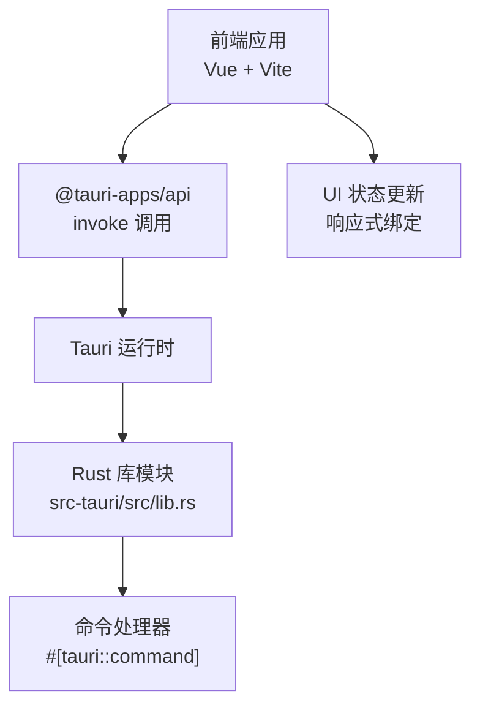
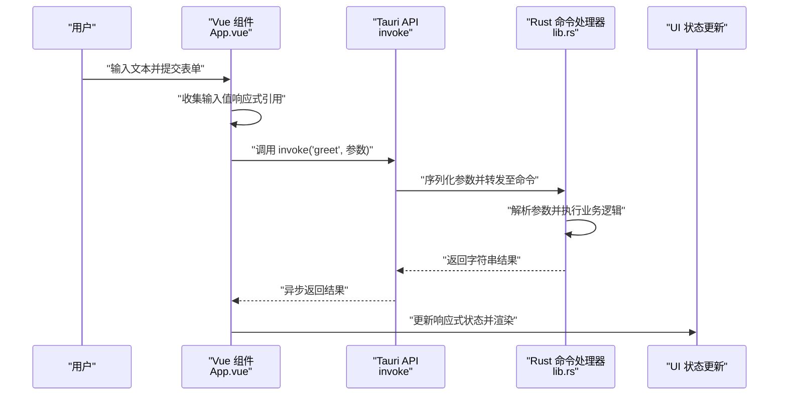
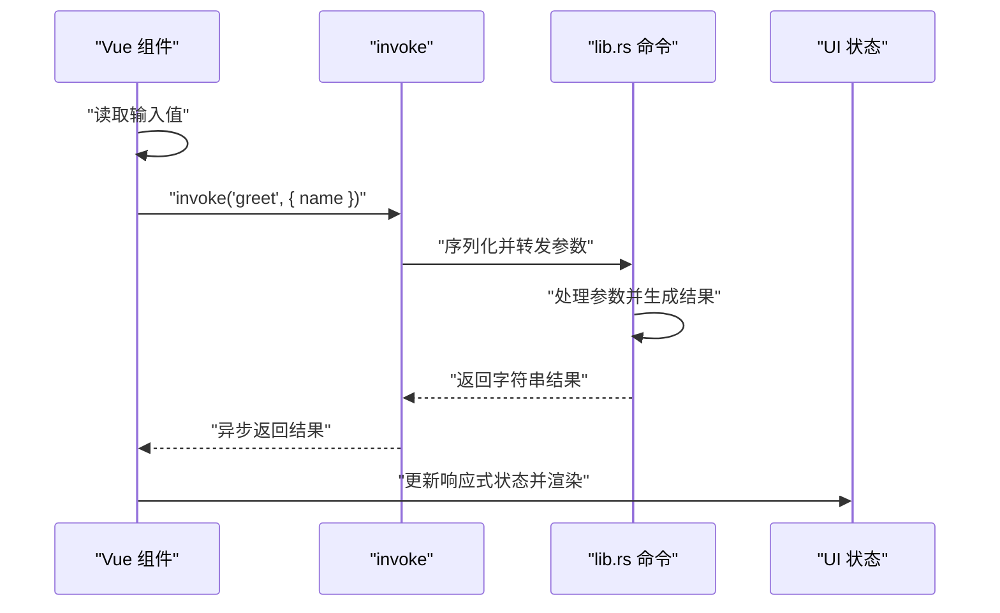
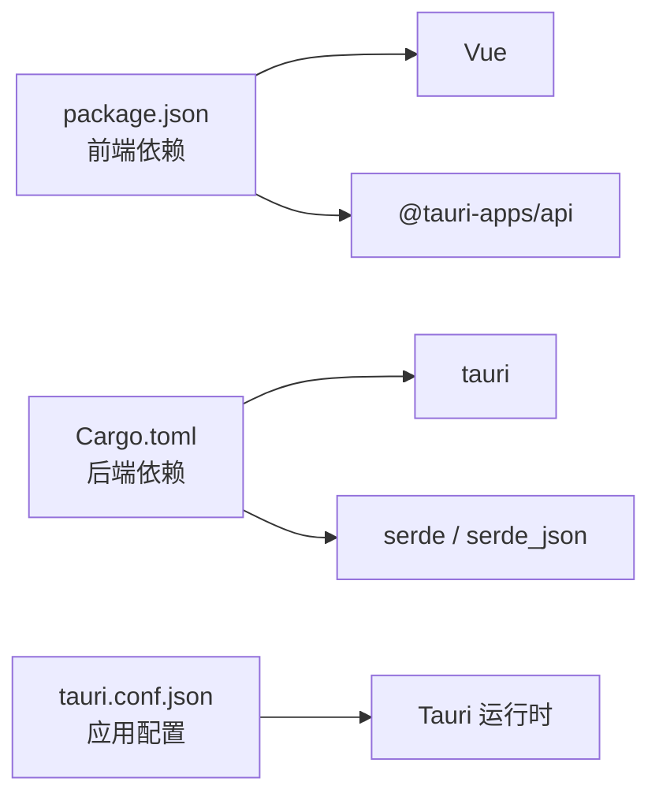

# 数据流设计

<cite>
**本文引用的文件**
- [src/App.vue](file://src/App.vue)
- [src/main.ts](file://src/main.ts)
- [src-tauri/src/lib.rs](file://src-tauri/src/lib.rs)
- [src-tauri/src/main.rs](file://src-tauri/src/main.rs)
- [src-tauri/Cargo.toml](file://src-tauri/Cargo.toml)
- [src-tauri/tauri.conf.json](file://src-tauri/tauri.conf.json)
- [package.json](file://package.json)
- [README.md](file://README.md)
</cite>

## 目录
1. [引言](#引言)
2. [项目结构](#项目结构)
3. [核心组件](#核心组件)
4. [架构总览](#架构总览)
5. [详细组件分析](#详细组件分析)
6. [依赖关系分析](#依赖关系分析)
7. [性能考虑](#性能考虑)
8. [故障排查指南](#故障排查指南)
9. [结论](#结论)
10. [附录](#附录)

## 引言
本文件面向 Tauri + Vue 应用中的“从前端用户交互到后端 Rust 处理再到 UI 更新”的完整数据流路径，系统性阐述以下内容：
- 用户输入如何通过 Vue 组件触发事件
- Tauri 命令调用如何将参数传递给 Rust 函数
- Rust 处理完成后如何将结果返回前端并更新界面状态
- 同步与异步数据流的差异、错误传播机制与状态管理策略
- 数据序列化与反序列化（JSON）过程及类型安全保证
- 命令调用生命周期：从参数验证到结果返回的全流程
- 具体示例：greet 命令的完整执行过程
- 性能优化建议：缓存策略与批量处理机制

## 项目结构
该应用采用典型的“前端（Vue + Vite）+ 后端（Rust + Tauri）”分层架构。前端负责用户交互与状态渲染；后端通过 Tauri 暴露命令接口，供前端调用。

图示来源
- [src/App.vue:1-160](file://src/App.vue#L1-L160)
- [src-tauri/src/lib.rs:1-15](file://src-tauri/src/lib.rs#L1-L15)
- [src-tauri/src/main.rs:1-7](file://src-tauri/src/main.rs#L1-L7)
- [package.json:1-25](file://package.json#L1-L25)

章节来源
- [src/App.vue:1-160](file://src/App.vue#L1-L160)
- [src/main.ts:1-5](file://src/main.ts#L1-L5)
- [src-tauri/src/lib.rs:1-15](file://src-tauri/src/lib.rs#L1-L15)
- [src-tauri/src/main.rs:1-7](file://src-tauri/src/main.rs#L1-L7)
- [src-tauri/Cargo.toml:1-26](file://src-tauri/Cargo.toml#L1-L26)
- [src-tauri/tauri.conf.json:1-36](file://src-tauri/tauri.conf.json#L1-L36)
- [package.json:1-25](file://package.json#L1-L25)
- [README.md:1-17](file://README.md#L1-L17)

## 核心组件
- 前端入口与应用挂载
  - Vue 应用在入口文件中创建并挂载根组件，随后由根组件负责渲染与交互。
  - 参考路径：[src/main.ts:1-5](file://src/main.ts#L1-L5)
- 前端交互与命令调用
  - 根组件使用响应式引用维护输入与输出，并通过 Tauri 的 invoke API 触发后端命令。
  - 参考路径：[src/App.vue:1-160](file://src/App.vue#L1-L160)
- 后端命令注册与运行
  - Rust 库模块定义命令函数并通过 Tauri Builder 注册为可调用命令，随后启动应用。
  - 参考路径：[src-tauri/src/lib.rs:1-15](file://src-tauri/src/lib.rs#L1-L15)
- 应用入口与上下文
  - 平台入口调用库模块的 run 函数以初始化运行时与插件。
  - 参考路径：[src-tauri/src/main.rs:1-7](file://src-tauri/src/main.rs#L1-L7)
- 构建与依赖
  - 前端依赖 Tauri API；后端依赖 Tauri、Serde 与 Serde JSON，用于命令序列化与类型安全。
  - 参考路径：[package.json:1-25](file://package.json#L1-L25)，[src-tauri/Cargo.toml:1-26](file://src-tauri/Cargo.toml#L1-L26)

章节来源
- [src/main.ts:1-5](file://src/main.ts#L1-L5)
- [src/App.vue:1-160](file://src/App.vue#L1-L160)
- [src-tauri/src/lib.rs:1-15](file://src-tauri/src/lib.rs#L1-L15)
- [src-tauri/src/main.rs:1-7](file://src-tauri/src/main.rs#L1-L7)
- [package.json:1-25](file://package.json#L1-L25)
- [src-tauri/Cargo.toml:1-26](file://src-tauri/Cargo.toml#L1-L26)

## 架构总览
下图展示了从用户输入到 UI 更新的完整数据流，覆盖同步与异步两种模式：

图示来源
- [src/App.vue:1-160](file://src/App.vue#L1-L160)
- [src-tauri/src/lib.rs:1-15](file://src-tauri/src/lib.rs#L1-L15)

## 详细组件分析

### 前端组件：用户交互与命令触发
- 输入与状态
  - 使用响应式引用维护输入与输出，实现双向绑定与自动渲染。
  - 参考路径：[src/App.vue:5-6](file://src/App.vue#L5-L6)
- 事件绑定与提交
  - 表单提交事件被阻止默认行为，交由自定义方法处理。
  - 参考路径：[src/App.vue:31](file://src/App.vue#L31)
- 命令调用
  - 通过 Tauri 的 invoke API 发起命令调用，传入参数对象并等待异步结果。
  - 参考路径：[src/App.vue:10](file://src/App.vue#L10)

章节来源
- [src/App.vue:1-160](file://src/App.vue#L1-L160)

### 命令定义与注册：Rust 层处理
- 命令声明
  - 使用 #[tauri::command] 宏将函数暴露为可调用命令，参数与返回值自动进行序列化/反序列化。
  - 参考路径：[src-tauri/src/lib.rs:2-5](file://src-tauri/src/lib.rs#L2-L5)
- 应用运行与命令注册
  - 在 run 函数中通过 Builder 注册命令处理器，并启动应用上下文。
  - 参考路径：[src-tauri/src/lib.rs:8-14](file://src-tauri/src/lib.rs#L8-L14)
- 平台入口
  - 平台入口调用库模块的 run，完成运行时初始化。
  - 参考路径：[src-tauri/src/main.rs:5-6](file://src-tauri/src/main.rs#L5-L6)

章节来源
- [src-tauri/src/lib.rs:1-15](file://src-tauri/src/lib.rs#L1-L15)
- [src-tauri/src/main.rs:1-7](file://src-tauri/src/main.rs#L1-L7)

### 数据序列化与类型安全
- 前端到后端
  - invoke 将参数对象序列化为 JSON，通过 IPC 传输至 Rust。
  - 参考路径：[src/App.vue:10](file://src/App.vue#L10)
- 后端到前端
  - Rust 返回值经 Serde JSON 序列化后回传前端，再由 Tauri 反序列化为 JS 对象。
  - 参考路径：[src-tauri/Cargo.toml:23-24](file://src-tauri/Cargo.toml#L23-L24)

章节来源
- [src/App.vue:1-160](file://src/App.vue#L1-L160)
- [src-tauri/Cargo.toml:1-26](file://src-tauri/Cargo.toml#L1-L26)

### 命令生命周期：greet 示例
- 参数收集与校验
  - 前端从响应式引用读取输入值，作为命令参数对象的一部分。
  - 参考路径：[src/App.vue:5-10](file://src/App.vue#L5-L10)
- 调用与转发
  - invoke 将参数对象序列化并转发至 Tauri 运行时。
  - 参考路径：[src/App.vue:10](file://src/App.vue#L10)
- Rust 处理
  - 命令函数接收参数并执行业务逻辑，返回字符串结果。
  - 参考路径：[src-tauri/src/lib.rs:3-4](file://src-tauri/src/lib.rs#L3-L4)
- 结果回传与 UI 更新
  - invoke 异步返回结果，前端更新响应式状态并触发 UI 渲染。
  - 参考路径：[src/App.vue:10](file://src/App.vue#L10)

图示来源
- [src/App.vue:1-160](file://src/App.vue#L1-L160)
- [src-tauri/src/lib.rs:1-15](file://src-tauri/src/lib.rs#L1-L15)

章节来源
- [src/App.vue:1-160](file://src/App.vue#L1-L160)
- [src-tauri/src/lib.rs:1-15](file://src-tauri/src/lib.rs#L1-L15)

### 错误传播机制与状态管理策略
- 错误传播
  - Tauri 命令调用在前端通过 Promise 风格的异步返回，异常会以错误形式抛出，需在前端捕获处理。
  - 参考路径：[src/App.vue:10](file://src/App.vue#L10)
- 状态管理
  - 使用响应式引用集中管理输入与输出，避免分散状态导致的不一致。
  - 参考路径：[src/App.vue:5-6](file://src/App.vue#L5-L6)
- 最佳实践
  - 在命令调用前后设置加载态与错误态，确保 UI 响应一致。
  - 对输入参数进行前端校验，减少无效调用。

章节来源
- [src/App.vue:1-160](file://src/App.vue#L1-L160)

### 同步与异步数据流
- 异步调用
  - invoke 返回 Promise，适合网络或阻塞操作；前端需等待结果后再更新 UI。
  - 参考路径：[src/App.vue:10](file://src/App.vue#L10)
- 同步场景
  - 若 Rust 侧逻辑极轻量且无阻塞，可在命令内部快速返回；仍建议保持异步语义以统一处理流程。
  - 参考路径：[src-tauri/src/lib.rs:3-4](file://src-tauri/src/lib.rs#L3-L4)

章节来源
- [src/App.vue:1-160](file://src/App.vue#L1-L160)
- [src-tauri/src/lib.rs:1-15](file://src-tauri/src/lib.rs#L1-L15)

## 依赖关系分析
- 前端依赖
  - Vue 与 @tauri-apps/api 提供组件化与跨进程通信能力。
  - 参考路径：[package.json:12-16](file://package.json#L12-L16)
- 后端依赖
  - Tauri 提供运行时与命令系统；Serde 与 Serde JSON 实现类型安全的序列化/反序列化。
  - 参考路径：[src-tauri/Cargo.toml:20-24](file://src-tauri/Cargo.toml#L20-L24)
- 应用配置
  - tauri.conf.json 定义窗口、构建与安全策略等，影响运行时行为。
  - 参考路径：[src-tauri/tauri.conf.json:1-36](file://src-tauri/tauri.conf.json#L1-L36)

图示来源
- [package.json:1-25](file://package.json#L1-L25)
- [src-tauri/Cargo.toml:1-26](file://src-tauri/Cargo.toml#L1-L26)
- [src-tauri/tauri.conf.json:1-36](file://src-tauri/tauri.conf.json#L1-L36)

章节来源
- [package.json:1-25](file://package.json#L1-L25)
- [src-tauri/Cargo.toml:1-26](file://src-tauri/Cargo.toml#L1-L26)
- [src-tauri/tauri.conf.json:1-36](file://src-tauri/tauri.conf.json#L1-L36)

## 性能考虑
- 缓存策略
  - 对于重复的只读查询，可在前端维护简单内存缓存，避免重复调用；对可能变化的数据设置失效策略。
- 批量处理
  - 将多个小命令合并为批量请求，减少 IPC 次数；注意控制单次请求大小与超时时间。
- 序列化开销
  - 控制参数与返回值的体积，避免传输大对象；必要时进行字段裁剪或压缩。
- UI 渲染优化
  - 使用细粒度响应式引用与计算属性，避免不必要的重渲染。
- 并发控制
  - 对高并发命令调用进行节流/去抖，防止后端过载。

## 故障排查指南
- 命令未找到
  - 检查命令是否已通过 Builder 注册，确认命令名称拼写一致。
  - 参考路径：[src-tauri/src/lib.rs:11](file://src-tauri/src/lib.rs#L11)
- 参数类型不匹配
  - 确认前端传入参数类型与 Rust 命令签名一致；利用 Serde 的类型推断与错误提示定位问题。
  - 参考路径：[src-tauri/Cargo.toml:23-24](file://src-tauri/Cargo.toml#L23-L24)
- 异步调用未返回
  - 检查命令是否正确返回结果；在前端使用 try/catch 捕获异常并记录日志。
  - 参考路径：[src/App.vue:10](file://src/App.vue#L10)
- UI 不更新
  - 确保使用响应式引用更新状态；检查模板中绑定的变量名与引用一致。
  - 参考路径：[src/App.vue:5-6](file://src/App.vue#L5-L6)

章节来源
- [src-tauri/src/lib.rs:1-15](file://src-tauri/src/lib.rs#L1-L15)
- [src-tauri/Cargo.toml:1-26](file://src-tauri/Cargo.toml#L1-L26)
- [src/App.vue:1-160](file://src/App.vue#L1-L160)

## 结论
本项目通过清晰的前后端职责划分与 Tauri 的命令机制，实现了从用户输入到 UI 更新的高效数据流。前端负责交互与状态管理，后端负责业务处理与类型安全的序列化/反序列化。遵循本文的错误传播与性能优化建议，可进一步提升系统的稳定性与用户体验。

## 附录
- 快速参考
  - 前端入口与挂载：[src/main.ts:1-5](file://src/main.ts#L1-L5)
  - 前端命令调用：[src/App.vue:10](file://src/App.vue#L10)
  - Rust 命令定义与注册：[src-tauri/src/lib.rs:2-14](file://src-tauri/src/lib.rs#L2-L14)
  - 平台入口：[src-tauri/src/main.rs:5-6](file://src-tauri/src/main.rs#L5-L6)
  - 依赖与配置：[package.json:12-16](file://package.json#L12-L16)，[src-tauri/Cargo.toml:20-24](file://src-tauri/Cargo.toml#L20-L24)，[src-tauri/tauri.conf.json:1-36](file://src-tauri/tauri.conf.json#L1-L36)