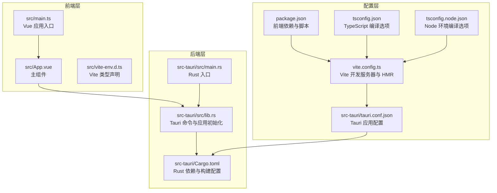
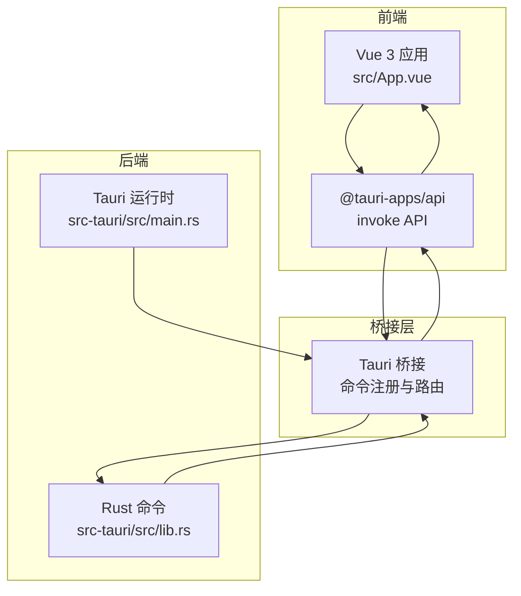
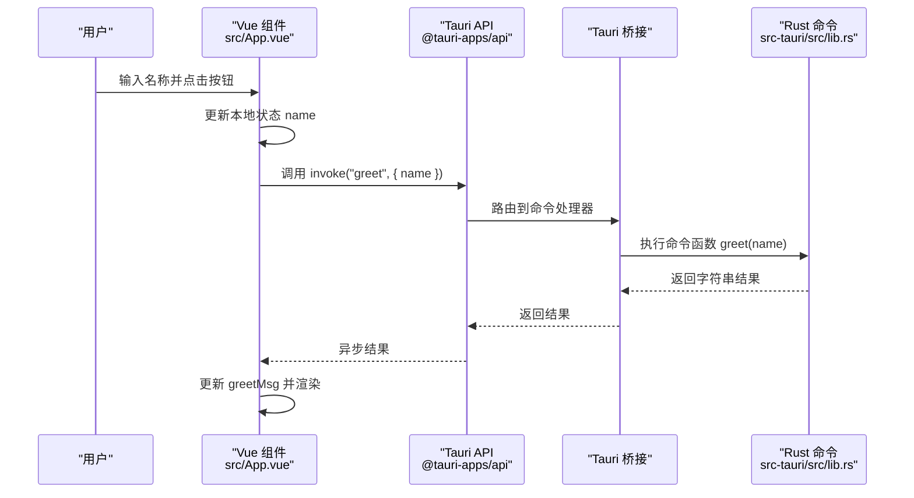
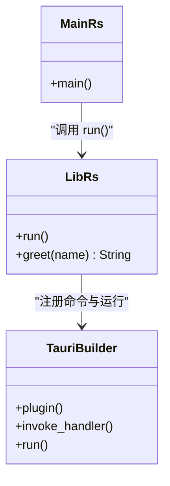
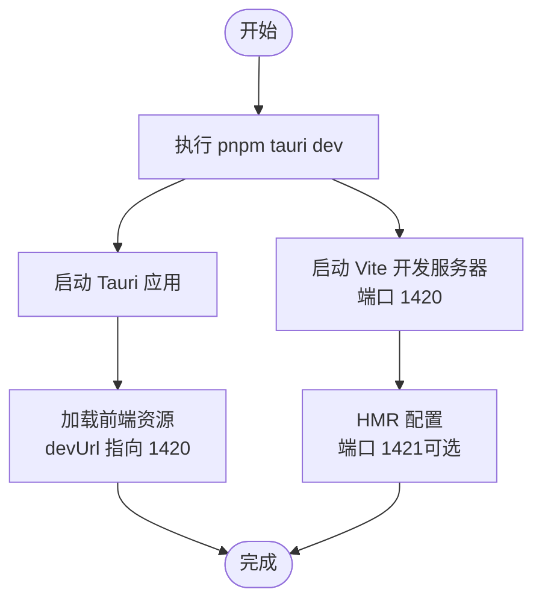
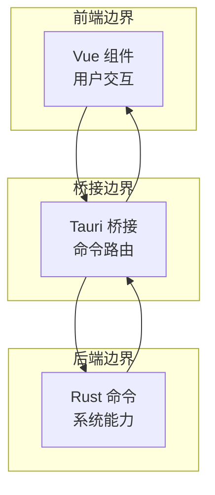
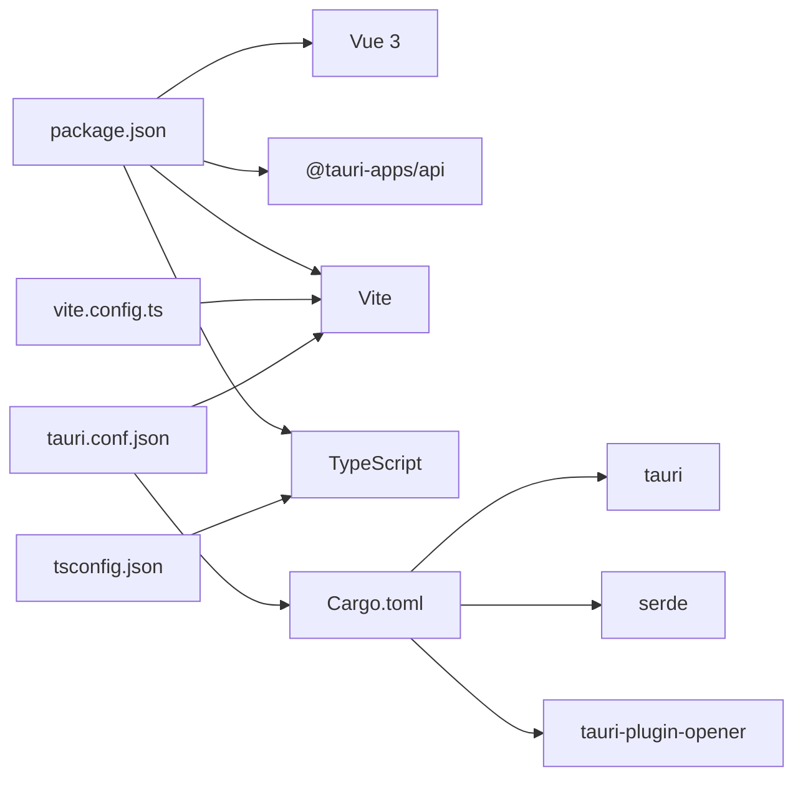

# 架构设计

<cite>
**本文档引用的文件**
- [package.json](file://package.json)
- [tsconfig.json](file://tsconfig.json)
- [tsconfig.node.json](file://tsconfig.node.json)
- [vite.config.ts](file://vite.config.ts)
- [src/main.ts](file://src/main.ts)
- [src/App.vue](file://src/App.vue)
- [src/vite-env.d.ts](file://src/vite-env.d.ts)
- [src-tauri/tauri.conf.json](file://src-tauri/tauri.conf.json)
- [src-tauri/Cargo.toml](file://src-tauri/Cargo.toml)
- [src-tauri/src/lib.rs](file://src-tauri/src/lib.rs)
- [src-tauri/src/main.rs](file://src-tauri/src/main.rs)
- [README.md](file://README.md)
- [AGENTS.md](file://AGENTS.md)
</cite>

## 目录
1. [简介](#简介)
2. [项目结构](#项目结构)
3. [核心组件](#核心组件)
4. [架构总览](#架构总览)
5. [详细组件分析](#详细组件分析)
6. [依赖关系分析](#依赖关系分析)
7. [性能考虑](#性能考虑)
8. [故障排除指南](#故障排除指南)
9. [结论](#结论)
10. [附录](#附录)

## 简介
本项目是一个基于 Tauri 2 + Vue 3 + TypeScript 的桌面应用，采用前后端分离的架构：前端使用 Vue 3 单文件组件与 TypeScript，构建工具采用 Vite；后端使用 Rust 语言并通过 Tauri 桥接提供原生能力。应用通过 Tauri 的命令系统实现前端与后端的双向通信，形成“用户输入 → Vue 组件 → Tauri 命令 → Rust 处理 → 结果返回 → UI 更新”的完整数据流。该架构在保持开发体验的同时，兼顾了性能与安全性的优势。

## 项目结构
项目采用分层清晰的目录组织：
- 前端层：src 目录包含 Vue 应用入口、主组件与类型声明
- 后端层：src-tauri 目录包含 Rust 应用入口、命令实现与 Tauri 配置
- 构建与配置：根目录包含包管理、TypeScript、Vite 与 Tauri 配置文件

图表来源
- [src/main.ts:1-5](file://src/main.ts#L1-L5)
- [src/App.vue:1-160](file://src/App.vue#L1-L160)
- [src/vite-env.d.ts:1-8](file://src/vite-env.d.ts#L1-L8)
- [src-tauri/src/main.rs:1-7](file://src-tauri/src/main.rs#L1-L7)
- [src-tauri/src/lib.rs:1-15](file://src-tauri/src/lib.rs#L1-L15)
- [src-tauri/Cargo.toml:1-26](file://src-tauri/Cargo.toml#L1-L26)
- [package.json:1-25](file://package.json#L1-L25)
- [tsconfig.json:1-26](file://tsconfig.json#L1-L26)
- [tsconfig.node.json:1-11](file://tsconfig.node.json#L1-L11)
- [vite.config.ts:1-33](file://vite.config.ts#L1-L33)
- [src-tauri/tauri.conf.json:1-36](file://src-tauri/tauri.conf.json#L1-L36)

章节来源
- [AGENTS.md:73-91](file://AGENTS.md#L73-L91)
- [README.md:1-17](file://README.md#L1-L17)

## 核心组件
- 前端应用入口与主组件
  - 应用入口负责创建并挂载 Vue 应用实例，主组件包含表单与调用 Tauri 命令的逻辑。
- Tauri 命令与应用初始化
  - Rust 层定义命令函数并通过 Tauri Builder 注册，生成上下文并运行应用。
- 构建与配置
  - package.json 定义脚本与依赖；tsconfig.json 设置严格类型检查；vite.config.ts 提供开发服务器与 HMR；tauri.conf.json 配置应用窗口、构建流程与打包参数。

章节来源
- [src/main.ts:1-5](file://src/main.ts#L1-L5)
- [src/App.vue:1-160](file://src/App.vue#L1-L160)
- [src-tauri/src/lib.rs:1-15](file://src-tauri/src/lib.rs#L1-L15)
- [src-tauri/src/main.rs:1-7](file://src-tauri/src/main.rs#L1-L7)
- [package.json:1-25](file://package.json#L1-L25)
- [tsconfig.json:1-26](file://tsconfig.json#L1-L26)
- [vite.config.ts:1-33](file://vite.config.ts#L1-L33)
- [src-tauri/tauri.conf.json:1-36](file://src-tauri/tauri.conf.json#L1-L36)

## 架构总览
该系统采用“前端 Vue 应用 + Tauri 桥接 + Rust 后端”的三层架构。前端通过 Tauri 的 invoke API 调用后端命令，后端以命令函数形式暴露能力，二者通过序列化参数与返回值进行通信。开发时前端运行在固定端口，Tauri 在同一进程内加载前端资源，生产构建时将前端产物打包到后端可访问的路径。

图表来源
- [src/App.vue:1-160](file://src/App.vue#L1-L160)
- [src-tauri/src/lib.rs:1-15](file://src-tauri/src/lib.rs#L1-L15)
- [src-tauri/src/main.rs:1-7](file://src-tauri/src/main.rs#L1-L7)

## 详细组件分析

### 前端组件：MVVM 与数据流
- MVVM 实现要点
  - 使用 Vue 3 的组合式 API 与 `<script setup>` 语法，通过响应式 ref 管理视图状态。
  - 表单绑定 v-model 将用户输入与本地状态关联，提交事件触发异步命令调用。
- 数据流
  - 用户输入 → Vue 组件状态更新 → 调用 Tauri invoke → Rust 命令处理 → 返回结果 → 更新组件状态 → 视图刷新。
- 状态管理
  - 当前示例中使用局部响应式状态；对于复杂场景可引入 Pinia 或 Vuex，但需注意与 Tauri 的集成方式。

图表来源
- [src/App.vue:1-160](file://src/App.vue#L1-L160)
- [src-tauri/src/lib.rs:1-15](file://src-tauri/src/lib.rs#L1-L15)

章节来源
- [src/App.vue:1-160](file://src/App.vue#L1-L160)

### Tauri 命令系统与 Rust 后端
- 命令定义
  - 使用宏标记命令函数，自动序列化参数与返回值，支持字符串等基本类型。
- 应用初始化
  - 通过 Builder 注册插件与命令处理器，生成上下文并启动应用。
- 插件扩展
  - 示例中集成了 opener 插件，用于打开外部链接或文件。

图表来源
- [src-tauri/src/lib.rs:1-15](file://src-tauri/src/lib.rs#L1-L15)
- [src-tauri/src/main.rs:1-7](file://src-tauri/src/main.rs#L1-L7)

章节来源
- [src-tauri/src/lib.rs:1-15](file://src-tauri/src/lib.rs#L1-L15)
- [src-tauri/src/main.rs:1-7](file://src-tauri/src/main.rs#L1-L7)

### 构建与开发流程
- TypeScript 配置
  - 严格模式开启，启用模块解析与 JSON 模块支持，确保类型安全与模块化开发体验。
- Vite 配置
  - 固定开发端口与 HMR 配置，忽略对后端目录的监听，避免不必要的热更新。
- Tauri 配置
  - 指定开发前命令、前端构建输出路径与窗口属性，便于统一构建与打包。

图表来源
- [vite.config.ts:1-33](file://vite.config.ts#L1-L33)
- [src-tauri/tauri.conf.json:1-36](file://src-tauri/tauri.conf.json#L1-L36)
- [AGENTS.md:13-17](file://AGENTS.md#L13-L17)

章节来源
- [tsconfig.json:1-26](file://tsconfig.json#L1-L26)
- [vite.config.ts:1-33](file://vite.config.ts#L1-L33)
- [src-tauri/tauri.conf.json:1-36](file://src-tauri/tauri.conf.json#L1-L36)
- [AGENTS.md:13-24](file://AGENTS.md#L13-L24)

### 系统边界与职责划分
- 前端边界
  - 负责用户界面与交互逻辑，通过 Tauri API 发起命令调用，不直接操作底层系统。
- 后端边界
  - 负责系统级能力与业务逻辑，通过命令暴露给前端调用，遵循类型安全与错误传播。
- 桥接边界
  - 负责命令路由、序列化与上下文管理，保证前后端通信的一致性与稳定性。

图表来源
- [src/App.vue:1-160](file://src/App.vue#L1-L160)
- [src-tauri/src/lib.rs:1-15](file://src-tauri/src/lib.rs#L1-L15)

## 依赖关系分析
- 前端依赖
  - Vue 3 与 @tauri-apps/api 提供组件框架与原生桥接能力；@vitejs/plugin-vue 支持 SFC 开发。
- 后端依赖
  - tauri 与 tauri-plugin-opener 提供运行时与插件能力；serde 用于序列化。
- 构建链路
  - package.json 脚本驱动 Vite 与 Tauri；tsconfig.json 保障类型安全；vite.config.ts 与 tauri.conf.json 协同控制开发与打包行为。

图表来源
- [package.json:1-25](file://package.json#L1-L25)
- [tsconfig.json:1-26](file://tsconfig.json#L1-L26)
- [vite.config.ts:1-33](file://vite.config.ts#L1-L33)
- [src-tauri/Cargo.toml:1-26](file://src-tauri/Cargo.toml#L1-L26)
- [src-tauri/tauri.conf.json:1-36](file://src-tauri/tauri.conf.json#L1-L36)

章节来源
- [package.json:1-25](file://package.json#L1-L25)
- [src-tauri/Cargo.toml:1-26](file://src-tauri/Cargo.toml#L1-L26)

## 性能考虑
- 启动与内存占用
  - Tauri 相比 Electron 更轻量，启动更快、内存占用更低，适合桌面应用的性能要求。
- 网络与安全
  - Tauri 默认禁用不必要的网络权限，通过显式授权与能力配置提升安全性。
- 开发体验
  - Vite 的快速冷启动与 HMR 能显著提升迭代效率；固定端口与严格模式有助于稳定开发环境。

## 故障排除指南
- 开发端口冲突
  - 若端口被占用，Vite 将报错退出；请调整端口或释放占用端口。
- HMR 不生效
  - 检查是否设置了 TAURI_DEV_HOST；若未设置，HMR 将按默认策略工作。
- 命令调用失败
  - 确认命令名称与参数类型一致；Rust 命令需正确注册到 Tauri Builder。
- 类型检查失败
  - 确保 tsconfig.json 的严格模式与模块解析配置符合项目需求。

章节来源
- [vite.config.ts:1-33](file://vite.config.ts#L1-L33)
- [src-tauri/src/lib.rs:1-15](file://src-tauri/src/lib.rs#L1-L15)
- [tsconfig.json:1-26](file://tsconfig.json#L1-L26)

## 结论
该架构通过 Tauri 将 Vue 3 的现代前端开发体验与 Rust 的高性能、强类型特性结合，实现了清晰的职责分离与高效的开发流程。前端专注于用户交互与状态管理，后端专注于系统能力与业务逻辑，桥接层提供稳定的命令通信机制。在性能与安全性方面，Tauri 相较于传统桌面方案具有明显优势，适合构建高质量的桌面应用。

## 附录
- 技术选型说明
  - 选择 Tauri 而非 Electron 的原因：更小的二进制体积、更低的内存占用、更强的安全模型与更好的性能表现。
- 关键文件参考
  - 前端入口与组件：[src/main.ts:1-5](file://src/main.ts#L1-L5)、[src/App.vue:1-160](file://src/App.vue#L1-L160)
  - 后端命令与初始化：[src-tauri/src/lib.rs:1-15](file://src-tauri/src/lib.rs#L1-L15)、[src-tauri/src/main.rs:1-7](file://src-tauri/src/main.rs#L1-L7)
  - 构建与配置：[vite.config.ts:1-33](file://vite.config.ts#L1-L33)、[src-tauri/tauri.conf.json:1-36](file://src-tauri/tauri.conf.json#L1-L36)、[tsconfig.json:1-26](file://tsconfig.json#L1-L26)