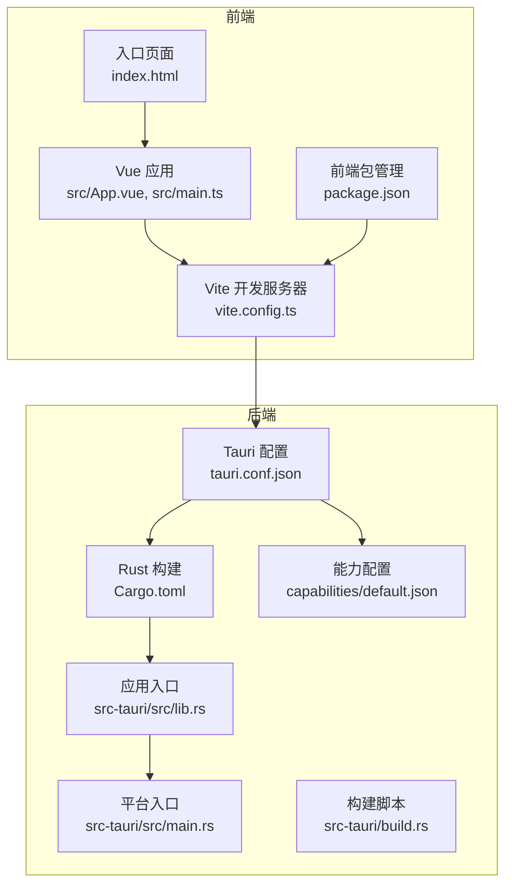
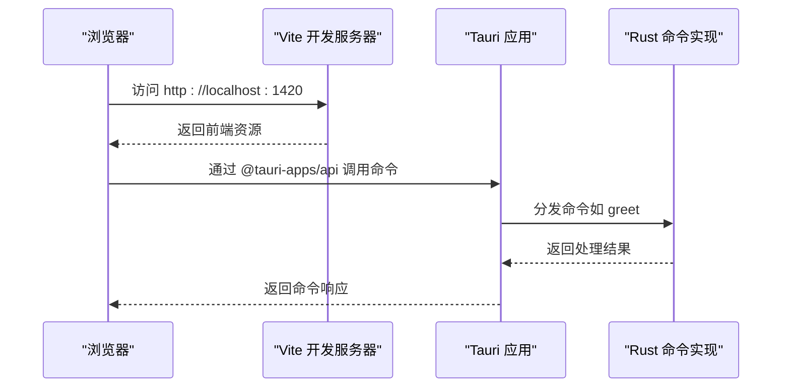

# 系统集成

<cite>
**本文引用的文件**
- [tauri.conf.json](file://src-tauri/tauri.conf.json)
- [Cargo.toml](file://src-tauri/Cargo.toml)
- [package.json](file://package.json)
- [vite.config.ts](file://vite.config.ts)
- [main.rs](file://src-tauri/src/main.rs)
- [lib.rs](file://src-tauri/src/lib.rs)
- [build.rs](file://src-tauri/build.rs)
- [App.vue](file://src/App.vue)
- [main.ts](file://src/main.ts)
- [index.html](file://index.html)
- [default.json](file://src-tauri/capabilities/default.json)
- [tsconfig.json](file://tsconfig.json)
- [tsconfig.node.json](file://tsconfig.node.json)
- [README.md](file://README.md)
</cite>

## 目录
1. [简介](#简介)
2. [项目结构](#项目结构)
3. [核心组件](#核心组件)
4. [架构总览](#架构总览)
5. [详细组件分析](#详细组件分析)
6. [依赖关系分析](#依赖关系分析)
7. [性能考量](#性能考量)
8. [故障排除指南](#故障排除指南)
9. [结论](#结论)
10. [附录](#附录)

## 简介
本文件面向系统集成工程师与高级开发者，系统化阐述该 Tauri + Vue + TypeScript 应用的集成架构与配置关系。重点覆盖：
- Tauri 配置文件如何控制窗口、安全策略与打包设置，并解释其在开发与生产环境中的行为差异
- Vite 开发服务器与 Tauri 应用的集成机制（含热重载与端口约束）
- Cargo.toml 与前端包管理器的协同与版本兼容策略
- 跨平台打包配置与各平台特性
- 系统边界与职责划分
- 集成测试策略与常见问题排查

## 项目结构
该项目采用“前端（Vite + Vue）+ 后端（Rust + Tauri）”双栈架构，通过 Tauri 将前端资源打包为原生应用。关键目录与文件如下：
- 前端：src（Vue 单页应用）、public（静态资源）、vite.config.ts（Vite 配置）、package.json（前端依赖与脚本）
- 后端：src-tauri（Rust 代码与 Tauri 配置）、Cargo.toml（Rust 依赖与构建配置）、tauri.conf.json（Tauri 应用配置）
- 类型与编译：tsconfig.json、tsconfig.node.json
- 其他：index.html（入口 HTML）

图表来源
- [vite.config.ts:1-33](file://vite.config.ts#L1-L33)
- [package.json:1-25](file://package.json#L1-L25)
- [index.html:1-15](file://index.html#L1-L15)
- [tauri.conf.json:1-36](file://src-tauri/tauri.conf.json#L1-L36)
- [Cargo.toml:1-26](file://src-tauri/Cargo.toml#L1-L26)
- [lib.rs:1-15](file://src-tauri/src/lib.rs#L1-L15)
- [main.rs:1-7](file://src-tauri/src/main.rs#L1-L7)
- [build.rs:1-4](file://src-tauri/build.rs#L1-L4)
- [default.json:1-11](file://src-tauri/capabilities/default.json#L1-L11)

章节来源
- [vite.config.ts:1-33](file://vite.config.ts#L1-L33)
- [package.json:1-25](file://package.json#L1-L25)
- [index.html:1-15](file://index.html#L1-L15)
- [tauri.conf.json:1-36](file://src-tauri/tauri.conf.json#L1-L36)
- [Cargo.toml:1-26](file://src-tauri/Cargo.toml#L1-L26)
- [lib.rs:1-15](file://src-tauri/src/lib.rs#L1-L15)
- [main.rs:1-7](file://src-tauri/src/main.rs#L1-L7)
- [build.rs:1-4](file://src-tauri/build.rs#L1-L4)
- [default.json:1-11](file://src-tauri/capabilities/default.json#L1-L11)

## 核心组件
- 前端应用（Vue + Vite）
  - 使用 Vite 提供开发服务器与热重载，构建产物输出到 dist 目录
  - 通过 @tauri-apps/api 与 Rust 层进行命令调用
- Tauri 应用（Rust）
  - 通过 tauri::Builder 初始化应用，注册插件与命令
  - 通过 tauri.conf.json 控制窗口、安全策略与打包设置
- 包管理与构建
  - 前端使用 pnpm（package.json 脚本），后端使用 Cargo（Cargo.toml）
  - Tauri CLI 在开发/构建阶段协调前后端流程

章节来源
- [package.json:1-25](file://package.json#L1-L25)
- [vite.config.ts:1-33](file://vite.config.ts#L1-L33)
- [lib.rs:1-15](file://src-tauri/src/lib.rs#L1-L15)
- [tauri.conf.json:1-36](file://src-tauri/tauri.conf.json#L1-L36)

## 架构总览
下图展示从浏览器到 Rust 的调用链路，以及开发与构建阶段的集成点。

图表来源
- [vite.config.ts:16-31](file://vite.config.ts#L16-L31)
- [App.vue:8-11](file://src/App.vue#L8-L11)
- [lib.rs:2-5](file://src-tauri/src/lib.rs#L2-L5)

章节来源
- [vite.config.ts:16-31](file://vite.config.ts#L16-L31)
- [App.vue:8-11](file://src/App.vue#L8-L11)
- [lib.rs:2-5](file://src-tauri/src/lib.rs#L2-L5)

## 详细组件分析

### Tauri 配置与窗口/安全/打包
- 应用元信息与标识
  - productName、version、identifier 用于应用命名与打包标识
- 开发与构建入口
  - beforeDevCommand 指向前端 pnpm dev；devUrl 固定为 1420 端口
  - beforeBuildCommand 指向前端 pnpm build；frontendDist 指向 dist
- 窗口配置
  - 定义主窗口标题、尺寸等属性
- 安全策略
  - security.csp 设置为 null，表示未启用 CSP
- 打包配置
  - bundle.targets 为 all，表示跨平台打包；icon 列表包含多分辨率图标与平台特定格式

章节来源
- [tauri.conf.json:1-36](file://src-tauri/tauri.conf.json#L1-L36)

### Vite 开发服务器与 Tauri 集成
- 端口与严格模式
  - 固定端口 1420，strictPort=true，确保 Tauri Dev 与 Vite 协同
- 主机与热重载
  - 通过环境变量 TAURI_DEV_HOST 支持远程主机热重载；HMR 配置包含协议、主机与备用端口
- 监视策略
  - 忽略 src-tauri 目录，避免前端监听到 Rust 变更导致误触发
- 仅在 Tauri Dev/Build 生效的配置
  - clearScreen=false 以保留 Rust 错误输出可见性

章节来源
- [vite.config.ts:16-31](file://vite.config.ts#L16-L31)

### Rust 应用入口与命令
- 平台入口
  - main.rs 在非调试发布版本中隐藏控制台窗口
- 应用运行
  - lib.rs.run 构建 Tauri 应用，注册 opener 插件与 greet 命令
- 构建脚本
  - build.rs 调用 tauri_build::build，驱动 Tauri Schema 生成与资源嵌入

章节来源
- [main.rs:1-7](file://src-tauri/src/main.rs#L1-L7)
- [lib.rs:1-15](file://src-tauri/src/lib.rs#L1-L15)
- [build.rs:1-4](file://src-tauri/build.rs#L1-L4)

### 前端应用与命令调用
- 入口与模板
  - index.html 引入 src/main.ts；main.ts 创建并挂载 Vue 应用
  - App.vue 提供基础界面与 greet 表单，通过 @tauri-apps/api.invoke 调用 Rust 命令
- 类型与编译
  - tsconfig.json 与 tsconfig.node.json 配置模块解析、严格类型检查与 JSX 处理

章节来源
- [index.html:1-15](file://index.html#L1-L15)
- [main.ts:1-5](file://src/main.ts#L1-L5)
- [App.vue:1-160](file://src/App.vue#L1-L160)
- [tsconfig.json:1-26](file://tsconfig.json#L1-L26)
- [tsconfig.node.json:1-11](file://tsconfig.node.json#L1-L11)

### 能力与权限
- 能力配置
  - default.json 将 main 窗口与 core、opener 权限关联，作为默认能力集

章节来源
- [default.json:1-11](file://src-tauri/capabilities/default.json#L1-L11)

## 依赖关系分析

### 前后端依赖与版本策略
- 前端依赖
  - Vue 3、@tauri-apps/api、@tauri-apps/plugin-opener、Vite、TypeScript、@vitejs/plugin-vue、vue-tsc、@tauri-apps/cli
  - 版本策略：Vue 与 @tauri-apps/* 保持主版本一致（^3.x 与 ^2.x），确保生态兼容
- Rust 依赖
  - tauri、tauri-plugin-opener、serde、serde_json
  - 版本策略：tauri 与插件均使用 ^2，保证与 Tauri 2 生态一致
- 构建与工具
  - tauri-build 作为 build-dependencies，驱动 Tauri Schema 与资源生成

章节来源
- [package.json:12-23](file://package.json#L12-L23)
- [Cargo.toml:20-25](file://src-tauri/Cargo.toml#L20-L25)
- [Cargo.toml:17-18](file://src-tauri/Cargo.toml#L17-L18)

### 跨平台打包与平台特性
- 打包目标
  - bundle.targets 为 all，表示同时生成 Windows、macOS、Linux 的安装包
- 图标与平台特定资源
  - icon 列表包含 32x32、128x128、128x128@2x、.icns、.ico，满足各平台要求
- 平台入口
  - main.rs 中 windows_subsystem 在非调试发布版本生效，隐藏控制台窗口

章节来源
- [tauri.conf.json:24-34](file://src-tauri/tauri.conf.json#L24-L34)
- [main.rs:1-2](file://src-tauri/src/main.rs#L1-L2)

### 开发与生产行为差异
- 开发模式
  - Tauri Dev 启动 Vite（1420），前端通过 devUrl 访问；HMR 可按需启用
- 生产模式
  - Tauri Build 触发前端构建（dist 输出），随后由 Tauri 将 dist 内容嵌入应用

章节来源
- [tauri.conf.json:6-11](file://src-tauri/tauri.conf.json#L6-L11)
- [vite.config.ts:16-31](file://vite.config.ts#L16-L31)

## 性能考量
- 端口固定与 HMR
  - 固定端口减少网络探测开销；HMR 在远程主机场景下启用可提升协作效率
- 监视忽略
  - 忽略 src-tauri 避免前端监听到 Rust 变更，降低无效刷新
- 构建产物
  - 前端构建输出至 dist，Tauri 在打包时直接嵌入，减少二次处理

章节来源
- [vite.config.ts:16-31](file://vite.config.ts#L16-L31)
- [tauri.conf.json:9-11](file://src-tauri/tauri.conf.json#L9-L11)

## 故障排除指南
- 端口冲突
  - 现象：Tauri Dev 启动失败或 Vite HMR 不可用
  - 排查：确认 1420/1421 端口未被占用；若使用远程主机，设置 TAURI_DEV_HOST 并确保防火墙放行
- 热重载不生效
  - 现象：修改前端代码无刷新
  - 排查：检查 vite.config.ts 中 host 与 hmr 配置；确认未被 ignored 规则误屏蔽
- 命令调用失败
  - 现象：invoke 命令返回错误
  - 排查：确认命令已在 lib.rs 中注册；检查 App.vue 中 invoke 参数与命令名一致
- 打包失败
  - 现象：构建产物缺失或图标不匹配
  - 排查：核对 tauri.conf.json 中 frontendDist 与 icon 路径；确保 dist 已正确生成

章节来源
- [vite.config.ts:16-31](file://vite.config.ts#L16-L31)
- [lib.rs:10-12](file://src-tauri/src/lib.rs#L10-L12)
- [App.vue:8-11](file://src/App.vue#L8-L11)
- [tauri.conf.json:9-11](file://src-tauri/tauri.conf.json#L9-L11)

## 结论
本项目通过 Tauri 将 Vite + Vue 前端与 Rust 后端无缝集成，借助统一的配置中心（tauri.conf.json）与构建脚本（package.json、Cargo.toml）实现开发与生产的稳定衔接。通过严格的端口与 HMR 策略、能力权限模型与跨平台打包配置，系统在易用性、安全性与可维护性之间取得平衡。建议在团队协作中统一版本策略与环境变量约定，以进一步提升集成稳定性。

## 附录
- 推荐开发环境与扩展
  - VS Code + Volar + Tauri + rust-analyzer，详见 README

章节来源
- [README.md:1-17](file://README.md#L1-L17)