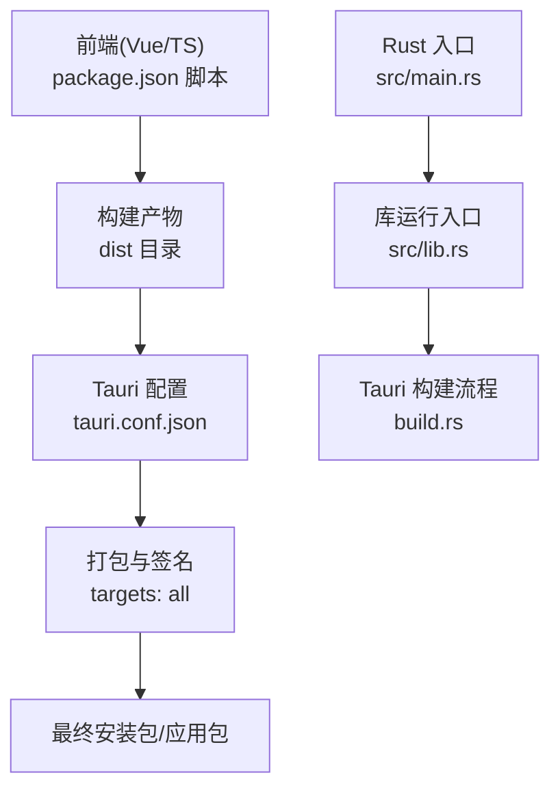
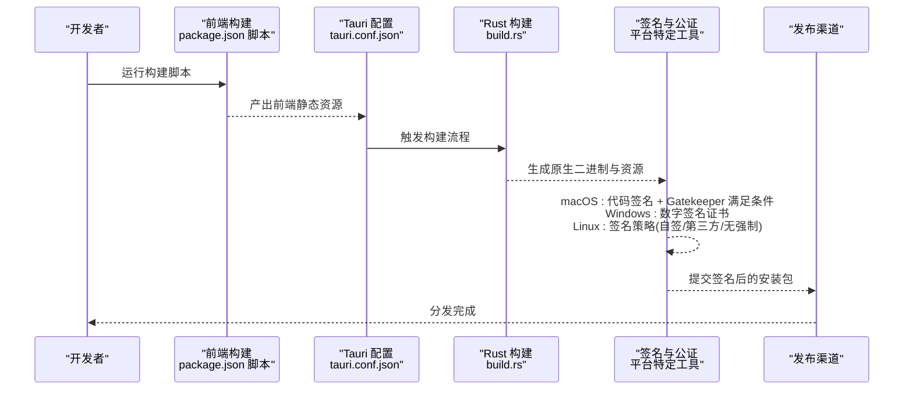
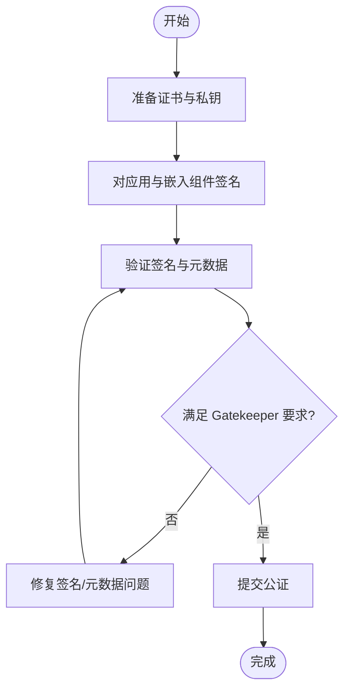
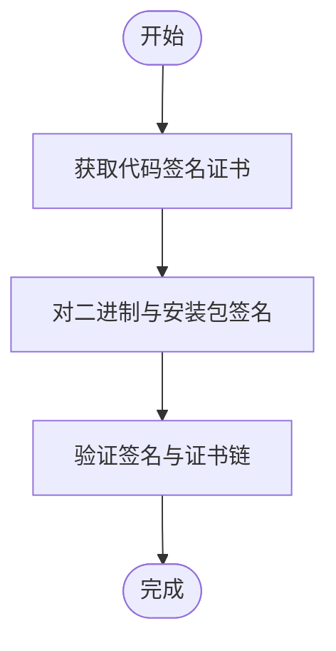
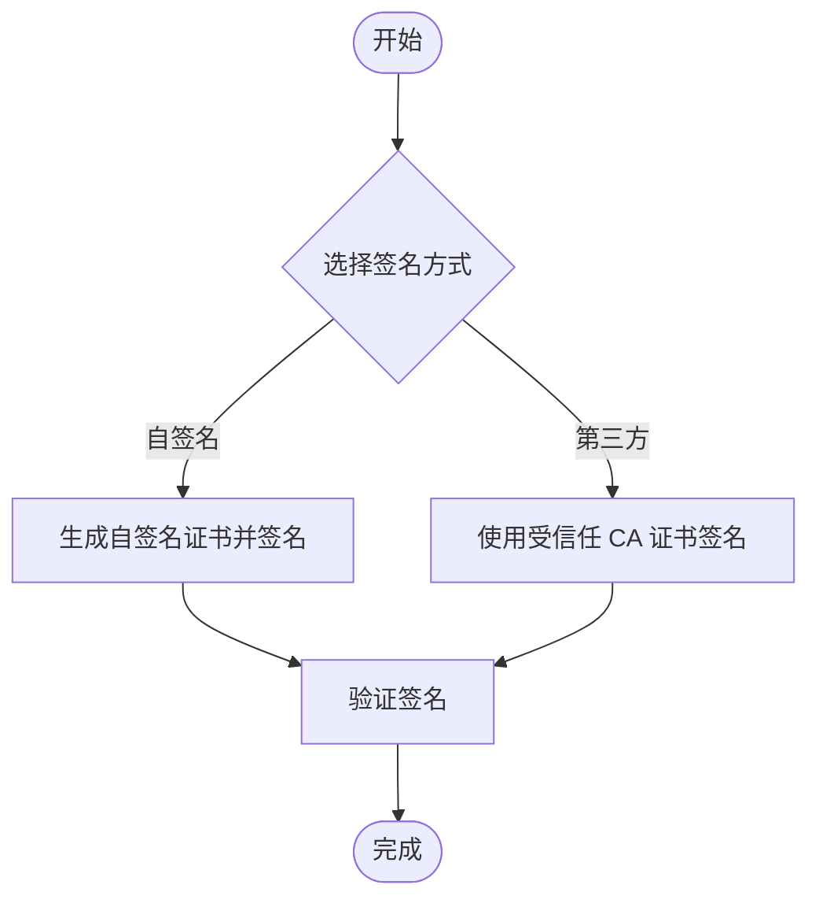
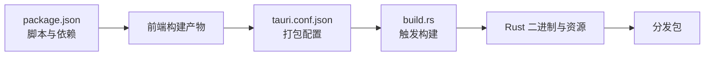

# 代码签名与公证

<cite>
**本文引用的文件**
- [tauri.conf.json](file://src-tauri/tauri.conf.json)
- [Cargo.toml](file://src-tauri/Cargo.toml)
- [package.json](file://package.json)
- [build.rs](file://src-tauri/build.rs)
- [lib.rs](file://src-tauri/src/lib.rs)
- [main.rs](file://src-tauri/src/main.rs)
- [desktop-schema.json](file://src-tauri/gen/schemas/desktop-schema.json)
</cite>

## 目录
1. [简介](#简介)
2. [项目结构](#项目结构)
3. [核心组件](#核心组件)
4. [架构总览](#架构总览)
5. [详细组件分析](#详细组件分析)
6. [依赖关系分析](#依赖关系分析)
7. [性能考虑](#性能考虑)
8. [故障排查指南](#故障排查指南)
9. [结论](#结论)
10. [附录](#附录)

## 简介
本指南面向使用 Tauri（跨平台桌面应用框架）的开发者，系统讲解在 macOS、Windows、Linux 平台上进行应用签名与公证的完整流程与最佳实践，并结合本仓库现有配置，给出可落地的签名策略、证书管理与自动化签名建议。内容涵盖：
- Apple 开发者账户与证书申请、代码签名命令与 Gatekeeper 要求
- Windows 数字签名证书的获取与使用
- Linux 平台的签名策略与注意事项
- 证书管理、更新与备份方法
- 常见签名失败原因与解决方案
- 自动化签名流程的配置思路与参考路径

## 项目结构
本项目为基于 Tauri + Vue + TypeScript 的前端与 Rust 后端混合工程，签名相关的关键位置如下：
- 应用打包与平台目标：通过 Tauri 配置文件定义打包目标与图标资源，其中包含 macOS 与 Windows 图标资源路径
- 构建入口：Rust 侧通过构建脚本调用 Tauri 构建流程
- 应用入口：Rust 主程序入口与插件初始化
- 权限与能力模型：Tauri 的权限与能力模型由生成的 JSON Schema 描述，影响打包与分发时的安全策略

图表来源
- [tauri.conf.json:1-36](file://src-tauri/tauri.conf.json#L1-L36)
- [package.json:1-25](file://package.json#L1-L25)
- [build.rs:1-4](file://src-tauri/build.rs#L1-L4)
- [lib.rs:1-15](file://src-tauri/src/lib.rs#L1-L15)
- [main.rs:1-7](file://src-tauri/src/main.rs#L1-L7)

章节来源
- [tauri.conf.json:1-36](file://src-tauri/tauri.conf.json#L1-L36)
- [package.json:1-25](file://package.json#L1-L25)
- [build.rs:1-4](file://src-tauri/build.rs#L1-L4)
- [lib.rs:1-15](file://src-tauri/src/lib.rs#L1-L15)
- [main.rs:1-7](file://src-tauri/src/main.rs#L1-L7)

## 核心组件
- 应用标识与打包配置
  - 应用产品名、版本、Bundle Identifier 以及打包目标等在 Tauri 配置中集中定义
  - 打包目标设置为“全部平台”，便于后续在各平台执行签名与公证
- 构建与运行入口
  - Rust 侧通过构建脚本触发 Tauri 构建流程
  - 应用入口负责初始化插件与运行上下文
- 权限与能力模型
  - 生成的桌面权限 Schema 描述了权限边界，有助于在签名后保持最小权限原则

章节来源
- [tauri.conf.json:1-36](file://src-tauri/tauri.conf.json#L1-L36)
- [build.rs:1-4](file://src-tauri/build.rs#L1-L4)
- [lib.rs:1-15](file://src-tauri/src/lib.rs#L1-L15)
- [main.rs:1-7](file://src-tauri/src/main.rs#L1-L7)
- [desktop-schema.json:1-200](file://src-tauri/gen/schemas/desktop-schema.json#L1-L200)

## 架构总览
下图展示从开发到打包、签名与分发的整体流程，强调签名与公证在不同平台的关键节点。

图表来源
- [package.json:1-25](file://package.json#L1-L25)
- [tauri.conf.json:1-36](file://src-tauri/tauri.conf.json#L1-L36)
- [build.rs:1-4](file://src-tauri/build.rs#L1-L4)

## 详细组件分析

### macOS 签名与公证
- 准备工作
  - Apple 开发者账户与团队角色
  - 申请并下载适用于分发的证书（如 Apple Distribution）
  - 在 Xcode 或安全工具中导入证书与私钥
  - 创建并下载对应的应用 ID 的 Provisioning Profile（如需）
- 代码签名要点
  - 使用系统工具对应用二进制、框架与资源进行签名
  - 确保 Info.plist、CFBundleIdentifier、版本号与构建号一致
  - 对嵌入式 Swift 运行时、辅助可执行文件进行签名
  - 生成并验证签名：使用系统工具检查是否满足 Gatekeeper 要求
- Gatekeeper 要求
  - 必须使用有效的企业或 Mac App Store 分发证书
  - 未公证的应用在首次打开时会提示“无法验证开发者”
  - 推荐通过 Mac App Store 或企业分发渠道进行公证
- 公证流程
  - 使用系统工具提交 .app 包进行公证
  - 公证通过后，系统会返回公证票据，确保后续更新仍受信任
- 与本仓库的关联
  - 本仓库已配置图标资源包含 macOS 图标格式，便于在签名后正确显示
  - 打包目标设置为“全部平台”，便于后续在 macOS 上执行签名与公证

图表来源
- [tauri.conf.json:24-34](file://src-tauri/tauri.conf.json#L24-L34)

章节来源
- [tauri.conf.json:24-34](file://src-tauri/tauri.conf.json#L24-L34)

### Windows 数字签名
- 证书获取
  - 通过受信任的证书颁发机构购买代码签名证书
  - 证书类型通常为代码签名证书（Code Signing），支持 EV（增强验证）可提升用户信任度
- 签名步骤
  - 使用系统工具对可执行文件、动态库与安装包进行签名
  - 设置时间戳服务器，确保离线可用性
  - 验证签名：确认证书链完整、时间戳有效、哈希算法符合要求
- 与本仓库的关联
  - 本仓库已配置图标资源包含 Windows ICO 格式，便于在签名后正确显示
  - 打包目标设置为“全部平台”，便于后续在 Windows 上执行签名

图表来源
- [tauri.conf.json:24-34](file://src-tauri/tauri.conf.json#L24-L34)

章节来源
- [tauri.conf.json:24-34](file://src-tauri/tauri.conf.json#L24-L34)

### Linux 平台签名策略
- 自签名与第三方签名
  - 可使用自签名证书快速验证流程；生产环境建议使用受信任 CA 签发的证书
- 包管理器集成
  - RPM/DEB 包可通过签名元数据与 GPG 密钥进行完整性校验
  - 发布渠道（如软件商店或仓库）通常要求签名
- 与本仓库的关联
  - 本仓库为通用跨平台打包目标，Linux 平台可按需启用签名策略

[本图为概念性流程，不直接映射具体源码文件]

### 证书管理、更新与备份
- 证书与私钥分离存储
  - 将证书与私钥分别存放于不同介质，避免同时丢失
- 备份策略
  - 定期导出证书链与私钥（注意安全存储与访问控制）
  - 记录证书有效期、用途与密钥长度
- 更新与轮换
  - 在证书到期前及时续签并测试签名流程
  - 切换新证书后，确保所有 CI/CD 环节同步更新

[本节为通用实践说明，不直接分析具体源码文件]

### 自动化签名流程配置示例
- 前置条件
  - 在 CI/CD 环境中安全地注入证书与私钥（如密钥管理服务）
  - 配置时间戳服务器与公证凭据（macOS）
- 流程设计
  - 构建前端与 Rust 二进制
  - 执行平台特定的签名步骤
  - 生成并上传签名后的安装包
- 参考路径
  - 前端构建脚本与打包命令位于项目脚本中
  - Rust 构建入口与 Tauri 构建流程由构建脚本触发

章节来源
- [package.json:1-25](file://package.json#L1-L25)
- [build.rs:1-4](file://src-tauri/build.rs#L1-L4)

## 依赖关系分析
- 前端与后端的耦合
  - 前端构建产物作为 Tauri 的前端资源输入
  - Rust 侧通过 Tauri 构建流程整合资源并生成可分发包
- 权限与能力模型
  - 生成的权限 Schema 用于约束应用行为，有助于在签名后维持最小权限原则

图表来源
- [package.json:1-25](file://package.json#L1-L25)
- [tauri.conf.json:1-36](file://src-tauri/tauri.conf.json#L1-L36)
- [build.rs:1-4](file://src-tauri/build.rs#L1-L4)

章节来源
- [package.json:1-25](file://package.json#L1-L25)
- [tauri.conf.json:1-36](file://src-tauri/tauri.conf.json#L1-L36)
- [build.rs:1-4](file://src-tauri/build.rs#L1-L4)

## 性能考虑
- 签名与公证耗时
  - macOS 公证可能需要等待，建议在 CI 中缓存签名工件并并行处理多平台
- 证书链验证
  - 在本地与 CI 环境中预热证书链，减少首次验证开销
- 批量签名
  - 对多个二进制与资源统一签名，避免重复导入证书

[本节为通用指导，不直接分析具体源码文件]

## 故障排查指南
- 常见问题与解决
  - 证书过期或不匹配：更新证书并重新签名
  - 时间戳缺失：配置可信的时间戳服务器并重签
  - 元数据不一致：核对版本号、构建号与 Bundle Identifier
  - Gatekeeper 拒绝：确保使用有效的分发证书并完成公证
- 调试建议
  - 使用系统工具检查签名与公证状态
  - 在 CI 日志中记录签名步骤与输出，便于定位问题

[本节为通用指导，不直接分析具体源码文件]

## 结论
- 本仓库已具备跨平台打包的基础配置，后续可在各平台补充签名与公证流程
- macOS 与 Windows 的签名策略差异较大，需分别遵循平台要求
- Linux 平台可采用自签名或第三方证书，结合包管理器实现完整性保障
- 建议建立完善的证书管理与自动化签名流程，确保持续交付的稳定性与安全性

[本节为总结性内容，不直接分析具体源码文件]

## 附录
- 关键配置参考
  - 打包目标与图标资源：参见应用配置文件
  - 构建入口与流程：参见构建脚本与应用入口
  - 权限与能力模型：参见生成的权限 Schema

章节来源
- [tauri.conf.json:1-36](file://src-tauri/tauri.conf.json#L1-L36)
- [build.rs:1-4](file://src-tauri/build.rs#L1-L4)
- [lib.rs:1-15](file://src-tauri/src/lib.rs#L1-L15)
- [main.rs:1-7](file://src-tauri/src/main.rs#L1-L7)
- [desktop-schema.json:1-200](file://src-tauri/gen/schemas/desktop-schema.json#L1-L200)