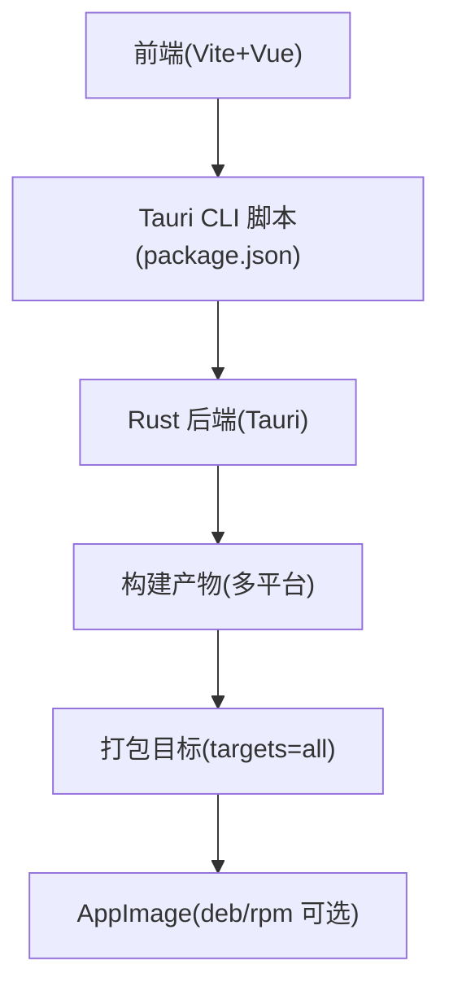
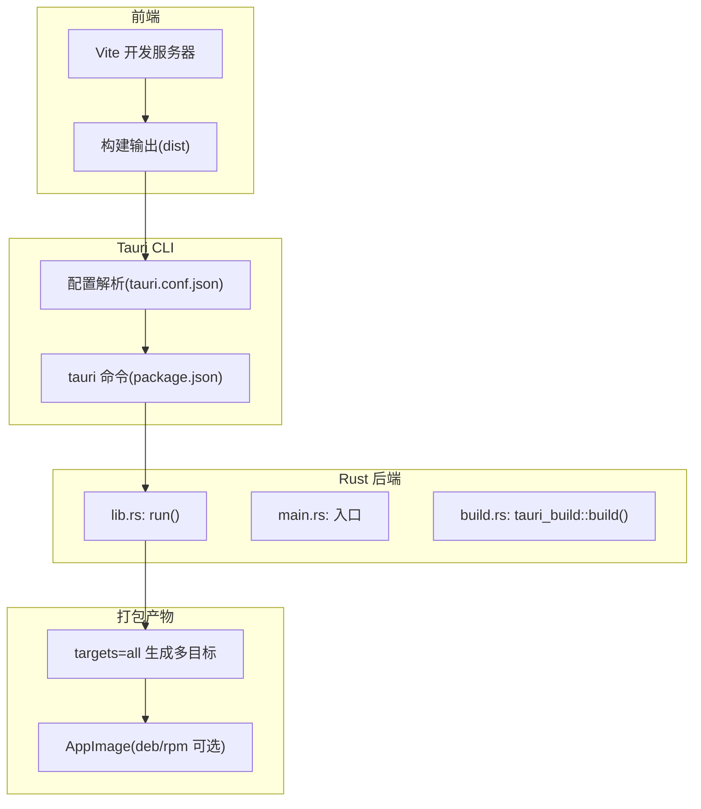
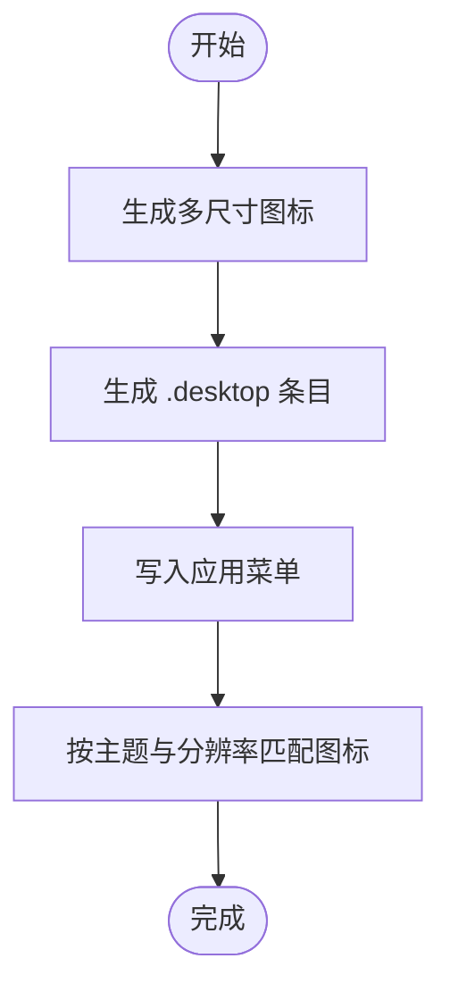
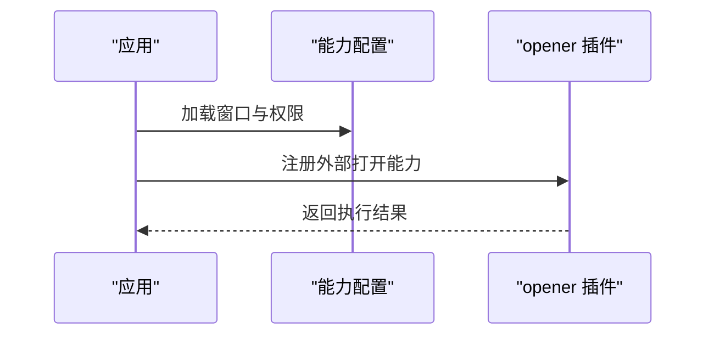
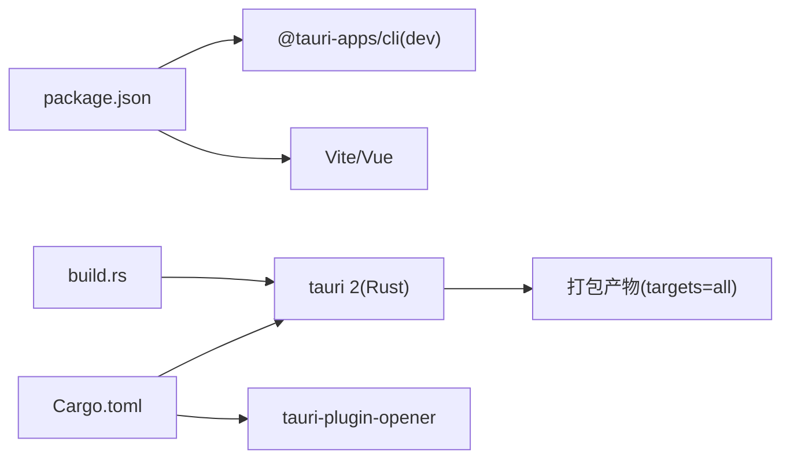

# Linux 平台打包

<cite>
**本文引用的文件**
- [tauri.conf.json](file://src-tauri/tauri.conf.json)
- [Cargo.toml](file://src-tauri/Cargo.toml)
- [package.json](file://package.json)
- [lib.rs](file://src-tauri/src/lib.rs)
- [main.rs](file://src-tauri/src/main.rs)
- [build.rs](file://src-tauri/build.rs)
- [default.json](file://src-tauri/capabilities/default.json)
- [desktop-schema.json](file://src-tauri/gen/schemas/desktop-schema.json)
- [windows-schema.json](file://src-tauri/gen/schemas/windows-schema.json)
</cite>

## 目录
1. [简介](#简介)
2. [项目结构](#项目结构)
3. [核心组件](#核心组件)
4. [架构总览](#架构总览)
5. [详细组件分析](#详细组件分析)
6. [依赖关系分析](#依赖关系分析)
7. [性能考虑](#性能考虑)
8. [故障排除指南](#故障排除指南)
9. [结论](#结论)
10. [附录](#附录)

## 简介
本文件面向在 Linux 平台上进行应用分发与打包的工程师与运维人员，结合仓库中的 Tauri 配置，系统阐述以下内容：
- 不同包格式（AppImage、deb、rpm）在 Linux 上的特点与适用场景
- 桌面集成配置（.desktop 文件、图标主题支持）
- 主流发行版兼容性测试方法
- 现代打包格式（Flatpak、Snap）的支持现状与建议
- 权限配置与安全沙盒设置
- 包管理器安装与更新机制说明

本指南以仓库现有配置为依据，避免臆测，确保可操作性与准确性。

## 项目结构
该仓库采用 Tauri v2 架构，前端使用 Vite + Vue，后端使用 Rust。Linux 打包能力由 Tauri 的 bundle 子系统提供，默认启用并支持“所有目标”。关键配置集中在 Tauri 配置文件中，图标资源位于 src-tauri/icons 目录，能力定义位于 capabilities/default.json。

**章节来源**
- [package.json:1-25](file://package.json#L1-L25)
- [tauri.conf.json:1-36](file://src-tauri/tauri.conf.json#L1-L36)
- [Cargo.toml:1-26](file://src-tauri/Cargo.toml#L1-L26)

## 核心组件
- Tauri 配置：定义产品名、版本、开发命令、打包目标与图标集合等。
- Rust 后端：通过 Tauri Builder 初始化应用，注册插件与命令。
- 前端脚本：提供 tauri 命令入口，驱动 CLI 打包流程。
- 能力配置：声明窗口与权限，为 Linux 桌面集成提供基础。

**章节来源**
- [tauri.conf.json:24-34](file://src-tauri/tauri.conf.json#L24-L34)
- [lib.rs:8-14](file://src-tauri/src/lib.rs#L8-L14)
- [package.json:10-11](file://package.json#L10-L11)
- [default.json:1-11](file://src-tauri/capabilities/default.json#L1-L11)

## 架构总览
下图展示从前端到打包产物的关键路径，以及 Linux 打包目标的生成位置。

**图表来源**
- [package.json:6-11](file://package.json#L6-L11)
- [tauri.conf.json:6-11](file://src-tauri/tauri.conf.json#L6-L11)
- [lib.rs:8-14](file://src-tauri/src/lib.rs#L8-L14)
- [main.rs:4-6](file://src-tauri/src/main.rs#L4-L6)
- [build.rs:1-3](file://src-tauri/build.rs#L1-L3)

**章节来源**
- [package.json:6-11](file://package.json#L6-L11)
- [tauri.conf.json:6-11](file://src-tauri/tauri.conf.json#L6-L11)
- [lib.rs:8-14](file://src-tauri/src/lib.rs#L8-L14)
- [main.rs:4-6](file://src-tauri/src/main.rs#L4-L6)
- [build.rs:1-3](file://src-tauri/build.rs#L1-L3)

## 详细组件分析

### Linux 打包目标与特性
- 目标选择：配置中 targets=all 表示默认生成所有可用目标，Linux 平台通常包含 AppImage、deb、rpm 等。
- AppImage 特点：便携、无需安装、自包含运行时；适合个人分发与快速试用。
- deb/rpm 特点：遵循发行版包管理器生态，便于系统级集成与更新；适合正式发布与企业部署。
- 适用场景：AppImage 更适合开发者与个人用户；deb/rpm 更适合需要系统集成与长期维护的场景。

**章节来源**
- [tauri.conf.json:24-26](file://src-tauri/tauri.conf.json#L24-L26)

### 桌面集成配置（.desktop 与图标）
- .desktop 文件：由 Tauri 在 Linux 平台自动生成或根据配置注入，用于在桌面环境显示应用图标、菜单项与启动行为。
- 图标主题支持：配置中已指定多尺寸图标，Linux 桌面环境会按分辨率与主题自动匹配合适的图标大小。
- 能力与窗口：能力配置声明了主窗口与权限，为桌面集成提供窗口标识与访问控制基础。

**章节来源**
- [tauri.conf.json:27-33](file://src-tauri/tauri.conf.json#L27-L33)
- [default.json:4-9](file://src-tauri/capabilities/default.json#L4-L9)

### 主流发行版兼容性测试方法
- 测试矩阵建议：
  - Debian/Ubuntu（stable/beta）：验证 deb 安装与菜单集成
  - Fedora/RHEL（latest）：验证 rpm 安装与桌面环境
  - openSUSE/SLE：验证 rpm 与 YaST/zypper
  - Arch/Manjaro：验证 AppImage 与 AUR 分发
- 关键测试点：
  - 安装/卸载流程
  - .desktop 与图标是否正确显示
  - 桌面搜索与启动器行为
  - 权限与沙盒限制下的功能完整性

[本节为通用实践指导，不直接分析具体文件]

### 现代打包格式支持（Flatpak 与 Snap）
- Flatpak：通过沙盒运行，隔离系统依赖；适合需要严格权限控制与跨发行版一致性的场景。
- Snap：同样提供沙盒与自动更新能力；适合对易用性与自动更新有要求的场景。
- 支持现状：仓库未包含 Flatpak 或 Snap 的专用配置文件；如需支持，可在 CI 中添加相应构建步骤或引入第三方工具链。

[本节为通用实践指导，不直接分析具体文件]

### 权限配置与安全沙盒
- 能力模型：通过 capabilities/default.json 声明窗口与权限，限制应用在 Linux 桌面环境中的访问范围。
- 插件权限：已启用 opener 插件，注意其对外部协议/文件打开的权限边界。
- 沙盒建议：若采用 Flatpak/Snap，建议进一步收紧权限，仅授予必要接口与文件系统访问。

**图表来源**
- [default.json:4-9](file://src-tauri/capabilities/default.json#L4-L9)
- [lib.rs:10-11](file://src-tauri/src/lib.rs#L10-L11)

**章节来源**
- [default.json:4-9](file://src-tauri/capabilities/default.json#L4-L9)
- [lib.rs:10-11](file://src-tauri/src/lib.rs#L10-L11)

### 包管理器安装与更新机制
- 安装方式：
  - AppImage：直接下载可执行文件，双击或命令行运行
  - deb：apt/yum/dnf/zyp 进行安装与卸载
  - rpm：dnf/yum/zypper 安装与卸载
- 更新策略：
  - AppImage：用户自行替换新版本
  - deb/rpm：通过发行版仓库或第三方源进行更新
  - Flatpak/Snap：利用沙盒内更新机制保持一致性

[本节为通用实践指导，不直接分析具体文件]

## 依赖关系分析
- 前端依赖：Vite、Vue、@tauri-apps/cli 提供开发与打包能力
- 后端依赖：Tauri 2 作为运行时框架，tauri-plugin-opener 提供外部打开能力
- 构建依赖：tauri-build 在编译期生成上下文与资源

**图表来源**
- [package.json:12-23](file://package.json#L12-L23)
- [Cargo.toml:17-25](file://src-tauri/Cargo.toml#L17-L25)
- [build.rs:1-3](file://src-tauri/build.rs#L1-L3)

**章节来源**
- [package.json:12-23](file://package.json#L12-L23)
- [Cargo.toml:17-25](file://src-tauri/Cargo.toml#L17-L25)
- [build.rs:1-3](file://src-tauri/build.rs#L1-L3)

## 性能考虑
- AppImage：启动时解压与加载可能带来轻微延迟，适合单次使用场景
- deb/rpm：系统级缓存与预加载优化较好，适合高频使用场景
- 图标与资源：多尺寸图标有助于减少渲染开销，提升桌面菜单显示效率

[本节提供一般性建议，不直接分析具体文件]

## 故障排除指南
- 打包失败：检查 tauri.conf.json 中的 frontendDist 与 icon 路径是否正确
- .desktop 未显示：确认图标尺寸与主题匹配，检查能力配置中的窗口标识
- 权限问题：核对 capabilities/default.json 中的权限声明，避免过度授权
- 插件异常：检查 opener 插件初始化与调用链路

**章节来源**
- [tauri.conf.json:6-11](file://src-tauri/tauri.conf.json#L6-L11)
- [tauri.conf.json:27-33](file://src-tauri/tauri.conf.json#L27-L33)
- [default.json:4-9](file://src-tauri/capabilities/default.json#L4-L9)
- [lib.rs:10-11](file://src-tauri/src/lib.rs#L10-L11)

## 结论
本仓库基于 Tauri v2 的默认配置，已具备在 Linux 平台生成多目标打包产物的能力。结合 AppImage、deb、rpm 的特性与桌面集成配置，可满足从个人分发到企业部署的不同需求。对于需要更强权限控制与跨发行版一致性的场景，建议评估引入 Flatpak 或 Snap 的方案，并在 CI 中完善兼容性测试与自动化更新流程。

## 附录
- 模式与平台支持：桌面模式与 Windows 模式均包含 linux 字段，表明 Tauri 对 Linux 的通用支持。
  
**章节来源**
- [desktop-schema.json:2439](file://src-tauri/gen/schemas/desktop-schema.json#L2439)
- [windows-schema.json:2439](file://src-tauri/gen/schemas/windows-schema.json#L2439)