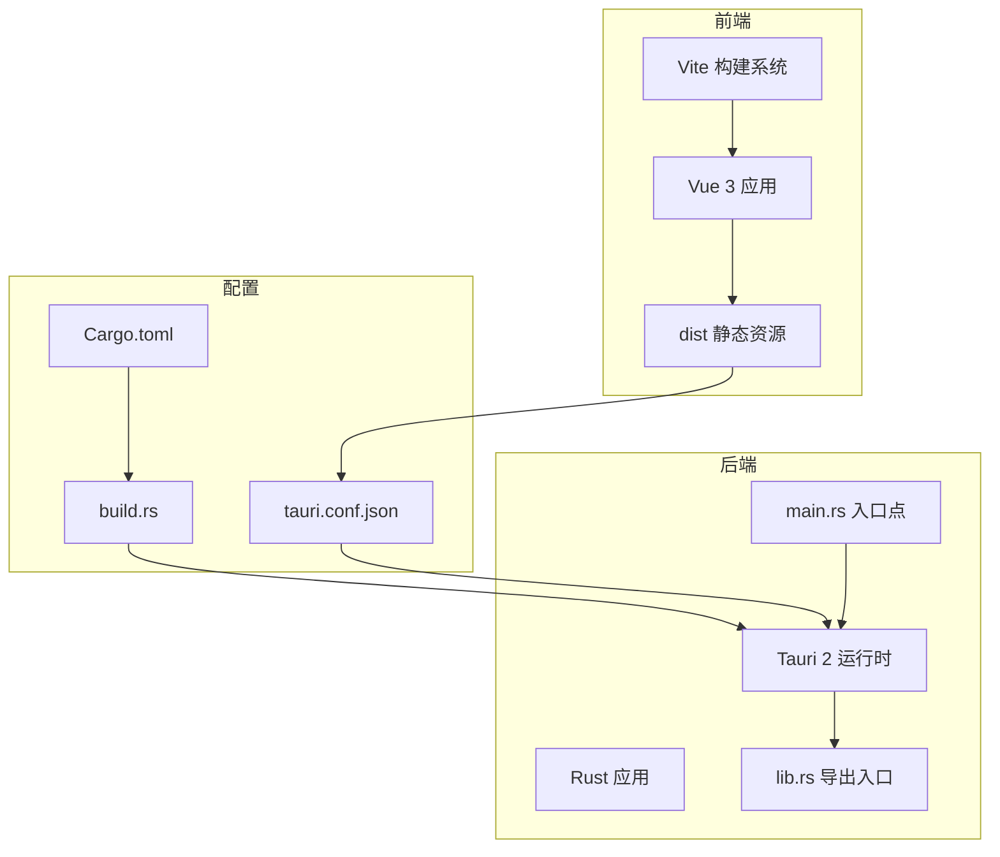
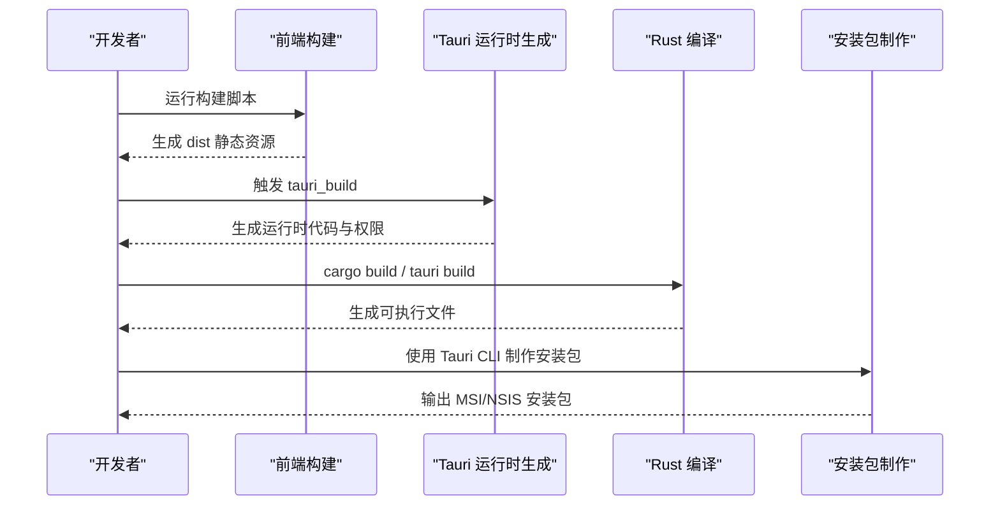
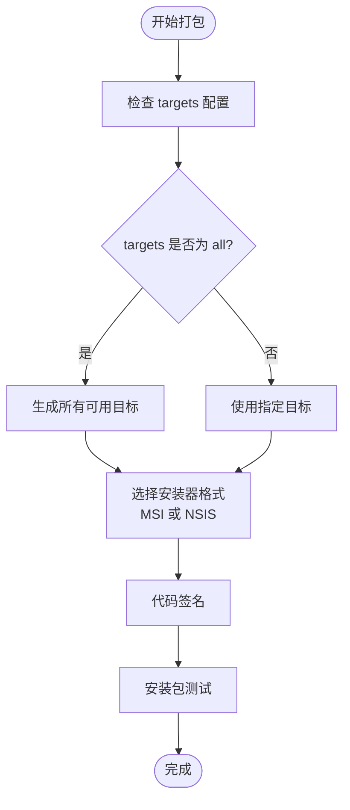
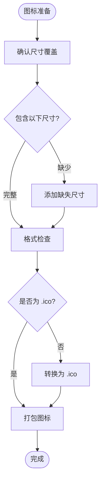
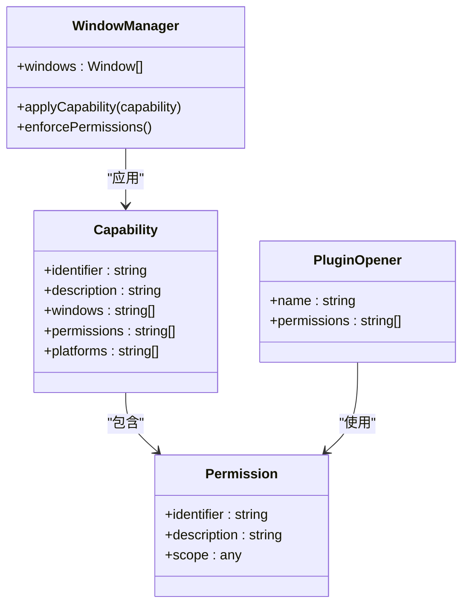
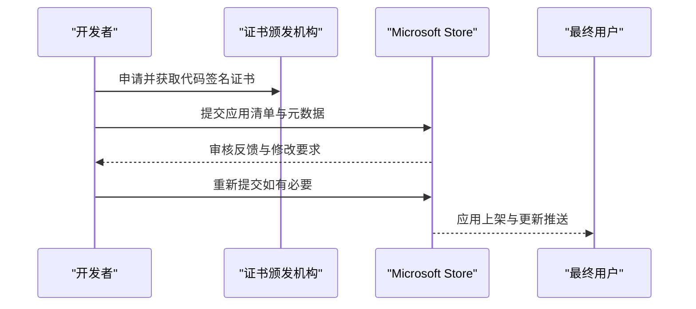
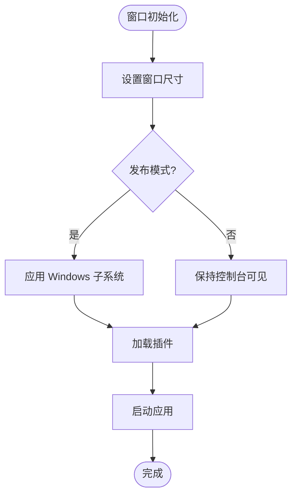

# Windows 平台打包

<cite>
**本文档引用的文件**
- [tauri.conf.json](file://src-tauri/tauri.conf.json)
- [Cargo.toml](file://src-tauri/Cargo.toml)
- [build.rs](file://src-tauri/build.rs)
- [main.rs](file://src-tauri/src/main.rs)
- [lib.rs](file://src-tauri/src/lib.rs)
- [package.json](file://package.json)
- [default.json](file://src-tauri/capabilities/default.json)
- [capabilities.json](file://src-tauri/gen/schemas/capabilities.json)
- [desktop-schema.json](file://src-tauri/gen/schemas/desktop-schema.json)
</cite>

## 目录
1. [简介](#简介)
2. [项目结构](#项目结构)
3. [核心组件](#核心组件)
4. [架构概览](#架构概览)
5. [详细组件分析](#详细组件分析)
6. [依赖关系分析](#依赖关系分析)
7. [性能考虑](#性能考虑)
8. [故障排除指南](#故障排除指南)
9. [结论](#结论)
10. [附录](#附录)

## 简介
本文件为 Tauri 应用在 Windows 平台的打包与分发技术文档。重点涵盖以下方面：
- Windows 平台打包配置选项（MSI 与 NSIS 安装程序格式）
- 图标文件要求（特别是 .ico 多分辨率支持）
- Windows 特定安全配置（代码签名、防火墙权限）
- 安装包测试与兼容性验证方法
- Windows Store 分发的特殊要求与流程
- 平台特定的窗口配置与用户体验优化

## 项目结构
该 Tauri 项目采用前端与后端分离的典型结构：
- 前端：Vite + Vue 3（位于根目录），通过构建脚本生成静态资源
- 后端：Rust（位于 src-tauri/），使用 Tauri 2 运行时
- 配置：Tauri 配置文件集中管理应用元数据、打包设置与窗口行为



**图表来源**
- [tauri.conf.json:1-36](file://src-tauri/tauri.conf.json#L1-L36)
- [Cargo.toml:1-26](file://src-tauri/Cargo.toml#L1-L26)
- [build.rs:1-4](file://src-tauri/build.rs#L1-L4)
- [main.rs:1-7](file://src-tauri/src/main.rs#L1-L7)
- [lib.rs:1-15](file://src-tauri/src/lib.rs#L1-L15)

**章节来源**
- [tauri.conf.json:1-36](file://src-tauri/tauri.conf.json#L1-L36)
- [Cargo.toml:1-26](file://src-tauri/Cargo.toml#L1-L26)
- [build.rs:1-4](file://src-tauri/build.rs#L1-L4)
- [main.rs:1-7](file://src-tauri/src/main.rs#L1-L7)
- [lib.rs:1-15](file://src-tauri/src/lib.rs#L1-L15)

## 核心组件
- 应用配置（tauri.conf.json）：定义产品名称、版本、标识符、构建前命令、前端资源路径、窗口属性与打包图标等。
- 包管理（Cargo.toml）：声明 Rust 项目元信息、依赖项及构建类型。
- 构建入口（build.rs）：调用 tauri_build::build() 完成运行时代码生成。
- 应用入口（main.rs）：在发布模式下隐藏控制台窗口，确保无额外控制台弹窗。
- 应用逻辑（lib.rs）：注册插件、命令处理器，并启动 Tauri 运行时。

**章节来源**
- [tauri.conf.json:1-36](file://src-tauri/tauri.conf.json#L1-L36)
- [Cargo.toml:1-26](file://src-tauri/Cargo.toml#L1-L26)
- [build.rs:1-4](file://src-tauri/build.rs#L1-L4)
- [main.rs:1-7](file://src-tauri/src/main.rs#L1-L7)
- [lib.rs:1-15](file://src-tauri/src/lib.rs#L1-L15)

## 架构概览
Windows 平台打包涉及前端构建、Tauri 运行时生成、Rust 编译与安装包制作四个阶段。下图展示了从开发到分发的关键流程：



**图表来源**
- [package.json:6-11](file://package.json#L6-L11)
- [build.rs:1-4](file://src-tauri/build.rs#L1-L4)
- [tauri.conf.json:6-11](file://src-tauri/tauri.conf.json#L6-L11)

## 详细组件分析

### Windows 打包配置与安装程序格式
- 目标选择：当前配置中 targets 设置为 "all"，表示会生成所有可用目标，包括 Windows 平台的安装包。
- 安装程序格式：Tauri 默认支持多种安装器格式，具体启用哪些格式取决于 CLI 配置与平台工具链。建议在 CI 中明确指定目标以确保一致性。
- 打包命令：通过前端脚本中的 tauri 命令触发打包流程；也可直接使用 Tauri CLI 的 build 子命令。



**图表来源**
- [tauri.conf.json:24-26](file://src-tauri/tauri.conf.json#L24-L26)
- [package.json:10](file://package.json#L10)

**章节来源**
- [tauri.conf.json:24-26](file://src-tauri/tauri.conf.json#L24-L26)
- [package.json:10](file://package.json#L10)

### 图标文件要求与多分辨率支持
- 当前配置中已包含 PNG 与 ICO 格式图标路径，用于不同平台的适配。
- Windows 平台推荐使用 .ico 格式，以便在任务栏、开始菜单和文件资源管理器中正确显示多分辨率图标。
- 建议准备以下尺寸的图标：16x16、32x32、48x48、256x256 及高 DPI @2x（例如 512x512）。



**图表来源**
- [tauri.conf.json:27-33](file://src-tauri/tauri.conf.json#L27-L33)

**章节来源**
- [tauri.conf.json:27-33](file://src-tauri/tauri.conf.json#L27-L33)

### Windows 特定安全配置
- 代码签名：为确保 Windows 用户信任度与安全策略满足，必须对可执行文件与安装包进行数字签名。建议使用受信任的代码签名证书，并在 CI 中自动化签名流程。
- 防火墙权限：若应用需要网络访问或监听端口，需在安装包中配置防火墙例外规则，或在首次运行时引导用户授权。
- 权限模型：Tauri 2 引入了能力（capability）与权限（permission）机制，通过 JSON 配置精确控制窗口与插件的访问范围。



**图表来源**
- [default.json:1-10](file://src-tauri/capabilities/default.json#L1-L10)
- [capabilities.json:1-5](file://src-tauri/gen/schemas/capabilities.json#L1-L5)
- [desktop-schema.json:39-94](file://src-tauri/gen/schemas/desktop-schema.json#L39-L94)

**章节来源**
- [default.json:1-10](file://src-tauri/capabilities/default.json#L1-L10)
- [capabilities.json:1-5](file://src-tauri/gen/schemas/capabilities.json#L1-L5)
- [desktop-schema.json:39-94](file://src-tauri/gen/schemas/desktop-schema.json#L39-L94)

### Windows Store 分发的特殊要求与流程
- 应用清单：Windows Store 要求提供完整的应用清单（AppX/MSIX），包含版本、架构、依赖与功能声明。
- 代码签名：必须使用 Microsoft 承认的证书进行签名，且证书需与提交的应用 ID 对应。
- 审核流程：提交后需经过 Microsoft 的审核，期间可能要求修正合规问题或补充信息。
- 自动更新：Store 分发的应用可通过 Microsoft 的更新服务实现自动更新。



**图表来源**
- [tauri.conf.json:3-5](file://src-tauri/tauri.conf.json#L3-L5)

**章节来源**
- [tauri.conf.json:3-5](file://src-tauri/tauri.conf.json#L3-L5)

### 平台特定的窗口配置与用户体验优化
- 窗口尺寸：配置文件中定义了默认窗口的宽度与高度，可根据目标屏幕密度调整。
- 隐藏控制台：在发布模式下通过 Windows 子系统设置隐藏控制台窗口，避免不必要的用户干扰。
- 插件集成：示例中集成了 opener 插件，便于处理外部链接与文件打开请求，提升用户体验。



**图表来源**
- [tauri.conf.json:12-23](file://src-tauri/tauri.conf.json#L12-L23)
- [main.rs:1-2](file://src-tauri/src/main.rs#L1-L2)
- [lib.rs:10-11](file://src-tauri/src/lib.rs#L10-L11)

**章节来源**
- [tauri.conf.json:12-23](file://src-tauri/tauri.conf.json#L12-L23)
- [main.rs:1-2](file://src-tauri/src/main.rs#L1-L2)
- [lib.rs:10-11](file://src-tauri/src/lib.rs#L10-L11)

## 依赖关系分析
- 前端依赖：Vite、Vue 3、TypeScript 与 @tauri-apps/cli。
- 后端依赖：Tauri 2、tauri-plugin-opener、Serde 等。
- 构建链路：package.json 中的 tauri 脚本驱动 Tauri CLI，结合 tauri.conf.json 的配置生成安装包。

```mermaid
graph TB
PkgJSON[package.json] --> TauriCLI[@tauri-apps/cli]
TauriCLI --> TauriConf[tauri.conf.json]
TauriConf --> CargoToml[Cargo.toml]
CargoToml --> BuildRS[build.rs]
BuildRS --> TauriRuntime[Tauri 2 运行时]
TauriRuntime --> LibRS[lib.rs]
LibRS --> MainRS[main.rs]
```

**图表来源**
- [package.json:12-23](file://package.json#L12-L23)
- [tauri.conf.json:1-36](file://src-tauri/tauri.conf.json#L1-L36)
- [Cargo.toml:10-25](file://src-tauri/Cargo.toml#L10-L25)
- [build.rs:1-4](file://src-tauri/build.rs#L1-L4)
- [lib.rs:1-15](file://src-tauri/src/lib.rs#L1-L15)
- [main.rs:1-7](file://src-tauri/src/main.rs#L1-L7)

**章节来源**
- [package.json:12-23](file://package.json#L12-L23)
- [Cargo.toml:10-25](file://src-tauri/Cargo.toml#L10-L25)

## 性能考虑
- 图标尺寸：为减少内存占用与渲染开销，建议仅包含必要的尺寸，并确保高 DPI 场景下的清晰度。
- 插件最小化：仅启用必需的插件，避免不必要的运行时开销。
- 构建优化：在 CI 中启用增量构建与缓存，缩短打包时间。

## 故障排除指南
- 控制台窗口问题：确认发布模式下的 Windows 子系统设置已正确应用。
- 权限不足：检查能力与权限配置，确保窗口与插件具备所需的访问范围。
- 安装失败：验证代码签名证书有效性与安装包完整性。

**章节来源**
- [main.rs:1-2](file://src-tauri/src/main.rs#L1-L2)
- [default.json:1-10](file://src-tauri/capabilities/default.json#L1-L10)
- [desktop-schema.json:39-94](file://src-tauri/gen/schemas/desktop-schema.json#L39-L94)

## 结论
本文档总结了 Tauri 应用在 Windows 平台的打包要点：明确安装器格式选择、准备多分辨率图标、实施代码签名与防火墙权限、完善测试与兼容性验证，并遵循 Windows Store 分发的合规流程。同时，通过能力与权限模型实现精细化的窗口与插件访问控制，结合平台特性优化用户体验。

## 附录
- 建议在 CI 中固定 Tauri CLI 版本，确保打包一致性。
- 在本地开发环境中先进行安装包测试，再进行 Store 提交。
- 定期审查权限配置，遵循最小权限原则。