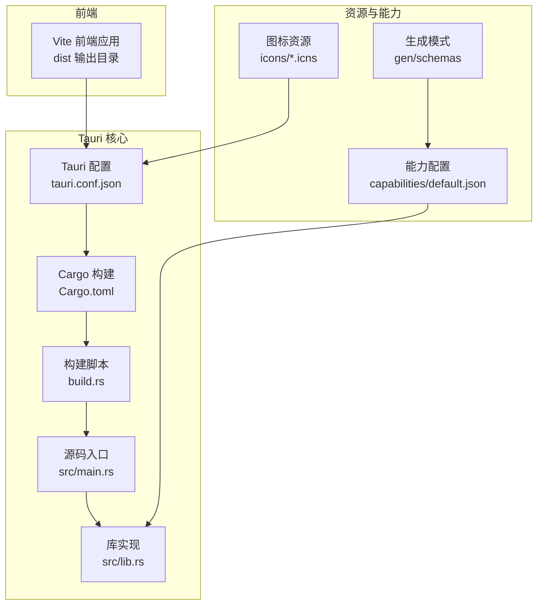
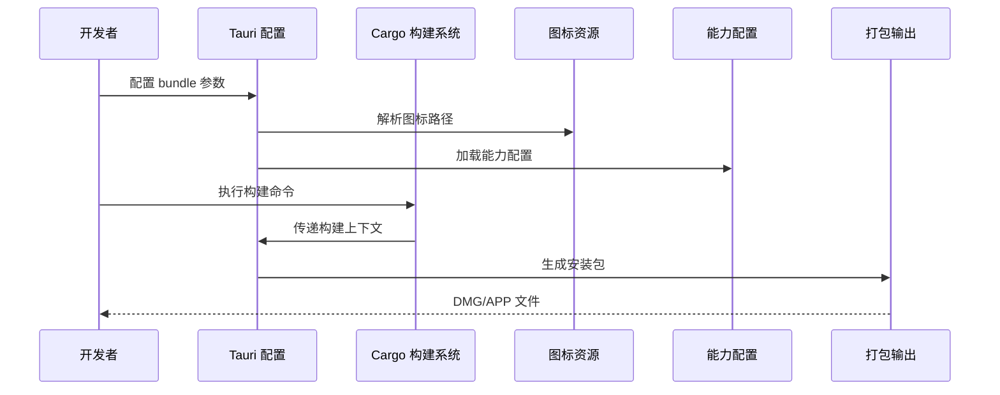
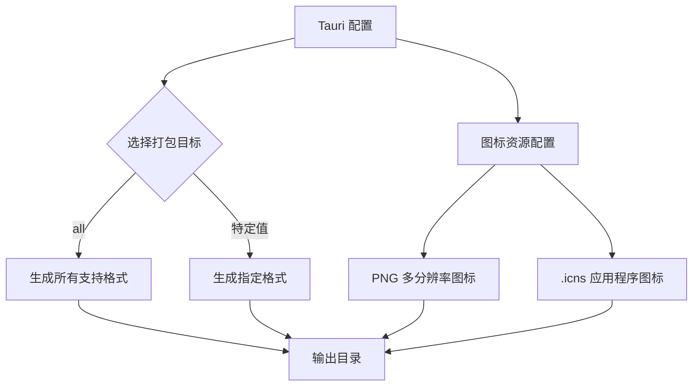
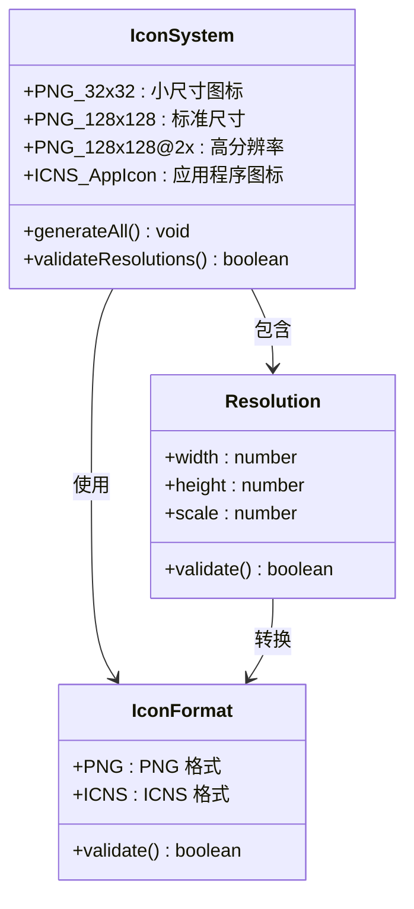
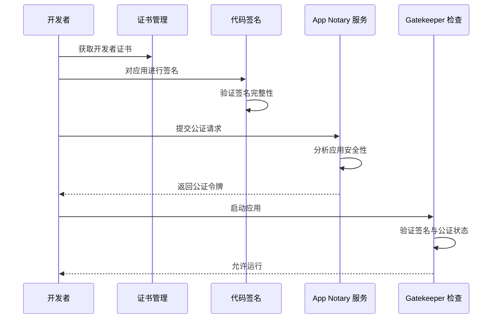
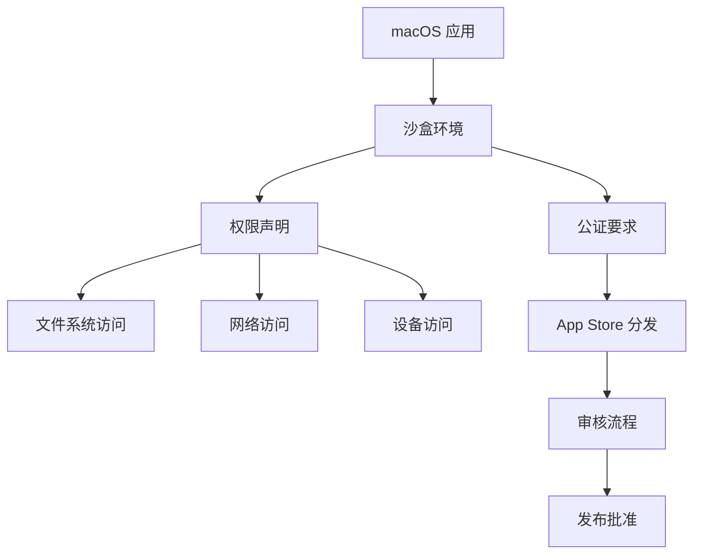
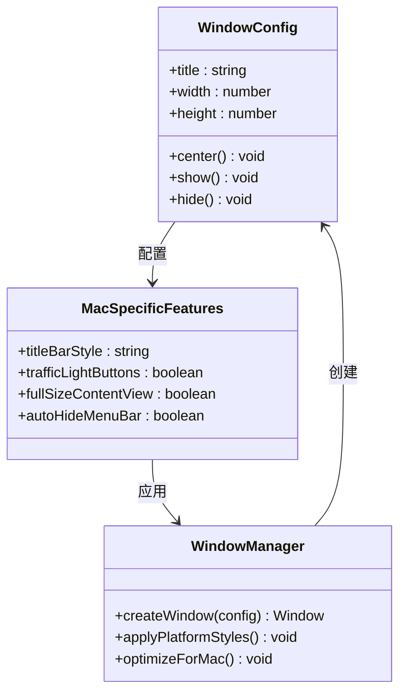
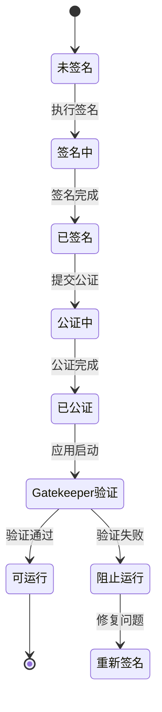
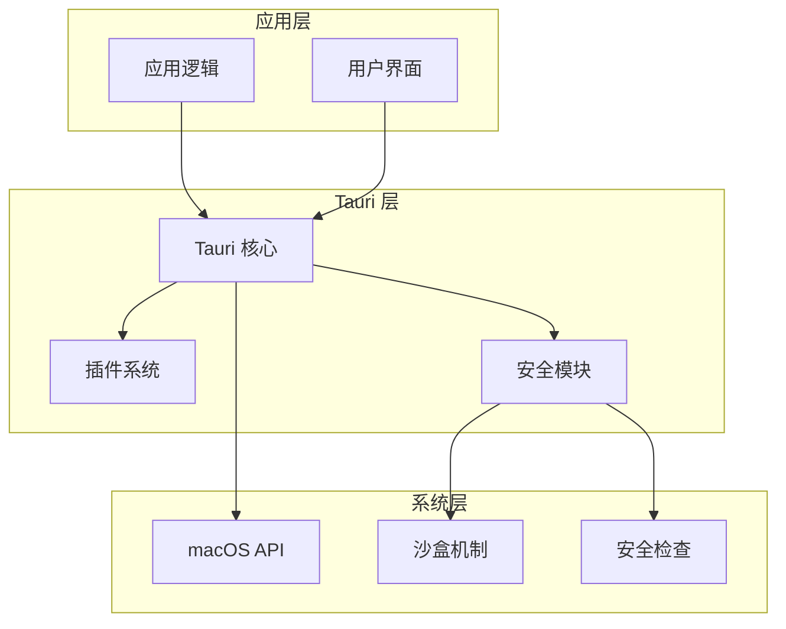

# macOS 平台打包

<cite>
**本文档引用的文件**
- [tauri.conf.json](file://src-tauri/tauri.conf.json)
- [Cargo.toml](file://src-tauri/Cargo.toml)
- [build.rs](file://src-tauri/build.rs)
- [main.rs](file://src-tauri/src/main.rs)
- [lib.rs](file://src-tauri/src/lib.rs)
- [default.json](file://src-tauri/capabilities/default.json)
- [capabilities.json](file://src-tauri/gen/schemas/capabilities.json)
</cite>

## 目录
1. [简介](#简介)
2. [项目结构](#项目结构)
3. [核心组件](#核心组件)
4. [架构概览](#架构概览)
5. [详细组件分析](#详细组件分析)
6. [依赖关系分析](#依赖关系分析)
7. [性能考虑](#性能考虑)
8. [故障排除指南](#故障排除指南)
9. [结论](#结论)
10. [附录](#附录)

## 简介
本指南专注于使用 Tauri 框架为 macOS 平台创建高质量的应用分发包。文档涵盖以下关键主题：DMG 和 APP 安装包格式的区别与配置、.icns 图标文件的制作要求与多分辨率支持、macOS 代码签名与公证流程、沙盒权限配置与 App Store 分发要求、macOS 特定的窗口行为与用户体验优化，以及 Gatekeeper 兼容性与安全策略配置。

## 项目结构
Tauri 应用采用前后端分离的结构，前端通过 Vite 构建，后端通过 Rust 管理应用逻辑与系统集成。macOS 打包配置主要集中在 Tauri 配置文件中，图标资源位于 src-tauri/icons 目录，能力配置在 capabilities 子目录中管理。

**图表来源**
- [tauri.conf.json:1-36](file://src-tauri/tauri.conf.json#L1-L36)
- [Cargo.toml:1-26](file://src-tauri/Cargo.toml#L1-L26)
- [build.rs:1-4](file://src-tauri/build.rs#L1-L4)
- [main.rs:1-7](file://src-tauri/src/main.rs#L1-L7)
- [lib.rs:1-15](file://src-tauri/src/lib.rs#L1-L15)

**章节来源**
- [tauri.conf.json:1-36](file://src-tauri/tauri.conf.json#L1-L36)
- [Cargo.toml:1-26](file://src-tauri/Cargo.toml#L1-L26)
- [build.rs:1-4](file://src-tauri/build.rs#L1-L4)
- [main.rs:1-7](file://src-tauri/src/main.rs#L1-L7)
- [lib.rs:1-15](file://src-tauri/src/lib.rs#L1-L15)

## 核心组件
本节分析与 macOS 打包直接相关的组件及其职责：

- **Tauri 配置系统**：集中管理产品名称、版本号、Bundle ID、构建命令、图标配置等关键信息
- **Cargo 构建系统**：定义 Rust 依赖、构建目标类型和编译特性
- **能力管理系统**：控制应用权限范围，确保最小权限原则
- **图标资源系统**：提供多分辨率图标以适配不同显示密度

**章节来源**
- [tauri.conf.json:24-34](file://src-tauri/tauri.conf.json#L24-L34)
- [Cargo.toml:10-25](file://src-tauri/Cargo.toml#L10-L25)
- [default.json:1-11](file://src-tauri/capabilities/default.json#L1-L11)

## 架构概览
下图展示了 macOS 打包过程中的关键交互关系：

**图表来源**
- [tauri.conf.json:24-34](file://src-tauri/tauri.conf.json#L24-L34)
- [Cargo.toml:17-25](file://src-tauri/Cargo.toml#L17-L25)
- [default.json:6-9](file://src-tauri/capabilities/default.json#L6-L9)

## 详细组件分析

### DMG 与 APP 安装包格式配置
Tauri 支持多种安装包格式，包括 DMG（磁盘映像）和 APP（应用程序包）。配置要点如下：

- **目标选择**：通过 bundle.targets 字段控制打包目标
- **图标配置**：同时提供 PNG 和 ICNS 格式以满足不同场景需求
- **元数据管理**：产品名称、版本号、Bundle ID 等信息统一管理

**图表来源**
- [tauri.conf.json:24-34](file://src-tauri/tauri.conf.json#L24-L34)

**章节来源**
- [tauri.conf.json:24-34](file://src-tauri/tauri.conf.json#L24-L34)

### .icns 图标文件制作与多分辨率支持
图标系统需要提供多种分辨率以适配不同的显示密度：

- **基础尺寸**：32x32 像素用于小尺寸显示
- **标准尺寸**：128x128 像素满足常规显示需求  
- **高分辨率**：128x128@2x 提供 Retina 显示支持
- **应用程序图标**：icon.icns 作为主应用程序图标

**图表来源**
- [tauri.conf.json:27-33](file://src-tauri/tauri.conf.json#L27-L33)

**章节来源**
- [tauri.conf.json:27-33](file://src-tauri/tauri.conf.json#L27-L33)

### macOS 代码签名与公证流程
代码签名是 macOS 应用分发的关键步骤，确保应用完整性与来源可信：

**图表来源**
- [lib.rs:10-13](file://src-tauri/src/lib.rs#L10-L13)

**章节来源**
- [lib.rs:10-13](file://src-tauri/src/lib.rs#L10-L13)

### 沙盒权限配置与 App Store 分发要求
沙盒机制限制应用对系统资源的访问，需要明确声明所需权限：

**图表来源**
- [default.json:6-9](file://src-tauri/capabilities/default.json#L6-L9)
- [capabilities.json:1](file://src-tauri/gen/schemas/capabilities.json#L1)

**章节来源**
- [default.json:6-9](file://src-tauri/capabilities/default.json#L6-L9)
- [capabilities.json:1](file://src-tauri/gen/schemas/capabilities.json#L1)

### macOS 特定的窗口行为与用户体验优化
Tauri 提供了针对 macOS 平台的窗口管理功能：

**图表来源**
- [tauri.conf.json:12-23](file://src-tauri/tauri.conf.json#L12-L23)

**章节来源**
- [tauri.conf.json:12-23](file://src-tauri/tauri.conf.json#L12-L23)

### Gatekeeper 兼容性与安全策略配置
Gatekeeper 是 macOS 的安全机制，需要正确配置以确保应用顺利运行：

**图表来源**
- [lib.rs:10-13](file://src-tauri/src/lib.rs#L10-L13)

**章节来源**
- [lib.rs:10-13](file://src-tauri/src/lib.rs#L10-L13)

## 依赖关系分析
应用的依赖关系直接影响打包过程和最终产物质量：

**图表来源**
- [Cargo.toml:20-25](file://src-tauri/Cargo.toml#L20-L25)
- [lib.rs:10-13](file://src-tauri/src/lib.rs#L10-L13)

**章节来源**
- [Cargo.toml:20-25](file://src-tauri/Cargo.toml#L20-L25)
- [lib.rs:10-13](file://src-tauri/src/lib.rs#L10-L13)

## 性能考虑
- **图标加载优化**：合理配置图标分辨率，避免不必要的内存占用
- **权限最小化**：仅声明必要的沙盒权限，减少系统调用开销
- **构建缓存**：利用 Cargo 的增量编译特性提升构建效率
- **资源压缩**：对静态资源进行适当的压缩以减小安装包体积

## 故障排除指南
常见问题及解决方案：

- **图标显示异常**：检查 .icns 文件格式是否正确，确认包含所有必需的分辨率
- **签名失败**：验证开发者证书有效性，确保 Bundle ID 与证书匹配
- **公证被拒**：检查应用是否包含受保护的系统 API 调用
- **沙盒权限不足**：根据实际需求调整能力配置文件中的权限声明

**章节来源**
- [tauri.conf.json:27-33](file://src-tauri/tauri.conf.json#L27-L33)
- [default.json:6-9](file://src-tauri/capabilities/default.json#L6-L9)

## 结论
通过合理的配置和最佳实践，可以创建符合 macOS 平台标准的应用分发包。关键在于正确配置图标资源、实施严格的权限管理、完成必要的代码签名与公证流程，并遵循沙盒机制的安全要求。这些措施不仅确保应用能够顺利分发，还能为用户提供安全可靠的使用体验。

## 附录
- **构建命令参考**：使用 Cargo 进行本地构建和测试
- **调试技巧**：利用 Tauri 的开发模式进行快速迭代
- **持续集成**：配置自动化流水线以确保构建的一致性