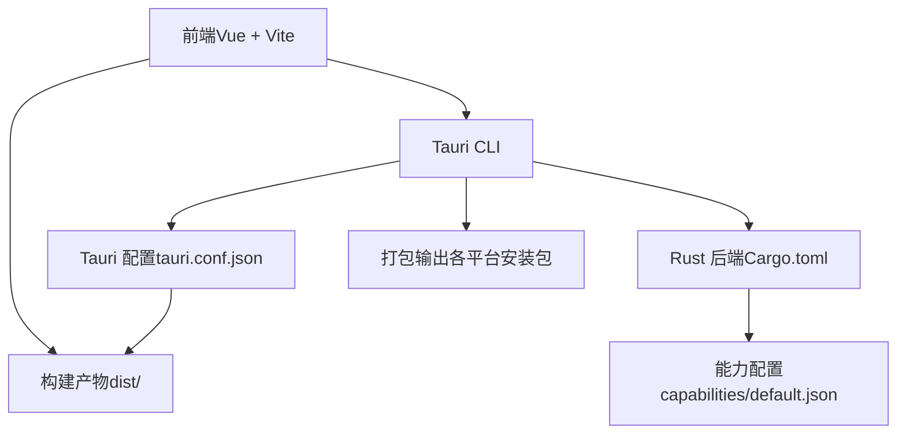
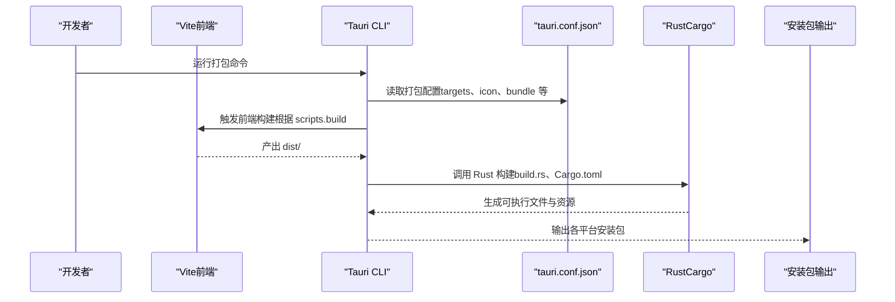
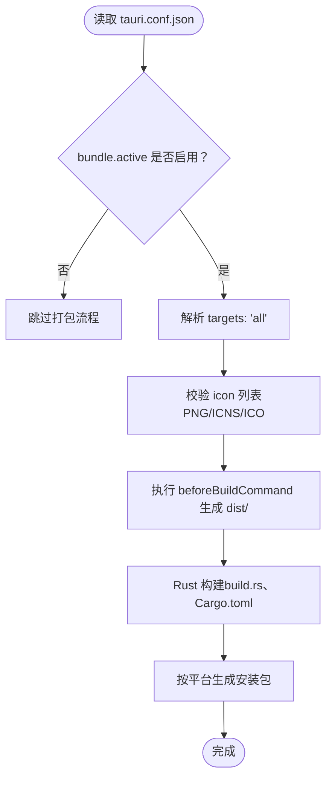
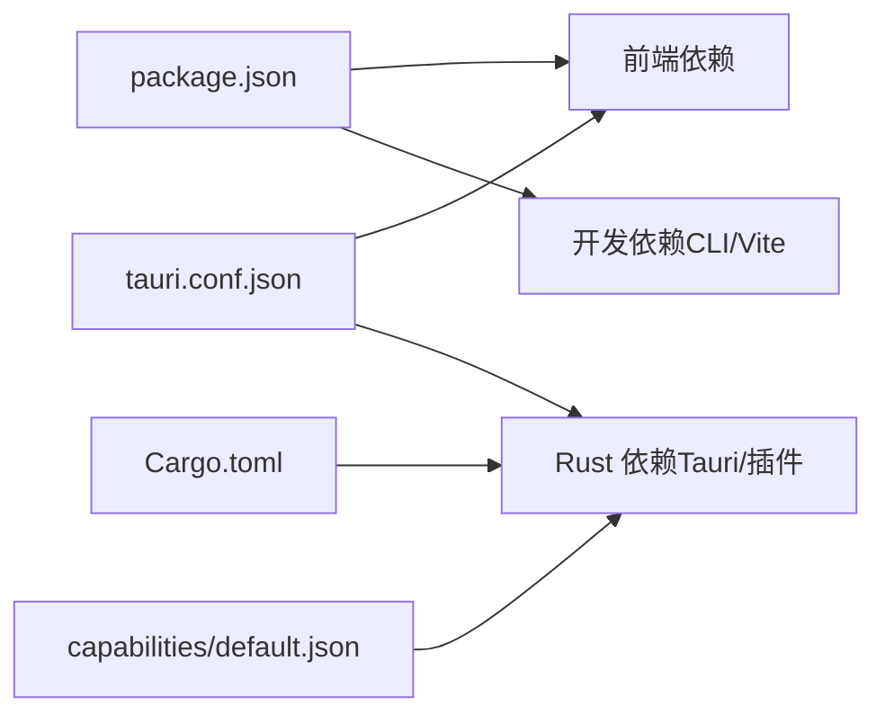

# 多平台打包

<cite>
**本文引用的文件**
- [tauri.conf.json](file://src-tauri/tauri.conf.json)
- [package.json](file://package.json)
- [Cargo.toml（Rust 后端）](file://src-tauri/Cargo.toml)
- [vite.config.ts](file://vite.config.ts)
- [默认能力配置](file://src-tauri/capabilities/default.json)
- [构建入口（build.rs）](file://src-tauri/build.rs)
- [默认窗口图标权限（自动生成）](file://src-tauri/target/debug/build/tauri-4acb9bb32dec275e/out/permissions/app/autogenerated/commands/default_window_icon.toml)
- [菜单图标设置权限（自动生成）](file://src-tauri/target/debug/build/tauri-4acb9bb32dec275e/out/permissions/menu/autogenerated/commands/set_icon.toml)
</cite>

## 目录
1. [简介](#简介)
2. [项目结构](#项目结构)
3. [核心组件](#核心组件)
4. [架构总览](#架构总览)
5. [详细组件分析](#详细组件分析)
6. [依赖关系分析](#依赖关系分析)
7. [性能与构建优化建议](#性能与构建优化建议)
8. [故障排查指南](#故障排查指南)
9. [结论](#结论)
10. [附录：平台打包与图标规范](#附录平台打包与图标规范)

## 简介
本指南面向使用 Tauri v2 的多平台应用开发者，围绕 Windows、macOS、Linux 三大平台的打包配置差异、targets: 'all' 的作用与定制方法、安装包格式、平台特定图标与资源要求、兼容性测试方法与工具推荐，以及跨平台打包最佳实践展开。文档基于仓库中的实际配置文件进行分析与总结，帮助你在不深入阅读源码的前提下完成稳定可靠的跨平台发布。

## 项目结构
该仓库采用典型的 Tauri 双端结构：前端为 Vue + Vite，后端为 Rust（Tauri 应用逻辑），通过 Tauri CLI 进行开发与打包。关键配置集中在 src-tauri/tauri.conf.json 中，前端构建由 package.json 脚本驱动，Rust 侧通过 Cargo.toml 声明依赖与构建特性。

**图表来源**
- [tauri.conf.json:1-36](file://src-tauri/tauri.conf.json#L1-L36)
- [package.json:1-25](file://package.json#L1-L25)
- [Cargo.toml（Rust 后端）:1-26](file://src-tauri/Cargo.toml#L1-L26)
- [vite.config.ts:1-33](file://vite.config.ts#L1-L33)

**章节来源**
- [tauri.conf.json:1-36](file://src-tauri/tauri.conf.json#L1-L36)
- [package.json:1-25](file://package.json#L1-L25)
- [Cargo.toml（Rust 后端）:1-26](file://src-tauri/Cargo.toml#L1-L26)
- [vite.config.ts:1-33](file://vite.config.ts#L1-L33)

## 核心组件
- 打包配置中心：src-tauri/tauri.conf.json
  - 包含产品名称、版本、标识符、构建前命令、开发/生产 URL、窗口配置、安全策略、以及 bundle.targets 与 icon 列表等关键字段。
- 前端构建与开发：package.json 脚本与 vite.config.ts
  - 提供开发服务器端口、严格端口、热重载、忽略监听 src-tauri 目录等配置，确保与 Tauri 开发流程协同。
- Rust 后端与能力：Cargo.toml、capabilities/default.json、build.rs
  - 定义后端依赖、构建特性、默认能力范围（如主窗口权限、opener 插件），以及构建入口。

**章节来源**
- [tauri.conf.json:6-34](file://src-tauri/tauri.conf.json#L6-L34)
- [package.json:6-11](file://package.json#L6-L11)
- [vite.config.ts:8-32](file://vite.config.ts#L8-L32)
- [Cargo.toml（Rust 后端）:10-25](file://src-tauri/Cargo.toml#L10-L25)
- [默认能力配置:1-11](file://src-tauri/capabilities/default.json#L1-L11)
- [构建入口（build.rs）:1-4](file://src-tauri/build.rs#L1-L4)

## 架构总览
下图展示了从开发到打包的关键流程：Vite 构建前端产物，Tauri CLI 读取配置并调用 Rust 构建系统，最终生成各平台安装包。

**图表来源**
- [tauri.conf.json:6-34](file://src-tauri/tauri.conf.json#L6-L34)
- [package.json:8-10](file://package.json#L8-L10)
- [vite.config.ts:8-32](file://vite.config.ts#L8-L32)
- [构建入口（build.rs）:1-4](file://src-tauri/build.rs#L1-L4)
- [Cargo.toml（Rust 后端）:17-25](file://src-tauri/Cargo.toml#L17-L25)

## 详细组件分析

### 打包配置（tauri.conf.json）
- 产品与版本信息：productName、version、identifier
- 构建与开发：beforeDevCommand、devUrl、beforeBuildCommand、frontendDist
- 应用窗口与安全：windows 数组定义窗口属性；security.csp 设置为 null 表示禁用 CSP
- 打包目标与图标：bundle.active 开启打包；targets 设为 "all" 表示同时生成所有可用平台安装包；icon 列表包含多尺寸 PNG、icns、ico 等

**图表来源**
- [tauri.conf.json:24-34](file://src-tauri/tauri.conf.json#L24-L34)
- [package.json:8-10](file://package.json#L8-L10)
- [构建入口（build.rs）:1-4](file://src-tauri/build.rs#L1-L4)
- [Cargo.toml（Rust 后端）:17-25](file://src-tauri/Cargo.toml#L17-L25)

**章节来源**
- [tauri.conf.json:1-36](file://src-tauri/tauri.conf.json#L1-L36)

### 前端构建与开发（package.json、vite.config.ts）
- scripts.dev/build/preview/tauri：统一的开发与打包入口
- vite.config.ts：固定端口、严格端口、主机地址、热重载协议与忽略监听路径，确保与 Tauri 开发体验一致

**章节来源**
- [package.json:6-11](file://package.json#L6-L11)
- [vite.config.ts:8-32](file://vite.config.ts#L8-L32)

### Rust 后端与能力（Cargo.toml、capabilities/default.json、build.rs）
- Cargo.toml：声明 tauri、tauri-plugin-opener 等依赖，以及构建特性与库类型
- capabilities/default.json：定义默认能力（主窗口、opener 权限）
- build.rs：调用 tauri_build::build() 完成构建入口

**章节来源**
- [Cargo.toml（Rust 后端）:10-25](file://src-tauri/Cargo.toml#L10-L25)
- [默认能力配置:1-11](file://src-tauri/capabilities/default.json#L1-L11)
- [构建入口（build.rs）:1-4](file://src-tauri/build.rs#L1-L4)

### 自动权限与图标（自动生成）
- 默认窗口图标权限与菜单图标设置权限由构建过程自动生成，用于控制运行时对窗口/托盘图标的操作能力

**章节来源**
- [默认窗口图标权限（自动生成）:1-15](file://src-tauri/target/debug/build/tauri-4acb9bb32dec275e/out/permissions/app/autogenerated/commands/default_window_icon.toml#L1-L15)
- [菜单图标设置权限（自动生成）:1-15](file://src-tauri/target/debug/build/tauri-4acb9bb32dec275e/out/permissions/menu/autogenerated/commands/set_icon.toml#L1-L15)

## 依赖关系分析
- 前端依赖：Vue、@tauri-apps/api、@tauri-apps/plugin-opener
- 开发依赖：@vitejs/plugin-vue、typescript、vite、@tauri-apps/cli
- Rust 依赖：tauri、tauri-plugin-opener、serde 系列

**图表来源**
- [package.json:12-23](file://package.json#L12-L23)
- [Cargo.toml（Rust 后端）:20-25](file://src-tauri/Cargo.toml#L20-L25)
- [tauri.conf.json:24-34](file://src-tauri/tauri.conf.json#L24-L34)
- [默认能力配置:6-9](file://src-tauri/capabilities/default.json#L6-L9)

**章节来源**
- [package.json:12-23](file://package.json#L12-L23)
- [Cargo.toml（Rust 后端）:20-25](file://src-tauri/Cargo.toml#L20-L25)
- [tauri.conf.json:24-34](file://src-tauri/tauri.conf.json#L24-L34)
- [默认能力配置:6-9](file://src-tauri/capabilities/default.json#L6-L9)

## 性能与构建优化建议
- 使用 targets: 'all' 一次性生成所有平台安装包，适合 CI/CD 场景；若仅需特定平台，可在命令行或 CI 中指定目标以缩短构建时间
- 将前端构建产物 dist 放置于与 tauri.conf.json 中 frontendDist 对应的路径，避免重复拷贝与路径错误
- 在 CI 中缓存 Cargo registry 与依赖，减少重复下载
- 保持 icon 列表完整且命名规范，避免运行时图标缺失导致的回退或警告
- 在开发阶段启用严格端口与固定主机，有助于稳定热重载与调试

[本节为通用建议，无需特定文件来源]

## 故障排查指南
- 打包失败或找不到 dist：确认 beforeBuildCommand 正确生成 dist，且 frontendDist 指向正确路径
- 图标显示异常：检查 tauri.conf.json 中 icon 列表是否包含对应平台所需格式（PNG/ICNS/ICO），并确保文件存在
- 权限相关问题：若运行时报错与图标设置或窗口图标相关，检查自动生成的权限文件是否符合预期
- CI 环境差异：在非交互环境中使用固定 targets 或明确平台参数，避免因缺少 GUI 工具链导致失败

**章节来源**
- [tauri.conf.json:24-34](file://src-tauri/tauri.conf.json#L24-L34)
- [package.json:8-10](file://package.json#L8-L10)
- [默认窗口图标权限（自动生成）:6-9](file://src-tauri/target/debug/build/tauri-4acb9bb32dec275e/out/permissions/app/autogenerated/commands/default_window_icon.toml#L6-L9)
- [菜单图标设置权限（自动生成）:6-9](file://src-tauri/target/debug/build/tauri-4acb9bb32dec275e/out/permissions/menu/autogenerated/commands/set_icon.toml#L6-L9)

## 结论
本项目已具备完整的跨平台打包基础：通过 tauri.conf.json 的 targets: 'all' 与 icon 列表，结合前端构建脚本与 Rust 后端依赖，可直接生成多平台安装包。建议在 CI/CD 中按需选择目标平台，完善图标资源与能力配置，并遵循本文提供的最佳实践以提升稳定性与效率。

[本节为总结，无需特定文件来源]

## 附录：平台打包与图标规范

### targets: 'all' 的作用与定制
- 作用：同时生成当前构建环境支持的所有平台安装包
- 定制方式：在命令行或 CI 中指定具体目标（如 Windows、macOS、Linux），以减少构建时间与资源消耗

**章节来源**
- [tauri.conf.json:26](file://src-tauri/tauri.conf.json#L26)

### 安装包格式概览
- Windows：MSI、NSIS（取决于配置与 CLI 版本）
- macOS：DMG、APP（取决于配置与 CLI 版本）
- Linux：AppImage、deb、rpm（取决于配置与 CLI 版本）

说明：本仓库未显式配置具体安装包格式，因此默认行为由 Tauri CLI 与平台工具链决定。建议在 CI 中明确目标平台以获得一致结果。

**章节来源**
- [tauri.conf.json:24-34](file://src-tauri/tauri.conf.json#L24-L34)

### 平台特定图标与资源要求
- Windows：ico（建议包含多分辨率）、Windows 专用 Logo 资源（如 Square*Logo.png）
- macOS：icns（建议包含多分辨率）
- Linux：PNG（建议包含高 DPI 与多尺寸）
- 共同要求：icon 列表中应包含 32x32、128x128、128x128@2x 等常用尺寸

**章节来源**
- [tauri.conf.json:27-33](file://src-tauri/tauri.conf.json#L27-L33)

### 平台兼容性测试方法与工具推荐
- Windows：在虚拟机或真实机器上验证安装、启动、菜单与托盘图标显示
- macOS：在不同系统版本上验证 DMG/APP 行为，检查沙盒与权限提示
- Linux：在多个发行版上验证 AppImage、deb、rpm 的安装与运行
- 工具推荐：CI 平台（GitHub Actions/Azure Pipelines）+ 容器化构建矩阵，覆盖主流平台与版本

[本节为通用建议，无需特定文件来源]

### 跨平台打包最佳实践与注意事项
- 明确 targets：在开发与 CI 中按需选择目标，避免不必要的全量构建
- 统一资源管理：集中维护图标与资源，确保多平台一致性
- 能力最小化：仅授予必要权限，降低安全风险与审核复杂度
- 版本与签名：为发布版本配置版本号与代码签名（如适用），并在 CI 中自动化处理
- 日志与回滚：在安装包中保留必要的日志与回滚机制，便于问题定位

[本节为通用建议，无需特定文件来源]