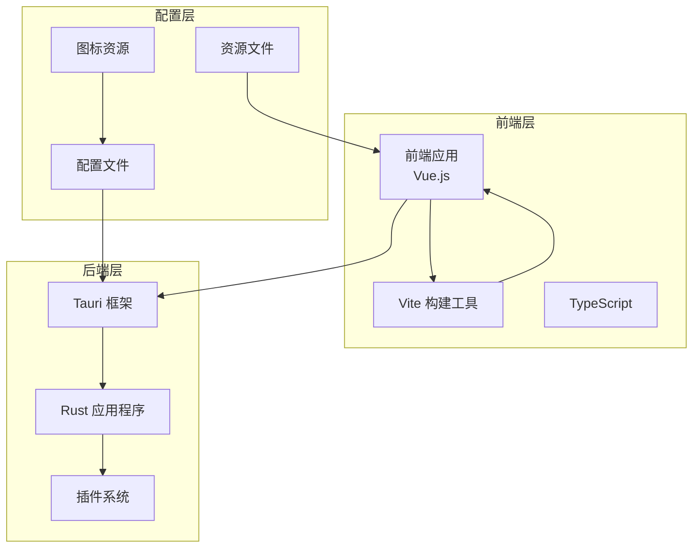
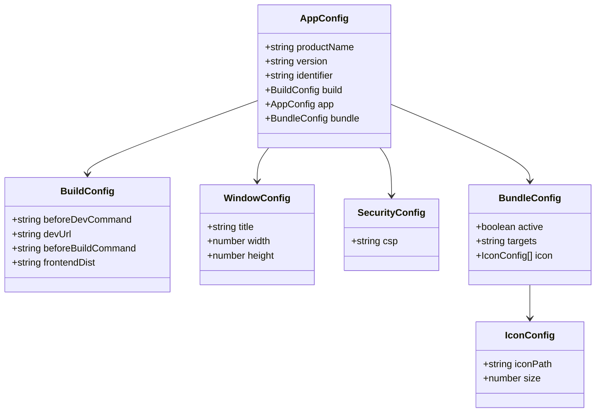
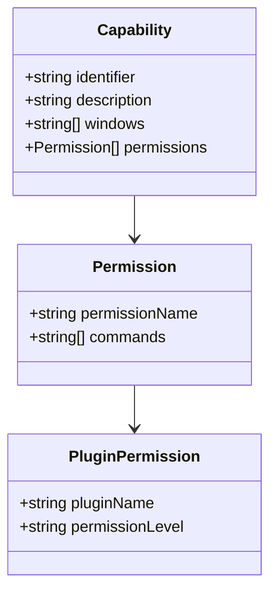
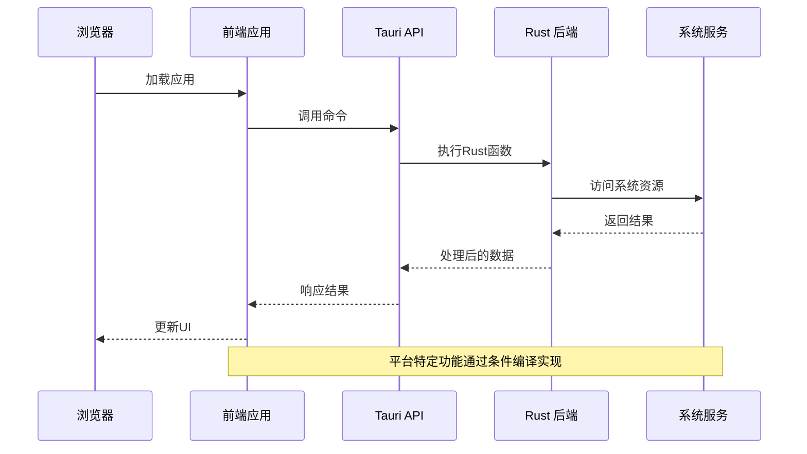
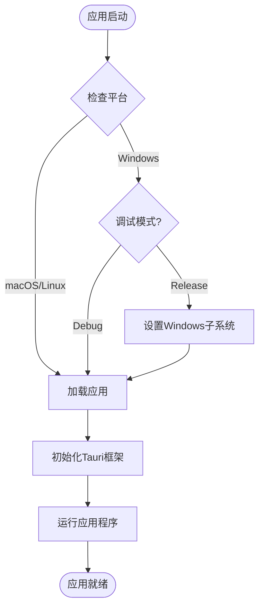
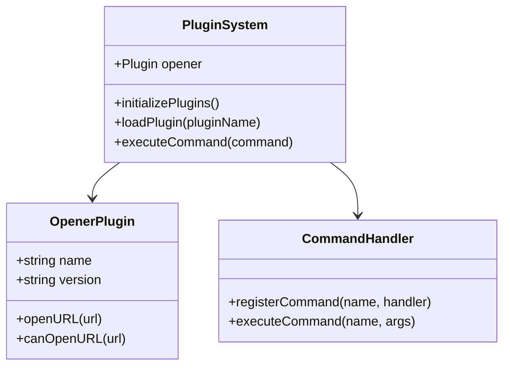
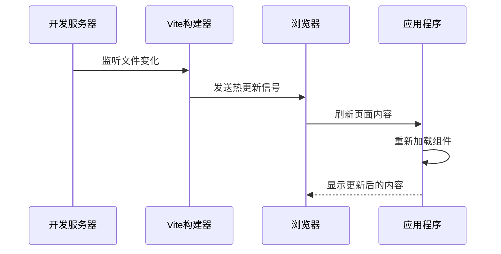
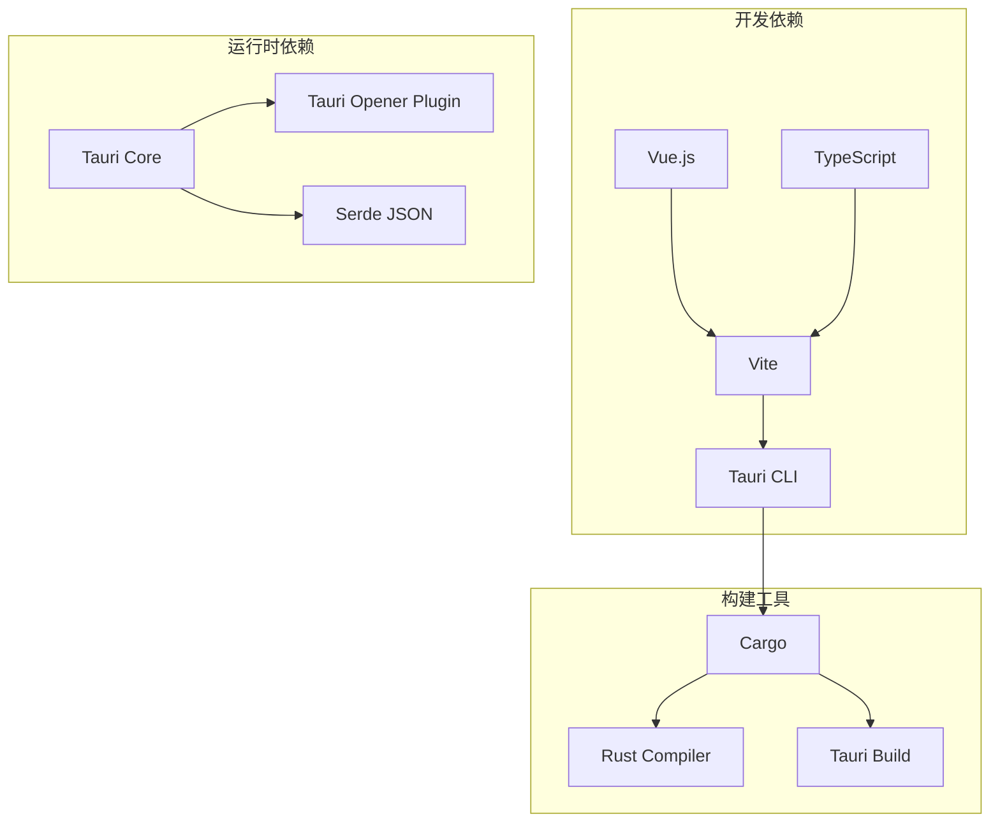
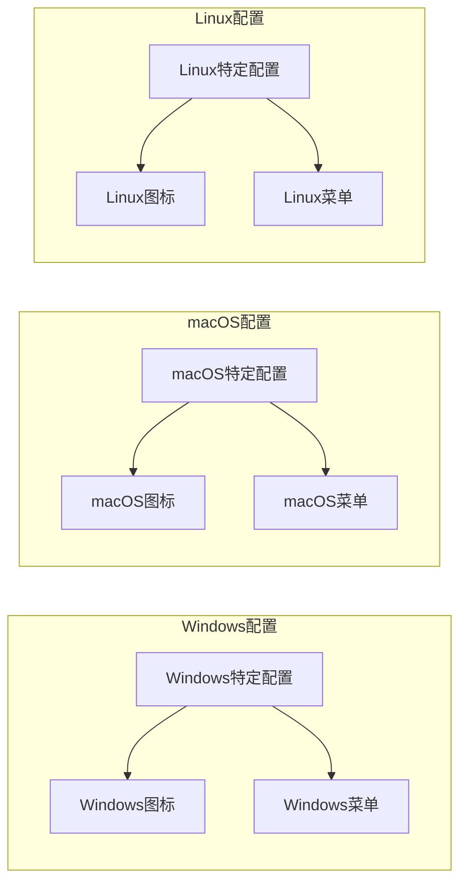

# 平台特定配置

<cite>
**本文档引用的文件**
- [tauri.conf.json](file://src-tauri/tauri.conf.json)
- [Cargo.toml](file://src-tauri/Cargo.toml)
- [main.rs](file://src-tauri/src/main.rs)
- [lib.rs](file://src-tauri/src/lib.rs)
- [build.rs](file://src-tauri/build.rs)
- [default.json](file://src-tauri/capabilities/default.json)
- [vite.config.ts](file://vite.config.ts)
- [package.json](file://package.json)
- [App.vue](file://src/App.vue)
- [main.ts](file://src/main.ts)
</cite>

## 目录
1. [简介](#简介)
2. [项目结构](#项目结构)
3. [核心组件](#核心组件)
4. [架构概览](#架构概览)
5. [详细组件分析](#详细组件分析)
6. [依赖关系分析](#依赖关系分析)
7. [性能考虑](#性能考虑)
8. [故障排除指南](#故障排除指南)
9. [结论](#结论)
10. [附录](#附录)

## 简介

本指南专注于Tauri应用的平台特定配置，涵盖Windows、macOS和Linux平台的差异化设置。通过分析现有代码库，我们将详细说明如何针对不同平台定制应用行为和外观，解释条件编译和平台特定代码的实现方法，并提供平台特定的资源文件组织和命名规范。

## 项目结构

该Tauri应用采用标准的前后端分离架构，前端使用Vue.js，后端使用Rust语言开发。



**图表来源**
- [package.json:1-25](file://package.json#L1-L25)
- [vite.config.ts:1-33](file://vite.config.ts#L1-L33)
- [tauri.conf.json:1-36](file://src-tauri/tauri.conf.json#L1-L36)

**章节来源**
- [package.json:1-25](file://package.json#L1-L25)
- [vite.config.ts:1-33](file://vite.config.ts#L1-L33)
- [tauri.conf.json:1-36](file://src-tauri/tauri.conf.json#L1-L36)

## 核心组件

### 配置管理系统

应用的核心配置集中在`tauri.conf.json`文件中，该文件定义了应用程序的基本信息、窗口配置、安全策略和打包设置。



**图表来源**
- [tauri.conf.json:1-36](file://src-tauri/tauri.conf.json#L1-L36)

### 权限控制机制

应用使用能力（Capabilities）系统来管理权限，通过`default.json`文件定义默认权限配置。



**图表来源**
- [default.json:1-11](file://src-tauri/capabilities/default.json#L1-L11)

**章节来源**
- [tauri.conf.json:1-36](file://src-tauri/tauri.conf.json#L1-L36)
- [default.json:1-11](file://src-tauri/capabilities/default.json#L1-L11)

## 架构概览

应用采用客户端-服务器架构，前端通过Tauri提供的API与后端Rust代码通信。



**图表来源**
- [lib.rs:1-15](file://src-tauri/src/lib.rs#L1-L15)
- [main.rs:1-7](file://src-tauri/src/main.rs#L1-L7)

## 详细组件分析

### 条件编译系统

应用使用Rust的条件编译特性来实现平台特定的功能。主要体现在Windows子系统的配置上。



**图表来源**
- [main.rs:1-7](file://src-tauri/src/main.rs#L1-L7)

#### 平台特定代码实现

当前代码库中的条件编译主要体现在Windows平台的子系统设置上：

- **Windows Release模式**: 隐藏控制台窗口，提供更纯净的应用体验
- **非Windows平台**: 使用默认的控制台行为

**章节来源**
- [main.rs:1-7](file://src-tauri/src/main.rs#L1-L7)

### 资源文件组织

应用的资源文件按照平台特定的方式进行组织和命名。

```mermaid
graph LR
subgraph "图标资源"
Icons[icons/]
Size32[32x32.png]
Size128[128x128.png]
Size256[128x128@2x.png]
MacIcon[icon.icns]
WinIcon[icon.ico]
end
subgraph "配置文件"
Config[配置文件]
TauriConf[tauri.conf.json]
Capabilities[capabilities/]
DefaultCap[default.json]
end
Icons --> Size32
Icons --> Size128
Icons --> Size256
Icons --> MacIcon
Icons --> WinIcon
Config --> TauriConf
Config --> Capabilities
Capabilities --> DefaultCap
```

**图表来源**
- [tauri.conf.json:24-34](file://src-tauri/tauri.conf.json#L24-L34)
- [default.json:1-11](file://src-tauri/capabilities/default.json#L1-L11)

#### 图标资源规范

应用支持多种平台的图标格式：

- **通用PNG图标**: 32x32、128x128像素
- **高DPI支持**: 128x128@2x格式
- **macOS专用**: .icns格式
- **Windows专用**: .ico格式

**章节来源**
- [tauri.conf.json:24-34](file://src-tauri/tauri.conf.json#L24-L34)

### 插件系统配置

应用集成了多个Tauri插件来增强平台特定功能。



**图表来源**
- [lib.rs:1-15](file://src-tauri/src/lib.rs#L1-L15)
- [Cargo.toml:20-25](file://src-tauri/Cargo.toml#L20-L25)

**章节来源**
- [lib.rs:1-15](file://src-tauri/src/lib.rs#L1-L15)
- [Cargo.toml:20-25](file://src-tauri/Cargo.toml#L20-L25)

### 前端集成

前端应用通过Vite进行构建，支持热重载和开发服务器。



**图表来源**
- [vite.config.ts:8-33](file://vite.config.ts#L8-L33)

**章节来源**
- [vite.config.ts:8-33](file://vite.config.ts#L8-L33)
- [main.ts:1-5](file://src/main.ts#L1-L5)

## 依赖关系分析

应用的依赖关系展示了从开发到生产的完整链路。



**图表来源**
- [package.json:12-23](file://package.json#L12-L23)
- [Cargo.toml:17-25](file://src-tauri/Cargo.toml#L17-L25)

**章节来源**
- [package.json:12-23](file://package.json#L12-L23)
- [Cargo.toml:17-25](file://src-tauri/Cargo.toml#L17-L25)

## 性能考虑

### 内存管理策略

应用采用了多层内存管理策略来确保在不同平台上的性能表现：

1. **前端内存优化**: 使用Vue的响应式系统和组件生命周期管理
2. **后端内存控制**: Rust的所有权系统确保内存安全
3. **插件资源管理**: 及时释放不再使用的插件资源

### 平台特定优化

- **Windows**: 隐藏控制台窗口减少系统开销
- **macOS**: 利用原生菜单系统和Dock集成
- **Linux**: 优化GTK界面渲染性能

## 故障排除指南

### 常见问题诊断

1. **构建失败**: 检查Rust工具链版本和依赖完整性
2. **开发服务器连接问题**: 验证端口配置和网络设置
3. **权限错误**: 确认能力配置和插件权限设置

### 调试工具推荐

- **Rust调试**: 使用Cargo和LLDB进行后端调试
- **前端调试**: 利用浏览器开发者工具和Vue DevTools
- **系统集成测试**: 通过Tauri的测试工具验证平台特定功能

**章节来源**
- [build.rs:1-4](file://src-tauri/build.rs#L1-L4)

## 结论

本指南详细介绍了Tauri应用的平台特定配置方法。通过条件编译、资源文件组织和插件系统，应用能够在不同平台上提供一致且优化的用户体验。建议在实际开发中：

1. 为每个目标平台制定详细的配置规范
2. 建立完整的跨平台测试流程
3. 定期更新依赖以获得最新的平台支持
4. 实施持续集成来自动化平台特定的构建和测试

## 附录

### 平台特定配置模板



[本节为概念性内容，不直接分析具体文件]