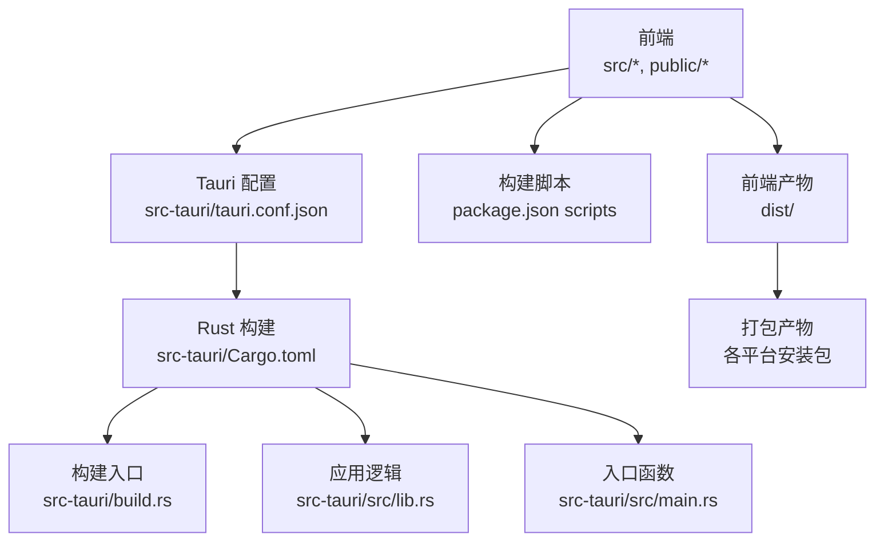
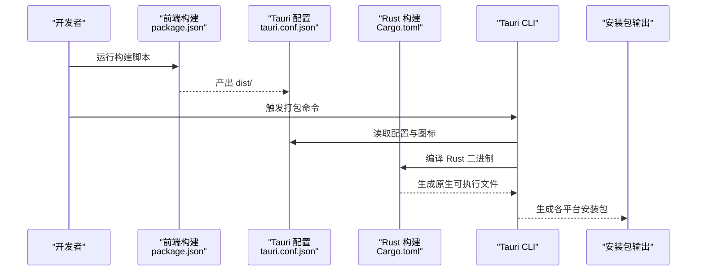
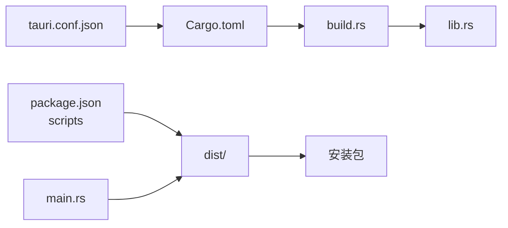

# 安装程序制作

<cite>
**本文引用的文件**
- [tauri.conf.json](file://src-tauri/tauri.conf.json)
- [Cargo.toml](file://src-tauri/Cargo.toml)
- [build.rs](file://src-tauri/build.rs)
- [lib.rs](file://src-tauri/src/lib.rs)
- [main.rs](file://src-tauri/src/main.rs)
- [App.vue](file://src/App.vue)
- [package.json](file://package.json)
</cite>

## 目录
1. [简介](#简介)
2. [项目结构](#项目结构)
3. [核心组件](#核心组件)
4. [架构总览](#架构总览)
5. [详细组件分析](#详细组件分析)
6. [依赖分析](#依赖分析)
7. [性能考虑](#性能考虑)
8. [故障排除指南](#故障排除指南)
9. [结论](#结论)
10. [附录](#附录)

## 简介
本指南面向希望为多平台应用制作安装包的工程师与产品团队，结合仓库中的 Tauri 配置与构建脚本，系统讲解如何在 Windows、macOS 与 Linux 上生成可分发的安装程序。文档涵盖以下主题：
- 安装包格式与目标：Windows（MSI/NSIS）、macOS（DMG）、Linux（AppImage）
- 用户界面定制：窗口尺寸、标题、图标、许可证与品牌元素
- 安装路径选择、快捷方式创建与静默安装参数
- 测试与兼容性验证流程
- 批量部署与企业分发策略
- 安装包体积优化与安装速度提升技巧

注意：当前仓库使用 Tauri 的默认打包配置，安装器由 Tauri CLI 自动生成；若需更精细的安装器定制（如 NSIS 脚本、DMG 制作细节或 AppImage 参数），可在 Tauri 配置中扩展相应插件或外部工具链。

## 项目结构
该仓库采用前端（Vue + Vite）+ 后端（Rust + Tauri）的双层架构，通过 Tauri 将前端资源打包进原生应用，再由 Tauri CLI 生成各平台安装包。关键目录与文件如下：
- 前端：src、public、index.html、package.json
- 后端：src-tauri（Rust 项目，包含 Tauri 配置、图标、构建脚本）
- 核心配置：src-tauri/tauri.conf.json（应用元数据、构建命令、打包目标与图标）

图表来源
- [tauri.conf.json:1-35](file://src-tauri/tauri.conf.json#L1-L35)
- [Cargo.toml:1-26](file://src-tauri/Cargo.toml#L1-L26)
- [build.rs:1-4](file://src-tauri/build.rs#L1-L4)
- [lib.rs:1-15](file://src-tauri/src/lib.rs#L1-L15)
- [main.rs:1-7](file://src-tauri/src/main.rs#L1-L7)
- [package.json:1-25](file://package.json#L1-L25)

章节来源
- [tauri.conf.json:1-35](file://src-tauri/tauri.conf.json#L1-L35)
- [Cargo.toml:1-26](file://src-tauri/Cargo.toml#L1-L26)
- [build.rs:1-4](file://src-tauri/build.rs#L1-L4)
- [lib.rs:1-15](file://src-tauri/src/lib.rs#L1-L15)
- [main.rs:1-7](file://src-tauri/src/main.rs#L1-L7)
- [package.json:1-25](file://package.json#L1-L25)

## 核心组件
- 应用配置与打包目标
  - 产品名称、版本、标识符、开发与构建命令、前端产物路径、打包目标与图标集合均在 Tauri 配置中声明。
- Rust 应用入口与命令注册
  - 入口函数调用应用运行器，注册命令处理器，加载上下文并启动应用。
- 前端交互与调用
  - 前端通过 Tauri API 调用后端命令，展示交互式界面。

章节来源
- [tauri.conf.json:3-34](file://src-tauri/tauri.conf.json#L3-L34)
- [lib.rs:8-14](file://src-tauri/src/lib.rs#L8-L14)
- [main.rs:4-6](file://src-tauri/src/main.rs#L4-L6)
- [App.vue:1-160](file://src/App.vue#L1-L160)

## 架构总览
下图展示了从开发到打包的端到端流程，以及安装包生成的关键节点。

图表来源
- [package.json:6-11](file://package.json#L6-L11)
- [tauri.conf.json:6-11](file://src-tauri/tauri.conf.json#L6-L11)
- [Cargo.toml:10-26](file://src-tauri/Cargo.toml#L10-L26)

## 详细组件分析

### Windows 安装器（MSI/NSIS）
- 默认行为
  - 使用 Tauri 的默认打包目标“all”，会生成 Windows 可执行文件与安装器。具体安装器类型由 Tauri CLI 决定。
- 图标与版本信息
  - 版本号与图标路径在配置中声明，构建时会写入资源文件。
- 自定义选项建议
  - 若需 NSIS 脚本级定制（如自定义页面、背景、许可协议、静默安装参数），可在 Tauri 配置中引入对应插件或外部工具链；当前仓库未包含 NSIS 脚本文件。
- 快捷方式与开始菜单
  - 可通过 Tauri 插件或外部打包工具在安装过程中创建桌面与开始菜单快捷方式。
- 静默安装
  - 建议在安装器参数中支持静默模式，并在企业环境中通过组策略或软件分发系统推送。

章节来源
- [tauri.conf.json:24-34](file://src-tauri/tauri.conf.json#L24-L34)
- [Cargo.toml:20-25](file://src-tauri/Cargo.toml#L20-L25)

### macOS 安装器（DMG）
- 默认行为
  - 使用“all”目标会生成 macOS 平台的安装包；通常为 .app 或 .dmg 格式。
- 自定义选项建议
  - 若需自定义 DMG 背景、窗口布局、许可协议与隐藏文件，可在 Tauri 配置中引入 macOS 专用插件或外部工具链；当前仓库未包含 DMG 制作脚本。
- 代码签名与公证
  - 发布前需完成代码签名与公证，确保用户信任与安全策略合规。

章节来源
- [tauri.conf.json:24-34](file://src-tauri/tauri.conf.json#L24-L34)

### Linux 安装器（AppImage）
- 默认行为
  - 使用“all”目标会生成 Linux 平台的安装包；AppImage 是常见的便携式分发格式。
- 自定义选项建议
  - 若需自定义 AppImage 的图标、菜单项、许可协议与启动行为，可在 Tauri 配置中引入 Linux 专用插件或外部工具链；当前仓库未包含 AppImage 制作脚本。
- 权限与依赖
  - 确保 AppImage 包含必要运行时库或声明依赖，避免在目标系统上出现缺失库导致的启动失败。

章节来源
- [tauri.conf.json:24-34](file://src-tauri/tauri.conf.json#L24-L34)

### 用户界面定制
- 窗口尺寸与标题
  - 应用窗口尺寸与标题在配置中设置，影响安装器内嵌窗口的初始外观。
- 图标与品牌
  - 多分辨率图标与 icns/ico 文件在配置中声明，用于安装器与应用图标的一致性。

章节来源
- [tauri.conf.json:12-23](file://src-tauri/tauri.conf.json#L12-L23)
- [tauri.conf.json:27-33](file://src-tauri/tauri.conf.json#L27-L33)

### 安装路径选择与快捷方式
- 安装路径
  - 默认安装路径由安装器决定；若需固定安装目录或允许用户自选，可通过安装器脚本或插件进行配置。
- 快捷方式
  - 桌面与开始菜单快捷方式的创建可通过安装器脚本或插件实现。

章节来源
- [tauri.conf.json:24-34](file://src-tauri/tauri.conf.json#L24-L34)

### 许可协议与品牌元素
- 许可协议
  - 可在安装器中嵌入许可协议文本或链接，引导用户阅读与同意。
- 品牌元素
  - 背景图片、应用名称与图标应保持一致的品牌风格。

章节来源
- [tauri.conf.json:24-34](file://src-tauri/tauri.conf.json#L24-L34)

### 静默安装与批量部署
- 静默安装
  - 通过安装器参数启用静默模式，避免弹窗交互，适合无人值守部署。
- 批量部署
  - 结合企业软件分发系统（如 MDM、SCCM、Intune）进行推送与回滚管理。

章节来源
- [tauri.conf.json:24-34](file://src-tauri/tauri.conf.json#L24-L34)

## 依赖分析
- 前端依赖
  - Vue、Vite、TypeScript、@tauri-apps/api、@tauri-apps/cli 等。
- Rust 依赖
  - tauri、tauri-plugin-opener、serde、serde_json 等。
- 构建链路
  - package.json 中的构建脚本先产出 dist，再由 Tauri CLI 读取 tauri.conf.json 与 Cargo.toml，编译生成原生二进制并打包安装包。

图表来源
- [package.json:6-11](file://package.json#L6-L11)
- [tauri.conf.json:6-11](file://src-tauri/tauri.conf.json#L6-L11)
- [Cargo.toml:10-26](file://src-tauri/Cargo.toml#L10-L26)
- [build.rs:1-4](file://src-tauri/build.rs#L1-L4)
- [lib.rs:1-15](file://src-tauri/src/lib.rs#L1-L15)
- [main.rs:1-7](file://src-tauri/src/main.rs#L1-L7)

章节来源
- [package.json:1-25](file://package.json#L1-L25)
- [Cargo.toml:1-26](file://src-tauri/Cargo.toml#L1-L26)

## 性能考虑
- 安装包体积优化
  - 移除未使用的图标与资源，压缩前端产物，合并重复依赖。
  - 使用按需加载与懒加载减少首屏体积。
- 安装速度提升
  - 减少安装器脚本复杂度，避免不必要的文件校验与权限变更。
  - 使用增量更新或差分包以降低网络传输与解压时间。
- 启动性能
  - 前端资源预加载与缓存策略，减少首次启动等待。

## 故障排除指南
- 安装器无法启动或崩溃
  - 检查安装包是否包含完整运行时库与依赖。
  - 查看系统日志与安装器日志，定位崩溃点。
- 图标显示异常
  - 确认 tauri.conf.json 中图标路径正确且多分辨率图标齐全。
- 窗口尺寸与标题不生效
  - 确认配置文件中 app.windows 设置已正确声明。
- 前端命令调用失败
  - 检查命令注册与 invoke 调用是否匹配，确认上下文加载成功。

章节来源
- [tauri.conf.json:12-23](file://src-tauri/tauri.conf.json#L12-L23)
- [tauri.conf.json:27-33](file://src-tauri/tauri.conf.json#L27-L33)
- [lib.rs:8-14](file://src-tauri/src/lib.rs#L8-L14)
- [App.vue:1-160](file://src/App.vue#L1-L160)

## 结论
本指南基于仓库现有配置，梳理了 Tauri 默认打包流程与多平台安装包生成要点。对于需要更精细安装器定制（如 NSIS、DMG、AppImage 的高级参数）的场景，可在 Tauri 配置中引入相应插件或外部工具链，并结合企业级部署与测试流程，实现稳定、可审计、可大规模分发的应用交付。

## 附录
- 关键配置位置
  - 应用与打包配置：[tauri.conf.json:1-35](file://src-tauri/tauri.conf.json#L1-L35)
  - Rust 依赖与构建：[Cargo.toml:1-26](file://src-tauri/Cargo.toml#L1-L26)
  - 构建入口与命令注册：[build.rs:1-4](file://src-tauri/build.rs#L1-L4), [lib.rs:1-15](file://src-tauri/src/lib.rs#L1-L15), [main.rs:1-7](file://src-tauri/src/main.rs#L1-L7)
  - 前端脚本与依赖：[package.json:1-25](file://package.json#L1-L25), [App.vue:1-160](file://src/App.vue#L1-L160)