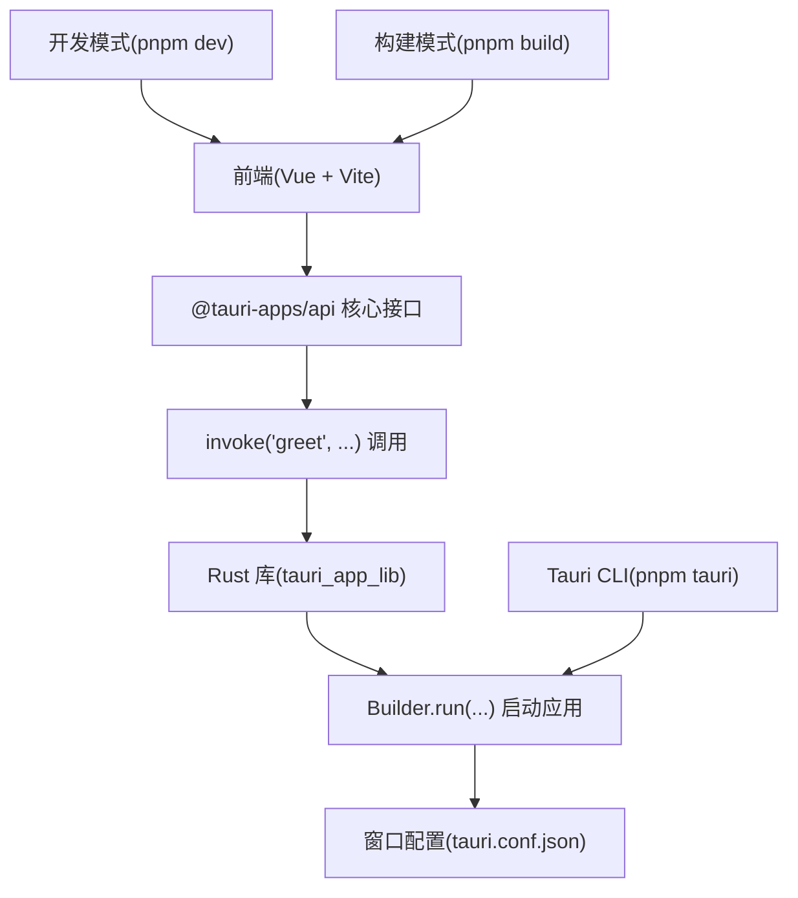
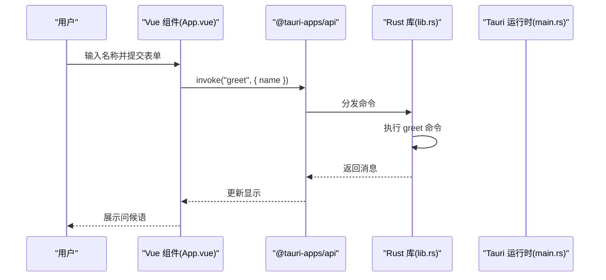
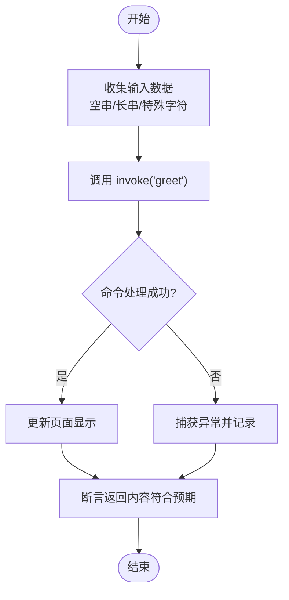
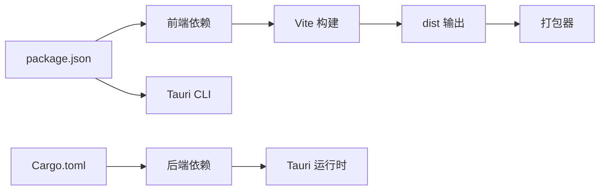

# 发布前测试

<cite>
**本文引用的文件**
- [README.md](file://README.md)
- [package.json](file://package.json)
- [vite.config.ts](file://vite.config.ts)
- [tsconfig.json](file://tsconfig.json)
- [src/main.ts](file://src/main.ts)
- [src/App.vue](file://src/App.vue)
- [src-tauri/Cargo.toml](file://src-tauri/Cargo.toml)
- [src-tauri/tauri.conf.json](file://src-tauri/tauri.conf.json)
- [src-tauri/src/lib.rs](file://src-tauri/src/lib.rs)
- [src-tauri/src/main.rs](file://src-tauri/src/main.rs)
- [src-tauri/target/debug/build/typenum-f91c42368f49cd53/out/tests.rs](file://src-tauri/target/debug/build/typenum-f91c42368f49cd53/out/tests.rs)
</cite>

## 目录
1. [引言](#引言)
2. [项目结构](#项目结构)
3. [核心组件](#核心组件)
4. [架构总览](#架构总览)
5. [详细组件分析](#详细组件分析)
6. [依赖分析](#依赖分析)
7. [性能考虑](#性能考虑)
8. [故障排查指南](#故障排查指南)
9. [结论](#结论)
10. [附录](#附录)

## 引言
本指南面向即将发布的 Tauri + Vue + TypeScript 应用，提供系统化的发布前测试方法论与实践步骤。内容覆盖功能测试（核心功能、边界条件、错误处理）、性能测试（内存、CPU、启动时间）、兼容性测试（多操作系统与硬件配置）、自动化测试脚本与手动测试用例设计，以及测试报告模板与质量门禁标准。

## 项目结构
该仓库采用前端（Vue + Vite）与后端（Rust/Tauri）分离的双层架构：
- 前端：Vue 3 单页应用，通过 Vite 开发服务器提供本地调试与构建。
- 后端：Tauri 应用入口与命令桥接，通过 Rust 暴露命令给前端调用。
- 配置：Vite、TypeScript、Tauri CLI 与打包配置集中于根目录与 src-tauri 目录。

图表来源
- [src/App.vue:8-11](file://src/App.vue#L8-L11)
- [src-tauri/src/lib.rs:8-14](file://src-tauri/src/lib.rs#L8-L14)
- [src-tauri/tauri.conf.json:6-11](file://src-tauri/tauri.conf.json#L6-L11)
- [package.json:6-10](file://package.json#L6-L10)

章节来源
- [package.json:1-25](file://package.json#L1-L25)
- [vite.config.ts:1-33](file://vite.config.ts#L1-L33)
- [tsconfig.json:1-26](file://tsconfig.json#L1-L26)
- [src/main.ts:1-5](file://src/main.ts#L1-L5)
- [src/App.vue:1-160](file://src/App.vue#L1-L160)
- [src-tauri/Cargo.toml:1-26](file://src-tauri/Cargo.toml#L1-L26)
- [src-tauri/tauri.conf.json:1-36](file://src-tauri/tauri.conf.json#L1-L36)
- [src-tauri/src/lib.rs:1-15](file://src-tauri/src/lib.rs#L1-L15)
- [src-tauri/src/main.rs:1-7](file://src-tauri/src/main.rs#L1-L7)

## 核心组件
- 前端交互与命令调用
  - 前端通过核心接口发起命令调用，示例为 greet 命令，参数来自输入框，结果展示在页面上。
- Rust 命令与应用运行
  - Rust 端定义 greet 命令并注册到 Builder 的 invoke_handler 中；应用通过 generate_context!() 初始化并运行。
- 构建与打包
  - 前端构建产物输出至 dist；Tauri 在构建前执行前端构建；打包目标为 all 平台。

章节来源
- [src/App.vue:8-11](file://src/App.vue#L8-L11)
- [src-tauri/src/lib.rs:2-5](file://src-tauri/src/lib.rs#L2-L5)
- [src-tauri/src/lib.rs:8-14](file://src-tauri/src/lib.rs#L8-L14)
- [src-tauri/tauri.conf.json:6-11](file://src-tauri/tauri.conf.json#L6-L11)
- [package.json:6-10](file://package.json#L6-L10)

## 架构总览
下图展示了从用户操作到 Rust 命令执行再到界面更新的完整链路。

图表来源
- [src/App.vue:8-11](file://src/App.vue#L8-L11)
- [src-tauri/src/lib.rs:2-5](file://src-tauri/src/lib.rs#L2-L5)
- [src-tauri/src/lib.rs:8-14](file://src-tauri/src/lib.rs#L8-L14)
- [src-tauri/src/main.rs:4-6](file://src-tauri/src/main.rs#L4-L6)

## 详细组件分析

### 功能测试执行流程
- 核心功能验证
  - 前端输入任意字符串，调用 greet 命令，断言返回消息包含预期占位信息与输入值。
  - 关键路径参考：[src/App.vue:8-11](file://src/App.vue#L8-L11)、[src-tauri/src/lib.rs:2-5](file://src-tauri/src/lib.rs#L2-L5)。
- 边界条件测试
  - 输入空字符串、超长字符串、特殊字符、国际化字符集，验证命令处理与 UI 渲染稳定性。
  - 参考：同上命令与输入绑定逻辑。
- 错误处理测试
  - 模拟命令未注册、参数类型不匹配、网络或 IPC 异常场景，验证前端错误提示与日志记录。
  - 参考：命令注册与调用链路。

图表来源
- [src/App.vue:8-11](file://src/App.vue#L8-L11)
- [src-tauri/src/lib.rs:2-5](file://src-tauri/src/lib.rs#L2-L5)

章节来源
- [src/App.vue:8-11](file://src/App.vue#L8-L11)
- [src-tauri/src/lib.rs:2-5](file://src-tauri/src/lib.rs#L2-L5)

### 性能测试方法与标准
- 内存使用
  - 使用平台自带工具（Windows Performance Recorder、macOS Instruments、Linux perf/sysdig）采集应用驻留内存峰值与分配速率。
  - 建议指标：冷启动首次内存占用、命令调用后内存增长、长时间运行内存泄漏检测。
- CPU 占用
  - 采集前台活跃 CPU 百分比、后台任务 CPU 占用、IPC 调用耗时分布。
  - 建议指标：UI 响应延迟（<16ms/帧）、命令处理平均耗时、高负载下 CPU 降频次数。
- 启动时间
  - 定义“可交互时间”（首屏渲染完成并可响应用户输入）与“完全启动时间”（资源加载完成）。
  - 建议指标：冷启动时间 < 2 秒，热启动时间 < 500ms。
- 测试环境
  - 不同操作系统（Windows 10/11、macOS 10.15+、Linux 最新 LTS）、不同硬件配置（i5/4GB~i9/32GB RAM、SSD/HDD）进行基准测试。

章节来源
- [src-tauri/tauri.conf.json:13-19](file://src-tauri/tauri.conf.json#L13-L19)

### 兼容性测试策略
- 操作系统
  - Windows（不同版本与语言包）、macOS（不同版本与外观设置）、Linux（主流发行版与桌面环境）。
- 硬件配置
  - 不同 CPU（x86/x64、ARM64）、内存容量、显卡驱动、存储介质（SSD/HDD）。
- 外围环境
  - 防病毒软件、防火墙、系统电源管理策略对启动与运行的影响。
- 测试重点
  - 窗口尺寸与 DPI 缩放、字体渲染、IPC 稳定性、权限弹窗与沙箱行为。

章节来源
- [src-tauri/tauri.conf.json:13-19](file://src-tauri/tauri.conf.json#L13-L19)

### 自动化测试脚本与执行
- 前端自动化
  - 使用端到端测试框架（如 Playwright 或 Cypress）编写页面交互脚本，覆盖 greet 表单提交、输入校验、错误提示。
  - CI 中以无头模式运行，结合截图/视频与日志收集。
- Rust 命令测试
  - 利用现有单元测试框架（cargo test）验证命令逻辑正确性与边界条件。
  - 示例测试文件路径：[src-tauri/target/debug/build/typenum-f91c42368f49cd53/out/tests.rs](file://src-tauri/target/debug/build/typenum-f91c42368f49cd53/out/tests.rs)。
- 打包与安装测试
  - 在各目标平台生成安装包并执行最小化安装/升级/卸载流程，验证文件完整性与快捷方式创建。

章节来源
- [src-tauri/target/debug/build/typenum-f91c42368f49cd53/out/tests.rs](file://src-tauri/target/debug/build/typenum-f91c42368f49cd53/out/tests.rs)
- [src-tauri/Cargo.toml:10-15](file://src-tauri/Cargo.toml#L10-L15)
- [src-tauri/tauri.conf.json:24-34](file://src-tauri/tauri.conf.json#L24-L34)

### 手动测试用例设计
- 功能用例
  - 正常用例：输入有效名称，点击按钮，显示问候语。
  - 异常用例：输入空值、超长值、特殊字符，观察 UI 提示与命令返回。
- 回归用例
  - 多次快速点击、并发调用、后台切换再切回前台。
- 安全用例
  - 恶意输入（注入尝试）、越权访问（非授权命令），检查日志与防护机制。

章节来源
- [src/App.vue:31-35](file://src/App.vue#L31-L35)
- [src-tauri/src/lib.rs:2-5](file://src-tauri/src/lib.rs#L2-L5)

## 依赖分析
- 前端依赖
  - Vue 3、@tauri-apps/api、@tauri-apps/plugin-opener、Vite、TypeScript。
- 后端依赖
  - Tauri 2、tauri-plugin-opener、Serde JSON。
- 构建与打包
  - Tauri CLI、Vite、Vue 类型检查与构建脚本。

图表来源
- [package.json:12-23](file://package.json#L12-L23)
- [src-tauri/Cargo.toml:20-25](file://src-tauri/Cargo.toml#L20-L25)
- [src-tauri/tauri.conf.json:6-11](file://src-tauri/tauri.conf.json#L6-L11)

章节来源
- [package.json:1-25](file://package.json#L1-L25)
- [src-tauri/Cargo.toml:1-26](file://src-tauri/Cargo.toml#L1-L26)

## 性能考虑
- 启动优化
  - 将非关键资源延迟加载；减少前端首屏 JS 体积；合理拆分包。
- IPC 效率
  - 批量处理命令请求；避免频繁小对象传输；必要时使用二进制序列化。
- UI 响应
  - 使用虚拟滚动与懒加载；避免主线程阻塞；利用 Web Workers 处理重计算。

## 故障排查指南
- 常见问题定位
  - 命令未注册：确认 invoke_handler 是否包含对应命令；检查命令名大小写。
  - 参数类型不匹配：核对前端传参与 Rust 函数签名；添加类型校验。
  - 开发服务器端口冲突：调整 Vite server.port 或关闭占用进程。
- 日志与诊断
  - 前端：浏览器控制台与网络面板；Tauri 日志开关。
  - 后端：Rust 日志输出与错误堆栈；系统事件查看器（Windows）或系统日志（macOS/Linux）。

章节来源
- [vite.config.ts:16-26](file://vite.config.ts#L16-L26)
- [src-tauri/src/lib.rs:8-14](file://src-tauri/src/lib.rs#L8-L14)

## 结论
通过系统化的功能、性能、兼容性与自动化测试，结合明确的质量门禁与测试报告模板，可以显著提升发布质量与稳定性。建议在 CI 中集成自动化测试与打包流程，确保每次变更均经过充分验证。

## 附录

### 测试报告模板
- 项目信息
  - 项目名称、版本、构建号、测试日期、测试人员
- 测试范围
  - 功能测试、性能测试、兼容性测试、安全测试
- 测试环境
  - 操作系统、硬件配置、浏览器/运行时版本
- 测试结果
  - 通过用例数、失败用例数、阻塞缺陷数、风险项
- 性能指标
  - 冷启动时间、内存峰值、CPU 占用、UI 响应延迟
- 结论与建议
  - 是否建议发布、改进建议、后续回归计划

### 质量门禁标准
- 必须通过
  - 所有核心功能用例通过；无阻塞性缺陷；性能指标达标；兼容性覆盖主要平台。
- 建议通过
  - 自动化测试覆盖率 > 80%；CI 基线测试全部通过；文档与变更日志齐备。
- 不建议发布
  - 存在阻塞性缺陷；性能严重不达标；兼容性重大问题未修复。