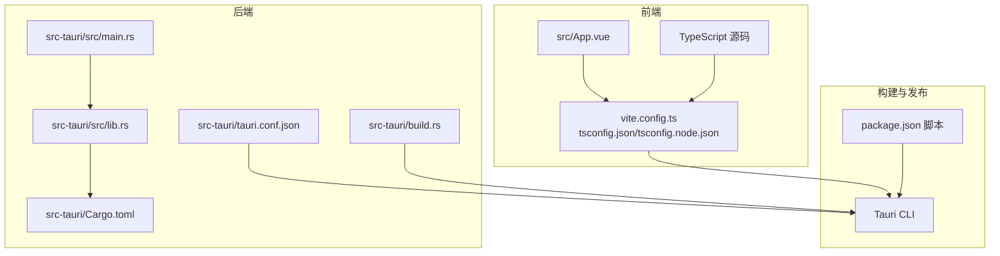
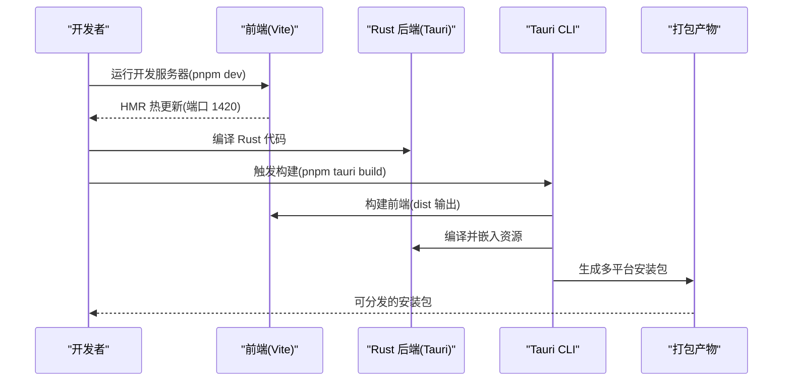
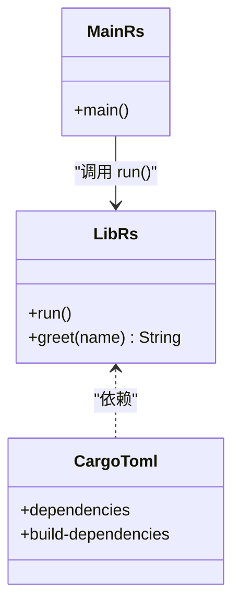
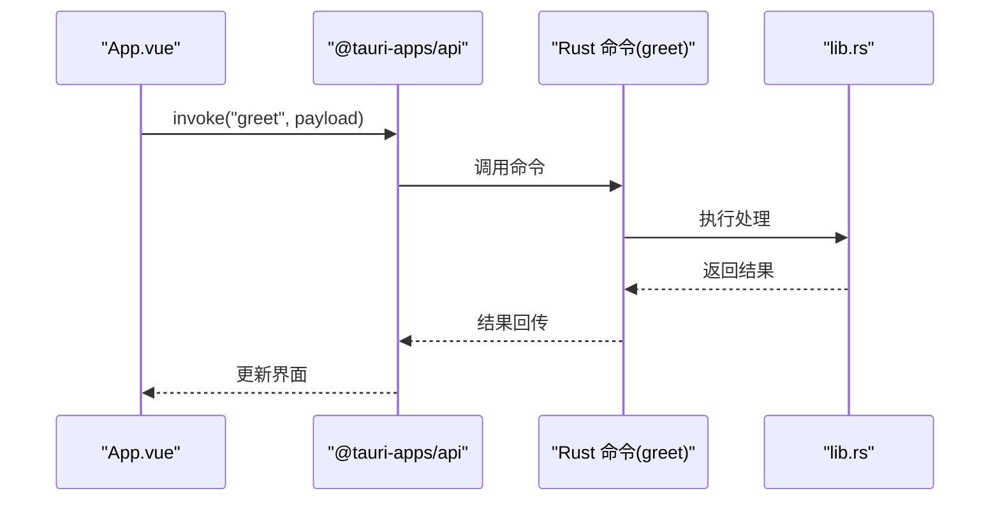
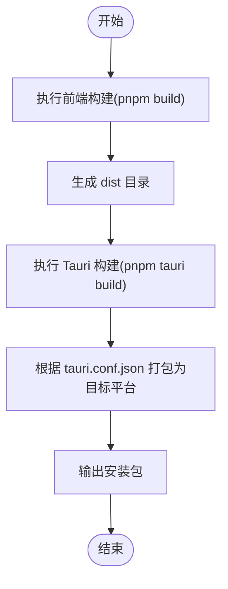

# 发布渠道管理

<cite>
**本文档引用的文件**
- [README.md](file://README.md)
- [AGENTS.md](file://AGENTS.md)
- [package.json](file://package.json)
- [vite.config.ts](file://vite.config.ts)
- [tsconfig.json](file://tsconfig.json)
- [tsconfig.node.json](file://tsconfig.node.json)
- [src-tauri/tauri.conf.json](file://src-tauri/tauri.conf.json)
- [src-tauri/Cargo.toml](file://src-tauri/Cargo.toml)
- [src-tauri/build.rs](file://src-tauri/build.rs)
- [src-tauri/src/main.rs](file://src-tauri/src/main.rs)
- [src-tauri/src/lib.rs](file://src-tauri/src/lib.rs)
- [src/App.vue](file://src/App.vue)
</cite>

## 目录
1. [简介](#简介)
2. [项目结构](#项目结构)
3. [核心组件](#核心组件)
4. [架构总览](#架构总览)
5. [详细组件分析](#详细组件分析)
6. [依赖关系分析](#依赖关系分析)
7. [性能考虑](#性能考虑)
8. [故障排除指南](#故障排除指南)
9. [结论](#结论)
10. [附录](#附录)

## 简介
本指南面向使用 Tauri + Vue + TypeScript 技术栈开发桌面应用的团队，系统化梳理多渠道发布管理的流程与要求，覆盖以下方面：
- 应用商店发布：Mac App Store、Windows Store、Linux 应用商店的提交流程与技术要求
- 官网下载页面建设与维护：下载链接管理、版本历史记录、用户反馈收集
- 企业内部分发：私有应用商店与内部部署的配置方法
- 数字签名与证书管理：跨平台签名策略与密钥管理最佳实践
- 技术要求与合规性检查清单：确保发布质量与安全性

本仓库为 Tauri 桌面应用模板，前端基于 Vue 3 + TypeScript + Vite，后端通过 Tauri 调用 Rust 命令，构建产物由 Tauri 打包为多平台安装包。发布前需完成构建、签名、打包与分发准备。

## 项目结构
该仓库采用“前端 + Rust 后端”的双层结构，配合 Tauri 配置实现统一构建与打包。关键目录与文件职责如下：
- 前端源码：src（Vue 单文件组件、TypeScript、静态资源）
- 构建工具：package.json（脚本）、vite.config.ts（开发服务器与 HMR）、tsconfig.json/tsconfig.node.json（类型检查）
- Rust 后端：src-tauri（Tauri 配置、Cargo.toml 依赖、Rust 入口与命令）
- 核心配置：tauri.conf.json（产品名称、版本、窗口、安全、打包图标等）

**图表来源**
- [vite.config.ts:1-33](file://vite.config.ts#L1-L33)
- [tsconfig.json:1-26](file://tsconfig.json#L1-L26)
- [tsconfig.node.json:1-11](file://tsconfig.node.json#L1-L11)
- [src-tauri/tauri.conf.json:1-36](file://src-tauri/tauri.conf.json#L1-L36)
- [src-tauri/Cargo.toml:1-26](file://src-tauri/Cargo.toml#L1-L26)
- [src-tauri/src/main.rs:1-7](file://src-tauri/src/main.rs#L1-L7)
- [src-tauri/src/lib.rs:1-15](file://src-tauri/src/lib.rs#L1-L15)
- [src-tauri/build.rs:1-4](file://src-tauri/build.rs#L1-L4)
- [package.json:1-25](file://package.json#L1-L25)

**章节来源**
- [AGENTS.md:73-90](file://AGENTS.md#L73-L90)
- [src-tauri/tauri.conf.json:1-36](file://src-tauri/tauri.conf.json#L1-L36)
- [vite.config.ts:1-33](file://vite.config.ts#L1-L33)
- [tsconfig.json:1-26](file://tsconfig.json#L1-L26)
- [tsconfig.node.json:1-11](file://tsconfig.node.json#L1-L11)

## 核心组件
- 前端应用入口与交互：src/App.vue 展示了 Tauri 命令调用示例，体现前端与后端的桥接机制
- Tauri 应用初始化：src-tauri/src/lib.rs 中定义了命令注册与应用运行逻辑
- 应用入口：src-tauri/src/main.rs 设置 Windows 子系统并在发布时隐藏控制台
- 构建与打包：package.json 提供构建脚本；tauri.conf.json 控制打包目标与图标；Cargo.toml 管理 Rust 依赖
- 开发服务器：vite.config.ts 固定开发端口并启用 HMR，便于 Tauri 开发调试

**章节来源**
- [src/App.vue:1-160](file://src/App.vue#L1-L160)
- [src-tauri/src/lib.rs:1-15](file://src-tauri/src/lib.rs#L1-L15)
- [src-tauri/src/main.rs:1-7](file://src-tauri/src/main.rs#L1-L7)
- [package.json:1-25](file://package.json#L1-L25)
- [src-tauri/tauri.conf.json:1-36](file://src-tauri/tauri.conf.json#L1-L36)
- [src-tauri/Cargo.toml:1-26](file://src-tauri/Cargo.toml#L1-L26)
- [vite.config.ts:1-33](file://vite.config.ts#L1-L33)

## 架构总览
下图展示了从开发到构建的关键路径，以及与 Tauri CLI 的集成方式：

**图表来源**
- [AGENTS.md:13-24](file://AGENTS.md#L13-L24)
- [vite.config.ts:16-31](file://vite.config.ts#L16-L31)
- [package.json:6-11](file://package.json#L6-L11)
- [src-tauri/tauri.conf.json:6-11](file://src-tauri/tauri.conf.json#L6-L11)

## 详细组件分析

### 组件一：Tauri 应用初始化与命令桥接
- 初始化流程：lib.rs 中通过 Builder 注册命令与插件，随后运行上下文
- 命令定义：greet 命令作为示例展示如何从前端调用 Rust 函数
- 入口点：main.rs 在非调试模式下隐藏控制台，提升发布体验

**图表来源**
- [src-tauri/src/lib.rs:1-15](file://src-tauri/src/lib.rs#L1-L15)
- [src-tauri/src/main.rs:1-7](file://src-tauri/src/main.rs#L1-L7)
- [src-tauri/Cargo.toml:1-26](file://src-tauri/Cargo.toml#L1-L26)

**章节来源**
- [src-tauri/src/lib.rs:1-15](file://src-tauri/src/lib.rs#L1-L15)
- [src-tauri/src/main.rs:1-7](file://src-tauri/src/main.rs#L1-L7)
- [src-tauri/Cargo.toml:1-26](file://src-tauri/Cargo.toml#L1-L26)

### 组件二：前端与 Tauri 的交互流程
- 前端调用：App.vue 使用 @tauri-apps/api 的 invoke 方法调用 Rust 命令
- 类型安全：TypeScript 严格模式与类型声明保证参数与返回值安全
- 开发体验：固定端口与 HMR 配置提升迭代效率

**图表来源**
- [src/App.vue:1-37](file://src/App.vue#L1-L37)
- [src-tauri/src/lib.rs:2-5](file://src-tauri/src/lib.rs#L2-L5)

**章节来源**
- [src/App.vue:1-160](file://src/App.vue#L1-L160)
- [tsconfig.json:17-22](file://tsconfig.json#L17-L22)
- [vite.config.ts:16-31](file://vite.config.ts#L16-L31)

### 组件三：构建与打包配置
- 前端构建：package.json 的 build 脚本执行类型检查与 Vite 构建
- 开发服务器：vite.config.ts 固定端口 1420 并支持可选主机与 HMR
- Tauri 打包：tauri.conf.json 指定打包目标为 all，包含图标与窗口配置

**图表来源**
- [package.json:7-10](file://package.json#L7-L10)
- [vite.config.ts:16-31](file://vite.config.ts#L16-L31)
- [src-tauri/tauri.conf.json:24-34](file://src-tauri/tauri.conf.json#L24-L34)

**章节来源**
- [package.json:1-25](file://package.json#L1-L25)
- [vite.config.ts:1-33](file://vite.config.ts#L1-L33)
- [src-tauri/tauri.conf.json:1-36](file://src-tauri/tauri.conf.json#L1-L36)

## 依赖关系分析
- 前端依赖：Vue 3、@tauri-apps/api、@tauri-apps/plugin-opener 等
- Rust 依赖：tauri、tauri-plugin-opener、serde 等
- 构建链路：Vite → Tauri CLI → Rust 编译 → 打包安装包

**图表来源**
- [package.json:12-23](file://package.json#L12-L23)
- [src-tauri/Cargo.toml:20-25](file://src-tauri/Cargo.toml#L20-L25)
- [src-tauri/tauri.conf.json:24-34](file://src-tauri/tauri.conf.json#L24-L34)

**章节来源**
- [package.json:1-25](file://package.json#L1-L25)
- [src-tauri/Cargo.toml:1-26](file://src-tauri/Cargo.toml#L1-L26)
- [src-tauri/tauri.conf.json:1-36](file://src-tauri/tauri.conf.json#L1-L36)

## 性能考虑
- 开发阶段：固定端口与 HMR 可显著提升热更新效率，避免频繁重启
- 构建阶段：前端类型检查与 Vite 构建分离，减少重复工作量
- 打包阶段：统一的打包目标与图标配置，降低多平台适配成本

[本节为通用建议，不直接分析具体文件]

## 故障排除指南
- 开发服务器端口冲突：确认 vite.config.ts 中的端口与 strictPort 配置
- 前端类型错误：利用 package.json 的类型检查脚本定位问题
- Tauri 命令未生效：检查 lib.rs 中命令注册与 main.rs 的入口调用
- 打包失败：核对 tauri.conf.json 的打包目标与图标路径

**章节来源**
- [vite.config.ts:14-31](file://vite.config.ts#L14-L31)
- [package.json:7-10](file://package.json#L7-L10)
- [src-tauri/src/lib.rs:8-14](file://src-tauri/src/lib.rs#L8-L14)
- [src-tauri/src/main.rs:4-6](file://src-tauri/src/main.rs#L4-L6)
- [src-tauri/tauri.conf.json:24-34](file://src-tauri/tauri.conf.json#L24-L34)

## 结论
本指南基于现有仓库配置，明确了从开发到打包的关键路径与注意事项。结合多渠道发布的技术要求与合规清单，可在不改变现有架构的前提下，扩展至 Mac App Store、Windows Store、Linux 应用商店的提交流程，以及官网下载页面与企业内部分发的实施策略。

[本节为总结性内容，不直接分析具体文件]

## 附录

### 多渠道发布流程与要求

- Mac App Store
  - 要求：Apple Developer 账户、App Store Connect、Xcode、公证与签名
  - 步骤：准备 Info.plist、证书与描述文件、Xcode 打包、TestFlight 或发布
  - 注意：与 Tauri 无直接关联，但可参考通用签名与公证流程

- Windows Store
  - 要求：Microsoft Store 开发者账户、SignTool、Windows SDK
  - 步骤：生成 PFX 证书、使用 SignTool 签名、打包 MSIX、上传并审核
  - 注意：与 Tauri 无直接关联，但可参考通用签名与打包流程

- Linux 应用商店
  - 要求：各商店（如 Flathub、Snap Store）的账号与打包规范
  - 步骤：准备应用元数据、构建 Flatpak/Snap 包、提交审核
  - 注意：与 Tauri 无直接关联，但可参考通用打包与元数据规范

[本节为概念性内容，不直接分析具体文件]

### 官网下载页面建设与维护

- 下载链接管理
  - 统一域名与路径规划，区分稳定版与测试版
  - 提供直链与校验信息（哈希、PGP 签名）
- 版本历史记录
  - 显示版本号、发布日期、变更摘要与已知问题
- 用户反馈收集
  - 集成反馈表单或邮件地址，保留版本与平台信息

[本节为概念性内容，不直接分析具体文件]

### 企业内部分发配置

- 私有应用商店
  - 自建分发平台或使用第三方（如 Microsoft Intune、Jamf）
  - 签名与权限控制，确保仅授权用户访问
- 内部部署
  - 通过企业软件分发系统推送安装包
  - 配置自动更新与版本策略

[本节为概念性内容，不直接分析具体文件]

### 数字签名与证书管理

- 跨平台签名
  - macOS：使用 Apple 代码签名与公证
  - Windows：使用 PFX 证书与 SignTool
  - Linux：按各商店要求准备签名材料
- 密钥管理
  - 分离开发与生产密钥，限制访问范围
  - 定期轮换与备份，建立密钥生命周期管理

[本节为概念性内容，不直接分析具体文件]

### 技术要求与合规性检查清单

- 技术要求
  - 构建环境一致性（Node.js、Rust 工具链、Tauri CLI）
  - 打包产物完整性与可验证性（哈希、签名）
  - 多平台兼容性测试
- 合规性
  - 隐私政策与用户协议
  - 数据收集与处理透明度
  - 第三方依赖许可证审查

[本节为概念性内容，不直接分析具体文件]