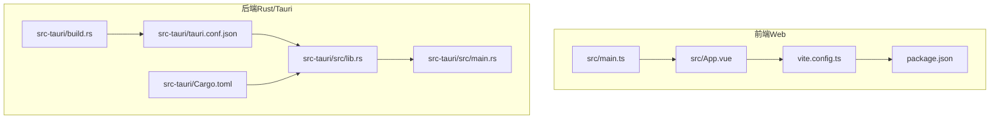
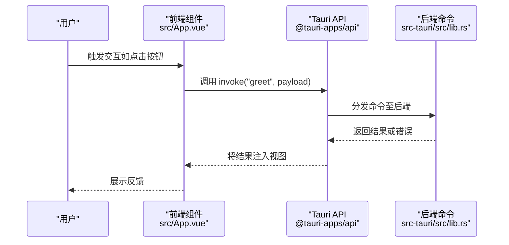
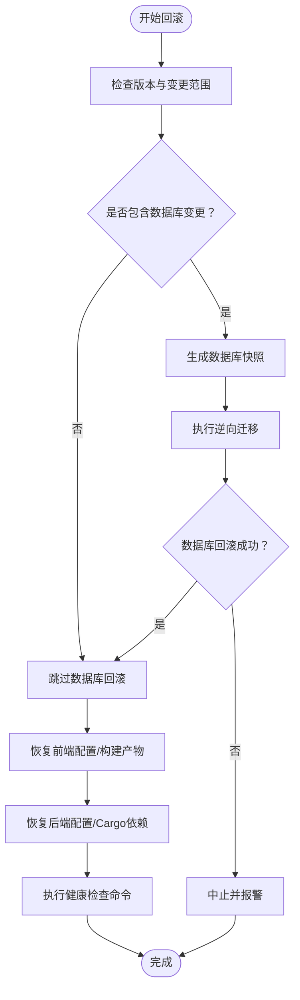
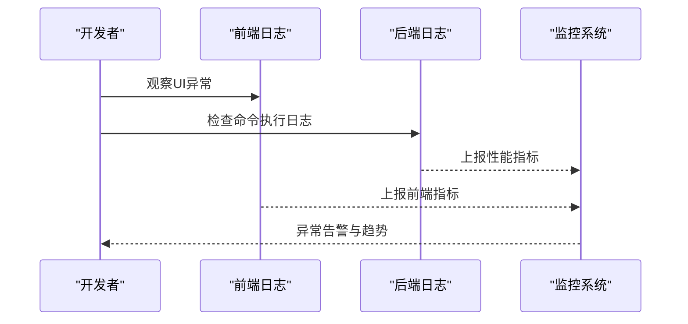
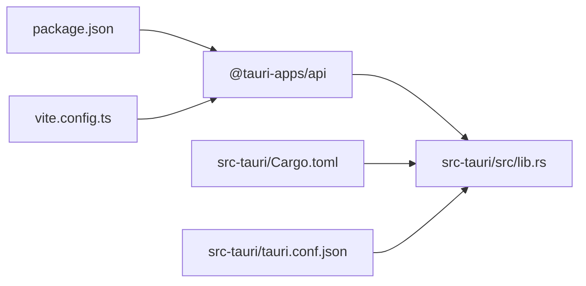

# 回滚与应急处理

<cite>
**本文引用的文件**   
- [README.md](file://README.md)
- [AGENTS.md](file://AGENTS.md)
- [package.json](file://package.json)
- [vite.config.ts](file://vite.config.ts)
- [src-tauri/Cargo.toml](file://src-tauri/Cargo.toml)
- [src-tauri/tauri.conf.json](file://src-tauri/tauri.conf.json)
- [src-tauri/build.rs](file://src-tauri/build.rs)
- [src-tauri/src/main.rs](file://src-tauri/src/main.rs)
- [src-tauri/src/lib.rs](file://src-tauri/src/lib.rs)
- [src/App.vue](file://src/App.vue)
- [src/main.ts](file://src/main.ts)
</cite>

## 目录
1. [简介](#简介)
2. [项目结构](#项目结构)
3. [核心组件](#核心组件)
4. [架构总览](#架构总览)
5. [详细组件分析](#详细组件分析)
6. [依赖关系分析](#依赖关系分析)
7. [性能考量](#性能考量)
8. [故障排查指南](#故障排查指南)
9. [结论](#结论)
10. [附录](#附录)

## 简介
本文件面向桌面应用的回滚与应急处理，结合当前仓库的前端（Vue + TypeScript）、后端（Rust via Tauri）与打包配置，系统化地给出版本回滚、应急修复、问题诊断、用户影响评估与沟通、服务降级、灾难恢复与闭环改进的实践建议。由于当前仓库为最小示例工程，未包含数据库、持久化存储与生产级监控/日志模块，因此以下策略以“可落地的通用方法”为主，强调可扩展性与与现有技术栈的衔接。

## 项目结构
该仓库采用“前端（Vite + Vue）+ 后端（Tauri + Rust）”的双层架构，开发与构建通过包管理器与Vite/Tauri CLI协调；应用运行时由Rust侧初始化并注册命令，前端通过Tauri API调用后端命令。

图示来源
- [src/main.ts:1-5](file://src/main.ts#L1-L5)
- [src/App.vue:1-160](file://src/App.vue#L1-L160)
- [vite.config.ts:1-33](file://vite.config.ts#L1-L33)
- [package.json:1-25](file://package.json#L1-L25)
- [src-tauri/build.rs:1-4](file://src-tauri/build.rs#L1-L4)
- [src-tauri/tauri.conf.json:1-36](file://src-tauri/tauri.conf.json#L1-L36)
- [src-tauri/Cargo.toml:1-26](file://src-tauri/Cargo.toml#L1-L26)
- [src-tauri/src/lib.rs:1-15](file://src-tauri/src/lib.rs#L1-L15)
- [src-tauri/src/main.rs:1-7](file://src-tauri/src/main.rs#L1-L7)

章节来源
- [README.md:1-17](file://README.md#L1-L17)
- [AGENTS.md:1-115](file://AGENTS.md#L1-L115)
- [package.json:1-25](file://package.json#L1-L25)
- [vite.config.ts:1-33](file://vite.config.ts#L1-L33)
- [src-tauri/Cargo.toml:1-26](file://src-tauri/Cargo.toml#L1-L26)
- [src-tauri/tauri.conf.json:1-36](file://src-tauri/tauri.conf.json#L1-L36)
- [src-tauri/build.rs:1-4](file://src-tauri/build.rs#L1-L4)
- [src-tauri/src/main.rs:1-7](file://src-tauri/src/main.rs#L1-L7)
- [src-tauri/src/lib.rs:1-15](file://src-tauri/src/lib.rs#L1-L15)
- [src/App.vue:1-160](file://src/App.vue#L1-L160)
- [src/main.ts:1-5](file://src/main.ts#L1-L5)

## 核心组件
- 前端入口与组件
  - 应用入口：负责挂载根组件，启动应用生命周期。
  - 示例组件：演示Tauri命令调用，展示前后端交互路径。
- 后端入口与命令
  - 应用入口：初始化Tauri应用上下文，注册插件与命令处理器。
  - 示例命令：提供一个可被前端调用的后端命令，便于验证回滚后的功能可用性。
- 构建与打包
  - 前端：Vite配置定义开发服务器端口、热更新与忽略目录；构建脚本在CI中复用。
  - 后端：Tauri配置定义产品名、版本、窗口尺寸、安全策略与打包目标；Cargo配置声明依赖与构建产物类型。

章节来源
- [src/main.ts:1-5](file://src/main.ts#L1-L5)
- [src/App.vue:1-160](file://src/App.vue#L1-L160)
- [src-tauri/src/lib.rs:1-15](file://src-tauri/src/lib.rs#L1-L15)
- [src-tauri/src/main.rs:1-7](file://src-tauri/src/main.rs#L1-L7)
- [vite.config.ts:1-33](file://vite.config.ts#L1-L33)
- [src-tauri/tauri.conf.json:1-36](file://src-tauri/tauri.conf.json#L1-L36)
- [src-tauri/Cargo.toml:1-26](file://src-tauri/Cargo.toml#L1-L26)

## 架构总览
下图展示了从用户操作到后端命令执行的关键路径，以及回滚与应急处理的切入位置。

图示来源
- [src/App.vue:1-160](file://src/App.vue#L1-L160)
- [src-tauri/src/lib.rs:1-15](file://src-tauri/src/lib.rs#L1-L15)

## 详细组件分析

### 回滚策略与技术实现
- 版本标识与发布元数据
  - 前后端均使用版本号作为回滚锚点，便于快速比对与切换。
  - 建议在构建阶段注入版本信息，并在应用内暴露只读接口供诊断使用。
- 数据库回滚
  - 若存在数据库：采用“迁移脚本+快照”的方式，先生成数据库快照，再按顺序执行逆向迁移；失败时回滚至快照。
  - 若无数据库：跳过此步骤，直接进入配置与应用状态回滚。
- 配置文件恢复
  - 前端配置：Vite配置与包管理脚本位于根目录，建议保留上一版本的构建产物与配置文件副本，以便快速替换。
  - 后端配置：Tauri配置与Cargo配置分别控制应用行为与依赖，建议在版本分支中维护关键配置的对比与差异。
- 应用状态还原
  - 利用后端命令进行自检：例如“问候”命令可作为健康检查的占位，确保命令注册与调用链路正常。
  - 对于有状态的业务逻辑，应在回滚前记录关键状态快照（内存/本地缓存），回滚后进行一致性校验与必要补偿。

图示来源
- [src-tauri/src/lib.rs:1-15](file://src-tauri/src/lib.rs#L1-L15)
- [src-tauri/tauri.conf.json:1-36](file://src-tauri/tauri.conf.json#L1-L36)
- [src-tauri/Cargo.toml:1-26](file://src-tauri/Cargo.toml#L1-L26)
- [vite.config.ts:1-33](file://vite.config.ts#L1-L33)

章节来源
- [src-tauri/src/lib.rs:1-15](file://src-tauri/src/lib.rs#L1-L15)
- [src-tauri/tauri.conf.json:1-36](file://src-tauri/tauri.conf.json#L1-L36)
- [src-tauri/Cargo.toml:1-26](file://src-tauri/Cargo.toml#L1-L26)
- [vite.config.ts:1-33](file://vite.config.ts#L1-L33)

### 紧急修复与热修复补丁
- 快速发布流程
  - 修复验证：在隔离环境复现问题，确认修复有效且不引入新问题。
  - 打包与签名：使用与正式版本一致的打包配置，确保产物可替换。
  - 分发策略：优先通过自动更新通道下发；若不可用，提供手动下载与覆盖安装。
- 补丁制作要点
  - 仅包含最小变更集，避免扩大影响面。
  - 在版本元数据中标注“hotfix”标记，便于追踪与回滚。
- 回滚触发条件
  - 自动检测到异常率上升或关键指标恶化时，自动回滚至上一稳定版本。

章节来源
- [AGENTS.md:1-115](file://AGENTS.md#L1-L115)
- [package.json:1-25](file://package.json#L1-L25)
- [src-tauri/tauri.conf.json:1-36](file://src-tauri/tauri.conf.json#L1-L36)

### 问题诊断与定位
- 日志收集
  - 前端：在开发模式下启用详细日志输出，生产模式可通过外部日志系统采集。
  - 后端：利用Rust日志库输出运行时日志，结合系统日志服务统一收集。
- 错误分析
  - 命令调用链路：从前端invoke到后端命令处理，逐段验证返回值与错误传播。
  - 健康检查：通过示例命令快速判断后端是否可用。
- 性能监控
  - 前端：统计页面渲染耗时、网络请求延迟与命令调用耗时。
  - 后端：监控命令执行时间、线程池与资源占用情况。

图示来源
- [src/App.vue:1-160](file://src/App.vue#L1-L160)
- [src-tauri/src/lib.rs:1-15](file://src-tauri/src/lib.rs#L1-L15)

章节来源
- [src/App.vue:1-160](file://src/App.vue#L1-L160)
- [src-tauri/src/lib.rs:1-15](file://src-tauri/src/lib.rs#L1-L15)

### 用户影响评估与沟通策略
- 影响评估
  - 通过版本变更范围与用户分布评估潜在影响面；对关键功能（如命令调用）进行回归测试。
- 沟通策略
  - 发布公告：说明问题背景、影响范围、修复方案与回滚计划。
  - 实时更新：在应用内显示维护提示或版本兼容性提示。
  - 支持渠道：提供FAQ与工单入口，收集用户反馈。

章节来源
- [AGENTS.md:1-115](file://AGENTS.md#L1-L115)
- [src-tauri/tauri.conf.json:1-36](file://src-tauri/tauri.conf.json#L1-L36)

### 服务降级方案
- 功能降级：当后端命令不可用时，前端提供降级UI与离线提示。
- 资源降级：降低前端资源加载策略（如延迟加载非关键资源），保证核心功能可用。
- 缓存降级：启用只读缓存模式，避免写入操作导致失败。

章节来源
- [src/App.vue:1-160](file://src/App.vue#L1-L160)
- [src-tauri/src/lib.rs:1-15](file://src-tauri/src/lib.rs#L1-L15)

### 灾难恢复与备份策略
- 备份内容
  - 前端：构建产物、关键配置文件、第三方依赖清单。
  - 后端：编译产物、配置文件、依赖树快照。
- 恢复流程
  - 从备份中恢复构建产物与配置，重新执行构建与签名，验证核心命令可用后上线。
- 最小化停机
  - 使用蓝绿部署或金丝雀发布，逐步切换流量，缩短回滚窗口。

章节来源
- [AGENTS.md:1-115](file://AGENTS.md#L1-L115)
- [package.json:1-25](file://package.json#L1-L25)
- [src-tauri/Cargo.toml:1-26](file://src-tauri/Cargo.toml#L1-L26)

### 问题跟踪与改进闭环
- 跟踪机制
  - 将每次回滚与应急事件记录到问题跟踪系统，标注原因、影响、处理过程与改进项。
- 改进闭环
  - 定期复盘：分析回滚触发原因，优化自动化检测与回滚策略。
  - 文档更新：完善应急预案与操作手册，确保团队成员可快速响应。

章节来源
- [AGENTS.md:1-115](file://AGENTS.md#L1-L115)
- [README.md:1-17](file://README.md#L1-L17)

## 依赖关系分析
- 前端依赖
  - Vue 3、@tauri-apps/api用于与后端通信；Vite提供开发与构建能力。
- 后端依赖
  - Tauri框架、opener插件、序列化库；通过Cargo管理依赖与构建产物类型。
- 配置依赖
  - Tauri配置决定应用窗口、安全策略与打包目标；Vite配置决定开发服务器与热更新行为。

图示来源
- [package.json:1-25](file://package.json#L1-L25)
- [src-tauri/Cargo.toml:1-26](file://src-tauri/Cargo.toml#L1-L26)
- [vite.config.ts:1-33](file://vite.config.ts#L1-L33)
- [src-tauri/tauri.conf.json:1-36](file://src-tauri/tauri.conf.json#L1-L36)
- [src-tauri/src/lib.rs:1-15](file://src-tauri/src/lib.rs#L1-L15)

章节来源
- [package.json:1-25](file://package.json#L1-L25)
- [src-tauri/Cargo.toml:1-26](file://src-tauri/Cargo.toml#L1-L26)
- [vite.config.ts:1-33](file://vite.config.ts#L1-L33)
- [src-tauri/tauri.conf.json:1-36](file://src-tauri/tauri.conf.json#L1-L36)
- [src-tauri/src/lib.rs:1-15](file://src-tauri/src/lib.rs#L1-L15)

## 性能考量
- 前端性能
  - 控制首屏资源体积，减少不必要的依赖；合理拆分构建产物，支持增量更新。
- 后端性能
  - 命令处理应尽量轻量化，避免阻塞主线程；对重任务采用异步或后台线程处理。
- 回滚性能
  - 回滚流程应尽可能自动化与幂等，减少人工干预与重复工作。

## 故障排查指南
- 常见问题
  - 命令无法调用：检查命令注册与命名空间，确认前端invoke参数正确。
  - 开发服务器端口冲突：调整Vite配置中的端口与严格模式设置。
  - 构建失败：核对依赖版本与构建脚本，确保与历史版本一致。
- 快速验证
  - 使用示例命令进行端到端验证，确认前后端通信链路正常。

章节来源
- [src/App.vue:1-160](file://src/App.vue#L1-L160)
- [src-tauri/src/lib.rs:1-15](file://src-tauri/src/lib.rs#L1-L15)
- [vite.config.ts:1-33](file://vite.config.ts#L1-L33)
- [AGENTS.md:1-115](file://AGENTS.md#L1-L115)

## 结论
本文件基于当前仓库的最小化结构，提出了可扩展的回滚与应急处理框架：以版本号为锚点，结合数据库快照、配置恢复与健康检查命令，形成“可回退、可诊断、可降级、可恢复”的闭环。随着业务演进，可在现有基础上接入数据库迁移工具、日志与监控平台、自动更新通道与灰度发布策略，持续提升系统的稳定性与可运维性。

## 附录
- 关键文件索引
  - 前端入口与组件：[src/main.ts:1-5](file://src/main.ts#L1-L5)、[src/App.vue:1-160](file://src/App.vue#L1-L160)
  - 后端入口与命令：[src-tauri/src/main.rs:1-7](file://src-tauri/src/main.rs#L1-L7)、[src-tauri/src/lib.rs:1-15](file://src-tauri/src/lib.rs#L1-L15)
  - 构建与打包：[vite.config.ts:1-33](file://vite.config.ts#L1-L33)、[src-tauri/tauri.conf.json:1-36](file://src-tauri/tauri.conf.json#L1-L36)、[src-tauri/Cargo.toml:1-26](file://src-tauri/Cargo.toml#L1-L26)
  - 包管理与脚本：[package.json:1-25](file://package.json#L1-L25)
  - 开发与规范：[AGENTS.md:1-115](file://AGENTS.md#L1-L115)、[README.md:1-17](file://README.md#L1-L17)