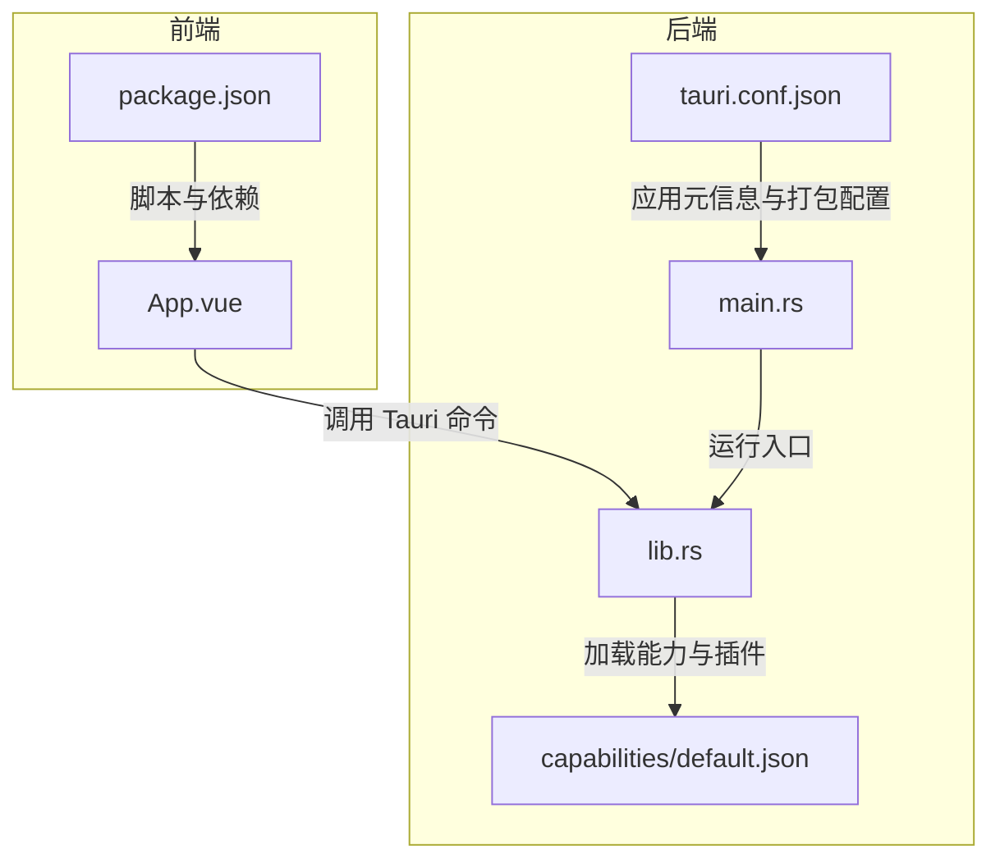
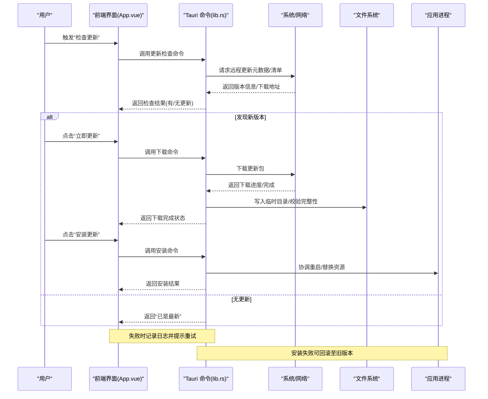
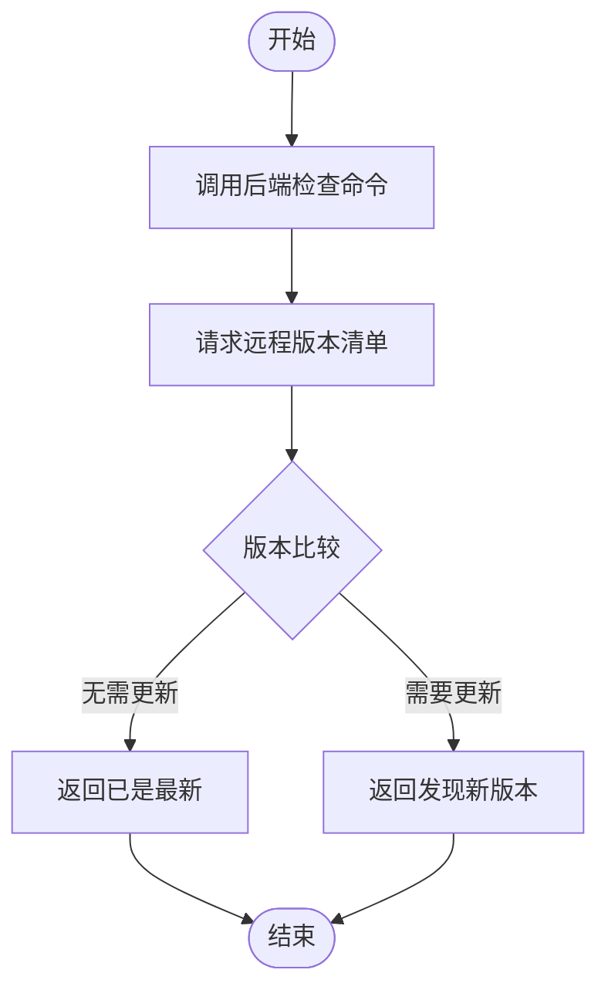
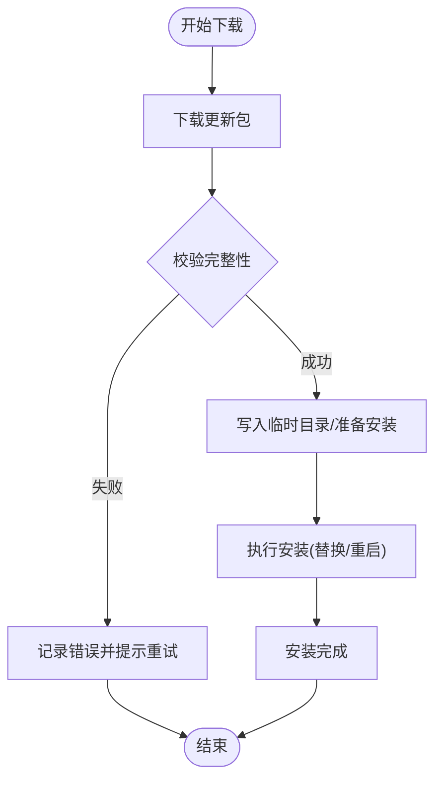
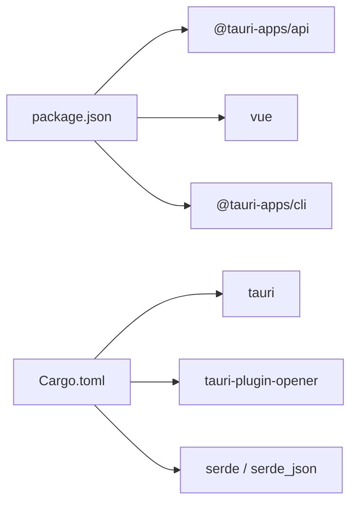

# 应用更新机制

<cite>
**本文引用的文件**
- [tauri.conf.json](file://src-tauri/tauri.conf.json)
- [Cargo.toml](file://src-tauri/Cargo.toml)
- [lib.rs](file://src-tauri/src/lib.rs)
- [main.rs](file://src-tauri/src/main.rs)
- [App.vue](file://src/App.vue)
- [package.json](file://package.json)
- [default.json](file://src-tauri/capabilities/default.json)
- [README.md](file://README.md)
- [AGENTS.md](file://AGENTS.md)
</cite>

## 目录
1. [简介](#简介)
2. [项目结构](#项目结构)
3. [核心组件](#核心组件)
4. [架构总览](#架构总览)
5. [详细组件分析](#详细组件分析)
6. [依赖分析](#依赖分析)
7. [性能考虑](#性能考虑)
8. [故障排查指南](#故障排查指南)
9. [结论](#结论)
10. [附录](#附录)

## 简介
本指南围绕 Tauri 应用的“应用更新机制”展开，目标是帮助开发者在现有仓库基础上实现自动更新（检查、下载、安装）、手动更新配置与用户操作指引、更新包生成与分发策略（全量与增量）、失败回滚与错误处理、更新通知与体验优化，以及不同平台的差异与特殊处理。  
当前仓库未包含任何更新相关配置或命令实现，因此本指南以“如何在该代码库中集成 Tauri 更新能力”为主线，提供可落地的实施步骤与最佳实践。

## 项目结构
该仓库采用典型的 Tauri 2 前后端分离结构：前端使用 Vue 3 + TypeScript + Vite；后端使用 Rust（通过 Tauri 2 暴露命令与系统能力）。构建产物由前端打包到 dist 目录，再由 Tauri 打包为桌面应用。

图表来源
- [main.rs:1-7](file://src-tauri/src/main.rs#L1-L7)
- [lib.rs:1-15](file://src-tauri/src/lib.rs#L1-L15)
- [tauri.conf.json:1-36](file://src-tauri/tauri.conf.json#L1-L36)
- [default.json:1-11](file://src-tauri/capabilities/default.json#L1-L11)
- [App.vue:1-160](file://src/App.vue#L1-L160)
- [package.json:1-25](file://package.json#L1-L25)

章节来源
- [AGENTS.md:73-90](file://AGENTS.md#L73-L90)
- [README.md:1-17](file://README.md#L1-L17)

## 核心组件
- 前端交互层：负责触发更新检查、展示更新进度与结果、引导用户进行手动更新等。
- 后端命令层：通过 Tauri 命令暴露更新相关逻辑（如检查更新、下载、安装），并与系统能力（如 opener 插件）协作。
- 配置层：应用元信息、打包目标、权限与能力声明等，决定更新行为的边界与可用性。
- 能力与插件：默认已启用 opener 插件，可用于打开外部链接或更新页面。

章节来源
- [lib.rs:1-15](file://src-tauri/src/lib.rs#L1-L15)
- [default.json:1-11](file://src-tauri/capabilities/default.json#L1-L11)
- [package.json:12-16](file://package.json#L12-L16)

## 架构总览
下图展示了从用户触发到完成更新的整体流程，涵盖自动更新与手动更新两条路径，并标注了错误处理与回滚的关键节点。

图表来源
- [lib.rs:1-15](file://src-tauri/src/lib.rs#L1-L15)
- [App.vue:1-160](file://src/App.vue#L1-L160)

## 详细组件分析

### 1) 更新检查流程
- 触发方式：前端通过 Tauri 命令调用后端实现的“检查更新”逻辑。
- 数据源：远程服务器返回版本清单（含版本号、发布说明、下载地址、校验值等）。
- 结果判定：比较本地版本与远端版本，决定是否需要更新。
- 用户反馈：根据结果展示“已是最新”或“发现新版本”。

图表来源
- [lib.rs:1-15](file://src-tauri/src/lib.rs#L1-L15)
- [App.vue:1-160](file://src/App.vue#L1-L160)

章节来源
- [lib.rs:1-15](file://src-tauri/src/lib.rs#L1-L15)
- [App.vue:1-160](file://src/App.vue#L1-L160)

### 2) 更新下载与安装
- 下载阶段：后端发起下载，支持断点续传与进度回调；完成后进行完整性校验。
- 安装阶段：协调应用重启或替换资源，确保新版本生效。
- 回滚策略：若安装失败，保留旧版本并恢复关键文件，避免应用不可用。

图表来源
- [lib.rs:1-15](file://src-tauri/src/lib.rs#L1-L15)

章节来源
- [lib.rs:1-15](file://src-tauri/src/lib.rs#L1-L15)

### 3) 手动更新配置与用户操作
- 前端操作：在界面上提供“检查更新”“立即更新”“安装更新”按钮，并显示进度与状态。
- 后端命令：新增“检查更新”“下载更新”“安装更新”三个命令，分别对应上述流程节点。
- 用户指引：在“关于”或设置页提供“前往官网下载最新版”的链接（若采用手动更新）。

章节来源
- [App.vue:1-160](file://src/App.vue#L1-L160)
- [lib.rs:1-15](file://src-tauri/src/lib.rs#L1-L15)
- [package.json:12-16](file://package.json#L12-L16)

### 4) 更新包生成与分发策略
- 全量更新：适用于重大版本或资源变更频繁场景，便于统一管理但占用带宽较大。
- 增量更新：仅传输差异内容，节省流量与时间，适合频繁小版本迭代。
- 分发策略：可结合 CDN 与多镜像源，按地区与网络状况选择最优节点；对大文件启用压缩与断点续传。

章节来源
- [tauri.conf.json:24-34](file://src-tauri/tauri.conf.json#L24-L34)

### 5) 错误处理与回滚机制
- 错误分类：网络异常、签名不匹配、磁盘空间不足、权限不足等。
- 处理策略：记录详细日志、向用户展示可读错误信息、提供重试与取消选项。
- 回滚：安装前备份关键资源，安装失败时恢复备份，保证应用可启动。

章节来源
- [lib.rs:1-15](file://src-tauri/src/lib.rs#L1-L15)

### 6) 更新通知与体验优化
- 通知形式：系统托盘通知、弹窗提醒、内嵌消息卡片。
- 交互设计：允许用户延迟更新、静默后台下载、自动重启等选项。
- 无障碍：提供键盘快捷键、屏幕阅读器支持与高对比度主题适配。

章节来源
- [default.json:1-11](file://src-tauri/capabilities/default.json#L1-L11)

### 7) 不同平台的差异与特殊处理
- Windows：注意管理员权限、杀软拦截、Windows Defender SmartScreen 提示；可使用自签名证书与代码签名减少误报。
- macOS：沙盒限制、公证要求、Gatekeeper 策略；需在构建时配置 Info.plist 与权限。
- Linux：发行版差异、桌面环境兼容性、AppImage/Flatpak 打包注意事项。

章节来源
- [tauri.conf.json:24-34](file://src-tauri/tauri.conf.json#L24-L34)

## 依赖分析
- 前端依赖：Vue 3、@tauri-apps/api、@tauri-apps/plugin-opener 等。
- 后端依赖：tauri、tauri-plugin-opener、serde、serde_json 等。
- 构建工具：Vite、Tauri CLI、Rust 编译链。

图表来源
- [package.json:12-23](file://package.json#L12-L23)
- [Cargo.toml:20-25](file://src-tauri/Cargo.toml#L20-L25)

章节来源
- [package.json:1-25](file://package.json#L1-L25)
- [Cargo.toml:1-26](file://src-tauri/Cargo.toml#L1-L26)

## 性能考虑
- 下载优化：启用断点续传、多线程下载、压缩传输；对大文件分块校验。
- 安装优化：离线安装、增量合并、最小化重启次数。
- 资源管理：及时清理临时文件与缓存，避免磁盘占用过高。

## 故障排查指南
- 常见问题
  - 网络超时/连接失败：检查代理与防火墙设置，增加重试与超时参数。
  - 权限不足：在 Windows 提升权限，在 macOS 授予相应权限。
  - 校验失败：确认签名与哈希算法一致，检查网络中间人攻击风险。
- 日志与诊断
  - 启用详细日志输出，定位具体失败环节。
  - 在安装失败时保留日志与备份，便于回溯分析。
- 用户自助
  - 提供“重试”“跳过”“手动下载”等选项，降低用户等待成本。

章节来源
- [lib.rs:1-15](file://src-tauri/src/lib.rs#L1-L15)

## 结论
本指南基于当前仓库现状，给出了在 Tauri 应用中集成“应用更新机制”的完整路线图：从前端交互、后端命令、配置与能力声明，到更新包生成与分发、错误处理与回滚、通知与体验优化，以及跨平台差异处理。由于当前仓库未包含更新相关实现，建议按照本指南逐步添加命令与 UI 组件，并结合实际业务场景选择全量或增量更新策略。

## 附录
- 开发与构建命令参考
  - 开发：pnpm tauri dev 或 pnpm dev
  - 构建：pnpm tauri build 或 pnpm build
  - 预览：pnpm preview
- 关键文件定位
  - 前端入口与组件：src/App.vue、src/main.ts
  - 后端入口与命令：src-tauri/src/main.rs、src-tauri/src/lib.rs
  - 应用配置：src-tauri/tauri.conf.json
  - 能力与权限：src-tauri/capabilities/default.json
  - 依赖与脚本：package.json、src-tauri/Cargo.toml

章节来源
- [AGENTS.md:11-29](file://AGENTS.md#L11-L29)
- [README.md:1-17](file://README.md#L1-L17)