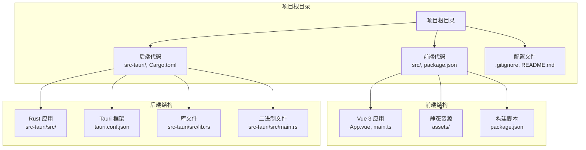
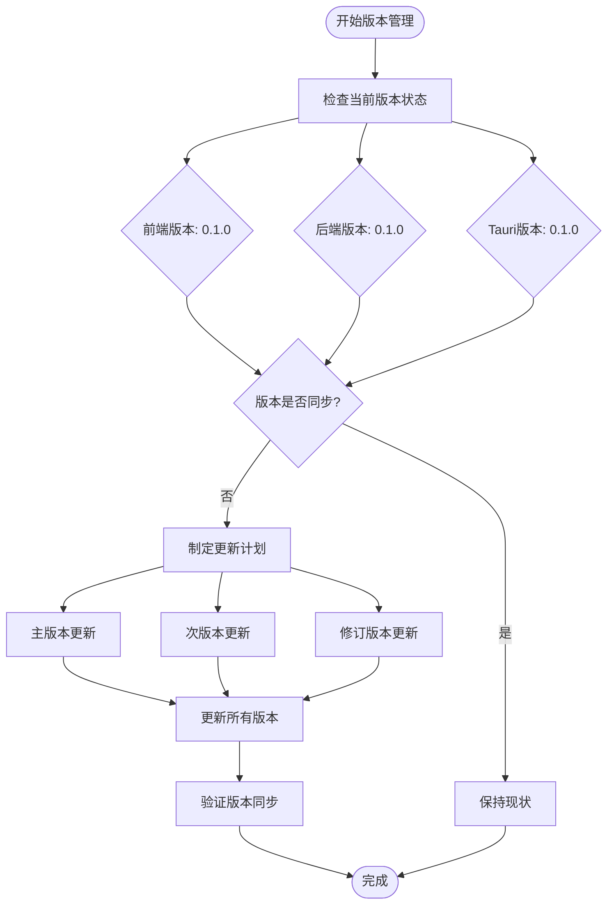
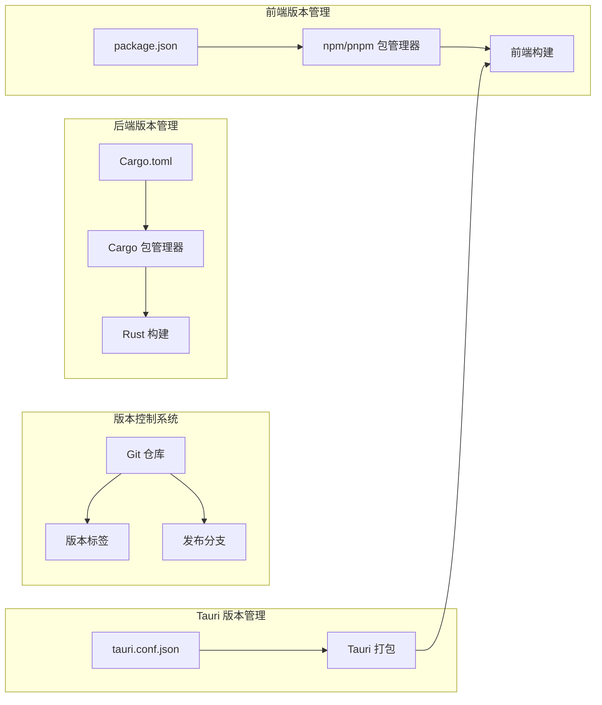
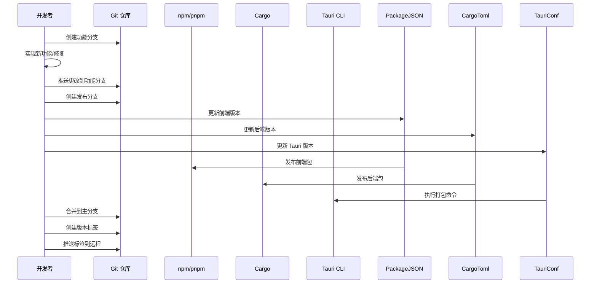
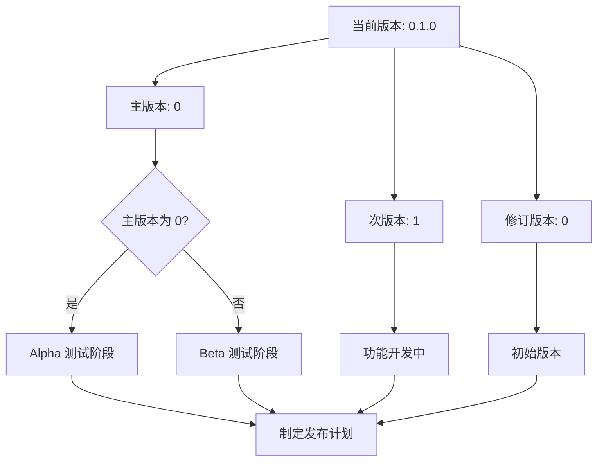
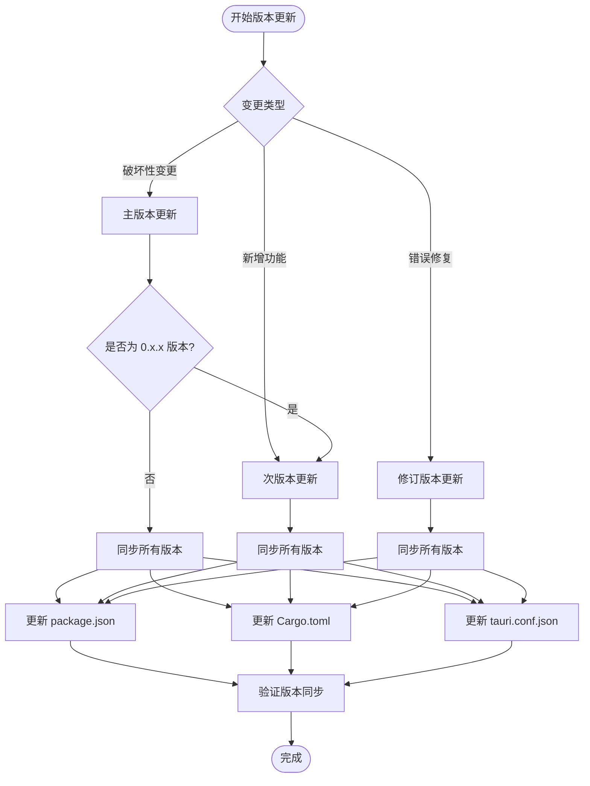
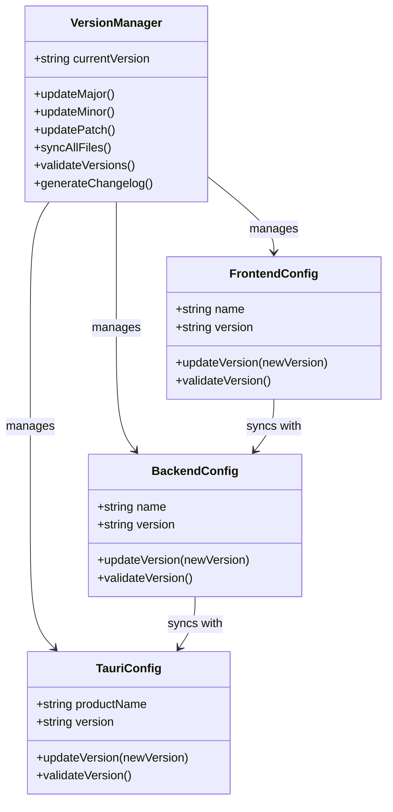
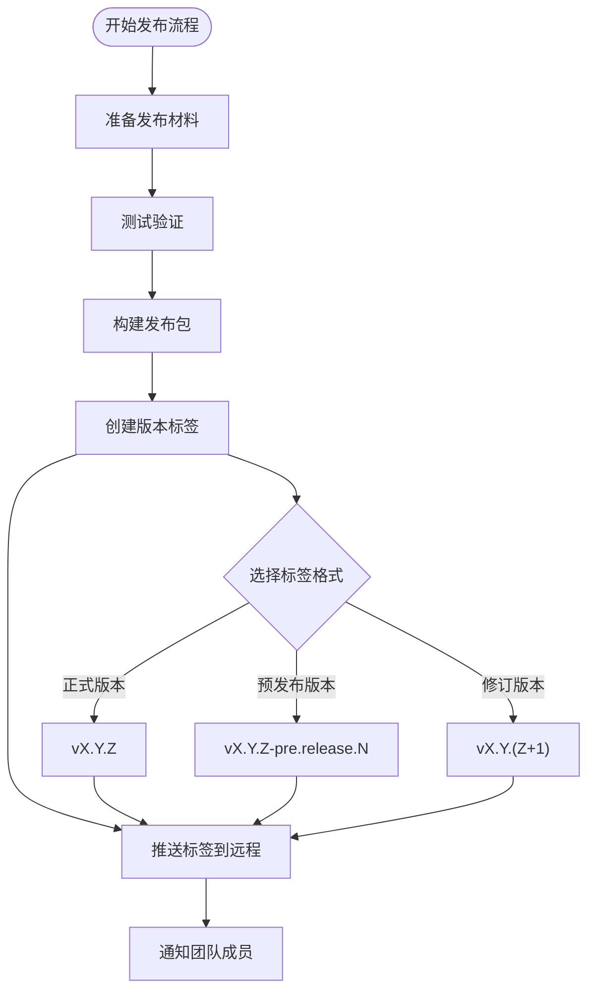

# 版本控制策略

<cite>
**本文档引用的文件**
- [package.json](file://package.json)
- [Cargo.toml](file://src-tauri/Cargo.toml)
- [tauri.conf.json](file://src-tauri/tauri.conf.json)
- [README.md](file://README.md)
- [pnpm-lock.yaml](file://pnpm-lock.yaml)
</cite>

## 目录
1. [简介](#简介)
2. [项目结构](#项目结构)
3. [核心组件](#核心组件)
4. [架构概览](#架构概览)
5. [详细组件分析](#详细组件分析)
6. [依赖关系分析](#依赖关系分析)
7. [性能考虑](#性能考虑)
8. [故障排除指南](#故障排除指南)
9. [结论](#结论)

## 简介

本项目是一个基于 Tauri + Vue + TypeScript 的跨平台桌面应用程序。根据当前代码库分析，项目采用语义化版本控制（Semantic Versioning）策略，但目前尚未实现完整的版本同步机制。本文档将详细解释语义化版本控制在本项目中的应用方式，包括主版本号、次版本号、修订号的定义和更新规则，并提供版本号同步的最佳实践建议。

## 项目结构

该项目采用典型的 Tauri 应用程序结构，包含前端和后端两个主要部分：



**图表来源**
- [package.json:1-25](file://package.json#L1-L25)
- [Cargo.toml:1-26](file://src-tauri/Cargo.toml#L1-L26)
- [tauri.conf.json:1-36](file://src-tauri/tauri.conf.json#L1-L36)

**章节来源**
- [package.json:1-25](file://package.json#L1-L25)
- [Cargo.toml:1-26](file://src-tauri/Cargo.toml#L1-L26)
- [tauri.conf.json:1-36](file://src-tauri/tauri.conf.json#L1-L36)

## 核心组件

### 当前版本状态分析

根据现有配置文件，项目当前版本为 `0.1.0`，分布在多个位置：

| 组件 | 文件路径 | 当前版本 | 用途 |
|------|----------|----------|------|
| 前端应用 | package.json | 0.1.0 | Vue.js 应用版本 |
| 后端应用 | Cargo.toml | 0.1.0 | Rust 应用版本 |
| Tauri 应用 | tauri.conf.json | 0.1.0 | Tauri 配置版本 |

### 版本配置文件对比



**图表来源**
- [package.json:4](file://package.json#L4)
- [Cargo.toml:3](file://src-tauri/Cargo.toml#L3)
- [tauri.conf.json:4](file://src-tauri/tauri.conf.json#L4)

**章节来源**
- [package.json:4](file://package.json#L4)
- [Cargo.toml:3](file://src-tauri/Cargo.toml#L3)
- [tauri.conf.json:4](file://src-tauri/tauri.conf.json#L4)

## 架构概览

### 版本控制架构



**图表来源**
- [package.json:1-25](file://package.json#L1-L25)
- [Cargo.toml:1-26](file://src-tauri/Cargo.toml#L1-L26)
- [tauri.conf.json:1-36](file://src-tauri/tauri.conf.json#L1-L36)

### 版本同步流程



**图表来源**
- [package.json:1-25](file://package.json#L1-L25)
- [Cargo.toml:1-26](file://src-tauri/Cargo.toml#L1-L26)
- [tauri.conf.json:1-36](file://src-tauri/tauri.conf.json#L1-L36)

## 详细组件分析

### 语义化版本控制应用

#### 版本号定义规则

根据语义化版本控制（SemVer 2.0.0）标准，本项目应遵循以下规则：

| 版本号组成部分 | 定义 | 升级触发条件 | 影响范围 |
|---------------|------|-------------|----------|
| 主版本号 (Major) | 重大不兼容变更 | 破坏性更新、API 变更、架构调整 | 全部组件 |
| 次版本号 (Minor) | 向后兼容的功能新增 | 新功能添加、非破坏性改进 | 前端、后端 |
| 修订号 (Patch) | 向后兼容的问题修正 | 错误修复、小改进 | 前端、后端 |

#### 当前版本状态评估



**图表来源**
- [package.json:4](file://package.json#L4)
- [Cargo.toml:3](file://src-tauri/Cargo.toml#L3)
- [tauri.conf.json:4](file://src-tauri/tauri.conf.json#L4)

#### 版本更新决策树



**图表来源**
- [package.json:4](file://package.json#L4)
- [Cargo.toml:3](file://src-tauri/Cargo.toml#L3)
- [tauri.conf.json:4](file://src-tauri/tauri.conf.json#L4)

**章节来源**
- [package.json:4](file://package.json#L4)
- [Cargo.toml:3](file://src-tauri/Cargo.toml#L3)
- [tauri.conf.json:4](file://src-tauri/tauri.conf.json#L4)

### 版本同步机制

#### 当前状态分析

根据代码库分析，当前存在以下版本管理问题：

1. **版本不同步**：虽然三个配置文件都使用相同的版本号，但在实际开发中可能存在不同步的情况
2. **缺少自动化工具**：没有自动化的版本更新脚本
3. **缺乏版本验证**：没有机制确保版本在所有相关文件中保持一致

#### 建议的同步策略



**图表来源**
- [package.json:1-25](file://package.json#L1-L25)
- [Cargo.toml:1-26](file://src-tauri/Cargo.toml#L1-L26)
- [tauri.conf.json:1-36](file://src-tauri/tauri.conf.json#L1-L36)

### 版本标签命名规范

#### 建议的标签格式

| 标签类型 | 格式示例 | 使用场景 |
|----------|----------|----------|
| 正式版本 | v1.2.3 | 生产环境发布 |
| 预发布版本 | v1.2.3-alpha.1 | Alpha 测试版本 |
| 预发布版本 | v1.2.3-beta.2 | Beta 测试版本 |
| 预发布版本 | v1.2.3-rc.1 | RC 测试版本 |
| 修订版本 | v1.2.4 | 紧急安全修复 |

#### 标签创建流程



**图表来源**
- [package.json:4](file://package.json#L4)
- [Cargo.toml:3](file://src-tauri/Cargo.toml#L3)
- [tauri.conf.json:4](file://src-tauri/tauri.conf.json#L4)

**章节来源**
- [package.json:4](file://package.json#L4)
- [Cargo.toml:3](file://src-tauri/Cargo.toml#L3)
- [tauri.conf.json:4](file://src-tauri/tauri.conf.json#L4)

### 发布分支管理策略

#### 分支模型建议

```mermaid
gitgraph
commit id: "Initial Commit"
branch develop
checkout develop
commit id: "Feature A"
commit id: "Feature B"
branch feature/new-ui
checkout feature/new-ui
commit id: "UI Redesign"
checkout develop
merge feature/new-ui
branch release/v1.2.0
checkout release/v1.2.0
commit id: "Final Testing"
commit id: "Bug Fixes"
checkout develop
merge release/v1.2.0
branch hotfix/1.2.1
checkout hotfix/1.2.1
commit id: "Security Patch"
checkout develop
merge hotfix/1.2.1
```

#### 分支命名规范

| 分支类型 | 命名格式 | 使用场景 |
|----------|----------|----------|
| 开发分支 | develop | 日常开发 |
| 功能分支 | feature/功能名称 | 新功能开发 |
| 发布分支 | release/vX.Y.Z | 准备发布 |
| 热修复分支 | hotfix/X.Y.Z | 紧急修复 |
| 文档分支 | docs/文档主题 | 文档更新 |

**章节来源**
- [README.md:1-17](file://README.md#L1-L17)

## 依赖关系分析

### 版本依赖关系

```mermaid
graph TB
subgraph "前端依赖"
Vue[Vue 3.5.13]
TauriAPI[@tauri-apps/api ^2]
Vite[Vite 6.0.3]
TypeScript[TypeScript 5.6.2]
end
subgraph "后端依赖"
TauriRust[Tauri 2.x]
Serde[Serde 1.x]
TauriOpener[tauri-plugin-opener 2]
end
subgraph "开发工具"
VueTSC[vue-tsc 2.1.10]
VitePlugin[@vitejs/plugin-vue 5.2.1]
TauriCLI[@tauri-apps/cli 2]
end
Vue --> TauriAPI
Vite --> Vue
TypeScript --> Vue
TauriRust --> Serde
TauriRust --> TauriOpener
TauriCLI --> TauriRust
```

**图表来源**
- [package.json:12-23](file://package.json#L12-L23)
- [Cargo.toml:20-24](file://src-tauri/Cargo.toml#L20-L24)

### 版本兼容性矩阵

| 组件 | 当前版本 | 最低兼容版本 | 推荐版本 | 备注 |
|------|----------|--------------|----------|------|
| Vue | 3.5.13 | 3.2.0 | 3.5.x | 前端框架 |
| @tauri-apps/api | ^2 | 2.0.0 | 2.x | Tauri API |
| Tauri CLI | ^2 | 2.0.0 | 2.x | 开发工具 |
| Tauri (Rust) | 2.x | 2.0.0 | 2.x | 后端框架 |
| TypeScript | ~5.6.2 | 5.0.0 | 5.6.x | 类型系统 |
| Vite | ^6.0.3 | 6.0.0 | 6.x | 构建工具 |

**图表来源**
- [package.json:12-23](file://package.json#L12-L23)
- [Cargo.toml:20-24](file://src-tauri/Cargo.toml#L20-L24)

**章节来源**
- [package.json:12-23](file://package.json#L12-L23)
- [Cargo.toml:20-24](file://src-tauri/Cargo.toml#L20-L24)

## 性能考虑

### 版本管理性能影响

1. **构建时间优化**：合理的版本分离可以减少不必要的重新构建
2. **缓存策略**：版本标签有助于更好的缓存管理
3. **部署效率**：清晰的版本控制简化了部署流程

### 版本同步开销

- **手动同步**：每次版本更新需要修改多个文件，容易出错
- **自动化同步**：通过脚本自动更新所有相关文件，提高准确性
- **CI/CD 集成**：在持续集成流程中自动处理版本更新

## 故障排除指南

### 常见版本问题

#### 版本不同步问题

**症状**：
- 前端版本与后端版本不一致
- Tauri 配置版本与其他组件不匹配

**解决方案**：
1. 使用统一的版本更新脚本
2. 在 CI/CD 流程中添加版本验证步骤
3. 建立版本同步检查机制

#### 版本标签冲突

**症状**：
- 创建版本标签时出现冲突
- 推送到远程仓库失败

**解决方案**：
1. 确保在正确的分支上创建标签
2. 使用唯一的标签命名约定
3. 在推送前先同步远程状态

#### 依赖版本冲突

**症状**：
- 构建过程中出现依赖版本冲突
- 运行时出现兼容性问题

**解决方案**：
1. 定期更新依赖包
2. 使用锁定文件确保一致性
3. 建立依赖版本审查流程

**章节来源**
- [pnpm-lock.yaml:1-200](file://pnpm-lock.yaml#L1-L200)

## 结论

本项目目前处于早期开发阶段（0.1.0），已经采用了语义化版本控制的基本概念。为了建立完善的版本管理体系，建议实施以下改进措施：

1. **建立自动化版本管理工具**：开发统一的版本更新脚本，确保前端、后端和 Tauri 配置文件的版本同步

2. **完善版本标签策略**：制定明确的版本标签命名规范，支持预发布版本和修订版本的管理

3. **优化发布分支流程**：建立标准化的发布分支管理策略，支持并行开发和紧急修复

4. **加强版本验证机制**：在 CI/CD 流程中加入版本同步验证，防止版本不一致问题

5. **文档化版本管理流程**：编写详细的版本管理操作指南，确保团队成员的一致理解

通过实施这些改进措施，本项目将能够建立更加成熟和可靠的版本控制体系，为后续的稳定发展奠定坚实基础。